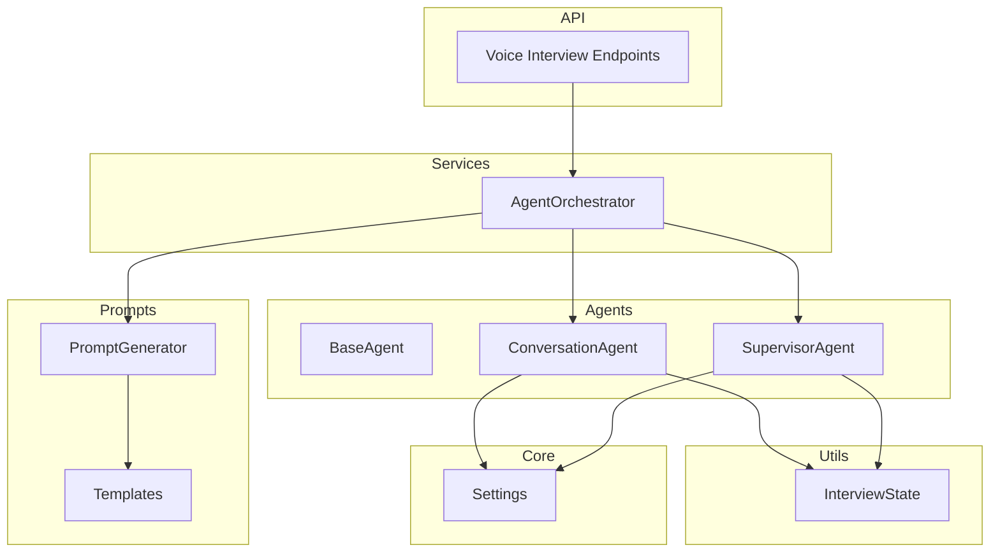
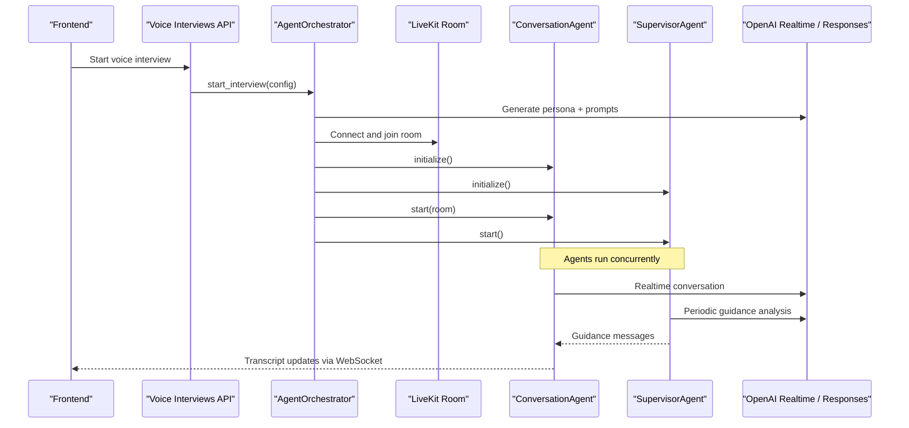
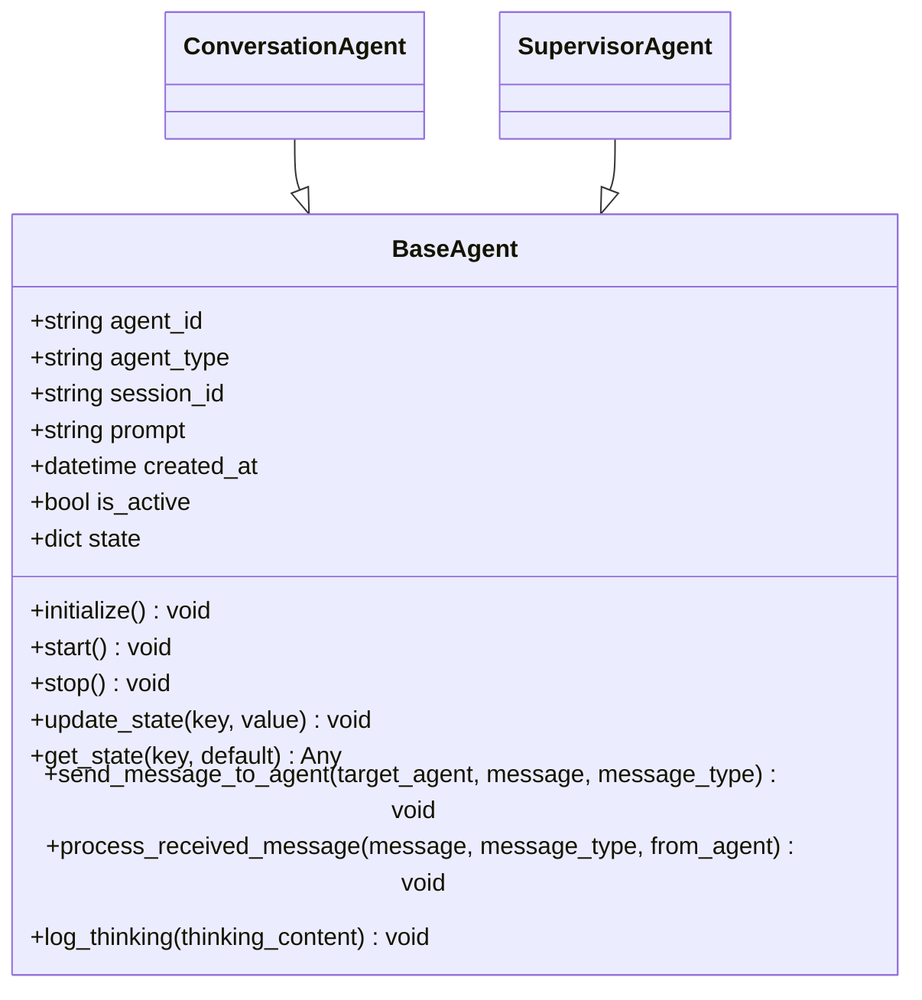
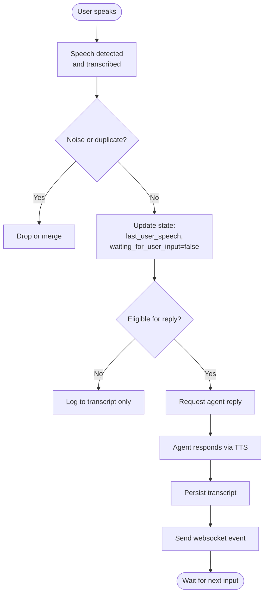
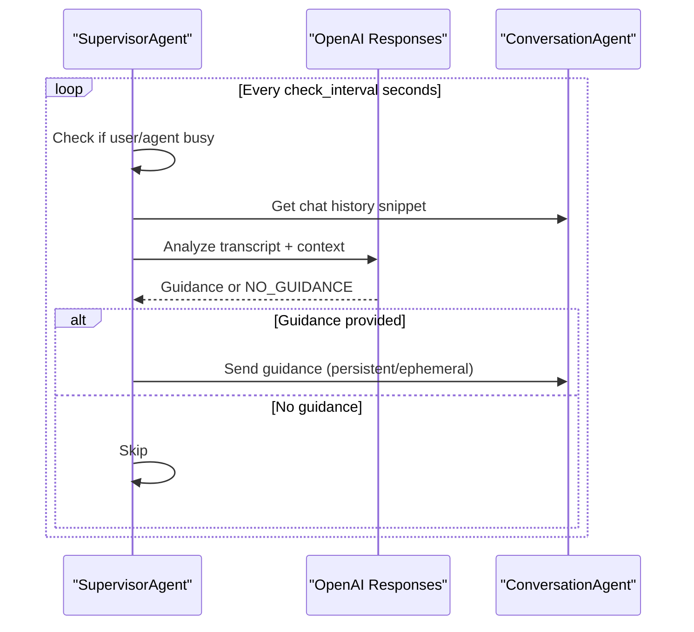
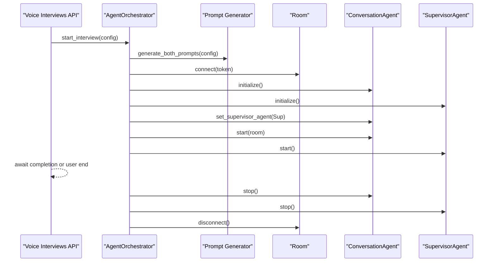
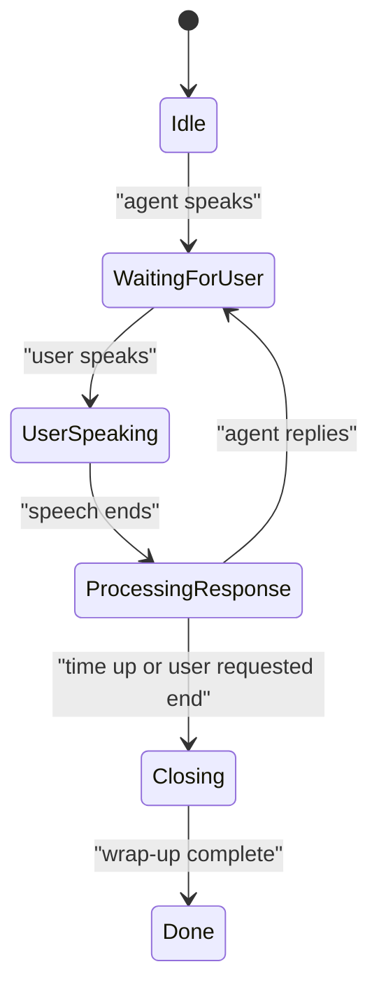
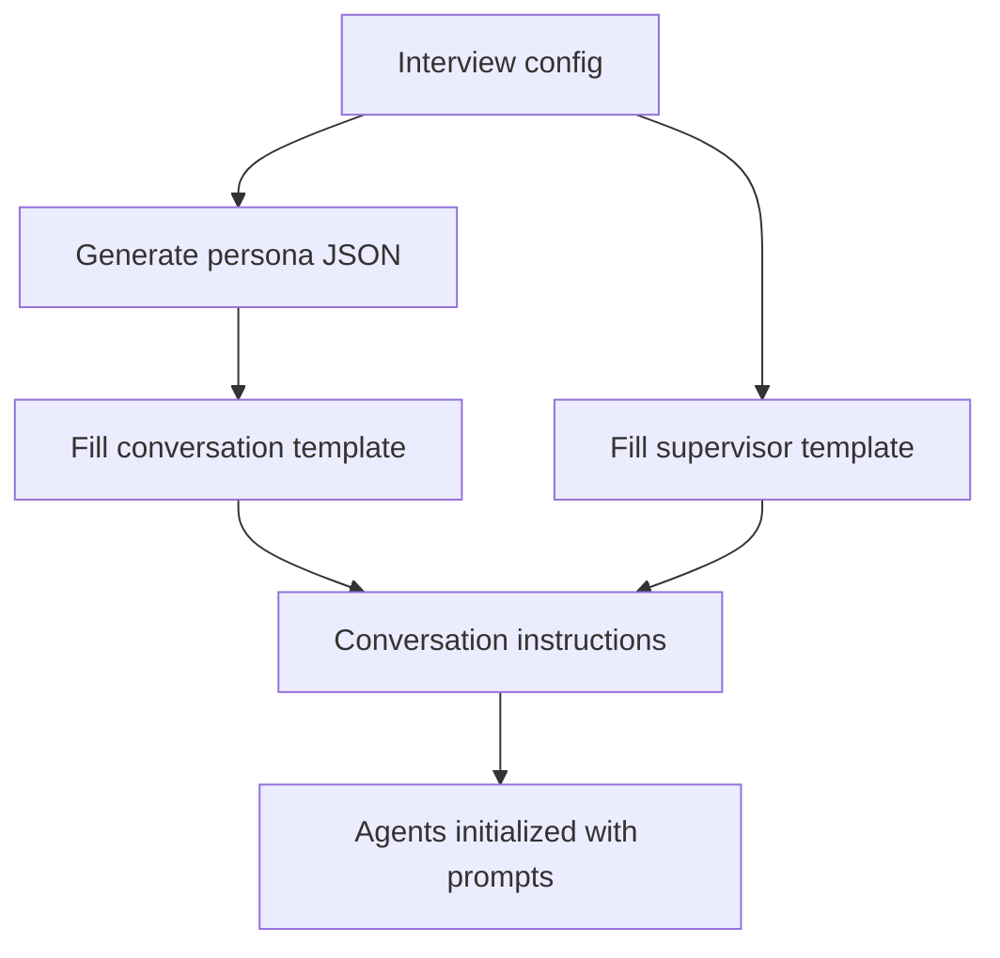
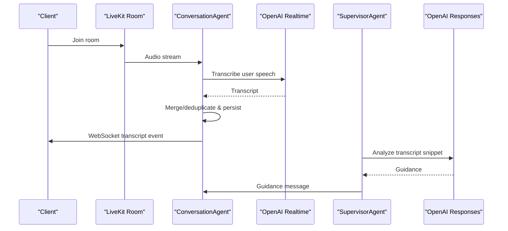
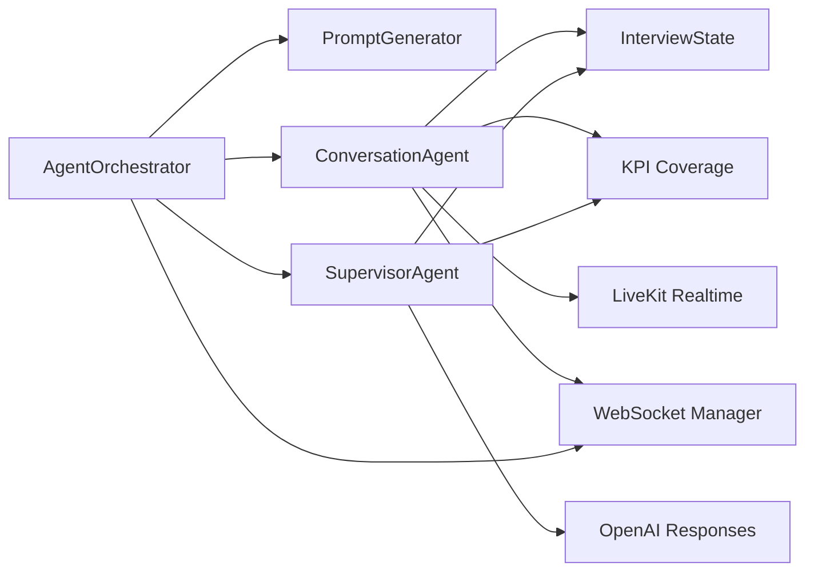

# AI Agent System

<cite>
**Referenced Files in This Document**
- [base.py](file://Backend/app/ai/agents/base.py)
- [conversation.py](file://Backend/app/ai/agents/conversation.py)
- [supervisor.py](file://Backend/app/ai/agents/supervisor.py)
- [agent_orchestrator.py](file://Backend/app/ai/services/agent_orchestrator.py)
- [generator.py](file://Backend/app/ai/prompts/generator.py)
- [templates.py](file://Backend/app/ai/prompts/templates.py)
- [interview_state.py](file://Backend/app/ai/utils/interview_state.py)
- [config.py](file://Backend/app/core/config.py)
- [voice_interview.py](file://Backend/app/services/voice_interview.py)
- [voice_interviews.py](file://Backend/app/api/v1/voice_interviews.py)
</cite>

## Table of Contents
1. [Introduction](#introduction)
2. [Project Structure](#project-structure)
3. [Core Components](#core-components)
4. [Architecture Overview](#architecture-overview)
5. [Detailed Component Analysis](#detailed-component-analysis)
6. [Dependency Analysis](#dependency-analysis)
7. [Performance Considerations](#performance-considerations)
8. [Troubleshooting Guide](#troubleshooting-guide)
9. [Conclusion](#conclusion)
10. [Appendices](#appendices)

## Introduction
This document explains the AI agent system that powers voice-enabled interview sessions. It covers:
- Base agent design and inheritance for specialized agents (conversation and supervisor).
- Conversation management with state tracking, message history, and context preservation.
- Orchestration of multiple agents during interviews.
- Prompt engineering with template management, dynamic generation, and anti-hallucination techniques.
- Integration with OpenAI Realtime API for voice conversations and transcription processing.
- Configuration options for models, voices, and conversation parameters.
- Examples for creating custom agents and extending conversation flows.

## Project Structure
The AI subsystem is organized into focused modules:
- Agents: base class, conversation agent, supervisor agent.
- Services: orchestrator coordinating agents and LiveKit rooms.
- Prompts: generator and templates for dynamic instruction creation.
- Utils: interview state and transcript utilities.
- Core: configuration for models, voice, and runtime behavior.
- Services and API: entry points to start/end voice interviews and manage tokens.

**Diagram sources**
- [agent_orchestrator.py:29-172](file://Backend/app/ai/services/agent_orchestrator.py#L29-L172)
- [conversation.py:184-233](file://Backend/app/ai/agents/conversation.py#L184-L233)
- [supervisor.py:20-75](file://Backend/app/ai/agents/supervisor.py#L20-L75)
- [generator.py:25-59](file://Backend/app/ai/prompts/generator.py#L25-L59)
- [templates.py:7-252](file://Backend/app/ai/prompts/templates.py#L7-L252)
- [interview_state.py:22-101](file://Backend/app/ai/utils/interview_state.py#L22-L101)
- [config.py:16-120](file://Backend/app/core/config.py#L16-L120)
- [voice_interviews.py:177-236](file://Backend/app/api/v1/voice_interviews.py#L177-L236)

**Section sources**
- [agent_orchestrator.py:29-172](file://Backend/app/ai/services/agent_orchestrator.py#L29-L172)
- [voice_interviews.py:177-236](file://Backend/app/api/v1/voice_interviews.py#L177-L236)

## Core Components
- BaseAgent: abstract foundation defining lifecycle methods, messaging, and state helpers.
- ConversationAgent: real-time interviewer using LiveKit and OpenAI Realtime; handles speech events, transcript capture, turn control, and wrap-up logic.
- SupervisorAgent: periodic LLM-driven guidance provider that monitors progress, KPI coverage, timing, and instructs the conversation agent via messages.
- AgentOrchestrator: session manager that generates prompts, connects to LiveKit, instantiates agents, wires them together, and manages lifecycle.
- PromptGenerator: meta-prompting engine that builds persona JSON and fills conversation/supervisor templates with interview context.
- InterviewState: shared state object tracking phases, timers, grace periods, and end-interview confirmation flow.
- Settings: centralized configuration for models, voice, VAD, timeouts, and supervision intervals.

**Section sources**
- [base.py:14-85](file://Backend/app/ai/agents/base.py#L14-L85)
- [conversation.py:184-233](file://Backend/app/ai/agents/conversation.py#L184-L233)
- [supervisor.py:20-75](file://Backend/app/ai/agents/supervisor.py#L20-L75)
- [agent_orchestrator.py:29-172](file://Backend/app/ai/services/agent_orchestrator.py#L29-L172)
- [generator.py:25-59](file://Backend/app/ai/prompts/generator.py#L25-L59)
- [interview_state.py:22-101](file://Backend/app/ai/utils/interview_state.py#L22-L101)
- [config.py:16-120](file://Backend/app/core/config.py#L16-L120)

## Architecture Overview
The system runs a two-agent loop inside a LiveKit room:
- The ConversationAgent conducts the interview, captures transcripts, and speaks responses via TTS.
- The SupervisorAgent periodically analyzes recent transcript snippets and provides strategic guidance to keep the interview on track, cover KPIs, and respect time limits.
- The Orchestrator sets up the session, generates prompts, connects to LiveKit, starts both agents, and cleans up after completion.

**Diagram sources**
- [voice_interviews.py:204-236](file://Backend/app/api/v1/voice_interviews.py#L204-L236)
- [agent_orchestrator.py:42-172](file://Backend/app/ai/services/agent_orchestrator.py#L42-L172)
- [conversation.py:184-233](file://Backend/app/ai/agents/conversation.py#L184-L233)
- [supervisor.py:61-75](file://Backend/app/ai/agents/supervisor.py#L61-L75)
- [generator.py:33-59](file://Backend/app/ai/prompts/generator.py#L33-L59)

## Detailed Component Analysis

### Base Agent Design and Inheritance
- BaseAgent defines:
  - Lifecycle: initialize(), start(), stop().
  - Messaging: send_message_to_agent() and process_received_message().
  - State: update_state(), get_state(), last_activity tracking.
  - Logging: log_thinking() for debug traces.
- Specialized agents inherit this contract and implement their own behaviors while sharing common patterns.

**Diagram sources**
- [base.py:14-85](file://Backend/app/ai/agents/base.py#L14-L85)

**Section sources**
- [base.py:14-85](file://Backend/app/ai/agents/base.py#L14-L85)

### Conversation Agent: Real-Time Voice Flow
- Uses LiveKit Agent and OpenAI Realtime plugin to handle audio streams, speech detection, and transcription.
- Captures user and assistant utterances, merges short fragments, deduplicates repeated inputs, and persists transcripts incrementally.
- Manages floor phases (listening, user turn, agent turn, scripted, closing, done) to avoid interruptions and ensure smooth handoffs.
- Integrates with WebSocket manager to push transcript events to the frontend.
- Enforces anti-hallucination and domain boundaries through strict templates and tool-based redirection for off-domain requests.

**Diagram sources**
- [conversation.py:312-574](file://Backend/app/ai/agents/conversation.py#L312-L574)
- [conversation.py:204-311](file://Backend/app/ai/agents/conversation.py#L204-L311)

**Section sources**
- [conversation.py:184-233](file://Backend/app/ai/agents/conversation.py#L184-L233)
- [conversation.py:312-574](file://Backend/app/ai/agents/conversation.py#L312-L574)

### Supervisor Agent: Guidance and Timing
- Runs a periodic supervision loop that samples recent transcript entries and calls an LLM to produce guidance.
- Provides KPI coverage awareness and enforces dual-axis evaluation (evaluation themes and KPIs by name).
- Sends guidance tagged as persistent or ephemeral to steer the conversation agent without interrupting active turns.
- Implements timing assistance and completion countdown to enforce interview duration and graceful wrap-up.

**Diagram sources**
- [supervisor.py:137-268](file://Backend/app/ai/agents/supervisor.py#L137-L268)
- [supervisor.py:289-331](file://Backend/app/ai/agents/supervisor.py#L289-L331)

**Section sources**
- [supervisor.py:20-75](file://Backend/app/ai/agents/supervisor.py#L20-L75)
- [supervisor.py:137-268](file://Backend/app/ai/agents/supervisor.py#L137-L268)
- [supervisor.py:289-331](file://Backend/app/ai/agents/supervisor.py#L289-L331)

### Agent Orchestration Pattern
- Orchestrator coordinates:
  - Prompt generation for persona and agent instructions.
  - LiveKit room connection and token issuance.
  - Instantiation and linking of ConversationAgent and SupervisorAgent.
  - Background setup tasks with status updates to the frontend.
  - Cleanup and post-interview rating generation.

**Diagram sources**
- [agent_orchestrator.py:42-172](file://Backend/app/ai/services/agent_orchestrator.py#L42-L172)
- [voice_interviews.py:204-236](file://Backend/app/api/v1/voice_interviews.py#L204-L236)

**Section sources**
- [agent_orchestrator.py:29-172](file://Backend/app/ai/services/agent_orchestrator.py#L29-L172)
- [voice_interviews.py:204-236](file://Backend/app/api/v1/voice_interviews.py#L204-L236)

### Conversation Management: State, History, Context
- InterviewState tracks:
  - Phases (idle, ai speaking, waiting for user, user speaking, processing response).
  - Timers (start_time, elapsed, remaining), grace periods, and no-new-questions phase.
  - End-interview confirmation flow (request, confirm/cancel).
  - Flags for wrap-up, block-after-end, and activity timestamps.
- Transcript handling:
  - Merges short user segments within a time window.
  - Deduplicates repeated inputs and avoids reprocessing when replies are scheduled.
  - Persists incremental transcripts to database and emits WebSocket events.

**Diagram sources**
- [interview_state.py:22-101](file://Backend/app/ai/utils/interview_state.py#L22-L101)
- [conversation.py:312-574](file://Backend/app/ai/agents/conversation.py#L312-L574)

**Section sources**
- [interview_state.py:22-101](file://Backend/app/ai/utils/interview_state.py#L22-L101)
- [conversation.py:312-574](file://Backend/app/ai/agents/conversation.py#L312-L574)

### Prompt Engineering System
- PromptGenerator:
  - Generates a structured persona via an LLM call with JSON output constraints.
  - Fills conversation and supervisor templates with interview context, candidate profile, job description, KPIs, and evaluation plans.
  - Ensures consistent interviewer identity and language adherence.
- Templates:
  - ConversationAgent template enforces domain boundaries, anti-hallucination rules, concise responses, one-question-at-a-time policy, and explicit time-based ending procedures.
  - SupervisorAgent template defines dual-axis supervision, timing responsibilities, and guidance delivery semantics.
  - Persona generation prompt constrains output format and ensures English JSON even for non-English interviews.

**Diagram sources**
- [generator.py:33-59](file://Backend/app/ai/prompts/generator.py#L33-L59)
- [templates.py:7-252](file://Backend/app/ai/prompts/templates.py#L7-L252)
- [templates.py:254-381](file://Backend/app/ai/prompts/templates.py#L254-L381)
- [templates.py:383-452](file://Backend/app/ai/prompts/templates.py#L383-L452)

**Section sources**
- [generator.py:25-59](file://Backend/app/ai/prompts/generator.py#L25-L59)
- [templates.py:7-252](file://Backend/app/ai/prompts/templates.py#L7-L252)
- [templates.py:254-381](file://Backend/app/ai/prompts/templates.py#L254-L381)
- [templates.py:383-452](file://Backend/app/ai/prompts/templates.py#L383-L452)

### OpenAI Realtime Integration and Transcription Pipeline
- ConversationAgent uses LiveKit’s Realtime integration with OpenAI plugins to:
  - Stream audio between client and server.
  - Perform voice activity detection and transcription.
  - Capture assistant responses and emit transcript events.
- SupervisorAgent uses OpenAI Responses API to analyze transcript snippets and produce guidance.
- Settings centralize model names, voice selection, VAD thresholds, and timeouts.

**Diagram sources**
- [conversation.py:184-233](file://Backend/app/ai/agents/conversation.py#L184-L233)
- [supervisor.py:233-268](file://Backend/app/ai/agents/supervisor.py#L233-L268)
- [config.py:83-120](file://Backend/app/core/config.py#L83-L120)

**Section sources**
- [conversation.py:184-233](file://Backend/app/ai/agents/conversation.py#L184-L233)
- [supervisor.py:233-268](file://Backend/app/ai/agents/supervisor.py#L233-L268)
- [config.py:83-120](file://Backend/app/core/config.py#L83-L120)

### Configuration Options
Key settings include:
- Models: conversation_model, supervisor_model, prompt_generation_model, analysis_model.
- Voice: realtime_provider, openai_voice, google_voice, conversation_vad_type, voice_detection_threshold.
- Timing: supervisor_check_interval, timing_assistance_interval_seconds, max_user_speech_seconds, silence_threshold.
- Behavior: min_user_words_before_reply, listening_start_silence_ms, user_turn_end_silence_ms, default_interview_length_minutes.

These values drive model selection, voice characteristics, VAD sensitivity, and supervision cadence.

**Section sources**
- [config.py:83-120](file://Backend/app/core/config.py#L83-L120)

## Dependency Analysis
- AgentOrchestrator depends on:
  - PromptGenerator for dynamic instructions.
  - ConversationAgent and SupervisorAgent for execution.
  - LiveKit for real-time media transport.
  - WebSocket manager for telemetry and transcript streaming.
- ConversationAgent depends on:
  - LiveKit Realtime and OpenAI plugins for voice.
  - InterviewState for shared session state.
  - KPI coverage utilities and transcript utils.
- SupervisorAgent depends on:
  - OpenAI Responses API for guidance.
  - InterviewState and KPI coverage utilities.
- All components read centralized Settings for model and runtime configuration.

**Diagram sources**
- [agent_orchestrator.py:29-172](file://Backend/app/ai/services/agent_orchestrator.py#L29-L172)
- [conversation.py:184-233](file://Backend/app/ai/agents/conversation.py#L184-L233)
- [supervisor.py:20-75](file://Backend/app/ai/agents/supervisor.py#L20-L75)
- [interview_state.py:22-101](file://Backend/app/ai/utils/interview_state.py#L22-L101)

**Section sources**
- [agent_orchestrator.py:29-172](file://Backend/app/ai/services/agent_orchestrator.py#L29-L172)
- [conversation.py:184-233](file://Backend/app/ai/agents/conversation.py#L184-L233)
- [supervisor.py:20-75](file://Backend/app/ai/agents/supervisor.py#L20-L75)

## Performance Considerations
- VAD and transcription tuning: adjust voice_detection_threshold, listening_start_silence_ms, and user_turn_end_silence_ms to balance responsiveness and false triggers.
- Supervisor cadence: supervisor_check_interval controls how often guidance is computed; lower values increase LLM load but improve responsiveness.
- Transcript merging: short user segments are merged within a time window to reduce noise and redundant prompts.
- Grace periods: post-expiry grace windows allow candidates to finish speaking before hard stops, reducing abrupt interruptions.
- Resource cleanup: orchestrator closes HTTP sessions and cancels tasks to prevent leaks during long-running interviews.

[No sources needed since this section provides general guidance]

## Troubleshooting Guide
Common issues and remedies:
- Stalled setup: orchestrator detects and cancels pending setup tasks to restart initialization safely.
- Duplicate transcripts: deduplication keys and scheduling flags prevent repeated processing of the same user speech.
- Time boundary enforcement: supervisor fallback triggers wrap-up if time is up and no active closing flow exists.
- Off-domain requests: conversation agent uses tools to flag and redirect off-topic questions per template constraints.
- End-interview confirmation: state machine supports request, confirm, cancel, and clarification flows to avoid accidental termination.

**Section sources**
- [agent_orchestrator.py:42-75](file://Backend/app/ai/services/agent_orchestrator.py#L42-L75)
- [conversation.py:421-450](file://Backend/app/ai/agents/conversation.py#L421-L450)
- [supervisor.py:185-203](file://Backend/app/ai/agents/supervisor.py#L185-L203)
- [templates.py:58-67](file://Backend/app/ai/prompts/templates.py#L58-L67)
- [interview_state.py:108-123](file://Backend/app/ai/utils/interview_state.py#L108-L123)

## Conclusion
The AI agent system combines a robust base agent abstraction, a real-time conversation agent, and a supervisory guidance loop to deliver structured, time-bounded voice interviews. Dynamic prompt generation tailors behavior to each session, while strict templates and tooling enforce domain boundaries and anti-hallucination. The orchestrator ties everything together with LiveKit integration, ensuring reliable setup, execution, and cleanup.

[No sources needed since this section summarizes without analyzing specific files]

## Appendices

### Creating Custom Agents and Extending Conversation Flow
- Extend BaseAgent:
  - Implement initialize(), start(), stop(), and process_received_message() to define lifecycle and inter-agent communication.
  - Use update_state() and get_state() to maintain agent-specific state.
- Integrate with Orchestrator:
  - Instantiate your agent in AgentOrchestrator._run_setup_sequence() alongside ConversationAgent and SupervisorAgent.
  - Wire dependencies (e.g., share HTTP session, link agents) similar to existing wiring.
- Extend Conversation Flow:
  - Add new FloorPhase states or handlers in ConversationAgent to support additional interaction modes.
  - Use WebSocket manager to emit custom events for frontend consumption.
- Customize Prompts:
  - Modify templates to add new constraints, strategies, or evaluation axes.
  - Adjust PromptGenerator to inject new fields from interview_config into templates.

**Section sources**
- [base.py:14-85](file://Backend/app/ai/agents/base.py#L14-L85)
- [agent_orchestrator.py:77-172](file://Backend/app/ai/services/agent_orchestrator.py#L77-L172)
- [conversation.py:70-78](file://Backend/app/ai/agents/conversation.py#L70-L78)
- [templates.py:7-252](file://Backend/app/ai/prompts/templates.py#L7-L252)
- [generator.py:143-217](file://Backend/app/ai/prompts/generator.py#L143-L217)