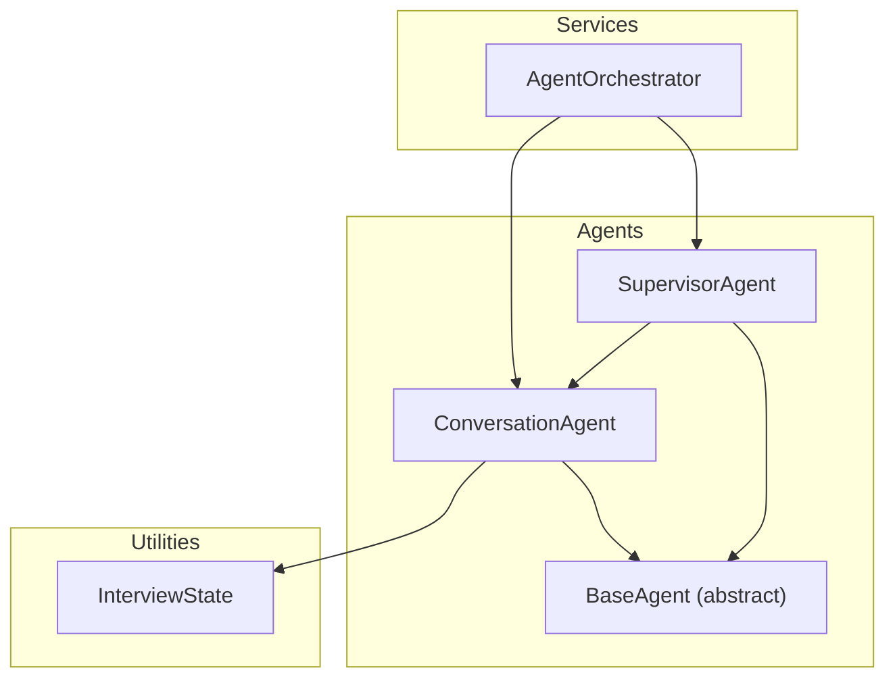
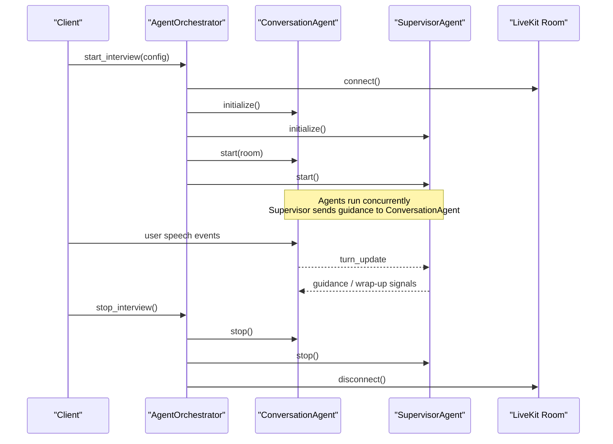
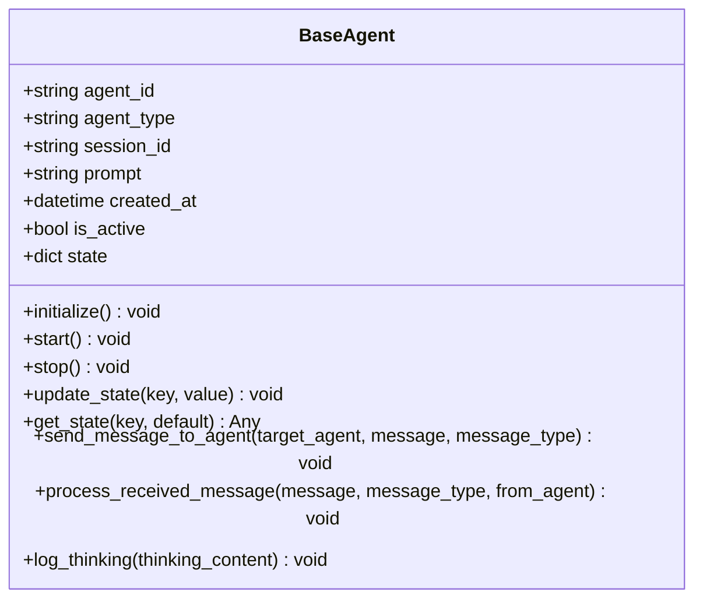
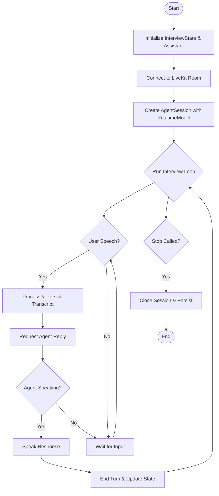
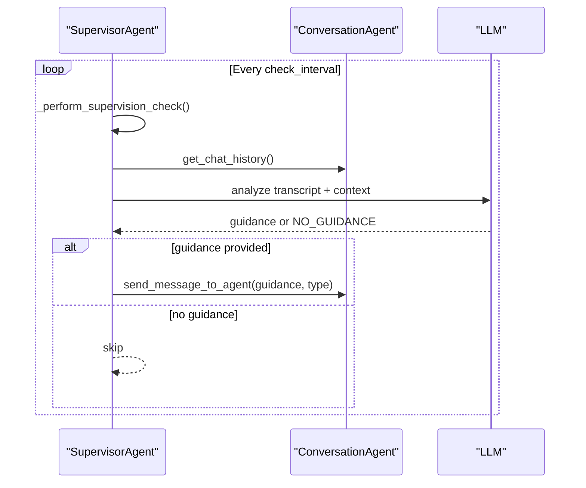
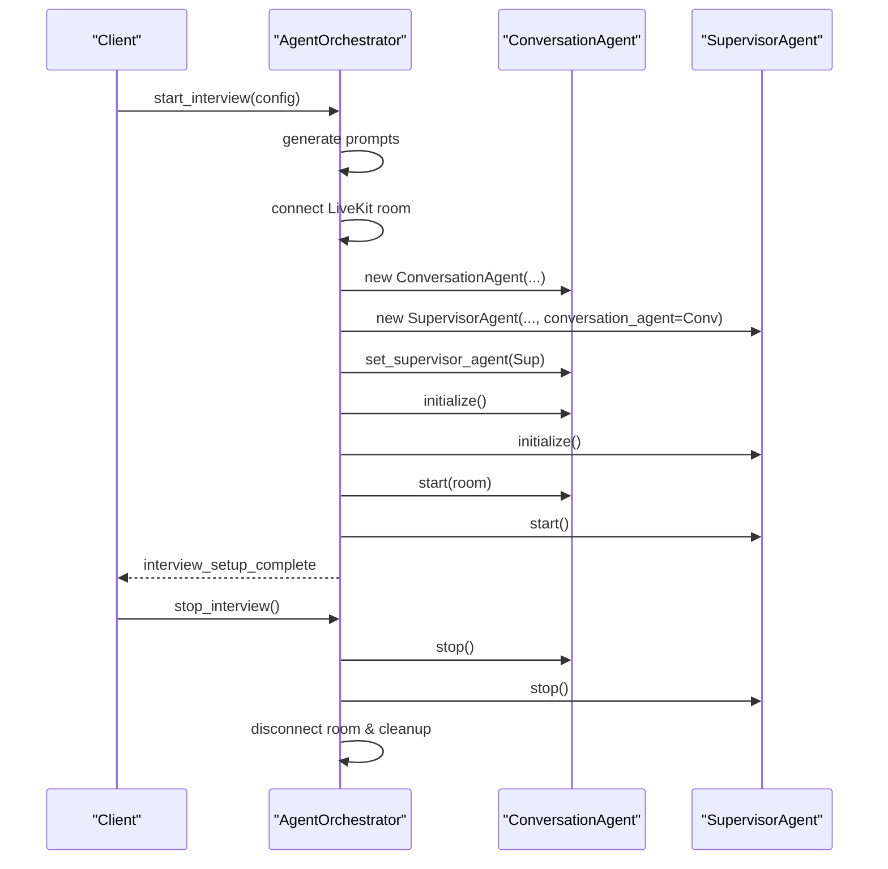
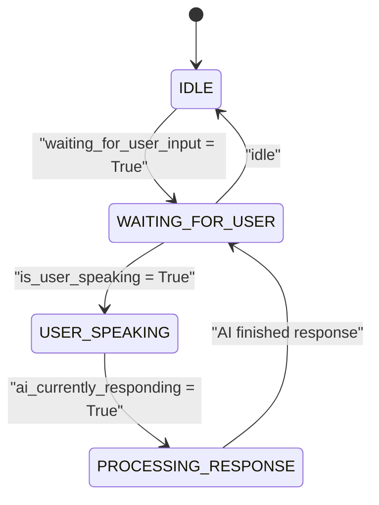
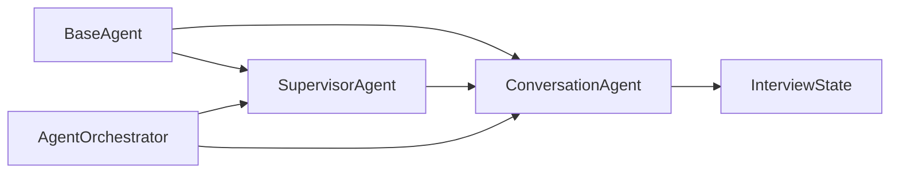

# Agent Architecture & Base Classes

<cite>
**Referenced Files in This Document**
- [base.py](file://Backend/app/ai/agents/base.py)
- [conversation.py](file://Backend/app/ai/agents/conversation.py)
- [supervisor.py](file://Backend/app/ai/agents/supervisor.py)
- [agent_orchestrator.py](file://Backend/app/ai/services/agent_orchestrator.py)
- [interview_state.py](file://Backend/app/ai/utils/interview_state.py)
</cite>

## Table of Contents
1. Introduction
2. Project Structure
3. Core Components
4. Architecture Overview
5. Detailed Component Analysis
6. Dependency Analysis
7. Performance Considerations
8. Troubleshooting Guide
9. Conclusion

## Introduction
This document explains the AI agent architecture and base class design used to power interactive interviews. It focuses on:
- The BaseAgent abstract class that defines lifecycle, state management, inter-agent messaging, and logging.
- How ConversationAgent and SupervisorAgent extend BaseAgent to implement interview conversation and supervision.
- Agent lifecycle management, state tracking, message passing patterns, and orchestration.
- How to create custom agents by extending BaseAgent and integrating them into the framework.

## Project Structure
The relevant code is organized under the Backend AI module:
- Agents: base, conversation, supervisor
- Services: agent orchestrator
- Utilities: interview state

**Diagram sources**
- [base.py:14-85](file://Backend/app/ai/agents/base.py#L14-L85)
- [conversation.py:1264-1475](file://Backend/app/ai/agents/conversation.py#L1264-L1475)
- [supervisor.py:20-59](file://Backend/app/ai/agents/supervisor.py#L20-L59)
- [agent_orchestrator.py:29-41](file://Backend/app/ai/services/agent_orchestrator.py#L29-L41)
- [interview_state.py:29-101](file://Backend/app/ai/utils/interview_state.py#L29-L101)

**Section sources**
- [base.py:14-85](file://Backend/app/ai/agents/base.py#L14-L85)
- [conversation.py:1264-1475](file://Backend/app/ai/agents/conversation.py#L1264-L1475)
- [supervisor.py:20-59](file://Backend/app/ai/agents/supervisor.py#L20-L59)
- [agent_orchestrator.py:29-41](file://Backend/app/ai/services/agent_orchestrator.py#L29-L41)
- [interview_state.py:29-101](file://Backend/app/ai/utils/interview_state.py#L29-L101)

## Core Components
- BaseAgent: Abstract foundation providing lifecycle hooks (initialize, start, stop), shared state storage, inter-agent messaging, and logging helpers.
- ConversationAgent: Implements the live interview flow using LiveKit Realtime API, manages turn-taking, transcript persistence, and end-of-interview flows.
- SupervisorAgent: Monitors conversation progress via periodic checks and LLM-based guidance; coordinates timing and wrap-up.
- AgentOrchestrator: Creates and wires agents, connects to LiveKit rooms, initializes and starts agents, and handles cleanup.
- InterviewState: Centralized state for phase transitions, timers, grace periods, and end-interview confirmation workflow.

Key responsibilities:
- Lifecycle: initialize -> start -> stop with robust resource cleanup.
- State: shared state dict in BaseAgent plus structured InterviewState for complex session logic.
- Messaging: send_message_to_agent and process_received_message enable typed messages between agents.
- Orchestration: AgentOrchestrator constructs, links, and runs agents within a room context.

**Section sources**
- [base.py:14-85](file://Backend/app/ai/agents/base.py#L14-L85)
- [conversation.py:1264-1475](file://Backend/app/ai/agents/conversation.py#L1264-L1475)
- [supervisor.py:20-59](file://Backend/app/ai/agents/supervisor.py#L20-L59)
- [agent_orchestrator.py:29-41](file://Backend/app/ai/services/agent_orchestrator.py#L29-L41)
- [interview_state.py:29-101](file://Backend/app/ai/utils/interview_state.py#L29-L101)

## Architecture Overview
The system uses an orchestrator to manage a pair of agents per interview session:
- ConversationAgent conducts the interview with real-time audio and transcripts.
- SupervisorAgent periodically inspects conversation context and provides guidance or triggers time-based controls.
- Both agents inherit from BaseAgent, ensuring consistent lifecycle and messaging.

**Diagram sources**
- [agent_orchestrator.py:42-182](file://Backend/app/ai/services/agent_orchestrator.py#L42-L182)
- [conversation.py:4030-4229](file://Backend/app/ai/agents/conversation.py#L4030-L4229)
- [supervisor.py:61-75](file://Backend/app/ai/agents/supervisor.py#L61-L75)

## Detailed Component Analysis

### BaseAgent: Abstract Foundation
Responsibilities:
- Unique identity and metadata: agent_id, agent_type, session_id, prompt, created_at.
- Simple state dictionary with last_activity timestamp.
- Lifecycle methods: initialize, start, stop (abstract).
- Inter-agent messaging: send_message_to_agent(target, message, type) and process_received_message(message, type, from_agent) (abstract).
- Logging helper: log_thinking(content).

Design notes:
- Encourages consistent lifecycle across all agents.
- Provides a simple, extensible state container.
- Defines a clear contract for inter-agent communication via typed messages.

**Diagram sources**
- [base.py:14-85](file://Backend/app/ai/agents/base.py#L14-L85)

**Section sources**
- [base.py:14-85](file://Backend/app/ai/agents/base.py#L14-L85)

### ConversationAgent: Interview Conductor
Responsibilities:
- Initializes InterviewState and InterviewAssistant.
- Connects to LiveKit Realtime model, sets up voice transcription and turn detection.
- Manages floor control, transcript accumulation, deduplication, and persistence.
- Handles end-interview flows: request, confirm/cancel, closing statement, and completion event.
- Processes messages from SupervisorAgent (guidance, wrap-up, end-interview signals).

Lifecycle highlights:
- initialize(): builds state, assistant, and prepares persisted transcripts if resuming.
- start(room): configures realtime provider, creates AgentSession, and begins interaction.
- stop(): ensures graceful closing, persists final transcript, cancels tasks, closes sessions.

Message handling:
- Guidance types: ephemeral vs persistent.
- Wrap-up and end-interview coordination with SupervisorAgent.

**Diagram sources**
- [conversation.py:4030-4229](file://Backend/app/ai/agents/conversation.py#L4030-L4229)
- [conversation.py:6478-6677](file://Backend/app/ai/agents/conversation.py#L6478-L6677)
- [conversation.py:6705-6904](file://Backend/app/ai/agents/conversation.py#L6705-L6904)

**Section sources**
- [conversation.py:1264-1475](file://Backend/app/ai/agents/conversation.py#L1264-L1475)
- [conversation.py:4030-4229](file://Backend/app/ai/agents/conversation.py#L4030-L4229)
- [conversation.py:6478-6677](file://Backend/app/ai/agents/conversation.py#L6478-L6677)
- [conversation.py:6705-6904](file://Backend/app/ai/agents/conversation.py#L6705-L6904)

### SupervisorAgent: Monitor and Guide
Responsibilities:
- Periodically analyzes recent transcript snippets via LLM to provide guidance.
- Enforces timing: completion countdown, post-time grace, and wrap-up triggers.
- Sends guidance to ConversationAgent with appropriate message types.
- Coordinates end-of-interview behavior when time is up or conditions are met.

Lifecycle highlights:
- initialize(): no-op setup.
- start(): launches supervision loop and timing assistance tasks.
- stop(): cancels tasks, closes HTTP client, marks inactive.

Message handling:
- Receives turn updates from ConversationAgent.
- Sends guidance (ephemeral/persistent) and wrap-up/end signals.

**Diagram sources**
- [supervisor.py:137-268](file://Backend/app/ai/agents/supervisor.py#L137-L268)
- [supervisor.py:270-331](file://Backend/app/ai/agents/supervisor.py#L270-L331)
- [supervisor.py:439-456](file://Backend/app/ai/agents/supervisor.py#L439-L456)

**Section sources**
- [supervisor.py:20-59](file://Backend/app/ai/agents/supervisor.py#L20-L59)
- [supervisor.py:61-120](file://Backend/app/ai/agents/supervisor.py#L61-L120)
- [supervisor.py:137-268](file://Backend/app/ai/agents/supervisor.py#L137-L268)
- [supervisor.py:270-331](file://Backend/app/ai/agents/supervisor.py#L270-L331)
- [supervisor.py:439-456](file://Backend/app/ai/agents/supervisor.py#L439-L456)

### AgentOrchestrator: Session Manager
Responsibilities:
- Registers active sessions and coordinates background setup.
- Generates prompts, connects to LiveKit, instantiates agents, and wires references.
- Starts agents and signals readiness to clients.
- Stops interviews, cleans up resources, and triggers post-interview rating generation.

**Diagram sources**
- [agent_orchestrator.py:42-182](file://Backend/app/ai/services/agent_orchestrator.py#L42-L182)
- [agent_orchestrator.py:244-281](file://Backend/app/ai/services/agent_orchestrator.py#L244-L281)

**Section sources**
- [agent_orchestrator.py:29-41](file://Backend/app/ai/services/agent_orchestrator.py#L29-L41)
- [agent_orchestrator.py:42-182](file://Backend/app/ai/services/agent_orchestrator.py#L42-L182)
- [agent_orchestrator.py:244-281](file://Backend/app/ai/services/agent_orchestrator.py#L244-L281)

### InterviewState: Shared Session State
Responsibilities:
- Tracks conversation phases, turns, and timers.
- Manages end-interview confirmation workflow and grace periods.
- Provides utilities to compute elapsed/remaining time and detect time-up conditions.

**Diagram sources**
- [interview_state.py:22-74](file://Backend/app/ai/utils/interview_state.py#L22-L74)

**Section sources**
- [interview_state.py:29-101](file://Backend/app/ai/utils/interview_state.py#L29-L101)
- [interview_state.py:108-186](file://Backend/app/ai/utils/interview_state.py#L108-L186)
- [interview_state.py:231-272](file://Backend/app/ai/utils/interview_state.py#L231-L272)

## Dependency Analysis
- BaseAgent is extended by both ConversationAgent and SupervisorAgent, enforcing a common interface.
- ConversationAgent depends on InterviewState for session state and on LiveKit components for real-time media.
- SupervisorAgent depends on ConversationAgent to read transcripts and send guidance.
- AgentOrchestrator depends on both agents and orchestrates their lifecycle and room connection.

**Diagram sources**
- [base.py:14-85](file://Backend/app/ai/agents/base.py#L14-L85)
- [conversation.py:1264-1475](file://Backend/app/ai/agents/conversation.py#L1264-L1475)
- [supervisor.py:20-59](file://Backend/app/ai/agents/supervisor.py#L20-L59)
- [agent_orchestrator.py:29-41](file://Backend/app/ai/services/agent_orchestrator.py#L29-L41)
- [interview_state.py:29-101](file://Backend/app/ai/utils/interview_state.py#L29-L101)

**Section sources**
- [base.py:14-85](file://Backend/app/ai/agents/base.py#L14-L85)
- [conversation.py:1264-1475](file://Backend/app/ai/agents/conversation.py#L1264-L1475)
- [supervisor.py:20-59](file://Backend/app/ai/agents/supervisor.py#L20-L59)
- [agent_orchestrator.py:29-41](file://Backend/app/ai/services/agent_orchestrator.py#L29-L41)
- [interview_state.py:29-101](file://Backend/app/ai/utils/interview_state.py#L29-L101)

## Performance Considerations
- Realtime model configuration: VAD type and parameters are tuned to reduce false interruptions and echo bleed during agent speech.
- Transcript deduplication and merging: prevents duplicate processing and reduces redundant LLM calls.
- Task cancellation: stop methods cancel pending tasks to avoid leaks and ensure timely shutdown.
- Graceful closing: ensures final transcript persistence and avoids abrupt termination mid-turn.

[No sources needed since this section provides general guidance]

## Troubleshooting Guide
Common issues and resolutions:
- Supervisor guidance ignored during wrap-up or grace period: expected behavior to prevent interference with closing flows.
- Duplicate end-interview requests: handled by guards to avoid repeated confirmation prompts.
- Time-up fallback: if time is up without active closing flow, SupervisorAgent triggers a one-time wrap-up signal.
- Client disconnection: ConversationAgent marks itself inactive and persists any remaining transcript.

**Section sources**
- [conversation.py:6705-6904](file://Backend/app/ai/agents/conversation.py#L6705-L6904)
- [supervisor.py:151-231](file://Backend/app/ai/agents/supervisor.py#L151-L231)
- [supervisor.py:496-561](file://Backend/app/ai/agents/supervisor.py#L496-L561)
- [conversation.py:6890-6901](file://Backend/app/ai/agents/conversation.py#L6890-L6901)

## Conclusion
The agent architecture centers on a clean abstraction (BaseAgent) that standardizes lifecycle, state, and messaging. ConversationAgent implements the interactive interview experience with robust real-time handling, while SupervisorAgent provides intelligent oversight and timing control. AgentOrchestrator ties everything together, managing setup, execution, and teardown. This design enables extensibility: new agent types can be added by subclassing BaseAgent and integrating through the orchestrator and message protocol.

[No sources needed since this section summarizes without analyzing specific files]