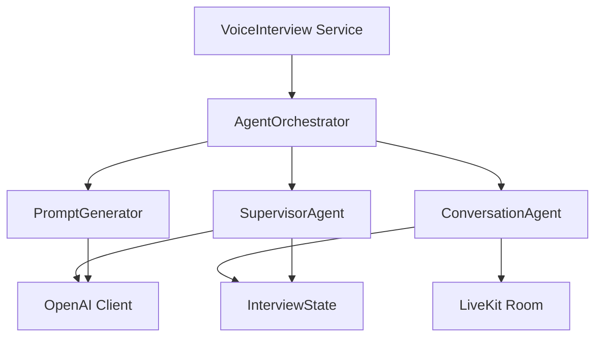
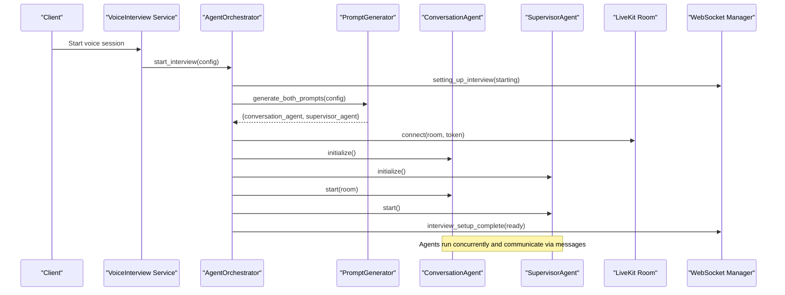
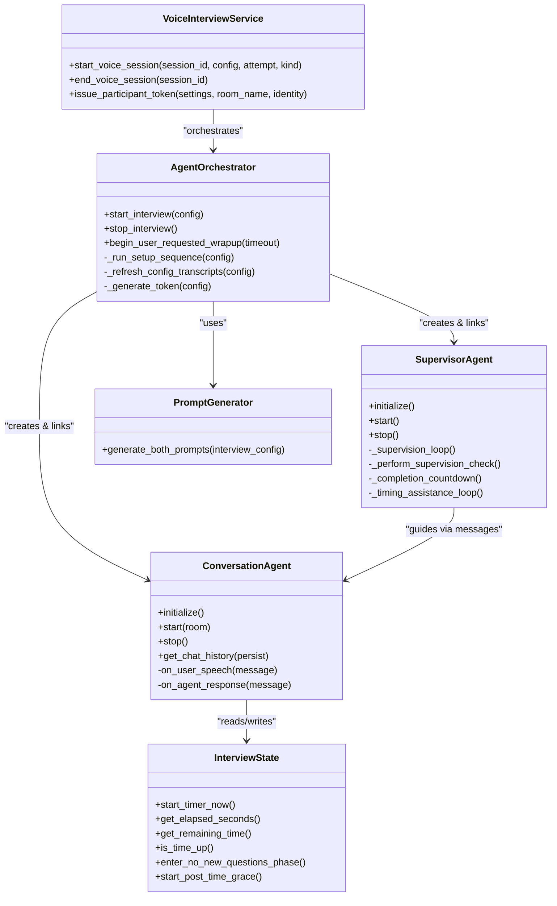

# Agent Orchestration & Coordination

<cite>
**Referenced Files in This Document**
- [agent_orchestrator.py](file://Backend/app/ai/services/agent_orchestrator.py)
- [supervisor.py](file://Backend/app/ai/agents/supervisor.py)
- [base.py](file://Backend/app/ai/agents/base.py)
- [conversation.py](file://Backend/app/ai/agents/conversation.py)
- [interview_state.py](file://Backend/app/ai/utils/interview_state.py)
- [generator.py](file://Backend/app/ai/prompts/generator.py)
- [voice_interview.py](file://Backend/app/services/voice_interview.py)
- [errors.py](file://Backend/app/core/errors.py)
</cite>

## Table of Contents
1. [Introduction](#introduction)
2. [Project Structure](#project-structure)
3. [Core Components](#core-components)
4. [Architecture Overview](#architecture-overview)
5. [Detailed Component Analysis](#detailed-component-analysis)
6. [Dependency Analysis](#dependency-analysis)
7. [Performance Considerations](#performance-considerations)
8. [Troubleshooting Guide](#troubleshooting-guide)
9. [Conclusion](#conclusion)

## Introduction
This document explains the agent orchestration system that coordinates multiple AI agents during interview sessions. It focuses on:
- The AgentOrchestrator class that manages agent lifecycle, message routing, and coordination between specialized agents.
- The supervisor agent pattern that oversees conversation flow and delegates tasks to appropriate agents.
- An event-driven architecture enabling asynchronous communication among agents and responsiveness to system events.
- Examples of orchestrating multi-agent interviews where different agents handle question generation, evaluation, and candidate interaction.
- Error handling, fallback mechanisms, and graceful degradation when individual agents fail.

## Project Structure
The orchestration logic is implemented under Backend/app/ai with supporting services and utilities:
- Services layer: AgentOrchestrator coordinates setup, runtime, and teardown of agents for a session.
- Agents layer: BaseAgent defines the contract; ConversationAgent conducts the live interview; SupervisorAgent monitors and guides the conversation.
- Utilities: InterviewState tracks phases, timing, grace periods, and end-of-interview behavior.
- Prompts: PromptGenerator creates tailored prompts for both agents using LLMs.
- Voice service: Bridges API calls to start/end voice sessions and integrates with LiveKit.
- Errors: Centralized error types and handlers for consistent failure responses.

**Diagram sources**
- [voice_interview.py:189-227](file://Backend/app/services/voice_interview.py#L189-L227)
- [agent_orchestrator.py:29-182](file://Backend/app/ai/services/agent_orchestrator.py#L29-L182)
- [conversation.py:184-310](file://Backend/app/ai/agents/conversation.py#L184-L310)
- [supervisor.py:20-119](file://Backend/app/ai/agents/supervisor.py#L20-L119)
- [interview_state.py:22-101](file://Backend/app/ai/utils/interview_state.py#L22-L101)
- [generator.py:25-59](file://Backend/app/ai/prompts/generator.py#L25-L59)

**Section sources**
- [agent_orchestrator.py:29-182](file://Backend/app/ai/services/agent_orchestrator.py#L29-L182)
- [voice_interview.py:189-227](file://Backend/app/services/voice_interview.py#L189-L227)

## Core Components
- AgentOrchestrator: Creates and configures agents, connects to LiveKit, starts background setup, signals frontend progress via WebSocket, and handles cleanup and post-interview rating.
- ConversationAgent: Manages real-time audio transcription, turn-taking, transcript persistence, user intent detection (e.g., end interview), and emits events to the frontend.
- SupervisorAgent: Periodically inspects conversation state and transcript snippets, uses an LLM to provide guidance, enforces time-based controls, and triggers wrap-up flows.
- InterviewState: Encapsulates phase transitions, timers, grace periods, and flags controlling when new questions are allowed or when closing begins.
- PromptGenerator: Builds persona and instruction prompts for both agents from interview configuration and templates.
- VoiceInterview Service: Entry point for starting/stopping voice sessions, building configs, issuing tokens, and integrating with the orchestrator.

**Section sources**
- [agent_orchestrator.py:29-182](file://Backend/app/ai/services/agent_orchestrator.py#L29-L182)
- [conversation.py:184-310](file://Backend/app/ai/agents/conversation.py#L184-L310)
- [supervisor.py:20-119](file://Backend/app/ai/agents/supervisor.py#L20-L119)
- [interview_state.py:22-101](file://Backend/app/ai/utils/interview_state.py#L22-L101)
- [generator.py:25-59](file://Backend/app/ai/prompts/generator.py#L25-L59)
- [voice_interview.py:189-227](file://Backend/app/services/voice_interview.py#L189-L227)

## Architecture Overview
The system follows an event-driven, asynchronous design:
- The voice service builds a configuration and invokes the orchestrator to start an interview.
- The orchestrator generates prompts, connects to LiveKit, instantiates ConversationAgent and SupervisorAgent, links them, initializes, and starts their background loops.
- ConversationAgent handles real-time speech-to-text, schedules agent replies, persists transcripts, and notifies the frontend over WebSocket.
- SupervisorAgent periodically analyzes recent transcript snippets and current state to send targeted guidance to the ConversationAgent, including time-based instructions and KPI coverage nudges.
- InterviewState centralizes control of phases, timers, grace periods, and end-of-interview behaviors.

**Diagram sources**
- [voice_interview.py:189-227](file://Backend/app/services/voice_interview.py#L189-L227)
- [agent_orchestrator.py:42-182](file://Backend/app/ai/services/agent_orchestrator.py#L42-L182)
- [generator.py:33-59](file://Backend/app/ai/prompts/generator.py#L33-L59)

## Detailed Component Analysis

### AgentOrchestrator
Responsibilities:
- Lifecycle management: create, initialize, start, stop agents per session.
- Background setup sequence: prompt generation, LiveKit connection, agent instantiation, linking, and startup.
- Frontend signaling: sends status updates via WebSocket for each setup stage and completion/failure.
- Cleanup: cancels pending tasks, stops agents, disconnects room, closes HTTP session, and triggers post-interview rating.
- Resume support: reloads persisted transcripts before setup to continue interrupted sessions.

Key methods and behaviors:
- start_interview: registers orchestrator, signals setup started, launches background setup task.
- _run_setup_sequence: orchestrates steps, shares HTTP session with agents, links agents, initializes and starts them, signals readiness.
- begin_user_requested_wrapup: initiates closing dialogue with timeout and fallback completion event if needed.
- stop_interview: ensures orderly shutdown and resource release.
- _refresh_config_transcripts: restores transcripts from DB to resume context.
- _generate_token: issues LiveKit token for agent identity.

Error handling and resilience:
- Catches exceptions during setup and reports via WebSocket, then stops the interview.
- Uses timeouts for user-requested wrap-up and falls back to sending completion events if necessary.
- Ensures cleanup even on errors by canceling tasks and releasing resources.

**Section sources**
- [agent_orchestrator.py:29-182](file://Backend/app/ai/services/agent_orchestrator.py#L29-L182)
- [agent_orchestrator.py:203-242](file://Backend/app/ai/services/agent_orchestrator.py#L203-L242)
- [agent_orchestrator.py:244-327](file://Backend/app/ai/services/agent_orchestrator.py#L244-L327)
- [agent_orchestrator.py:329-361](file://Backend/app/ai/services/agent_orchestrator.py#L329-L361)

### SupervisorAgent
Responsibilities:
- Monitor conversation health and guide the ConversationAgent through periodic checks.
- Use LLM to analyze recent transcript snippets and current state to produce actionable guidance.
- Enforce time-based controls: initiate questioning ended phase, trigger wrap-up, and ensure graceful closure.
- Provide KPI coverage nudges based on uncovered competencies.

Key methods and behaviors:
- start: activates supervision loop and related tasks.
- _supervision_loop: sleeps at configured intervals, performs checks only when safe (no active user speech or agent busy).
- _perform_supervision_check: pulls transcript snippet, computes elapsed time and silence duration, calls LLM for guidance, forwards guidance to ConversationAgent.
- _handle_turn_update: reacts to turn updates from ConversationAgent to provide periodic guidance.
- Completion countdown and timing assistance: schedule end-of-interview actions and emit guidance at thresholds.

Error handling and resilience:
- Skips supervision during sensitive phases (grace period, wrapping up, time up).
- Handles LLM call failures gracefully and logs errors without crashing the loop.
- Provides fallback start_wrapup if time is up but no closing flow has started.

**Section sources**
- [supervisor.py:20-119](file://Backend/app/ai/agents/supervisor.py#L20-L119)
- [supervisor.py:137-269](file://Backend/app/ai/agents/supervisor.py#L137-L269)
- [supervisor.py:270-331](file://Backend/app/ai/agents/supervisor.py#L270-L331)
- [supervisor.py:496-561](file://Backend/app/ai/agents/supervisor.py#L496-L561)
- [supervisor.py:566-671](file://Backend/app/ai/agents/supervisor.py#L566-L671)

### ConversationAgent
Responsibilities:
- Manage real-time audio transcription and turn-taking with candidates.
- Persist transcripts incrementally and notify frontend via WebSocket.
- Detect user intents such as explicit end interview requests and handle confirmation flows.
- Coordinate with SupervisorAgent via messages and update shared state.

Key methods and behaviors:
- on_user_speech: processes incoming transcripts, deduplicates noise, merges short utterances, schedules agent reply, and emits events.
- on_agent_response: captures agent output, persists transcript, updates state, notifies supervisor of turns.
- End interview flow: recognizes end requests, asks for confirmation, handles yes/no responses, and finalizes ending.
- FloorPhase and state integration: ensures single owner of turn and prevents overlapping speech.

Error handling and resilience:
- Drops late user speech after end announcement to avoid continuing the interview.
- Gracefully handles persistence and WebSocket errors without blocking core flow.
- Uses timeouts and guards to prevent duplicate processing and ensure stable turn transitions.

**Section sources**
- [conversation.py:184-310](file://Backend/app/ai/agents/conversation.py#L184-L310)
- [conversation.py:312-574](file://Backend/app/ai/agents/conversation.py#L312-L574)
- [conversation.py:576-757](file://Backend/app/ai/agents/conversation.py#L576-L757)

### InterviewState
Responsibilities:
- Track conversation phases, timers, grace periods, and end-of-interview behaviors.
- Provide methods to compute elapsed/remaining time and determine when to enter no-new-questions phase.
- Support resuming timer from persisted transcripts.

Key behaviors:
- Phase properties: ai_currently_responding, is_user_speaking, waiting_for_user_input.
- Time controls: start_timer_now, get_elapsed_seconds, get_remaining_time, is_time_up.
- Grace and wrap-up: start_post_time_grace, enter_no_new_questions_phase, mark_end_announced.

**Section sources**
- [interview_state.py:22-101](file://Backend/app/ai/utils/interview_state.py#L22-L101)
- [interview_state.py:124-186](file://Backend/app/ai/utils/interview_state.py#L124-L186)
- [interview_state.py:208-271](file://Backend/app/ai/utils/interview_state.py#L208-L271)

### PromptGenerator
Responsibilities:
- Generate structured persona data and fill templates for both ConversationAgent and SupervisorAgent.
- Ensure consistent interviewer identity and inject interview-specific context into prompts.

Key behaviors:
- generate_both_prompts: orchestrates persona generation and template filling.
- Persona generation: calls LLM with constraints to return JSON persona, then forces fixed interviewer name.
- Template filling: constructs conversation and supervisor prompts from persona and interview configuration.

**Section sources**
- [generator.py:25-59](file://Backend/app/ai/prompts/generator.py#L25-L59)
- [generator.py:61-107](file://Backend/app/ai/prompts/generator.py#L61-L107)
- [generator.py:143-217](file://Backend/app/ai/prompts/generator.py#L143-L217)

### VoiceInterview Service
Responsibilities:
- Build configurations for profile screening and job interviews.
- Start and end voice sessions, register sessions, issue tokens, and integrate with the orchestrator.

Key behaviors:
- build_profile_screening_config / build_job_interview_config: assemble context, strategies, and metadata for prompts.
- start_voice_session: ensures idempotency, registers session, creates orchestrator, and starts background task.
- end_voice_session: cancels pending tasks, triggers wrap-up, and stops the interview.

**Section sources**
- [voice_interview.py:53-151](file://Backend/app/services/voice_interview.py#L53-L151)
- [voice_interview.py:189-227](file://Backend/app/services/voice_interview.py#L189-L227)
- [voice_interview.py:230-251](file://Backend/app/services/voice_interview.py#L230-L251)

## Dependency Analysis
The components interact through well-defined interfaces and asynchronous messaging:
- AgentOrchestrator depends on PromptGenerator, ConversationAgent, SupervisorAgent, LiveKit, and WebSocket manager.
- SupervisorAgent depends on OpenAI client and reads state from ConversationAgent.
- ConversationAgent depends on LiveKit Realtime API, InterviewState, and WebSocket manager.
- VoiceInterview Service depends on database models, settings, and orchestrator.

**Diagram sources**
- [agent_orchestrator.py:29-182](file://Backend/app/ai/services/agent_orchestrator.py#L29-L182)
- [supervisor.py:20-119](file://Backend/app/ai/agents/supervisor.py#L20-L119)
- [conversation.py:184-310](file://Backend/app/ai/agents/conversation.py#L184-L310)
- [interview_state.py:22-101](file://Backend/app/ai/utils/interview_state.py#L22-L101)
- [generator.py:25-59](file://Backend/app/ai/prompts/generator.py#L25-L59)
- [voice_interview.py:189-227](file://Backend/app/services/voice_interview.py#L189-L227)

**Section sources**
- [agent_orchestrator.py:29-182](file://Backend/app/ai/services/agent_orchestrator.py#L29-L182)
- [supervisor.py:20-119](file://Backend/app/ai/agents/supervisor.py#L20-L119)
- [conversation.py:184-310](file://Backend/app/ai/agents/conversation.py#L184-L310)
- [interview_state.py:22-101](file://Backend/app/ai/utils/interview_state.py#L22-L101)
- [generator.py:25-59](file://Backend/app/ai/prompts/generator.py#L25-L59)
- [voice_interview.py:189-227](file://Backend/app/services/voice_interview.py#L189-L227)

## Performance Considerations
- Asynchronous background tasks: Setup and supervision run asynchronously to avoid blocking UI and keep responsiveness high.
- Minimal LLM calls: SupervisorAgent limits guidance frequency and skips checks during active speech or busy states.
- Transcript merging and deduplication: Reduces redundant processing and storage overhead.
- Graceful timeouts: Wrap-up and completion countdown use timeouts to prevent indefinite waits.
- Resource cleanup: Explicit cancellation of tasks and closing of HTTP clients to free connections.

[No sources needed since this section provides general guidance]

## Troubleshooting Guide
Common issues and resolutions:
- Setup failures: Check WebSocket messages for setup_failed and review logs for errors in prompt generation or LiveKit connection.
- Stalled supervision: Ensure SupervisorAgent is active and not skipping checks due to busy states; verify LLM configuration and availability.
- Duplicate transcripts: Confirm deduplication logic is functioning; check for repeated user speech keys and merging windows.
- End interview not triggering: Verify state flags for no_new_questions and wrap_up_pending; ensure completion countdown runs and fallback start_wrapup is triggered if needed.
- Configuration errors: Validate LiveKit and OpenAI settings; ensure required environment variables are set.

Error handling patterns:
- Centralized ApiError types and exception handlers normalize error responses across the API.
- Orchestrator catches exceptions during setup and cleanup, sends failure events, and ensures resources are released.
- SupervisorAgent and ConversationAgent log errors without crashing critical loops and provide fallback behaviors.

**Section sources**
- [errors.py:20-112](file://Backend/app/core/errors.py#L20-L112)
- [agent_orchestrator.py:184-192](file://Backend/app/ai/services/agent_orchestrator.py#L184-L192)
- [supervisor.py:251-269](file://Backend/app/ai/agents/supervisor.py#L251-L269)
- [conversation.py:312-574](file://Backend/app/ai/agents/conversation.py#L312-L574)

## Conclusion
The orchestration system combines a robust AgentOrchestrator with specialized Conversation and Supervisor agents to deliver reliable, real-time interview experiences. Event-driven communication, careful state management, and resilient error handling enable graceful degradation when components fail. The design supports dynamic prompt generation, KPI coverage enforcement, and time-based controls to ensure structured and fair evaluations.

[No sources needed since this section summarizes without analyzing specific files]