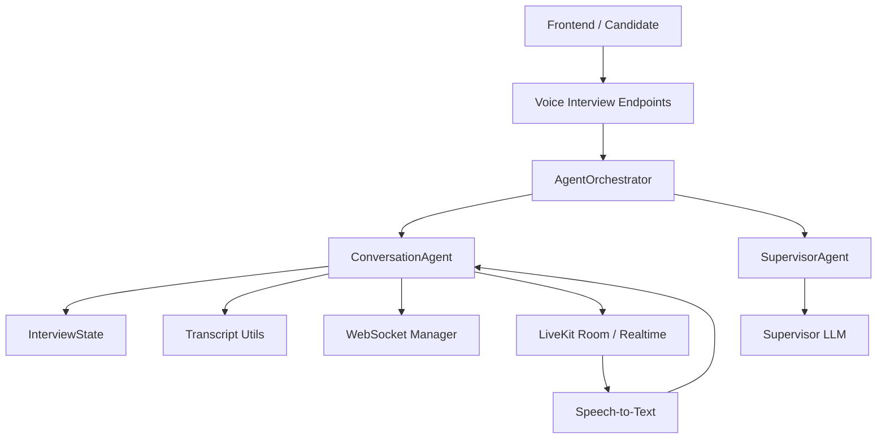
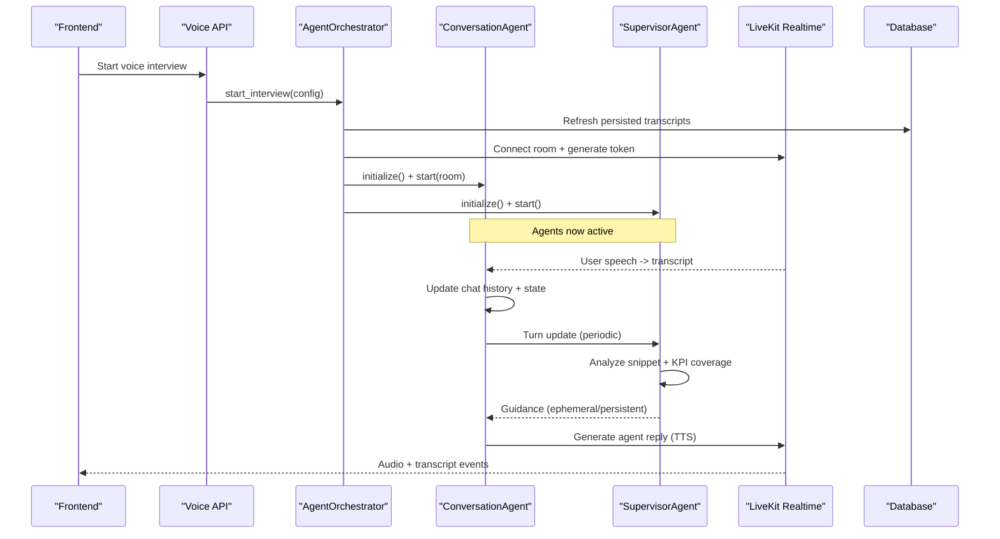
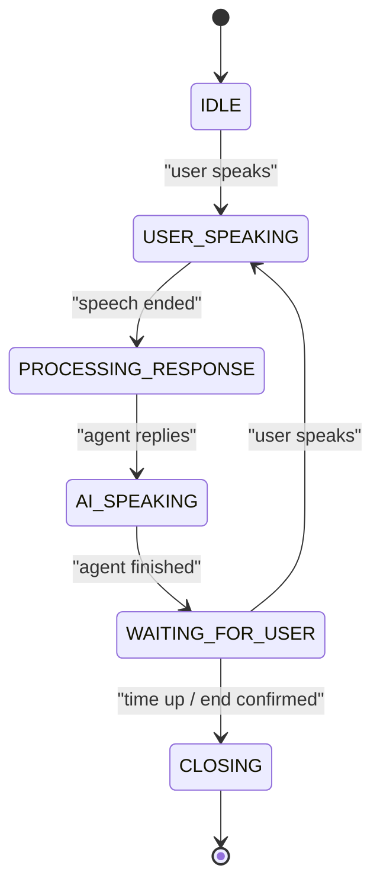
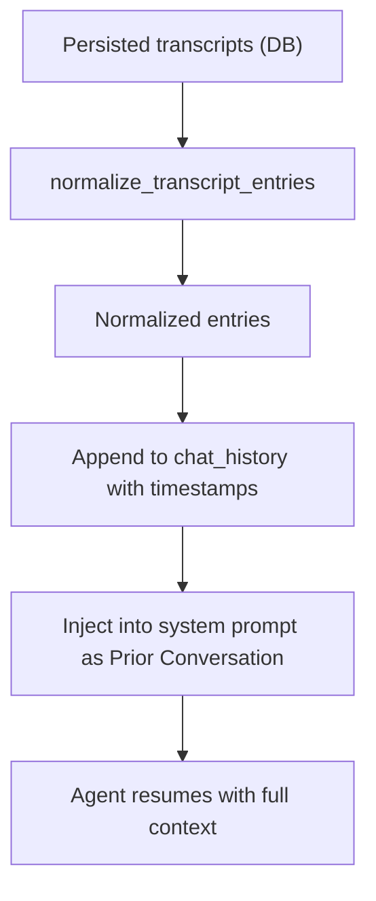
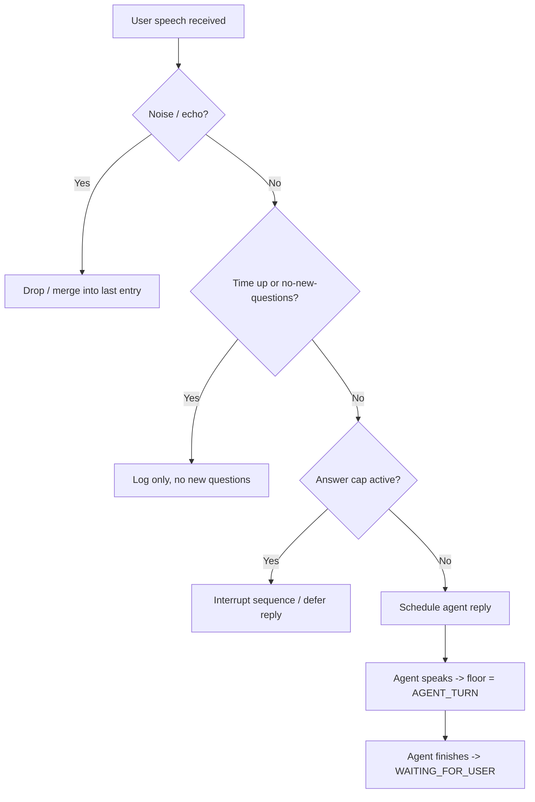
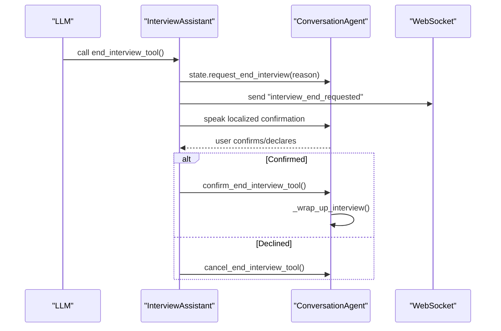
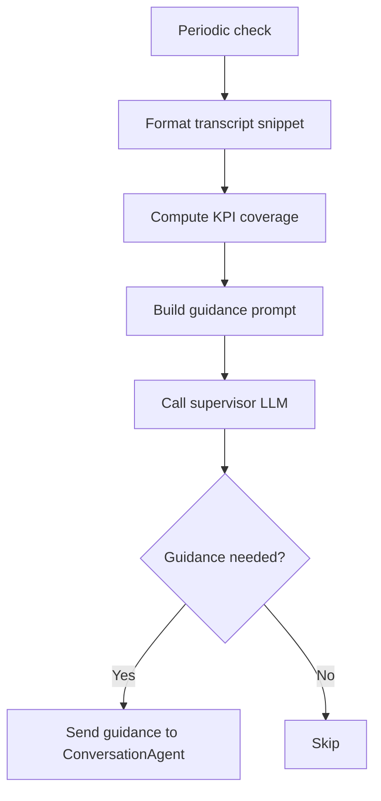
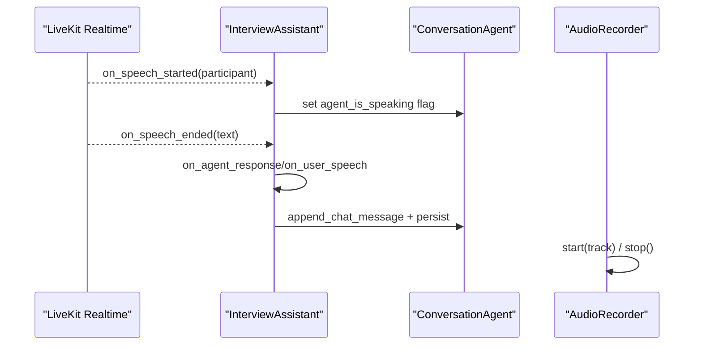
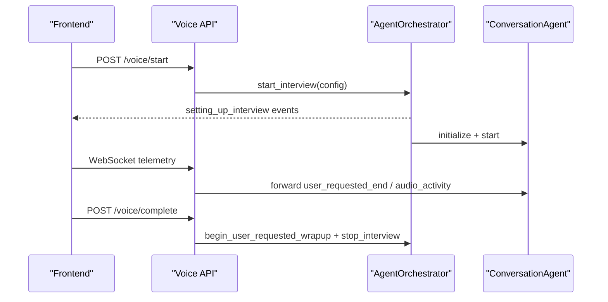
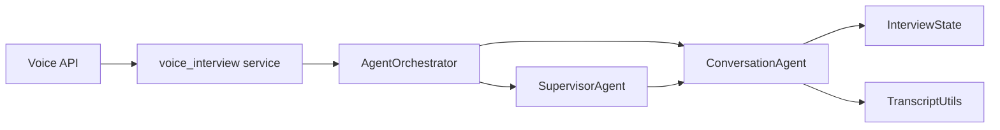

# Conversation Management System

<cite>
**Referenced Files in This Document**
- [conversation.py](file://Backend/app/ai/agents/conversation.py)
- [supervisor.py](file://Backend/app/ai/agents/supervisor.py)
- [interview_state.py](file://Backend/app/ai/utils/interview_state.py)
- [transcript_utils.py](file://Backend/app/ai/utils/transcript_utils.py)
- [agent_orchestrator.py](file://Backend/app/ai/services/agent_orchestrator.py)
- [voice_interviews.py](file://Backend/app/api/v1/voice_interviews.py)
- [voice_interview.py](file://Backend/app/services/voice_interview.py)
- [audio_recorder.py](file://Backend/app/ai/utils/audio_recorder.py)
</cite>

## Table of Contents
1. Introduction
2. Project Structure
3. Core Components
4. Architecture Overview
5. Detailed Component Analysis
6. Dependency Analysis
7. Performance Considerations
8. Troubleshooting Guide
9. Conclusion

## Introduction
This document explains the conversation management system that drives AI-led interview dialogues. It covers the conversation state machine, message history and context preservation, transcript processing utilities, turn-taking logic, interruption handling, and integration with transcription services to convert audio input into structured conversation data. It also describes how candidate information, job requirements, and evaluation criteria are maintained across turns to guide the interviewer agent and ensure consistent evaluation coverage.

## Project Structure
The conversation system is implemented in the backend under the AI agents layer and supporting utilities:
- Agents: ConversationAgent (interview flow), InterviewAssistant (speech capture and response hooks), SupervisorAgent (guidance and timing).
- Utilities: InterviewState (state machine and timers), TranscriptUtils (normalize persisted transcripts), AudioRecorder (optional WAV recording).
- Orchestration: AgentOrchestrator (lifecycle, LiveKit room setup, prompt generation, agent wiring).
- API: Voice interview endpoints for starting sessions, telemetry, and completion.

**Diagram sources**
- [agent_orchestrator.py:42-180](file://Backend/app/ai/services/agent_orchestrator.py#L42-L180)
- [conversation.py:1264-1475](file://Backend/app/ai/agents/conversation.py#L1264-L1475)
- [supervisor.py:20-75](file://Backend/app/ai/agents/supervisor.py#L20-L75)
- [interview_state.py:22-101](file://Backend/app/ai/utils/interview_state.py#L22-L101)
- [transcript_utils.py:8-61](file://Backend/app/ai/utils/transcript_utils.py#L8-L61)
- [voice_interviews.py:177-236](file://Backend/app/api/v1/voice_interviews.py#L177-L236)

**Section sources**
- [agent_orchestrator.py:42-180](file://Backend/app/ai/services/agent_orchestrator.py#L42-L180)
- [voice_interviews.py:177-236](file://Backend/app/api/v1/voice_interviews.py#L177-L236)

## Core Components
- ConversationAgent: Owns the interview session, manages floor control, integrates with LiveKit Realtime, handles speech events, schedules replies, enforces answer caps, and coordinates wrap-up.
- InterviewAssistant: Captures user and agent speech, updates chat history, persists transcripts, emits WebSocket events, and triggers end-interview flows.
- SupervisorAgent: Periodically inspects transcript snippets and provides guidance to keep KPI coverage on track and enforce time-based boundaries.
- InterviewState: Encapsulates phase transitions, timers, grace periods, and flags for end confirmation and post-time behavior.
- TranscriptUtils: Normalizes stored transcript entries to a common schema for reuse across resume and persistence paths.
- AgentOrchestrator: Wires agents, generates prompts, connects to LiveKit, starts/stops sessions, and triggers post-interview analysis.
- Voice Interview APIs: Expose endpoints to start, complete, and monitor voice interviews; manage LiveKit tokens and telemetry.

**Section sources**
- [conversation.py:1264-1475](file://Backend/app/ai/agents/conversation.py#L1264-L1475)
- [conversation.py:184-311](file://Backend/app/ai/agents/conversation.py#L184-L311)
- [supervisor.py:20-75](file://Backend/app/ai/agents/supervisor.py#L20-L75)
- [interview_state.py:22-101](file://Backend/app/ai/utils/interview_state.py#L22-L101)
- [transcript_utils.py:8-61](file://Backend/app/ai/utils/transcript_utils.py#L8-L61)
- [agent_orchestrator.py:42-180](file://Backend/app/ai/services/agent_orchestrator.py#L42-L180)
- [voice_interviews.py:177-236](file://Backend/app/api/v1/voice_interviews.py#L177-L236)

## Architecture Overview
The system uses a two-agent architecture:
- ConversationAgent runs the live dialogue via LiveKit Realtime, capturing speech, maintaining chat history, and controlling turn-taking.
- SupervisorAgent periodically reviews recent transcript content and sends targeted guidance to maintain KPI coverage and respect time limits.

Audio from the candidate flows through LiveKit’s Realtime model to text, which is merged into the conversation history and used to schedule the next agent reply. The supervisor loop injects ephemeral or persistent guidance to steer the interviewer without interrupting active turns.

**Diagram sources**
- [agent_orchestrator.py:77-180](file://Backend/app/ai/services/agent_orchestrator.py#L77-L180)
- [conversation.py:312-571](file://Backend/app/ai/agents/conversation.py#L312-L571)
- [supervisor.py:137-268](file://Backend/app/ai/agents/supervisor.py#L137-L268)
- [voice_interviews.py:204-236](file://Backend/app/api/v1/voice_interviews.py#L204-L236)

## Detailed Component Analysis

### Conversation State Machine
The state machine tracks who has the floor and controls timing-sensitive behaviors:
- Phases: IDLE, AI_SPEAKING, WAITING_FOR_USER, USER_SPEAKING, PROCESSING_RESPONSE.
- Timers: start_time, duration_minutes, remaining time, grace period after time-up, no-new-questions phase.
- End flow: request_end_interview, waiting_for_end_confirmation, confirm/cancel, block_user_responses_after_end.

**Diagram sources**
- [interview_state.py:22-101](file://Backend/app/ai/utils/interview_state.py#L22-L101)
- [conversation.py:70-78](file://Backend/app/ai/agents/conversation.py#L70-L78)

**Section sources**
- [interview_state.py:22-101](file://Backend/app/ai/utils/interview_state.py#L22-L101)
- [conversation.py:70-78](file://Backend/app/ai/agents/conversation.py#L70-L78)

### Message History and Context Preservation
- Chat history is maintained as a list of messages with roles and timestamps.
- On resume, prior transcripts are normalized and injected into the prompt and history so the agent continues seamlessly.
- Transcript normalization maps varied storage formats to a standard {role, content, timestamp} schema.

**Diagram sources**
- [transcript_utils.py:8-61](file://Backend/app/ai/utils/transcript_utils.py#L8-L61)
- [conversation.py:1336-1365](file://Backend/app/ai/agents/conversation.py#L1336-L1365)
- [agent_orchestrator.py:329-347](file://Backend/app/ai/services/agent_orchestrator.py#L329-L347)

**Section sources**
- [transcript_utils.py:8-61](file://Backend/app/ai/utils/transcript_utils.py#L8-L61)
- [conversation.py:1336-1365](file://Backend/app/ai/agents/conversation.py#L1336-L1365)
- [agent_orchestrator.py:329-347](file://Backend/app/ai/services/agent_orchestrator.py#L329-L347)

### Turn-Taking Logic and Interruption Handling
- Floor control ensures only one party speaks at a time using FloorPhase and internal flags.
- Echo suppression mutes realtime input during agent speech and applies a grace window after agent speech ends.
- Answer cap: long user answers are capped; a polite interruption sequence can be triggered to move to the next question.
- Post-time behavior: when time is up, new questions stop; the system allows finishing current answers and then delivers closing statements.

**Diagram sources**
- [conversation.py:118-165](file://Backend/app/ai/agents/conversation.py#L118-L165)
- [conversation.py:312-571](file://Backend/app/ai/agents/conversation.py#L312-L571)
- [conversation.py:820-889](file://Backend/app/ai/agents/conversation.py#L820-L889)

**Section sources**
- [conversation.py:118-165](file://Backend/app/ai/agents/conversation.py#L118-L165)
- [conversation.py:312-571](file://Backend/app/ai/agents/conversation.py#L312-L571)
- [conversation.py:820-889](file://Backend/app/ai/agents/conversation.py#L820-L889)

### End Interview Flow and Confirmation
- The agent can request ending the interview; if not time-up, it asks for explicit confirmation.
- Time-up triggers immediate closing without asking the candidate.
- Confirmation is parsed from English/Urdu phrases; unclear responses trigger clarification prompts.
- After confirmation, supervisor is deactivated and wrap-up begins.

**Diagram sources**
- [conversation.py:893-1023](file://Backend/app/ai/agents/conversation.py#L893-L1023)
- [conversation.py:1025-1129](file://Backend/app/ai/agents/conversation.py#L1025-L1129)
- [conversation.py:1131-1209](file://Backend/app/ai/agents/conversation.py#L1131-L1209)
- [conversation.py:637-757](file://Backend/app/ai/agents/conversation.py#L637-L757)

**Section sources**
- [conversation.py:893-1023](file://Backend/app/ai/agents/conversation.py#L893-L1023)
- [conversation.py:1025-1129](file://Backend/app/ai/agents/conversation.py#L1025-L1129)
- [conversation.py:1131-1209](file://Backend/app/ai/agents/conversation.py#L1131-L1209)
- [conversation.py:637-757](file://Backend/app/ai/agents/conversation.py#L637-L757)

### Supervisor Guidance and KPI Coverage
- Supervisor reads recent transcript snippets and computes KPI coverage to direct the interviewer toward uncovered competencies.
- Guidance is tagged as EPHEMERAL (next-turn only) or PERSISTENT (longer-term instruction).
- Timing assistance ensures questioning ends at the scheduled time and guides closing behavior.

**Diagram sources**
- [supervisor.py:151-268](file://Backend/app/ai/agents/supervisor.py#L151-L268)
- [supervisor.py:289-331](file://Backend/app/ai/agents/supervisor.py#L289-L331)
- [supervisor.py:414-456](file://Backend/app/ai/agents/supervisor.py#L414-L456)

**Section sources**
- [supervisor.py:151-268](file://Backend/app/ai/agents/supervisor.py#L151-L268)
- [supervisor.py:289-331](file://Backend/app/ai/agents/supervisor.py#L289-L331)
- [supervisor.py:414-456](file://Backend/app/ai/agents/supervisor.py#L414-L456)

### Integration with Transcription Services and Audio Processing
- LiveKit Realtime model transcribes audio to text and emits speech-started/speech-ended events.
- InterviewAssistant captures these events, merges partial transcripts, deduplicates noise, and updates chat history.
- Optional AudioRecorder writes raw audio to WAV files for archival.

**Diagram sources**
- [conversation.py:759-889](file://Backend/app/ai/agents/conversation.py#L759-L889)
- [conversation.py:204-311](file://Backend/app/ai/agents/conversation.py#L204-L311)
- [audio_recorder.py:16-98](file://Backend/app/ai/utils/audio_recorder.py#L16-L98)

**Section sources**
- [conversation.py:759-889](file://Backend/app/ai/agents/conversation.py#L759-L889)
- [conversation.py:204-311](file://Backend/app/ai/agents/conversation.py#L204-L311)
- [audio_recorder.py:16-98](file://Backend/app/ai/utils/audio_recorder.py#L16-L98)

### Session Lifecycle and API Integration
- Frontend calls voice interview endpoints to obtain LiveKit tokens, start sessions, and complete interviews.
- AgentOrchestrator wires agents, connects to LiveKit, and signals setup progress via WebSocket events.
- Telemetry WebSocket forwards client signals (e.g., user requested end, audio activity) to the active conversation agent.

**Diagram sources**
- [voice_interviews.py:204-236](file://Backend/app/api/v1/voice_interviews.py#L204-L236)
- [voice_interviews.py:258-288](file://Backend/app/api/v1/voice_interviews.py#L258-L288)
- [agent_orchestrator.py:42-180](file://Backend/app/ai/services/agent_orchestrator.py#L42-L180)
- [voice_interview.py:189-227](file://Backend/app/services/voice_interview.py#L189-L227)

**Section sources**
- [voice_interviews.py:204-236](file://Backend/app/api/v1/voice_interviews.py#L204-L236)
- [voice_interviews.py:258-288](file://Backend/app/api/v1/voice_interviews.py#L258-L288)
- [agent_orchestrator.py:42-180](file://Backend/app/ai/services/agent_orchestrator.py#L42-L180)
- [voice_interview.py:189-227](file://Backend/app/services/voice_interview.py#L189-L227)

## Dependency Analysis
Key dependencies and relationships:
- ConversationAgent depends on InterviewState for phase/timer control and on TranscriptUtils for normalizing prior transcripts.
- SupervisorAgent depends on ConversationAgent for transcript snapshots and on configuration for timing parameters.
- AgentOrchestrator orchestrates both agents and manages LiveKit connectivity.
- Voice API endpoints depend on service functions to build configs and start/end sessions.

**Diagram sources**
- [voice_interviews.py:204-236](file://Backend/app/api/v1/voice_interviews.py#L204-L236)
- [voice_interview.py:189-227](file://Backend/app/services/voice_interview.py#L189-L227)
- [agent_orchestrator.py:42-180](file://Backend/app/ai/services/agent_orchestrator.py#L42-L180)
- [conversation.py:1264-1475](file://Backend/app/ai/agents/conversation.py#L1264-L1475)
- [supervisor.py:20-75](file://Backend/app/ai/agents/supervisor.py#L20-L75)
- [interview_state.py:22-101](file://Backend/app/ai/utils/interview_state.py#L22-L101)
- [transcript_utils.py:8-61](file://Backend/app/ai/utils/transcript_utils.py#L8-L61)

**Section sources**
- [voice_interviews.py:204-236](file://Backend/app/api/v1/voice_interviews.py#L204-L236)
- [voice_interview.py:189-227](file://Backend/app/services/voice_interview.py#L189-L227)
- [agent_orchestrator.py:42-180](file://Backend/app/ai/services/agent_orchestrator.py#L42-L180)
- [conversation.py:1264-1475](file://Backend/app/ai/agents/conversation.py#L1264-L1475)
- [supervisor.py:20-75](file://Backend/app/ai/agents/supervisor.py#L20-L75)
- [interview_state.py:22-101](file://Backend/app/ai/utils/interview_state.py#L22-L101)
- [transcript_utils.py:8-61](file://Backend/app/ai/utils/transcript_utils.py#L8-L61)

## Performance Considerations
- Minimize redundant transcript processing by merging short user segments within a time window and deduplicating near-duplicate utterances.
- Use ephemeral guidance to avoid overwhelming the agent with persistent instructions; reserve persistent guidance for structural changes.
- Enforce answer caps to prevent excessively long turns that delay progression and increase latency.
- Avoid supervision checks during active speech or agent busy states to reduce unnecessary LLM calls.
- Persist transcripts incrementally to balance durability with performance.

[No sources needed since this section provides general guidance]

## Troubleshooting Guide
Common issues and resolutions:
- Duplicate transcripts or echo: Ensure echo guard windows are applied after agent speech and that noise detection filters filler words.
- Stuck in “waiting for user” state: Verify that agent speech ended events are emitted and that waiting_for_user_input is set appropriately.
- End interview not triggering: Confirm that time-up logic sets no_new_questions and that end_interview tool bypasses confirmation when time is up.
- Supervisor interference: Check that supervisor skips guidance during user speaking or agent busy states.
- Resume failures: Validate transcript normalization and that prior transcripts are injected into the prompt and history.

**Section sources**
- [conversation.py:118-165](file://Backend/app/ai/agents/conversation.py#L118-L165)
- [conversation.py:820-889](file://Backend/app/ai/agents/conversation.py#L820-L889)
- [conversation.py:893-1023](file://Backend/app/ai/agents/conversation.py#L893-L1023)
- [supervisor.py:151-268](file://Backend/app/ai/agents/supervisor.py#L151-L268)
- [transcript_utils.py:8-61](file://Backend/app/ai/utils/transcript_utils.py#L8-L61)

## Conclusion
The conversation management system combines a robust state machine, intelligent turn-taking, and supervisor-driven guidance to deliver structured, time-bounded AI interviews. It preserves context across turns via normalized transcripts, integrates seamlessly with LiveKit Realtime for audio-to-text conversion, and exposes clear APIs for session lifecycle management. These components together ensure consistent evaluation coverage, respectful turn-taking, and reliable interview completion.

[No sources needed since this section summarizes without analyzing specific files]