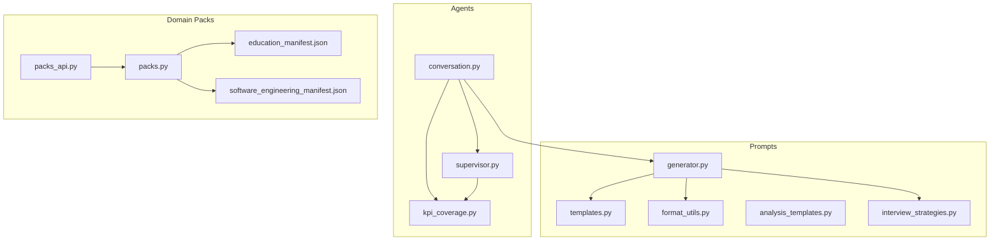
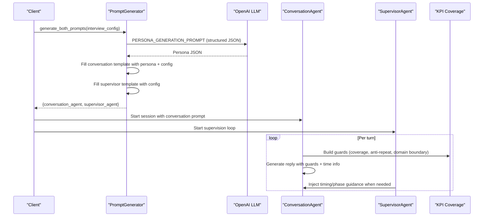
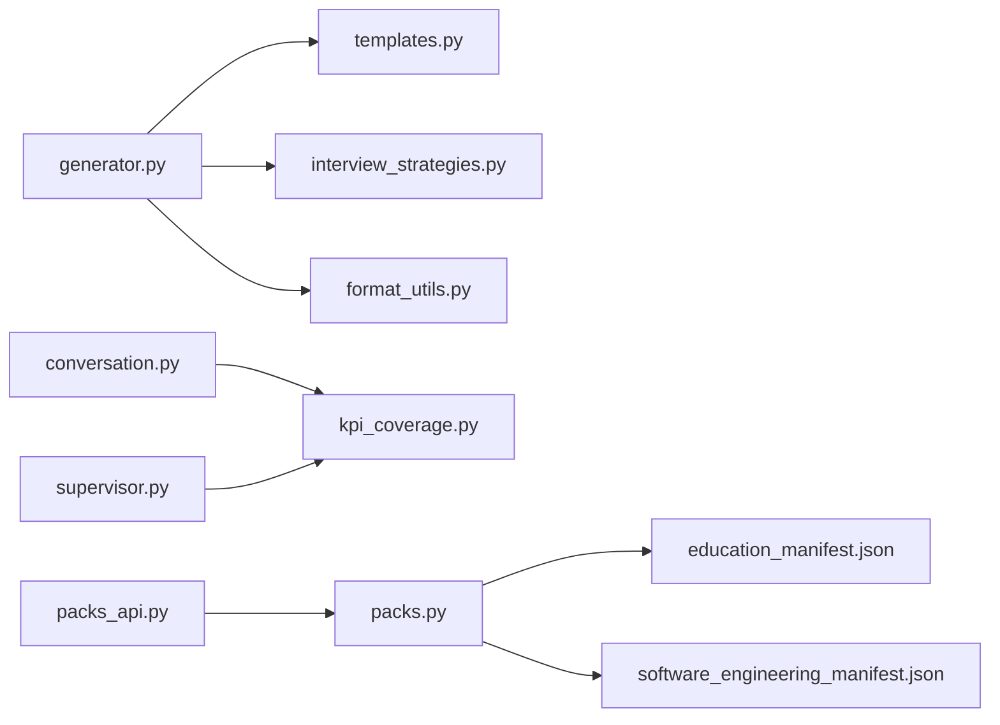

# Prompt Engineering & Template System

<cite>
**Referenced Files in This Document**
- [templates.py](file://Backend/app/ai/prompts/templates.py)
- [generator.py](file://Backend/app/ai/prompts/generator.py)
- [format_utils.py](file://Backend/app/ai/prompts/format_utils.py)
- [analysis_templates.py](file://Backend/app/ai/prompts/analysis_templates.py)
- [interview_strategies.py](file://Backend/app/ai/prompts/interview_strategies.py)
- [conversation.py](file://Backend/app/ai/agents/conversation.py)
- [supervisor.py](file://Backend/app/ai/agents/supervisor.py)
- [kpi_coverage.py](file://Backend/app/ai/utils/kpi_coverage.py)
- [packs.py](file://Backend/app/services/packs.py)
- [packs_api.py](file://Backend/app/api/v1/packs.py)
- [education_manifest.json](file://domain-packs/education/manifest.json)
- [software_engineering_manifest.json](file://domain-packs/software-engineering/manifest.json)
</cite>

## Table of Contents
1. [Introduction](#introduction)
2. [Project Structure](#project-structure)
3. [Core Components](#core-components)
4. [Architecture Overview](#architecture-overview)
5. [Detailed Component Analysis](#detailed-component-analysis)
6. [Dependency Analysis](#dependency-analysis)
7. [Performance Considerations](#performance-considerations)
8. [Troubleshooting Guide](#troubleshooting-guide)
9. [Conclusion](#conclusion)
10. [Appendices](#appendices)

## Introduction
This document explains the prompt engineering system that generates dynamic, context-aware prompts for AI agents conducting hiring interviews. It covers:
- Template management and retrieval for different interview scenarios
- The prompt generator that composes agent instructions from candidate information, job requirements, and domain-specific knowledge
- Format utilities ensuring safe, consistent prompt structure
- Post-interview analysis templates for evaluating candidate responses
- Anti-hallucination techniques, prompt validation, and optimization strategies
- Integration with domain packs to provide industry-specific prompting

The system is designed to keep interviews focused, evidence-based, and aligned with evaluation goals while preventing off-topic or hallucinated content.

## Project Structure
The prompt engineering subsystem lives under Backend/app/ai/prompts and integrates with agents and services:
- Templates define agent personas, supervisor guidance, and analysis prompts
- Generator orchestrates persona creation via an LLM and fills templates with runtime data
- Format utilities protect template integrity when injecting dynamic content
- Agents consume generated prompts and inject per-turn guards for coverage and domain boundaries
- Domain packs supply ontology, questions, and rubrics used to tailor prompts and evaluations

**Diagram sources**
- [templates.py:1-453](file://Backend/app/ai/prompts/templates.py#L1-L453)
- [generator.py:1-290](file://Backend/app/ai/prompts/generator.py#L1-L290)
- [format_utils.py:1-24](file://Backend/app/ai/prompts/format_utils.py#L1-L24)
- [analysis_templates.py:1-76](file://Backend/app/ai/prompts/analysis_templates.py#L1-L76)
- [interview_strategies.py:1-118](file://Backend/app/ai/prompts/interview_strategies.py#L1-L118)
- [conversation.py:1-200](file://Backend/app/ai/agents/conversation.py#L1-L200)
- [supervisor.py:1-200](file://Backend/app/ai/agents/supervisor.py#L1-L200)
- [kpi_coverage.py:1-236](file://Backend/app/ai/utils/kpi_coverage.py#L1-L236)
- [packs.py:1-97](file://Backend/app/services/packs.py#L1-L97)
- [packs_api.py:48-489](file://Backend/app/api/v1/packs.py#L48-L489)
- [education_manifest.json:1-143](file://domain-packs/education/manifest.json#L1-L143)
- [software_engineering_manifest.json:1-140](file://domain-packs/software-engineering/manifest.json#L1-L140)

**Section sources**
- [templates.py:1-453](file://Backend/app/ai/prompts/templates.py#L1-L453)
- [generator.py:1-290](file://Backend/app/ai/prompts/generator.py#L1-L290)
- [format_utils.py:1-24](file://Backend/app/ai/prompts/format_utils.py#L1-L24)
- [analysis_templates.py:1-76](file://Backend/app/ai/prompts/analysis_templates.py#L1-L76)
- [interview_strategies.py:1-118](file://Backend/app/ai/prompts/interview_strategies.py#L1-L118)
- [conversation.py:1-200](file://Backend/app/ai/agents/conversation.py#L1-L200)
- [supervisor.py:1-200](file://Backend/app/ai/agents/supervisor.py#L1-L200)
- [kpi_coverage.py:1-236](file://Backend/app/ai/utils/kpi_coverage.py#L1-L236)
- [packs.py:1-97](file://Backend/app/services/packs.py#L1-L97)
- [packs_api.py:48-489](file://Backend/app/api/v1/packs.py#L48-L489)
- [education_manifest.json:1-143](file://domain-packs/education/manifest.json#L1-L143)
- [software_engineering_manifest.json:1-140](file://domain-packs/software-engineering/manifest.json#L1-L140)

## Core Components
- Prompt templates: Define conversation agent persona, supervisor agent behavior, and post-interview analysis expectations.
- Prompt generator: Uses a meta-prompt to generate a structured interviewer persona, then fills conversation and supervisor templates with interview configuration and strategy.
- Format utilities: Escape dynamic content to prevent template injection errors and ensure stable formatting.
- Interview strategies: Provide scenario-specific focus blocks (Profile Screening vs Job Interview) and role instructions.
- KPI coverage and guards: Track coverage, prevent repetition, and enforce domain boundaries per turn.
- Domain packs: Supply skills, concepts, questions, and rubrics to tailor prompts and evaluations.

**Section sources**
- [templates.py:1-453](file://Backend/app/ai/prompts/templates.py#L1-L453)
- [generator.py:1-290](file://Backend/app/ai/prompts/generator.py#L1-L290)
- [format_utils.py:1-24](file://Backend/app/ai/prompts/format_utils.py#L1-L24)
- [interview_strategies.py:1-118](file://Backend/app/ai/prompts/interview_strategies.py#L1-L118)
- [kpi_coverage.py:1-236](file://Backend/app/ai/utils/kpi_coverage.py#L1-L236)
- [packs.py:1-97](file://Backend/app/services/packs.py#L1-L97)

## Architecture Overview
The system composes two agent prompts at session start:
- Conversation Agent: Conducts the interview using a persona generated by an LLM and filled into a comprehensive template.
- Supervisor Agent: Monitors progress, enforces time and coverage rules, and provides guidance back to the conversation agent.

Per-turn, the conversation agent receives injected guards derived from transcript state to maintain coverage and scope.

**Diagram sources**
- [generator.py:33-107](file://Backend/app/ai/prompts/generator.py#L33-L107)
- [generator.py:143-217](file://Backend/app/ai/prompts/generator.py#L143-L217)
- [conversation.py:8088-8109](file://Backend/app/ai/agents/conversation.py#L8088-L8109)
- [supervisor.py:578-601](file://Backend/app/ai/agents/supervisor.py#L578-L601)
- [kpi_coverage.py:101-169](file://Backend/app/ai/utils/kpi_coverage.py#L101-L169)

## Detailed Component Analysis

### Prompt Templates
- Conversation agent template defines identity, task, demeanor, tone, language, difficulty, duration, coverage plan, CV/JD references, constraints, opening sequence, time management, and wrap-up behavior. It includes strict adherence to topic, personality, difficulty, and language, plus explicit anti-hallucination and domain-boundary rules.
- Supervisor agent template defines dual-axis supervision (evaluation themes and KPIs), flow management, time management, quality assurance, configuration adherence monitoring, strategic guidance, and termination conditions.
- Persona generation prompt instructs the LLM to produce a structured JSON persona tailored to the interview type, difficulty, language, and evaluation plan.

Key behaviors enforced by templates:
- Strict topic/personality/difficulty/language adherence
- Time-based interview management with automatic wrap-up
- Off-domain request handling via tool calls and redirection
- STAR method usage and dynamic tailoring based on candidate signals
- Fixed interviewer name to avoid identity drift

**Section sources**
- [templates.py:7-252](file://Backend/app/ai/prompts/templates.py#L7-L252)
- [templates.py:254-381](file://Backend/app/ai/prompts/templates.py#L254-L381)
- [templates.py:383-453](file://Backend/app/ai/prompts/templates.py#L383-L453)

### Prompt Generator
Responsibilities:
- Generate a structured persona via an LLM call using a meta-prompt
- Fill conversation and supervisor templates with persona and interview configuration
- Ensure safe formatting by escaping dynamic values
- Close OpenAI client connections to avoid resource leaks

Data flow:
- Build persona format data from interview config
- Call LLM with response_format set to JSON
- Strip markdown fences and parse JSON
- Override persona name to a fixed value for consistency
- Compose final prompts by filling templates with escaped values

Error handling:
- Timeout wrapping around LLM call
- Validation for empty persona content
- Graceful client close with logging

**Section sources**
- [generator.py:25-107](file://Backend/app/ai/prompts/generator.py#L25-L107)
- [generator.py:109-141](file://Backend/app/ai/prompts/generator.py#L109-L141)
- [generator.py:143-217](file://Backend/app/ai/prompts/generator.py#L143-L217)
- [generator.py:219-290](file://Backend/app/ai/prompts/generator.py#L219-L290)

### Format Utilities
Purpose:
- Escape curly braces in dynamic content to prevent breaking Python str.format templates
- Normalize various types to strings before escaping

Usage:
- Applied to all values passed into template .format() calls to ensure robustness against user/LLM-provided content

**Section sources**
- [format_utils.py:1-24](file://Backend/app/ai/prompts/format_utils.py#L1-L24)

### Interview Strategies
Provides scenario-specific strategy dictionaries:
- Profile Screening: Focuses on building a portable skill signal from concrete examples; uses second person; emphasizes deep dive into strongest area; balances Axis A (screening themes) and Axis B (CV/profile facts).
- Job Interview: Enforces a locked question pool mapped to JD requirements; ensures consistent assessment across candidates; probes depth with STAR follow-ups; maintains professional boundaries.

Integration:
- Strategy fields are injected into conversation prompts via interview_focus and interview_role_instructions
- Length defaults and persona_style guide tone and pacing

**Section sources**
- [interview_strategies.py:1-118](file://Backend/app/ai/prompts/interview_strategies.py#L1-L118)

### Post-Interview Analysis Templates
- Individual analysis prompt instructs the model to produce evidence-only JSON assessments grounded in transcript content, including data quality, evidence density, competency scores, sentiment, highlights, concerns, STAR analysis, and recommendations.
- Synthesis report prompt placeholder maintained for compatibility.

Validation and anti-hallucination:
- Explicit instruction to not invent facts absent from the transcript
- Structured output schema for reliable parsing and downstream processing

**Section sources**
- [analysis_templates.py:1-76](file://Backend/app/ai/prompts/analysis_templates.py#L1-L76)

### Agent Integration and Per-Turn Guards
Conversation agent:
- Builds per-turn instruction blocks combining opening guard, domain boundary guard, KPI coverage guard, anti-repeat guard, wrap-up guard, language guard, time info, and end-tool guard
- Sanitizes stale timing lines from supervisor guidance to rely on authoritative clock
- Retries generation if prior attempt returned None

Supervisor agent:
- Runs periodic checks between turns to avoid interrupting active conversation
- Generates timing assistance messages based on elapsed time and phases
- Provides fallback to start wrap-up if time is up but closing flow did not trigger cleanly

KPI coverage utilities:
- Extract KPI names from config and plans
- Detect mentions in transcript text with alias support
- Compute uncovered/covered sets and consecutive streaks
- Build anti-repeat and coverage mandates to steer next question selection
- Build domain boundary guard to enforce hiring-interview scope and handle off-domain requests

**Section sources**
- [conversation.py:8088-8109](file://Backend/app/ai/agents/conversation.py#L8088-L8109)
- [conversation.py:142-154](file://Backend/app/ai/agents/conversation.py#L142-L154)
- [supervisor.py:578-601](file://Backend/app/ai/agents/supervisor.py#L578-L601)
- [kpi_coverage.py:9-68](file://Backend/app/ai/utils/kpi_coverage.py#L9-L68)
- [kpi_coverage.py:101-169](file://Backend/app/ai/utils/kpi_coverage.py#L101-L169)
- [kpi_coverage.py:172-236](file://Backend/app/ai/utils/kpi_coverage.py#L172-L236)

### Domain Packs Integration
Pack registry:
- Loads manifests from domain-packs directory
- Validates required keys, semantic versioning, question lists, and rubric dimensions
- Serves available packs and individual pack manifests

API layer:
- Lists packs with linkage counts
- Resolves built-in vs custom packs
- Activates packs per tenant and records audit events
- Supports creating/updating/deleting custom packs

Manifest contents:
- Ontology: skills, certifications, concepts
- Resume extraction signals
- Matching weights for CV vs interview score
- Profile and applied interview questions with competencies and expected concepts
- Evaluation rubric dimensions and compliance rules

Example packs:
- Education: Academic hiring focus with pedagogy, assessment, and HEC alignment
- Software Engineering: Technical hiring focus with system design, API design, testing, observability, and security basics

**Section sources**
- [packs.py:1-97](file://Backend/app/services/packs.py#L1-L97)
- [packs_api.py:48-489](file://Backend/app/api/v1/packs.py#L48-L489)
- [education_manifest.json:1-143](file://domain-packs/education/manifest.json#L1-L143)
- [software_engineering_manifest.json:1-140](file://domain-packs/software-engineering/manifest.json#L1-L140)

## Dependency Analysis

**Diagram sources**
- [generator.py:14-18](file://Backend/app/ai/prompts/generator.py#L14-L18)
- [conversation.py:56-62](file://Backend/app/ai/agents/conversation.py#L56-L62)
- [supervisor.py:9-10](file://Backend/app/ai/agents/supervisor.py#L9-L10)
- [packs_api.py:48-489](file://Backend/app/api/v1/packs.py#L48-L489)
- [packs.py:1-97](file://Backend/app/services/packs.py#L1-L97)
- [education_manifest.json:1-143](file://domain-packs/education/manifest.json#L1-L143)
- [software_engineering_manifest.json:1-140](file://domain-packs/software-engineering/manifest.json#L1-L140)

**Section sources**
- [generator.py:14-18](file://Backend/app/ai/prompts/generator.py#L14-L18)
- [conversation.py:56-62](file://Backend/app/ai/agents/conversation.py#L56-L62)
- [supervisor.py:9-10](file://Backend/app/ai/agents/supervisor.py#L9-L10)
- [packs_api.py:48-489](file://Backend/app/api/v1/packs.py#L48-L489)
- [packs.py:1-97](file://Backend/app/services/packs.py#L1-L97)

## Performance Considerations
- Use response_format JSON for persona generation to reduce parsing overhead and improve reliability
- Close OpenAI clients after use to free connections
- Limit profile summaries to concise previews to control prompt size
- Avoid excessive follow-ups per KPI to reduce token usage and keep interviews efficient
- Batch guard computations per turn to minimize repeated transcript scans

[No sources needed since this section provides general guidance]

## Troubleshooting Guide
Common issues and resolutions:
- Empty persona response: Validate LLM output and ensure non-empty content before parsing
- Template formatting errors: Ensure all values are escaped via format utilities
- Off-topic conversations: Verify domain boundary guard injection and confirm tool call enforcement
- Repetitive questioning: Check anti-repeat guard and KPI coverage mandate injection
- Time mismanagement: Confirm supervisor timing assistance and conversation agent time info injection
- Pack loading failures: Validate manifest schema and ensure required keys exist

**Section sources**
- [generator.py:94-107](file://Backend/app/ai/prompts/generator.py#L94-L107)
- [format_utils.py:6-23](file://Backend/app/ai/prompts/format_utils.py#L6-L23)
- [conversation.py:8088-8109](file://Backend/app/ai/agents/conversation.py#L8088-L8109)
- [supervisor.py:578-601](file://Backend/app/ai/agents/supervisor.py#L578-L601)
- [packs.py:34-62](file://Backend/app/services/packs.py#L34-L62)

## Conclusion
The prompt engineering system combines robust templates, dynamic generation, and per-turn safeguards to deliver focused, evidence-based hiring interviews. By integrating domain packs and enforcing strict anti-hallucination and coverage rules, it ensures consistent, high-quality assessments across diverse roles and industries.

[No sources needed since this section summarizes without analyzing specific files]

## Appendices

### Creating Custom Prompt Templates
Steps to create a new interview strategy:
- Define strategy dictionary with description, persona_style, interview_focus, interview_role_instructions, and length
- Inject strategy fields into conversation prompts via generator template filling
- Align KPIs and evaluation notes with strategy focus areas
- Validate persona output and ensure fixed interviewer name consistency

Examples:
- Profile Screening strategy focuses on deep-dive into candidate’s strongest area using CV/profile facts
- Job Interview strategy enforces locked question pools mapped to job descriptions

**Section sources**
- [interview_strategies.py:18-118](file://Backend/app/ai/prompts/interview_strategies.py#L18-L118)
- [generator.py:143-217](file://Backend/app/ai/prompts/generator.py#L143-L217)

### Anti-Hallucination Techniques
- Explicit instructions to base answers only on transcript evidence
- Domain boundary guards to prevent unrelated topics
- Off-domain request handling via tool calls and redirection
- Fixed interviewer identity to avoid persona drift
- Structured output schemas for analysis prompts

**Section sources**
- [templates.py:58-68](file://Backend/app/ai/prompts/templates.py#L58-L68)
- [templates.py:123-149](file://Backend/app/ai/prompts/templates.py#L123-L149)
- [analysis_templates.py:3-69](file://Backend/app/ai/prompts/analysis_templates.py#L3-L69)
- [kpi_coverage.py:172-236](file://Backend/app/ai/utils/kpi_coverage.py#L172-L236)

### Prompt Validation and Optimization
- Validate domain pack manifests for required keys and schema compliance
- Use response_format JSON to constrain LLM outputs
- Escape dynamic content to prevent template injection
- Keep profiles and summaries concise to reduce prompt size
- Limit follow-ups per KPI to improve efficiency

**Section sources**
- [packs.py:34-62](file://Backend/app/services/packs.py#L34-L62)
- [generator.py:74-107](file://Backend/app/ai/prompts/generator.py#L74-L107)
- [format_utils.py:6-23](file://Backend/app/ai/prompts/format_utils.py#L6-L23)
- [kpi_coverage.py:101-169](file://Backend/app/ai/utils/kpi_coverage.py#L101-L169)

### Integrating Domain Packs
- Load and validate manifests via pack registry
- Activate packs per tenant through API endpoints
- Use pack ontology and questions to tailor prompts and evaluations
- Maintain compliance rules and rubrics for consistent scoring

**Section sources**
- [packs.py:64-97](file://Backend/app/services/packs.py#L64-L97)
- [packs_api.py:421-489](file://Backend/app/api/v1/packs.py#L421-L489)
- [education_manifest.json:1-143](file://domain-packs/education/manifest.json#L1-L143)
- [software_engineering_manifest.json:1-140](file://domain-packs/software-engineering/manifest.json#L1-L140)