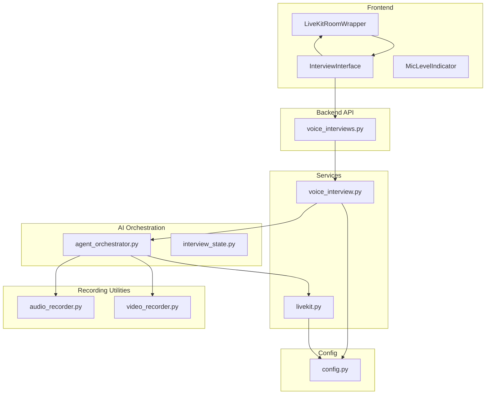
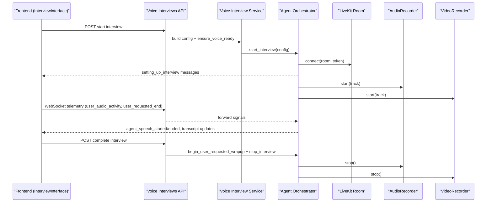
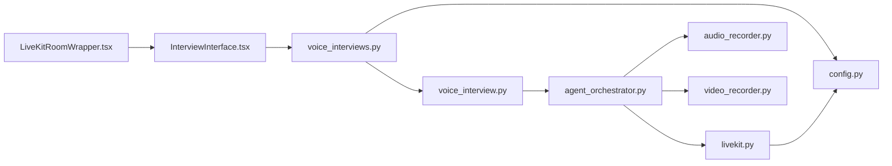

# Voice Integration & Real-time Communication

<cite>
**Referenced Files in This Document**
- [voice_interview.py](file://Backend/app/services/voice_interview.py)
- [audio_recorder.py](file://Backend/app/ai/utils/audio_recorder.py)
- [video_recorder.py](file://Backend/app/ai/utils/video_recorder.py)
- [livekit.py](file://Backend/app/services/livekit.py)
- [voice_interviews.py](file://Backend/app/api/v1/voice_interviews.py)
- [config.py](file://Backend/app/core/config.py)
- [agent_orchestrator.py](file://Backend/app/ai/services/agent_orchestrator.py)
- [interview_state.py](file://Backend/app/ai/utils/interview_state.py)
- [interview.py](file://Backend/app/schemas/interview.py)
- [InterviewInterface.tsx](file://Frontend/components/interviews/voice/InterviewInterface.tsx)
- [LiveKitRoomWrapper.tsx](file://Frontend/components/interviews/voice/LiveKitRoomWrapper.tsx)
- [MicLevelIndicator.tsx](file://Frontend/components/interviews/voice/MicLevelIndicator.tsx)
</cite>

## Table of Contents
1. [Introduction](#introduction)
2. [Project Structure](#project-structure)
3. [Core Components](#core-components)
4. [Architecture Overview](#architecture-overview)
5. [Detailed Component Analysis](#detailed-component-analysis)
6. [Dependency Analysis](#dependency-analysis)
7. [Performance Considerations](#performance-considerations)
8. [Troubleshooting Guide](#troubleshooting-guide)
9. [Conclusion](#conclusion)
10. [Appendices](#appendices)

## Introduction
This document explains the voice integration system that enables real-time audio and video communication during interviews. It covers:
- Audio recording and processing for capturing candidate voice input, including noise suppression and quality enhancement on the client side.
- Video recording functionality to capture visual interview data and integrate with LiveKit for real-time streaming.
- The voice interview service that orchestrates audio processing, transcription, and response generation in real time via AI agents.
- Configuration options for voice models, audio formats, and streaming parameters.
- Error handling strategies for network issues, audio quality problems, and graceful fallbacks when voice features are unavailable.
- Examples of customizing voice settings and integrating with external speech-to-text services.

## Project Structure
The voice integration spans backend services, AI orchestration, configuration, and frontend components:
- Backend API endpoints expose session management, token issuance, and telemetry.
- Services manage LiveKit tokens and orchestrate AI agent sessions.
- AI utilities record audio and video tracks from LiveKit streams.
- Frontend components connect to LiveKit rooms, manage media devices, and communicate with the backend via WebSockets.

**Diagram sources**
- [voice_interviews.py:1-416](file://Backend/app/api/v1/voice_interviews.py#L1-L416)
- [voice_interview.py:1-272](file://Backend/app/services/voice_interview.py#L1-L272)
- [agent_orchestrator.py:1-370](file://Backend/app/ai/services/agent_orchestrator.py#L1-L370)
- [audio_recorder.py:1-98](file://Backend/app/ai/utils/audio_recorder.py#L1-L98)
- [video_recorder.py:1-116](file://Backend/app/ai/utils/video_recorder.py#L1-L116)
- [livekit.py:1-39](file://Backend/app/services/livekit.py#L1-L39)
- [config.py:1-215](file://Backend/app/core/config.py#L1-L215)
- [InterviewInterface.tsx:1-800](file://Frontend/components/interviews/voice/InterviewInterface.tsx#L1-L800)
- [LiveKitRoomWrapper.tsx:1-104](file://Frontend/components/interviews/voice/LiveKitRoomWrapper.tsx#L1-L104)
- [MicLevelIndicator.tsx:1-119](file://Frontend/components/interviews/voice/MicLevelIndicator.tsx#L1-L119)

**Section sources**
- [voice_interviews.py:1-416](file://Backend/app/api/v1/voice_interviews.py#L1-L416)
- [config.py:1-215](file://Backend/app/core/config.py#L1-L215)

## Core Components
- Voice Interview Service: Builds configurations for profile screening and job interviews, starts and ends sessions, and issues LiveKit participant tokens.
- Agent Orchestrator: Manages background setup, connects to LiveKit, initializes conversation and supervisor agents, and handles lifecycle events.
- Audio Recorder: Captures remote audio tracks into WAV files using LiveKit’s AudioStream.
- Video Recorder: Captures remote video tracks into raw VP8 frames within a minimal WebM container.
- LiveKit Token Service: Issues JWT tokens for participants and agents with appropriate grants and TTL.
- Frontend Interview Interface: Connects to LiveKit, manages microphone and camera, sends telemetry, and handles real-time state changes.

**Section sources**
- [voice_interview.py:53-151](file://Backend/app/services/voice_interview.py#L53-L151)
- [voice_interview.py:189-251](file://Backend/app/services/voice_interview.py#L189-L251)
- [agent_orchestrator.py:42-193](file://Backend/app/ai/services/agent_orchestrator.py#L42-L193)
- [audio_recorder.py:16-98](file://Backend/app/ai/utils/audio_recorder.py#L16-L98)
- [video_recorder.py:16-116](file://Backend/app/ai/utils/video_recorder.py#L16-L116)
- [livekit.py:10-39](file://Backend/app/services/livekit.py#L10-L39)
- [InterviewInterface.tsx:211-332](file://Frontend/components/interviews/voice/InterviewInterface.tsx#L211-L332)

## Architecture Overview
The system coordinates real-time audio/video through LiveKit while orchestrating AI-driven conversation and analysis.

**Diagram sources**
- [voice_interviews.py:204-255](file://Backend/app/api/v1/voice_interviews.py#L204-L255)
- [voice_interview.py:189-251](file://Backend/app/services/voice_interview.py#L189-L251)
- [agent_orchestrator.py:42-193](file://Backend/app/ai/services/agent_orchestrator.py#L42-L193)
- [audio_recorder.py:29-84](file://Backend/app/ai/utils/audio_recorder.py#L29-L84)
- [video_recorder.py:52-104](file://Backend/app/ai/utils/video_recorder.py#L52-L104)

## Detailed Component Analysis

### Voice Interview Service
Responsibilities:
- Build interview configurations for profile screening and job interviews, embedding candidate context, questions, and evaluation plans.
- Ensure voice features are ready by validating LiveKit and AI configuration.
- Start and end voice sessions, registering live sessions and coordinating with the agent orchestrator.
- Issue participant tokens for LiveKit rooms with appropriate grants and TTL.

Key behaviors:
- Config builders assemble persona style, focus, language, duration, and evaluation metadata.
- Session lifecycle uses async locks to prevent duplicate starts and ensures cleanup on end.
- Token issuance validates configuration and returns server URL, token, and room name.

**Section sources**
- [voice_interview.py:53-151](file://Backend/app/services/voice_interview.py#L53-L151)
- [voice_interview.py:154-186](file://Backend/app/services/voice_interview.py#L154-L186)
- [voice_interview.py:189-251](file://Backend/app/services/voice_interview.py#L189-L251)

### Agent Orchestrator
Responsibilities:
- Manage background setup sequence: generate prompts, connect to LiveKit, initialize agents, and signal readiness.
- Handle user-requested wrap-up and graceful stop, ensuring resources are released and post-interview tasks run.
- Refresh persisted transcripts before resuming sessions and update DB with recorded media paths.

Key flows:
- Setup emits status messages to the frontend via telemetry WebSocket.
- Agents are linked; conversation agent interacts with supervisor agent for moderation and timing.
- Cleanup disconnects room, closes HTTP session, and triggers rating generation.

**Section sources**
- [agent_orchestrator.py:42-193](file://Backend/app/ai/services/agent_orchestrator.py#L42-L193)
- [agent_orchestrator.py:203-281](file://Backend/app/ai/services/agent_orchestrator.py#L203-L281)
- [agent_orchestrator.py:282-361](file://Backend/app/ai/services/agent_orchestrator.py#L282-L361)

### Audio Recorder
Responsibilities:
- Record remote audio tracks to WAV files using LiveKit’s AudioStream.
- Configure WAV format (mono, 16-bit, 48kHz) and write frames asynchronously.
- Provide safe start/stop with error handling and cleanup.

Processing notes:
- Noise cancellation and echo suppression are handled by the browser’s MediaStream constraints on the client side.
- Server-side recording captures raw PCM frames; no additional DSP is applied here.

**Section sources**
- [audio_recorder.py:16-98](file://Backend/app/ai/utils/audio_recorder.py#L16-L98)
- [InterviewInterface.tsx:211-255](file://Frontend/components/interviews/voice/InterviewInterface.tsx#L211-L255)

### Video Recorder
Responsibilities:
- Record remote video tracks to a minimal WebM container containing raw VP8 frames.
- Write EBML header and frame payloads; suitable for playback in modern browsers.
- Provide safe start/stop with error handling and cleanup.

Processing notes:
- No transcoding or muxing with audio occurs here; separate audio recording is supported.
- Resolution is determined by the sender; defaults assume common dimensions.

**Section sources**
- [video_recorder.py:16-116](file://Backend/app/ai/utils/video_recorder.py#L16-L116)

### LiveKit Token Service
Responsibilities:
- Validate configuration and issue JWT tokens for participants and agents.
- Set grants for room join and agent capabilities, with configurable TTL.

Integration points:
- Used by both voice interview service and orchestrator to secure connections.
- Returns structured responses including server URL, identity, and expiration.

**Section sources**
- [livekit.py:10-39](file://Backend/app/services/livekit.py#L10-L39)
- [voice_interview.py:230-251](file://Backend/app/services/voice_interview.py#L230-L251)
- [agent_orchestrator.py:349-361](file://Backend/app/ai/services/agent_orchestrator.py#L349-L361)

### Frontend Interview Interface
Responsibilities:
- Connect to LiveKit room, manage microphone and camera, and handle real-time state changes.
- Send telemetry events (user audio activity, user requested end) and receive agent signals.
- Perform one-shot identity verification by capturing a single frame and sending it to the backend.
- Implement client-side recording by mixing local mic and remote audio tracks.

Quality enhancements:
- Enables auto gain control, echo cancellation, and noise suppression when enabling the microphone.
- Uses Web Audio API to mix and record combined audio streams.

Error handling:
- Retries telemetry connection with exponential backoff.
- Gracefully handles missing camera or microphone access and provides user feedback.

**Section sources**
- [InterviewInterface.tsx:211-332](file://Frontend/components/interviews/voice/InterviewInterface.tsx#L211-L332)
- [InterviewInterface.tsx:334-397](file://Frontend/components/interviews/voice/InterviewInterface.tsx#L334-L397)
- [InterviewInterface.tsx:474-724](file://Frontend/components/interviews/voice/InterviewInterface.tsx#L474-L724)
- [InterviewInterface.tsx:778-800](file://Frontend/components/interviews/voice/InterviewInterface.tsx#L778-L800)

### Mic Level Indicator
Responsibilities:
- Visualize microphone level using an analyser node connected to the mic source.
- Display muted vs active states with dynamic bar indicators.

Usage:
- Integrates with the interview interface’s audio context and mic source references.

**Section sources**
- [MicLevelIndicator.tsx:1-119](file://Frontend/components/interviews/voice/MicLevelIndicator.tsx#L1-L119)

## Dependency Analysis
Component relationships and coupling:
- Voice Interviews API depends on voice_interview service for session management and token issuance.
- Voice Interview Service depends on configuration and agent orchestrator for session lifecycle.
- Agent Orchestrator depends on LiveKit SDK and telemetry manager for real-time communication.
- Recording utilities depend on LiveKit streams and configuration for output directories.
- Frontend components depend on LiveKit React wrappers and backend APIs for tokens and telemetry.

**Diagram sources**
- [voice_interviews.py:1-416](file://Backend/app/api/v1/voice_interviews.py#L1-L416)
- [voice_interview.py:1-272](file://Backend/app/services/voice_interview.py#L1-L272)
- [agent_orchestrator.py:1-370](file://Backend/app/ai/services/agent_orchestrator.py#L1-L370)
- [livekit.py:1-39](file://Backend/app/services/livekit.py#L1-L39)
- [audio_recorder.py:1-98](file://Backend/app/ai/utils/audio_recorder.py#L1-L98)
- [video_recorder.py:1-116](file://Backend/app/ai/utils/video_recorder.py#L1-L116)
- [config.py:1-215](file://Backend/app/core/config.py#L1-L215)
- [InterviewInterface.tsx:1-800](file://Frontend/components/interviews/voice/InterviewInterface.tsx#L1-L800)
- [LiveKitRoomWrapper.tsx:1-104](file://Frontend/components/interviews/voice/LiveKitRoomWrapper.tsx#L1-L104)

**Section sources**
- [voice_interviews.py:1-416](file://Backend/app/api/v1/voice_interviews.py#L1-L416)
- [config.py:1-215](file://Backend/app/core/config.py#L1-L215)

## Performance Considerations
- Client-side audio processing leverages browser-native noise suppression and echo cancellation to reduce CPU usage and improve quality.
- Server-side recording writes raw frames directly to disk to minimize overhead; consider post-processing for muxing if needed.
- Telemetry WebSocket reconnection uses exponential backoff to handle transient network issues without overwhelming the server.
- Agent orchestrator runs heavy setup tasks in background tasks to keep API responses responsive.

[No sources needed since this section provides general guidance]

## Troubleshooting Guide
Common issues and resolutions:
- LiveKit not configured: Ensure THOS_LIVEKIT_URL, THOS_LIVEKIT_API_KEY, and THOS_LIVEKIT_API_SECRET are set.
- AI not configured: Ensure THOS_AI_API_KEY is set for voice interviews.
- Microphone access required: If microphone toggling fails, prompt the user to grant permissions and retry.
- Identity check image invalid: Validate data URL format, content type, and base64 decoding; reject empty frames.
- Telemetry connection closed: Retry with backoff; if code 1008 (policy violation), inform the user that the link is invalid or expired.
- Agent speaking timeout: UI clears stale speaking flags after a timeout to prevent mic lockups.

**Section sources**
- [voice_interview.py:154-166](file://Backend/app/services/voice_interview.py#L154-L166)
- [voice_interviews.py:60-92](file://Backend/app/api/v1/voice_interviews.py#L60-L92)
- [InterviewInterface.tsx:198-209](file://Frontend/components/interviews/voice/InterviewInterface.tsx#L198-L209)
- [InterviewInterface.tsx:677-707](file://Frontend/components/interviews/voice/InterviewInterface.tsx#L677-L707)

## Conclusion
The voice integration system combines robust backend orchestration, real-time streaming via LiveKit, and a responsive frontend to deliver seamless audio/video interviews. It supports configurable voice models, recording formats, and streaming parameters, with comprehensive error handling and graceful fallbacks. Customization points include model selection, VAD behavior, and transcription models, enabling integration with external speech-to-text services.

[No sources needed since this section summarizes without analyzing specific files]

## Appendices

### Configuration Options
- Voice provider and models:
  - realtime_provider, openai_voice, google_api_key, google_voice
  - conversation_model, input_transcription_model, analysis_model
- Audio/VAD tuning:
  - conversation_vad_type, conversation_vad_eagerness, voice_detection_threshold
  - listening_start_silence_ms, user_turn_end_silence_ms, min_user_words_before_reply
  - min_user_speech_duration_ms, max_user_speech_seconds, silence_threshold
- Timing and flow:
  - default_interview_length_minutes, initial_greeting_timeout, supervisor_check_interval
  - timing_assistance_interval_seconds, wrap_up_start_seconds, soft_close_user_pause_seconds
  - post_interview_grace_seconds, availability_check_seconds, max_user_silence_seconds
- Storage and directories:
  - recordings_dir, videos_dir
- Feature flag:
  - voice_interview_enabled

**Section sources**
- [config.py:77-121](file://Backend/app/core/config.py#L77-L121)

### Example: Customizing Voice Settings
- Change conversation model temperature and prompt generation model:
  - Adjust conversation_model_temperature and prompt_generation_model in configuration.
- Switch transcription model:
  - Update input_transcription_model to a different supported model.
- Tune VAD sensitivity:
  - Modify conversation_vad_type and voice_detection_threshold for more aggressive or conservative voice detection.

**Section sources**
- [config.py:84-117](file://Backend/app/core/config.py#L84-L117)

### Example: Integrating External Speech-to-Text Services
- Replace input_transcription_model with a service-specific identifier if supported by the agent pipeline.
- Ensure the corresponding provider credentials are configured in environment variables.
- Validate that the agent orchestrator can route transcription requests to the new service.

[No sources needed since this section provides general guidance]