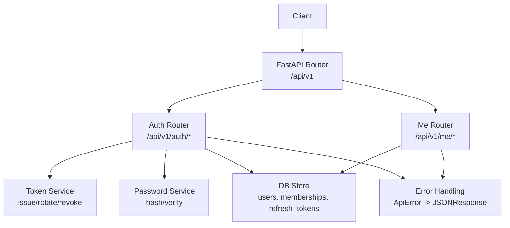
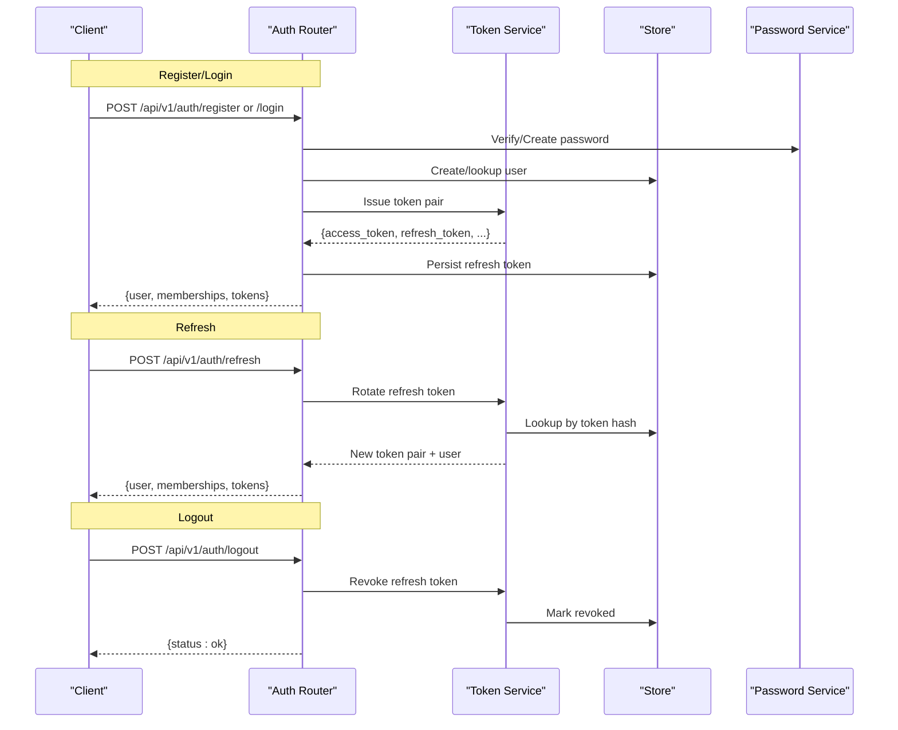
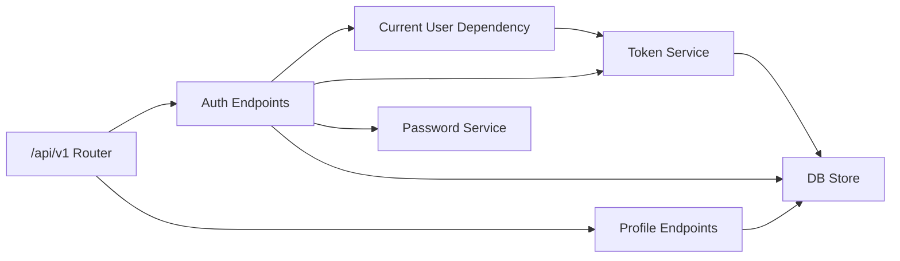
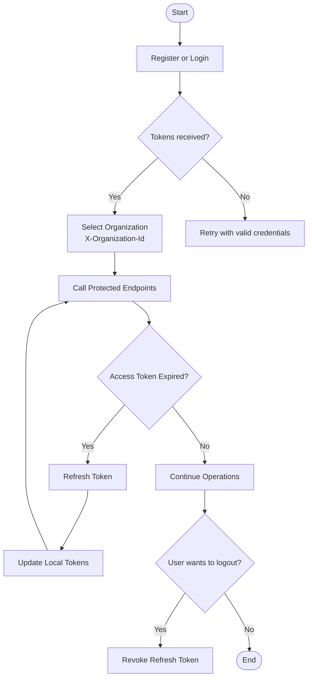

# Authentication & User Management API

<cite>
**Referenced Files in This Document**
- [auth.py](file://Backend/app/api/v1/auth.py)
- [me.py](file://Backend/app/api/v1/me.py)
- [router.py](file://Backend/app/api/v1/router.py)
- [auth_tokens.py](file://Backend/app/services/auth_tokens.py)
- [passwords.py](file://Backend/app/services/passwords.py)
- [dependencies.py](file://Backend/app/api/dependencies.py)
- [store.py](file://Backend/app/db/store.py)
- [config.py](file://Backend/app/core/config.py)
- [errors.py](file://Backend/app/core/errors.py)
</cite>

## Table of Contents
1. Introduction
2. Project Structure
3. Core Components
4. Architecture Overview
5. Detailed Component Analysis
6. Dependency Analysis
7. Performance Considerations
8. Troubleshooting Guide
9. Conclusion
10. Appendices

## Introduction
This document provides comprehensive API documentation for authentication and user management endpoints, including registration, login, logout, token refresh, and profile management. It covers JWT access tokens, opaque refresh tokens, password hashing, session state via memberships, and multi-tenant organization context. It also documents the /api/v1/me endpoint for current user operations and avatar management, along with error responses, validation rules, and security considerations. Practical examples illustrate authentication flows across organizations.

## Project Structure
The authentication and identity features are implemented under:
- API routes: /api/v1/auth (register, login, refresh, logout, me), /api/v1/me (profile and avatar)
- Token handling: JWT access tokens and opaque refresh tokens
- Password hashing: bcrypt-based hashing and verification
- Dependencies: Bearer token decoding, current user resolution, organization context
- Storage: Users, memberships, refresh tokens, audit records
- Configuration: JWT secrets, TTLs, environment settings
- Error handling: Standardized error responses

**Diagram sources**
- [router.py:26-40](file://Backend/app/api/v1/router.py#L26-L40)
- [auth.py:14-185](file://Backend/app/api/v1/auth.py#L14-L185)
- [me.py:11-110](file://Backend/app/api/v1/me.py#L11-L110)
- [auth_tokens.py:22-127](file://Backend/app/services/auth_tokens.py#L22-L127)
- [passwords.py:6-17](file://Backend/app/services/passwords.py#L6-L17)
- [store.py:64-210](file://Backend/app/db/store.py#L64-L210)
- [errors.py:60-112](file://Backend/app/core/errors.py#L60-L112)

**Section sources**
- [router.py:26-40](file://Backend/app/api/v1/router.py#L26-L40)
- [auth.py:14-185](file://Backend/app/api/v1/auth.py#L14-L185)
- [me.py:11-110](file://Backend/app/api/v1/me.py#L11-L110)

## Core Components
- Authentication endpoints: register, login, refresh, logout, auth me
- Identity endpoints: get current user, upload/get/delete avatar
- Token service: issue access tokens (JWT HS256), create/rotate/revoke refresh tokens
- Password service: hash and verify passwords using bcrypt
- Current user dependency: decode JWT, resolve user, enforce active status
- Organization context: memberships and roles per tenant; optional X-Organization-Id header
- Configuration: JWT secret, TTLs, superadmin emails, environment flags
- Error handling: standardized JSON errors with codes and messages

Key behaviors:
- Registration creates a user, ensures candidate record exists, issues token pair, returns public user info and memberships.
- Login verifies credentials, checks account status, issues token pair, returns session payload.
- Refresh rotates refresh tokens and returns new token pair plus session payload.
- Logout revokes the provided refresh token.
- Profile endpoints return current user details, memberships, applications, and avatar fields.

**Section sources**
- [auth.py:19-148](file://Backend/app/api/v1/auth.py#L19-L148)
- [me.py:22-110](file://Backend/app/api/v1/me.py#L22-L110)
- [auth_tokens.py:22-127](file://Backend/app/services/auth_tokens.py#L22-L127)
- [passwords.py:6-17](file://Backend/app/services/passwords.py#L6-L17)
- [dependencies.py:40-114](file://Backend/app/api/dependencies.py#L40-L114)
- [store.py:64-210](file://Backend/app/db/store.py#L64-L210)
- [config.py:64-68](file://Backend/app/core/config.py#L64-L68)
- [errors.py:20-112](file://Backend/app/core/errors.py#L20-L112)

## Architecture Overview
Authentication flow uses short-lived JWT access tokens and long-lived opaque refresh tokens stored in the database as hashed values. Access tokens carry user identity claims and are validated on protected endpoints. Refresh tokens are rotated on use to prevent replay attacks. Session payloads include memberships and candidate information for multi-tenant contexts.

**Diagram sources**
- [auth.py:74-148](file://Backend/app/api/v1/auth.py#L74-L148)
- [auth_tokens.py:67-127](file://Backend/app/services/auth_tokens.py#L67-L127)
- [store.py:157-210](file://Backend/app/db/store.py#L157-L210)
- [passwords.py:6-17](file://Backend/app/services/passwords.py#L6-L17)

## Detailed Component Analysis

### Authentication Endpoints
- POST /api/v1/auth/register
  - Request schema: email (validated format), password (min length), display_name (min length)
  - Behavior: Normalizes email, checks uniqueness, creates user with hashed password, ensures candidate record, issues token pair, returns public user info and memberships
  - Success response: access_token, refresh_token, token_type, expires_in, user, memberships, candidate_id, is_superadmin, has_employer_membership
  - Errors: 409 if email already registered; validation errors for invalid input

- POST /api/v1/auth/login
  - Request schema: email (validated format), password
  - Behavior: Verifies credentials, checks account status, issues token pair, returns session payload
  - Success response: Same as register
  - Errors: 401 invalid_credentials; 403 account_disabled

- POST /api/v1/auth/refresh
  - Request schema: refresh_token
  - Behavior: Validates refresh token, rotates it, issues new token pair, returns session payload
  - Success response: Same as register
  - Errors: 401 invalid_refresh_token; 401 refresh_token_expired

- POST /api/v1/auth/logout
  - Request schema: refresh_token
  - Behavior: Revokes refresh token
  - Success response: {status: ok}
  - Errors: None expected beyond invalid token scenarios handled by store lookup

- GET /api/v1/auth/me
  - Requires authenticated user via Bearer token
  - Response: user, memberships, organization_applications, candidate_id, is_superadmin, has_employer_membership

Validation rules:
- Email must match pattern and be within length limits
- Passwords have minimum lengths
- Refresh tokens have minimum length constraints

Security considerations:
- Passwords are hashed with bcrypt before storage
- Access tokens are JWT HS256 with configurable TTL
- Refresh tokens are opaque, hashed, stored, and rotated on use
- Account status enforced at login and token decode time

**Section sources**
- [auth.py:19-148](file://Backend/app/api/v1/auth.py#L19-L148)
- [auth_tokens.py:22-127](file://Backend/app/services/auth_tokens.py#L22-L127)
- [passwords.py:6-17](file://Backend/app/services/passwords.py#L6-L17)
- [dependencies.py:40-114](file://Backend/app/api/dependencies.py#L40-L114)
- [store.py:64-210](file://Backend/app/db/store.py#L64-L210)
- [errors.py:60-112](file://Backend/app/core/errors.py#L60-L112)

### Profile and Avatar Management
- GET /api/v1/me
  - Requires authenticated user
  - Response includes user object with id, identity, display_name, email, is_superadmin, avatar fields; memberships; organization_applications; candidate_id; flags

- POST /api/v1/me/avatar
  - Uploads or replaces the caller’s profile photo
  - Stores file and updates user avatar path; writes audit record
  - Response indicates avatar presence and URL

- GET /api/v1/me/avatar
  - Returns the avatar image if present; otherwise 404

- DELETE /api/v1/me/avatar
  - Removes avatar file and clears avatar path; returns updated avatar state

Avatar behavior:
- Avatar URL is exposed via a dedicated route
- Uploading triggers audit logging for accountability
- Deleting removes both file and DB reference

**Section sources**
- [me.py:22-110](file://Backend/app/api/v1/me.py#L22-L110)
- [store.py:146-151](file://Backend/app/db/store.py#L146-L151)
- [errors.py:60-112](file://Backend/app/core/errors.py#L60-L112)

### JWT and Refresh Token Handling
- Access tokens:
  - Algorithm: HS256
  - Claims: sub (user id), email, identity, typ="access", iat, exp
  - Validation: Decodes against configured secret; enforces typ and presence of sub; maps expiration and invalid token cases to standardized errors

- Refresh tokens:
  - Opaque random strings; hashed before storage
  - Stored with user_id, expires_at, revoked_at, replaced_by
  - Rotation: On successful refresh, old token is marked revoked and linked to new token; new token pair issued

- Configuration:
  - jwt_secret, jwt_access_ttl_seconds, jwt_refresh_ttl_seconds
  - Superadmin emails set determine automatic superadmin flag on registration

**Section sources**
- [auth_tokens.py:22-127](file://Backend/app/services/auth_tokens.py#L22-L127)
- [store.py:157-210](file://Backend/app/db/store.py#L157-L210)
- [config.py:64-68](file://Backend/app/core/config.py#L64-L68)

### Multi-Tenant Organization Context
- Memberships:
  - Each user can belong to multiple verified organizations
  - Membership includes role and organization metadata
  - Responses include memberships list for current user

- Organization selection:
  - Some endpoints accept X-Organization-Id header to scope operations to a specific tenant
  - If not provided, default membership may be used where applicable

- Candidate vs employer accounts:
  - Employer members cannot apply as candidates; separate personal account required
  - Candidate context auto-creates candidate record if none exists

**Section sources**
- [dependencies.py:125-162](file://Backend/app/api/dependencies.py#L125-L162)
- [dependencies.py:184-201](file://Backend/app/api/dependencies.py#L184-L201)
- [store.py:474-485](file://Backend/app/db/store.py#L474-L485)
- [auth.py:48-71](file://Backend/app/api/v1/auth.py#L48-L71)

## Dependency Analysis
The authentication system depends on:
- FastAPI router mounting auth and me routers under /api/v1
- Current user dependency to decode JWT and resolve user
- Store functions for users, memberships, refresh tokens, and audit records
- Token service for issuing and rotating tokens
- Password service for secure hashing and verification
- Error handlers to normalize responses

**Diagram sources**
- [router.py:26-40](file://Backend/app/api/v1/router.py#L26-L40)
- [dependencies.py:40-114](file://Backend/app/api/dependencies.py#L40-L114)
- [auth_tokens.py:22-127](file://Backend/app/services/auth_tokens.py#L22-L127)
- [passwords.py:6-17](file://Backend/app/services/passwords.py#L6-L17)
- [store.py:64-210](file://Backend/app/db/store.py#L64-L210)

**Section sources**
- [router.py:26-40](file://Backend/app/api/v1/router.py#L26-L40)
- [dependencies.py:40-114](file://Backend/app/api/dependencies.py#L40-L114)
- [auth_tokens.py:22-127](file://Backend/app/services/auth_tokens.py#L22-L127)
- [passwords.py:6-17](file://Backend/app/services/passwords.py#L6-L17)
- [store.py:64-210](file://Backend/app/db/store.py#L64-L210)

## Performance Considerations
- JWT access tokens are short-lived to reduce risk surface; configure appropriate TTL based on client needs
- Refresh tokens are rotated on each use to mitigate replay attacks; ensure clients handle rotation correctly
- Database queries for memberships and applications are scoped and indexed; monitor query performance under load
- Avatar uploads should consider size limits and storage backend performance; avoid storing large images directly in DB
- Password hashing cost (bcrypt) adds CPU overhead; tune salt rounds if necessary for your environment

[No sources needed since this section provides general guidance]

## Troubleshooting Guide
Common errors and their meanings:
- 401 invalid_credentials: Incorrect email or password during login
- 403 account_disabled: User account is disabled
- 401 token_expired: Access token expired; refresh and retry
- 401 invalid_token: Malformed or tampered access token
- 401 invalid_refresh_token: Refresh token missing, revoked, or invalid
- 401 refresh_token_expired: Refresh token expired; re-authenticate
- 409 email_already_registered: Duplicate email during registration
- 404 avatar_not_found: No profile photo uploaded yet
- 422 request_validation_error: Invalid request body; check field constraints
- 500 internal_server_error: Unexpected server error

Debugging steps:
- Validate request schemas and headers (Authorization: Bearer <token>)
- Check JWT configuration (secret, TTLs) and environment
- Inspect refresh token lifecycle (creation, rotation, revocation)
- Review audit logs for avatar changes and other sensitive actions
- Ensure organization membership and verification status for tenant-scoped operations

**Section sources**
- [auth.py:82-127](file://Backend/app/api/v1/auth.py#L82-L127)
- [auth_tokens.py:46-127](file://Backend/app/services/auth_tokens.py#L46-L127)
- [me.py:94-97](file://Backend/app/api/v1/me.py#L94-L97)
- [errors.py:60-112](file://Backend/app/core/errors.py#L60-L112)

## Conclusion
The authentication and user management system provides secure, scalable endpoints for registering, logging in, refreshing tokens, logging out, and managing profiles. It leverages JWT access tokens and opaque refresh tokens with robust rotation and revocation. Multi-tenant support is achieved through memberships and optional organization scoping. Standardized error handling and validation ensure predictable client interactions. Follow the practical flows below to implement robust authentication in multi-tenant environments.

[No sources needed since this section summarizes without analyzing specific files]

## Appendices

### API Reference: Request/Response Schemas

- POST /api/v1/auth/register
  - Request:
    - email: string, valid email format
    - password: string, min length
    - display_name: string, min length
  - Response (201):
    - access_token: string
    - refresh_token: string
    - token_type: "bearer"
    - expires_in: integer seconds
    - user: object with id, identity, display_name, email, is_superadmin
    - memberships: array of {id, organization_id, organization_name, role}
    - candidate_id: string or null
    - is_superadmin: boolean
    - has_employer_membership: boolean

- POST /api/v1/auth/login
  - Request:
    - email: string, valid email format
    - password: string
  - Response (200): Same structure as register

- POST /api/v1/auth/refresh
  - Request:
    - refresh_token: string
  - Response (200): Same structure as register

- POST /api/v1/auth/logout
  - Request:
    - refresh_token: string
  - Response (200):
    - status: "ok"

- GET /api/v1/auth/me
  - Response (200):
    - user: object with id, identity, display_name, email, is_superadmin
    - memberships: array of {id, organization_id, organization_name, role}
    - organization_applications: array of {id, name, verification_status, domain, rejection_reason, created_at}
    - candidate_id: string or null
    - is_superadmin: boolean
    - has_employer_membership: boolean

- GET /api/v1/me
  - Response (200):
    - user: object with id, identity, display_name, email, is_superadmin, has_avatar, avatar_url
    - memberships: array of {id, organization_id, organization_name, role}
    - organization_applications: array of {id, name, verification_status, domain, rejection_reason, created_at}
    - candidate_id: string or null
    - is_superadmin: boolean
    - has_employer_membership: boolean

- POST /api/v1/me/avatar
  - Request: multipart/form-data with file
  - Response (201):
    - avatar: {has_avatar: true, avatar_url: "/api/v1/me/avatar"}

- GET /api/v1/me/avatar
  - Response (200): Image bytes
  - Response (404):
    - error: {code: "avatar_not_found", message: "...", request_id: "..."}

- DELETE /api/v1/me/avatar
  - Response (200):
    - avatar: {has_avatar: false, avatar_url: null}

**Section sources**
- [auth.py:19-185](file://Backend/app/api/v1/auth.py#L19-L185)
- [me.py:22-110](file://Backend/app/api/v1/me.py#L22-L110)
- [errors.py:9-18](file://Backend/app/core/errors.py#L9-L18)

### Security Considerations
- Use HTTPS for all endpoints
- Store JWT secret securely and rotate periodically
- Enforce strong password policies on clients
- Limit refresh token lifetime and rotate on use
- Validate and sanitize inputs; rely on Pydantic models for validation
- Audit sensitive actions like avatar updates
- Restrict organization access via X-Organization-Id header and role checks

[No sources needed since this section provides general guidance]

### Practical Authentication Flows (Multi-Tenant)

- Registration and initial login:
  - Client registers with email/password/display_name
  - Server creates user, ensures candidate record, issues tokens
  - Client stores tokens and displays memberships to select organization

- Login and organization selection:
  - Client logs in with email/password
  - Server returns memberships; client chooses organization
  - For subsequent requests, include Authorization: Bearer <access_token> and optionally X-Organization-Id

- Token refresh:
  - When access token expires, client calls /api/v1/auth/refresh with refresh_token
  - Server rotates refresh token and returns new tokens
  - Client updates stored tokens

- Logout:
  - Client calls /api/v1/auth/logout with refresh_token
  - Server revokes refresh token; client clears local tokens

- Profile update:
  - Client calls /api/v1/me to read current user and memberships
  - Upload avatar via /api/v1/me/avatar
  - Retrieve or delete avatar as needed

[No sources needed since this diagram shows conceptual workflow, not actual code structure]