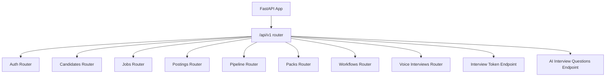
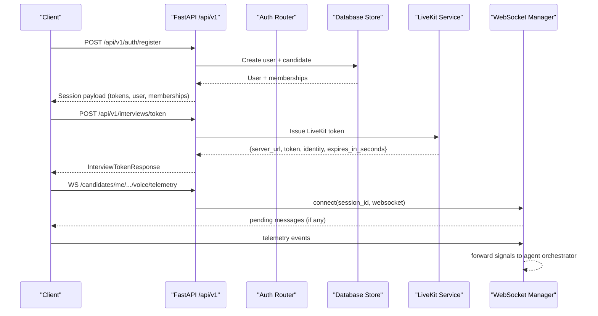
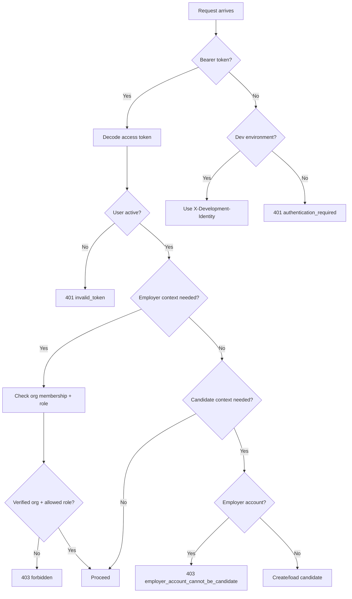

# Backend API Reference

<cite>
**Referenced Files in This Document**
- [router.py](file://Backend/app/api/v1/router.py)
- [auth.py](file://Backend/app/api/v1/auth.py)
- [jobs.py](file://Backend/app/api/v1/jobs.py)
- [candidates.py](file://Backend/app/api/v1/candidates.py)
- [postings.py](file://Backend/app/api/v1/postings.py)
- [pipeline.py](file://Backend/app/api/v1/pipeline.py)
- [packs.py](file://Backend/app/api/v1/packs.py)
- [workflows.py](file://Backend/app/api/v1/workflows.py)
- [voice_interviews.py](file://Backend/app/api/v1/voice_interviews.py)
- [manager.py](file://Backend/app/websocket/manager.py)
- [dependencies.py](file://Backend/app/api/dependencies.py)
- [errors.py](file://Backend/app/core/errors.py)
- [livekit.py](file://Backend/app/services/livekit.py)
- [interview.py](file://Backend/app/schemas/interview.py)
</cite>

## Table of Contents
1. [Introduction](#introduction)
2. [Project Structure](#project-structure)
3. [Core Components](#core-components)
4. [Architecture Overview](#architecture-overview)
5. [Detailed Component Analysis](#detailed-component-analysis)
6. [Dependency Analysis](#dependency-analysis)
7. [Performance Considerations](#performance-considerations)
8. [Troubleshooting Guide](#troubleshooting-guide)
9. [Conclusion](#conclusion)
10. [Appendices](#appendices)

## Introduction
This document provides a comprehensive API reference for the ATS backend REST and WebSocket endpoints. It covers authentication, job management (postings, question pools, publishing), candidate profile management, application submission, pipeline operations, voice interview sessions with LiveKit integration, domain pack management, and analytics. Each endpoint includes request/response schemas, authentication requirements, error handling, and usage notes.

## Project Structure
The API is organized under FastAPI routers grouped by feature:
- Authentication and user session
- Candidate-facing jobs and applications
- Employer-facing postings, pipelines, workflows, and domain packs
- Voice interviews with LiveKit and real-time telemetry via WebSockets
- Shared dependencies, error handling, and schema definitions

**Diagram sources**
- [router.py:26-40](file://Backend/app/api/v1/router.py#L26-L40)
- [router.py:43-70](file://Backend/app/api/v1/router.py#L43-L70)

**Section sources**
- [router.py:1-71](file://Backend/app/api/v1/router.py#L1-L71)

## Core Components
- Authentication: register, login, refresh, logout, and current user info
- Candidates: profile CRUD, CV parsing/upload, consent, profile interview attempts
- Jobs: published job listing, apply, application timeline, applied interview lifecycle
- Postings: create/update/publish/close, question pool generation/curate/lock
- Pipeline: application transitions, scorecards, invitations, analytics, decisions
- Domain Packs: list/get/create/update/delete, activation
- Workflows: components, current workflow, upsert
- Voice Interviews: start/manage/complete, identity checks, LiveKit tokens, telemetry WebSocket
- Shared: dependency injection, role-based access, error responses, LiveKit token issuance

**Section sources**
- [auth.py:1-185](file://Backend/app/api/v1/auth.py#L1-L185)
- [candidates.py:1-482](file://Backend/app/api/v1/candidates.py#L1-L482)
- [jobs.py:1-452](file://Backend/app/api/v1/jobs.py#L1-L452)
- [postings.py:1-567](file://Backend/app/api/v1/postings.py#L1-L567)
- [pipeline.py:1-793](file://Backend/app/api/v1/pipeline.py#L1-L793)
- [packs.py:1-490](file://Backend/app/api/v1/packs.py#L1-L490)
- [workflows.py:1-156](file://Backend/app/api/v1/workflows.py#L1-L156)
- [voice_interviews.py:1-416](file://Backend/app/api/v1/voice_interviews.py#L1-L416)
- [manager.py:1-96](file://Backend/app/websocket/manager.py#L1-L96)
- [dependencies.py:1-246](file://Backend/app/api/dependencies.py#L1-L246)
- [errors.py:1-112](file://Backend/app/core/errors.py#L1-L112)
- [livekit.py:1-39](file://Backend/app/services/livekit.py#L1-L39)
- [interview.py:1-13](file://Backend/app/schemas/interview.py#L1-L13)

## Architecture Overview
The API uses FastAPI routers to group endpoints by domain. Authentication is enforced via bearer tokens or development headers. Role-based access controls restrict employer-only endpoints. Voice interviews integrate with LiveKit for media rooms and use WebSockets for telemetry.

**Diagram sources**
- [auth.py:74-148](file://Backend/app/api/v1/auth.py#L74-L148)
- [router.py:43-56](file://Backend/app/api/v1/router.py#L43-L56)
- [livekit.py:14-38](file://Backend/app/services/livekit.py#L14-L38)
- [manager.py:22-38](file://Backend/app/websocket/manager.py#L22-L38)
- [voice_interviews.py:258-287](file://Backend/app/api/v1/voice_interviews.py#L258-L287)

## Detailed Component Analysis

### Authentication Endpoints
- Register
  - Method: POST
  - Path: /api/v1/auth/register
  - Auth: None
  - Request body: email, password, display_name
  - Response: session payload including tokens, user, memberships, candidate_id, flags
  - Errors: 409 if email already registered; validation errors on invalid fields
- Login
  - Method: POST
  - Path: /api/v1/auth/login
  - Auth: None
  - Request body: email, password
  - Response: session payload with tokens, user, memberships, flags
  - Errors: 401 invalid credentials; 403 account disabled
- Refresh
  - Method: POST
  - Path: /api/v1/auth/refresh
  - Auth: None
  - Request body: refresh_token
  - Response: new tokens and session payload
  - Errors: invalid refresh token handled by token rotation service
- Logout
  - Method: POST
  - Path: /api/v1/auth/logout
  - Auth: None
  - Request body: refresh_token
  - Response: status ok
  - Errors: invalid token handled by token revocation service
- Current User
  - Method: GET
  - Path: /api/v1/auth/me
  - Auth: Bearer token required
  - Response: user, memberships, organization applications, candidate_id, flags

Authentication flow details:
- Access tokens are validated via bearer header; development mode supports X-Development-Identity header
- Employer context requires verified organization membership and appropriate roles
- Candidate context ensures employer accounts cannot act as candidates

Error response format:
- All errors return JSON with code, message, request_id, and optional details

**Section sources**
- [auth.py:19-148](file://Backend/app/api/v1/auth.py#L19-L148)
- [auth.py:151-185](file://Backend/app/api/v1/auth.py#L151-L185)
- [dependencies.py:40-114](file://Backend/app/api/dependencies.py#L40-L114)
- [errors.py:20-112](file://Backend/app/core/errors.py#L20-L112)

### Job Management APIs (Candidate-Facing)
- List Published Jobs
  - Method: GET
  - Path: /api/v1/jobs
  - Auth: Candidate context required
  - Response: list of jobs with already_applied flag
- Get Job Details
  - Method: GET
  - Path: /api/v1/jobs/{posting_id}
  - Auth: Candidate context required
  - Response: job details, already_applied, application_id
- Apply to Job
  - Method: POST
  - Path: /api/v1/applications
  - Auth: Candidate context required
  - Request body: posting_id, answers, idempotency_key
  - Response: application object with status and timestamps
  - Errors: 404 not open; 409 already applied; 409 misconfigured posting
- My Applications
  - Method: GET
  - Path: /api/v1/candidates/me/applications
  - Auth: Candidate context required
  - Response: applications with status, applied interview info
- Application Timeline
  - Method: GET
  - Path: /api/v1/candidates/me/applications/{application_id}/timeline
  - Auth: Candidate context required
  - Response: timeline steps, current status, next action, applied interview status
- Applied Interview
  - Get Attempt: GET /api/v1/candidates/me/applied-interviews/{attempt_id}
  - Save Responses: PATCH /api/v1/candidates/me/applied-interviews/{attempt_id}/responses
  - Submit: POST /api/v1/candidates/me/applied-interviews/{attempt_id}/submit

Applied interview submission evaluates responses using rubric dimensions from the locked question pool.

**Section sources**
- [jobs.py:49-179](file://Backend/app/api/v1/jobs.py#L49-L179)
- [jobs.py:182-452](file://Backend/app/api/v1/jobs.py#L182-L452)

### Candidate Profile Management
- Get Profile
  - Method: GET
  - Path: /api/v1/candidates/me/profile
  - Auth: Candidate context required
  - Response: candidate profile, consents, target domains, parsed CV, embedding info
- Update Profile
  - Method: PATCH
  - Path: /api/v1/candidates/me/profile
  - Auth: Candidate context required
  - Request body: headline, summary, skills, credentials, experiences, availability, target_domains
  - Response: updated candidate profile
- Parse CV Text
  - Method: POST
  - Path: /api/v1/candidates/me/cv/parse
  - Auth: Candidate context required
  - Request body: text, source_filename, apply_to_profile
  - Response: candidate, parsed_cv, hints, embedding metadata
- Upload CV File
  - Method: POST
  - Path: /api/v1/candidates/me/cv/upload
  - Auth: Candidate context required
  - Request: multipart file upload
  - Response: candidate, parsed_cv, hints, embedding metadata, source_format, extracted_chars
- Manage Consents
  - Method: PUT
  - Path: /api/v1/candidates/me/consents/{purpose}
  - Auth: Candidate context required
  - Request body: granted (boolean)
  - Response: consents map
- Profile Interview Attempts
  - Start: POST /api/v1/candidates/me/profile-interview-attempts
  - Get: GET /api/v1/profile-interview-attempts/{attempt_id}
  - Save Responses: PATCH /api/v1/profile-interview-attempts/{attempt_id}/responses
  - Submit: POST /api/v1/profile-interview-attempts/{attempt_id}/submit

Profile interview attempts support resuming in-progress sessions, attempt caps, cooldowns, and evaluation.

**Section sources**
- [candidates.py:147-241](file://Backend/app/api/v1/candidates.py#L147-L241)
- [candidates.py:244-482](file://Backend/app/api/v1/candidates.py#L244-L482)

### Employer Postings and Question Pools
- List Postings
  - Method: GET
  - Path: /api/v1/postings
  - Auth: Employer context required
  - Response: postings with application counts
- Get Posting
  - Method: GET
  - Path: /api/v1/postings/{posting_id}
  - Auth: Employer context required
  - Response: posting details with application count
- Create Posting
  - Method: POST
  - Path: /api/v1/postings
  - Auth: Employer context with pipeline roles required
  - Request body: title, description, location, employment_type, unit_id, pack_id, idempotency_key
  - Response: created posting
  - Errors: 422 invalid unit; 422 domain pack required; idempotent creation
- Update Posting
  - Method: PATCH
  - Path: /api/v1/postings/{posting_id}
  - Auth: Employer context with pipeline roles required
  - Request body: partial update fields
  - Response: updated posting
  - Errors: 409 only draft postings editable
- Publish Posting
  - Method: POST
  - Path: /api/v1/postings/{posting_id}/publish
  - Auth: Employer context with pipeline roles required
  - Response: published posting with match stats
  - Errors: 409 not draft; 422 workflow required; 422 question pool not locked
- Close Posting
  - Method: POST
  - Path: /api/v1/postings/{posting_id}/close
  - Auth: Employer context with pipeline roles required
  - Response: closed posting
  - Errors: 409 already closed
- Generate Question Pool
  - Method: POST
  - Path: /api/v1/postings/{posting_id}/question-pool/generate
  - Auth: Employer context with pipeline roles required
  - Response: generated question pool with rubric dimensions
  - Errors: 409 pool locked; 422 no domain pack pinned
- Curate Question Pool
  - Method: PATCH
  - Path: /api/v1/postings/{posting_id}/question-pool
  - Auth: Employer context with pipeline roles required
  - Request body: questions array with id, prompt, competency
  - Response: curated pool
  - Errors: 409 missing or locked pool; 422 invalid question
- Lock Question Pool
  - Method: POST
  - Path: /api/v1/postings/{posting_id}/question-pool/lock
  - Auth: Employer context with pipeline roles required
  - Response: locked pool
  - Errors: 409 missing or locked pool

Publishing triggers matching against existing candidates when a domain pack is pinned.

**Section sources**
- [postings.py:48-180](file://Backend/app/api/v1/postings.py#L48-L180)
- [postings.py:190-388](file://Backend/app/api/v1/postings.py#L190-L388)
- [postings.py:394-567](file://Backend/app/api/v1/postings.py#L394-L567)

### Pipeline Operations
- Get Pipeline
  - Method: GET
  - Path: /api/v1/pipeline
  - Auth: Employer context with employer roles required
  - Query param: posting_id (optional)
  - Response: columns with stage cards and valid destinations
- Get Application
  - Method: GET
  - Path: /api/v1/applications/{application_id}
  - Auth: Employer context with employer roles required
  - Response: application card, profile snapshot, answers, applied interview, scorecards, transitions
- Transition Application
  - Method: POST
  - Path: /api/v1/applications/{application_id}/transitions
  - Auth: Employer context with pipeline roles required
  - Request body: to_stage_id, from_stage_version, reason_code, note, idempotency_key
  - Response: updated application and transition record
  - Errors: 409 stage conflict; 422 invalid transition; 422 reason required for certain stages
- Invite Applied Interview
  - Method: POST
  - Path: /api/v1/applications/{application_id}/applied-interview-invitations
  - Auth: Employer context with pipeline roles required
  - Request body: idempotency_key
  - Response: created attempt with status invited
  - Errors: 409 already invited; 422 question pool not locked
- Create Scorecard
  - Method: POST
  - Path: /api/v1/applications/{application_id}/scorecards
  - Auth: Employer context with employer roles required
  - Request body: scores, recommendation, note
  - Response: created scorecard with reviewer name
  - Errors: 422 invalid score range; 409 scorecard exists
- Company Decision
  - Method: POST
  - Path: /api/v1/applications/{application_id}/decision
  - Auth: Employer context with pipeline roles required
  - Request body: decision, message
  - Response: status decision_sent
  - Notes: sends templated email based on decision type
- Analytics
  - Method: GET
  - Path: /api/v1/analytics/pipeline
  - Auth: Employer context with employer roles required
  - Response: total postings, published, applications by category, hired/rejected/in-flight counts
- Candidate Avatar
  - Method: GET
  - Path: /api/v1/applications/{application_id}/candidate-avatar
  - Auth: Employer context with employer roles required
  - Response: image file or 404 if no avatar

Pipeline transitions enforce optimistic concurrency via stage versioning and emit audit events.

**Section sources**
- [pipeline.py:155-266](file://Backend/app/api/v1/pipeline.py#L155-L266)
- [pipeline.py:269-514](file://Backend/app/api/v1/pipeline.py#L269-L514)
- [pipeline.py:517-614](file://Backend/app/api/v1/pipeline.py#L517-L614)
- [pipeline.py:617-793](file://Backend/app/api/v1/pipeline.py#L617-L793)

### Voice Interview Endpoints (LiveKit Integration)
- Identity Check (Profile)
  - Method: POST
  - Path: /api/v1/candidates/me/profile-interview-attempts/{attempt_id}/voice/identity-check
  - Auth: Candidate context required
  - Request body: image data URL (JPEG/PNG/WebP)
  - Response: identity_verification verdict
  - Errors: 422 invalid image
- Identity Check (Applied)
  - Method: POST
  - Path: /api/v1/candidates/me/applied-interviews/{attempt_id}/voice/identity-check
  - Auth: Candidate context required
  - Request body: image data URL
  - Response: identity_verification verdict
- Get Voice Session (Profile)
  - Method: GET
  - Path: /api/v1/candidates/me/profile-interview-attempts/{attempt_id}/voice
  - Auth: Candidate context required
  - Response: session payload with room_name, duration, transcripts, evaluation, identity verification
- Get Voice Session (Applied)
  - Method: GET
  - Path: /api/v1/candidates/me/applied-interviews/{attempt_id}/voice
  - Auth: Candidate context required
  - Response: session payload with job title context
- LiveKit Token (Profile)
  - Method: POST
  - Path: /api/v1/candidates/me/profile-interview-attempts/{attempt_id}/voice/livekit
  - Auth: Candidate context required
  - Response: LiveKit token with server_url, identity, expires_in_seconds
- LiveKit Token (Applied)
  - Method: POST
  - Path: /api/v1/candidates/me/applied-interviews/{attempt_id}/voice/livekit
  - Auth: Candidate context required
  - Response: LiveKit token
- Start Voice Session (Profile)
  - Method: POST
  - Path: /api/v1/candidates/me/profile-interview-attempts/{attempt_id}/voice/start
  - Auth: Candidate context required
  - Response: starting status with attempt_id
  - Errors: 409 already evaluated
- Complete Voice Session (Profile)
  - Method: POST
  - Path: /api/v1/candidates/me/profile-interview-attempts/{attempt_id}/voice/complete
  - Auth: Candidate context required
  - Response: completed session payload with evaluation
- Start Voice Session (Applied)
  - Method: POST
  - Path: /api/v1/candidates/me/applied-interviews/{attempt_id}/voice/start
  - Auth: Candidate context required
  - Response: starting status with attempt_id
  - Errors: 409 already evaluated; 404 posting not found
- Complete Voice Session (Applied)
  - Method: POST
  - Path: /api/v1/candidates/me/applied-interviews/{attempt_id}/voice/complete
  - Auth: Candidate context required
  - Response: completed session payload with evaluation

Telemetry WebSocket:
- Connect: WS /api/v1/candidates/me/{type}-interview-attempts/{attempt_id}/voice/telemetry
- Messages: client sends telemetry events like user_requested_end, user_audio_activity
- Server forwards signals to active conversation agent when present

LiveKit token issuance:
- Requires configured LiveKit URL, API key, and secret
- Returns JWT with video grants for the specified room and identity

**Section sources**
- [voice_interviews.py:60-173](file://Backend/app/api/v1/voice_interviews.py#L60-L173)
- [voice_interviews.py:177-256](file://Backend/app/api/v1/voice_interviews.py#L177-L256)
- [voice_interviews.py:290-384](file://Backend/app/api/v1/voice_interviews.py#L290-L384)
- [voice_interviews.py:258-287](file://Backend/app/api/v1/voice_interviews.py#L258-L287)
- [voice_interviews.py:387-416](file://Backend/app/api/v1/voice_interviews.py#L387-L416)
- [livekit.py:14-38](file://Backend/app/services/livekit.py#L14-L38)
- [manager.py:22-38](file://Backend/app/websocket/manager.py#L22-L38)

### Domain Pack Management
- List Domain Packs
  - Method: GET
  - Path: /api/v1/domain-packs
  - Auth: Employer context required
  - Response: packs with linked job counts
- Get Domain Pack
  - Method: GET
  - Path: /api/v1/domain-packs/{pack_id}
  - Auth: Employer context required
  - Response: pack manifest and summary
- Create Domain Pack
  - Method: POST
  - Path: /api/v1/domain-packs
  - Auth: Admin roles required
  - Request body: pack_id, pack_version, display_name, domain, skills, certifications, concepts, profile_questions, applied_questions, rubric_dimensions, task styles, matching_weights
  - Response: created pack summary
  - Errors: 409 reserved pack_id; 409 pack already exists; validation errors
- Update Domain Pack
  - Method: PATCH
  - Path: /api/v1/domain-packs/{pack_id}
  - Auth: Admin roles required
  - Request body: partial update fields
  - Response: updated pack summary
  - Errors: 409 built-in packs immutable; 404 pack not found
- Delete Domain Pack
  - Method: DELETE
  - Path: /api/v1/domain-packs/{pack_id}
  - Auth: Admin roles required
  - Response: deleted confirmation
  - Errors: 409 built-in packs immutable; 404 pack not found; 409 pack in use
- Activate Domain Pack
  - Method: POST
  - Path: /api/v1/organizations/current/domain-packs/activations
  - Auth: Admin roles required
  - Request body: pack_id
  - Response: activation record with timestamps
- Get Active Pack
  - Method: GET
  - Path: /api/v1/organizations/current/domain-packs/active
  - Auth: Employer context required
  - Response: active pack activation or null

Domain packs define interview questions, evaluation rubrics, and matching weights used by postings and interviews.

**Section sources**
- [packs.py:63-104](file://Backend/app/api/v1/packs.py#L63-L104)
- [packs.py:222-283](file://Backend/app/api/v1/packs.py#L222-L283)
- [packs.py:286-367](file://Backend/app/api/v1/packs.py#L286-L367)
- [packs.py:370-414](file://Backend/app/api/v1/packs.py#L370-L414)
- [packs.py:421-489](file://Backend/app/api/v1/packs.py#L421-L489)

### Workflow Management
- List Components
  - Method: GET
  - Path: /api/v1/workflows/components
  - Auth: Employer context required
  - Response: available components and fixed stages
- List Workflows
  - Method: GET
  - Path: /api/v1/workflows
  - Auth: Employer context required
  - Response: company workflows (usually one)
- Get Current Workflow
  - Method: GET
  - Path: /api/v1/workflows/current or /api/v1/workflows/active
  - Auth: Employer context required
  - Response: current workflow with components and fixed stages
- Upsert Current Workflow
  - Method: PUT
  - Path: /api/v1/workflows/current
  - Auth: Admin roles required
  - Request body: components array
  - Response: updated workflow
  - Errors: 422 invalid workflow
- Create Workflow
  - Method: POST
  - Path: /api/v1/workflows
  - Auth: Admin roles required
  - Response: default workflow if none exists
  - Errors: 409 workflow already exists

Workflows define hiring stages and candidate-visible status mappings.

**Section sources**
- [workflows.py:60-156](file://Backend/app/api/v1/workflows.py#L60-L156)

### AI Interview Questions Generation
- Generate Questions
  - Method: POST
  - Path: /api/v1/ai/interview-questions
  - Auth: Interview identity dependency required
  - Request body: interview question generation parameters
  - Response: generated questions
  - Notes: uses AI service configured via settings

**Section sources**
- [router.py:59-70](file://Backend/app/api/v1/router.py#L59-L70)

## Dependency Analysis
Authentication and authorization are enforced through FastAPI dependencies:
- Bearer token validation with decode_access_token
- Development identity fallback for local testing
- Employer context requires verified organization membership and role checks
- Candidate context prevents employer accounts from applying as candidates
- Role guards restrict sensitive endpoints to administrators, hiring managers, recruiters

Error handling centralizes:
- ApiError exceptions mapped to structured JSON responses
- Validation errors with detailed field information
- HTTP exceptions normalized to consistent format
- Unhandled exceptions return 500 with internal_server_error code

LiveKit integration requires configuration:
- livekit_url, livekit_api_key, livekit_api_secret must be set
- Token issuance validates configuration before generating JWT

**Diagram sources**
- [dependencies.py:40-114](file://Backend/app/api/dependencies.py#L40-L114)
- [dependencies.py:125-199](file://Backend/app/api/dependencies.py#L125-L199)
- [errors.py:60-112](file://Backend/app/core/errors.py#L60-L112)

**Section sources**
- [dependencies.py:1-246](file://Backend/app/api/dependencies.py#L1-L246)
- [errors.py:1-112](file://Backend/app/core/errors.py#L1-L112)

## Performance Considerations
- Idempotency keys prevent duplicate operations for critical actions like applications, transitions, and invites
- Database connections are managed per-request with proper cleanup
- WebSocket manager buffers pending messages and trims history to prevent memory growth
- Background tasks handle email sending and AI evaluations without blocking requests
- Matching and evaluation operations are triggered asynchronously where possible

[No sources needed since this section provides general guidance]

## Troubleshooting Guide
Common issues and resolutions:
- Authentication failures: verify bearer token validity and user status
- Organization access denied: ensure organization is verified and user has appropriate role
- Invalid workflow: check component IDs and validate stage configurations
- Domain pack errors: confirm pack exists and is not reserved or in use
- LiveKit integration: verify all required configuration variables are set
- WebSocket connectivity: check session ID matches active interview attempt

Error codes reference:
- 400-level: client errors (validation, conflicts, not found)
- 401: authentication required or invalid token
- 403: forbidden (role or organization access)
- 409: conflict (duplicate resources, state conflicts)
- 422: validation errors (invalid inputs)
- 500: internal server errors
- 503: integration not configured

**Section sources**
- [errors.py:20-112](file://Backend/app/core/errors.py#L20-L112)
- [dependencies.py:40-114](file://Backend/app/api/dependencies.py#L40-L114)
- [livekit.py:14-38](file://Backend/app/services/livekit.py#L14-L38)

## Conclusion
The ATS backend provides a comprehensive API for managing the complete hiring lifecycle from job postings through candidate evaluation and interview completion. The system emphasizes security through role-based access control, reliability through idempotent operations, and extensibility through domain packs and configurable workflows. Voice interview capabilities integrate seamlessly with LiveKit for real-time communication, while WebSockets enable rich telemetry and agent interaction during sessions.

[No sources needed since this section summarizes without analyzing specific files]

## Appendices

### Request/Response Examples

#### Authentication Registration
- Request: POST /api/v1/auth/register
  - Body: {email, password, display_name}
- Response: {tokens, user, memberships, candidate_id, is_superadmin, has_employer_membership}

#### Job Application
- Request: POST /api/v1/applications
  - Body: {posting_id, answers, idempotency_key}
- Response: {application: {id, posting_id, status, created_at}}

#### Voice Interview Start
- Request: POST /api/v1/candidates/me/profile-interview-attempts/{attempt_id}/voice/start
- Response: {status: "starting", attempt_id}

#### Domain Pack Creation
- Request: POST /api/v1/domain-packs
  - Body: {pack_id, pack_version, display_name, domain, skills, certifications, concepts, profile_questions, applied_questions, rubric_dimensions, profile_task_style, applied_task_style, matching_weights}
- Response: {pack: {pack_id, pack_version, display_name, domain, skills, rubric_dimensions, source, linked_jobs}}

### WebSocket Telemetry Protocol
- Connection: WS /api/v1/candidates/me/{type}-interview-attempts/{attempt_id}/voice/telemetry
- Client messages:
  - {type: "user_requested_end"}
  - {type: "user_audio_activity"}
- Server behavior: forwards signals to active conversation agent when available

### Rate Limiting
Rate limiting is not explicitly implemented in the analyzed codebase. Clients should implement reasonable retry logic with exponential backoff for failed requests.

[No sources needed since this section provides general guidance]