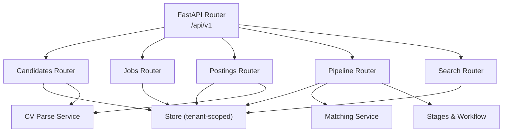
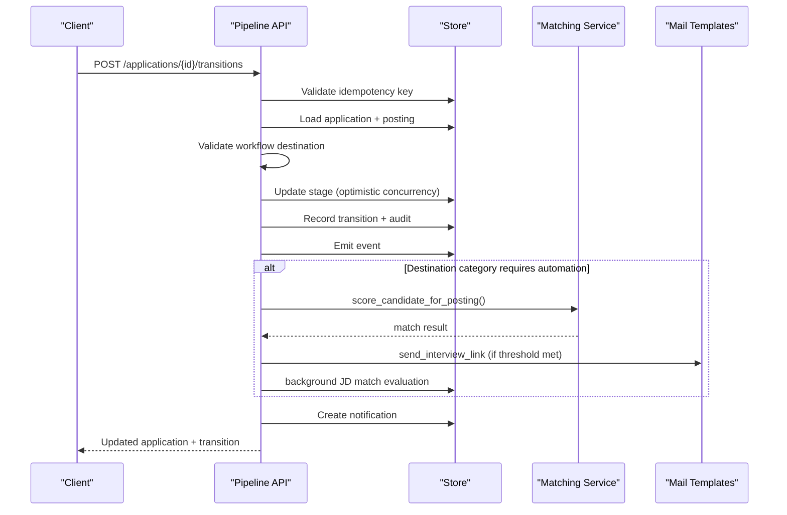
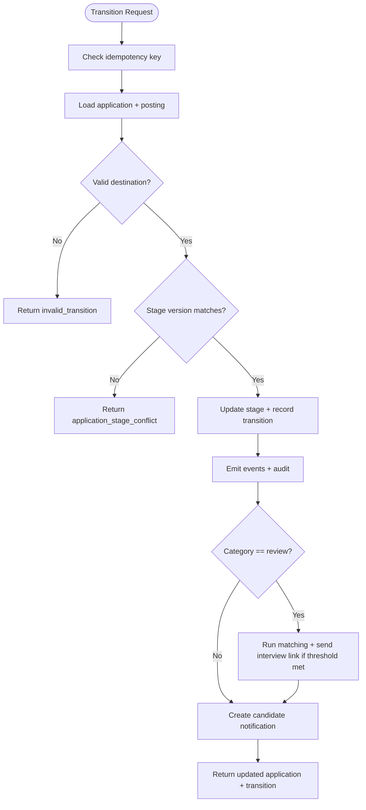
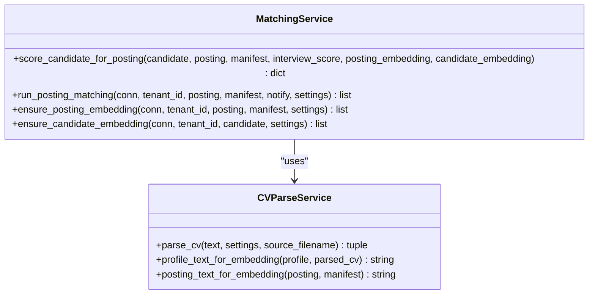
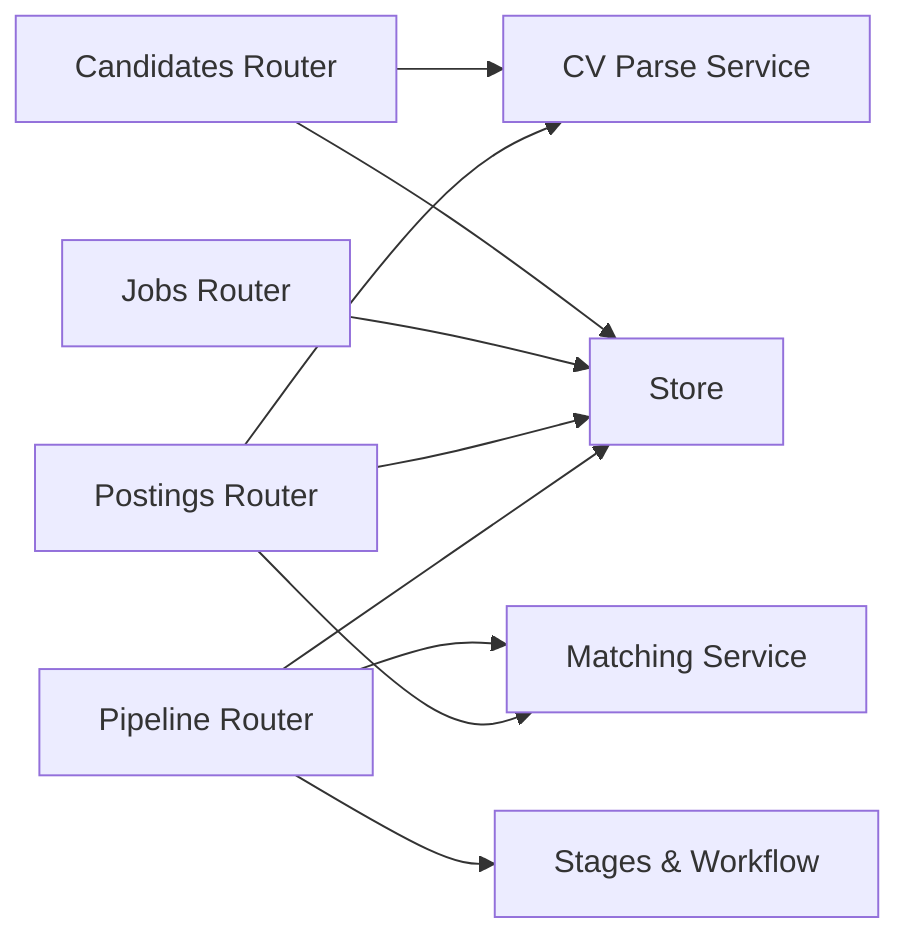

# Candidate & Pipeline Management API

<cite>
**Referenced Files in This Document**
- [router.py](file://Backend/app/api/v1/router.py)
- [candidates.py](file://Backend/app/api/v1/candidates.py)
- [jobs.py](file://Backend/app/api/v1/jobs.py)
- [postings.py](file://Backend/app/api/v1/postings.py)
- [pipeline.py](file://Backend/app/api/v1/pipeline.py)
- [search.py](file://Backend/app/api/v1/search.py)
- [stages.py](file://Backend/app/domain/stages.py)
- [cv.py](file://Backend/app/schemas/cv.py)
- [cv_parse.py](file://Backend/app/services/cv_parse.py)
- [matching.py](file://Backend/app/services/matching.py)
- [store.py](file://Backend/app/db/store.py)
</cite>

## Table of Contents
1. Introduction
2. Project Structure
3. Core Components
4. Architecture Overview
5. Detailed Component Analysis
6. Dependency Analysis
7. Performance Considerations
8. Troubleshooting Guide
9. Conclusion
10. Appendices

## Introduction
This document provides comprehensive API documentation for candidate management and pipeline operations. It covers candidate profile creation, application submission, resume parsing, pipeline stage transitions, status tracking, search and talent discovery, integration with evaluation systems, and scoring mechanisms. It also includes typical hiring workflows and automation patterns implemented by the backend.

## Project Structure
The API is organized under FastAPI routers grouped by domain:
- Candidates: profile updates, CV parsing/upload, consent, profile interview attempts
- Jobs (candidate-facing): job listing, apply, applications list, applied interview lifecycle
- Postings (employer-side): create/update/publish/close postings, question pool management
- Pipeline: board view, transitions, scorecards, analytics, decisions, avatar serving
- Search: workspace search, talent discovery, pack catalog
- Domain models: stages and workflow definitions
- Services: CV parsing/embeddings, matching/scoring
- Store: tenant-scoped persistence helpers

**Diagram sources**
- [router.py:1-71](file://Backend/app/api/v1/router.py#L1-L71)
- [candidates.py:1-482](file://Backend/app/api/v1/candidates.py#L1-L482)
- [jobs.py:1-452](file://Backend/app/api/v1/jobs.py#L1-L452)
- [postings.py:1-567](file://Backend/app/api/v1/postings.py#L1-L567)
- [pipeline.py:1-793](file://Backend/app/api/v1/pipeline.py#L1-L793)
- [search.py:1-72](file://Backend/app/api/v1/search.py#L1-L72)
- [stages.py:1-300](file://Backend/app/domain/stages.py#L1-L300)
- [cv_parse.py:1-242](file://Backend/app/services/cv_parse.py#L1-L242)
- [matching.py:1-345](file://Backend/app/services/matching.py#L1-L345)
- [store.py:1-200](file://Backend/app/db/store.py#L1-L200)

**Section sources**
- [router.py:1-71](file://Backend/app/api/v1/router.py#L1-L71)

## Core Components
- Candidate profile and consent management
- Resume parsing and embedding generation
- Application submission and lifecycle
- Applied Interview flow (invite, responses, submit, evaluate)
- Employer posting lifecycle and question pool management
- Pipeline board view and single-transition command with optimistic concurrency
- Scorecards and decision notifications
- Search and talent discovery
- Matching and scoring engine

**Section sources**
- [candidates.py:147-482](file://Backend/app/api/v1/candidates.py#L147-L482)
- [jobs.py:49-452](file://Backend/app/api/v1/jobs.py#L49-L452)
- [postings.py:48-567](file://Backend/app/api/v1/postings.py#L48-L567)
- [pipeline.py:155-793](file://Backend/app/api/v1/pipeline.py#L155-L793)
- [search.py:16-72](file://Backend/app/api/v1/search.py#L16-L72)
- [matching.py:115-345](file://Backend/app/services/matching.py#L115-L345)
- [cv_parse.py:126-242](file://Backend/app/services/cv_parse.py#L126-L242)

## Architecture Overview
The system enforces a strict transition model for applications through a single transition endpoint that validates workflow rules, records audit trails, emits events, and triggers automated actions such as AI matching and email notifications. Candidate-facing endpoints expose only mapped statuses to protect internal stage names.

**Diagram sources**
- [pipeline.py:277-514](file://Backend/app/api/v1/pipeline.py#L277-L514)
- [matching.py:115-187](file://Backend/app/services/matching.py#L115-L187)

## Detailed Component Analysis

### Candidate Profile and Consent
- Get current candidate profile
- Update profile fields (headline, summary, skills, credentials, experiences, availability, target domains)
- Set consents for discovery and application processing
- Parse or upload CV text/files; parse once into structured sections and generate embeddings for matching
- List and manage profile interview attempts (start, save responses, submit with idempotency)

Key behaviors:
- CV parsing uses heuristic fallback when LLM is unavailable or fails; extracts structured sections and profile hints
- Embedding refresh occurs on profile/CV changes to keep matching accurate
- Profile interview attempt cap and cooldown are enforced per domain pack

**Section sources**
- [candidates.py:147-189](file://Backend/app/api/v1/candidates.py#L147-L189)
- [candidates.py:192-241](file://Backend/app/api/v1/candidates.py#L192-L241)
- [candidates.py:244-266](file://Backend/app/api/v1/candidates.py#L244-L266)
- [candidates.py:268-482](file://Backend/app/api/v1/candidates.py#L268-L482)
- [cv_parse.py:126-242](file://Backend/app/services/cv_parse.py#L126-L242)
- [cv.py:8-35](file://Backend/app/schemas/cv.py#L8-L35)

### Job Applications (Candidate-Facing)
- List published jobs and check already-applied status
- Apply to a job with optional answers; creates an application in the entry stage
- View applications and timeline with candidate-safe statuses
- Manage Applied Interviews: retrieve, save partial responses, submit with evaluation

Key behaviors:
- Application creation pins profile snapshot and captures best profile interview score at time of apply
- Timeline maps internal stages to candidate-visible statuses and shows next action guidance
- Applied Interview submission evaluates responses using rubric dimensions from the locked question pool

**Section sources**
- [jobs.py:49-179](file://Backend/app/api/v1/jobs.py#L49-L179)
- [jobs.py:182-307](file://Backend/app/api/v1/jobs.py#L182-L307)
- [jobs.py:319-452](file://Backend/app/api/v1/jobs.py#L319-L452)

### Postings and Question Pool (Employer-Side)
- Create, update, publish, and close postings
- Generate, curate, and lock question pools tied to domain packs
- Publish triggers proactive matching against consenting candidates

Key behaviors:
- Posting creation pins domain pack and workflow snapshot
- Publishing requires a locked question pool and valid workflow
- Question pool states enforce immutability after locking

**Section sources**
- [postings.py:48-180](file://Backend/app/api/v1/postings.py#L48-L180)
- [postings.py:231-328](file://Backend/app/api/v1/postings.py#L231-L328)
- [postings.py:391-567](file://Backend/app/api/v1/postings.py#L391-L567)

### Pipeline Stage Management and Transitions
- Board view aggregates applications across postings and stages
- Single transition endpoint enforces workflow rules, reason requirements, and optimistic concurrency
- Automatic actions on entering review stage: AI matching, interview link sending, background JD match evaluation
- Scorecards allow employer reviewers to add scores and recommendations
- Analytics endpoint summarizes pipeline metrics
- Decision endpoint sends templated emails based on acceptance/rejection categories

Key behaviors:
- Valid destinations computed from workflow definition; terminal categories restrict outbound moves
- Audit trail and outbox events recorded per transition
- Notifications created for candidates on stage changes

**Diagram sources**
- [pipeline.py:277-514](file://Backend/app/api/v1/pipeline.py#L277-L514)
- [stages.py:196-242](file://Backend/app/domain/stages.py#L196-L242)

**Section sources**
- [pipeline.py:155-201](file://Backend/app/api/v1/pipeline.py#L155-L201)
- [pipeline.py:204-266](file://Backend/app/api/v1/pipeline.py#L204-L266)
- [pipeline.py:269-514](file://Backend/app/api/v1/pipeline.py#L269-L514)
- [pipeline.py:517-614](file://Backend/app/api/v1/pipeline.py#L517-L614)
- [pipeline.py:617-673](file://Backend/app/api/v1/pipeline.py#L617-L673)
- [pipeline.py:676-702](file://Backend/app/api/v1/pipeline.py#L676-L702)
- [pipeline.py:705-765](file://Backend/app/api/v1/pipeline.py#L705-L765)
- [stages.py:10-44](file://Backend/app/domain/stages.py#L10-L44)
- [stages.py:196-242](file://Backend/app/domain/stages.py#L196-L242)

### Search and Talent Discovery
- Workspace search returns postings and applications within tenant scope
- Talent discovery filters by query, pack_id, and minimum score; respects candidate consent
- Pack catalog lists available domain packs for interviews and job focus

**Section sources**
- [search.py:16-72](file://Backend/app/api/v1/search.py#L16-L72)

### Evaluation and Scoring Integration
- Profile interview attempts are evaluated using scenario response evaluation with rubric dimensions
- Applied Interview submissions use the locked question pool’s rubric dimensions
- Matching service computes composite scores blending CV similarity (embedding or skill overlap) and interview scores
- Background JD match evaluation can be triggered post-transition to enrich job_match_score and reasons

**Diagram sources**
- [matching.py:115-187](file://Backend/app/services/matching.py#L115-L187)
- [matching.py:190-287](file://Backend/app/services/matching.py#L190-L287)
- [cv_parse.py:44-77](file://Backend/app/services/cv_parse.py#L44-L77)
- [cv_parse.py:126-242](file://Backend/app/services/cv_parse.py#L126-L242)

**Section sources**
- [candidates.py:429-482](file://Backend/app/api/v1/candidates.py#L429-L482)
- [jobs.py:385-452](file://Backend/app/api/v1/jobs.py#L385-L452)
- [matching.py:115-187](file://Backend/app/services/matching.py#L115-L187)
- [matching.py:190-287](file://Backend/app/services/matching.py#L190-L287)
- [pipeline.py:392-467](file://Backend/app/api/v1/pipeline.py#L392-L467)

## Dependency Analysis
- Routers depend on store for tenant-scoped data access and on services for parsing and matching
- Stages define canonical workflow components and validation rules used by pipeline transitions
- Matching depends on embeddings and CV parsing utilities to compute similarity and skill overlap
- Pipeline integrates mail templates and notifications on transitions and decisions

**Diagram sources**
- [router.py:1-71](file://Backend/app/api/v1/router.py#L1-L71)
- [pipeline.py:1-793](file://Backend/app/api/v1/pipeline.py#L1-L793)
- [matching.py:1-345](file://Backend/app/services/matching.py#L1-L345)
- [cv_parse.py:1-242](file://Backend/app/services/cv_parse.py#L1-L242)
- [stages.py:1-300](file://Backend/app/domain/stages.py#L1-L300)
- [store.py:1-200](file://Backend/app/db/store.py#L1-L200)

**Section sources**
- [pipeline.py:1-793](file://Backend/app/api/v1/pipeline.py#L1-L793)
- [matching.py:1-345](file://Backend/app/services/matching.py#L1-L345)
- [cv_parse.py:1-242](file://Backend/app/services/cv_parse.py#L1-L242)
- [stages.py:1-300](file://Backend/app/domain/stages.py#L1-L300)
- [store.py:1-200](file://Backend/app/db/store.py#L1-L200)

## Performance Considerations
- Idempotency keys prevent duplicate mutations on apply, transitions, invitations, and submissions
- Optimistic concurrency via stage_version avoids lost updates during concurrent edits
- CV parsing runs once per upload/update; embeddings refreshed on profile changes to minimize repeated work
- Matching thresholds and caps limit computation and notifications
- Background tasks for JD match evaluation avoid blocking request paths

[No sources needed since this section provides general guidance]

## Troubleshooting Guide
Common errors and their causes:
- Invalid transition: destination not allowed from current stage; ensure workflow permits movement
- Application stage conflict: stage_version mismatch; refresh application before transitioning
- Reason required: moving to human approval categories requires a reason code
- Already applied: candidate cannot apply again to the same job
- Question pool not locked: publishing or inviting requires a locked pool
- Attempt already submitted: interview attempts are immutable after submission
- Avatar not found: candidate has no profile photo on file

Resolution steps:
- Refresh the application card to obtain latest stage_version
- Add required reason codes for sensitive transitions
- Lock the question pool before publishing or inviting candidates
- Use idempotency keys to safely retry requests

**Section sources**
- [pipeline.py:306-333](file://Backend/app/api/v1/pipeline.py#L306-L333)
- [pipeline.py:335-348](file://Backend/app/api/v1/pipeline.py#L335-L348)
- [jobs.py:93-115](file://Backend/app/api/v1/jobs.py#L93-L115)
- [postings.py:255-259](file://Backend/app/api/v1/postings.py#L255-L259)
- [pipeline.py:547-555](file://Backend/app/api/v1/pipeline.py#L547-L555)
- [pipeline.py:768-792](file://Backend/app/api/v1/pipeline.py#L768-L792)

## Conclusion
The API provides a robust, secure, and extensible foundation for candidate management and pipeline operations. It enforces strict workflow transitions, supports automated matching and notifications, and exposes clear interfaces for both candidates and employers. The design emphasizes idempotency, auditability, and tenant isolation while integrating evaluation and scoring mechanisms to streamline hiring workflows.

[No sources needed since this section summarizes without analyzing specific files]

## Appendices

### Typical Hiring Workflows
- Candidate applies to a published job; application enters “Received”
- Recruiter screens and moves to “Screened” or “Shortlisted”
- Candidate completes Applied Interview; evaluation feeds into scoring
- Employer advances to “Offer” then “Hired” or rejects; notifications sent
- Automation may trigger interview links and JD match evaluations upon entering review

**Section sources**
- [jobs.py:86-179](file://Backend/app/api/v1/jobs.py#L86-L179)
- [pipeline.py:277-514](file://Backend/app/api/v1/pipeline.py#L277-L514)
- [postings.py:231-328](file://Backend/app/api/v1/postings.py#L231-L328)

### Bulk Operations and Filtering
- Bulk operations are not exposed directly; use idempotent endpoints per resource and batch client-side
- Filtering:
  - Pipeline board: filter by posting_id
  - Talent discovery: filter by query, pack_id, min_score
  - Applications: list scoped by tenant or candidate

**Section sources**
- [pipeline.py:155-201](file://Backend/app/api/v1/pipeline.py#L155-L201)
- [search.py:29-51](file://Backend/app/api/v1/search.py#L29-L51)