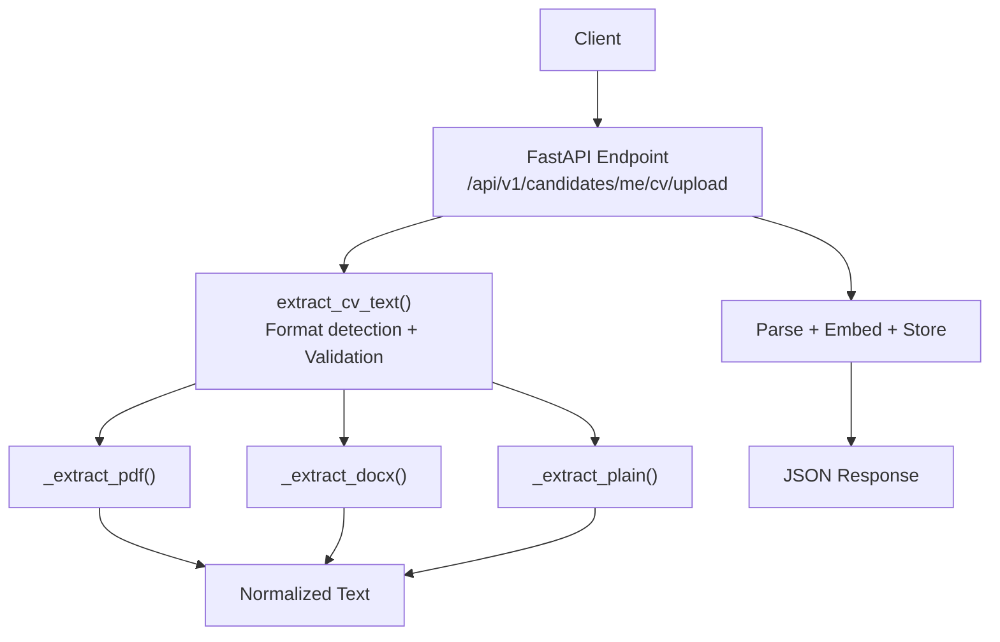
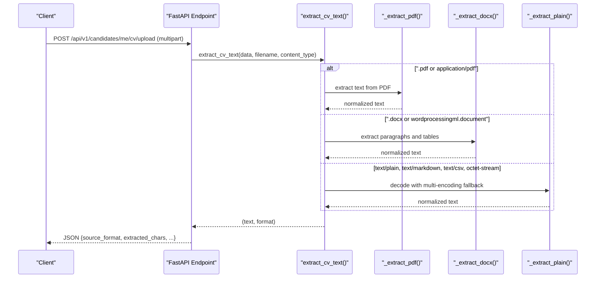
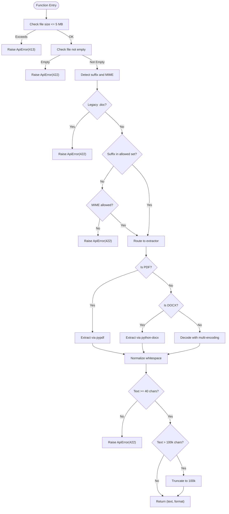
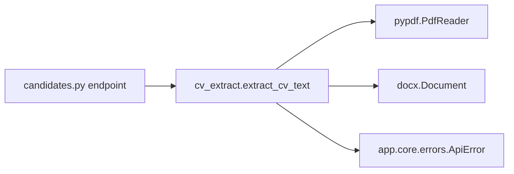

# CV File Extraction

<cite>
**Referenced Files in This Document**
- [cv_extract.py](file://Backend/app/services/cv_extract.py)
- [candidates.py](file://Backend/app/api/v1/candidates.py)
- [errors.py](file://Backend/app/core/errors.py)
- [test_cv_upload.py](file://Backend/tests/test_cv_upload.py)
</cite>

## Table of Contents
1. [Introduction](#introduction)
2. [Project Structure](#project-structure)
3. [Core Components](#core-components)
4. [Architecture Overview](#architecture-overview)
5. [Detailed Component Analysis](#detailed-component-analysis)
6. [Dependency Analysis](#dependency-analysis)
7. [Performance Considerations](#performance-considerations)
8. [Troubleshooting Guide](#troubleshooting-guide)
9. [Conclusion](#conclusion)

## Introduction
This document explains the CV file extraction functionality that converts uploaded CV files into plain text for further parsing and embedding. The core function extract_cv_text supports PDF, DOCX, and plain text formats (including .txt, .md, and .csv). It validates file size and content, detects format based on extension and MIME type, extracts text using dedicated internal methods, enforces minimum readable text length, and truncates excessively large outputs. Errors are raised as structured ApiError instances with clear codes and messages.

## Project Structure
The CV extraction feature is implemented in a service module and consumed by an API endpoint:
- Service layer: Backend/app/services/cv_extract.py implements format detection, validation, and extraction logic.
- API layer: Backend/app/api/v1/candidates.py exposes the upload endpoint that calls the service.
- Error handling: Backend/app/core/errors.py defines ApiError and global exception handlers.
- Tests: Backend/tests/test_cv_upload.py validate behavior across supported formats and error cases.

**Diagram sources**
- [candidates.py:216-241](file://Backend/app/api/v1/candidates.py#L216-L241)
- [cv_extract.py:70-151](file://Backend/app/services/cv_extract.py#L70-L151)

**Section sources**
- [cv_extract.py:1-151](file://Backend/app/services/cv_extract.py#L1-L151)
- [candidates.py:216-241](file://Backend/app/api/v1/candidates.py#L216-L241)
- [errors.py:20-68](file://Backend/app/core/errors.py#L20-L68)
- [test_cv_upload.py:73-112](file://Backend/tests/test_cv_upload.py#L73-L112)

## Core Components
- extract_cv_text(data, filename, content_type): Validates input, detects format, delegates to specialized extractors, enforces text length constraints, and returns (text, detected_format).
- _extract_pdf(data): Uses pypdf to read pages and extract text; normalizes whitespace.
- _extract_docx(data): Uses python-docx to read paragraphs and tables; joins table cells with separators; normalizes whitespace.
- _extract_plain(data): Tries multiple encodings (UTF-8, UTF-16, Latin-1), falls back to ignore mode; normalizes whitespace.
- Format detection: Based on file suffix (.pdf, .docx, .txt, .md, .csv) and MIME types; legacy .doc explicitly rejected.
- Validation rules:
  - Maximum file size: 5 MB.
  - Minimum readable text: 40 characters after extraction.
  - Maximum output text: 100,000 characters (truncated if exceeded).
- Error handling: Raises ApiError with specific codes for unsupported formats, empty files, oversized files, insufficient text, and extraction failures.

**Section sources**
- [cv_extract.py:10-20](file://Backend/app/services/cv_extract.py#L10-L20)
- [cv_extract.py:23-67](file://Backend/app/services/cv_extract.py#L23-L67)
- [cv_extract.py:70-151](file://Backend/app/services/cv_extract.py#L70-L151)
- [errors.py:20-68](file://Backend/app/core/errors.py#L20-L68)

## Architecture Overview
The upload flow integrates FastAPI’s file handling with the extraction service:
- The endpoint reads the uploaded file bytes and passes them to extract_cv_text along with filename and content type.
- extract_cv_text performs validation and format detection, then calls the appropriate extractor.
- Extracted text is normalized and validated for length constraints before being returned to the endpoint.
- The endpoint persists parsed data and returns metadata including source format and extracted character count.

**Diagram sources**
- [candidates.py:216-241](file://Backend/app/api/v1/candidates.py#L216-L241)
- [cv_extract.py:70-151](file://Backend/app/services/cv_extract.py#L70-L151)

## Detailed Component Analysis

### extract_cv_text Function
Responsibilities:
- Enforce maximum file size (5 MB).
- Reject empty files.
- Normalize filename and detect suffix.
- Explicitly reject legacy .doc files.
- Validate allowed extensions and MIME types.
- Route to appropriate extractor based on suffix/MIME.
- Enforce minimum readable text length (40 characters).
- Truncate excessive text to 100,000 characters.
- Return tuple of (text, detected_format).

Validation and routing logic:
- Size check raises status 413 for too large.
- Empty check raises status 422 for empty.
- Legacy .doc raises status 422 with unsupported format.
- Unsupported suffix or mismatched MIME raises status 422.
- Extraction errors raise status 422 with extraction failure message.
- Short text raises status 422 with insufficient text message.

**Diagram sources**
- [cv_extract.py:70-151](file://Backend/app/services/cv_extract.py#L70-L151)

**Section sources**
- [cv_extract.py:70-151](file://Backend/app/services/cv_extract.py#L70-L151)

### Internal Extractors

#### _extract_pdf
- Uses pypdf.PdfReader to iterate over pages.
- Extracts text per page; skips pages that fail to extract.
- Joins page texts and normalizes whitespace.

Complexity considerations:
- Time complexity proportional to number of pages and text extraction cost per page.
- Space complexity proportional to total extracted text.

Robustness:
- Gracefully handles exceptions during page extraction by skipping problematic pages.

**Section sources**
- [cv_extract.py:31-41](file://Backend/app/services/cv_extract.py#L31-L41)

#### _extract_docx
- Uses python-docx.Document to read paragraphs and tables.
- Collects non-empty paragraph text.
- For tables, joins non-empty cell texts with “ | ” separator per row.
- Normalizes whitespace across all parts.

Complexity considerations:
- Time complexity proportional to number of paragraphs and table rows.
- Space complexity proportional to combined text size.

**Section sources**
- [cv_extract.py:44-58](file://Backend/app/services/cv_extract.py#L44-L58)

#### _extract_plain
- Attempts decoding with UTF-8, UTF-16, and Latin-1 in order.
- Falls back to UTF-8 with errors="ignore" if all attempts fail.
- Normalizes whitespace.

Encoding strategy:
- Multi-encoding support improves compatibility with various text-based formats (.txt, .md, .csv).

**Section sources**
- [cv_extract.py:61-67](file://Backend/app/services/cv_extract.py#L61-L67)

### Format Detection Logic
- Suffix-based detection:
  - .pdf → PDF extractor.
  - .docx → DOCX extractor.
  - .txt, .md, .csv → Plain text extractor.
- MIME-type fallback:
  - application/pdf → PDF extractor.
  - application/vnd.openxmlformats-officedocument.wordprocessingml.document → DOCX extractor.
  - text/plain, text/markdown, text/csv, application/octet-stream → Plain text extractor.
- Legacy .doc explicitly rejected regardless of MIME.

Allowed sets:
- Extensions: .pdf, .docx, .txt, .md, .csv.
- Content types: application/pdf, Word processing ML document, application/msword (rejected later if .doc), text/plain, text/markdown, text/csv, application/octet-stream.

**Section sources**
- [cv_extract.py:10-20](file://Backend/app/services/cv_extract.py#L10-L20)
- [cv_extract.py:93-129](file://Backend/app/services/cv_extract.py#L93-L129)

### File Validation Rules
- Maximum file size: 5 MB (raises 413 if exceeded).
- Minimum readable text: 40 characters (raises 422 if less).
- Maximum output text: 100,000 characters (truncated if exceeded).
- Supported formats: PDF, DOCX, TXT, MD, CSV.
- Unsupported formats: Legacy .doc explicitly rejected; other unsupported suffixes or MIME types raise 422.

**Section sources**
- [cv_extract.py:80-116](file://Backend/app/services/cv_extract.py#L80-L116)
- [cv_extract.py:139-149](file://Backend/app/services/cv_extract.py#L139-L149)

### Error Handling
Structured errors via ApiError:
- cv_file_too_large (413): File exceeds 5 MB.
- cv_file_empty (422): Uploaded file is empty.
- cv_format_unsupported (422): Legacy .doc or unsupported suffix/MIME.
- cv_extract_failed (422): Extraction failed due to corrupted or unreadable content.
- cv_text_too_short (422): Less than 40 readable characters.

Global exception handling:
- ApiError mapped to JSON responses with code, message, and request_id.
- Unhandled exceptions return 500 with internal_server_error.

**Section sources**
- [cv_extract.py:80-137](file://Backend/app/services/cv_extract.py#L80-L137)
- [errors.py:20-68](file://Backend/app/core/errors.py#L20-L68)
- [errors.py:104-111](file://Backend/app/core/errors.py#L104-L111)

### API Integration
Endpoint:
- POST /api/v1/candidates/me/cv/upload
- Reads multipart file, calls extract_cv_text, persists parsed CV, and returns metadata including source_format and extracted_chars.

Response fields:
- source_format: Detected format string ("pdf", "docx", "text").
- extracted_chars: Length of extracted text after normalization and truncation.
- Additional parsing results depend on downstream persistence and parsing steps.

**Section sources**
- [candidates.py:216-241](file://Backend/app/api/v1/candidates.py#L216-L241)

## Dependency Analysis
External libraries:
- pypdf: Used for PDF text extraction.
- python-docx: Used for DOCX paragraph and table extraction.

Internal dependencies:
- ApiError from app.core.errors for consistent error responses.
- FastAPI UploadFile for multipart file handling in the endpoint.

Coupling and cohesion:
- extract_cv_text encapsulates validation, detection, and extraction, promoting cohesion.
- Extractors are isolated functions with single responsibilities, improving maintainability.

Potential circular dependencies:
- None observed; service imports only core errors and standard libraries.

Integration points:
- API endpoint consumes the service and forwards parsed results downstream.

**Diagram sources**
- [candidates.py:216-241](file://Backend/app/api/v1/candidates.py#L216-L241)
- [cv_extract.py:31-67](file://Backend/app/services/cv_extract.py#L31-L67)
- [cv_extract.py:70-151](file://Backend/app/services/cv_extract.py#L70-L151)
- [errors.py:20-68](file://Backend/app/core/errors.py#L20-L68)

**Section sources**
- [cv_extract.py:31-67](file://Backend/app/services/cv_extract.py#L31-L67)
- [cv_extract.py:70-151](file://Backend/app/services/cv_extract.py#L70-L151)
- [candidates.py:216-241](file://Backend/app/api/v1/candidates.py#L216-L241)
- [errors.py:20-68](file://Backend/app/core/errors.py#L20-L68)

## Performance Considerations
- PDF extraction iterates over pages; very large PDFs may incur significant time and memory usage. Skipping failed pages prevents crashes but may reduce completeness.
- DOCX extraction processes all paragraphs and tables; large documents can be heavy.
- Plain text decoding tries multiple encodings; this adds minimal overhead but improves robustness.
- Truncation at 100,000 characters limits downstream processing costs and memory usage.
- Recommendations:
  - Monitor extraction times for large PDFs and consider streaming or chunking strategies if needed.
  - Pre-validate MIME types to avoid unnecessary parsing attempts.
  - Cache common patterns if repeated extractions occur for similar documents.

[No sources needed since this section provides general guidance]

## Troubleshooting Guide
Common scenarios and resolutions:
- Unsupported format (.doc):
  - Symptom: 422 response with code cv_format_unsupported.
  - Resolution: Convert to PDF or DOCX before uploading.
- File too large:
  - Symptom: 413 response with code cv_file_too_large.
  - Resolution: Compress or split the document to under 5 MB.
- Empty file:
  - Symptom: 422 response with code cv_file_empty.
  - Resolution: Ensure the file contains content.
- Insufficient readable text:
  - Symptom: 422 response with code cv_text_too_short.
  - Resolution: Use a text-based PDF or DOCX; scanned image PDFs are not supported yet.
- Extraction failed:
  - Symptom: 422 response with code cv_extract_failed.
  - Resolution: Verify file integrity; try re-uploading or converting to another supported format.

Testing references:
- Successful DOCX and PDF extractions validated in tests.
- Legacy .doc rejection validated in tests.

**Section sources**
- [cv_extract.py:80-137](file://Backend/app/services/cv_extract.py#L80-L137)
- [test_cv_upload.py:73-92](file://Backend/tests/test_cv_upload.py#L73-L92)

## Conclusion
The CV file extraction system provides robust support for PDF, DOCX, and plain text formats with clear validation, format detection, and error handling. It enforces practical constraints (size, minimum text, truncation) to ensure efficient downstream processing. The modular design separates concerns between validation, detection, and extraction, making it maintainable and testable. Users should ensure uploads conform to supported formats and size limits, and prefer text-based documents over scanned images for best results.

[No sources needed since this section summarizes without analyzing specific files]