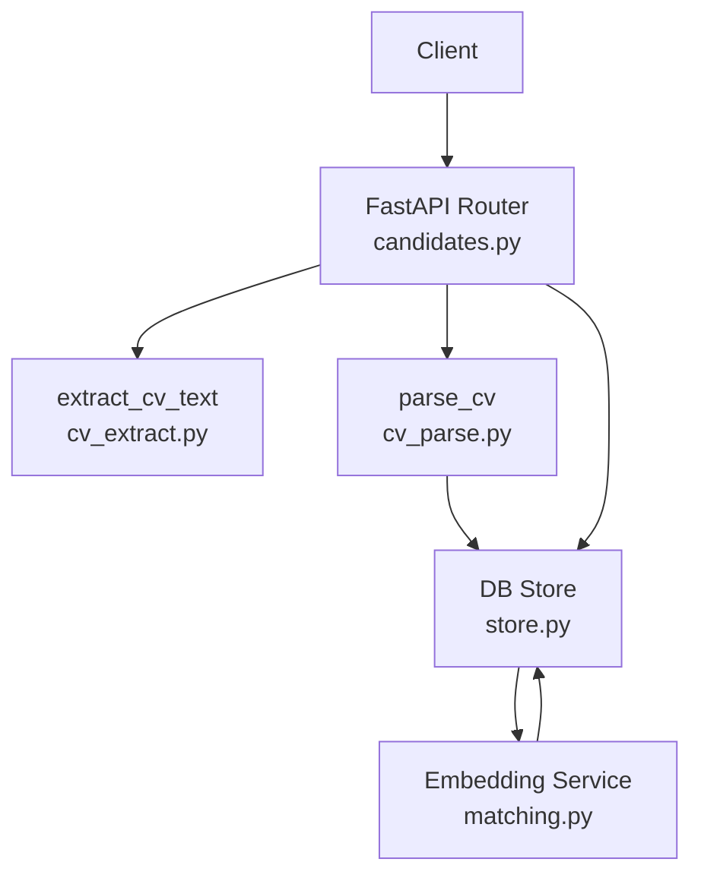
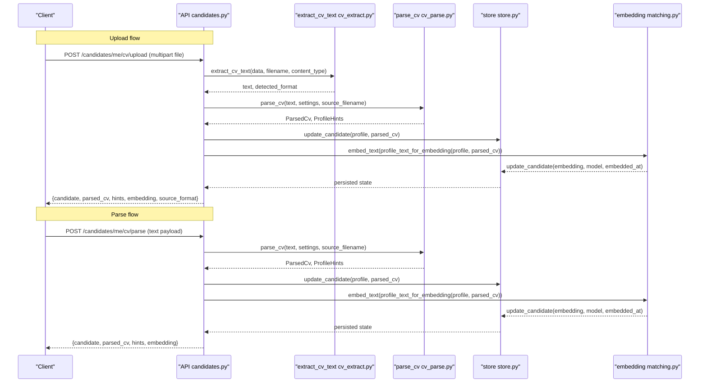
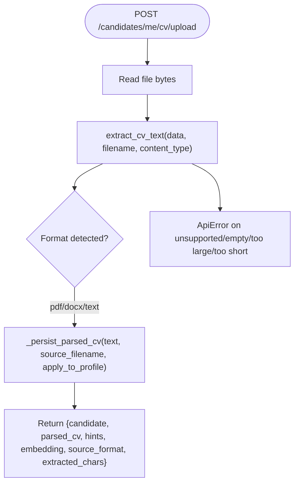
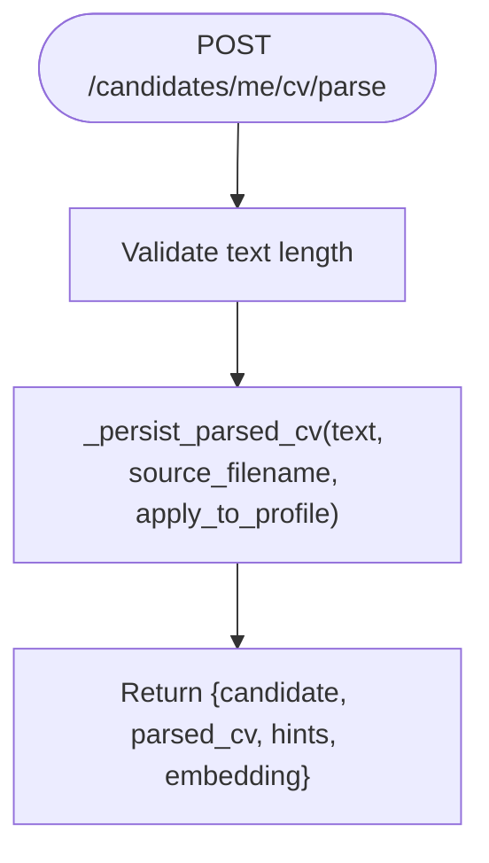
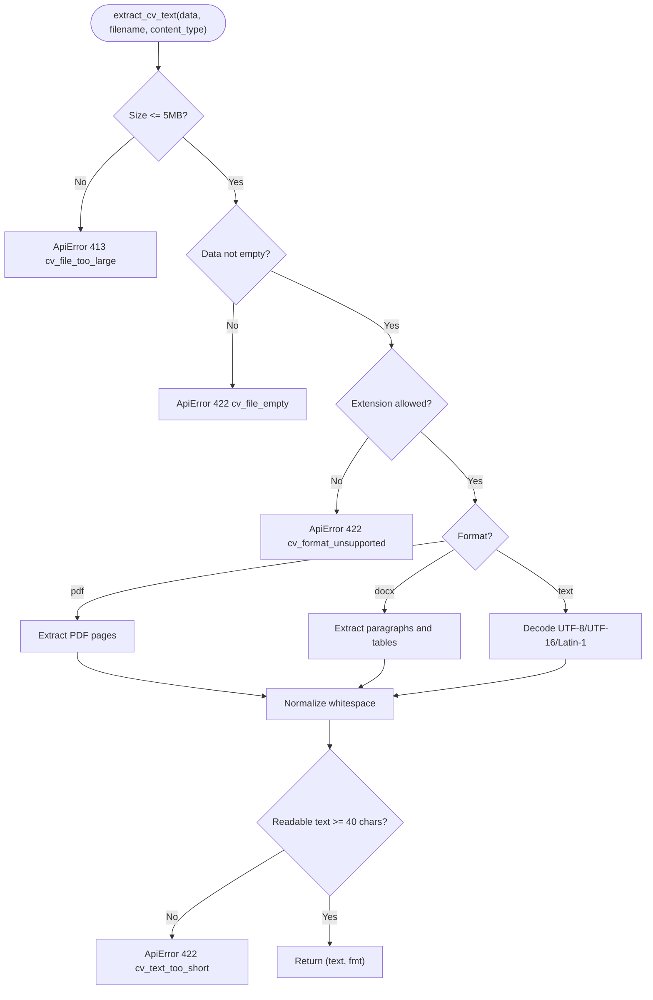
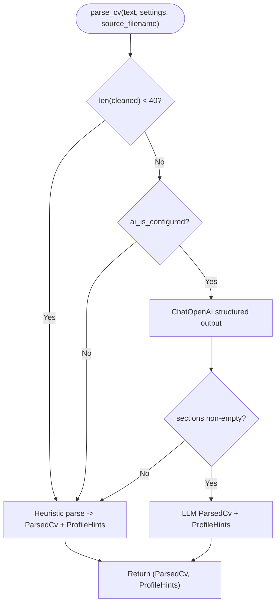
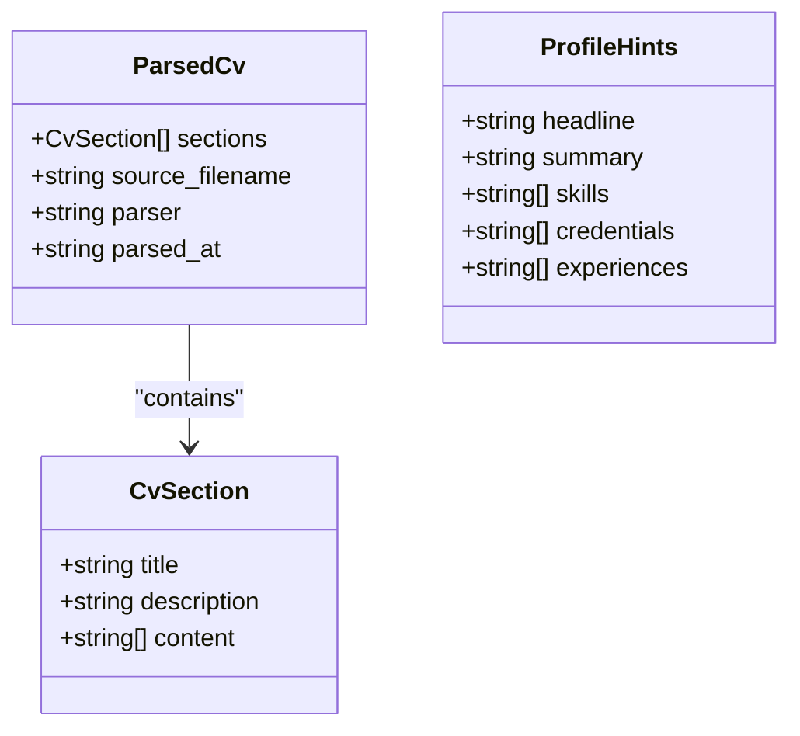
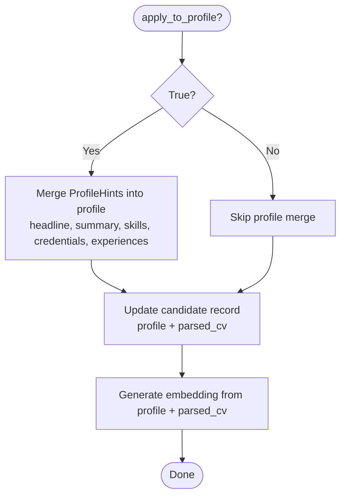
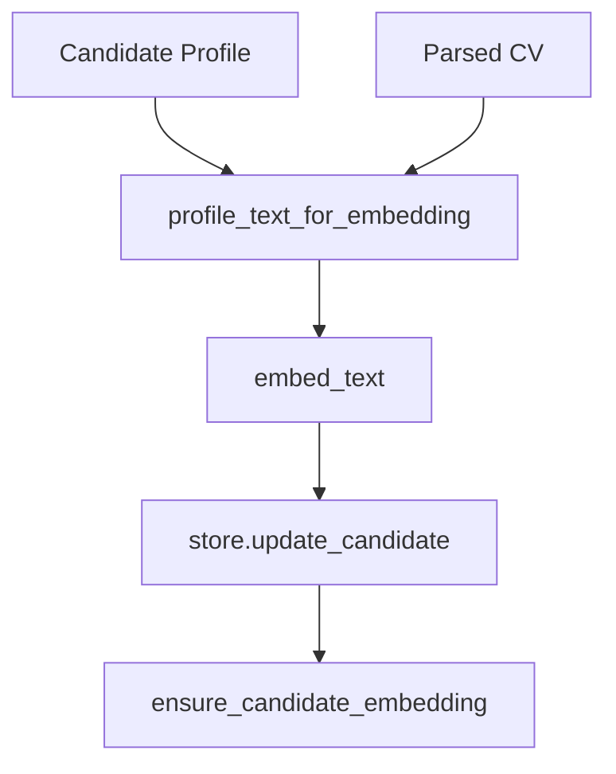
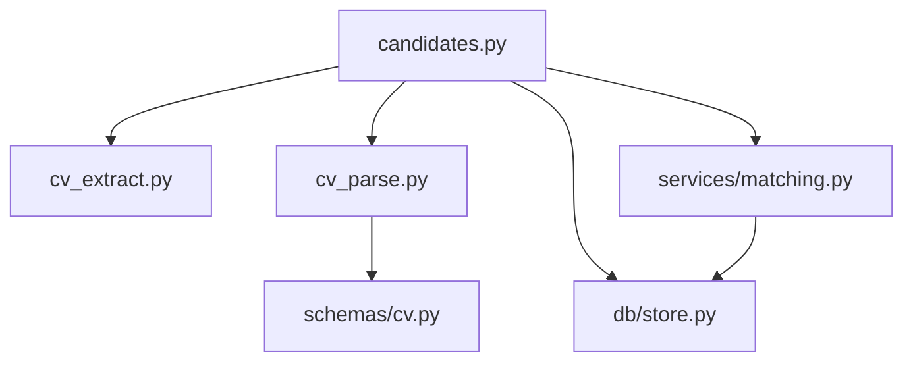

# CV Processing & Parsing

<cite>
**Referenced Files in This Document**
- [candidates.py](file://Backend/app/api/v1/candidates.py)
- [cv_extract.py](file://Backend/app/services/cv_extract.py)
- [cv_parse.py](file://Backend/app/services/cv_parse.py)
- [cv.py](file://Backend/app/schemas/cv.py)
- [store.py](file://Backend/app/db/store.py)
- [matching.py](file://Backend/app/services/matching.py)
- [test_cv_upload.py](file://Backend/tests/test_cv_upload.py)
</cite>

## Table of Contents
1. [Introduction](#introduction)
2. [Project Structure](#project-structure)
3. [Core Components](#core-components)
4. [Architecture Overview](#architecture-overview)
5. [Detailed Component Analysis](#detailed-component-analysis)
6. [Dependency Analysis](#dependency-analysis)
7. [Performance Considerations](#performance-considerations)
8. [Troubleshooting Guide](#troubleshooting-guide)
9. [Conclusion](#conclusion)

## Introduction
This document explains the CV processing and parsing functionality for candidates, including:
- File upload via POST /candidates/me/cv/upload supporting PDF, DOCX, and plain text formats
- Text-based parsing via POST /candidates/me/cv/parse
- The extract_cv_text function for format detection and text extraction
- The parse_cv function for structured data extraction into sections, skills, experience, and education
- How parsed data integrates with the candidate profile system
- The apply_to_profile parameter that automatically enriches candidate profiles with extracted information
- Examples of successful uploads/parsing responses and error handling for unsupported or malformed files

## Project Structure
The CV feature spans API endpoints, services, schemas, and persistence:
- API layer exposes upload and parse endpoints under the candidates router
- Services handle file extraction (PDF/DOCX/TXT), parsing (heuristic or LLM), and embedding generation
- Schemas define the canonical parsed CV structure and profile hints
- Persistence updates candidate records with parsed CV and embeddings
- Matching uses the parsed CV to build embeddings for job matching

**Diagram sources**
- [candidates.py:192-241](file://Backend/app/api/v1/candidates.py#L192-L241)
- [cv_extract.py:70-151](file://Backend/app/services/cv_extract.py#L70-L151)
- [cv_parse.py:171-241](file://Backend/app/services/cv_parse.py#L171-L241)
- [store.py:1211-1223](file://Backend/app/db/store.py#L1211-L1223)
- [matching.py:49-69](file://Backend/app/services/matching.py#L49-L69)

**Section sources**
- [candidates.py:192-241](file://Backend/app/api/v1/candidates.py#L192-L241)
- [cv_extract.py:70-151](file://Backend/app/services/cv_extract.py#L70-L151)
- [cv_parse.py:171-241](file://Backend/app/services/cv_parse.py#L171-L241)
- [store.py:1211-1223](file://Backend/app/db/store.py#L1211-L1223)
- [matching.py:49-69](file://Backend/app/services/matching.py#L49-L69)

## Core Components
- Upload endpoint: POST /candidates/me/cv/upload
  - Accepts a multipart file (PDF, DOCX, TXT)
  - Extracts text using extract_cv_text
  - Parses into structured sections via parse_cv
  - Persists parsed CV and updates candidate profile if requested
  - Generates an embedding for matching
- Parse endpoint: POST /candidates/me/cv/parse
  - Accepts raw text payload
  - Parses into structured sections via parse_cv
  - Persists parsed CV and updates candidate profile if requested
  - Generates an embedding for matching
- extract_cv_text: Detects format from filename/content type and extracts readable text; enforces size limits and supported formats
- parse_cv: Uses heuristic parsing by default; falls back to heuristic when AI is not configured or LLM call fails; returns ParsedCv and ProfileHints
- Schema models: CvSection, ParsedCv, ProfileHints define the canonical structure used across the system

**Section sources**
- [candidates.py:192-241](file://Backend/app/api/v1/candidates.py#L192-L241)
- [cv_extract.py:70-151](file://Backend/app/services/cv_extract.py#L70-L151)
- [cv_parse.py:171-241](file://Backend/app/services/cv_parse.py#L171-L241)
- [cv.py:8-35](file://Backend/app/schemas/cv.py#L8-L35)

## Architecture Overview
End-to-end flow for both upload and parse:

**Diagram sources**
- [candidates.py:192-241](file://Backend/app/api/v1/candidates.py#L192-L241)
- [cv_extract.py:70-151](file://Backend/app/services/cv_extract.py#L70-L151)
- [cv_parse.py:171-241](file://Backend/app/services/cv_parse.py#L171-L241)
- [store.py:1211-1223](file://Backend/app/db/store.py#L1211-L1223)
- [matching.py:49-69](file://Backend/app/services/matching.py#L49-L69)

## Detailed Component Analysis

### Upload Endpoint: POST /candidates/me/cv/upload
- Purpose: Accept a CV file, extract text, parse it, persist results, and generate an embedding
- Inputs:
  - file: multipart file (PDF, DOCX, TXT)
  - apply_to_profile: form field boolean (default True)
- Behavior:
  - Reads file bytes and calls extract_cv_text to detect format and extract text
  - Calls _persist_parsed_cv to parse, optionally apply hints to profile, persist, and embed
  - Returns metadata including source_format and extracted_chars

**Diagram sources**
- [candidates.py:216-241](file://Backend/app/api/v1/candidates.py#L216-L241)
- [cv_extract.py:70-151](file://Backend/app/services/cv_extract.py#L70-L151)

**Section sources**
- [candidates.py:216-241](file://Backend/app/api/v1/candidates.py#L216-L241)
- [cv_extract.py:70-151](file://Backend/app/services/cv_extract.py#L70-L151)

### Parse Endpoint: POST /candidates/me/cv/parse
- Purpose: Parse raw CV text into structured sections and integrate with candidate profile
- Inputs:
  - text: string payload (min length enforced)
  - source_filename: optional label for provenance
  - apply_to_profile: boolean (default True)
- Behavior:
  - Calls _persist_parsed_cv which parses, persists, and generates embedding
  - Returns parsed CV, hints, and embedding metadata

**Diagram sources**
- [candidates.py:192-213](file://Backend/app/api/v1/candidates.py#L192-L213)

**Section sources**
- [candidates.py:192-213](file://Backend/app/api/v1/candidates.py#L192-L213)

### extract_cv_text: Format Detection and Text Extraction
- Supported formats:
  - PDF (.pdf or application/pdf)
  - DOCX (.docx or WordprocessingML content type)
  - Plain text (.txt, .md, .csv; also accepts generic octet-stream when extension matches)
- Rejected formats:
  - Legacy .doc files explicitly rejected
  - Unsupported extensions or mismatched content types raise ApiError
- Size and quality checks:
  - Rejects files larger than 5 MB
  - Rejects empty files
  - Requires minimum readable text length; otherwise raises ApiError
  - Truncates excessively long extracted text to a safe limit
- Output:
  - Returns tuple of normalized text and detected format string ("pdf", "docx", "text")

**Diagram sources**
- [cv_extract.py:70-151](file://Backend/app/services/cv_extract.py#L70-L151)

**Section sources**
- [cv_extract.py:70-151](file://Backend/app/services/cv_extract.py#L70-L151)

### parse_cv: Structured Data Extraction
- Modes:
  - Heuristic parser: splits text by recognized headings (summary/profile/objective/experience/work experience/employment/education/skills/technical skills/projects/certifications/credentials/achievements/publications)
  - LLM parser: when AI is configured, attempts structured output via ChatOpenAI with strict schema; falls back to heuristic on failure
- Output:
  - ParsedCv: list of CvSection entries with title, description, and content items
  - ProfileHints: headline, summary, skills, credentials, experiences extracted for profile enrichment
- Fallback behavior:
  - If AI is not configured or LLM call fails, uses heuristic parser
  - Ensures non-empty sections; wraps unstructured text into an Overview section if needed

**Diagram sources**
- [cv_parse.py:171-241](file://Backend/app/services/cv_parse.py#L171-L241)

**Section sources**
- [cv_parse.py:171-241](file://Backend/app/services/cv_parse.py#L171-L241)

### Parsed CV Structure
- CvSection:
  - title: section heading (e.g., Summary, Experience, Education, Skills)
  - description: short context line
  - content: list of bullet-like strings representing details
- ParsedCv:
  - sections: ordered list of CvSection entries
  - source_filename: original file name for provenance
  - parser: indicates "heuristic" or "openai"
  - parsed_at: timestamp of parsing
- ProfileHints:
  - headline: top-line identifier derived from summary/profile/objective
  - summary: concise professional overview
  - skills: deduplicated list of skills extracted from skills sections
  - credentials: education/certifications extracted lines
  - experiences: work experience blurbs

**Diagram sources**
- [cv.py:8-35](file://Backend/app/schemas/cv.py#L8-L35)

**Section sources**
- [cv.py:8-35](file://Backend/app/schemas/cv.py#L8-L35)

### apply_to_profile Parameter
- When True (default):
  - Extracted ProfileHints are merged into the candidate’s existing profile
  - Non-empty fields fill missing profile fields (headline, summary)
  - Skills, credentials, and experiences are merged without duplicates, capped at configured limits
- When False:
  - Parsed CV is still stored and embedded, but profile remains unchanged
- Integration:
  - After applying hints, the candidate record is updated with the new profile and parsed CV
  - An embedding is regenerated based on the enriched profile and parsed CV

**Diagram sources**
- [candidates.py:72-102](file://Backend/app/api/v1/candidates.py#L72-L102)
- [candidates.py:105-144](file://Backend/app/api/v1/candidates.py#L105-L144)

**Section sources**
- [candidates.py:72-102](file://Backend/app/api/v1/candidates.py#L72-L102)
- [candidates.py:105-144](file://Backend/app/api/v1/candidates.py#L105-L144)

### Successful Upload Example
- Request:
  - POST /candidates/me/cv/upload with multipart file (PDF/DOCX/TXT) and apply_to_profile=true
- Response includes:
  - candidate: updated candidate object with has_embedding flag
  - parsed_cv: structured sections and metadata
  - hints: extracted profile hints
  - embedding: model and timestamp indicating successful embedding
  - source_format: detected format ("pdf", "docx", "text")
  - extracted_chars: number of characters extracted

**Section sources**
- [test_cv_upload.py:95-113](file://Backend/tests/test_cv_upload.py#L95-L113)
- [candidates.py:216-241](file://Backend/app/api/v1/candidates.py#L216-L241)

### Successful Parse Example
- Request:
  - POST /candidates/me/cv/parse with text payload and apply_to_profile=true
- Response includes:
  - candidate: updated candidate object with has_embedding flag
  - parsed_cv: structured sections and metadata
  - hints: extracted profile hints
  - embedding: model and timestamp indicating successful embedding

**Section sources**
- [candidates.py:192-213](file://Backend/app/api/v1/candidates.py#L192-L213)

### Error Handling
- Unsupported legacy .doc files:
  - Status 422, code "cv_format_unsupported"
- Unsupported file extensions or mismatched content types:
  - Status 422, code "cv_format_unsupported"
- Empty file:
  - Status 422, code "cv_file_empty"
- Oversized file (>5 MB):
  - Status 413, code "cv_file_too_large"
- Insufficient readable text:
  - Status 422, code "cv_text_too_short"
- Extraction failures:
  - Status 422, code "cv_extract_failed"

**Section sources**
- [cv_extract.py:70-151](file://Backend/app/services/cv_extract.py#L70-L151)
- [test_cv_upload.py:87-93](file://Backend/tests/test_cv_upload.py#L87-L93)

### Integration with Candidate Profile System
- Persistence:
  - Candidate record updated with profile (optionally enriched by hints) and parsed_cv
- Embedding:
  - Embedding generated from combined profile and parsed CV text for matching
  - Stored alongside model and timestamp
- Matching:
  - Matching service ensures candidate embedding exists; if missing, builds one from profile and parsed CV
  - Scores candidates against postings using skill overlap and vector similarity

**Diagram sources**
- [candidates.py:49-69](file://Backend/app/api/v1/candidates.py#L49-L69)
- [matching.py:86-112](file://Backend/app/services/matching.py#L86-L112)
- [store.py:1211-1223](file://Backend/app/db/store.py#L1211-L1223)

**Section sources**
- [candidates.py:49-69](file://Backend/app/api/v1/candidates.py#L49-L69)
- [matching.py:86-112](file://Backend/app/services/matching.py#L86-L112)
- [store.py:1211-1223](file://Backend/app/db/store.py#L1211-L1223)

## Dependency Analysis
Key dependencies and relationships:
- candidates.py depends on:
  - extract_cv_text for file extraction
  - parse_cv for structured parsing
  - store for persistence
  - embedding utilities for matching
- cv_extract.py depends on:
  - pypdf for PDF extraction
  - python-docx for DOCX extraction
  - core errors for consistent error reporting
- cv_parse.py depends on:
  - langchain_openai for LLM parsing when configured
  - schemas for Pydantic models
- store.py handles JSON serialization/deserialization for candidate fields
- matching.py ensures embeddings exist and computes scores for job matching

**Diagram sources**
- [candidates.py:192-241](file://Backend/app/api/v1/candidates.py#L192-L241)
- [cv_extract.py:70-151](file://Backend/app/services/cv_extract.py#L70-L151)
- [cv_parse.py:171-241](file://Backend/app/services/cv_parse.py#L171-L241)
- [cv.py:8-35](file://Backend/app/schemas/cv.py#L8-L35)
- [store.py:1211-1223](file://Backend/app/db/store.py#L1211-L1223)
- [matching.py:86-112](file://Backend/app/services/matching.py#L86-L112)

**Section sources**
- [candidates.py:192-241](file://Backend/app/api/v1/candidates.py#L192-L241)
- [cv_extract.py:70-151](file://Backend/app/services/cv_extract.py#L70-L151)
- [cv_parse.py:171-241](file://Backend/app/services/cv_parse.py#L171-L241)
- [cv.py:8-35](file://Backend/app/schemas/cv.py#L8-L35)
- [store.py:1211-1223](file://Backend/app/db/store.py#L1211-L1223)
- [matching.py:86-112](file://Backend/app/services/matching.py#L86-L112)

## Performance Considerations
- File size limits:
  - Enforced at 5 MB to prevent oversized uploads
- Text normalization:
  - Reduces excessive blank lines and normalizes line endings for cleaner parsing
- Parsing efficiency:
  - Heuristic parser avoids external calls when AI is not configured
  - LLM parser uses structured output with timeouts and retries; falls back to heuristic on failure
- Embedding generation:
  - Performed once per upload/update to avoid repeated costs
  - Matching service ensures embeddings exist before scoring

[No sources needed since this section provides general guidance]

## Troubleshooting Guide
Common issues and resolutions:
- Unsupported format:
  - Ensure file is PDF, DOCX, or plain text (.txt/.md/.csv); legacy .doc is not supported
- Empty or too small text:
  - Verify the file contains readable text; scanned image PDFs are not supported yet
- Too large file:
  - Compress or split the CV to stay within 5 MB limit
- Extraction failed:
  - Try converting to PDF or DOCX; ensure the file is not corrupted
- AI configuration:
  - If LLM parsing fails, the system falls back to heuristic parsing; check AI settings if you rely on LLM features

**Section sources**
- [cv_extract.py:70-151](file://Backend/app/services/cv_extract.py#L70-L151)
- [cv_parse.py:171-241](file://Backend/app/services/cv_parse.py#L171-L241)

## Conclusion
The CV processing pipeline provides robust support for uploading and parsing candidate resumes in multiple formats. It extracts text reliably, structures content into standardized sections, and integrates seamlessly with the candidate profile system through optional automatic enrichment. Generated embeddings enable efficient matching against job postings. Clear error handling and fallback mechanisms ensure resilience across various input conditions and configuration states.

[No sources needed since this section summarizes without analyzing specific files]