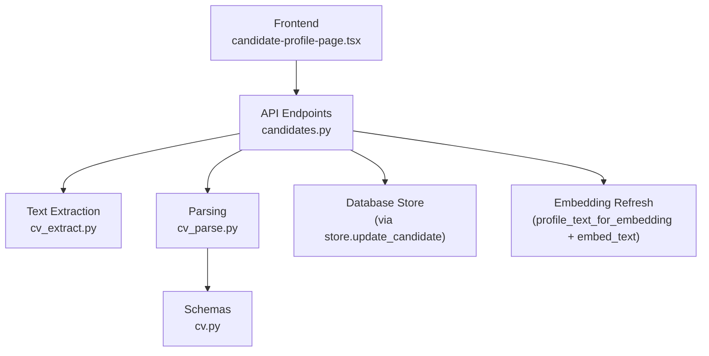
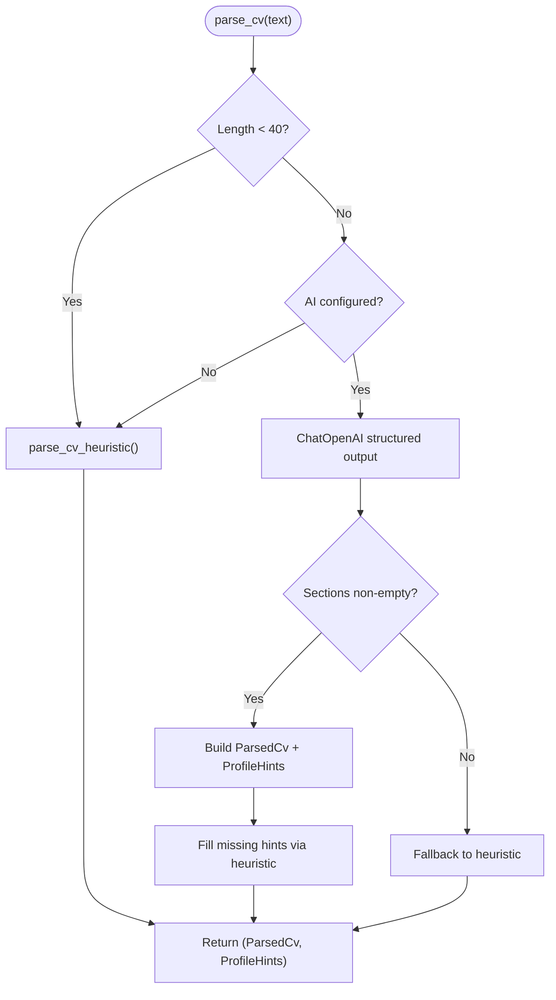
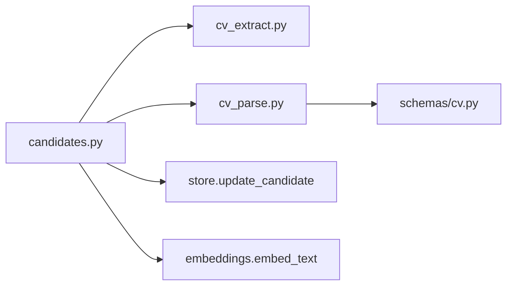

# CV Text Parsing

<cite>
**Referenced Files in This Document**
- [cv_parse.py](file://Backend/app/services/cv_parse.py)
- [cv_extract.py](file://Backend/app/services/cv_extract.py)
- [cv.py (schemas)](file://Backend/app/schemas/cv.py)
- [candidates.py (API endpoints)](file://Backend/app/api/v1/candidates.py)
- [candidate-profile-page.tsx (Frontend integration)](file://Frontend/components/candidate/candidate-profile-page.tsx)
- [test_cv_upload.py](file://Backend/tests/test_cv_upload.py)
</cite>

## Table of Contents
1. [Introduction](#introduction)
2. [Project Structure](#project-structure)
3. [Core Components](#core-components)
4. [Architecture Overview](#architecture-overview)
5. [Detailed Component Analysis](#detailed-component-analysis)
6. [Dependency Analysis](#dependency-analysis)
7. [Performance Considerations](#performance-considerations)
8. [Troubleshooting Guide](#troubleshooting-guide)
9. [Conclusion](#conclusion)
10. [Appendices](#appendices)

## Introduction
This document explains the CV text parsing functionality that converts raw CV text into structured data for candidate profiles and job matching. It focuses on the parse_cv function, which orchestrates two parsing strategies:
- A deterministic heuristic parser used when AI is not configured or as a fallback.
- An LLM-based parser that returns standardized sections and profile hints when AI is available.

The parsed output includes normalized sections such as Summary, Experience, Education, Skills, Projects, and Credentials. The system also extracts ProfileHints (headline, summary, skills, credentials, experiences) to optionally update a candidate’s editable profile via the apply_to_profile parameter.

## Project Structure
The CV parsing feature spans extraction, parsing, schema definitions, API endpoints, and frontend integration:
- Extraction: Reads PDF, DOCX, or plain text and normalizes it into clean text.
- Parsing: Converts text into structured sections and profile hints.
- Schemas: Define canonical models for parsed CVs and profile hints.
- API: Exposes endpoints to parse text or upload files, persist results, and refresh embeddings.
- Frontend: Allows candidates to paste text or upload a file and preview parsed results.



**Diagram sources**
- [candidate-profile-page.tsx:72-107](file://Frontend/components/candidate/candidate-profile-page.tsx#L72-L107)
- [candidates.py:192-241](file://Backend/app/api/v1/candidates.py#L192-L241)
- [cv_extract.py:70-151](file://Backend/app/services/cv_extract.py#L70-L151)
- [cv_parse.py:171-241](file://Backend/app/services/cv_parse.py#L171-L241)
- [cv.py:8-35](file://Backend/app/schemas/cv.py#L8-L35)

**Section sources**
- [cv_extract.py:70-151](file://Backend/app/services/cv_extract.py#L70-L151)
- [cv_parse.py:171-241](file://Backend/app/services/cv_parse.py#L171-L241)
- [cv.py:8-35](file://Backend/app/schemas/cv.py#L8-L35)
- [candidates.py:192-241](file://Backend/app/api/v1/candidates.py#L192-L241)
- [candidate-profile-page.tsx:72-107](file://Frontend/components/candidate/candidate-profile-page.tsx#L72-L107)

## Core Components
- cv_extract.extract_cv_text: Validates and reads uploaded files (PDF, DOCX, TXT), normalizes text, and enforces size/format constraints.
- cv_parse.parse_cv: Chooses between heuristic and LLM parsing based on configuration and input length; returns ParsedCv and ProfileHints.
- cv_parse.parse_cv_heuristic: Regex-based section detection using known headings; falls back to an “Overview” section if none found.
- cv_parse.extract_profile_hints: Derives headline, summary, skills, credentials, and experience blurbs from parsed sections.
- schemas: CvSection, ParsedCv, ProfileHints define the canonical structure stored per candidate.
- API endpoints: POST /candidates/me/cv/parse and POST /candidates/me/cv/upload orchestrate extraction, parsing, persistence, and embedding refresh.

Key behaviors:
- Short inputs (<40 chars) bypass LLM and use heuristic parsing.
- If AI is not configured, heuristic parsing is used.
- LLM parsing uses structured output with a Pydantic model; failures fall back to heuristic parsing.
- ProfileHints are merged into the candidate profile only when apply_to_profile is true.

**Section sources**
- [cv_extract.py:70-151](file://Backend/app/services/cv_extract.py#L70-L151)
- [cv_parse.py:15-241](file://Backend/app/services/cv_parse.py#L15-L241)
- [cv.py:8-35](file://Backend/app/schemas/cv.py#L8-L35)
- [candidates.py:192-241](file://Backend/app/api/v1/candidates.py#L192-L241)

## Architecture Overview
The end-to-end flow supports both pasted text and file uploads:

```mermaid
sequenceDiagram
participant FE as "Frontend"
participant API as "Candidates API"
participant EX as "cv_extract"
participant PAR as "cv_parse"
participant DB as "Store"
participant EM as "Embedding Service"
FE->>API : POST /candidates/me/cv/parse or /upload
alt File Upload
API->>EX : extract_cv_text(data, filename, content_type)
EX-->>API : (text, format)
else Pasted Text
API->>PAR : parse_cv(text, settings, source_filename)
end
API->>PAR : parse_cv(text, settings, source_filename)
PAR-->>API : (ParsedCv, ProfileHints)
API->>DB : update_candidate(profile, parsed_cv)
API->>EM : embed_text(profile_text_for_embedding(profile, parsed_cv))
EM-->>API : {embedding_model, embedded_at}
API-->>FE : {candidate, parsed_cv, hints, embedding}
```

**Diagram sources**
- [candidates.py:192-241](file://Backend/app/api/v1/candidates.py#L192-L241)
- [cv_extract.py:70-151](file://Backend/app/services/cv_extract.py#L70-L151)
- [cv_parse.py:171-241](file://Backend/app/services/cv_parse.py#L171-L241)

## Detailed Component Analysis

### Parsing Algorithms
- Heuristic Parser:
  - Normalizes line endings and splits by lines.
  - Detects section headings using a regex that recognizes common titles like Summary, Experience, Education, Skills, etc.
  - Builds CvSection entries with title, description, and up to 80 content lines per section.
  - If no headings are detected, treats paragraphs as an “Overview” section.
  - Limits total sections to 30.

- LLM Parser:
  - Uses LangChain ChatOpenAI with structured output bound to a Pydantic model that mirrors ParsedCv plus ProfileHints fields.
  - Enforces standard section titles and instructs the model to avoid inventing facts.
  - Caps sections at 30 and trims lists for skills, credentials, and experiences.
  - Fills missing ProfileHints by falling back to heuristic-derived hints.

- Profile Hints Extraction:
  - Scans parsed sections to collect skills, credentials, experiences, summary, and headline.
  - Deduplicates while preserving order and applies caps (e.g., 40 skills, 20 credentials/experiences).



**Diagram sources**
- [cv_parse.py:126-241](file://Backend/app/services/cv_parse.py#L126-L241)

**Section sources**
- [cv_parse.py:15-241](file://Backend/app/services/cv_parse.py#L15-L241)

### Structured Output Format and Field Mappings
- CvSection:
  - title: Section heading (e.g., “Experience”, “Education”).
  - description: Optional short description.
  - content: List of bullet-like strings representing lines within the section.

- ParsedCv:
  - sections: Up to 40 CvSection entries.
  - source_filename: Optional name of the original file.
  - parser: Either “heuristic” or “openai”.
  - parsed_at: ISO timestamp of parsing.

- ProfileHints:
  - headline: First-line or description from Summary/Profile/Objective.
  - summary: Concatenated body from Summary/Profile/Objective.
  - skills: Split by delimiters (commas, semicolons, pipes, slashes, bullets).
  - credentials: Extracted from Education/Credentials/Certifications sections.
  - experiences: Extracted from Experience/Employment/Work sections.

Normalization processes:
- Content lines are stripped and limited per section.
- Lists are deduplicated case-insensitively while preserving order.
- Caps applied to prevent unbounded growth (skills, credentials, experiences).

**Section sources**
- [cv.py:8-35](file://Backend/app/schemas/cv.py#L8-L35)
- [cv_parse.py:79-123](file://Backend/app/services/cv_parse.py#L79-L123)
- [cv_parse.py:126-168](file://Backend/app/services/cv_parse.py#L126-L168)
- [cv_parse.py:186-238](file://Backend/app/services/cv_parse.py#L186-L238)

### Integration with Candidate Profiles (apply_to_profile)
When apply_to_profile is true:
- ProfileHints are merged into the candidate’s profile:
  - headline and summary are set only if absent.
  - skills, credentials, and experiences are merged without duplicates and capped.
- The updated profile and parsed CV are persisted.
- Embeddings are refreshed using the combined profile and parsed CV text.

```mermaid
sequenceDiagram
participant API as "Candidates API"
participant PAR as "cv_parse"
participant MERGE as "_apply_hints_to_profile"
participant DB as "Store"
participant EM as "Embedding"
API->>PAR : parse_cv(text, settings, source_filename)
PAR-->>API : (ParsedCv, ProfileHints)
API->>MERGE : merge hints into profile (if apply_to_profile)
MERGE-->>API : updated profile
API->>DB : update_candidate(profile, parsed_cv)
API->>EM : embed_text(profile_text_for_embedding(profile, parsed_cv))
EM-->>API : embedding metadata
API-->>Caller : {candidate, parsed_cv, hints, embedding}
```

**Diagram sources**
- [candidates.py:72-144](file://Backend/app/api/v1/candidates.py#L72-L144)
- [cv_parse.py:171-241](file://Backend/app/services/cv_parse.py#L171-L241)

**Section sources**
- [candidates.py:72-144](file://Backend/app/api/v1/candidates.py#L72-L144)

### Input Formats and Examples
- Supported inputs:
  - Pasted text via POST /candidates/me/cv/parse with fields: text, source_filename, apply_to_profile.
  - File upload via POST /candidates/me/cv/upload with file and optional apply_to_profile.

- Example input formats:
  - Plain text with headings like “Summary”, “Skills”, “Experience”, “Education”.
  - DOCX or PDF containing similar structured sections.

- Corresponding parsed JSON structures:
  - ParsedCv.sections: Array of objects with title, description, content.
  - ProfileHints: headline, summary, skills, credentials, experiences arrays.

- Frontend behavior:
  - Displays parsed sections and indicates parser type (“heuristic” or “openai”).
  - Shows success messages including whether embedding was stored.

**Section sources**
- [candidates.py:192-241](file://Backend/app/api/v1/candidates.py#L192-L241)
- [candidate-profile-page.tsx:72-107](file://Frontend/components/candidate/candidate-profile-page.tsx#L72-L107)
- [test_cv_upload.py:13-112](file://Backend/tests/test_cv_upload.py#L13-L112)

### Edge Cases and Error Handling
- Empty or too-short text:
  - Heuristic returns empty sections; API may reject very short extracted text.
- Unsupported formats:
  - Legacy .doc files are rejected; supported formats include PDF, DOCX, TXT, MD, CSV.
- Oversized files:
  - Files over 5 MB are rejected during extraction.
- Insufficient readable text:
  - Extracted text under 40 characters triggers an error indicating scanned image PDFs are unsupported.
- LLM failure:
  - Any exception during LLM parsing falls back to heuristic parsing.
- Missing sections:
  - Heuristic parser creates an “Overview” section if no headings are detected.
- Ambiguous formatting:
  - Heuristic relies on recognized headings; unrecognized layouts default to overview paragraphs.

Error codes surfaced:
- cv_file_too_large
- cv_file_empty
- cv_format_unsupported
- cv_extract_failed
- cv_text_too_short

**Section sources**
- [cv_extract.py:70-151](file://Backend/app/services/cv_extract.py#L70-L151)
- [cv_parse.py:171-241](file://Backend/app/services/cv_parse.py#L171-L241)
- [test_cv_upload.py:87-112](file://Backend/tests/test_cv_upload.py#L87-L112)

## Dependency Analysis
- API depends on:
  - cv_extract for reading files and validating formats.
  - cv_parse for converting text to structured data and extracting profile hints.
  - store for persistence and retrieval of candidate records.
  - embeddings service for refreshing candidate vectors after updates.

- Parsing depends on:
  - Configuration (Settings) to determine AI availability and model parameters.
  - LangChain ChatOpenAI for structured LLM parsing.
  - Regex patterns for heuristic section detection.



**Diagram sources**
- [candidates.py:192-241](file://Backend/app/api/v1/candidates.py#L192-L241)
- [cv_extract.py:70-151](file://Backend/app/services/cv_extract.py#L70-L151)
- [cv_parse.py:171-241](file://Backend/app/services/cv_parse.py#L171-L241)
- [cv.py:8-35](file://Backend/app/schemas/cv.py#L8-L35)

**Section sources**
- [candidates.py:192-241](file://Backend/app/api/v1/candidates.py#L192-L241)
- [cv_extract.py:70-151](file://Backend/app/services/cv_extract.py#L70-L151)
- [cv_parse.py:171-241](file://Backend/app/services/cv_parse.py#L171-L241)
- [cv.py:8-35](file://Backend/app/schemas/cv.py#L8-L35)

## Performance Considerations
- Heuristic parsing is fast and deterministic, suitable for environments without AI or as a robust fallback.
- LLM parsing incurs network latency and cost; it is gated by configuration and input length thresholds.
- Content limits:
  - Sections capped at 40; each section’s content limited to 200 items.
  - Skills capped at 40; credentials and experiences capped at 20.
- Text normalization reduces excessive blank lines and ensures consistent parsing.
- Embedding refresh runs once per parse/update to keep candidate vectors current.

[No sources needed since this section provides general guidance]

## Troubleshooting Guide
Common issues and resolutions:
- Unsupported file format:
  - Ensure uploading PDF, DOCX, or plain text (.txt). Legacy .doc is not supported.
- File too large:
  - Reduce file size to under 5 MB.
- Not enough readable text:
  - Use text-based PDFs or DOCX; scanned images are not supported yet.
- No sections detected:
  - Heuristic will create an “Overview” section; consider adding standard headings like “Summary”, “Experience”, “Education”, “Skills”.
- LLM errors:
  - System automatically falls back to heuristic parsing; verify AI configuration if you expect LLM parsing.

Validation checks:
- Minimum text length enforced during extraction and parsing.
- Allowed extensions and content types validated before processing.

**Section sources**
- [cv_extract.py:70-151](file://Backend/app/services/cv_extract.py#L70-L151)
- [cv_parse.py:171-241](file://Backend/app/services/cv_parse.py#L171-L241)
- [test_cv_upload.py:87-112](file://Backend/tests/test_cv_upload.py#L87-L112)

## Conclusion
The CV parsing pipeline provides a resilient, dual-path approach:
- Deterministic heuristic parsing ensures baseline functionality without external dependencies.
- LLM-based parsing enhances accuracy and structure when AI is available.
The system produces a canonical ParsedCv and ProfileHints, integrates seamlessly with candidate profiles via apply_to_profile, and maintains up-to-date embeddings for job matching. Robust validation and error handling ensure reliable operation across varied CV formats and edge cases.

[No sources needed since this section summarizes without analyzing specific files]

## Appendices

### API Endpoints Reference
- POST /candidates/me/cv/parse
  - Request: text, source_filename, apply_to_profile
  - Response: candidate, parsed_cv, hints, embedding metadata
- POST /candidates/me/cv/upload
  - Request: file (PDF/DOCX/TXT), apply_to_profile
  - Response: candidate, parsed_cv, hints, embedding metadata, source_format, extracted_chars

**Section sources**
- [candidates.py:192-241](file://Backend/app/api/v1/candidates.py#L192-L241)

### Data Models Reference
- CvSection: title, description, content
- ParsedCv: sections, source_filename, parser, parsed_at
- ProfileHints: headline, summary, skills, credentials, experiences

**Section sources**
- [cv.py:8-35](file://Backend/app/schemas/cv.py#L8-L35)