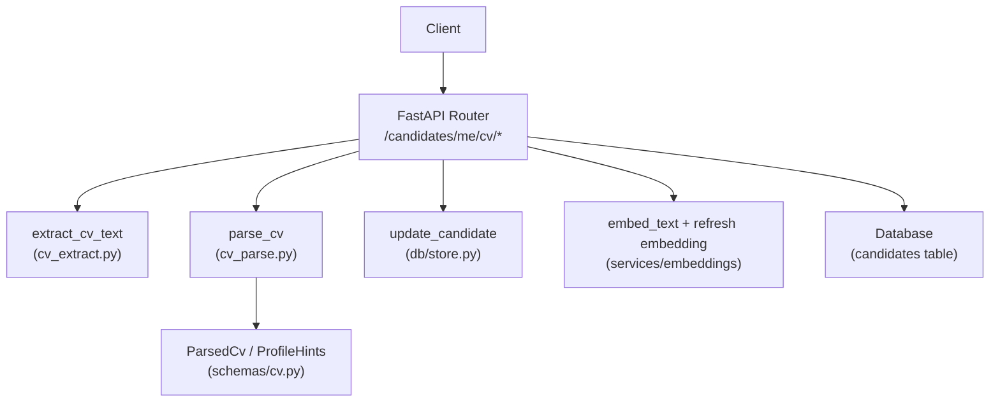
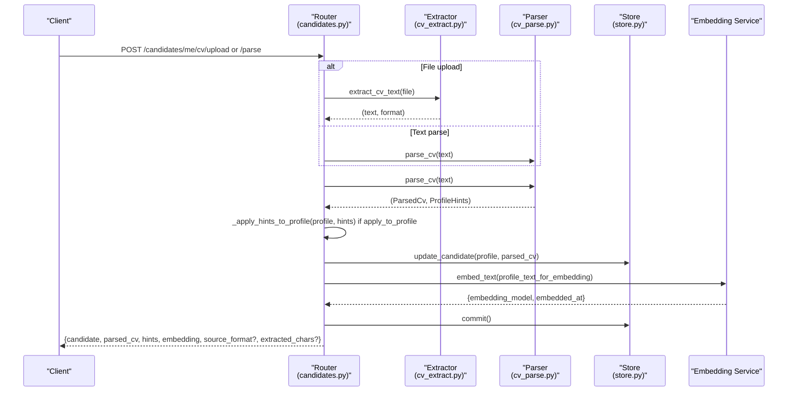
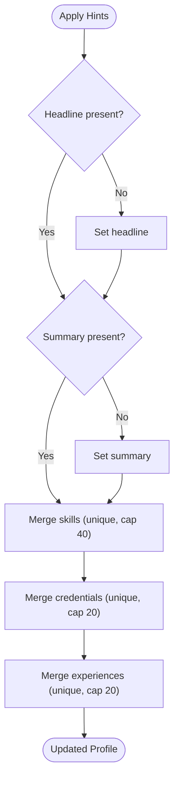
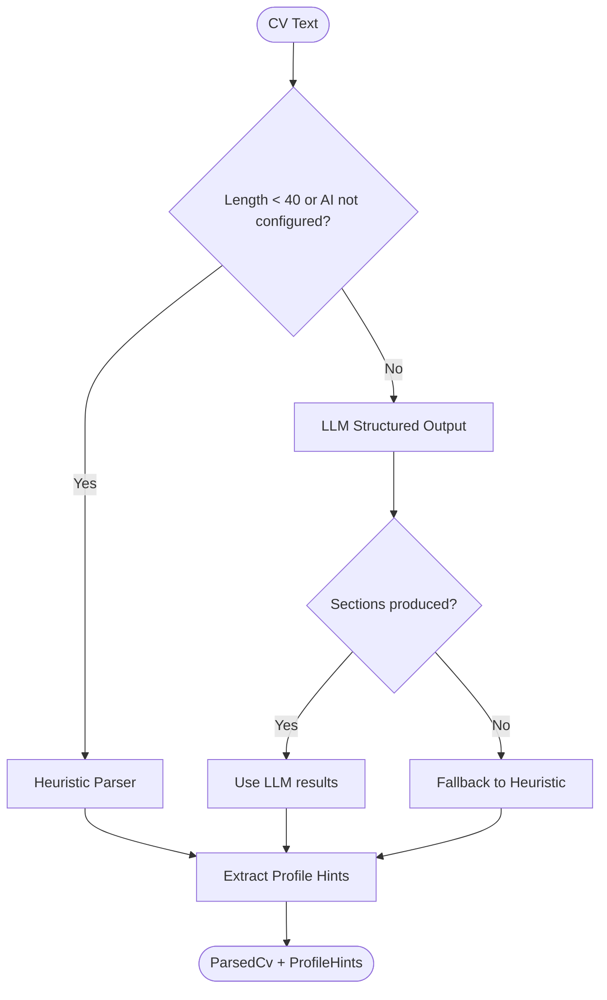
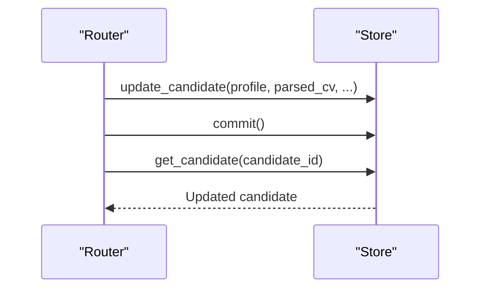
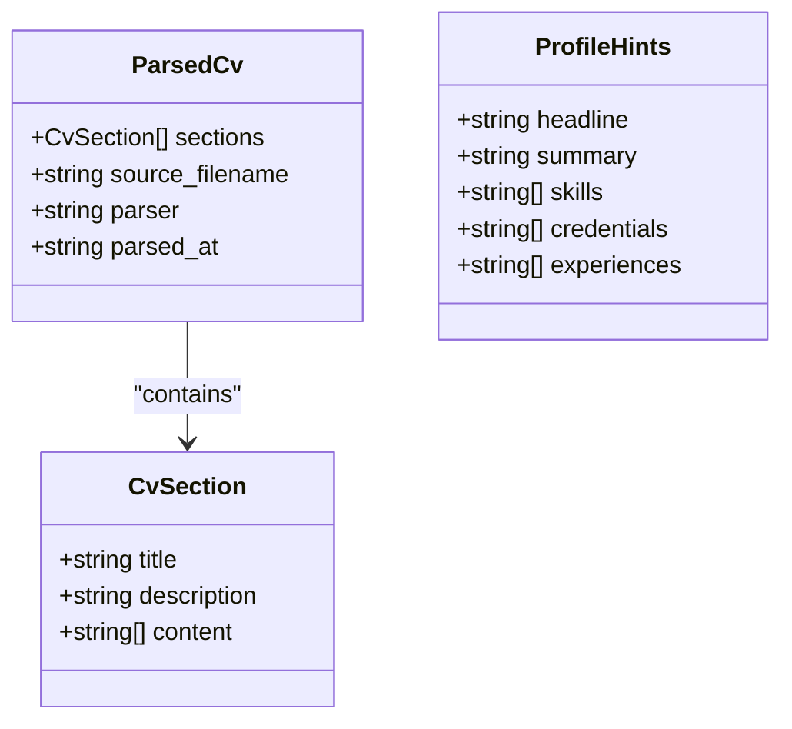
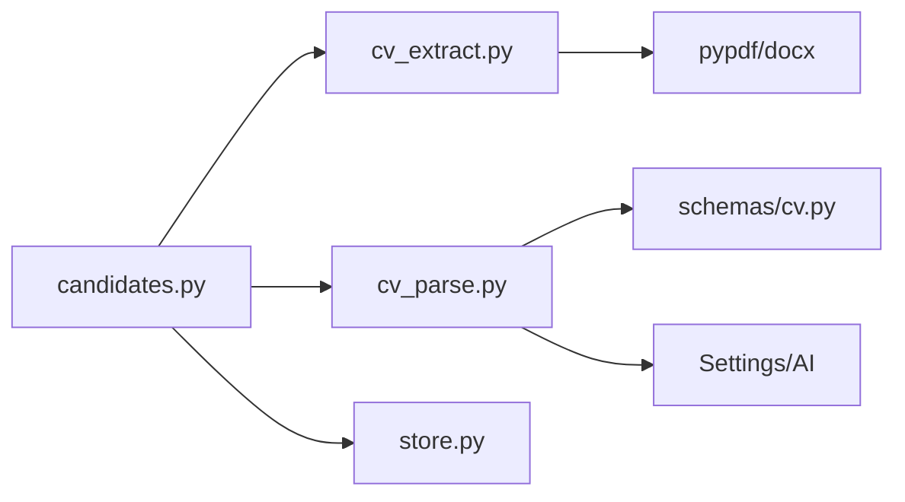

# Candidate Profile Integration

<cite>
**Referenced Files in This Document**
- [candidates.py](file://Backend/app/api/v1/candidates.py)
- [cv_parse.py](file://Backend/app/services/cv_parse.py)
- [cv_extract.py](file://Backend/app/services/cv_extract.py)
- [cv.py](file://Backend/app/schemas/cv.py)
- [store.py](file://Backend/app/db/store.py)
- [errors.py](file://Backend/app/core/errors.py)
- [test_cv_upload.py](file://Backend/tests/test_cv_upload.py)
</cite>

## Table of Contents
1. [Introduction](#introduction)
2. [Project Structure](#project-structure)
3. [Core Components](#core-components)
4. [Architecture Overview](#architecture-overview)
5. [Detailed Component Analysis](#detailed-component-analysis)
6. [Dependency Analysis](#dependency-analysis)
7. [Performance Considerations](#performance-considerations)
8. [Troubleshooting Guide](#troubleshooting-guide)
9. [Conclusion](#conclusion)

## Introduction
This document explains how CV parsing integrates with candidate profiles, focusing on:
- POST /candidates/me/cv/upload for file uploads (PDF, DOCX, text)
- POST /candidates/me/cv/parse for text-based parsing
- The apply_to_profile parameter that enriches the candidate profile with extracted information
- How skills, experiences, and credentials are merged into the profile
- Response structures for success and error cases
- End-to-end workflow examples from upload to profile enrichment
- Data validation rules, conflict resolution behavior, and rollback semantics

## Project Structure
The CV integration spans API endpoints, extraction and parsing services, schemas, database persistence, and error handling.

**Diagram sources**
- [candidates.py:198-241](file://Backend/app/api/v1/candidates.py#L198-L241)
- [cv_extract.py:70-151](file://Backend/app/services/cv_extract.py#L70-L151)
- [cv_parse.py:171-241](file://Backend/app/services/cv_parse.py#L171-L241)
- [cv.py:8-35](file://Backend/app/schemas/cv.py#L8-L35)
- [store.py:1211-1247](file://Backend/app/db/store.py#L1211-L1247)

**Section sources**
- [candidates.py:198-241](file://Backend/app/api/v1/candidates.py#L198-L241)
- [cv_extract.py:70-151](file://Backend/app/services/cv_extract.py#L70-L151)
- [cv_parse.py:171-241](file://Backend/app/services/cv_parse.py#L171-L241)
- [cv.py:8-35](file://Backend/app/schemas/cv.py#L8-L35)
- [store.py:1211-1247](file://Backend/app/db/store.py#L1211-L1247)

## Core Components
- Upload endpoint: extracts text from uploaded files, parses once, persists parsed CV, optionally applies hints to profile, computes embeddings, and returns enriched data.
- Parse endpoint: accepts raw text, parses once, persists parsed CV, optionally applies hints to profile, computes embeddings, and returns enriched data.
- Parsing service: uses LLM when configured; otherwise falls back to a deterministic heuristic parser. Produces structured sections and profile hints.
- Extraction service: validates file size, format, content type, and extracts readable text from PDF/DOCX/plain text.
- Persistence: updates candidate profile, parsed CV, and embedding metadata atomically within a transaction.
- Error handling: standardized error responses with codes and messages for validation and processing failures.

**Section sources**
- [candidates.py:198-241](file://Backend/app/api/v1/candidates.py#L198-L241)
- [cv_parse.py:171-241](file://Backend/app/services/cv_parse.py#L171-L241)
- [cv_extract.py:70-151](file://Backend/app/services/cv_extract.py#L70-L151)
- [store.py:1211-1247](file://Backend/app/db/store.py#L1211-L1247)
- [errors.py:60-111](file://Backend/app/core/errors.py#L60-L111)

## Architecture Overview
The flow for both upload and parse operations is unified through a shared persistence helper that:
- Parses the CV text into structured sections and extracts profile hints
- Optionally merges hints into the candidate profile
- Persists parsed CV and updated profile
- Refreshes vector embeddings for matching
- Returns a consistent response including candidate, parsed CV, hints, and embedding metadata

**Diagram sources**
- [candidates.py:105-144](file://Backend/app/api/v1/candidates.py#L105-L144)
- [candidates.py:198-241](file://Backend/app/api/v1/candidates.py#L198-L241)
- [cv_extract.py:70-151](file://Backend/app/services/cv_extract.py#L70-L151)
- [cv_parse.py:171-241](file://Backend/app/services/cv_parse.py#L171-L241)
- [store.py:1211-1247](file://Backend/app/db/store.py#L1211-L1247)

## Detailed Component Analysis

### Upload Endpoint: POST /candidates/me/cv/upload
- Accepts multipart form with a file and an optional boolean form field apply_to_profile (default True).
- Validates file size, extension, and content type; rejects unsupported formats like legacy .doc.
- Extracts text from PDF, DOCX, or plain text; enforces minimum readable text length.
- Calls shared persistence to parse, persist, and embed.
- Adds source_format and extracted_chars to the response.

Request
- Method: POST
- Path: /api/v1/candidates/me/cv/upload
- Content-Type: multipart/form-data
- Fields:
  - file: required binary file (PDF, DOCX, TXT, MD, CSV)
  - apply_to_profile: optional boolean (default true)

Response (success)
- candidate: object containing id, profile, consents, target_domains, updated_at, parsed_cv, embedding_model, embedded_at, has_embedding
- parsed_cv: structured sections, source_filename, parser, parsed_at
- hints: headline, summary, skills, credentials, experiences
- embedding: embedding_model, embedded_at, has_embedding
- source_format: pdf | docx | text
- extracted_chars: integer length of extracted text

Error responses
- 422 cv_file_empty: empty file
- 422 cv_format_unsupported: unsupported extension or content type
- 422 cv_text_too_short: not enough readable text
- 413 cv_file_too_large: exceeds maximum size
- 422 request_validation_error: invalid schema

Validation and constraints
- Maximum file size: 5 MB
- Allowed extensions: .pdf, .docx, .txt, .md, .csv
- Minimum readable text length: 40 characters
- Legacy .doc files are rejected explicitly

**Section sources**
- [candidates.py:216-241](file://Backend/app/api/v1/candidates.py#L216-L241)
- [cv_extract.py:70-151](file://Backend/app/services/cv_extract.py#L70-L151)
- [errors.py:60-111](file://Backend/app/core/errors.py#L60-L111)
- [test_cv_upload.py:95-113](file://Backend/tests/test_cv_upload.py#L95-L113)

### Parse Endpoint: POST /candidates/me/cv/parse
- Accepts JSON body with text, optional source_filename, and apply_to_profile (default True).
- Validates text length between 40 and 100,000 characters.
- Parses once into structured sections and profile hints.
- Persists parsed CV and optionally applies hints to profile.
- Computes embeddings and returns enriched response.

Request
- Method: POST
- Path: /api/v1/candidates/me/cv/parse
- Body:
  - text: string, min_length 40, max_length 100000
  - source_filename: optional string, max_length 255
  - apply_to_profile: boolean, default true

Response (success)
- Same structure as upload, without source_format and extracted_chars

Error responses
- 422 request_validation_error: invalid schema or text length out of range

**Section sources**
- [candidates.py:192-213](file://Backend/app/api/v1/candidates.py#L192-L213)
- [cv_parse.py:171-241](file://Backend/app/services/cv_parse.py#L171-L241)
- [errors.py:60-111](file://Backend/app/core/errors.py#L60-L111)

### Profile Enrichment: apply_to_profile Behavior
When apply_to_profile is true, the system merges extracted hints into the existing profile using safe, non-destructive rules:
- headline: only set if currently empty
- summary: only set if currently empty
- skills: merge unique items (case-insensitive), capped at 40
- credentials: merge unique items (case-insensitive), capped at 20
- experiences: merge unique items (case-insensitive), capped at 20

Conflict resolution
- Existing values are preserved unless the target field is empty
- Duplicates are removed while preserving order
- Caps prevent unbounded growth of list fields

**Diagram sources**
- [candidates.py:72-102](file://Backend/app/api/v1/candidates.py#L72-L102)

**Section sources**
- [candidates.py:72-102](file://Backend/app/api/v1/candidates.py#L72-L102)
- [cv_parse.py:79-123](file://Backend/app/services/cv_parse.py#L79-L123)

### Parsing Logic: Heuristic vs LLM
- If AI is not configured or input is very short, uses a deterministic heuristic parser that splits by headings and normalizes sections.
- If AI is configured, attempts structured output via LLM; on failure, falls back to heuristic.
- Produces:
  - ParsedCv: sections with title, description, content; parser name; parsed timestamp
  - ProfileHints: headline, summary, skills, credentials, experiences

**Diagram sources**
- [cv_parse.py:171-241](file://Backend/app/services/cv_parse.py#L171-L241)
- [cv_parse.py:126-168](file://Backend/app/services/cv_parse.py#L126-L168)

**Section sources**
- [cv_parse.py:171-241](file://Backend/app/services/cv_parse.py#L171-L241)
- [cv_parse.py:126-168](file://Backend/app/services/cv_parse.py#L126-L168)

### Persistence and Transaction Semantics
- update_candidate writes profile, parsed_cv, and embedding metadata in a single transaction.
- After updates, the connection is committed before reading the refreshed candidate record.
- There is no explicit rollback mechanism in the endpoint; errors raised during extraction or parsing will abort the transaction implicitly via exception handling.

**Diagram sources**
- [candidates.py:105-144](file://Backend/app/api/v1/candidates.py#L105-L144)
- [store.py:1211-1247](file://Backend/app/db/store.py#L1211-L1247)

**Section sources**
- [candidates.py:105-144](file://Backend/app/api/v1/candidates.py#L105-L144)
- [store.py:1211-1247](file://Backend/app/db/store.py#L1211-L1247)

### Data Models
- ParsedCv: canonical representation stored on candidate profile; includes sections, source filename, parser, parsed timestamp.
- ProfileHints: fields extracted from parsed CV to seed editable profile fields.
- CvSection: section title, description, and content lines.

**Diagram sources**
- [cv.py:8-35](file://Backend/app/schemas/cv.py#L8-L35)

**Section sources**
- [cv.py:8-35](file://Backend/app/schemas/cv.py#L8-L35)

## Dependency Analysis
- candidates.py depends on:
  - cv_extract.extract_cv_text for file uploads
  - cv_parse.parse_cv for parsing
  - store.update_candidate for persistence
  - embeddings.embed_text for vectorization
- cv_parse.py depends on:
  - Settings for AI configuration
  - LangChain/OpenAI client when available
  - Schemas for structured models
- cv_extract.py depends on:
  - pypdf for PDF extraction
  - python-docx for DOCX extraction
  - Standard library for text normalization

**Diagram sources**
- [candidates.py:198-241](file://Backend/app/api/v1/candidates.py#L198-L241)
- [cv_extract.py:70-151](file://Backend/app/services/cv_extract.py#L70-L151)
- [cv_parse.py:171-241](file://Backend/app/services/cv_parse.py#L171-L241)
- [cv.py:8-35](file://Backend/app/schemas/cv.py#L8-L35)

**Section sources**
- [candidates.py:198-241](file://Backend/app/api/v1/candidates.py#L198-L241)
- [cv_extract.py:70-151](file://Backend/app/services/cv_extract.py#L70-L151)
- [cv_parse.py:171-241](file://Backend/app/services/cv_parse.py#L171-L241)
- [cv.py:8-35](file://Backend/app/schemas/cv.py#L8-L35)

## Performance Considerations
- Parsing cost is paid once per upload/update; embeddings are computed based on flattened profile and parsed sections to support efficient matching.
- Heuristic parsing avoids external dependencies when AI is not configured, reducing latency.
- File extraction enforces size limits and minimum text thresholds to avoid expensive processing of large or unreadable files.
- List merging caps (skills 40, credentials/experiences 20) prevent unbounded growth and keep storage efficient.

[No sources needed since this section provides general guidance]

## Troubleshooting Guide
Common errors and their causes:
- cv_file_too_large: Uploaded file exceeds 5 MB limit
- cv_file_empty: Uploaded file contains no data
- cv_format_unsupported: Unsupported extension (.doc) or mismatched content type
- cv_text_too_short: Not enough readable text found; scanned image PDFs are not supported yet
- request_validation_error: Invalid schema or text length outside allowed range
- internal_server_error: Unexpected server-side exceptions

Resolution steps:
- Ensure file size is under 5 MB and use supported formats (PDF, DOCX, TXT, MD, CSV)
- For PDFs, ensure they contain selectable text rather than scanned images
- Provide sufficient text content (minimum 40 characters)
- Validate JSON payload for parse endpoint against schema constraints

**Section sources**
- [cv_extract.py:70-151](file://Backend/app/services/cv_extract.py#L70-L151)
- [errors.py:60-111](file://Backend/app/core/errors.py#L60-L111)

## Conclusion
The CV integration provides a robust pipeline for extracting, parsing, and enriching candidate profiles:
- Upload and parse endpoints normalize inputs and produce structured CV data
- apply_to_profile safely merges extracted hints into existing profiles with conflict-aware deduplication and caps
- Persistence is transactional, ensuring consistency across profile, parsed CV, and embedding metadata
- Comprehensive validation and error handling guide clients toward correct usage
- End-to-end workflows are validated by tests demonstrating successful uploads and embedding generation

[No sources needed since this section summarizes without analyzing specific files]