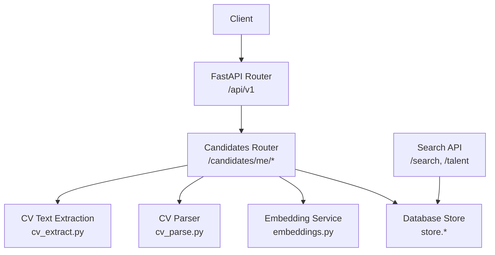
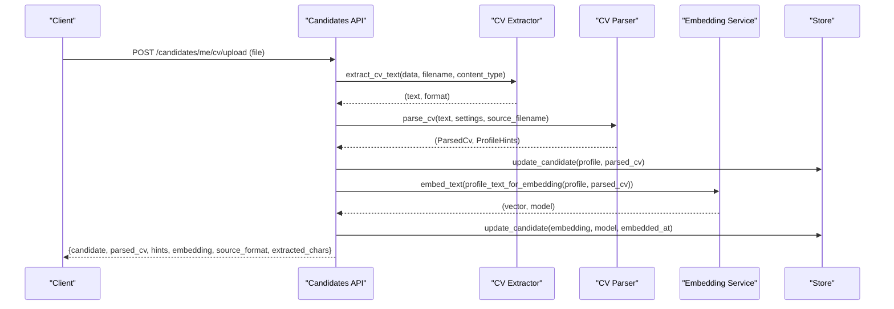
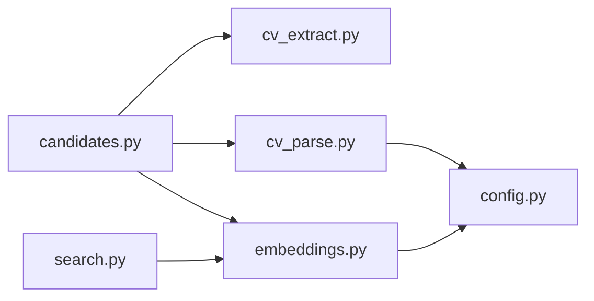

# Candidate Profile Management

<cite>
**Referenced Files in This Document**
- [candidates.py](file://Backend/app/api/v1/candidates.py)
- [cv.py](file://Backend/app/schemas/cv.py)
- [cv_parse.py](file://Backend/app/services/cv_parse.py)
- [cv_extract.py](file://Backend/app/services/cv_extract.py)
- [embeddings.py](file://Backend/app/services/embeddings.py)
- [router.py](file://Backend/app/api/v1/router.py)
- [search.py](file://Backend/app/api/v1/search.py)
- [config.py](file://Backend/app/core/config.py)
- [test_cv_upload.py](file://Backend/tests/test_cv_upload.py)
</cite>

## Table of Contents
1. [Introduction](#introduction)
2. [Project Structure](#project-structure)
3. [Core Components](#core-components)
4. [Architecture Overview](#architecture-overview)
5. [Detailed Component Analysis](#detailed-component-analysis)
6. [Dependency Analysis](#dependency-analysis)
7. [Performance Considerations](#performance-considerations)
8. [Troubleshooting Guide](#troubleshooting-guide)
9. [Conclusion](#conclusion)
10. [Appendices](#appendices)

## Introduction
This document provides comprehensive API documentation for candidate profile management endpoints, focusing on:
- Retrieving and updating a candidate’s profile
- Parsing CVs (PDF/DOCX/TXT) into structured sections
- Extracting skills, credentials, experiences, headline, and summary from CVs
- Generating embeddings for candidate matching and search
- Practical examples of enriching profiles via CV parsing and manual updates

The backend exposes FastAPI routes under /api/v1, with candidate self-service operations scoped to the authenticated candidate context.

## Project Structure
Candidate profile management spans several modules:
- API layer: routes for profile retrieval/update, CV parse/upload, consent, and interview attempts
- Schemas: Pydantic models for parsed CVs and profile hints
- Services: CV text extraction, CV parsing (heuristic or LLM), embedding generation
- Configuration: AI provider settings and feature toggles
- Search: talent discovery using embeddings

**Diagram sources**
- [router.py:26-40](file://Backend/app/api/v1/router.py#L26-L40)
- [candidates.py:147-241](file://Backend/app/api/v1/candidates.py#L147-L241)
- [cv_extract.py:70-151](file://Backend/app/services/cv_extract.py#L70-L151)
- [cv_parse.py:171-241](file://Backend/app/services/cv_parse.py#L171-L241)
- [embeddings.py:52-75](file://Backend/app/services/embeddings.py#L52-L75)
- [search.py:16-51](file://Backend/app/api/v1/search.py#L16-L51)

**Section sources**
- [router.py:26-40](file://Backend/app/api/v1/router.py#L26-L40)

## Core Components
- Candidate profile endpoints:
  - GET /api/v1/candidates/me/profile
  - PATCH /api/v1/candidates/me/profile
  - POST /api/v1/candidates/me/cv/parse
  - POST /api/v1/candidates/me/cv/upload
  - PUT /api/v1/candidates/me/consents/{purpose}
- CV parsing pipeline:
  - File/text ingestion
  - Heuristic or LLM-based parsing into structured sections
  - Profile hint extraction (headline, summary, skills, credentials, experiences)
- Embedding generation:
  - OpenAI embeddings when configured; deterministic local hash fallback
  - Stored per candidate for matching and search

**Section sources**
- [candidates.py:147-241](file://Backend/app/api/v1/candidates.py#L147-L241)
- [cv_parse.py:79-123](file://Backend/app/services/cv_parse.py#L79-L123)
- [cv_extract.py:70-151](file://Backend/app/services/cv_extract.py#L70-L151)
- [embeddings.py:52-75](file://Backend/app/services/embeddings.py#L52-L75)

## Architecture Overview
End-to-end flow for CV upload and profile enrichment:

**Diagram sources**
- [candidates.py:216-241](file://Backend/app/api/v1/candidates.py#L216-L241)
- [cv_extract.py:70-151](file://Backend/app/services/cv_extract.py#L70-L151)
- [cv_parse.py:171-241](file://Backend/app/services/cv_parse.py#L171-L241)
- [embeddings.py:52-75](file://Backend/app/services/embeddings.py#L52-L75)

## Detailed Component Analysis

### Profile Retrieval
- Endpoint: GET /api/v1/candidates/me/profile
- Behavior: Returns current candidate profile, consents, target domains, parsed CV metadata, embedding status, and timestamps.

Response fields include:
- id, profile, consents, target_domains, updated_at
- parsed_cv (structured sections, parser used, parsed timestamp)
- embedding_model, embedded_at, has_embedding

Use cases:
- Display candidate dashboard
- Pre-fill profile editing UI
- Check if embedding exists before search

**Section sources**
- [candidates.py:147-149](file://Backend/app/api/v1/candidates.py#L147-L149)
- [candidates.py:34-46](file://Backend/app/api/v1/candidates.py#L34-L46)

### Profile Update
- Endpoint: PATCH /api/v1/candidates/me/profile
- Request body fields:
  - headline (string, max 200)
  - summary (string, max 4000)
  - skills (list of strings, max 50)
  - credentials (list of strings, max 25)
  - experiences (list of strings, max 25)
  - availability (string, max 100)
  - target_domains (list of strings, max 10)
- Behavior:
  - Updates specified fields in profile
  - Persists target_domains
  - Regenerates embedding based on updated profile and existing parsed CV

Validation rules:
- Field length limits enforced by request schema
- Lists are merged with deduplication during CV hint application (see below)

Example update payload:
- headline: "Senior Backend Engineer"
- summary: "Experienced in building scalable APIs and hiring platforms."
- skills: ["Python", "FastAPI", "PostgreSQL", "System Design"]
- credentials: ["AWS Certified Developer"]
- experiences: ["Built hiring platforms with FastAPI and Postgres."]

After update:
- A new embedding is generated and stored with model name and timestamp.

**Section sources**
- [candidates.py:152-189](file://Backend/app/api/v1/candidates.py#L152-L189)
- [candidates.py:49-69](file://Backend/app/api/v1/candidates.py#L49-L69)

### CV Text Parsing
- Endpoint: POST /api/v1/candidates/me/cv/parse
- Request body:
  - text (string, min 40, max 100000)
  - source_filename (optional string, max 255)
  - apply_to_profile (boolean, default true)
- Behavior:
  - Parses CV text into structured sections
  - Optionally applies extracted hints to the editable profile
  - Persists parsed CV and regenerates embedding

Parsing modes:
- If AI is not configured or text is short, uses heuristic parser
- Otherwise uses LLM with structured output; falls back to heuristic on errors

Profile hint application:
- Merges skills, credentials, experiences without duplicates
- Caps lists to prevent excessive growth (skills up to 40, credentials/experiences up to 20)
- Sets headline and summary only if missing

Output includes:
- candidate (updated profile with parsed metadata)
- parsed_cv (sections, parser, parsed_at)
- hints (extracted fields)
- embedding (model and timestamp)

**Section sources**
- [candidates.py:192-213](file://Backend/app/api/v1/candidates.py#L192-L213)
- [candidates.py:105-144](file://Backend/app/api/v1/candidates.py#L105-L144)
- [cv_parse.py:79-123](file://Backend/app/services/cv_parse.py#L79-L123)
- [cv_parse.py:126-168](file://Backend/app/services/cv_parse.py#L126-L168)
- [cv_parse.py:171-241](file://Backend/app/services/cv_parse.py#L171-L241)

### CV Upload and Format Support
- Endpoint: POST /api/v1/candidates/me/cv/upload
- Input:
  - file (multipart/form-data)
  - apply_to_profile (form field, boolean, default true)
- Supported formats:
  - PDF (.pdf)
  - DOCX (.docx)
  - Plain text (.txt, .md, .csv)
  - Legacy .doc files are rejected
- Behavior:
  - Validates size (max 5 MB) and non-empty content
  - Extracts text from supported formats
  - Ensures minimum readable text length
  - Truncates very large texts
  - Parses and persists, then generates embedding

Error handling:
- Too large file: 413
- Empty file: 422
- Unsupported format: 422
- Extraction failure: 422
- Not enough readable text: 422

Response includes:
- candidate, parsed_cv, hints, embedding
- source_format ("pdf", "docx", "text")
- extracted_chars (length of extracted text)

Practical example:
- Upload a DOCX resume containing skills and experience
- apply_to_profile=true merges extracted skills and experiences into the candidate profile
- Response confirms embedding was generated and parsed sections exist

**Section sources**
- [candidates.py:216-241](file://Backend/app/api/v1/candidates.py#L216-L241)
- [cv_extract.py:70-151](file://Backend/app/services/cv_extract.py#L70-L151)
- [test_cv_upload.py:95-113](file://Backend/tests/test_cv_upload.py#L95-L113)

### Skill Extraction, Credential Processing, Experience Parsing
- Source: cv_parse.py
- Heuristic mode:
  - Recognizes headings like Skills, Education, Credentials, Experience
  - Splits lines by delimiters (commas, semicolons, pipes, bullets)
  - Limits entries to reasonable lengths
  - Deduplicates while preserving order
- LLM mode:
  - Requests structured output including sections and profile hints
  - Falls back to heuristic results for missing fields
  - Caps list sizes to maintain consistency

Field mapping:
- Skills: extracted from skill-related sections
- Credentials: extracted from education/credential/certification sections
- Experiences: extracted from experience/employment/work sections
- Headline/Summary: inferred from overview/profile/objective sections

**Section sources**
- [cv_parse.py:79-123](file://Backend/app/services/cv_parse.py#L79-L123)
- [cv_parse.py:126-168](file://Backend/app/services/cv_parse.py#L126-L168)
- [cv_parse.py:171-241](file://Backend/app/services/cv_parse.py#L171-L241)

### Embedding Generation for Matching and Search
- Purpose: Create vector representations of candidate profiles for similarity matching and talent search
- Process:
  - Compose profile text from headline, summary, skills, credentials, experiences, and flattened parsed CV sections
  - Generate embedding using OpenAI if configured; otherwise use deterministic local hash embedding
  - Store vector, model name, and timestamp on candidate record

Configuration:
- ai_is_configured determines whether to use OpenAI embeddings
- embedding_model specifies the model name when available
- Local fallback ensures offline/dev environments still support matching paths

Search integration:
- Talent discovery endpoint queries candidates using embeddings and optional filters (pack_id, min_score)
- Results include similarity scores derived from cosine similarity

**Section sources**
- [cv_parse.py:44-54](file://Backend/app/services/cv_parse.py#L44-L54)
- [embeddings.py:52-75](file://Backend/app/services/embeddings.py#L52-L75)
- [embeddings.py:21-33](file://Backend/app/services/embeddings.py#L21-L33)
- [search.py:29-51](file://Backend/app/api/v1/search.py#L29-L51)
- [config.py:77-81](file://Backend/app/core/config.py#L77-L81)

### Consent Management
- Endpoint: PUT /api/v1/candidates/me/consents/{purpose}
- Allowed purposes:
  - discovery
  - application_processing
- Behavior:
  - Updates consent flags in candidate profile
  - Persists changes immediately

Use cases:
- Enable candidate visibility in talent discovery
- Allow processing for job applications

**Section sources**
- [candidates.py:244-265](file://Backend/app/api/v1/candidates.py#L244-L265)

## Dependency Analysis
Key dependencies and relationships:
- Candidates router depends on:
  - CV extraction service for file uploads
  - CV parser for text parsing and hint extraction
  - Embedding service for vector generation
  - Database store for persistence
- Search endpoints depend on:
  - Store functions for talent discovery
  - Embeddings for similarity scoring

**Diagram sources**
- [candidates.py:147-241](file://Backend/app/api/v1/candidates.py#L147-L241)
- [cv_extract.py:70-151](file://Backend/app/services/cv_extract.py#L70-L151)
- [cv_parse.py:171-241](file://Backend/app/services/cv_parse.py#L171-L241)
- [embeddings.py:52-75](file://Backend/app/services/embeddings.py#L52-L75)
- [search.py:29-51](file://Backend/app/api/v1/search.py#L29-L51)
- [config.py:77-81](file://Backend/app/core/config.py#L77-L81)

**Section sources**
- [candidates.py:147-241](file://Backend/app/api/v1/candidates.py#L147-L241)
- [search.py:29-51](file://Backend/app/api/v1/search.py#L29-L51)
- [config.py:77-81](file://Backend/app/core/config.py#L77-L81)

## Performance Considerations
- CV parsing:
  - Heuristic parser avoids external calls when AI is not configured
  - LLM parsing capped at 24000 characters to control token usage
  - Fallback to heuristic ensures robustness
- Embedding generation:
  - OpenAI embeddings limited to 12000 characters
  - Local hash embedding provides deterministic performance without network calls
- File upload:
  - Size limit of 5 MB prevents excessive memory usage
  - Text truncation at 100000 characters protects downstream processing

Optimization opportunities:
- Cache parsed CV results to avoid re-parsing identical content
- Batch embedding updates when multiple profile fields change
- Use pgvector for ANN queries in production deployments

[No sources needed since this section provides general guidance]

## Troubleshooting Guide
Common issues and resolutions:
- Unsupported file format:
  - Ensure uploading PDF, DOCX, or plain text
  - Legacy .doc files are not supported
- Empty or too small text:
  - Verify file contains readable text
  - Scanned image PDFs are not supported yet
- Extraction failures:
  - Try alternative format (e.g., DOCX instead of PDF)
  - Check file integrity and encoding
- AI configuration:
  - If AI is not configured, parsing falls back to heuristic
  - Embeddings will use local hash method

Error codes:
- cv_file_too_large: 413
- cv_file_empty: 422
- cv_format_unsupported: 422
- cv_extract_failed: 422
- cv_text_too_short: 422

**Section sources**
- [cv_extract.py:80-147](file://Backend/app/services/cv_extract.py#L80-L147)

## Conclusion
The candidate profile management system provides robust endpoints for retrieving and updating profiles, parsing CVs into structured data, and generating embeddings for matching and search. The design supports both AI-enhanced and deterministic modes, ensuring reliability across environments. Practical workflows enable seamless profile enrichment through CV uploads and manual updates, with clear validation and error handling throughout.

[No sources needed since this section summarizes without analyzing specific files]

## Appendices

### API Endpoints Summary
- GET /api/v1/candidates/me/profile
- PATCH /api/v1/candidates/me/profile
- POST /api/v1/candidates/me/cv/parse
- POST /api/v1/candidates/me/cv/upload
- PUT /api/v1/candidates/me/consents/{purpose}
- GET /api/v1/search
- GET /api/v1/talent

**Section sources**
- [candidates.py:147-241](file://Backend/app/api/v1/candidates.py#L147-L241)
- [search.py:16-51](file://Backend/app/api/v1/search.py#L16-L51)

### Data Models
- ParsedCv: structured CV representation with sections, parser info, and timestamps
- ProfileHints: extracted fields for profile enrichment
- CvSection: title, description, and content list

**Section sources**
- [cv.py:8-35](file://Backend/app/schemas/cv.py#L8-L35)