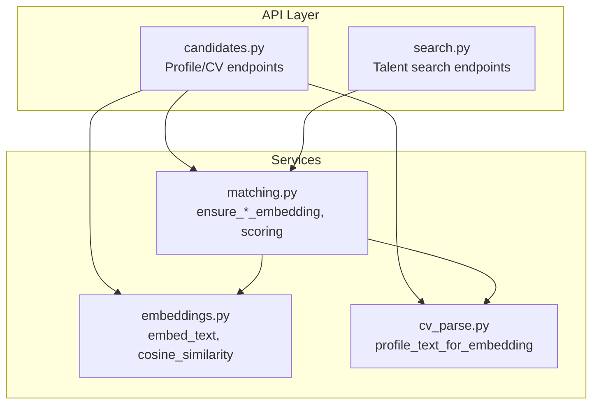
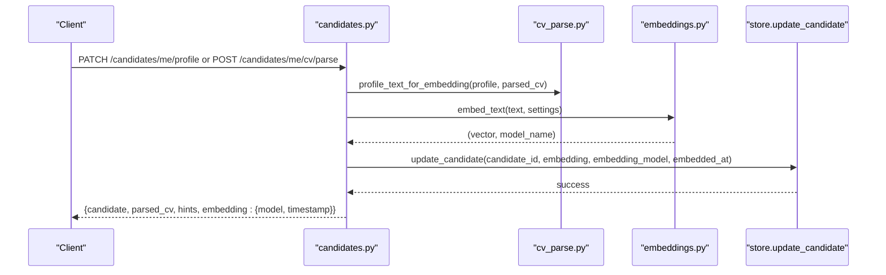
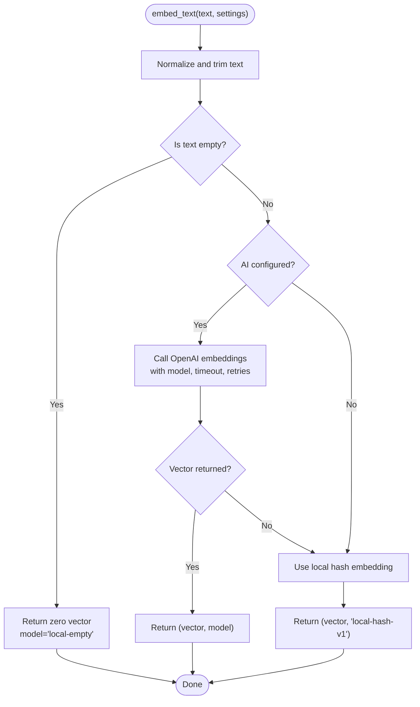
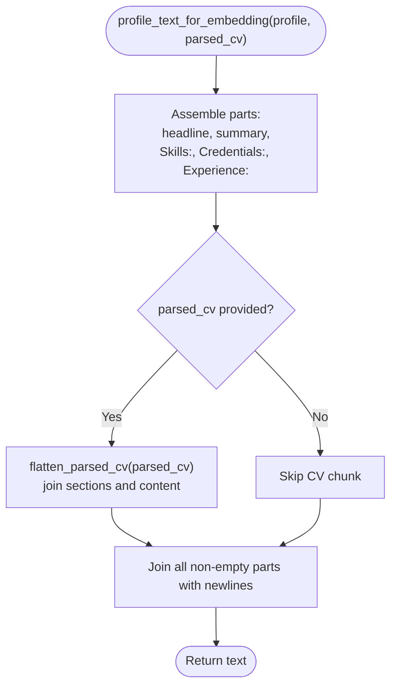
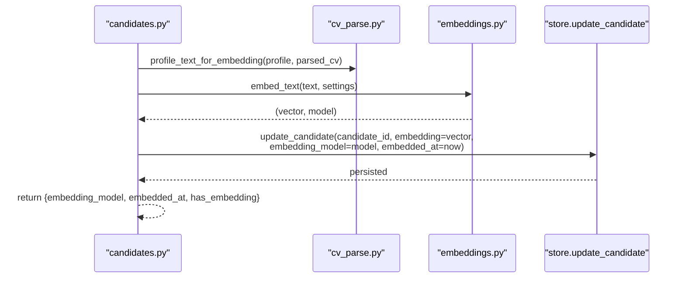
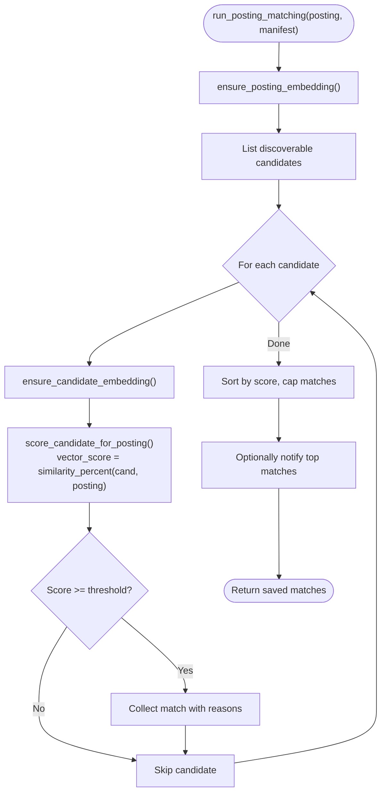
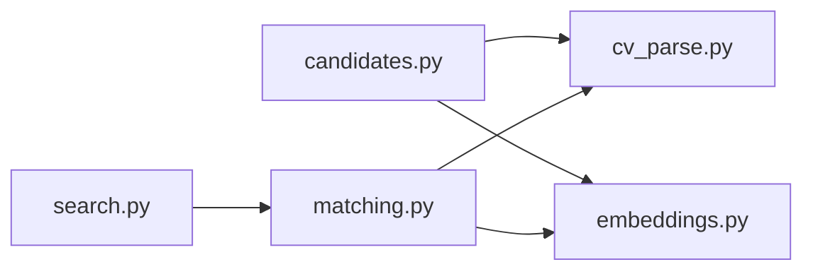

# Embedding Generation & Management

<cite>
**Referenced Files in This Document**
- [embeddings.py](file://Backend/app/services/embeddings.py)
- [cv_parse.py](file://Backend/app/services/cv_parse.py)
- [candidates.py](file://Backend/app/api/v1/candidates.py)
- [matching.py](file://Backend/app/services/matching.py)
- [search.py](file://Backend/app/api/v1/search.py)
</cite>

## Table of Contents
1. [Introduction](#introduction)
2. [Project Structure](#project-structure)
3. [Core Components](#core-components)
4. [Architecture Overview](#architecture-overview)
5. [Detailed Component Analysis](#detailed-component-analysis)
6. [Dependency Analysis](#dependency-analysis)
7. [Performance Considerations](#performance-considerations)
8. [Troubleshooting Guide](#troubleshooting-guide)
9. [Conclusion](#conclusion)

## Introduction
This document explains how candidate profile embeddings are generated and managed to enable intelligent matching and search across the platform. It covers:
- Automatic embedding generation when a candidate updates their profile or uploads/parses a CV
- The embed_text function that produces vector representations using an OpenAI model when configured, with a deterministic local fallback
- The profile_text_for_embedding utility that combines structured profile fields and parsed CV content into a single text for embedding
- Embedding metadata including model identifier and generation timestamp, and storage format
- The _refresh_candidate_embedding helper and its integration with database updates
- How embeddings power proactive candidate-job matching and talent discovery

## Project Structure
The embedding system spans services, API endpoints, and matching logic:
- Service layer: embeddings generation and similarity utilities
- Parsing layer: CV parsing and profile text assembly
- API layer: triggers for profile updates and CV parsing that refresh embeddings
- Matching layer: ensures embeddings exist and uses them for scoring candidates against postings
- Search layer: exposes talent discovery endpoints that rely on stored embeddings

**Diagram sources**
- [candidates.py:49-144](file://Backend/app/api/v1/candidates.py#L49-L144)
- [embeddings.py:21-75](file://Backend/app/services/embeddings.py#L21-L75)
- [cv_parse.py:44-76](file://Backend/app/services/cv_parse.py#L44-L76)
- [matching.py:55-112](file://Backend/app/services/matching.py#L55-L112)
- [search.py:29-51](file://Backend/app/api/v1/search.py#L29-L51)

**Section sources**
- [candidates.py:49-144](file://Backend/app/api/v1/candidates.py#L49-L144)
- [embeddings.py:21-75](file://Backend/app/services/embeddings.py#L21-L75)
- [cv_parse.py:44-76](file://Backend/app/services/cv_parse.py#L44-L76)
- [matching.py:55-112](file://Backend/app/services/matching.py#L55-L112)
- [search.py:29-51](file://Backend/app/api/v1/search.py#L29-L51)

## Core Components
- Embedding generation: embed_text returns a vector and model identifier; it prefers OpenAI embeddings when configured and falls back to a deterministic local hash embedding otherwise. Empty input yields a zero vector and a special model tag.
- Profile text assembly: profile_text_for_embedding merges headline, summary, skills, credentials, experiences, and optionally flattened parsed CV sections into a single string suitable for embedding.
- Candidate embedding refresh: _refresh_candidate_embedding computes the embedding from profile + parsed CV, then persists the vector along with model and timestamp via store.update_candidate.
- Posting embedding: ensure_posting_embedding creates vectors for job postings using posting_text_for_embedding and stores model/timestamp metadata.
- Matching and search: ensure_candidate_embedding guarantees a candidate vector exists before scoring; similarity_percent converts cosine similarity to a percentage used in match scoring; search endpoints expose results derived from stored embeddings.

**Section sources**
- [embeddings.py:21-75](file://Backend/app/services/embeddings.py#L21-L75)
- [cv_parse.py:44-76](file://Backend/app/services/cv_parse.py#L44-L76)
- [candidates.py:49-69](file://Backend/app/api/v1/candidates.py#L49-L69)
- [matching.py:55-112](file://Backend/app/services/matching.py#L55-L112)

## Architecture Overview
The system generates embeddings at data mutation points (profile update, CV parse/upload) and during matching runs. Vectors are stored as JSON float arrays, enabling portability across SQLite and Postgres. Postgres deployments can leverage pgvector for ANN queries.

**Diagram sources**
- [candidates.py:162-189](file://Backend/app/api/v1/candidates.py#L162-L189)
- [candidates.py:198-241](file://Backend/app/api/v1/candidates.py#L198-L241)
- [candidates.py:49-69](file://Backend/app/api/v1/candidates.py#L49-L69)
- [cv_parse.py:44-76](file://Backend/app/services/cv_parse.py#L44-L76)
- [embeddings.py:52-75](file://Backend/app/services/embeddings.py#L52-L75)

## Detailed Component Analysis

### Embedding Generation: embed_text
- Purpose: Convert text to a numeric vector and return the model identifier used.
- Behavior:
  - Normalizes empty input to a zero vector and returns a special model tag.
  - When AI is configured, calls OpenAI embeddings with a bounded input length and configurable timeout/retries.
  - On failure or when AI is not configured, falls back to a deterministic local hash-based embedding.
- Output: A list of floats and a string model name (e.g., OpenAI model id or "local-hash-v1").

**Diagram sources**
- [embeddings.py:52-75](file://Backend/app/services/embeddings.py#L52-L75)

**Section sources**
- [embeddings.py:52-75](file://Backend/app/services/embeddings.py#L52-L75)

### Profile Text Assembly: profile_text_for_embedding
- Purpose: Build a single, searchable text representation from a candidate’s profile and optional parsed CV.
- Inputs:
  - profile: dict containing headline, summary, skills, credentials, experiences
  - parsed_cv: optional structured CV result
- Behavior:
  - Concatenates key profile fields with labeled prefixes
  - If parsed_cv is present, flattens its sections into readable chunks and appends them
  - Returns a newline-separated string optimized for embedding models

**Diagram sources**
- [cv_parse.py:31-54](file://Backend/app/services/cv_parse.py#L31-L54)

**Section sources**
- [cv_parse.py:31-54](file://Backend/app/services/cv_parse.py#L31-L54)

### Candidate Embedding Refresh: _refresh_candidate_embedding
- Purpose: Compute and persist a fresh embedding whenever a candidate’s profile or CV changes.
- Flow:
  - Builds text via profile_text_for_embedding
  - Generates vector and model via embed_text
  - Persists embedding, embedding_model, and embedded_at via store.update_candidate
  - Returns metadata indicating model and timestamp

**Diagram sources**
- [candidates.py:49-69](file://Backend/app/api/v1/candidates.py#L49-L69)
- [cv_parse.py:44-54](file://Backend/app/services/cv_parse.py#L44-L54)
- [embeddings.py:52-75](file://Backend/app/services/embeddings.py#L52-L75)

**Section sources**
- [candidates.py:49-69](file://Backend/app/api/v1/candidates.py#L49-L69)

### Posting Embedding and Matching Integration
- ensure_posting_embedding:
  - Checks for existing posting embedding; if missing, builds text via posting_text_for_embedding and generates a vector
  - Stores embedding, model, and timestamp
- ensure_candidate_embedding:
  - Ensures a candidate vector exists by building text from profile and parsed CV, generating vector, and storing metadata
- score_candidate_for_posting:
  - Uses similarity_percent between candidate and posting vectors when available
  - Blends skill overlap and interview scores with configurable weights
  - Produces reasons explaining the match decision

**Diagram sources**
- [matching.py:55-112](file://Backend/app/services/matching.py#L55-L112)
- [matching.py:115-187](file://Backend/app/services/matching.py#L115-L187)
- [matching.py:190-287](file://Backend/app/services/matching.py#L190-L287)

**Section sources**
- [matching.py:55-112](file://Backend/app/services/matching.py#L55-L112)
- [matching.py:115-187](file://Backend/app/services/matching.py#L115-L187)
- [matching.py:190-287](file://Backend/app/services/matching.py#L190-L287)

### Search Integration
- Talent discovery endpoint delegates to store.search_talent, which leverages stored embeddings for consent-safe, tenant-scoped candidate retrieval.
- Workspace search endpoint similarly uses stored embeddings to return relevant postings and applications.

**Section sources**
- [search.py:16-51](file://Backend/app/api/v1/search.py#L16-L51)

## Dependency Analysis
- candidates.py depends on cv_parse.py for profile text assembly and on embeddings.py for vector generation. It also calls store.update_candidate to persist embeddings and metadata.
- matching.py depends on cv_parse.py for posting and candidate text assembly and on embeddings.py for vector computation and similarity calculation. It uses store functions to read/write embeddings and notifications.
- search.py depends on store functions that use stored embeddings to answer queries.

**Diagram sources**
- [candidates.py:49-144](file://Backend/app/api/v1/candidates.py#L49-L144)
- [matching.py:55-112](file://Backend/app/services/matching.py#L55-L112)
- [search.py:29-51](file://Backend/app/api/v1/search.py#L29-L51)

**Section sources**
- [candidates.py:49-144](file://Backend/app/api/v1/candidates.py#L49-L144)
- [matching.py:55-112](file://Backend/app/services/matching.py#L55-L112)
- [search.py:29-51](file://Backend/app/api/v1/search.py#L29-L51)

## Performance Considerations
- Input size limits:
  - Embedding generation truncates input to a safe maximum to avoid oversized payloads.
  - CV parsing caps section counts and content lengths to control memory usage.
- Fallback behavior:
  - Deterministic local embeddings ensure matching paths remain functional without external dependencies.
- Similarity computation:
  - Cosine similarity is computed efficiently over normalized vectors; similarity_percent rounds to one decimal place for display.
- Storage format:
  - Vectors are stored as JSON float arrays for cross-database compatibility; Postgres can additionally use pgvector for ANN queries.

[No sources needed since this section provides general guidance]

## Troubleshooting Guide
- Missing or stale embeddings:
  - ensure_candidate_embedding and ensure_posting_embedding regenerate vectors lazily when missing.
  - After profile updates or CV parsing, _refresh_candidate_embedding persists updated embeddings and timestamps.
- Empty or invalid text:
  - embed_text returns a zero vector and a special model tag for empty inputs; profile_text_for_embedding filters out empty parts to avoid degenerate vectors.
- AI service failures:
  - embed_text catches exceptions and falls back to local hashing; check configuration flags and timeouts if OpenAI embeddings are expected.
- Low similarity scores:
  - Verify that profile fields and parsed CV content are populated; short or sparse text may produce weak signals.
  - Skill overlap and interview scores can compensate when vector signals are weak.

**Section sources**
- [embeddings.py:52-75](file://Backend/app/services/embeddings.py#L52-L75)
- [cv_parse.py:44-54](file://Backend/app/services/cv_parse.py#L44-L54)
- [matching.py:86-112](file://Backend/app/services/matching.py#L86-L112)
- [candidates.py:49-69](file://Backend/app/api/v1/candidates.py#L49-L69)

## Conclusion
Candidate profile embeddings are automatically generated and refreshed whenever profiles change or CVs are parsed, ensuring up-to-date vector representations for matching and search. The system combines structured profile data and parsed CV content into searchable text, generates robust vectors with model metadata and timestamps, and integrates seamlessly into proactive matching and talent discovery workflows. This enables intelligent, explainable candidate-job matching across the platform while maintaining reliability through deterministic fallbacks and efficient similarity computations.