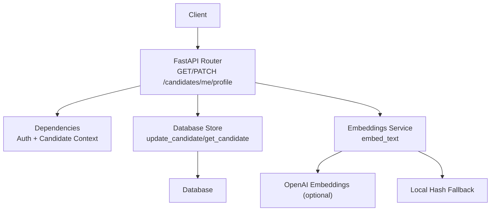
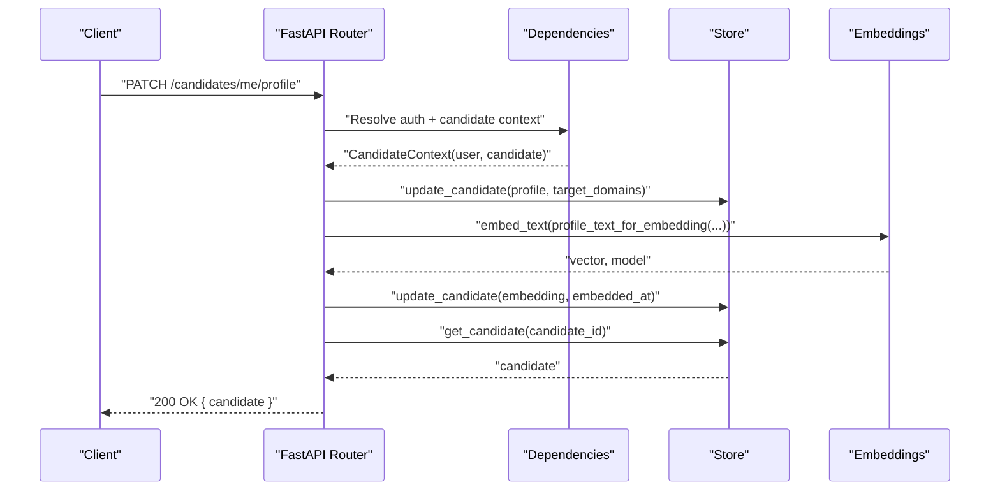
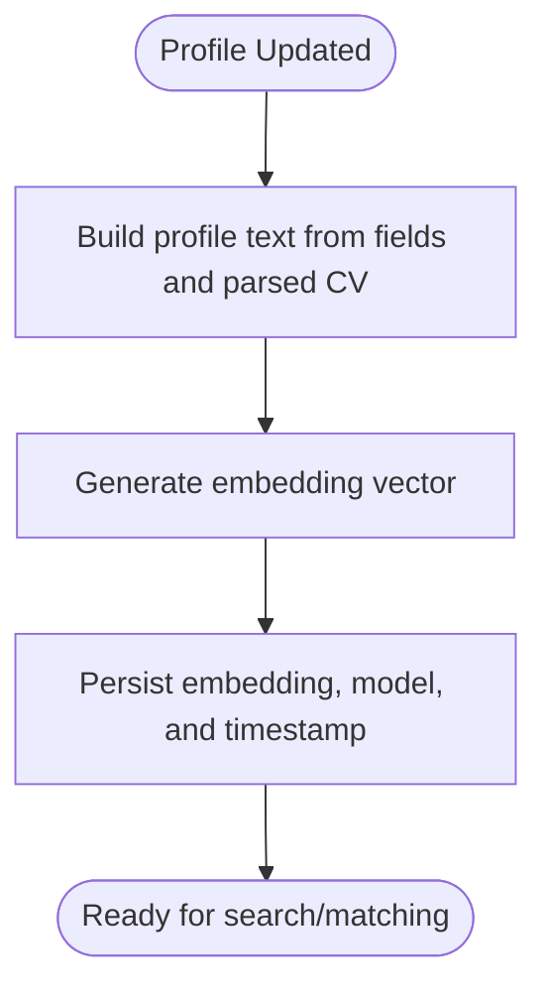
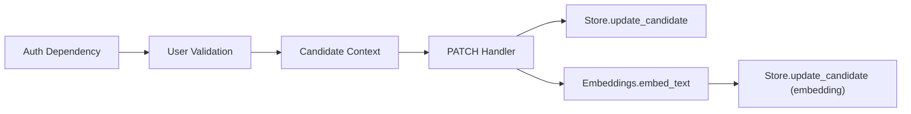

# Profile CRUD Operations

<cite>
**Referenced Files in This Document**
- [candidates.py](file://Backend/app/api/v1/candidates.py)
- [dependencies.py](file://Backend/app/api/dependencies.py)
- [embeddings.py](file://Backend/app/services/embeddings.py)
- [cv_parse.py](file://Backend/app/services/cv_parse.py)
- [errors.py](file://Backend/app/core/errors.py)
- [store.py](file://Backend/app/db/store.py)
</cite>

## Table of Contents
1. Introduction
2. Project Structure
3. Core Components
4. Architecture Overview
5. Detailed Component Analysis
6. Dependency Analysis
7. Performance Considerations
8. Troubleshooting Guide
9. Conclusion

## Introduction
This document provides detailed API documentation for candidate profile operations, focusing on:
- GET /candidates/me/profile to retrieve the current candidate’s profile
- PATCH /candidates/me/profile to update profile fields and automatically regenerate embeddings for search and matching

It includes request/response schemas, field validation rules, data types, error handling, authentication requirements, and practical examples of profile updates. It also explains how profile changes trigger automatic embedding regeneration using the configured AI or a deterministic local fallback.

## Project Structure
The candidate profile endpoints are implemented in the FastAPI router under the v1 API namespace. Authentication and authorization are enforced via dependencies that resolve the current user and candidate context. Profile persistence is handled through a database store module, while embeddings are generated by an embeddings service that can use OpenAI or a local hash-based vectorizer.

**Diagram sources**
- [candidates.py:147-189](file://Backend/app/api/v1/candidates.py#L147-L189)
- [dependencies.py:93-201](file://Backend/app/api/dependencies.py#L93-L201)
- [embeddings.py:52-75](file://Backend/app/services/embeddings.py#L52-L75)
- [store.py:1206-1215](file://Backend/app/db/store.py#L1206-L1215)

**Section sources**
- [candidates.py:147-189](file://Backend/app/api/v1/candidates.py#L147-L189)
- [dependencies.py:93-201](file://Backend/app/api/dependencies.py#L93-L201)
- [embeddings.py:52-75](file://Backend/app/services/embeddings.py#L52-L75)
- [store.py:1206-1215](file://Backend/app/db/store.py#L1206-L1215)

## Core Components
- GET /candidates/me/profile
  - Returns the authenticated candidate’s profile with metadata such as target domains, parsed CV, and embedding status.
- PATCH /candidates/me/profile
  - Updates selected profile fields and target domains, persists changes, regenerates embeddings, and returns the updated profile.

Authentication and context:
- Requires a valid Bearer JWT token or development identity header depending on environment.
- Ensures the caller is not an employer account when accessing candidate endpoints.

Validation:
- Pydantic model enforces field types and limits for all updatable fields.

Embedding regeneration:
- After updating the profile, the system builds a text representation from profile fields and any parsed CV, then generates a vector embedding stored alongside the candidate record.

**Section sources**
- [candidates.py:147-189](file://Backend/app/api/v1/candidates.py#L147-L189)
- [dependencies.py:49-87](file://Backend/app/api/dependencies.py#L49-L87)
- [dependencies.py:184-201](file://Backend/app/api/dependencies.py#L184-L201)
- [embeddings.py:52-75](file://Backend/app/services/embeddings.py#L52-L75)
- [cv_parse.py:44-54](file://Backend/app/services/cv_parse.py#L44-L54)

## Architecture Overview
The profile endpoints follow a clear flow:
1. The client sends a request with a Bearer token.
2. Dependencies decode the token, validate the user, and build a CandidateContext.
3. For GET, the endpoint reads the candidate and returns a normalized response body.
4. For PATCH, the endpoint merges provided fields into the existing profile, persists changes, regenerates embeddings, and returns the refreshed candidate.

**Diagram sources**
- [candidates.py:162-189](file://Backend/app/api/v1/candidates.py#L162-L189)
- [dependencies.py:93-201](file://Backend/app/api/dependencies.py#L93-L201)
- [embeddings.py:52-75](file://Backend/app/services/embeddings.py#L52-L75)
- [store.py:1206-1215](file://Backend/app/db/store.py#L1206-L1215)

## Detailed Component Analysis

### GET /candidates/me/profile
- Purpose: Retrieve the current candidate’s profile and related metadata.
- Authentication: Requires a valid Bearer token or development identity per environment.
- Response: Contains a candidate object with id, profile, consents, target_domains, updated_at, parsed_cv, embedding_model, embedded_at, and has_embedding.

Response schema highlights:
- candidate.id: string
- candidate.profile: object containing headline, summary, skills, credentials, experiences, availability
- candidate.consents: object mapping purposes to boolean consent flags
- candidate.target_domains: array of strings
- candidate.updated_at: ISO timestamp
- candidate.parsed_cv: object or null
- candidate.embedding_model: string or null
- candidate.embedded_at: ISO timestamp or null
- candidate.has_embedding: boolean

Example response payload structure:
{
  "candidate": {
    "id": "<string>",
    "profile": {
      "headline": "<string>",
      "summary": "<string>",
      "skills": ["<string>"],
      "credentials": ["<string>"],
      "experiences": ["<string>"],
      "availability": "<string>"
    },
    "consents": {
      "discovery": true,
      "application_processing": false
    },
    "target_domains": ["<string>"],
    "updated_at": "<ISO timestamp>",
    "parsed_cv": { ... } | null,
    "embedding_model": "<string>",
    "embedded_at": "<ISO timestamp>" | null,
    "has_embedding": true
  }
}

**Section sources**
- [candidates.py:147-149](file://Backend/app/api/v1/candidates.py#L147-L149)
- [candidates.py:34-46](file://Backend/app/api/v1/candidates.py#L34-L46)

### PATCH /candidates/me/profile
- Purpose: Update selected profile fields and target domains for the current candidate.
- Authentication: Same as GET; requires valid Bearer token or development identity.
- Request body: ProfileUpdateRequest with optional fields. Only provided fields are merged into the existing profile.
- Behavior:
  - Merges provided fields into the existing profile.
  - Persists profile and target_domains.
  - Regenerates embeddings based on the updated profile and any parsed CV.
  - Commits transaction and returns the refreshed candidate.

ProfileUpdateRequest schema:
- headline: string | null, max_length 200
- summary: string | null, max_length 4000
- skills: list<string> | null, max_length 50
- credentials: list<string> | null, max_length 25
- experiences: list<string> | null, max_length 25
- availability: string | null, max_length 100
- target_domains: list<string> | null, max_length 10

Field constraints and types:
- headline: short descriptive title for the candidate
- summary: longer narrative about the candidate
- skills: list of skill keywords
- credentials: list of certifications or credentials
- experiences: list of experience summaries
- availability: free-form availability description
- target_domains: list of domain interests

Example request payloads:
- Minimal update:
{
  "headline": "Full Stack Developer"
}
- Skills and availability update:
{
  "skills": ["Python", "React", "PostgreSQL"],
  "availability": "Immediate"
}
- Full profile update:
{
  "headline": "Senior Data Engineer",
  "summary": "Experienced data engineer with expertise in building scalable pipelines.",
  "skills": ["Spark", "Kafka", "SQL", "Airflow"],
  "credentials": ["AWS Certified Data Analytics", "Google Cloud Professional Data Engineer"],
  "experiences": ["Built real-time analytics platform", "Optimized ETL workflows"],
  "availability": "Available within two weeks",
  "target_domains": ["FinTech", "Healthcare"]
}

Example response payload structure:
{
  "candidate": {
    "id": "<string>",
    "profile": {
      "headline": "<string>",
      "summary": "<string>",
      "skills": ["<string>"],
      "credentials": ["<string>"],
      "experiences": ["<string>"],
      "availability": "<string>"
    },
    "consents": { ... },
    "target_domains": ["<string>"],
    "updated_at": "<ISO timestamp>",
    "parsed_cv": { ... } | null,
    "embedding_model": "<string>",
    "embedded_at": "<ISO timestamp>" | null,
    "has_embedding": true
  }
}

**Section sources**
- [candidates.py:152-159](file://Backend/app/api/v1/candidates.py#L152-L159)
- [candidates.py:162-189](file://Backend/app/api/v1/candidates.py#L162-L189)
- [candidates.py:34-46](file://Backend/app/api/v1/candidates.py#L34-L46)

### Automatic Embedding Regeneration
When profile fields change, the system rebuilds a text representation from:
- headline
- summary
- skills
- credentials
- experiences
- parsed CV content (if present)

Then it generates a vector embedding using:
- OpenAI embeddings if configured
- A deterministic local hash-based embedding otherwise

The resulting vector and metadata (model name, timestamp) are persisted with the candidate record.

**Diagram sources**
- [candidates.py:49-69](file://Backend/app/api/v1/candidates.py#L49-L69)
- [cv_parse.py:44-54](file://Backend/app/services/cv_parse.py#L44-L54)
- [embeddings.py:52-75](file://Backend/app/services/embeddings.py#L52-L75)

**Section sources**
- [candidates.py:49-69](file://Backend/app/api/v1/candidates.py#L49-L69)
- [cv_parse.py:44-54](file://Backend/app/services/cv_parse.py#L44-L54)
- [embeddings.py:52-75](file://Backend/app/services/embeddings.py#L52-L75)

## Dependency Analysis
Authentication and authorization:
- Bearer token decoding validates the access token and ensures the user is active.
- Development mode supports X-Development-Identity header for local testing.
- Candidate context prevents employer accounts from using candidate endpoints.

Data persistence:
- update_candidate writes profile and target_domains.
- get_candidate retrieves the latest candidate state after mutations.

Embedding integration:
- embed_text abstracts AI vs local embedding generation.
- profile_text_for_embedding composes the input text used for embedding.

**Diagram sources**
- [dependencies.py:49-87](file://Backend/app/api/dependencies.py#L49-L87)
- [dependencies.py:184-201](file://Backend/app/api/dependencies.py#L184-L201)
- [candidates.py:162-189](file://Backend/app/api/v1/candidates.py#L162-L189)
- [embeddings.py:52-75](file://Backend/app/services/embeddings.py#L52-L75)
- [store.py:1206-1215](file://Backend/app/db/store.py#L1206-L1215)

**Section sources**
- [dependencies.py:49-87](file://Backend/app/api/dependencies.py#L49-L87)
- [dependencies.py:184-201](file://Backend/app/api/dependencies.py#L184-L201)
- [candidates.py:162-189](file://Backend/app/api/v1/candidates.py#L162-L189)
- [embeddings.py:52-75](file://Backend/app/services/embeddings.py#L52-L75)
- [store.py:1206-1215](file://Backend/app/db/store.py#L1206-L1215)

## Performance Considerations
- Embedding generation may call external APIs; ensure timeouts and retries are appropriate.
- Local fallback avoids external dependencies and provides deterministic vectors for tests and offline environments.
- Limiting list sizes (skills, credentials, experiences, target_domains) helps control payload size and processing time.
- Avoid sending excessively large summary or parsed CV content to prevent long embedding calls.

[No sources needed since this section provides general guidance]

## Troubleshooting Guide
Common errors and their causes:
- Invalid token: Occurs when the Bearer token is missing, malformed, or belongs to an inactive user.
- Authentication required: No valid token or development identity provided.
- Employer account cannot be candidate: An employer-linked account attempted to access candidate endpoints.
- Request validation error: Fields exceed max_length or have invalid types.
- Internal server error: Unexpected exceptions during processing.

Error response format:
{
  "error": {
    "code": "<string>",
    "message": "<string>",
    "request_id": "<string>",
    "details": [
      {
        "location": ["<path>"],
        "type": "<validation type>",
        "message": "<description>"
      }
    ]
  }
}

Troubleshooting steps:
- Verify Authorization header contains a valid Bearer token.
- Ensure environment allows development identity headers if testing locally.
- Check field lengths against the ProfileUpdateRequest constraints.
- Inspect error details for specific validation failures.

**Section sources**
- [dependencies.py:49-87](file://Backend/app/api/dependencies.py#L49-L87)
- [dependencies.py:184-201](file://Backend/app/api/dependencies.py#L184-L201)
- [errors.py:60-112](file://Backend/app/core/errors.py#L60-L112)

## Conclusion
The candidate profile endpoints provide secure, validated, and efficient ways to read and update profiles. Updates automatically regenerate embeddings to keep search and matching capabilities current. By adhering to the documented schemas and constraints, clients can reliably integrate profile management into their workflows.

[No sources needed since this section summarizes without analyzing specific files]