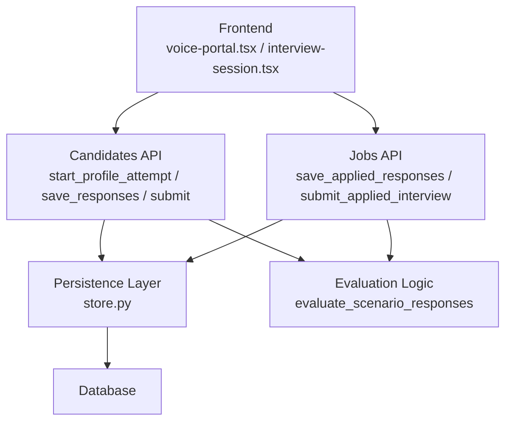
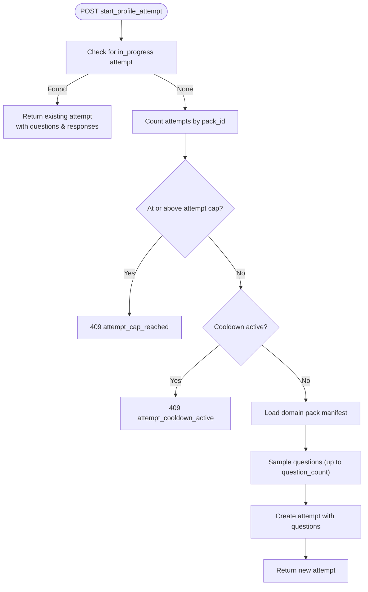
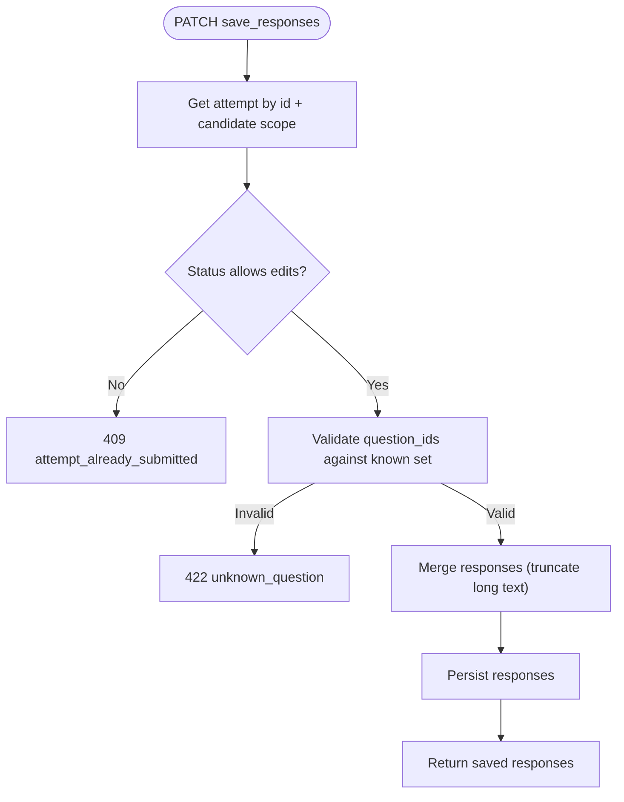
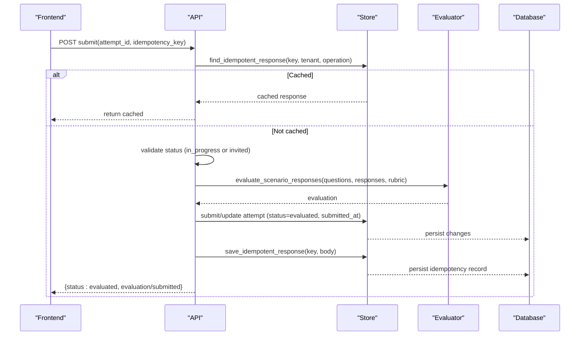
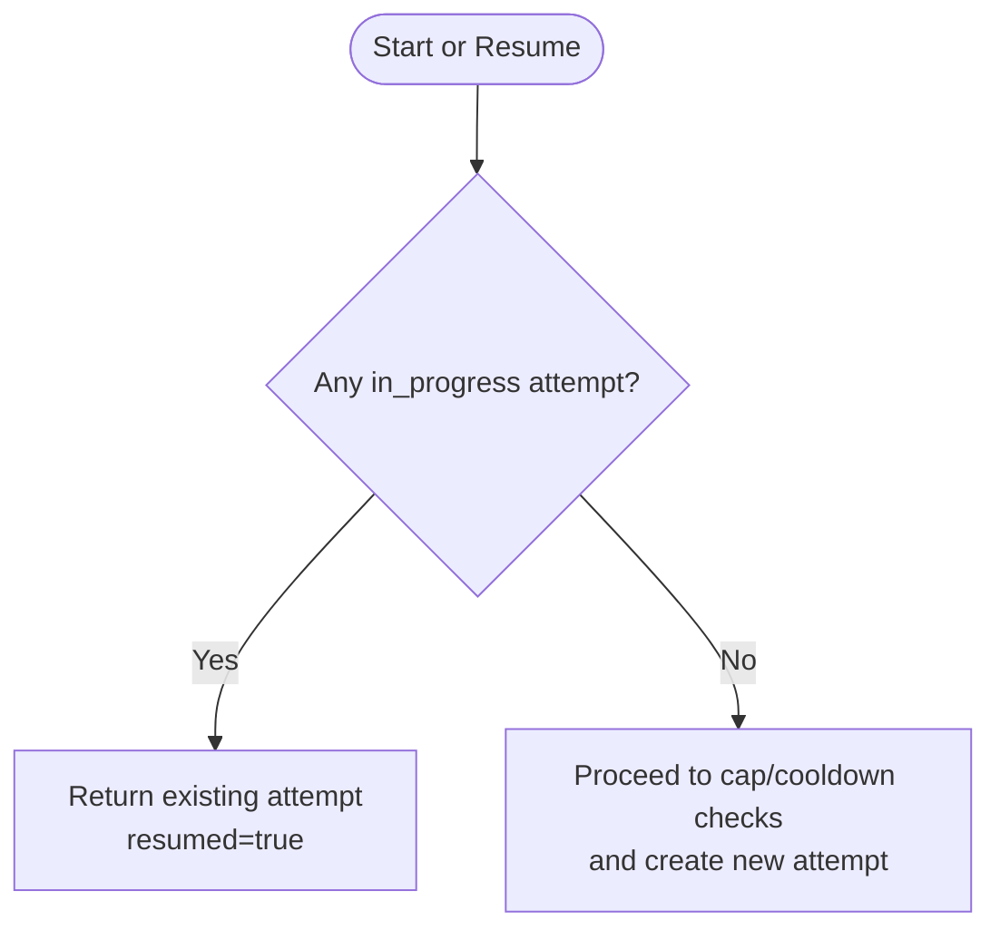
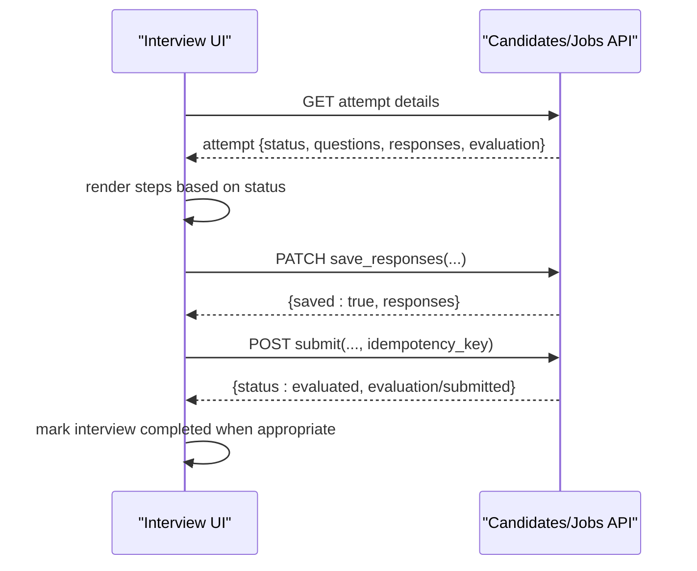
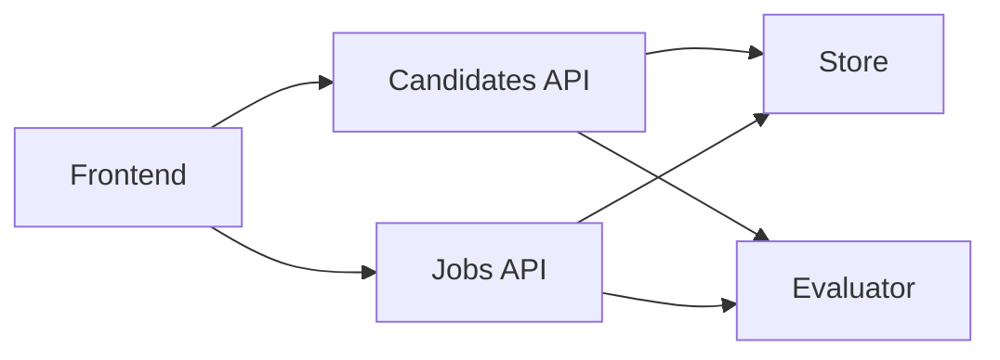

# Attempt Lifecycle Management

<cite>
**Referenced Files in This Document**
- [candidates.py](file://Backend/app/api/v1/candidates.py)
- [jobs.py](file://Backend/app/api/v1/jobs.py)
- [store.py](file://Backend/app/db/store.py)
- [database.py](file://Backend/app/api/models/database.py)
- [voice-portal.tsx](file://Frontend/components/interviews/voice/voice-portal.tsx)
- [interview-session.tsx](file://Frontend/components/candidate/interview-session.tsx)
- [api.ts](file://Frontend/lib/api.ts)
</cite>

## Table of Contents
1. Introduction
2. Project Structure
3. Core Components
4. Architecture Overview
5. Detailed Component Analysis
6. Dependency Analysis
7. Performance Considerations
8. Troubleshooting Guide
9. Conclusion

## Introduction
This document explains the complete lifecycle of interview attempts for candidates, covering:
- Starting a profile interview attempt and resuming incomplete sessions
- Saving responses incrementally and submitting attempts
- State transitions from in_progress to evaluated
- Cooldown and attempt cap enforcement per domain pack
- Question assignment from domain packs
- Idempotent submission and error handling for common edge cases

It also covers the applied interview flow where employers invite candidates to complete an interview tied to a job application.

## Project Structure
The attempt lifecycle spans candidate-facing API endpoints, persistence helpers, evaluation logic, and frontend components that drive user interactions.



**Diagram sources**
- [candidates.py:294-362](file://Backend/app/api/v1/candidates.py#L294-L362)
- [candidates.py:392-422](file://Backend/app/api/v1/candidates.py#L392-L422)
- [candidates.py:429-481](file://Backend/app/api/v1/candidates.py#L429-L481)
- [jobs.py:344-378](file://Backend/app/api/v1/jobs.py#L344-L378)
- [jobs.py:385-451](file://Backend/app/api/v1/jobs.py#L385-L451)
- [store.py:279-297](file://Backend/app/db/store.py#L279-L297)

**Section sources**
- [candidates.py:294-362](file://Backend/app/api/v1/candidates.py#L294-L362)
- [candidates.py:392-422](file://Backend/app/api/v1/candidates.py#L392-L422)
- [candidates.py:429-481](file://Backend/app/api/v1/candidates.py#L429-L481)
- [jobs.py:344-378](file://Backend/app/api/v1/jobs.py#L344-L378)
- [jobs.py:385-451](file://Backend/app/api/v1/jobs.py#L385-L451)
- [store.py:279-297](file://Backend/app/db/store.py#L279-L297)

## Core Components
- Candidate profile interview endpoints: start, resume, save responses, submit
- Applied interview endpoints: save responses (auto-start), submit
- Persistence layer: idempotency records, event emission, attempt storage
- Evaluation engine: scoring based on rubric dimensions
- Frontend session UI: loading state, completion detection, submission flow

Key responsibilities:
- Enforce cooldown and attempt caps before creating new attempts
- Resume open attempts instead of duplicating them
- Validate question IDs when saving responses
- Ensure idempotent submissions using client-provided keys
- Transition states consistently and emit events

**Section sources**
- [candidates.py:294-362](file://Backend/app/api/v1/candidates.py#L294-L362)
- [candidates.py:392-422](file://Backend/app/api/v1/candidates.py#L392-L422)
- [candidates.py:429-481](file://Backend/app/api/v1/candidates.py#L429-L481)
- [jobs.py:344-378](file://Backend/app/api/v1/jobs.py#L344-L378)
- [jobs.py:385-451](file://Backend/app/api/v1/jobs.py#L385-L451)
- [store.py:279-297](file://Backend/app/db/store.py#L279-L297)

## Architecture Overview
End-to-end flows for both profile interviews and applied interviews are shown below.

```mermaid
sequenceDiagram
participant FE as "Frontend"
participant CAPI as "Candidates API"
participant JAPI as "Jobs API"
participant ST as "Store"
participant EV as "Evaluator"
participant DB as "Database"
Note over FE,DB : Profile Interview Flow
FE->>CAPI : POST start_profile_attempt(pack_id)
CAPI->>ST : list_profile_attempts(candidate_id)
alt Open attempt exists
ST-->>CAPI : in_progress attempt
CAPI-->>FE : resume attempt with questions/responses
else No open attempt
CAPI->>ST : check attempt_cap and cooldown
CAPI->>ST : create_profile_attempt(questions from pack)
ST-->>DB : persist attempt
CAPI-->>FE : new attempt
end
FE->>CAPI : PATCH save_responses(attempt_id, responses)
CAPI->>ST : update responses (validate question ids)
ST-->>DB : persist responses
FE->>CAPI : POST submit(attempt_id, idempotency_key)
CAPI->>EV : evaluate_scenario_responses(questions, responses, rubric)
EV-->>CAPI : evaluation
CAPI->>ST : submit_profile_attempt(status=evaluated)
ST-->>DB : persist evaluation + timestamps
CAPI-->>FE : {status : evaluated, evaluation}
Note over FE,DB : Applied Interview Flow
FE->>JAPI : PATCH save_applied_responses(attempt_id, responses)
JAPI->>ST : update responses; if invited -> set in_progress + started_at
ST-->>DB : persist
FE->>JAPI : POST submit_applied_interview(attempt_id, idempotency_key)
JAPI->>EV : evaluate_scenario_responses(rubric from posting)
EV-->>JAPI : evaluation
JAPI->>ST : update status=evaluated + submitted_at
ST-->>DB : persist
JAPI-->>FE : {status : evaluated, submitted : true}
```

**Diagram sources**
- [candidates.py:294-362](file://Backend/app/api/v1/candidates.py#L294-L362)
- [candidates.py:392-422](file://Backend/app/api/v1/candidates.py#L392-L422)
- [candidates.py:429-481](file://Backend/app/api/v1/candidates.py#L429-L481)
- [jobs.py:344-378](file://Backend/app/api/v1/jobs.py#L344-L378)
- [jobs.py:385-451](file://Backend/app/api/v1/jobs.py#L385-L451)
- [store.py:279-297](file://Backend/app/db/store.py#L279-L297)

## Detailed Component Analysis

### Start Profile Attempt Endpoint Behavior
- Session recovery: If an in_progress attempt exists for the candidate, it is returned with existing questions and partial responses, marked as resumed.
- Attempt cap: For the requested pack_id, counts prior attempts; if at or above the configured cap, returns conflict with code attempt_cap_reached.
- Cooldown: If any previous attempt exists for the same pack_id, calculates remaining cooldown based on last started_at and settings.profile_interview_cooldown_hours; returns conflict with code attempt_cooldown_active while active.
- Question assignment: Loads domain pack manifest, selects up to configured question_count via random sampling, creates a new attempt with those questions, and persists it.



**Diagram sources**
- [candidates.py:294-362](file://Backend/app/api/v1/candidates.py#L294-L362)

**Section sources**
- [candidates.py:294-362](file://Backend/app/api/v1/candidates.py#L294-L362)

### Save Responses (Profile and Applied)
- Validates that the attempt belongs to the current candidate and is still editable (in_progress or invited).
- Validates each question_id against known questions for the attempt; unknown IDs return validation errors.
- Merges incoming responses into stored responses, truncating long answers to a safe limit.
- For applied interviews, first response save transitions status from invited to in_progress and sets started_at.



**Diagram sources**
- [candidates.py:392-422](file://Backend/app/api/v1/candidates.py#L392-L422)
- [jobs.py:344-378](file://Backend/app/api/v1/jobs.py#L344-L378)

**Section sources**
- [candidates.py:392-422](file://Backend/app/api/v1/candidates.py#L392-L422)
- [jobs.py:344-378](file://Backend/app/api/v1/jobs.py#L344-L378)

### Submit Attempt (Profile and Applied)
- Idempotency: Uses client-provided idempotency_key scoped to tenant and operation to prevent duplicate processing.
- State guard: Only in_progress (or invited for applied) attempts can be submitted; otherwise returns conflict.
- Evaluation: Calls evaluation service with pinned questions and rubric dimensions; for applied interviews, rubric may come from posting’s question pool.
- Finalization: Sets status to evaluated, records submitted_at, emits relevant events, and caches idempotent response.



**Diagram sources**
- [candidates.py:429-481](file://Backend/app/api/v1/candidates.py#L429-L481)
- [jobs.py:385-451](file://Backend/app/api/v1/jobs.py#L385-L451)
- [store.py:279-297](file://Backend/app/db/store.py#L279-L297)

**Section sources**
- [candidates.py:429-481](file://Backend/app/api/v1/candidates.py#L429-L481)
- [jobs.py:385-451](file://Backend/app/api/v1/jobs.py#L385-L451)
- [store.py:279-297](file://Backend/app/db/store.py#L279-L297)

### Resume Functionality and Session Recovery
- When starting a profile interview, if an in_progress attempt exists, it is resumed rather than creating a duplicate. The frontend receives the existing attempt ID, status, questions, and partial responses, enabling seamless continuation.
- For applied interviews, saving responses transitions an invited attempt to in_progress and records started_at, effectively resuming work.



**Diagram sources**
- [candidates.py:294-362](file://Backend/app/api/v1/candidates.py#L294-L362)
- [jobs.py:344-378](file://Backend/app/api/v1/jobs.py#L344-L378)

**Section sources**
- [candidates.py:294-362](file://Backend/app/api/v1/candidates.py#L294-L362)
- [jobs.py:344-378](file://Backend/app/api/v1/jobs.py#L344-L378)

### Frontend Integration and Completion Handling
- The voice portal polls or loads interview data and marks the interview completed when statuses indicate finality (e.g., COMPLETED, SUBMITTED, EVALUATED, ANALYZED).
- The interview session component tracks local responses, save states, submission progress, and displays evaluations once available. It uses idempotency keys for robust submission.



**Diagram sources**
- [voice-portal.tsx:86-116](file://Frontend/components/interviews/voice/voice-portal.tsx#L86-L116)
- [interview-session.tsx:13-37](file://Frontend/components/candidate/interview-session.tsx#L13-L37)
- [api.ts:194-198](file://Frontend/lib/api.ts#L194-L198)

**Section sources**
- [voice-portal.tsx:86-116](file://Frontend/components/interviews/voice/voice-portal.tsx#L86-L116)
- [interview-session.tsx:13-37](file://Frontend/components/candidate/interview-session.tsx#L13-L37)
- [api.ts:194-198](file://Frontend/lib/api.ts#L194-L198)

## Dependency Analysis
- Candidates API depends on store functions for listing, creating, updating, and submitting profile attempts; it also calls evaluation logic and emits events.
- Jobs API depends on store functions for applied attempts and emits APPLIED_INTERVIEW_SUBMITTED upon successful submission.
- Store provides idempotency utilities and event emission used across flows.
- Frontend relies on API clients and idempotency key generation to ensure reliable submissions.



**Diagram sources**
- [candidates.py:294-362](file://Backend/app/api/v1/candidates.py#L294-L362)
- [candidates.py:429-481](file://Backend/app/api/v1/candidates.py#L429-L481)
- [jobs.py:344-378](file://Backend/app/api/v1/jobs.py#L344-L378)
- [jobs.py:385-451](file://Backend/app/api/v1/jobs.py#L385-L451)
- [store.py:279-297](file://Backend/app/db/store.py#L279-L297)

**Section sources**
- [candidates.py:294-362](file://Backend/app/api/v1/candidates.py#L294-L362)
- [candidates.py:429-481](file://Backend/app/api/v1/candidates.py#L429-L481)
- [jobs.py:344-378](file://Backend/app/api/v1/jobs.py#L344-L378)
- [jobs.py:385-451](file://Backend/app/api/v1/jobs.py#L385-L451)
- [store.py:279-297](file://Backend/app/db/store.py#L279-L297)

## Performance Considerations
- Random sampling of questions limits payload size and keeps attempts consistent with configuration.
- Response truncation prevents oversized payloads during save operations.
- Idempotency records avoid redundant evaluations and database writes on retries.
- Event emission is lightweight and decoupled from core request paths.

[No sources needed since this section provides general guidance]

## Troubleshooting Guide
Common scenarios and how the system handles them:

- Duplicate attempts:
  - If an in_progress attempt exists for the candidate, start_profile_attempt resumes it instead of creating a duplicate.
  - Submitted attempts cannot be edited; save and submit endpoints enforce status checks and return conflicts.

- Expired or invalid tokens:
  - Authentication failures return specific codes such as token_expired or invalid_token, guiding clients to refresh credentials.

- Capacity limits:
  - attempt_cap_reached indicates the candidate has exhausted allowed attempts for a domain pack.
  - attempt_cooldown_active indicates a recent attempt within the cooldown window; clients should inform users when they can retake.

- Unknown questions:
  - Saving responses with unrecognized question_ids returns a validation error; ensure the client uses the exact question IDs provided by the attempt.

- Idempotency:
  - Repeated submit calls with the same idempotency_key return the original response without reprocessing.

- Not found:
  - Accessing attempts not owned by the candidate returns not_found.

**Section sources**
- [candidates.py:294-362](file://Backend/app/api/v1/candidates.py#L294-L362)
- [candidates.py:392-422](file://Backend/app/api/v1/candidates.py#L392-L422)
- [candidates.py:429-481](file://Backend/app/api/v1/candidates.py#L429-L481)
- [jobs.py:344-378](file://Backend/app/api/v1/jobs.py#L344-L378)
- [jobs.py:385-451](file://Backend/app/api/v1/jobs.py#L385-L451)
- [auth_tokens.py:46-64](file://Backend/app/services/auth_tokens.py#L46-L64)

## Conclusion
The attempt lifecycle ensures robust, user-friendly workflows for both profile and applied interviews. It enforces fairness through cooldowns and attempt caps, supports resilient session recovery, and guarantees consistent evaluation and state transitions. Idempotency and clear error codes help clients handle retries and edge cases gracefully, while the frontend provides intuitive feedback and completion handling.

[No sources needed since this section summarizes without analyzing specific files]