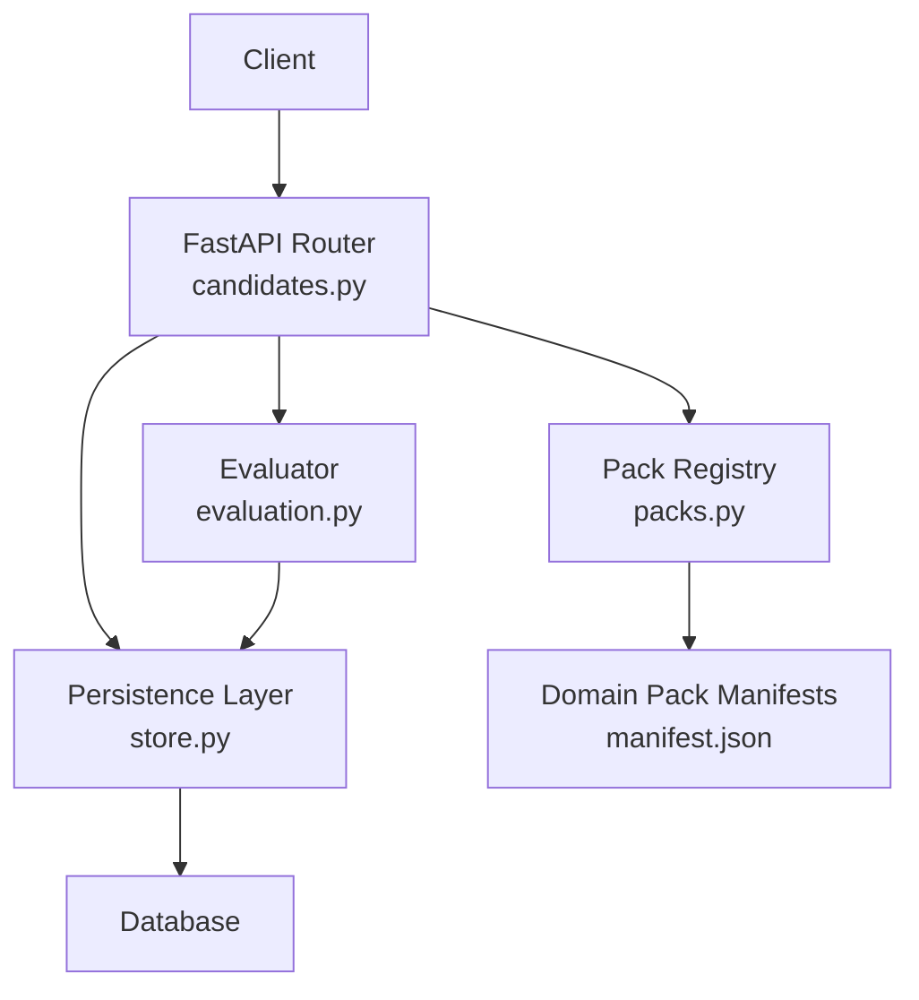
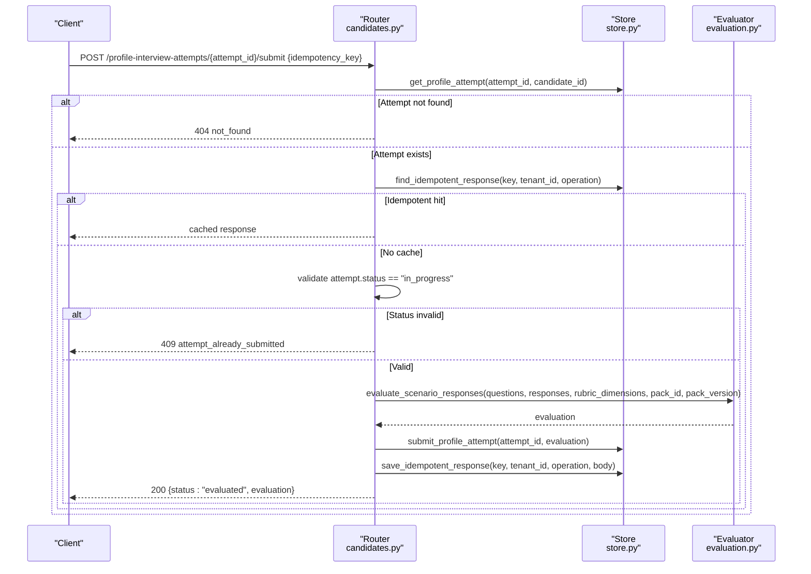
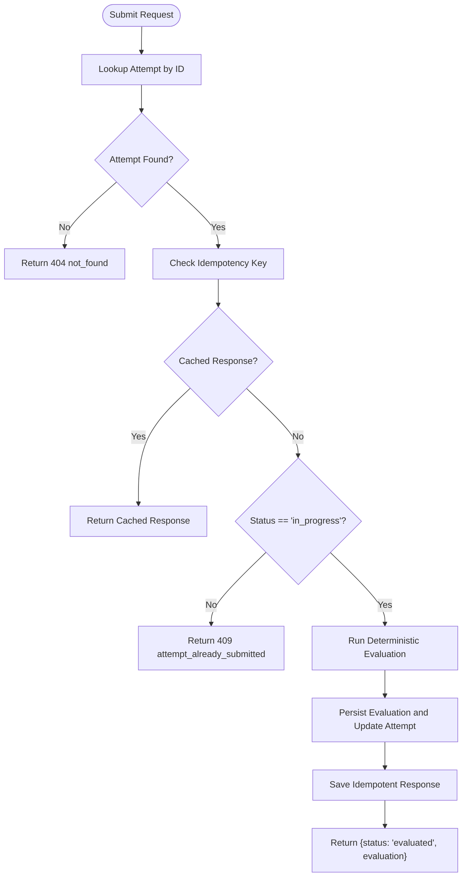
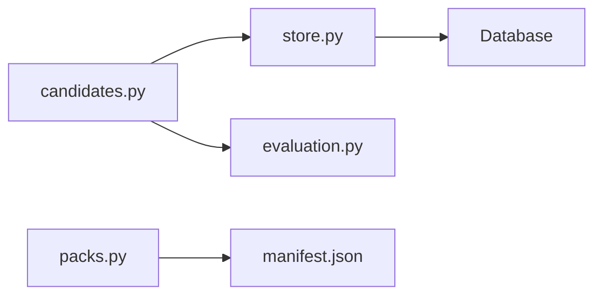

# Evaluation & Submission Processing

<cite>
**Referenced Files in This Document**
- [candidates.py](file://Backend/app/api/v1/candidates.py)
- [evaluation.py](file://Backend/app/domain/evaluation.py)
- [packs.py](file://Backend/app/services/packs.py)
- [store.py](file://Backend/app/db/store.py)
- [manifest.json (software-engineering)](file://domain-packs/software-engineering/manifest.json)
- [manifest.json (education)](file://domain-packs/education/manifest.json)
</cite>

## Table of Contents
1. [Introduction](#introduction)
2. [Project Structure](#project-structure)
3. [Core Components](#core-components)
4. [Architecture Overview](#architecture-overview)
5. [Detailed Component Analysis](#detailed-component-analysis)
6. [Dependency Analysis](#dependency-analysis)
7. [Performance Considerations](#performance-considerations)
8. [Troubleshooting Guide](#troubleshooting-guide)
9. [Conclusion](#conclusion)

## Introduction
This document explains how interview attempts are submitted and evaluated, focusing on the submit_profile_attempt endpoint, idempotent submission handling, status validation, automated evaluation triggering, and the evaluation rubric system. It also covers how domain pack configurations define questions and scoring criteria, and how evaluations are generated deterministically using stored snapshots to ensure reproducibility and auditability.

## Project Structure
The relevant backend components for profile interview submissions and evaluations are organized as follows:
- API endpoints for candidate self-service live in a versioned router module.
- The evaluation engine is implemented as an offline, deterministic scorer.
- Domain packs provide scenario-based questions and rubrics per domain.
- A registry validates and loads manifests from disk.
- Persistence helpers manage attempts, responses, evaluations, and idempotency records.

**Diagram sources**
- [candidates.py:429-481](file://Backend/app/api/v1/candidates.py#L429-L481)
- [evaluation.py:28-131](file://Backend/app/domain/evaluation.py#L28-L131)
- [packs.py:64-96](file://Backend/app/services/packs.py#L64-L96)
- [store.py:279-297](file://Backend/app/db/store.py#L279-L297)

**Section sources**
- [candidates.py:429-481](file://Backend/app/api/v1/candidates.py#L429-L481)
- [evaluation.py:28-131](file://Backend/app/domain/evaluation.py#L28-L131)
- [packs.py:64-96](file://Backend/app/services/packs.py#L64-L96)
- [store.py:279-297](file://Backend/app/db/store.py#L279-L297)

## Core Components
- Profile attempt submission endpoint:
  - Validates ownership and attempt state.
  - Enforces idempotency via a client-provided key.
  - Triggers deterministic evaluation against the snapshot of questions and rubric dimensions.
  - Persists evaluation and caches the response for duplicate requests.
- Deterministic evaluator:
  - Scores coverage of expected concepts, structure, and depth.
  - Produces dimension scores for structure, reasoning, and domain correctness.
  - Returns strengths, gaps, and overall score with human decision flag.
- Domain pack registry:
  - Loads and validates manifest files containing questions, rubrics, and metadata.
  - Ensures required fields and schema compliance before use.
- Persistence layer:
  - Stores attempts, responses, evaluations, and idempotency records.
  - Provides atomic operations within transactions.

**Section sources**
- [candidates.py:429-481](file://Backend/app/api/v1/candidates.py#L429-L481)
- [evaluation.py:28-131](file://Backend/app/domain/evaluation.py#L28-L131)
- [packs.py:34-96](file://Backend/app/services/packs.py#L34-L96)
- [store.py:279-297](file://Backend/app/db/store.py#L279-L297)

## Architecture Overview
The end-to-end flow for submitting a profile interview attempt:

**Diagram sources**
- [candidates.py:429-481](file://Backend/app/api/v1/candidates.py#L429-L481)
- [store.py:279-297](file://Backend/app/db/store.py#L279-L297)
- [evaluation.py:28-131](file://Backend/app/domain/evaluation.py#L28-L131)

## Detailed Component Analysis

### Submit Profile Attempt Endpoint
Responsibilities:
- Ownership verification by candidate context.
- Idempotency check using a unique key scoped to tenant and operation.
- Status validation to allow only in-progress attempts.
- Automated evaluation using the stored question snapshot and rubric dimensions.
- Persisting evaluation and caching the response for subsequent identical requests.

Key behaviors:
- If the same idempotency key is used again, the original response is returned without re-evaluation.
- If the attempt is already submitted or missing, appropriate errors are raised.
- The evaluation uses the exact questions and pack identifiers recorded when the attempt started, ensuring reproducibility.

Error handling:
- 404 if the attempt does not exist.
- 409 if the attempt is already submitted or not in progress.
- Validation errors for malformed idempotency keys handled by request model constraints.

Idempotency mechanism:
- Uses a dedicated table to store responses keyed by idempotency_key, tenant_id, and operation.
- Insert with conflict resolution ensures duplicates do not overwrite existing results.

**Section sources**
- [candidates.py:429-481](file://Backend/app/api/v1/candidates.py#L429-L481)
- [store.py:279-297](file://Backend/app/db/store.py#L279-L297)

### Deterministic Evaluation Engine
Scoring logic:
- Concept coverage: checks whether expected concepts appear in the candidate’s response; provides evidence snippets.
- Structure heuristic: estimates organization based on sentence count and length thresholds.
- Depth heuristic: estimates answer depth based on word count.
- Weighted composite score per question combining coverage, structure, and depth.
- Overall score computed as average across questions.

Rubric dimensions:
- Structure: derived from structural heuristics.
- Reasoning: falls back to overall score when not explicitly computed.
- Domain correctness: derived from concept coverage ratio.

Outputs:
- Per-question breakdown with covered/missing concepts, word count, and score.
- Strengths and gaps aggregated by competency.
- Flags indicating that human decision is required.

Complexity considerations:
- Linear in number of questions and sentences; efficient for typical interview sizes.
- No external dependencies; runs offline and deterministically.

**Section sources**
- [evaluation.py:28-131](file://Backend/app/domain/evaluation.py#L28-L131)

### Domain Pack Configuration and Rubric System
Manifest contents:
- Questions with prompts, competencies, and expected concepts.
- Evaluation rubric defining dimensions like structure, reasoning, and domain correctness.
- Metadata such as pack_id, pack_version, display_name, ontology, and matching weights.

Registry behavior:
- Validates required keys and field types.
- Enforces semantic versioning for pack versions.
- Ensures each section has non-empty question lists and required fields.
- Loads manifests safely and raises structured errors for invalid JSON or missing packs.

Examples:
- Software engineering pack includes scenario-based questions targeting incident response, API design, system design, collaboration, observability, and architecture judgment.
- Education pack includes scenario-based questions covering instructional design, curriculum design, academic integrity, student engagement, inclusive teaching, and continuous improvement.

**Section sources**
- [packs.py:34-96](file://Backend/app/services/packs.py#L34-L96)
- [manifest.json (software-engineering):1-140](file://domain-packs/software-engineering/manifest.json#L1-L140)
- [manifest.json (education):1-143](file://domain-packs/education/manifest.json#L1-L143)

### Idempotent Submission Mechanism
How it works:
- Client supplies a unique idempotency_key per intended submission.
- On first call, the server evaluates, persists, and stores the response keyed by idempotency_key, tenant_id, and operation.
- Subsequent calls with the same key return the cached response immediately, preventing duplicate evaluations and ensuring data consistency.

Data consistency guarantees:
- Idempotency record insertion uses conflict resolution to avoid overwriting.
- All mutations (submission, evaluation storage, idempotency record) occur within a transaction boundary managed by the caller.

Failure modes:
- If the attempt is not found or already submitted, the endpoint returns an error without creating idempotency records.
- Invalid idempotency keys are rejected by request model validation.

**Section sources**
- [store.py:279-297](file://Backend/app/db/store.py#L279-L297)
- [candidates.py:429-481](file://Backend/app/api/v1/candidates.py#L429-L481)

### Example Evaluation Results and Scoring Criteria
Evaluation result shape:
- evaluator_version, pack_id, pack_version, rubric_dimensions.
- overall_score, dimension_scores (structure, reasoning, domain_correctness).
- question_results with per-question scores, covered_concepts, missing_concepts, and word_count.
- strengths and gaps aggregated by competency.
- answered_questions and total_questions counts.
- requires_human_decision flag set to true.

Scoring criteria highlights:
- Coverage weight dominates per-question scoring.
- Structure and depth contribute secondary weights.
- Dimension scores map heuristics to rubric labels for consistent reporting.

Note: These examples describe the output structure and scoring approach; actual values depend on input questions and responses.

**Section sources**
- [evaluation.py:28-131](file://Backend/app/domain/evaluation.py#L28-L131)

### Submission Workflow Summary

**Diagram sources**
- [candidates.py:429-481](file://Backend/app/api/v1/candidates.py#L429-L481)
- [store.py:279-297](file://Backend/app/db/store.py#L279-L297)
- [evaluation.py:28-131](file://Backend/app/domain/evaluation.py#L28-L131)

## Dependency Analysis
Component relationships:
- candidates.py depends on store.py for persistence and evaluation.py for scoring.
- evaluation.py is independent and deterministic, relying only on inputs.
- packs.py validates and loads manifests consumed elsewhere in the system; the submit endpoint uses the attempt’s stored pack identifiers to pin evaluation context.

Coupling and cohesion:
- High cohesion within evaluation.py (single responsibility: scoring).
- Moderate coupling between candidates.py and store.py (data access).
- Low coupling between evaluator and persistence (no direct dependency).

External dependencies:
- None for evaluation; fully offline.
- Database interactions encapsulated in store.py.

Potential circular dependencies:
- None observed among these modules.

Integration points:
- Domain pack registry ensures manifests are valid before activation or consumption.
- Idempotency table prevents duplicate side effects.

**Diagram sources**
- [candidates.py:429-481](file://Backend/app/api/v1/candidates.py#L429-L481)
- [store.py:279-297](file://Backend/app/db/store.py#L279-L297)
- [packs.py:64-96](file://Backend/app/services/packs.py#L64-L96)

**Section sources**
- [candidates.py:429-481](file://Backend/app/api/v1/candidates.py#L429-L481)
- [store.py:279-297](file://Backend/app/db/store.py#L279-L297)
- [packs.py:64-96](file://Backend/app/services/packs.py#L64-L96)

## Performance Considerations
- Evaluation is deterministic and lightweight; complexity scales linearly with question count and response length.
- Idempotency lookup avoids redundant work and reduces database writes on retries.
- Avoid large payloads; responses are capped during saving to prevent excessive storage usage.
- Batch operations are not used here; keep transactions small to reduce lock contention.

[No sources needed since this section provides general guidance]

## Troubleshooting Guide
Common issues and resolutions:
- Attempt not found:
  - Ensure the attempt_id belongs to the current candidate and exists.
  - Check listing endpoints to verify attempts.
- Attempt already submitted:
  - Only in-progress attempts can be submitted; resume or start a new attempt if necessary.
- Unknown question during response saving:
  - Validate question IDs against the attempt’s question list before sending updates.
- Invalid domain pack:
  - Manifest validation errors indicate missing keys or incorrect formats; fix the manifest and reload.
- Idempotency conflicts:
  - Reuse the same idempotency_key for retries; the server will return the original response.

Error codes and messages:
- 404 not_found for missing attempts.
- 409 attempt_already_submitted for invalid state transitions.
- 422 unknown_question for invalid question IDs.
- 422 invalid_domain_pack for malformed manifests.

**Section sources**
- [candidates.py:392-422](file://Backend/app/api/v1/candidates.py#L392-L422)
- [candidates.py:429-481](file://Backend/app/api/v1/candidates.py#L429-L481)
- [packs.py:34-96](file://Backend/app/services/packs.py#L34-L96)

## Conclusion
The profile interview submission pipeline combines robust idempotency, strict status validation, and deterministic evaluation to ensure reliable, auditable outcomes. Domain packs define scenario-based questions and rubrics, while the evaluator produces structured scores and insights. The idempotent submission mechanism prevents duplicate processing and maintains data consistency, making the system resilient to network retries and client errors.

[No sources needed since this section summarizes without analyzing specific files]