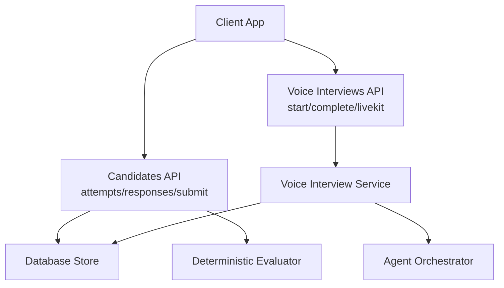
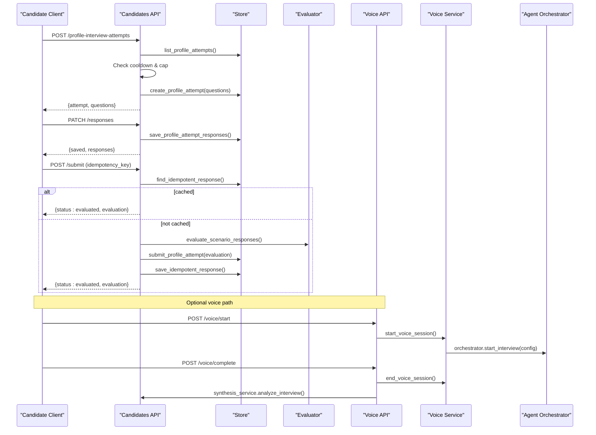
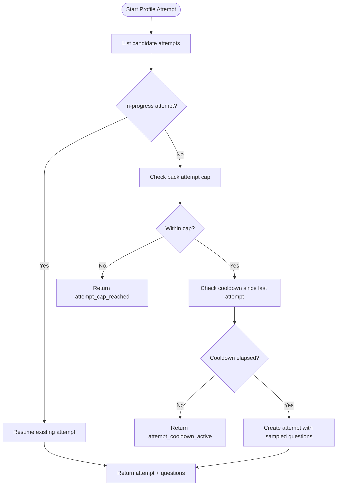
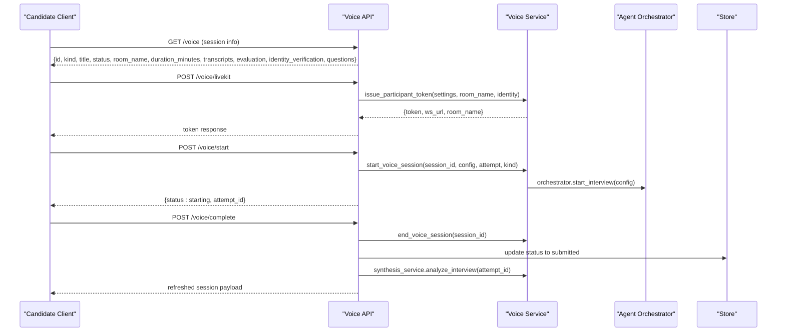
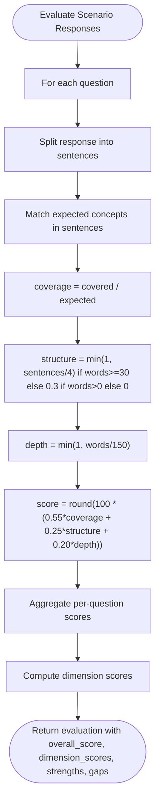
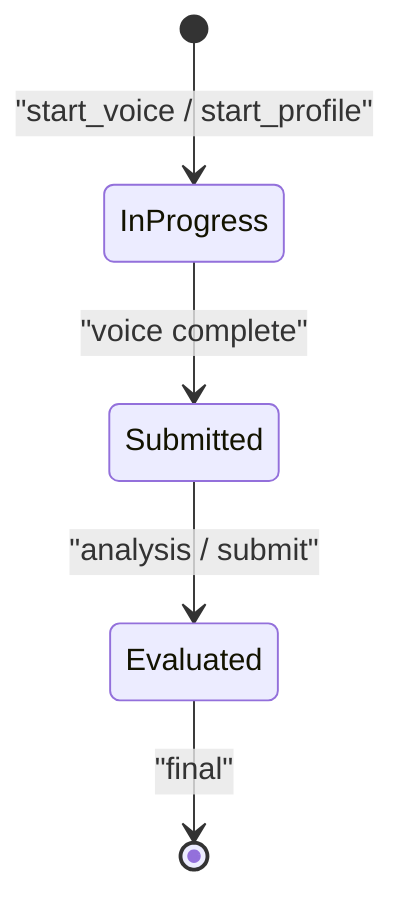
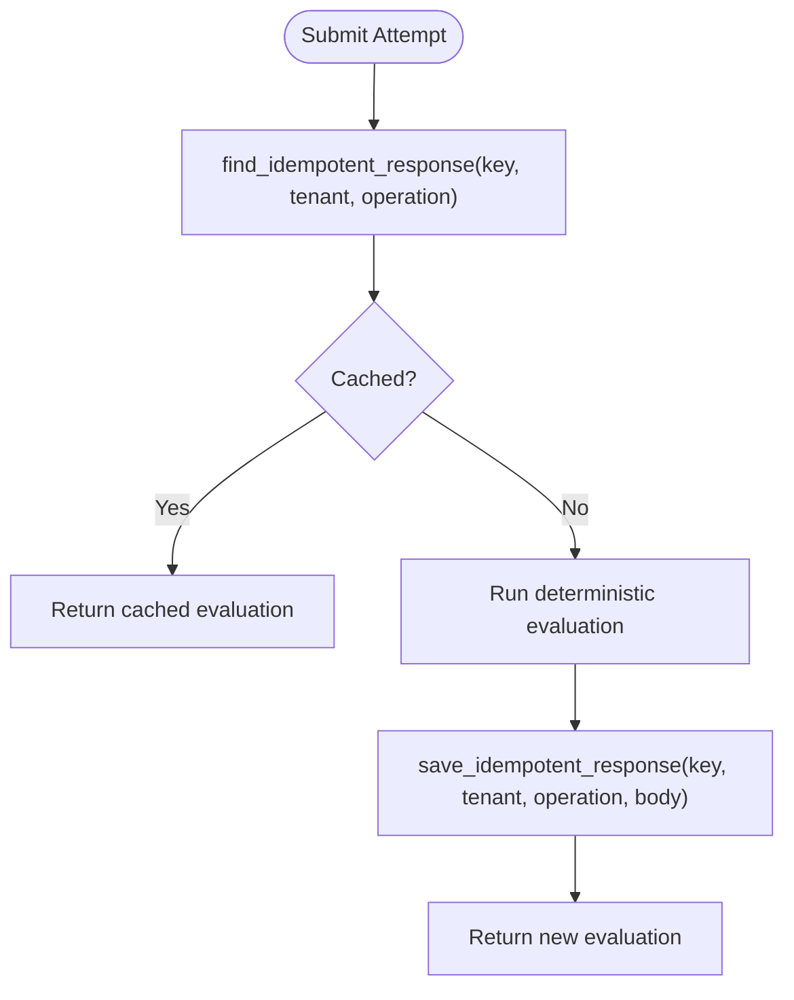
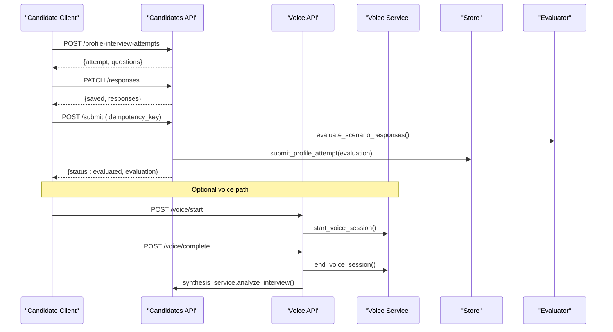
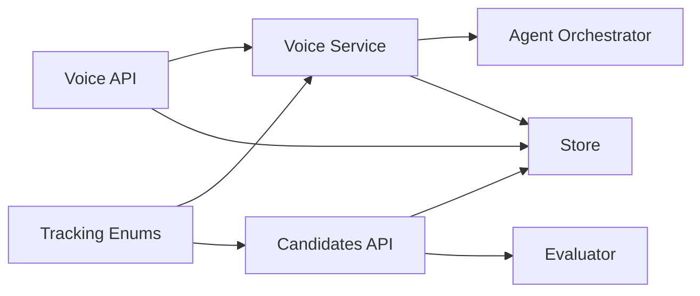

# Interview Attempts & Submissions

<cite>
**Referenced Files in This Document**
- [candidates.py](file://Backend/app/api/v1/candidates.py)
- [voice_interviews.py](file://Backend/app/api/v1/voice_interviews.py)
- [voice_interview.py](file://Backend/app/services/voice_interview.py)
- [evaluation.py](file://Backend/app/domain/evaluation.py)
- [store.py](file://Backend/app/db/store.py)
- [tracking.py](file://Backend/app/api/models/choices/tracking.py)
- [interview.py](file://Backend/app/api/models/interview.py)
</cite>

## Table of Contents
1. [Introduction](#introduction)
2. [Project Structure](#project-structure)
3. [Core Components](#core-components)
4. [Architecture Overview](#architecture-overview)
5. [Detailed Component Analysis](#detailed-component-analysis)
6. [Dependency Analysis](#dependency-analysis)
7. [Performance Considerations](#performance-considerations)
8. [Troubleshooting Guide](#troubleshooting-guide)
9. [Conclusion](#conclusion)

## Introduction
This document provides detailed API documentation for the interview attempt lifecycle, covering profile and job-interview attempts. It explains how attempts are created, questions are assigned, responses are saved, and submissions are processed with idempotency guarantees. It also documents state transitions from in_progress to evaluated, evaluation rubrics and scoring, and typical end-to-end workflows including voice-based interviews and automated evaluation.

## Project Structure
The interview attempt system spans FastAPI endpoints, a voice interview service, domain evaluation logic, and database store helpers:
- Candidate-facing endpoints manage attempts, responses, and submissions.
- Voice endpoints orchestrate LiveKit sessions and agent-driven interviews.
- The evaluation module computes deterministic scores based on question concepts and response structure.
- Store functions persist attempts, responses, evaluations, and idempotency records.

**Diagram sources**
- [candidates.py:294-481](file://Backend/app/api/v1/candidates.py#L294-L481)
- [voice_interviews.py:177-384](file://Backend/app/api/v1/voice_interviews.py#L177-L384)
- [voice_interview.py:53-151](file://Backend/app/services/voice_interview.py#L53-L151)
- [evaluation.py:28-131](file://Backend/app/domain/evaluation.py#L28-L131)
- [store.py:279-297](file://Backend/app/db/store.py#L279-L297)

**Section sources**
- [candidates.py:268-481](file://Backend/app/api/v1/candidates.py#L268-L481)
- [voice_interviews.py:177-384](file://Backend/app/api/v1/voice_interviews.py#L177-L384)
- [voice_interview.py:53-151](file://Backend/app/services/voice_interview.py#L53-L151)
- [evaluation.py:28-131](file://Backend/app/domain/evaluation.py#L28-L131)
- [store.py:279-297](file://Backend/app/db/store.py#L279-L297)

## Core Components
- Attempt creation and lifecycle:
  - Start a profile interview attempt with pack-scoped cooldown and cap enforcement.
  - Resume an existing in_progress attempt if one exists.
  - Retrieve attempt details including questions and responses.
- Response saving:
  - Save partial or final responses against known question IDs with length limits.
  - Prevent updates once an attempt is submitted.
- Submission and evaluation:
  - Submit with an idempotency key to ensure safe retries.
  - Evaluate using deterministic scoring based on expected concepts, structure, and depth.
  - Persist evaluation and transition status to evaluated.
- Voice interview integration:
  - Start voice session, issue LiveKit tokens, complete session, and trigger analysis.
  - Identity verification via live image comparison against profile photo.

**Section sources**
- [candidates.py:294-481](file://Backend/app/api/v1/candidates.py#L294-L481)
- [voice_interviews.py:177-384](file://Backend/app/api/v1/voice_interviews.py#L177-L384)
- [voice_interview.py:189-251](file://Backend/app/services/voice_interview.py#L189-L251)
- [evaluation.py:28-131](file://Backend/app/domain/evaluation.py#L28-L131)
- [store.py:279-297](file://Backend/app/db/store.py#L279-L297)

## Architecture Overview
End-to-end flow for a profile interview attempt:
1. Create or resume attempt (with cooldown and cap checks).
2. Fetch questions scoped to the selected domain pack.
3. Collect responses incrementally.
4. Submit with idempotency key; evaluate deterministically.
5. Persist evaluation and return evaluated result.
6. Optional: run voice interview to collect spoken responses and transcripts, then analyze.

**Diagram sources**
- [candidates.py:294-481](file://Backend/app/api/v1/candidates.py#L294-L481)
- [voice_interviews.py:204-255](file://Backend/app/api/v1/voice_interviews.py#L204-L255)
- [voice_interview.py:189-251](file://Backend/app/services/voice_interview.py#L189-L251)
- [evaluation.py:28-131](file://Backend/app/domain/evaluation.py#L28-L131)
- [store.py:279-297](file://Backend/app/db/store.py#L279-L297)

## Detailed Component Analysis

### Profile Interview Attempts API
- Start attempt:
  - Enforces per-pack attempt caps and cooldown windows.
  - Resumes any existing in_progress attempt instead of creating duplicates.
  - Returns public questions (strips grading keys).
- Get attempt:
  - Returns attempt metadata, questions, responses, and evaluation if present.
- Save responses:
  - Validates question IDs against the attempt’s question set.
  - Caps response text length and merges with existing responses.
  - Disallows updates after submission.
- Submit attempt:
  - Idempotency key prevents duplicate processing.
  - Evaluates using deterministic rules and persists evaluation.
  - Transitions status to evaluated and returns evaluation payload.

**Diagram sources**
- [candidates.py:294-362](file://Backend/app/api/v1/candidates.py#L294-L362)

**Section sources**
- [candidates.py:294-481](file://Backend/app/api/v1/candidates.py#L294-L481)

### Voice Interview Endpoints
- Session retrieval:
  - Loads attempt and builds session payload including questions and evaluation.
- LiveKit token issuance:
  - Ensures voice and AI configuration; issues short-lived participant tokens.
- Start session:
  - Validates attempt status; sets room name; marks in_progress; starts agent-driven conversation.
- Complete session:
  - Ends voice session; marks submitted; triggers analysis; returns refreshed attempt.
- Identity check:
  - Accepts live image data URL; compares against stored avatar; persists verdict.

**Diagram sources**
- [voice_interviews.py:177-255](file://Backend/app/api/v1/voice_interviews.py#L177-L255)
- [voice_interviews.py:290-384](file://Backend/app/api/v1/voice_interviews.py#L290-L384)
- [voice_interview.py:189-251](file://Backend/app/services/voice_interview.py#L189-L251)

**Section sources**
- [voice_interviews.py:140-255](file://Backend/app/api/v1/voice_interviews.py#L140-L255)
- [voice_interviews.py:290-384](file://Backend/app/api/v1/voice_interviews.py#L290-L384)
- [voice_interview.py:53-151](file://Backend/app/services/voice_interview.py#L53-L151)

### Deterministic Evaluation Rubric and Scoring
- Inputs:
  - Questions with expected concepts and competencies.
  - Responses keyed by question ID.
  - Rubric dimensions: structure, reasoning, domain_correctness.
- Scoring logic:
  - Coverage: ratio of matched expected concepts found in response sentences.
  - Structure: heuristic based on sentence count and minimum word threshold.
  - Depth: normalized by word count.
  - Weighted combination yields per-question score.
- Aggregation:
  - Overall score averages per-question scores.
  - Dimension scores computed from coverage, structure, and overall metrics.
  - Strengths and gaps derived from thresholds.
- Outputs:
  - Versioned evaluation including evaluator version, pack identifiers, dimension scores, strengths/gaps, and counts.

**Diagram sources**
- [evaluation.py:28-131](file://Backend/app/domain/evaluation.py#L28-L131)

**Section sources**
- [evaluation.py:28-131](file://Backend/app/domain/evaluation.py#L28-L131)

### State Transitions and Status Model
- Attempt statuses:
  - in_progress: active session or awaiting completion.
  - submitted: voice session completed; analysis may be pending.
  - evaluated: deterministic evaluation persisted; ready for human review.
- Voice session statuses:
  - Uses tracking enums for PENDING, IN_PROGRESS, COMPLETED, ANALYZED (evaluated), FAILED.
- Transitions:
  - Start voice: in_progress -> in_progress (agent active).
  - Complete voice: in_progress -> submitted -> analyzed (evaluated).
  - Submit profile attempt: in_progress -> evaluated.

**Diagram sources**
- [tracking.py:6-16](file://Backend/app/api/models/choices/tracking.py#L6-L16)
- [voice_interviews.py:204-255](file://Backend/app/api/v1/voice_interviews.py#L204-L255)
- [candidates.py:429-481](file://Backend/app/api/v1/candidates.py#L429-L481)

**Section sources**
- [tracking.py:6-16](file://Backend/app/api/models/choices/tracking.py#L6-L16)
- [voice_interviews.py:204-255](file://Backend/app/api/v1/voice_interviews.py#L204-L255)
- [candidates.py:429-481](file://Backend/app/api/v1/candidates.py#L429-L481)

### Idempotency Handling for Submissions
- Mechanism:
  - Clients provide an idempotency_key per submission.
  - Store checks for prior successful response under same key, tenant, and operation.
  - If found, returns cached response without re-evaluating.
  - On success, stores response body keyed by idempotency_key.
- Benefits:
  - Safe retries protect against network errors and client-side duplication.
  - Guarantees single evaluation per logical submission.

**Diagram sources**
- [store.py:279-297](file://Backend/app/db/store.py#L279-L297)
- [candidates.py:429-481](file://Backend/app/api/v1/candidates.py#L429-L481)

**Section sources**
- [store.py:279-297](file://Backend/app/db/store.py#L279-L297)
- [candidates.py:429-481](file://Backend/app/api/v1/candidates.py#L429-L481)

### Typical Interview Workflows
- Text-based profile interview:
  - Start attempt -> fetch questions -> save responses -> submit -> receive evaluation.
- Voice-based profile interview:
  - Start attempt -> get LiveKit token -> start voice session -> collect audio/transcripts -> complete session -> analyze -> retrieve evaluation.
- Job interview (applied):
  - Similar to profile but tied to a posting; uses job-specific strategy and context.

**Diagram sources**
- [candidates.py:294-481](file://Backend/app/api/v1/candidates.py#L294-L481)
- [voice_interviews.py:204-255](file://Backend/app/api/v1/voice_interviews.py#L204-L255)
- [voice_interview.py:189-251](file://Backend/app/services/voice_interview.py#L189-L251)
- [evaluation.py:28-131](file://Backend/app/domain/evaluation.py#L28-L131)

**Section sources**
- [candidates.py:294-481](file://Backend/app/api/v1/candidates.py#L294-L481)
- [voice_interviews.py:204-255](file://Backend/app/api/v1/voice_interviews.py#L204-L255)
- [voice_interview.py:189-251](file://Backend/app/services/voice_interview.py#L189-L251)
- [evaluation.py:28-131](file://Backend/app/domain/evaluation.py#L28-L131)

## Dependency Analysis
Key dependencies and relationships:
- Candidates API depends on Store for persistence and Evaluator for scoring.
- Voice API depends on Voice Service for orchestration and Store for state updates.
- Voice Service integrates with Agent Orchestrator and LiveKit token issuance.
- Tracking enums define consistent status values across components.

**Diagram sources**
- [candidates.py:294-481](file://Backend/app/api/v1/candidates.py#L294-L481)
- [voice_interviews.py:177-384](file://Backend/app/api/v1/voice_interviews.py#L177-L384)
- [voice_interview.py:189-251](file://Backend/app/services/voice_interview.py#L189-L251)
- [tracking.py:6-16](file://Backend/app/api/models/choices/tracking.py#L6-L16)

**Section sources**
- [candidates.py:294-481](file://Backend/app/api/v1/candidates.py#L294-L481)
- [voice_interviews.py:177-384](file://Backend/app/api/v1/voice_interviews.py#L177-L384)
- [voice_interview.py:189-251](file://Backend/app/services/voice_interview.py#L189-L251)
- [tracking.py:6-16](file://Backend/app/api/models/choices/tracking.py#L6-L16)

## Performance Considerations
- Idempotency reduces redundant evaluations and database writes during retries.
- Deterministic evaluation avoids blocking on external AI services; runs offline.
- Voice session start guards prevent duplicate tasks and reuse existing orchestrators when possible.
- Response length limits reduce storage overhead and keep payloads manageable.
- Question sampling ensures bounded workloads per attempt.

[No sources needed since this section provides general guidance]

## Troubleshooting Guide
Common issues and resolutions:
- Attempt already submitted:
  - Occurs when trying to save responses or submit again; ensure attempt remains in_progress until submission.
- Attempt cooldown active:
  - Retries blocked until cooldown window elapses; wait and retry later.
- Attempt cap reached:
  - Per-pack limit exceeded; contact admin to adjust policy or select different pack.
- LiveKit not configured:
  - Voice endpoints require proper configuration; set required environment variables.
- Unknown question:
  - Response includes invalid question ID; validate against attempt’s question set.
- Not found:
  - Attempt or posting missing; verify IDs and ownership.

**Section sources**
- [candidates.py:317-338](file://Backend/app/api/v1/candidates.py#L317-L338)
- [candidates.py:392-422](file://Backend/app/api/v1/candidates.py#L392-L422)
- [candidates.py:429-481](file://Backend/app/api/v1/candidates.py#L429-L481)
- [voice_interview.py:154-166](file://Backend/app/services/voice_interview.py#L154-L166)

## Conclusion
The interview attempt system provides robust lifecycle management for both text-based and voice-based interviews. It enforces fairness through cooldowns and caps, ensures reliability via idempotent submissions, and delivers transparent, deterministic evaluations grounded in rubric dimensions. Voice integration enables rich, agent-driven sessions while maintaining clear state transitions and auditability.

[No sources needed since this section summarizes without analyzing specific files]