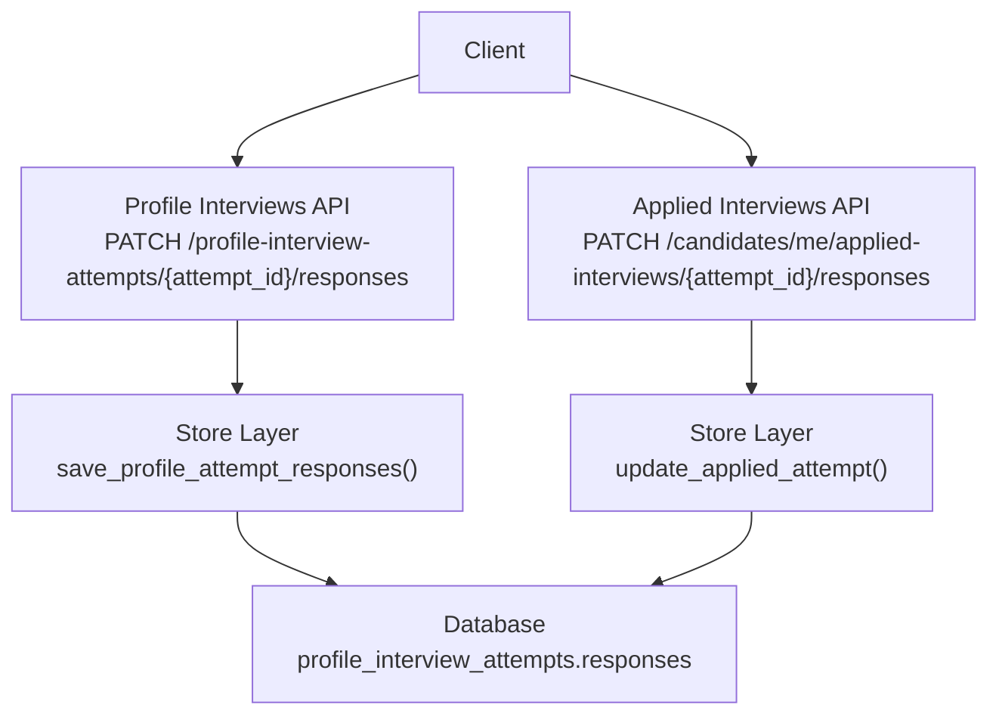
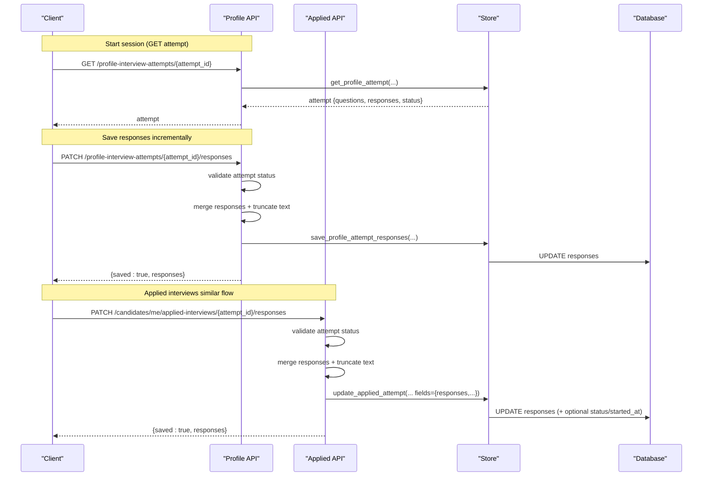
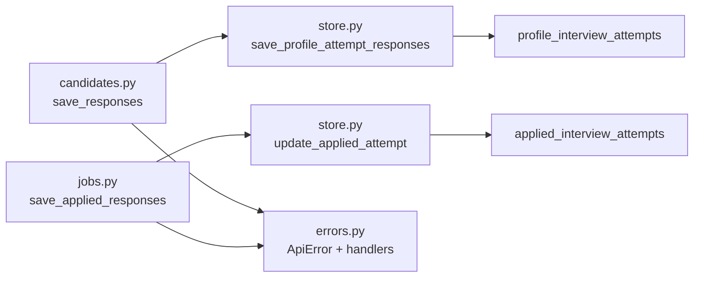

# Response Collection & Validation

<cite>
**Referenced Files in This Document**
- [candidates.py](file://Backend/app/api/v1/candidates.py)
- [jobs.py](file://Backend/app/api/v1/jobs.py)
- [store.py](file://Backend/app/db/store.py)
- [errors.py](file://Backend/app/core/errors.py)
- [test_profile_interview.py](file://Backend/tests/test_profile_interview.py)
</cite>

## Table of Contents
1. [Introduction](#introduction)
2. [Project Structure](#project-structure)
3. [Core Components](#core-components)
4. [Architecture Overview](#architecture-overview)
5. [Detailed Component Analysis](#detailed-component-analysis)
6. [Dependency Analysis](#dependency-analysis)
7. [Performance Considerations](#performance-considerations)
8. [Troubleshooting Guide](#troubleshooting-guide)
9. [Conclusion](#conclusion)

## Introduction
This document explains how interview responses are collected, merged, validated, and stored during candidate interview sessions. It focuses on the save_responses endpoint behavior for profile interviews and the analogous applied-interviews flow, including:
- Incremental saving of responses across multiple requests
- Validation against known questions defined per attempt
- Text length constraints applied to response text
- Error handling for invalid submissions
- Relationship between questions and responses, including question ID validation and response format requirements
- Examples of request payloads and common validation scenarios

## Project Structure
The response collection logic spans API endpoints, domain services, and database storage:
- API layer exposes PATCH endpoints to save responses and POST endpoints to submit attempts
- Store layer persists attempts, responses, evaluations, and related metadata
- Error handling is centralized with structured error responses

**Diagram sources**
- [candidates.py:392-422](file://Backend/app/api/v1/candidates.py#L392-L422)
- [jobs.py:344-378](file://Backend/app/api/v1/jobs.py#L344-L378)
- [store.py:1366-1372](file://Backend/app/db/store.py#L1366-L1372)
- [store.py:1882-1893](file://Backend/app/db/store.py#L1882-L1893)

**Section sources**
- [candidates.py:392-422](file://Backend/app/api/v1/candidates.py#L392-L422)
- [jobs.py:344-378](file://Backend/app/api/v1/jobs.py#L344-L378)
- [store.py:1366-1372](file://Backend/app/db/store.py#L1366-L1372)
- [store.py:1882-1893](file://Backend/app/db/store.py#L1882-L1893)

## Core Components
- Profile Interview Responses Endpoint: PATCH /profile-interview-attempts/{attempt_id}/responses
  - Validates attempt existence and status
  - Merges incoming responses with existing ones
  - Validates each question_id against known questions
  - Applies a text length cap to each response value
  - Persists merged responses incrementally
- Applied Interview Responses Endpoint: PATCH /candidates/me/applied-interviews/{attempt_id}/responses
  - Similar behavior as above but for job application interviews
  - Updates status from invited to in_progress on first save if needed

Key behaviors:
- Incremental merging: responses are accumulated over time; later saves overwrite previous values for the same question_id
- Question ID validation: only question IDs present in the attempt’s question set are accepted
- Text length constraint: response text is truncated to a maximum character count before storage
- Status transitions: profile attempts must be in_progress; applied attempts accept saved responses when status is invited or in_progress

**Section sources**
- [candidates.py:392-422](file://Backend/app/api/v1/candidates.py#L392-L422)
- [jobs.py:344-378](file://Backend/app/api/v1/jobs.py#L344-L378)

## Architecture Overview
The response lifecycle involves three main phases:
1. Session start and question retrieval
2. Incremental response saving and validation
3. Submission and evaluation

**Diagram sources**
- [candidates.py:392-422](file://Backend/app/api/v1/candidates.py#L392-L422)
- [jobs.py:344-378](file://Backend/app/api/v1/jobs.py#L344-L378)
- [store.py:1366-1372](file://Backend/app/db/store.py#L1366-L1372)
- [store.py:1882-1893](file://Backend/app/db/store.py#L1882-L1893)

## Detailed Component Analysis

### Profile Interview Responses Endpoint
Behavior:
- Retrieves the attempt scoped to the current candidate
- Ensures the attempt is in_progress; otherwise returns an immutable state error
- Builds a set of known question IDs from the attempt’s questions
- Merges incoming responses into existing responses
- For each response:
  - Validates that the question_id exists in the known set
  - Truncates the response text to a fixed maximum length
- Persists the merged responses via store layer
- Returns confirmation with the full merged responses

Validation rules:
- Attempt must exist and belong to the candidate
- Attempt status must be in_progress
- Each question_id must be part of the attempt’s question set
- Response values are strings; they are truncated to a maximum character limit

Error handling:
- Not found: attempt does not exist or is not accessible by candidate
- Conflict: attempt already submitted or not in_progress
- Unprocessable entity: unknown_question when a question_id is not recognized

Response schema:
- Success: { saved: boolean, responses: dict[str, str] }
- Errors: structured error body with code, message, and request_id

**Section sources**
- [candidates.py:392-422](file://Backend/app/api/v1/candidates.py#L392-L422)
- [errors.py:20-26](file://Backend/app/core/errors.py#L20-L26)
- [errors.py:60-88](file://Backend/app/core/errors.py#L60-L88)

### Applied Interview Responses Endpoint
Behavior:
- Retrieves the applied interview attempt scoped to the candidate
- Allows saving when status is invited or in_progress
- Merges incoming responses with existing ones
- Validates each question_id against known questions
- Truncates response text to a fixed maximum length
- Persists merged responses and updates attempt fields (including status transition from invited to in_progress and started_at timestamp)

Validation rules:
- Attempt must exist and belong to the candidate
- Attempt status must be invited or in_progress
- Each question_id must be part of the attempt’s question set
- Response values are strings; they are truncated to a maximum character limit

Error handling:
- Not found: attempt does not exist or is not accessible by candidate
- Conflict: attempt already submitted or not in allowed statuses
- Unprocessable entity: unknown_question when a question_id is not recognized

Response schema:
- Success: { saved: boolean, responses: dict[str, str] }
- Errors: structured error body with code, message, and request_id

**Section sources**
- [jobs.py:344-378](file://Backend/app/api/v1/jobs.py#L344-L378)
- [errors.py:20-26](file://Backend/app/core/errors.py#L20-L26)
- [errors.py:60-88](file://Backend/app/core/errors.py#L60-L88)

### Storage Layer for Responses
- Profile interviews:
  - save_profile_attempt_responses writes the merged responses JSON to the profile_interview_attempts table
- Applied interviews:
  - update_applied_attempt updates specified fields, serializing responses and evaluation to JSON

Persistence details:
- Responses are stored as JSON in the respective attempts tables
- The store layer handles serialization/deserialization of complex fields like questions, responses, evaluation, transcripts, identity_verification

**Section sources**
- [store.py:1366-1372](file://Backend/app/db/store.py#L1366-L1372)
- [store.py:1882-1893](file://Backend/app/db/store.py#L1882-L1893)

### Question-Response Relationship and Validation
- Questions are attached to each attempt at creation time and define the valid question_ids
- During save_responses:
  - Known question IDs are extracted from the attempt’s questions
  - Any submission containing a question_id not in this set is rejected
- Response format:
  - Payload structure: { responses: { question_id: string } }
  - Values are strings and are truncated to a maximum character limit before storage

Text length constraints:
- Both profile and applied interview response values are truncated to a fixed maximum length prior to persistence

**Section sources**
- [candidates.py:410-419](file://Backend/app/api/v1/candidates.py#L410-L419)
- [jobs.py:362-371](file://Backend/app/api/v1/jobs.py#L362-L371)

### Example Request Payloads
- Profile interview save responses:
  - Method: PATCH
  - Path: /profile-interview-attempts/{attempt_id}/responses
  - Body: { "responses": { "question_abc": "Candidate answer text..." } }
- Applied interview save responses:
  - Method: PATCH
  - Path: /candidates/me/applied-interviews/{attempt_id}/responses
  - Body: { "responses": { "question_xyz": "Candidate answer text..." } }

Notes:
- Multiple question_id keys can be included in a single request
- Subsequent saves overwrite previous values for the same question_id
- Response values are truncated to a maximum character limit

**Section sources**
- [candidates.py:388-422](file://Backend/app/api/v1/candidates.py#L388-L422)
- [jobs.py:340-378](file://Backend/app/api/v1/jobs.py#L340-L378)

### Common Validation Scenarios
- Unknown question ID:
  - Behavior: Reject with unprocessable entity error indicating the question is not part of the attempt
  - Example scenario: Submitting a response for a question_id that was not returned in the attempt’s questions list
- Attempt already submitted:
  - Behavior: Reject with conflict error indicating immutability
  - Example scenario: Trying to save responses after submission
- Invalid payload shape:
  - Behavior: Reject with request validation error detailing field issues
  - Example scenario: Missing responses key or non-string values

Test coverage highlights:
- Unknown question ID returns 422
- Submission becomes idempotent and immutable after submit
- Post-submission response saves return 409

**Section sources**
- [test_profile_interview.py:66-104](file://Backend/tests/test_profile_interview.py#L66-L104)
- [errors.py:60-88](file://Backend/app/core/errors.py#L60-L88)

## Dependency Analysis
The save_responses flows depend on:
- Candidate context for scoping attempts to the authenticated user
- Store functions for reading/writing attempts and responses
- Error handlers for consistent error responses

**Diagram sources**
- [candidates.py:392-422](file://Backend/app/api/v1/candidates.py#L392-L422)
- [jobs.py:344-378](file://Backend/app/api/v1/jobs.py#L344-L378)
- [store.py:1366-1372](file://Backend/app/db/store.py#L1366-L1372)
- [store.py:1882-1893](file://Backend/app/db/store.py#L1882-L1893)
- [errors.py:60-88](file://Backend/app/core/errors.py#L60-L88)

**Section sources**
- [candidates.py:392-422](file://Backend/app/api/v1/candidates.py#L392-L422)
- [jobs.py:344-378](file://Backend/app/api/v1/jobs.py#L344-L378)
- [store.py:1366-1372](file://Backend/app/db/store.py#L1366-L1372)
- [store.py:1882-1893](file://Backend/app/db/store.py#L1882-L1893)
- [errors.py:60-88](file://Backend/app/core/errors.py#L60-L88)

## Performance Considerations
- Incremental saves reduce network overhead by allowing partial updates without re-sending all responses
- Text truncation prevents excessively large payloads and reduces storage size
- JSON serialization/deserialization of responses occurs on every save; ensure efficient client batching where possible
- Database updates are targeted to specific rows using attempt_id, minimizing lock contention

[No sources needed since this section provides general guidance]

## Troubleshooting Guide
Common errors and resolutions:
- 404 Not Found:
  - Cause: Attempt ID does not exist or is not accessible by the candidate
  - Resolution: Verify attempt_id and ensure the candidate owns the attempt
- 409 Conflict:
  - Cause: Attempt already submitted or not in allowed status for saving responses
  - Resolution: Check attempt status; do not modify after submission
- 422 Unprocessable Entity:
  - Cause: Unknown question_id or invalid payload shape
  - Resolution: Ensure question_id matches one from the attempt’s questions; verify payload structure

Error response format:
- Structured JSON with fields: code, message, request_id, and optional details for validation errors

**Section sources**
- [errors.py:20-26](file://Backend/app/core/errors.py#L20-L26)
- [errors.py:60-88](file://Backend/app/core/errors.py#L60-L88)

## Conclusion
The response collection system supports incremental saving with robust validation against known questions and enforced text length constraints. Both profile and applied interview flows provide clear error handling and consistent response schemas. The design ensures data integrity through strict question ID validation and immutability after submission, while enabling flexible, multi-step response entry during active sessions.

[No sources needed since this section summarizes without analyzing specific files]