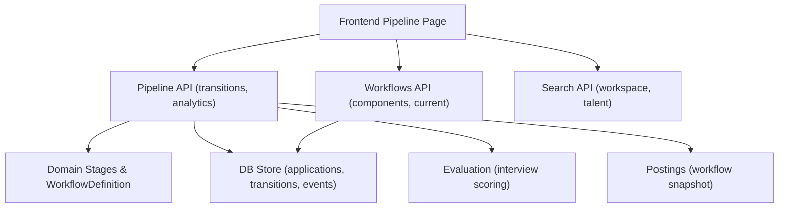
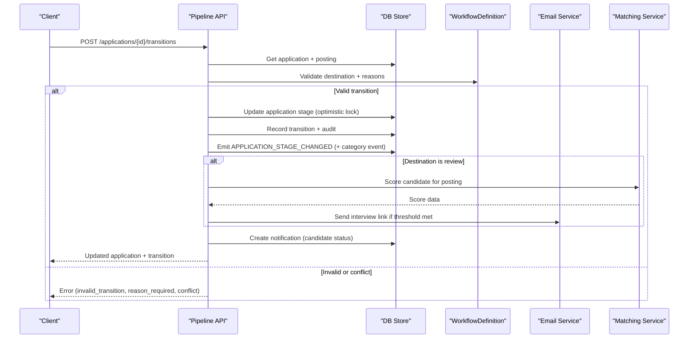
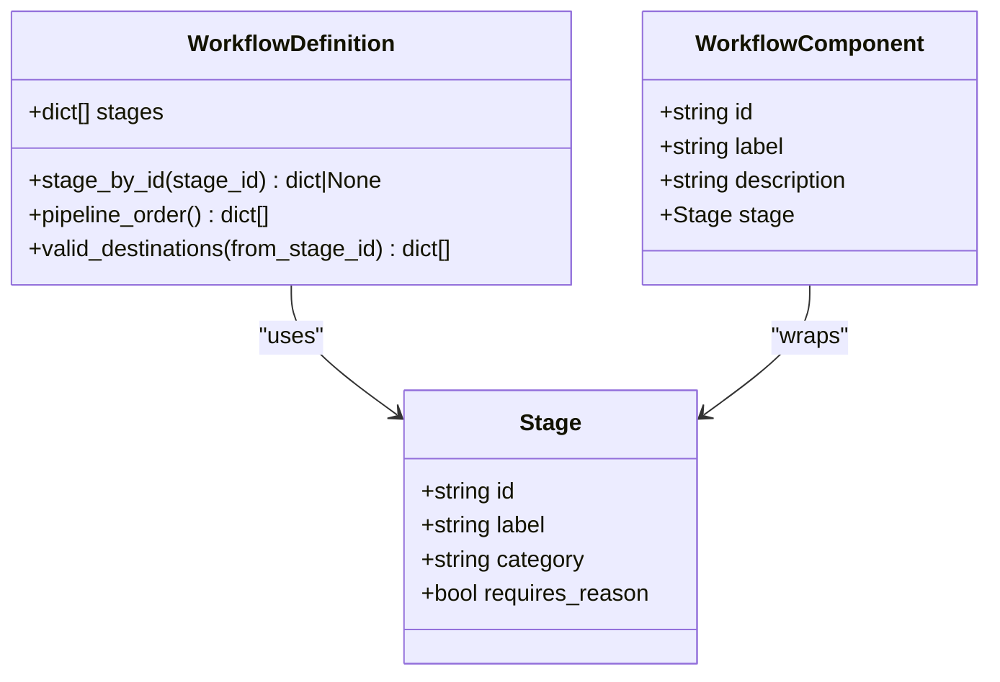
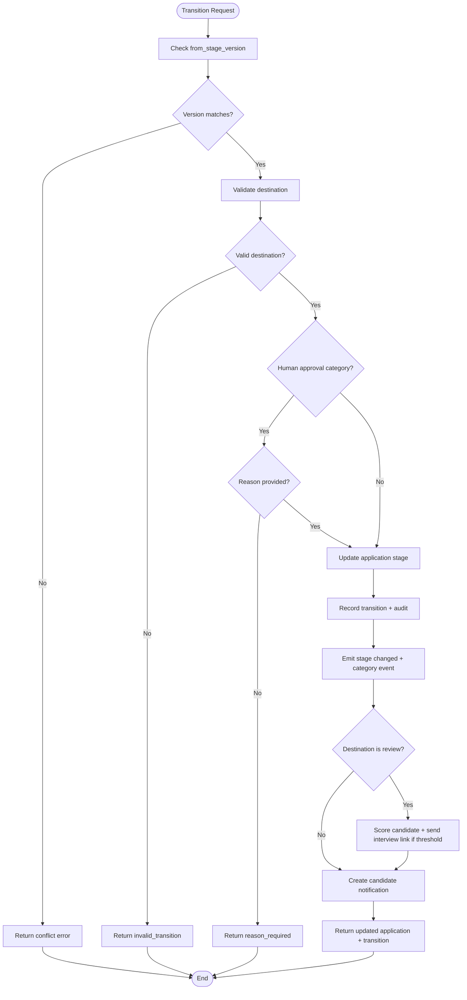
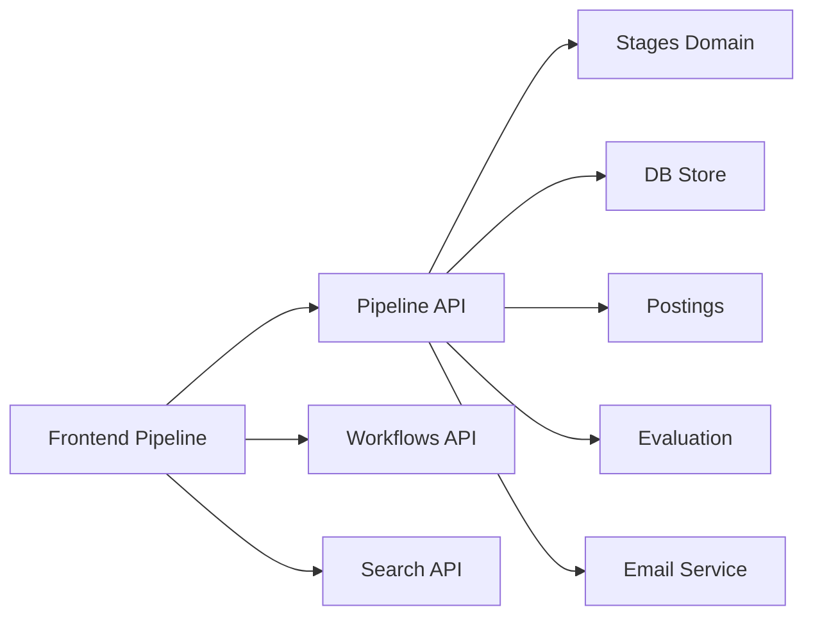

# Pipeline Stage Management

<cite>
**Referenced Files in This Document**
- [pipeline.py](file://Backend/app/api/v1/pipeline.py)
- [stages.py](file://Backend/app/domain/stages.py)
- [workflows.py](file://Backend/app/api/v1/workflows.py)
- [evaluation.py](file://Backend/app/domain/evaluation.py)
- [search.py](file://Backend/app/api/v1/search.py)
- [postings.py](file://Backend/app/api/v1/postings.py)
- [candidates.py](file://Backend/app/api/v1/candidates.py)
- [store.py](file://Backend/app/db/store.py)
- [pipeline-page.tsx](file://Frontend/components/pipeline/pipeline-page.tsx)
</cite>

## Table of Contents
1. [Introduction](#introduction)
2. [Project Structure](#project-structure)
3. [Core Components](#core-components)
4. [Architecture Overview](#architecture-overview)
5. [Detailed Component Analysis](#detailed-component-analysis)
6. [Dependency Analysis](#dependency-analysis)
7. [Performance Considerations](#performance-considerations)
8. [Troubleshooting Guide](#troubleshooting-guide)
9. [Conclusion](#conclusion)
10. [Appendices](#appendices)

## Introduction
This document provides detailed API documentation for pipeline stage management and candidate progression. It covers stage definitions, transitions, workflow automation rules, candidate movement between stages, stage-specific actions, bulk operations, stage configuration, custom fields, conditional logic, integration with evaluation results, automated stage transitions, filtering, searching, reporting, and examples of common hiring workflows including automatic progression based on scores and manual stage management.

## Project Structure
The pipeline system is implemented across backend APIs, domain models, and a frontend pipeline UI:
- Backend API endpoints for pipeline queries, transitions, scorecards, analytics, and decisions are defined under the v1 router.
- Domain models define canonical stages, categories, workflow validation, and transition rules.
- Workflows are configured via components and snapshots pinned to job postings.
- Evaluation logic provides deterministic scoring for interview responses.
- Search endpoints support workspace and talent discovery.
- The frontend renders a board/list view and drives transitions through the API.

**Diagram sources**
- [pipeline.py:155-514](file://Backend/app/api/v1/pipeline.py#L155-L514)
- [workflows.py:60-156](file://Backend/app/api/v1/workflows.py#L60-L156)
- [stages.py:47-243](file://Backend/app/domain/stages.py#L47-L243)
- [search.py:16-72](file://Backend/app/api/v1/search.py#L16-L72)
- [postings.py:25-180](file://Backend/app/api/v1/postings.py#L25-L180)
- [evaluation.py:28-132](file://Backend/app/domain/evaluation.py#L28-L132)

**Section sources**
- [pipeline.py:155-514](file://Backend/app/api/v1/pipeline.py#L155-L514)
- [workflows.py:60-156](file://Backend/app/api/v1/workflows.py#L60-L156)
- [stages.py:47-243](file://Backend/app/domain/stages.py#L47-L243)
- [search.py:16-72](file://Backend/app/api/v1/search.py#L16-L72)
- [postings.py:25-180](file://Backend/app/api/v1/postings.py#L25-L180)
- [evaluation.py:28-132](file://Backend/app/domain/evaluation.py#L28-L132)

## Core Components
- Stage model and workflow definition:
  - Fixed anchors and optional components define the allowed stages and their order.
  - Categories drive policy: new, review, assessment, offer, hired, rejected, withdrawn, closed.
  - Terminal categories prevent further transitions; human approval categories require reason codes.
  - Candidate-facing status mapping ensures consistent messaging.
- Transition engine:
  - Single transition endpoint enforces optimistic concurrency, valid destinations, and audit logging.
  - Emits outbox events for downstream automation.
  - Integrates email notifications and AI-driven automation when entering specific stages.
- Scorecards:
  - Reviewers submit dimension scores and recommendations per application.
- Analytics:
  - Aggregates applications by category and counts published postings.
- Workflows:
  - Admins configure workflows from catalog components; snapshots are pinned to postings at creation time.
- Search:
  - Workspace search and talent discovery endpoints support filtering by query, pack, and minimum score.

**Section sources**
- [stages.py:10-45](file://Backend/app/domain/stages.py#L10-L45)
- [stages.py:56-109](file://Backend/app/domain/stages.py#L56-L109)
- [stages.py:196-243](file://Backend/app/domain/stages.py#L196-L243)
- [pipeline.py:269-514](file://Backend/app/api/v1/pipeline.py#L269-L514)
- [pipeline.py:617-673](file://Backend/app/api/v1/pipeline.py#L617-L673)
- [pipeline.py:676-702](file://Backend/app/api/v1/pipeline.py#L676-L702)
- [workflows.py:19-41](file://Backend/app/api/v1/workflows.py#L19-L41)
- [workflows.py:76-156](file://Backend/app/api/v1/workflows.py#L76-L156)
- [search.py:16-72](file://Backend/app/api/v1/search.py#L16-L72)

## Architecture Overview
The pipeline architecture centers around a single transition command that validates against a workflow definition, updates the application stage, records an audit trail, emits events, and triggers automation such as emails and AI matching.

**Diagram sources**
- [pipeline.py:277-514](file://Backend/app/api/v1/pipeline.py#L277-L514)
- [stages.py:196-243](file://Backend/app/domain/stages.py#L196-L243)

**Section sources**
- [pipeline.py:277-514](file://Backend/app/api/v1/pipeline.py#L277-L514)
- [stages.py:196-243](file://Backend/app/domain/stages.py#L196-L243)

## Detailed Component Analysis

### Stage Definitions and Workflow Configuration
- Fixed anchors: received, hired, rejected, withdrawn.
- Optional components: screening, shortlisting, ai_interview, offer.
- Validation ensures required anchors, unique IDs, labels, and allowed categories.
- Candidate status mapping maps each stage to one of four visible states for candidates.

**Diagram sources**
- [stages.py:47-109](file://Backend/app/domain/stages.py#L47-L109)
- [stages.py:196-243](file://Backend/app/domain/stages.py#L196-L243)

**Section sources**
- [stages.py:56-109](file://Backend/app/domain/stages.py#L56-L109)
- [stages.py:138-176](file://Backend/app/domain/stages.py#L138-L176)
- [stages.py:245-300](file://Backend/app/domain/stages.py#L245-L300)

### Transitions and Candidate Movement
- Endpoint: POST /api/v1/applications/{application_id}/transitions
- Request fields:
  - to_stage_id: target stage ID
  - from_stage_version: optimistic concurrency version
  - reason_code: required for human approval categories
  - note: optional context
  - idempotency_key: prevents duplicate transitions
- Behavior:
  - Validates destination against WorkflowDefinition.valid_destinations
  - Enforces reason requirement for offer/hired/rejected
  - Updates stage atomically with expected version
  - Records transition and audit entry
  - Emits APPLICATION_STAGE_CHANGED and category-specific events
  - Sends candidate notification using mapped status
  - Triggers automation when entering review stage (AI match and interview link)

**Diagram sources**
- [pipeline.py:269-514](file://Backend/app/api/v1/pipeline.py#L269-L514)
- [stages.py:196-243](file://Backend/app/domain/stages.py#L196-L243)

**Section sources**
- [pipeline.py:269-514](file://Backend/app/api/v1/pipeline.py#L269-L514)
- [stages.py:196-243](file://Backend/app/domain/stages.py#L196-L243)

### Stage-Specific Actions
- Applied Interview Invitation:
  - Endpoint: POST /api/v1/applications/{application_id}/applied-interview-invitations
  - Requires question pool locked; creates attempt with questions and invited status
  - Emits APPLIED_INTERVIEW_INVITED event and notifies candidate
- Scorecard Submission:
  - Endpoint: POST /api/v1/applications/{application_id}/scorecards
  - Scores must be 0–100 per dimension; one scorecard per reviewer per application
  - Stores recommendation (advance/hold/reject) and note
- Company Decision:
  - Endpoint: POST /api/v1/applications/{application_id}/decision
  - Sends templated acceptance/rejection/update email based on decision keywords

**Section sources**
- [pipeline.py:517-614](file://Backend/app/api/v1/pipeline.py#L517-L614)
- [pipeline.py:617-673](file://Backend/app/api/v1/pipeline.py#L617-L673)
- [pipeline.py:705-765](file://Backend/app/api/v1/pipeline.py#L705-L765)

### Bulk Operations
- No dedicated bulk transition endpoint exists in the analyzed code.
- Bulk-like behavior can be achieved by iterating over multiple application IDs and calling the transition endpoint with idempotency keys.
- For large-scale operations, consider batching client-side calls and handling conflicts gracefully.

[No sources needed since this section provides general guidance]

### Stage Configuration and Custom Fields
- Workflows are configured via components; custom stages are not allowed.
- Components include screening, shortlisting, ai_interview, offer; fixed anchors always present.
- Candidate status mapping is enforced to ensure consistent candidate-facing states.
- Job postings pin a workflow snapshot at creation time, ensuring consistency across applications.

**Section sources**
- [workflows.py:19-41](file://Backend/app/api/v1/workflows.py#L19-L41)
- [workflows.py:76-156](file://Backend/app/api/v1/workflows.py#L76-L156)
- [postings.py:103-180](file://Backend/app/api/v1/postings.py#L103-L180)
- [stages.py:138-176](file://Backend/app/domain/stages.py#L138-L176)

### Conditional Logic and Automation Rules
- Human approval categories (offer, hired, rejected) require reason codes.
- When moving into review stage:
  - Candidate is scored for job match using embeddings and domain manifest
  - If score meets threshold (e.g., 75), an interview link is sent automatically
  - Background LLM-based JD match evaluation updates application fields asynchronously
- Category-specific events trigger downstream automation (e.g., APPLICATION_REJECTED, CANDIDATE_HIRED).

**Section sources**
- [pipeline.py:325-333](file://Backend/app/api/v1/pipeline.py#L325-L333)
- [pipeline.py:392-467](file://Backend/app/api/v1/pipeline.py#L392-L467)
- [pipeline.py:380-390](file://Backend/app/api/v1/pipeline.py#L380-L390)

### Integration with Evaluation Results
- Deterministic scenario evaluator computes scores based on coverage, structure, and depth.
- Evaluations store rubric dimensions, strengths/gaps, and require human decision.
- Scorecards allow human reviewers to add structured feedback and recommendations.

**Section sources**
- [evaluation.py:28-132](file://Backend/app/domain/evaluation.py#L28-L132)
- [pipeline.py:617-673](file://Backend/app/api/v1/pipeline.py#L617-L673)

### Filtering, Searching, and Reporting
- Pipeline listing supports filtering by posting_id.
- Analytics endpoint aggregates applications by category and counts posted jobs.
- Search endpoints:
  - Workspace search returns postings and applications matching a query
  - Talent discovery supports filtering by pack and minimum score

**Section sources**
- [pipeline.py:155-201](file://Backend/app/api/v1/pipeline.py#L155-L201)
- [pipeline.py:676-702](file://Backend/app/api/v1/pipeline.py#L676-L702)
- [search.py:16-72](file://Backend/app/api/v1/search.py#L16-L72)

### Examples of Common Hiring Workflows
- Automatic progression based on scores:
  - Move candidate to review stage triggers AI scoring; if threshold met, interview link sent automatically.
- Manual stage management:
  - Recruiters move candidates through stages with reason codes where required; notes recorded for audit.
- Offer and hire flow:
  - Move to offer requires reason; subsequent move to hired also requires reason; category events emitted.

[No sources needed since this section summarizes workflows without analyzing specific files]

## Dependency Analysis
- Pipeline API depends on:
  - Domain stages for validation and transition rules
  - Store for persistence, auditing, events, and idempotency
  - Postings for workflow snapshots and question pools
  - Evaluation services for interview scoring
  - Email service for candidate notifications
- Frontend depends on:
  - Pipeline API for board data and transitions
  - Workflows API for component lists and current workflow
  - Search API for workspace and talent discovery

**Diagram sources**
- [pipeline.py:155-514](file://Backend/app/api/v1/pipeline.py#L155-L514)
- [workflows.py:60-156](file://Backend/app/api/v1/workflows.py#L60-L156)
- [search.py:16-72](file://Backend/app/api/v1/search.py#L16-L72)

**Section sources**
- [pipeline.py:155-514](file://Backend/app/api/v1/pipeline.py#L155-L514)
- [workflows.py:60-156](file://Backend/app/api/v1/workflows.py#L60-L156)
- [search.py:16-72](file://Backend/app/api/v1/search.py#L16-L72)

## Performance Considerations
- Optimistic concurrency prevents race conditions during transitions.
- Idempotency keys avoid duplicate operations on retries.
- Background tasks for AI matching and email sending reduce request latency.
- Analytics aggregation runs over tenant-scoped datasets; consider indexing for large volumes.

[No sources needed since this section provides general guidance]

## Troubleshooting Guide
Common errors and resolutions:
- application_stage_conflict: Refresh the application before retrying due to concurrent changes.
- invalid_transition: Target stage is not reachable from current stage per workflow rules.
- reason_required: Moving to offer/hired/rejected requires a reason code.
- already_invited: Candidate already has an applied interview for the job.
- question_pool_not_locked: Lock the question pool before inviting candidates.
- avatar_not_found: Candidate has no profile photo on file.

**Section sources**
- [pipeline.py:306-333](file://Backend/app/api/v1/pipeline.py#L306-L333)
- [pipeline.py:540-555](file://Backend/app/api/v1/pipeline.py#L540-L555)
- [pipeline.py:768-793](file://Backend/app/api/v1/pipeline.py#L768-L793)

## Conclusion
The pipeline stage management system provides a robust, validated, and auditable mechanism for candidate progression. It integrates workflow configuration, evaluation results, and automation to streamline hiring processes while maintaining strict control over transitions and communications.

[No sources needed since this section summarizes without analyzing specific files]

## Appendices

### API Reference Summary
- GET /api/v1/pipeline
  - Returns columns with cards grouped by stage; supports posting_id filter
- GET /api/v1/applications/{application_id}
  - Returns application details, interview attempt, scorecards, transitions
- POST /api/v1/applications/{application_id}/transitions
  - Moves candidate to next/previous stage or terminal states; enforces rules
- POST /api/v1/applications/{application_id}/applied-interview-invitations
  - Invites candidate to complete an applied interview
- POST /api/v1/applications/{application_id}/scorecards
  - Submits reviewer scores and recommendation
- GET /api/v1/analytics/pipeline
  - Returns aggregated metrics for applications and postings
- POST /api/v1/applications/{application_id}/decision
  - Sends acceptance/rejection/update email based on decision
- GET /api/v1/workflows/components
  - Lists available workflow components and fixed stages
- GET /api/v1/workflows/current
  - Returns active workflow with components and fixed stages
- PUT /api/v1/workflows/current
  - Updates company workflow from components
- GET /api/v1/search
  - Workspace search returning postings and applications
- GET /api/v1/talent
  - Talent discovery with query, pack, and min_score filters

**Section sources**
- [pipeline.py:155-793](file://Backend/app/api/v1/pipeline.py#L155-L793)
- [workflows.py:60-156](file://Backend/app/api/v1/workflows.py#L60-L156)
- [search.py:16-72](file://Backend/app/api/v1/search.py#L16-L72)