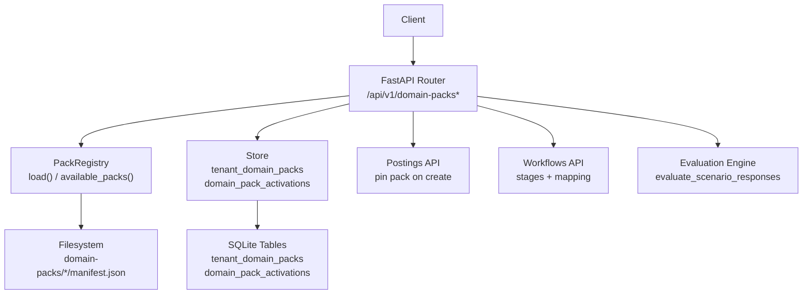
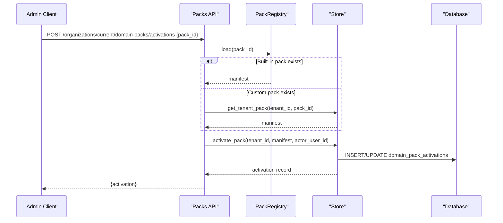
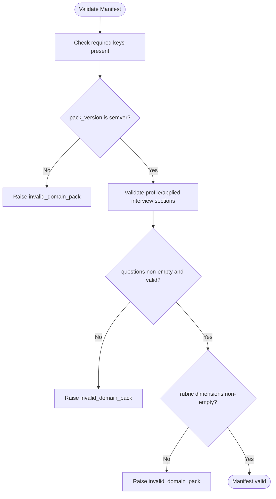
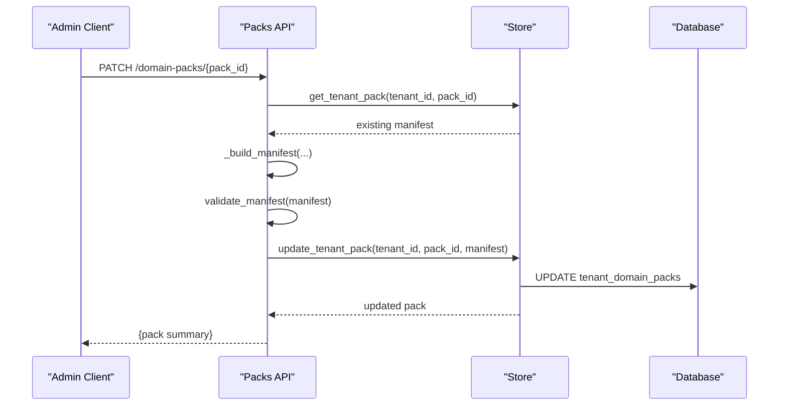
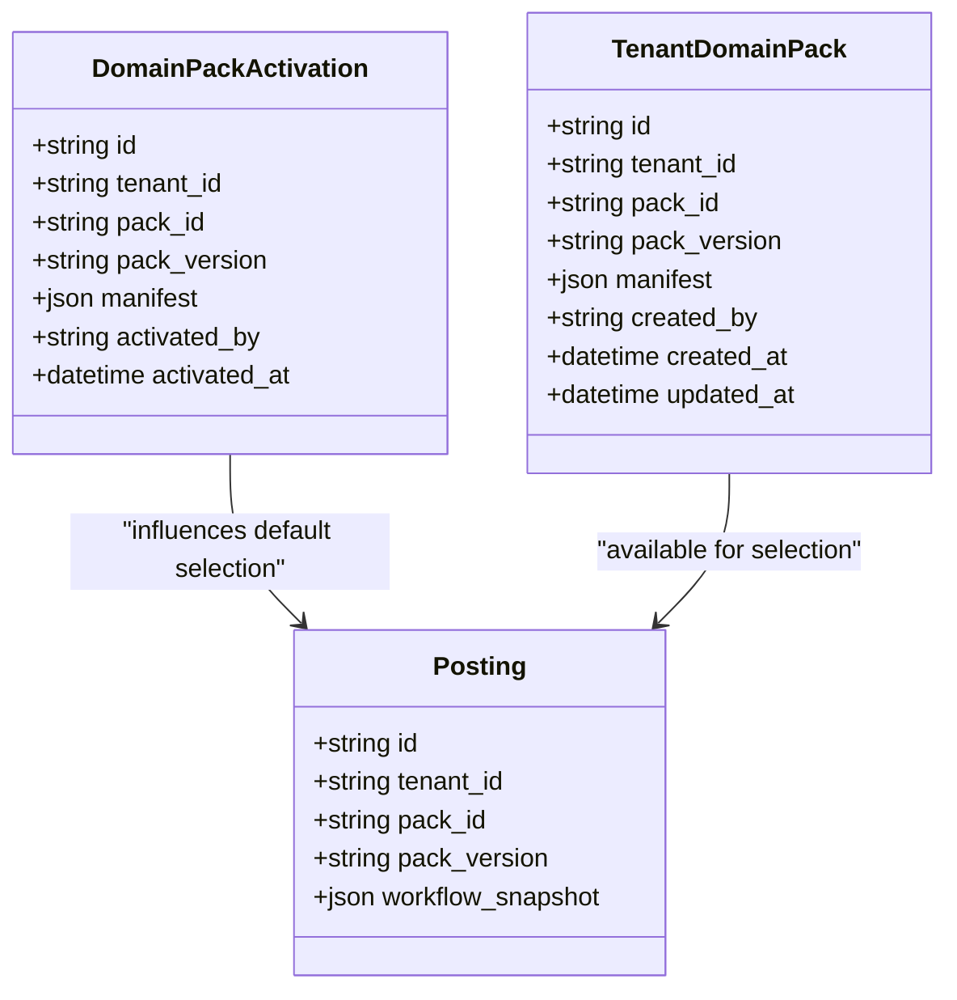
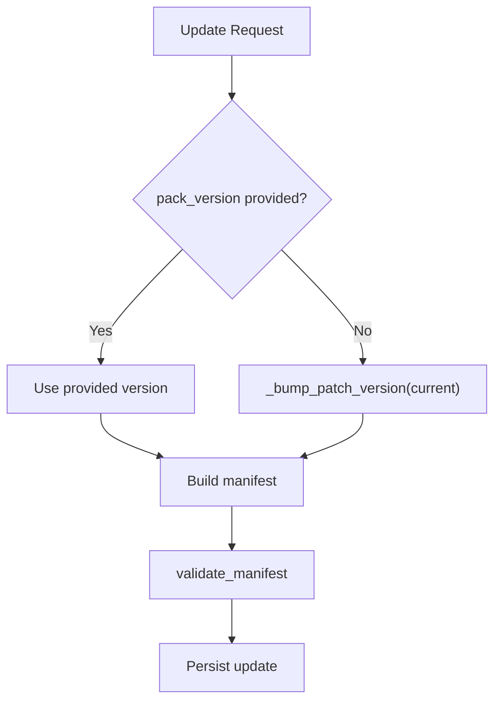
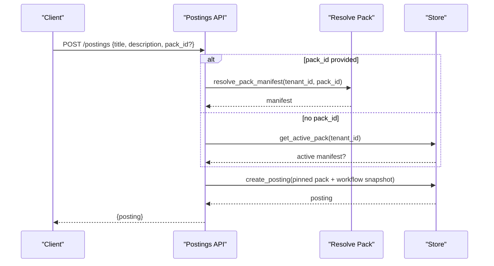
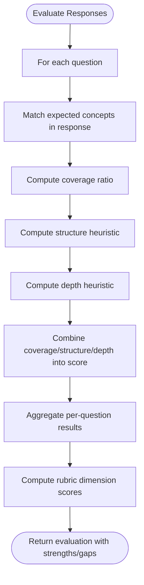
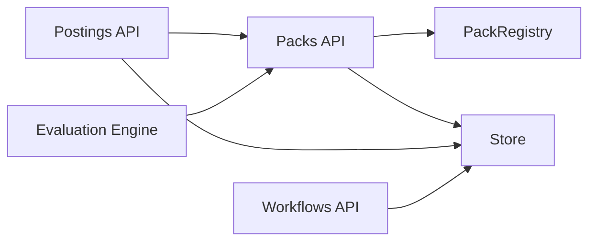

# Domain Packs & Configuration API

<cite>
**Referenced Files in This Document**
- [packs.py](file://Backend/app/api/v1/packs.py)
- [packs_service.py](file://Backend/app/services/packs.py)
- [store.py](file://Backend/app/db/store.py)
- [database.py](file://Backend/app/db/database.py)
- [postings.py](file://Backend/app/api/v1/postings.py)
- [workflows.py](file://Backend/app/api/v1/workflows.py)
- [evaluation.py](file://Backend/app/domain/evaluation.py)
- [education_manifest.json](file://domain-packs/education/manifest.json)
- [software_engineering_manifest.json](file://domain-packs/software-engineering/manifest.json)
</cite>

## Table of Contents
1. [Introduction](#introduction)
2. [Project Structure](#project-structure)
3. [Core Components](#core-components)
4. [Architecture Overview](#architecture-overview)
5. [Detailed Component Analysis](#detailed-component-analysis)
6. [Dependency Analysis](#dependency-analysis)
7. [Performance Considerations](#performance-considerations)
8. [Troubleshooting Guide](#troubleshooting-guide)
9. [Conclusion](#conclusion)
10. [Appendices](#appendices)

## Introduction
This document provides comprehensive API documentation for domain pack management and configuration endpoints. It covers pack installation, activation, and configuration; manifest validation; custom pack development; runtime configuration management; pack registry operations; version management; dependency resolution; integration points for custom domain logic and evaluation criteria; and examples for creating custom domain packs and configuring industry-specific hiring workflows.

Domain packs encapsulate interview questions, evaluation rubrics, ontology (skills, certifications, concepts), matching weights, and compliance rules per industry or role. They are validated against a strict schema, stored per tenant, and activated at the organization level to influence job postings, interviews, and evaluations.

## Project Structure
The domain pack system spans API routes, service-level validation and registry, database persistence, and example manifests:

- API routes define endpoints for listing, creating, updating, deleting, and activating packs, as well as querying active packs.
- Service layer validates manifests and loads built-in packs from a directory.
- Database layer persists tenant-specific packs, activations, and counts related postings.
- Example manifests demonstrate valid structures for education and software engineering domains.

**Diagram sources**
- [packs.py:63-490](file://Backend/app/api/v1/packs.py#L63-L490)
- [packs_service.py:1-97](file://Backend/app/services/packs.py#L1-L97)
- [store.py:649-790](file://Backend/app/db/store.py#L649-L790)
- [database.py:98-120](file://Backend/app/db/database.py#L98-L120)
- [postings.py:81-180](file://Backend/app/api/v1/postings.py#L81-L180)
- [workflows.py:60-156](file://Backend/app/api/v1/workflows.py#L60-L156)
- [evaluation.py:28-132](file://Backend/app/domain/evaluation.py#L28-L132)

**Section sources**
- [packs.py:63-490](file://Backend/app/api/v1/packs.py#L63-L490)
- [packs_service.py:1-97](file://Backend/app/services/packs.py#L1-L97)
- [store.py:649-790](file://Backend/app/db/store.py#L649-L790)
- [database.py:98-120](file://Backend/app/db/database.py#L98-L120)
- [postings.py:81-180](file://Backend/app/api/v1/postings.py#L81-L180)
- [workflows.py:60-156](file://Backend/app/api/v1/workflows.py#L60-L156)
- [evaluation.py:28-132](file://Backend/app/domain/evaluation.py#L28-L132)

## Core Components
- Pack Registry: Loads and validates built-in pack manifests from the filesystem and enforces schema constraints.
- Tenant Pack Store: Persists custom packs and active pack activations per tenant with audit trails.
- API Endpoints: Provide CRUD for custom packs, activation, and listing of available packs.
- Integration Points: Job postings pin the selected pack and workflow snapshot; evaluation engine uses pack rubric and questions.

Key responsibilities:
- Manifest validation ensures required keys, semantic versioning, non-empty question lists, and allowed task styles.
- Activation records store the current pack’s manifest and metadata for the tenant.
- Posting creation pins the pack and workflow to ensure stable behavior over time.

**Section sources**
- [packs_service.py:15-62](file://Backend/app/services/packs.py#L15-L62)
- [store.py:649-790](file://Backend/app/db/store.py#L649-L790)
- [packs.py:222-490](file://Backend/app/api/v1/packs.py#L222-L490)
- [postings.py:103-180](file://Backend/app/api/v1/postings.py#L103-L180)

## Architecture Overview
The domain pack architecture separates concerns between API, registry, storage, and evaluation:

- API layer exposes REST endpoints for pack management and activation.
- Registry reads built-in packs from disk and validates them.
- Store manages tenant-scoped data and emits events and audits.
- Postings and workflows integrate with packs to pin configurations at creation time.
- Evaluation engine consumes pack rubrics and questions to score candidate responses deterministically.

**Diagram sources**
- [packs.py:421-472](file://Backend/app/api/v1/packs.py#L421-L472)
- [packs_service.py:81-96](file://Backend/app/services/packs.py#L81-L96)
- [store.py:649-687](file://Backend/app/db/store.py#L649-L687)
- [database.py:98-107](file://Backend/app/db/database.py#L98-L107)

## Detailed Component Analysis

### Pack Registry and Validation
- Validates required manifest keys: identifiers, display name, ontology, matching weights, interview sections, and rubric dimensions.
- Enforces semantic versioning for pack_version.
- Ensures profile_interview and applied_interview have non-empty questions with required fields and allowed task_style values.
- Provides methods to list available packs and load a specific pack by ID.

**Diagram sources**
- [packs_service.py:34-62](file://Backend/app/services/packs.py#L34-L62)

**Section sources**
- [packs_service.py:15-62](file://Backend/app/services/packs.py#L15-L62)

### Pack Management Endpoints
- List domain packs: Returns built-in and custom packs with summary info and linked job counts.
- Get domain pack: Resolves manifest from built-in or custom source and returns full details.
- Create domain pack: Builds manifest from request, validates, stores as custom pack, audits, and returns summary.
- Update domain pack: Merges updates, bumps patch version if not provided, validates, persists, audits, and returns updated summary.
- Delete domain pack: Prevents deletion if pack is in use by postings; otherwise deletes and audits.
- Activate domain pack: Activates a pack for the tenant, auditing previous and new state, emitting an event.
- Get active pack: Returns the currently active pack for the tenant.

**Diagram sources**
- [packs.py:286-367](file://Backend/app/api/v1/packs.py#L286-L367)
- [store.py:757-774](file://Backend/app/db/store.py#L757-L774)

**Section sources**
- [packs.py:63-490](file://Backend/app/api/v1/packs.py#L63-L490)
- [store.py:690-790](file://Backend/app/db/store.py#L690-L790)

### Manifest Schema and Examples
Valid manifests include:
- pack_id, pack_version (semantic version), display_name
- ontology: skills, certifications, concepts
- resume_extraction_rules: signals
- matching_weights: cv_match, profile_interview_score
- profile_interview: task_style, question_count, questions[]
- applied_interview: task_style, question_count, questions[]
- evaluation_rubric: dimensions[]
- compliance_rules: optional array

Example manifests:
- Education pack demonstrates academic hiring focus with relevant skills, certifications, and scenario-based questions.
- Software engineering pack emphasizes technical competencies and practical scenarios.

**Section sources**
- [education_manifest.json:1-143](file://domain-packs/education/manifest.json#L1-L143)
- [software_engineering_manifest.json:1-140](file://domain-packs/software-engineering/manifest.json#L1-L140)

### Runtime Configuration Management
- Active pack activation: Stores the latest activation per tenant with manifest snapshot and timestamp.
- Posting creation pins pack and workflow snapshot to ensure stability across lifecycle changes.
- Audit logging captures pack creation, updates, deletions, and activations with old/new states.

**Diagram sources**
- [database.py:98-120](file://Backend/app/db/database.py#L98-L120)
- [postings.py:103-180](file://Backend/app/api/v1/postings.py#L103-L180)
- [store.py:649-790](file://Backend/app/db/store.py#L649-L790)

**Section sources**
- [store.py:649-790](file://Backend/app/db/store.py#L649-L790)
- [postings.py:103-180](file://Backend/app/api/v1/postings.py#L103-L180)

### Pack Registry Operations and Version Management
- Available packs: Scans filesystem for valid manifests and returns summaries.
- Load pack: Reads a specific pack’s manifest and validates it.
- Version bumping: On update without explicit version, patch version is incremented automatically.

**Diagram sources**
- [packs.py:214-219](file://Backend/app/api/v1/packs.py#L214-L219)
- [packs.py:322-349](file://Backend/app/api/v1/packs.py#L322-L349)

**Section sources**
- [packs_service.py:68-96](file://Backend/app/services/packs.py#L68-L96)
- [packs.py:214-219](file://Backend/app/api/v1/packs.py#L214-L219)

### Dependency Resolution and Integration Points
- Resolve pack manifest: Tries built-in registry first; falls back to tenant custom packs; raises not found if neither exists.
- Posting creation: Requires a pack; either explicitly specified or defaults to active pack; pins pack and workflow snapshot.
- Workflow integration: Workflows define stages and candidate status mappings; components build stages and validate consistency.

**Diagram sources**
- [packs.py:41-60](file://Backend/app/api/v1/packs.py#L41-L60)
- [postings.py:103-180](file://Backend/app/api/v1/postings.py#L103-L180)
- [store.py:677-687](file://Backend/app/db/store.py#L677-L687)

**Section sources**
- [packs.py:41-60](file://Backend/app/api/v1/packs.py#L41-L60)
- [postings.py:103-180](file://Backend/app/api/v1/postings.py#L103-L180)
- [workflows.py:25-40](file://Backend/app/api/v1/workflows.py#L25-L40)

### Evaluation Criteria and Custom Domain Logic
- Deterministic evaluator scores responses based on expected concepts, structure, and depth.
- Uses pack rubric dimensions to compute dimension scores and overall score.
- Marks decisions as requiring human oversight to comply with policy.

**Diagram sources**
- [evaluation.py:28-132](file://Backend/app/domain/evaluation.py#L28-L132)

**Section sources**
- [evaluation.py:28-132](file://Backend/app/domain/evaluation.py#L28-L132)

## Dependency Analysis
- API depends on dependencies for authentication, authorization, and context.
- Packs API depends on PackRegistry for built-in packs and Store for tenant data.
- Postings API integrates with Packs API to resolve and pin packs.
- Workflows API composes stages from components and validates mappings.
- Evaluation engine consumes pack rubrics and questions to produce deterministic scores.

**Diagram sources**
- [packs.py:63-490](file://Backend/app/api/v1/packs.py#L63-L490)
- [postings.py:81-180](file://Backend/app/api/v1/postings.py#L81-L180)
- [workflows.py:60-156](file://Backend/app/api/v1/workflows.py#L60-L156)
- [evaluation.py:28-132](file://Backend/app/domain/evaluation.py#L28-L132)

**Section sources**
- [packs.py:63-490](file://Backend/app/api/v1/packs.py#L63-L490)
- [postings.py:81-180](file://Backend/app/api/v1/postings.py#L81-L180)
- [workflows.py:60-156](file://Backend/app/api/v1/workflows.py#L60-L156)
- [evaluation.py:28-132](file://Backend/app/domain/evaluation.py#L28-L132)

## Performance Considerations
- Manifest loading scans filesystem; keep built-in packs minimal and well-structured to avoid overhead.
- Validate manifests eagerly to fail fast and prevent invalid data from entering storage.
- Use tenant-scoped queries with indexes (e.g., tenant_domain_packs.tenant_id) to optimize lookups.
- Pin pack and workflow at posting creation to reduce runtime resolution costs and ensure stability.

[No sources needed since this section provides general guidance]

## Troubleshooting Guide
Common errors and resolutions:
- invalid_domain_pack: Manifest missing required keys, invalid version format, or invalid interview sections. Fix manifest schema and versioning.
- domain_pack_not_found: Pack ID does not exist in built-in registry or tenant custom packs. Verify pack_id and ensure activation or creation.
- pack_immutable: Attempted to edit or delete a built-in pack. Use custom packs for modifications.
- pack_already_exists: Custom pack with same pack_id already exists for tenant. Choose a unique pack_id.
- pack_in_use: Cannot delete a pack linked to one or more postings. Unlink or reassign postings before deletion.
- domain_pack_required: Creating a posting without selecting a pack and without an active pack. Select a pack or activate one.

Operational tips:
- Always validate manifests before persisting to catch issues early.
- Audit logs capture state changes; review them when diagnosing unexpected behavior.
- Ensure tenant isolation by scoping all pack operations to the correct tenant_id.

**Section sources**
- [packs_service.py:29-62](file://Backend/app/services/packs.py#L29-L62)
- [packs.py:222-414](file://Backend/app/api/v1/packs.py#L222-L414)
- [postings.py:103-122](file://Backend/app/api/v1/postings.py#L103-L122)

## Conclusion
The domain pack system provides a robust, validated, and tenant-scoped mechanism to configure hiring workflows per industry or role. By separating built-in packs from tenant customizations, enforcing strict manifest schemas, and pinning configurations at posting creation, the system ensures consistent behavior while allowing flexibility for customization. Integration with workflows and evaluation engines enables end-to-end domain-aware hiring processes with deterministic scoring and human oversight.

[No sources needed since this section summarizes without analyzing specific files]

## Appendices

### API Reference Summary
- List domain packs: GET /api/v1/domain-packs
- Get domain pack: GET /api/v1/domain-packs/{pack_id}
- Create domain pack: POST /api/v1/domain-packs
- Update domain pack: PATCH /api/v1/domain-packs/{pack_id}
- Delete domain pack: DELETE /api/v1/domain-packs/{pack_id}
- Activate domain pack: POST /api/v1/organizations/current/domain-packs/activations
- Get active pack: GET /api/v1/organizations/current/domain-packs/active

**Section sources**
- [packs.py:63-490](file://Backend/app/api/v1/packs.py#L63-L490)

### Creating a Custom Domain Pack
Steps:
1. Define a manifest with required keys and valid structure.
2. Submit via POST /api/v1/domain-packs with payload fields mapped to manifest sections.
3. Validate response and confirm creation via GET /api/v1/domain-packs/{pack_id}.
4. Activate via POST /api/v1/organizations/current/domain-packs/activations.
5. Link to postings by specifying pack_id during creation or rely on active pack.

Examples:
- Education pack demonstrates academic hiring focus with scenario-based questions and rubric dimensions.
- Software engineering pack highlights technical competencies and practical scenarios.

**Section sources**
- [packs.py:120-211](file://Backend/app/api/v1/packs.py#L120-L211)
- [education_manifest.json:1-143](file://domain-packs/education/manifest.json#L1-L143)
- [software_engineering_manifest.json:1-140](file://domain-packs/software-engineering/manifest.json#L1-L140)

### Configuring Industry-Specific Hiring Workflows
Steps:
1. List workflow components and fixed stages.
2. Compose components to build stages and validate mappings.
3. Upsert company workflow with chosen components.
4. Create postings pinned to the active pack and workflow snapshot.

**Section sources**
- [workflows.py:60-156](file://Backend/app/api/v1/workflows.py#L60-L156)
- [postings.py:103-180](file://Backend/app/api/v1/postings.py#L103-L180)