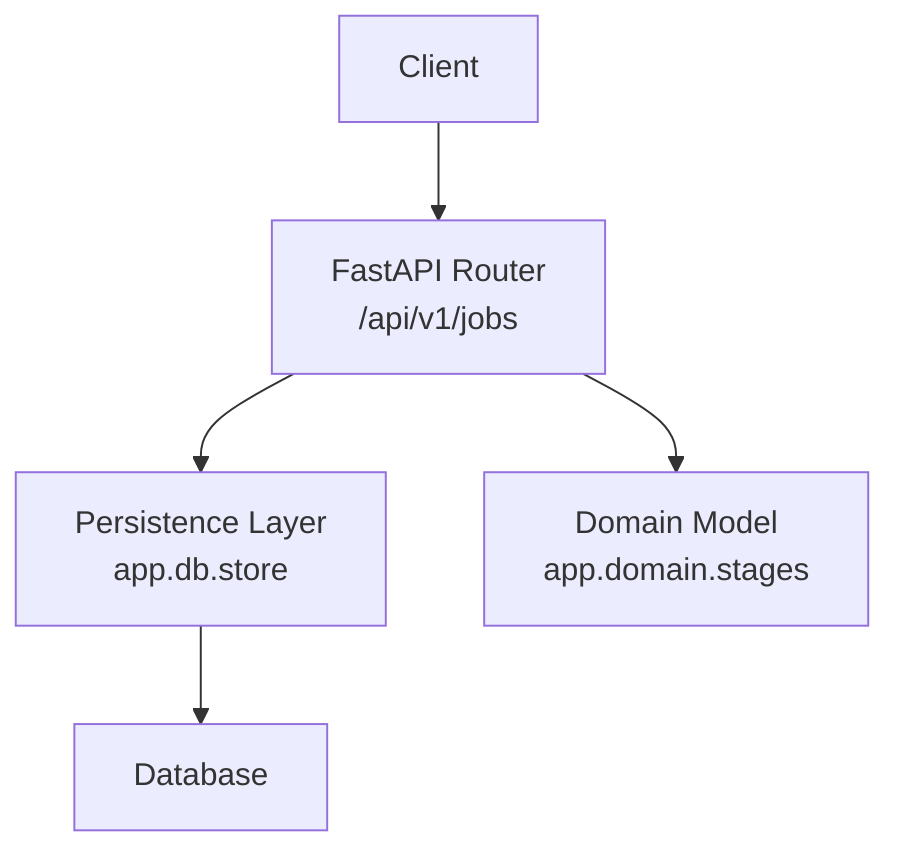
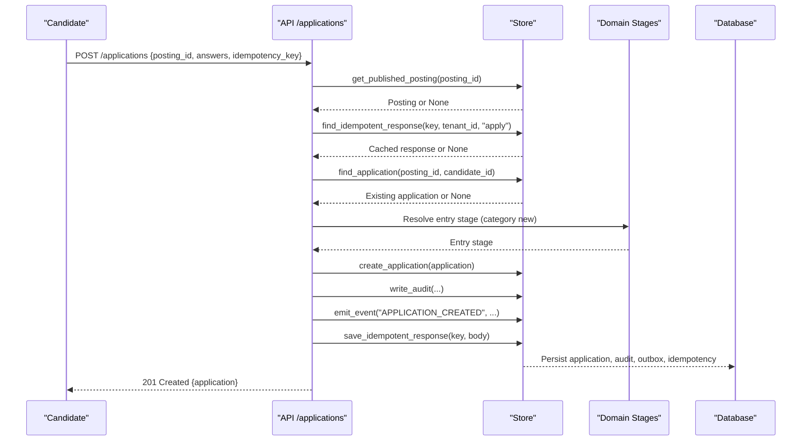
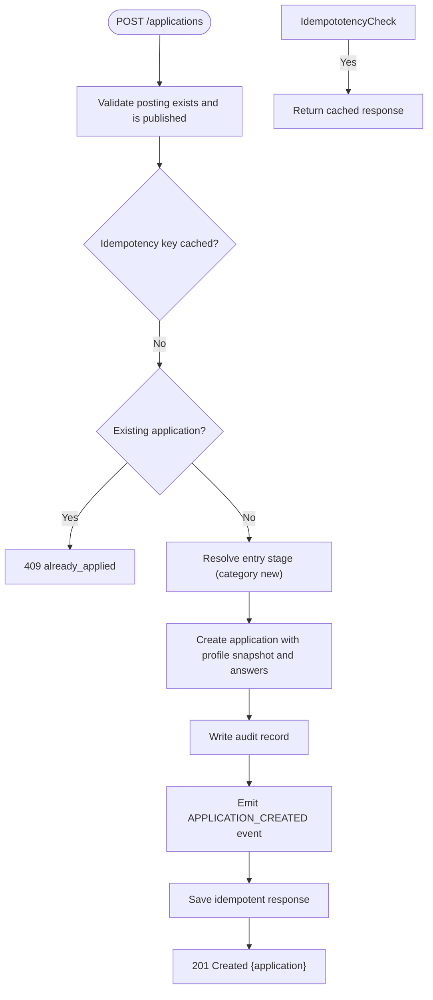
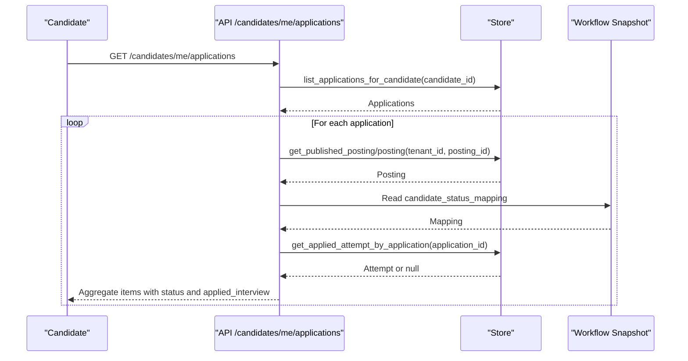
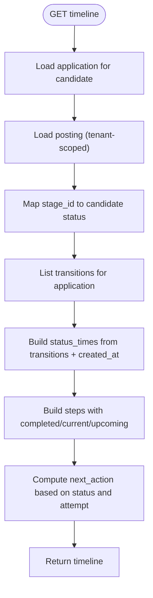
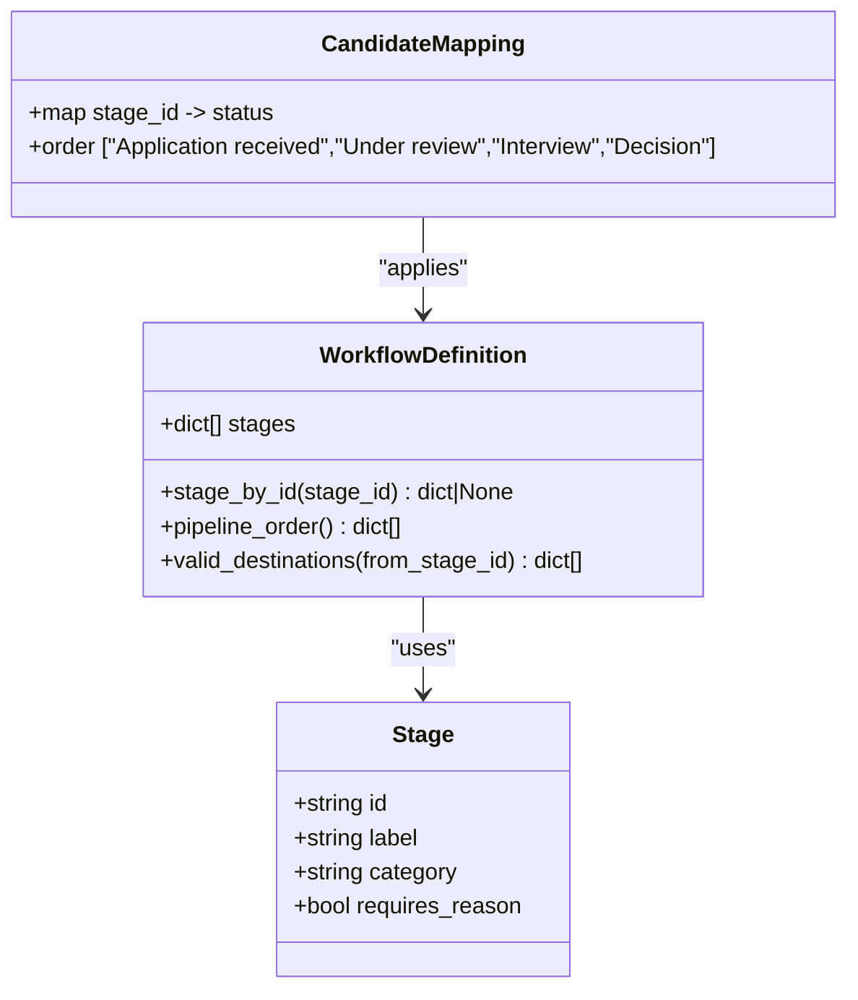
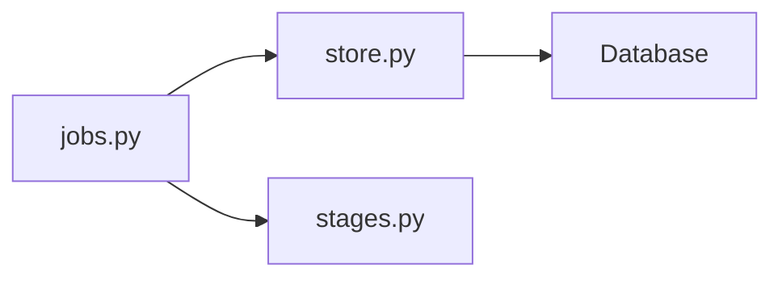

# Application Management

<cite>
**Referenced Files in This Document**
- [jobs.py](file://Backend/app/api/v1/jobs.py)
- [stages.py](file://Backend/app/domain/stages.py)
- [store.py](file://Backend/app/db/store.py)
</cite>

## Table of Contents
1. Introduction
2. Project Structure
3. Core Components
4. Architecture Overview
5. Detailed Component Analysis
6. Dependency Analysis
7. Performance Considerations
8. Troubleshooting Guide
9. Conclusion

## Introduction
This document provides comprehensive API documentation for application management endpoints that enable candidates to apply for jobs, retrieve their applications with candidate-friendly status mapping and timeline information, and track application progress through stages. It covers:
- POST /applications: Submit a job application with idempotency support, validation rules, and workflow integration.
- GET /candidates/me/applications: Retrieve the current candidate’s applications with status mapping and applied interview context.
- GET /candidates/me/applications/{application_id}/timeline: Track application progress using candidate-safe statuses and step timestamps.

The system enforces a four-step candidate-facing status model (Application received → Under review → Interview → Decision) and maps internal workflow stages to these statuses per organization configuration.

## Project Structure
The application management functionality is implemented in the FastAPI v1 routes under the jobs module, with domain logic for stage definitions and persistence helpers in the store layer.

**Diagram sources**
- [jobs.py:86-179](file://Backend/app/api/v1/jobs.py#L86-L179)
- [jobs.py:192-237](file://Backend/app/api/v1/jobs.py#L192-L237)
- [jobs.py:240-307](file://Backend/app/api/v1/jobs.py#L240-L307)
- [store.py:1648-1711](file://Backend/app/db/store.py#L1648-L1711)
- [stages.py:32-44](file://Backend/app/domain/stages.py#L32-L44)

**Section sources**
- [jobs.py:1-452](file://Backend/app/api/v1/jobs.py#L1-L452)
- [store.py:1648-1711](file://Backend/app/db/store.py#L1648-L1711)
- [stages.py:1-300](file://Backend/app/domain/stages.py#L1-L300)

## Core Components
- Candidate application submission endpoint with idempotency and workflow integration.
- Candidate application listing with status mapping and applied interview context.
- Application timeline endpoint providing candidate-safe steps and next actions.
- Domain model defining canonical stages and candidate status mapping.
- Persistence helpers for applications, workflows, transitions, and idempotency records.

Key responsibilities:
- Validate posting availability and prevent duplicate applications.
- Enforce idempotency via unique keys per candidate and operation.
- Map internal stages to candidate-visible statuses using the posted workflow snapshot.
- Build timeline steps from transition history and provide actionable guidance.

**Section sources**
- [jobs.py:80-179](file://Backend/app/api/v1/jobs.py#L80-L179)
- [jobs.py:192-237](file://Backend/app/api/v1/jobs.py#L192-L237)
- [jobs.py:240-307](file://Backend/app/api/v1/jobs.py#L240-L307)
- [stages.py:32-44](file://Backend/app/domain/stages.py#L32-L44)
- [store.py:279-297](file://Backend/app/db/store.py#L279-L297)
- [store.py:1648-1711](file://Backend/app/db/store.py#L1648-L1711)

## Architecture Overview
The application lifecycle flows through the following layers:
- API layer validates requests and orchestrates business logic.
- Domain layer defines allowed stages and candidate status mapping.
- Store layer persists applications, workflow snapshots, transitions, and idempotency records.
- Database stores structured data and JSON fields for workflow and answers.

**Diagram sources**
- [jobs.py:86-179](file://Backend/app/api/v1/jobs.py#L86-L179)
- [store.py:279-297](file://Backend/app/db/store.py#L279-L297)
- [store.py:1648-1657](file://Backend/app/db/store.py#L1648-L1657)

**Section sources**
- [jobs.py:86-179](file://Backend/app/api/v1/jobs.py#L86-L179)
- [store.py:279-297](file://Backend/app/db/store.py#L279-L297)
- [store.py:1648-1657](file://Backend/app/db/store.py#L1648-L1657)

## Detailed Component Analysis

### POST /applications
Submits a job application on behalf of the authenticated candidate. Supports idempotency and integrates with the organization’s workflow to set the initial stage.

- Path: POST /applications
- Authentication: Candidate context required
- Request schema:
  - posting_id: string (min 1, max 64)
  - answers: object (optional; key-value pairs)
  - idempotency_key: string (min 1, max 128)
- Business rules:
  - Posting must be published and open for applications.
  - Duplicate applications are rejected.
  - Workflow must define an entry stage (category new).
  - Idempotency key prevents duplicate submissions within the same candidate scope.
- Response:
  - application.id: string
  - application.posting_id: string
  - application.status: string (candidate-facing status mapped from stage)
  - application.created_at: string (ISO timestamp)
- Error codes:
  - 404 not_found: Job not open or unavailable
  - 409 already_applied: Candidate already applied to this job
  - 409 posting_misconfigured: Missing entry stage in workflow

**Diagram sources**
- [jobs.py:86-179](file://Backend/app/api/v1/jobs.py#L86-L179)
- [store.py:279-297](file://Backend/app/db/store.py#L279-L297)
- [store.py:1648-1657](file://Backend/app/db/store.py#L1648-L1657)

**Section sources**
- [jobs.py:80-179](file://Backend/app/api/v1/jobs.py#L80-L179)
- [store.py:279-297](file://Backend/app/db/store.py#L279-L297)
- [store.py:1648-1657](file://Backend/app/db/store.py#L1648-L1657)

### GET /candidates/me/applications
Retrieves all applications for the current candidate with candidate-friendly status mapping and applied interview context.

- Path: GET /candidates/me/applications
- Authentication: Candidate context required
- Response:
  - applications: array of objects
    - id: string
    - job_title: string
    - organization_name: string
    - status: string (mapped from stage via workflow snapshot)
    - status_order: array (candidate status order)
    - applied_at: string (ISO timestamp)
    - updated_at: string (ISO timestamp)
    - job_match_score: number (optional)
    - job_match_reasons: array (optional)
    - applied_interview: object or null
      - attempt_id: string
      - status: string

**Diagram sources**
- [jobs.py:192-237](file://Backend/app/api/v1/jobs.py#L192-L237)
- [store.py:1704-1711](file://Backend/app/db/store.py#L1704-L1711)

**Section sources**
- [jobs.py:192-237](file://Backend/app/api/v1/jobs.py#L192-L237)
- [store.py:1704-1711](file://Backend/app/db/store.py#L1704-L1711)

### GET /candidates/me/applications/{application_id}/timeline
Tracks application progress using candidate-safe statuses and step timestamps derived from transition history.

- Path: GET /candidates/me/applications/{application_id}/timeline
- Authentication: Candidate context required
- Response:
  - timeline.application_id: string
  - timeline.job_title: string
  - timeline.current_status: string (one of the four candidate statuses)
  - timeline.last_updated: string (ISO timestamp)
  - timeline.steps: array of objects
    - status: string (candidate status)
    - state: "completed" | "current" | "upcoming"
    - occurred_at: string (ISO timestamp, optional)
  - timeline.next_action: string (guidance based on status and applied interview)
  - timeline.applied_interview: object or null
    - attempt_id: string
    - status: string

**Diagram sources**
- [jobs.py:240-307](file://Backend/app/api/v1/jobs.py#L240-L307)

**Section sources**
- [jobs.py:240-307](file://Backend/app/api/v1/jobs.py#L240-L307)

### Status Mapping and Workflow Integration
- Candidate-facing statuses are fixed and ordered: Application received → Under review → Interview → Decision.
- Each organization configures a workflow snapshot that maps internal stage IDs to these statuses.
- The timeline derives step times from transition events and applies the mapping to present a consistent view to candidates.

**Diagram sources**
- [stages.py:47-110](file://Backend/app/domain/stages.py#L47-L110)
- [stages.py:189-193](file://Backend/app/domain/stages.py#L189-L193)
- [stages.py:196-242](file://Backend/app/domain/stages.py#L196-L242)

**Section sources**
- [stages.py:32-44](file://Backend/app/domain/stages.py#L32-L44)
- [stages.py:189-193](file://Backend/app/domain/stages.py#L189-L193)
- [stages.py:196-242](file://Backend/app/domain/stages.py#L196-L242)

## Dependency Analysis
- API depends on store for persistence and on domain for stage definitions and status mapping.
- Store encapsulates database operations including application CRUD, workflow versions, transitions, and idempotency records.
- Domain ensures valid stage categories and candidate status mappings.

**Diagram sources**
- [jobs.py:86-179](file://Backend/app/api/v1/jobs.py#L86-L179)
- [store.py:1648-1711](file://Backend/app/db/store.py#L1648-L1711)
- [stages.py:189-193](file://Backend/app/domain/stages.py#L189-L193)

**Section sources**
- [jobs.py:86-179](file://Backend/app/api/v1/jobs.py#L86-L179)
- [store.py:1648-1711](file://Backend/app/db/store.py#L1648-L1711)
- [stages.py:189-193](file://Backend/app/domain/stages.py#L189-L193)

## Performance Considerations
- Idempotency checks avoid redundant writes and reduce contention by returning cached responses quickly.
- Timeline computation reads transitions once and builds status times efficiently without exposing internal stages.
- Application listing aggregates minimal data per item and defers heavy computations to the store layer.

[No sources needed since this section provides general guidance]

## Troubleshooting Guide
Common errors and resolutions:
- 404 not_found:
  - Cause: Posting not found or application not accessible to candidate.
  - Resolution: Verify posting_id and ensure the application belongs to the candidate.
- 409 already_applied:
  - Cause: Duplicate application attempt for the same posting.
  - Resolution: Use GET /candidates/me/applications to check existing application status.
- 409 posting_misconfigured:
  - Cause: Workflow missing entry stage (category new).
  - Resolution: Ensure the organization’s workflow includes a valid entry stage.
- 422 unknown_question:
  - Cause: Invalid question IDs in interview responses (related to applied interviews).
  - Resolution: Use the attempt’s questions to validate response payloads.

**Section sources**
- [jobs.py:94-125](file://Backend/app/api/v1/jobs.py#L94-L125)
- [jobs.py:344-378](file://Backend/app/api/v1/jobs.py#L344-L378)

## Conclusion
The application management endpoints provide a robust, idempotent, and candidate-friendly interface for applying to jobs and tracking application progress. By enforcing a standardized status model and integrating with workflow configurations, the system ensures consistency across organizations while maintaining clear timelines and actionable guidance for candidates.

[No sources needed since this section summarizes without analyzing specific files]