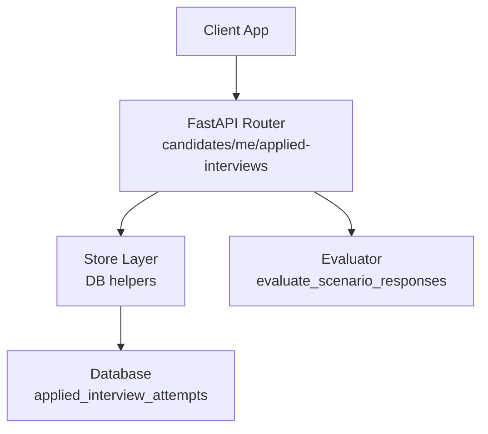
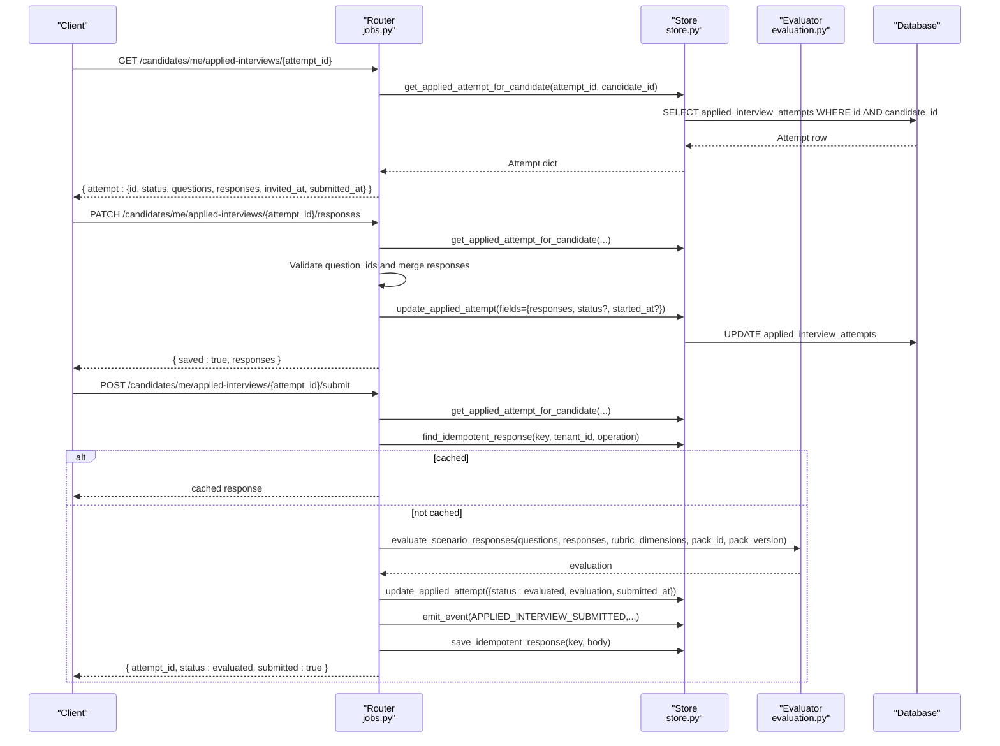
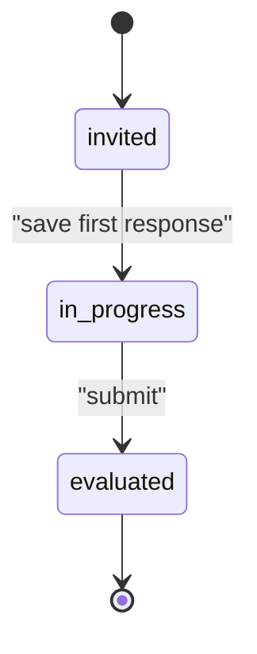
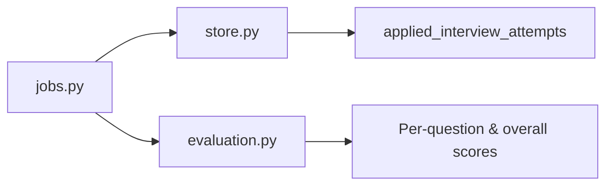

# Applied Interview API

<cite>
**Referenced Files in This Document**
- [jobs.py](file://Backend/app/api/v1/jobs.py)
- [evaluation.py](file://Backend/app/domain/evaluation.py)
- [store.py](file://Backend/app/db/store.py)
</cite>

## Table of Contents
1. [Introduction](#introduction)
2. [Project Structure](#project-structure)
3. [Core Components](#core-components)
4. [Architecture Overview](#architecture-overview)
5. [Detailed Component Analysis](#detailed-component-analysis)
6. [Dependency Analysis](#dependency-analysis)
7. [Performance Considerations](#performance-considerations)
8. [Troubleshooting Guide](#troubleshooting-guide)
9. [Conclusion](#conclusion)

## Introduction
This document provides detailed API documentation for the candidate-facing applied interview endpoints that manage an interview attempt tied to a job application. It covers:
- Retrieving an interview with questions and responses
- Saving partial or updated responses with validation and status transitions
- Submitting the interview for evaluation processing

It also documents the interview question structure, response validation rules, evaluation rubrics, and the state flow from invited to evaluated.

## Project Structure
The applied interview functionality is implemented in the backend under FastAPI routers and domain logic:
- Candidate endpoints are defined in the jobs router under the candidates/me namespace
- Evaluation logic is implemented as a deterministic evaluator
- Persistence helpers are provided by the store module

**Diagram sources**
- [jobs.py:319-452](file://Backend/app/api/v1/jobs.py#L319-L452)
- [evaluation.py:28-132](file://Backend/app/domain/evaluation.py#L28-L132)
- [store.py:1819-1893](file://Backend/app/db/store.py#L1819-L1893)

**Section sources**
- [jobs.py:310-452](file://Backend/app/api/v1/jobs.py#L310-L452)
- [evaluation.py:1-132](file://Backend/app/domain/evaluation.py#L1-L132)
- [store.py:1819-1893](file://Backend/app/db/store.py#L1819-L1893)

## Core Components
- GET /candidates/me/applied-interviews/{attempt_id}
  - Returns the interview attempt details scoped to the authenticated candidate, including sanitized questions and current responses.
- PATCH /candidates/me/applied-interviews/{attempt_id}/responses
  - Saves or updates responses with validation against known question IDs and enforces immutability once submitted. May transition status from invited to in_progress on first save.
- POST /candidates/me/applied-interviews/{attempt_id}/submit
  - Final submission with idempotency support. Runs evaluation using stored questions and rubric dimensions, persists evaluation, emits an event, and returns confirmation.

Key behaviors:
- Questions are stripped of grading keys before being sent to clients
- Responses are merged into existing responses and truncated to a maximum length
- Idempotent submissions prevent duplicate evaluations via idempotency keys
- Status transitions: invited → in_progress (on first save), in_progress → evaluated (on submit)

**Section sources**
- [jobs.py:319-452](file://Backend/app/api/v1/jobs.py#L319-L452)
- [store.py:1819-1893](file://Backend/app/db/store.py#L1819-L1893)

## Architecture Overview
The candidate applies to a job and receives an applied interview attempt. The candidate can view, edit, and submit responses. Submission triggers evaluation and status update.

**Diagram sources**
- [jobs.py:319-452](file://Backend/app/api/v1/jobs.py#L319-L452)
- [evaluation.py:28-132](file://Backend/app/domain/evaluation.py#L28-L132)
- [store.py:1819-1893](file://Backend/app/db/store.py#L1819-L1893)

## Detailed Component Analysis

### Endpoint: GET /candidates/me/applied-interviews/{attempt_id}
- Purpose: Retrieve the interview attempt associated with the authenticated candidate.
- Path parameters:
  - attempt_id: string
- Response fields:
  - attempt.id: string
  - attempt.status: string (invited | in_progress | evaluated)
  - attempt.questions: array of public question objects
  - attempt.responses: object mapping question_id to response text
  - attempt.invited_at: timestamp
  - attempt.submitted_at: timestamp
- Error handling:
  - 404 if the attempt does not exist for this candidate

Notes:
- Questions are returned without grading keys; only id, prompt, and competency are exposed.

**Section sources**
- [jobs.py:319-337](file://Backend/app/api/v1/jobs.py#L319-L337)
- [store.py:1819-1826](file://Backend/app/db/store.py#L1819-L1826)

### Endpoint: PATCH /candidates/me/applied-interviews/{attempt_id}/responses
- Purpose: Save or update responses for an interview attempt.
- Path parameters:
  - attempt_id: string
- Request body:
  - responses: object mapping question_id to response text
- Validation:
  - attempt must exist for the candidate
  - attempt status must be invited or in_progress; otherwise returns 409
  - each question_id must be present in the attempt’s question set; otherwise returns 422
  - response text is truncated to a maximum length
- Behavior:
  - Merges new responses with existing ones
  - If status is invited, transitions to in_progress and sets started_at
  - Persists changes and returns confirmation

Response:
- saved: boolean
- responses: object with merged responses

**Section sources**
- [jobs.py:344-378](file://Backend/app/api/v1/jobs.py#L344-L378)
- [store.py:1882-1893](file://Backend/app/db/store.py#L1882-L1893)

### Endpoint: POST /candidates/me/applied-interviews/{attempt_id}/submit
- Purpose: Finalize the interview attempt and trigger evaluation.
- Path parameters:
  - attempt_id: string
- Request body:
  - idempotency_key: string used to deduplicate repeated submissions
- Validation:
  - attempt must exist for the candidate
  - attempt status must be invited or in_progress; otherwise returns 409
  - idempotency check prevents duplicate processing
- Processing:
  - Loads posting metadata to determine rubric_dimensions and pack identifiers
  - Calls deterministic evaluator with pinned questions and rubric
  - Updates attempt status to evaluated, stores evaluation, and records submitted_at
  - Emits APPLIED_INTERVIEW_SUBMITTED event
  - Caches response for idempotency

Response:
- attempt_id: string
- status: evaluated
- submitted: boolean

**Section sources**
- [jobs.py:385-452](file://Backend/app/api/v1/jobs.py#L385-L452)
- [evaluation.py:28-132](file://Backend/app/domain/evaluation.py#L28-L132)
- [store.py:1882-1893](file://Backend/app/db/store.py#L1882-L1893)

### Interview Question Structure
- Public question object (returned to client):
  - id: string
  - prompt: string
  - competency: string
- Internal question object (used for evaluation):
  - Includes expected_concepts and other grading metadata not exposed to clients

Note:
- The client sees only public fields; grading-related fields are stripped before response.

**Section sources**
- [jobs.py:313-316](file://Backend/app/api/v1/jobs.py#L313-L316)
- [evaluation.py:45-75](file://Backend/app/domain/evaluation.py#L45-L75)

### Response Validation Rules
- Only question_ids present in the attempt’s question set are accepted
- Unknown question_id results in a 422 error
- Response text is truncated to a maximum length to protect storage
- Submissions are immutable after evaluation

**Section sources**
- [jobs.py:362-371](file://Backend/app/api/v1/jobs.py#L362-L371)
- [jobs.py:406-411](file://Backend/app/api/v1/jobs.py#L406-L411)

### Evaluation Rubrics
- Rubric dimensions are loaded from the posting’s question_pool.rubric_dimensions when available
- Default dimensions include:
  - structure
  - reasoning
  - domain_correctness
- Evaluator computes per-question scores and overall score based on coverage, structure, and depth heuristics
- Evaluation includes strengths and gaps derived from per-question scoring thresholds

**Section sources**
- [jobs.py:413-427](file://Backend/app/api/v1/jobs.py#L413-L427)
- [evaluation.py:28-132](file://Backend/app/domain/evaluation.py#L28-L132)

### Status Flow
- invited: Initial state when the candidate is invited to complete the interview
- in_progress: Transitioned upon saving the first response
- evaluated: Final state after successful submission and evaluation

[No sources needed since this diagram shows conceptual workflow, not actual code structure]

## Dependency Analysis
- Router depends on:
  - Store layer for data access and persistence
  - Evaluator for deterministic scoring
- Store layer depends on:
  - Database schema for applied_interview_attempts
  - Idempotency tables for safe retries
- Evaluator depends on:
  - Pinned questions and rubric dimensions to ensure consistent scoring

**Diagram sources**
- [jobs.py:319-452](file://Backend/app/api/v1/jobs.py#L319-L452)
- [evaluation.py:28-132](file://Backend/app/domain/evaluation.py#L28-L132)
- [store.py:1819-1893](file://Backend/app/db/store.py#L1819-L1893)

**Section sources**
- [jobs.py:319-452](file://Backend/app/api/v1/jobs.py#L319-L452)
- [evaluation.py:28-132](file://Backend/app/domain/evaluation.py#L28-L132)
- [store.py:1819-1893](file://Backend/app/db/store.py#L1819-L1893)

## Performance Considerations
- Idempotency reduces redundant evaluations and database writes on retries
- Truncating long responses protects storage and query performance
- Deterministic evaluation avoids external AI latency during submission
- Minimal payload exposure (public questions) reduces bandwidth

[No sources needed since this section provides general guidance]

## Troubleshooting Guide
Common errors and resolutions:
- 404 Not Found: Attempt does not exist for the authenticated candidate
  - Verify attempt_id and authentication context
- 409 Conflict: Attempt already submitted or immutable
  - Check current status; editing is not allowed after evaluation
- 422 Unprocessable Entity: Unknown question_id in responses
  - Ensure all question_ids match those returned by GET endpoint
- Duplicate submissions: Use unique idempotency_key per submission
  - Reusing the same key will return the cached result

Operational notes:
- Events are emitted on successful submission for downstream processing
- Evaluation is deterministic and versioned; results include evaluator and pack versions

**Section sources**
- [jobs.py:354-378](file://Backend/app/api/v1/jobs.py#L354-L378)
- [jobs.py:393-452](file://Backend/app/api/v1/jobs.py#L393-L452)
- [evaluation.py:118-132](file://Backend/app/domain/evaluation.py#L118-L132)

## Conclusion
The applied interview API provides a secure, validated, and idempotent workflow for candidates to complete interviews tied to job applications. It supports viewing, editing, and submitting responses with robust validation and deterministic evaluation. The state machine ensures clear progression from invited to evaluated, while events and idempotency enable reliable integration with downstream systems.

[No sources needed since this section summarizes without analyzing specific files]