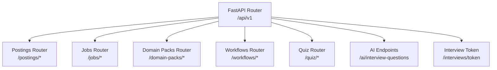
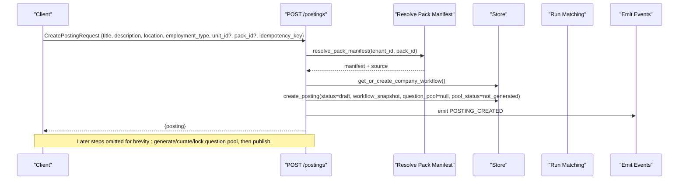
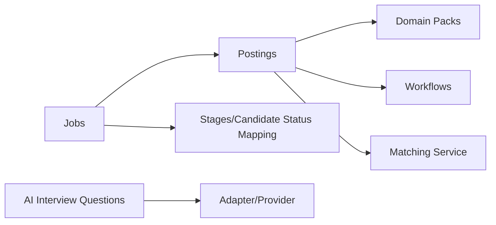

# Job & Posting Management API

<cite>
**Referenced Files in This Document**
- [router.py](file://Backend/app/api/v1/router.py)
- [jobs.py](file://Backend/app/api/v1/jobs.py)
- [postings.py](file://Backend/app/api/v1/postings.py)
- [packs.py](file://Backend/app/api/v1/packs.py)
- [workflows.py](file://Backend/app/api/v1/workflows.py)
- [quiz.py](file://Backend/app/api/v1/quiz.py)
- [ai.py](file://Backend/app/schemas/ai.py)
- [service.py](file://Backend/app/services/ai/service.py)
- [stages.py](file://Backend/app/domain/stages.py)
- [manifest.json (software-engineering)](file://domain-packs/software-engineering/manifest.json)
- [manifest.json (education)](file://domain-packs/education/manifest.json)
</cite>

## Table of Contents
1. [Introduction](#introduction)
2. [Project Structure](#project-structure)
3. [Core Components](#core-components)
4. [Architecture Overview](#architecture-overview)
5. [Detailed Component Analysis](#detailed-component-analysis)
6. [Dependency Analysis](#dependency-analysis)
7. [Performance Considerations](#performance-considerations)
8. [Troubleshooting Guide](#troubleshooting-guide)
9. [Conclusion](#conclusion)
10. [Appendices](#appendices)

## Introduction
This document provides detailed API documentation for job and posting management, including creation, modification, deletion, publishing, and lifecycle transitions. It covers:
- Employer-facing posting management: create, update, publish, close, question pool generation, curation, and locking.
- Candidate-facing job listing and application submission with applied interview flows.
- Domain pack configuration and activation to power question pools and evaluation rubrics.
- Workflow setup and candidate status mapping that drives transitions and public status visibility.
- AI-powered interview question generation endpoints and quiz endpoints.
- Status transitions, approval workflows, and publishing mechanisms tied to domain packs and workflows.

## Project Structure
The API is organized under FastAPI routers grouped by feature area. The main router aggregates all v1 routes, including postings, jobs, domain packs, workflows, interviews, and AI endpoints.

**Diagram sources**
- [router.py:26-40](file://Backend/app/api/v1/router.py#L26-L40)
- [router.py:43-70](file://Backend/app/api/v1/router.py#L43-L70)

**Section sources**
- [router.py:1-71](file://Backend/app/api/v1/router.py#L1-L71)

## Core Components
- Postings: CRUD, publish/close, question pool lifecycle, matching triggers on publish.
- Jobs: Candidate-facing listing, detail, apply, timeline, applied interview participation.
- Domain Packs: List/get/create/update/delete, activate default pack per tenant.
- Workflows: Configure company hiring workflow components; derive stages and candidate status mapping.
- AI Interview Questions: Generate questions via adapter or return disabled/unavailable states.
- Quiz: Simple quiz generation and submission endpoints.

**Section sources**
- [postings.py:48-567](file://Backend/app/api/v1/postings.py#L48-L567)
- [jobs.py:49-452](file://Backend/app/api/v1/jobs.py#L49-L452)
- [packs.py:63-490](file://Backend/app/api/v1/packs.py#L63-L490)
- [workflows.py:60-156](file://Backend/app/api/v1/workflows.py#L60-L156)
- [router.py:59-70](file://Backend/app/api/v1/router.py#L59-L70)
- [quiz.py:29-59](file://Backend/app/api/v1/quiz.py#L29-L59)

## Architecture Overview
End-to-end flow for creating a job posting, generating a question pool from a domain pack, curating it, locking it, and publishing the posting. Publishing also triggers candidate matching based on the active domain pack.

**Diagram sources**
- [postings.py:81-180](file://Backend/app/api/v1/postings.py#L81-L180)
- [packs.py:41-60](file://Backend/app/api/v1/packs.py#L41-L60)

**Section sources**
- [postings.py:81-180](file://Backend/app/api/v1/postings.py#L81-L180)
- [packs.py:41-60](file://Backend/app/api/v1/packs.py#L41-L60)

## Detailed Component Analysis

### Postings API
- List postings: GET /postings
  - Returns tenant-scoped postings with application counts.
- Get posting: GET /postings/{posting_id}
  - Returns full posting details and application count.
- Create posting: POST /postings
  - Requires role-based access.
  - Validates optional unit_id if provided.
  - Pins domain pack at creation time; uses active pack if none specified.
  - Ensures a company workflow exists; pins workflow snapshot to posting.
  - Initializes question_pool as null and pool_status as not_generated.
  - Emits POSTING_CREATED event and persists idempotent response.
- Update posting: PATCH /postings/{posting_id}
  - Only draft postings can be edited; updates title, description, location, employment_type.
  - Audits changes.
- Publish posting: POST /postings/{posting_id}/publish
  - Requires draft status, workflow snapshot present, and question pool locked.
  - Sets status to published and timestamp.
  - Optionally runs matching using the pinned pack manifest; emits POSTING_MATCHES_GENERATED.
  - Emits POSTING_PUBLISHED event.
- Close posting: POST /postings/{posting_id}/close
  - Prevents re-closing; sets status closed and timestamp.
  - Emits POSTING_CLOSED event.
- Question pool generation: POST /postings/{posting_id}/question-pool/generate
  - Requires generated state and pinned pack; samples questions from pack’s applied_interview block.
  - Stores pool with status generated and rubric dimensions from pack.
- Curate question pool: PATCH /postings/{posting_id}/question-pool
  - Requires generated or curated state; validates each question has id, prompt, competency.
  - Updates pool and sets status curated.
- Lock question pool: POST /postings/{posting_id}/question-pool/lock
  - Requires existing pool and not already locked; sets pool status locked and timestamp.
  - Emits QUESTION_POOL_LOCKED event.

Statuses and constraints:
- Posting status: draft -> published -> closed.
- Pool status: not_generated -> generated -> curated -> locked.
- Publishing requires pool_status == locked and workflow_snapshot present.

**Section sources**
- [postings.py:48-567](file://Backend/app/api/v1/postings.py#L48-L567)

### Jobs API (Candidate-Facing)
- List jobs: GET /jobs
  - Lists published postings; marks already_applied per candidate context.
- Get job: GET /jobs/{posting_id}
  - Returns job body with organization name, published_at, requires_applied_interview flag, and candidate process order.
- Apply: POST /applications
  - Validates posting is open; checks idempotency key; prevents duplicate applications.
  - Creates application with stage set to entry stage category new; stores profile snapshot and score.
  - Emits APPLICATION_CREATED event; returns application summary.
- My matches: GET /candidates/me/matches
  - Returns matches for current candidate.
- My applications: GET /candidates/me/applications
  - Returns applications with mapped candidate status and optional applied interview attempt info.
- Application timeline: GET /candidates/me/applications/{application_id}/timeline
  - Derives candidate-safe steps from transition log and maps internal stages to public statuses.
  - Provides next_action guidance based on current status and applied interview state.
- Applied interview:
  - GET /candidates/me/applied-interviews/{attempt_id}: returns attempt with public questions and responses.
  - PATCH /candidates/me/applied-interviews/{attempt_id}/responses: save partial or final responses; validates question IDs; transitions invited -> in_progress on first save.
  - POST /candidates/me/applied-interviews/{attempt_id}/submit: submit answers; evaluates responses using rubric dimensions; sets status evaluated; emits APPLIED_INTERVIEW_SUBMITTED.

Candidate status mapping:
- Internal stages map to one of four public statuses: Application received, Under review, Interview, Decision.
- Mapping derived from workflow_snapshot.candidate_status_mapping.

**Section sources**
- [jobs.py:49-452](file://Backend/app/api/v1/jobs.py#L49-L452)
- [stages.py:32-44](file://Backend/app/domain/stages.py#L32-L44)

### Domain Packs API
- List packs: GET /domain-packs
  - Combines builtin packs from registry with custom tenant packs; includes linked job counts.
- Get pack: GET /domain-packs/{pack_id}
  - Resolves builtin or custom pack; returns manifest and summary.
- Create pack: POST /domain-packs
  - Admin-only; validates uniqueness against builtin and tenant; builds manifest with ontology, interview blocks, rubric dimensions, task styles, and matching weights.
  - Validates manifest schema; persists and audits.
- Update pack: PATCH /domain-packs/{pack_id}
  - Admin-only; merges fields with existing manifest; bumps version if not provided; validates and persists.
- Delete pack: DELETE /domain-packs/{pack_id}
  - Admin-only; prevents deletion of builtin packs; disallows deletion if any postings link to it.
- Activate pack: POST /organizations/current/domain-packs/activations
  - Admin-only; activates a pack for the tenant; records previous activation; emits DOMAIN_PACK_ACTIVATED.
- Get active pack: GET /organizations/current/domain-packs/active
  - Returns current activation metadata and display name.

Manifest structure highlights:
- Required keys include pack_id, pack_version, display_name, ontology, matching_weights, profile_interview, applied_interview, evaluation_rubric.
- Each interview block contains task_style, question_count, and questions with id, prompt, competency.
- Rubric dimensions define evaluation criteria used during scoring.

Example packs:
- Software Engineering: scenario-style questions covering incident response, API design, system design, collaboration, observability, architecture judgment.
- Education: scenario-style questions covering curriculum design, assessment, academic integrity, engagement, inclusive teaching, continuous improvement.

**Section sources**
- [packs.py:63-490](file://Backend/app/api/v1/packs.py#L63-L490)
- [manifest.json (software-engineering):1-140](file://domain-packs/software-engineering/manifest.json#L1-L140)
- [manifest.json (education):1-143](file://domain-packs/education/manifest.json#L1-L143)

### Workflows API
- List components: GET /workflows/components
  - Returns available workflow components and fixed stages required in every workflow.
- List workflows: GET /workflows
  - Returns stored workflows for tenant.
- Get current/active workflow: GET /workflows/current or /workflows/active
  - Returns current workflow with inferred components and fixed stages.
- Upsert workflow: PUT /workflows/current
  - Admin-only; builds stages from selected components; validates stages and candidate status mapping; persists and audits.
- Ensure workflow exists: POST /workflows
  - Admin-only; creates default workflow if none exists; audits creation.

Workflow rules:
- Stages must be assembled from fixed anchors plus catalog components; no custom stage IDs allowed.
- Candidate status mapping must map each stage to one of the four public statuses.
- Valid transitions are enforced by stage categories and pipeline order.

**Section sources**
- [workflows.py:60-156](file://Backend/app/api/v1/workflows.py#L60-L156)
- [stages.py:76-175](file://Backend/app/domain/stages.py#L76-L175)
- [stages.py:212-300](file://Backend/app/domain/stages.py#L212-L300)

### AI Interview Question Generation
- Endpoint: POST /api/v1/ai/interview-questions
  - Request schema includes domain_context, competencies, question_count, pack_version, rubric_version.
  - Service attempts to generate via configured adapter; validates provider output count and competencies.
  - Returns status: generated, disabled, or unavailable; includes metadata and human review flags.

Behavior:
- If no AI provider configured, returns disabled with reason and requires_human_review true.
- On provider errors or invalid outputs, returns unavailable with reason and requires_human_review true.
- On success, returns generated questions aligned to requested competencies and count.

**Section sources**
- [router.py:59-70](file://Backend/app/api/v1/router.py#L59-L70)
- [ai.py:6-52](file://Backend/app/schemas/ai.py#L6-L52)
- [service.py:13-86](file://Backend/app/services/ai/service.py#L13-L86)

### Quiz API
- Generate quiz: POST /quiz/generate
  - Accepts job_id and domain; returns mock quiz questions tailored to domain.
- Submit quiz: POST /quiz/submit
  - Accepts quiz_id and answers; returns mock score and pass/fail result.

Note: These endpoints provide placeholder behavior suitable for prototyping.

**Section sources**
- [quiz.py:29-59](file://Backend/app/api/v1/quiz.py#L29-L59)

## Dependency Analysis
Key dependencies and interactions:
- Postings depend on domain packs for question pool content and rubric dimensions.
- Postings depend on workflows for stage definitions and candidate status mapping.
- Publishing triggers matching using the pinned pack manifest.
- Jobs read published postings and use workflow snapshots to compute candidate-visible statuses.
- AI service depends on configured adapter; otherwise returns disabled/unavailable states.

**Diagram sources**
- [postings.py:231-328](file://Backend/app/api/v1/postings.py#L231-L328)
- [packs.py:41-60](file://Backend/app/api/v1/packs.py#L41-L60)
- [workflows.py:91-122](file://Backend/app/api/v1/workflows.py#L91-L122)
- [jobs.py:28-31](file://Backend/app/api/v1/jobs.py#L28-L31)
- [router.py:59-70](file://Backend/app/api/v1/router.py#L59-L70)

**Section sources**
- [postings.py:231-328](file://Backend/app/api/v1/postings.py#L231-L328)
- [packs.py:41-60](file://Backend/app/api/v1/packs.py#L41-L60)
- [workflows.py:91-122](file://Backend/app/api/v1/workflows.py#L91-L122)
- [jobs.py:28-31](file://Backend/app/api/v1/jobs.py#L28-L31)
- [router.py:59-70](file://Backend/app/api/v1/router.py#L59-L70)

## Performance Considerations
- Idempotency keys prevent duplicate operations for create posting and apply/submit actions.
- Question pool generation samples a limited number of questions from the pack to avoid large payloads.
- Matching runs only on publish and may be skipped if pack resolution fails; publishing still succeeds.
- Candidate timeline computation reads transition logs and maps to public statuses efficiently.

[No sources needed since this section provides general guidance]

## Troubleshooting Guide
Common errors and resolutions:
- Domain pack required when creating a posting: ensure pack_id is provided or an active pack exists for the tenant.
- Workflow required before publishing: configure a company workflow and pin it to the posting.
- Question pool missing or locked: generate and curate the pool, then lock it before publishing.
- Posting not editable: only draft postings can be updated; close and recreate if necessary.
- Duplicate application: candidate already applied; check application status instead.
- Unknown question in applied interview responses: validate question IDs against the attempt’s questions.
- AI question generation disabled/unavailable: verify provider configuration; fall back to manual review.

**Section sources**
- [postings.py:96-122](file://Backend/app/api/v1/postings.py#L96-L122)
- [postings.py:249-260](file://Backend/app/api/v1/postings.py#L249-L260)
- [postings.py:405-416](file://Backend/app/api/v1/postings.py#L405-L416)
- [postings.py:471-490](file://Backend/app/api/v1/postings.py#L471-L490)
- [postings.py:524-536](file://Backend/app/api/v1/postings.py#L524-L536)
- [jobs.py:107-125](file://Backend/app/api/v1/jobs.py#L107-L125)
- [jobs.py:362-371](file://Backend/app/api/v1/jobs.py#L362-L371)
- [service.py:52-78](file://Backend/app/services/ai/service.py#L52-L78)

## Conclusion
The Job & Posting Management API provides a robust framework for managing hiring workflows through domain packs and configurable workflows. Employers can create and curate question pools, lock them for consistency, and publish postings that trigger candidate matching. Candidates interact with published jobs, apply, and complete applied interviews with transparent status tracking. AI-powered question generation supports flexible content creation while maintaining safety and review controls.

[No sources needed since this section summarizes without analyzing specific files]

## Appendices

### API Endpoints Summary
- Postings
  - GET /postings
  - GET /postings/{posting_id}
  - POST /postings
  - PATCH /postings/{posting_id}
  - POST /postings/{posting_id}/publish
  - POST /postings/{posting_id}/close
  - POST /postings/{posting_id}/question-pool/generate
  - PATCH /postings/{posting_id}/question-pool
  - POST /postings/{posting_id}/question-pool/lock
- Jobs (Candidate)
  - GET /jobs
  - GET /jobs/{posting_id}
  - POST /applications
  - GET /candidates/me/matches
  - GET /candidates/me/applications
  - GET /candidates/me/applications/{application_id}/timeline
  - GET /candidates/me/applied-interviews/{attempt_id}
  - PATCH /candidates/me/applied-interviews/{attempt_id}/responses
  - POST /candidates/me/applied-interviews/{attempt_id}/submit
- Domain Packs
  - GET /domain-packs
  - GET /domain-packs/{pack_id}
  - POST /domain-packs
  - PATCH /domain-packs/{pack_id}
  - DELETE /domain-packs/{pack_id}
  - POST /organizations/current/domain-packs/activations
  - GET /organizations/current/domain-packs/active
- Workflows
  - GET /workflows/components
  - GET /workflows
  - GET /workflows/current
  - GET /workflows/active
  - PUT /workflows/current
  - POST /workflows
- AI and Interviews
  - POST /api/v1/ai/interview-questions
  - POST /api/v1/interviews/token
- Quiz
  - POST /quiz/generate
  - POST /quiz/submit

**Section sources**
- [postings.py:48-567](file://Backend/app/api/v1/postings.py#L48-L567)
- [jobs.py:49-452](file://Backend/app/api/v1/jobs.py#L49-L452)
- [packs.py:63-490](file://Backend/app/api/v1/packs.py#L63-L490)
- [workflows.py:60-156](file://Backend/app/api/v1/workflows.py#L60-L156)
- [router.py:43-70](file://Backend/app/api/v1/router.py#L43-L70)
- [quiz.py:29-59](file://Backend/app/api/v1/quiz.py#L29-L59)