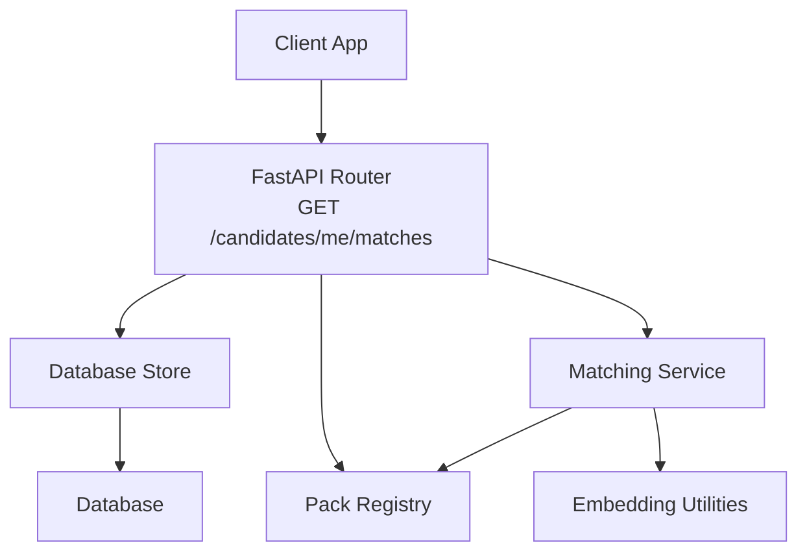
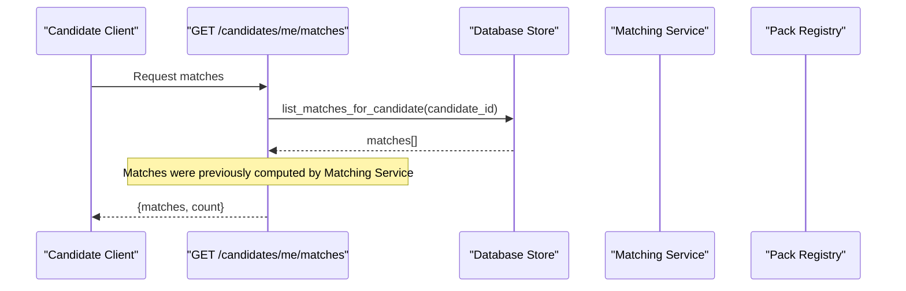
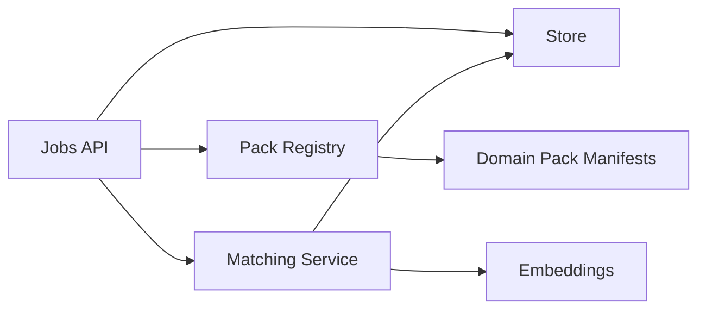

# Job Matching & Candidate Features

<cite>
**Referenced Files in This Document**
- [jobs.py](file://Backend/app/api/v1/jobs.py)
- [matching.py](file://Backend/app/services/matching.py)
- [stages.py](file://Backend/app/domain/stages.py)
- [candidates.py](file://Backend/app/api/v1/candidates.py)
- [packs.py](file://Backend/app/services/packs.py)
- [manifest.json (software-engineering)](file://domain-packs/software-engineering/manifest.json)
- [manifest.json (education)](file://domain-packs/education/manifest.json)
</cite>

## Table of Contents
1. Introduction
2. Project Structure
3. Core Components
4. Architecture Overview
5. Detailed Component Analysis
6. Dependency Analysis
7. Performance Considerations
8. Troubleshooting Guide
9. Conclusion

## Introduction
This document provides API documentation for job matching and candidate-specific features, focusing on the GET /candidates/me/matches endpoint that returns job matches tailored to a candidate’s profile and skills. It explains how candidate status mapping works via workflow snapshots, how internal stages are translated into candidate-friendly statuses, and how match scoring combines skill alignment, embeddings, and domain packs to produce recommendations. It also clarifies the relationship between candidate profiles, job requirements, and the matching algorithms used by the system.

## Project Structure
The matching feature spans several modules:
- API endpoints expose candidate-facing operations, including retrieving matches and applications.
- A matching service computes scores using embeddings and skill overlap, with configurable weights per domain pack.
- Domain packs define ontologies, interview questions, and evaluation rubrics that influence matching and assessment.
- Workflow stages define internal pipeline steps and map them to candidate-visible statuses.

**Diagram sources**
- [jobs.py:182-189](file://Backend/app/api/v1/jobs.py#L182-L189)
- [matching.py:115-187](file://Backend/app/services/matching.py#L115-L187)
- [packs.py:64-96](file://Backend/app/services/packs.py#L64-L96)

**Section sources**
- [jobs.py:1-452](file://Backend/app/api/v1/jobs.py#L1-L452)
- [matching.py:1-345](file://Backend/app/services/matching.py#L1-L345)
- [packs.py:1-97](file://Backend/app/services/packs.py#L1-L97)

## Core Components
- Candidate Matches Endpoint: Returns precomputed matches for the authenticated candidate.
- Matching Algorithm: Combines embedding similarity and skill overlap; integrates interview scores; applies domain pack weights and target domain boosts.
- Domain Packs: Provide ontology skills, matching weights, and interview content that shape scoring and assessments.
- Workflow Stages and Status Mapping: Internal stages are mapped to candidate-friendly statuses via workflow snapshots.

Key responsibilities:
- The API layer exposes simple, secure endpoints for candidates.
- The matching service encapsulates scoring logic and ensures only eligible candidates are considered.
- Domain packs supply domain-specific signals and weights.
- Stage definitions ensure consistent, safe status presentation to candidates.

**Section sources**
- [jobs.py:182-189](file://Backend/app/api/v1/jobs.py#L182-L189)
- [matching.py:115-187](file://Backend/app/services/matching.py#L115-L187)
- [stages.py:32-44](file://Backend/app/domain/stages.py#L32-L44)
- [packs.py:15-24](file://Backend/app/services/packs.py#L15-L24)

## Architecture Overview
The candidate requests their matches. The endpoint retrieves stored matches from the database and returns them. Matches are generated by a background or proactive process that scores candidates against published postings using embeddings and skill overlap, influenced by domain packs and interview performance.

**Diagram sources**
- [jobs.py:182-189](file://Backend/app/api/v1/jobs.py#L182-L189)
- [matching.py:190-287](file://Backend/app/services/matching.py#L190-L287)
- [packs.py:64-96](file://Backend/app/services/packs.py#L64-L96)

## Detailed Component Analysis

### GET /candidates/me/matches
- Purpose: Retrieve job matches relevant to the current candidate based on their profile, skills, and prior assessments.
- Behavior: Reads precomputed matches from storage and returns them along with a count.
- Eligibility: Only candidates who have granted discovery consent and do not already have an application for a posting are included in proactive matches.

Response fields:
- matches: Array of match objects produced by the matching service.
- count: Number of matches returned.

Notes:
- The endpoint does not compute scores on demand; it returns results from the matching pipeline.
- Applications and timeline endpoints use workflow snapshots to present candidate-friendly statuses.

**Section sources**
- [jobs.py:182-189](file://Backend/app/api/v1/jobs.py#L182-L189)
- [matching.py:115-187](file://Backend/app/services/matching.py#L115-L187)

### Candidate Status Mapping and Workflow Snapshots
- Internal stages are defined by fixed anchors and catalog components.
- Each stage belongs to a category (new, review, assessment, offer, hired, rejected, withdrawn, closed).
- Candidate-facing statuses are derived from categories: Application received, Under review, Interview, Decision.
- Workflow snapshots store a mapping from internal stage IDs to candidate-friendly statuses. If a mapping is missing, a default “Under review” is used.

How it works:
- When listing applications or building timelines, the API reads the posting’s workflow_snapshot.candidate_status_mapping to translate internal stage IDs into visible statuses.
- The timeline endpoint constructs steps using the canonical order and maps transition timestamps to these statuses.

**Section sources**
- [stages.py:32-44](file://Backend/app/domain/stages.py#L32-L44)
- [stages.py:189-193](file://Backend/app/domain/stages.py#L189-L193)
- [jobs.py:28-31](file://Backend/app/api/v1/jobs.py#L28-L31)
- [jobs.py:240-307](file://Backend/app/api/v1/jobs.py#L240-L307)

### Matching Algorithm: Scoring, Skill Alignment, and Domain Packs
- Inputs:
  - Candidate profile and parsed CV text for embedding.
  - Posting title, description, and optional requirements for embedding and tokenization.
  - Domain pack manifest containing ontology skills, matching_weights, and interview content.
  - Best profile interview score for the relevant pack.
- Steps:
  - Ensure posting and candidate embeddings exist; generate if missing.
  - Compute skill overlap using candidate skills vs pack ontology and posting tokens.
  - Prefer the stronger signal between embedding similarity and skill overlap.
  - Blend CV score and interview score using domain pack weights.
  - Boost score when candidate targets the pack’s domain.
  - Apply thresholding and return reasons explaining the match.

Match scoring details:
- cv_match weight and profile_interview_score weight come from the domain pack manifest; defaults apply if unspecified.
- Interview component contributes proportionally based on normalized weights.
- Reasons include embedding similarity percentage, matched skills, interview score context, and target domain boost.

Eligibility and privacy:
- Only candidates with discovery consent are considered.
- Candidates who already applied to a posting are excluded from proactive matches.

**Section sources**
- [matching.py:27-53](file://Backend/app/services/matching.py#L27-L53)
- [matching.py:55-112](file://Backend/app/services/matching.py#L55-L112)
- [matching.py:115-187](file://Backend/app/services/matching.py#L115-L187)
- [matching.py:190-287](file://Backend/app/services/matching.py#L190-L287)

### Domain Packs Influence on Recommendations
- Ontology skills define the domain-specific vocabulary used for skill overlap calculations.
- Matching weights determine how much CV/skill signals versus interview performance contribute to the final score.
- Profile and applied interview question sets provide assessment content that influences interview scores used in matching.
- Example packs:
  - Software Engineering Pack: Skills like system design, API design, backend/frontend engineering, testing, CI/CD, observability, security basics, etc.
  - Education Pack: Skills like curriculum design, lesson planning, student assessment, pedagogy, educational technology, data science, machine learning, cybersecurity, statistics.

These manifests directly affect both matching and assessment outcomes.

**Section sources**
- [manifest.json (software-engineering):1-140](file://domain-packs/software-engineering/manifest.json#L1-L140)
- [manifest.json (education):1-143](file://domain-packs/education/manifest.json#L1-L143)
- [packs.py:15-24](file://Backend/app/services/packs.py#L15-L24)

### Relationship Between Candidate Profiles, Job Requirements, and Algorithms
- Candidate profile includes headline, summary, skills, credentials, experiences, availability, and target domains.
- Parsed CV text augments the profile for embedding generation and skill extraction hints.
- Job requirements are represented by posting metadata and embedded alongside description text.
- The algorithm aligns candidate signals with job signals through:
  - Embedding similarity (vector space).
  - Skill overlap against domain ontology and posting tokens.
  - Interview performance within the relevant domain pack.
  - Target domain preference boosting.

This ensures recommendations reflect both explicit skills and contextual relevance.

**Section sources**
- [candidates.py:34-46](file://Backend/app/api/v1/candidates.py#L34-L46)
- [candidates.py:72-102](file://Backend/app/api/v1/candidates.py#L72-L102)
- [matching.py:115-187](file://Backend/app/services/matching.py#L115-L187)

## Dependency Analysis
The matching pipeline depends on:
- Database store for reading/writing candidates, postings, applications, and matches.
- Embedding utilities for generating and comparing vectors.
- Pack registry for loading domain manifests and validating structure.
- Evaluation services for computing interview scores.

**Diagram sources**
- [jobs.py:182-189](file://Backend/app/api/v1/jobs.py#L182-L189)
- [matching.py:190-287](file://Backend/app/services/matching.py#L190-L287)
- [packs.py:64-96](file://Backend/app/services/packs.py#L64-L96)

**Section sources**
- [matching.py:190-287](file://Backend/app/services/matching.py#L190-L287)
- [packs.py:64-96](file://Backend/app/services/packs.py#L64-L96)

## Performance Considerations
- Embedding reuse: Postings and candidates cache embeddings to avoid recomputation; ensure embeddings are refreshed after profile updates.
- Thresholding and limits: Matches below threshold or beyond maximum counts are filtered to reduce noise and load.
- Weight normalization: Weights are normalized to prevent dominance by one component; tune domain pack weights for balanced scoring.
- Consent gating: Discovery consent reduces unnecessary processing for non-participating candidates.

[No sources needed since this section provides general guidance]

## Troubleshooting Guide
Common issues and resolutions:
- No matches returned:
  - Verify discovery consent is granted.
  - Check that candidate has sufficient profile/CV content to generate embeddings.
  - Confirm posting has valid embedding and domain pack configuration.
- Low match scores:
  - Review skill overlap and ontology alignment.
  - Improve profile skills and target domains.
  - Complete domain-specific profile interviews to raise interview component.
- Status mapping inconsistencies:
  - Ensure workflow_snapshot.candidate_status_mapping covers all stages.
  - Validate stage IDs and mappings against canonical statuses.

**Section sources**
- [matching.py:115-187](file://Backend/app/services/matching.py#L115-L187)
- [jobs.py:28-31](file://Backend/app/api/v1/jobs.py#L28-L31)
- [stages.py:189-193](file://Backend/app/domain/stages.py#L189-L193)

## Conclusion
The GET /candidates/me/matches endpoint delivers personalized job recommendations by combining candidate profile signals, job descriptions, and domain pack knowledge. The matching algorithm balances embedding similarity and skill overlap while incorporating interview performance and target domain preferences. Candidate status mapping ensures a clear, consistent view of application progress without exposing internal stages. Properly configured domain packs and robust profile data lead to more accurate and actionable matches.

[No sources needed since this section summarizes without analyzing specific files]