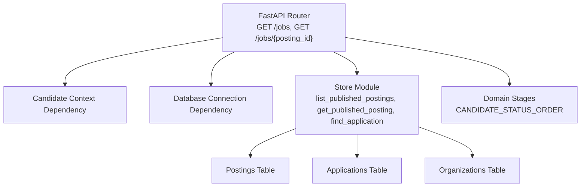
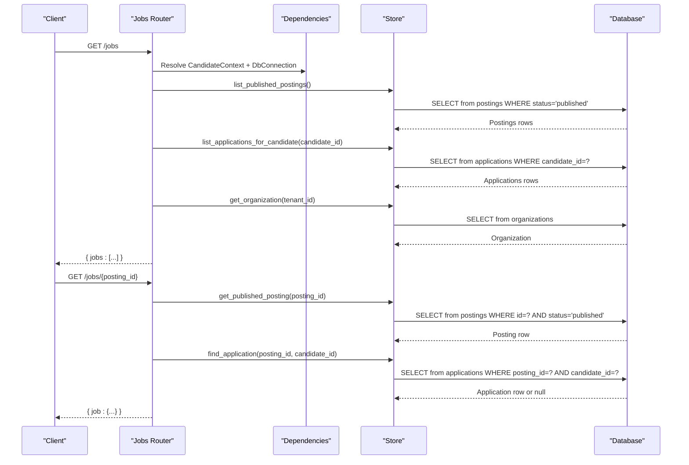
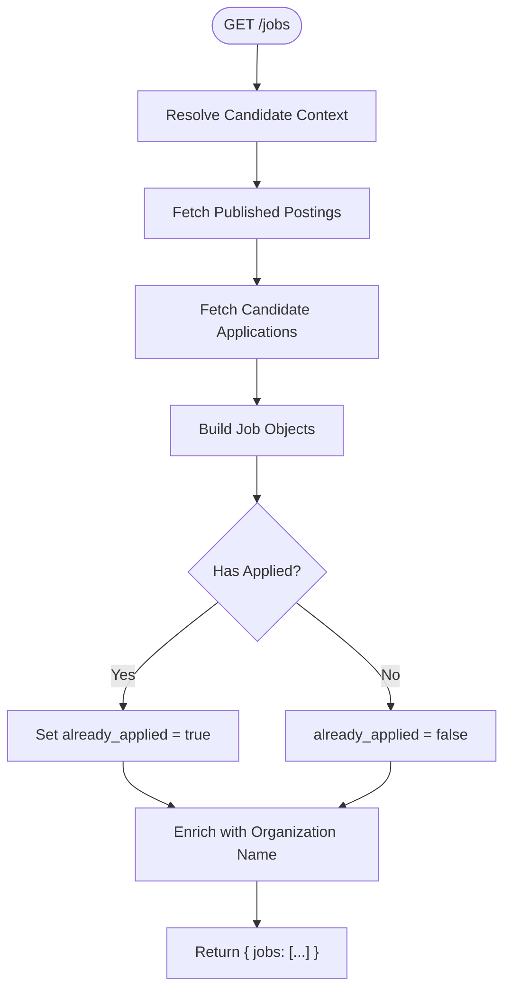
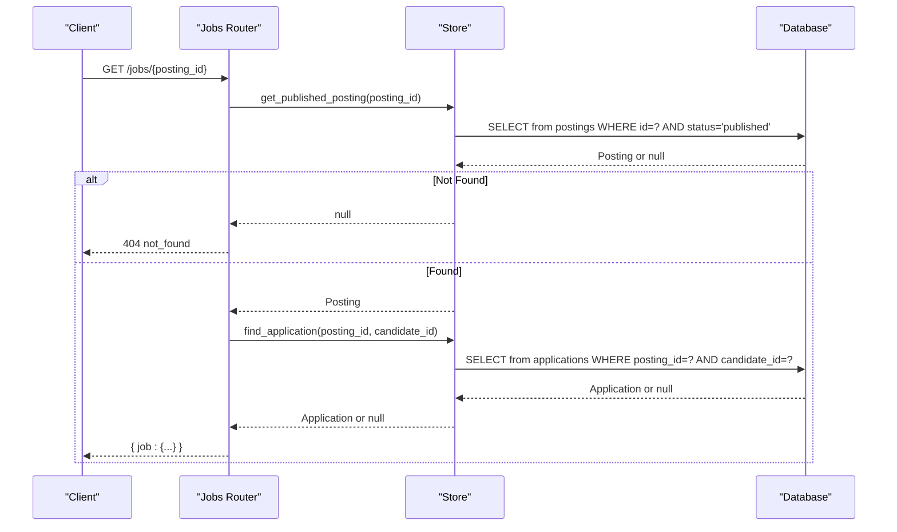
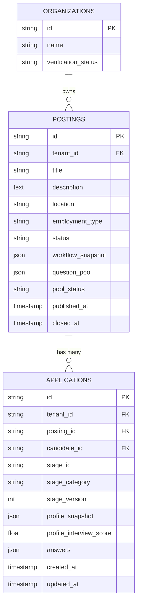
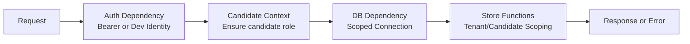

# Job Posting Endpoints

<cite>
**Referenced Files in This Document**
- [jobs.py](file://Backend/app/api/v1/jobs.py)
- [postings.py](file://Backend/app/api/v1/postings.py)
- [dependencies.py](file://Backend/app/api/dependencies.py)
- [errors.py](file://Backend/app/core/errors.py)
- [stages.py](file://Backend/app/domain/stages.py)
- [store.py](file://Backend/app/db/store.py)
</cite>

## Table of Contents
1. [Introduction](#introduction)
2. [Project Structure](#project-structure)
3. [Core Components](#core-components)
4. [Architecture Overview](#architecture-overview)
5. [Detailed Component Analysis](#detailed-component-analysis)
6. [Dependency Analysis](#dependency-analysis)
7. [Performance Considerations](#performance-considerations)
8. [Troubleshooting Guide](#troubleshooting-guide)
9. [Conclusion](#conclusion)

## Introduction
This document provides detailed API documentation for candidate-facing job posting endpoints that list and retrieve published jobs with candidate context. It covers:
- GET /jobs: listing published jobs, including whether the candidate has already applied and organization information
- GET /jobs/{posting_id}: retrieving a specific job’s details with application state
It also explains authentication requirements, request/response schemas, error handling patterns, and how candidate-specific information is included in responses.

## Project Structure
The candidate job endpoints are implemented under the v1 API router and rely on shared dependencies for database connections, authentication, and tenant scoping. Data access is centralized in a store module, while domain logic (such as candidate status mapping) is defined in a stages module.

**Diagram sources**
- [jobs.py:49-77](file://Backend/app/api/v1/jobs.py#L49-L77)
- [dependencies.py:178-201](file://Backend/app/api/dependencies.py#L178-L201)
- [store.py:1593-1617](file://Backend/app/db/store.py#L1593-L1617)
- [store.py:1679-1711](file://Backend/app/db/store.py#L1679-L1711)
- [stages.py:32-44](file://Backend/app/domain/stages.py#L32-L44)

**Section sources**
- [jobs.py:1-77](file://Backend/app/api/v1/jobs.py#L1-L77)
- [dependencies.py:178-201](file://Backend/app/api/dependencies.py#L178-L201)
- [store.py:1593-1711](file://Backend/app/db/store.py#L1593-L1711)
- [stages.py:32-44](file://Backend/app/domain/stages.py#L32-L44)

## Core Components
- Candidate-facing job endpoints:
  - GET /jobs: returns all published postings with an already_applied flag per job based on the authenticated candidate’s applications.
  - GET /jobs/{posting_id}: returns a single published posting with application existence and application_id if applicable.
- Candidate context dependency ensures the caller is a candidate (not an employer account) and resolves their candidate profile.
- Store functions provide tenant-scoped or cross-tenant reads appropriate to each endpoint.
- Domain stages define the canonical candidate-facing statuses used to map internal workflow stages to candidate-visible states.

Key responsibilities:
- Authentication and authorization via bearer tokens or development identity headers
- Tenant scoping and role checks where needed
- Candidate-only visibility into published postings
- Enrichment of job data with organization name and candidate process steps

**Section sources**
- [jobs.py:49-77](file://Backend/app/api/v1/jobs.py#L49-L77)
- [dependencies.py:49-111](file://Backend/app/api/dependencies.py#L49-L111)
- [dependencies.py:178-201](file://Backend/app/api/dependencies.py#L178-L201)
- [store.py:1593-1711](file://Backend/app/db/store.py#L1593-L1711)
- [stages.py:32-44](file://Backend/app/domain/stages.py#L32-L44)

## Architecture Overview
The candidate job endpoints follow a layered architecture:
- API layer (FastAPI routers) defines routes and response shapes
- Dependencies resolve authentication, user/candidate context, and DB connections
- Store layer performs tenant-scoped queries against Postgres tables
- Domain layer defines canonical candidate statuses and mappings

**Diagram sources**
- [jobs.py:49-77](file://Backend/app/api/v1/jobs.py#L49-L77)
- [store.py:1593-1711](file://Backend/app/db/store.py#L1593-L1711)
- [dependencies.py:178-201](file://Backend/app/api/dependencies.py#L178-L201)

## Detailed Component Analysis

### GET /jobs
Lists all published job postings with candidate context. For each job, it indicates whether the candidate has already applied and includes organization information.

- Path: /jobs
- Method: GET
- Authentication: Required (Bearer token or development identity header). Candidate context enforced; employer accounts cannot use this endpoint.
- Request parameters: None
- Response schema:
  - jobs: array of job objects
    - id: string
    - title: string
    - description: string
    - location: string
    - employment_type: string
    - organization_name: string
    - published_at: string (timestamp)
    - requires_applied_interview: boolean (true when pool_status == "locked")
    - candidate_process: array of strings representing canonical candidate statuses
    - already_applied: boolean (true if candidate has an application for this posting)

Processing logic:
- Retrieves all published postings
- Retrieves candidate’s applications
- Builds job bodies and sets already_applied based on matching posting IDs
- Enriches with organization name and candidate process order

**Diagram sources**
- [jobs.py:49-61](file://Backend/app/api/v1/jobs.py#L49-L61)
- [store.py:1613-1617](file://Backend/app/db/store.py#L1613-L1617)
- [store.py:1704-1711](file://Backend/app/db/store.py#L1704-L1711)

**Section sources**
- [jobs.py:49-61](file://Backend/app/api/v1/jobs.py#L49-L61)
- [store.py:1613-1617](file://Backend/app/db/store.py#L1613-L1617)
- [store.py:1704-1711](file://Backend/app/db/store.py#L1704-L1711)
- [dependencies.py:178-201](file://Backend/app/api/dependencies.py#L178-L201)

### GET /jobs/{posting_id}
Retrieves a specific published job with application state for the current candidate.

- Path: /jobs/{posting_id}
- Method: GET
- Path parameter:
  - posting_id: string (required)
- Authentication: Required (same as above)
- Response schema:
  - job: object
    - id: string
    - title: string
    - description: string
    - location: string
    - employment_type: string
    - organization_name: string
    - published_at: string (timestamp)
    - requires_applied_interview: boolean
    - candidate_process: array of strings
    - already_applied: boolean
    - application_id: string or null (present if candidate has applied)

Processing logic:
- Fetches the published posting by ID
- If not found, raises a 404 error
- Builds job body and checks for existing application for the candidate
- Sets already_applied and application_id accordingly

**Diagram sources**
- [jobs.py:64-77](file://Backend/app/api/v1/jobs.py#L64-L77)
- [store.py:1593-1598](file://Backend/app/db/store.py#L1593-L1598)
- [store.py:1679-1686](file://Backend/app/db/store.py#L1679-L1686)

**Section sources**
- [jobs.py:64-77](file://Backend/app/api/v1/jobs.py#L64-L77)
- [store.py:1593-1598](file://Backend/app/db/store.py#L1593-L1598)
- [store.py:1679-1686](file://Backend/app/db/store.py#L1679-L1686)

### Relationship Between Postings and Applications
- A posting represents a published job opportunity owned by an organization (tenant).
- An application links a candidate to a posting and records the stage and metadata at application time.
- The endpoints enrich job listings with candidate-specific flags (already_applied) and application identifiers when present.
- Candidate status mapping translates internal workflow stages into visible statuses like “Application received”, “Under review”, “Interview”, and “Decision”.

**Diagram sources**
- [store.py:1568-1617](file://Backend/app/db/store.py#L1568-L1617)
- [store.py:1648-1711](file://Backend/app/db/store.py#L1648-L1711)

**Section sources**
- [store.py:1568-1711](file://Backend/app/db/store.py#L1568-L1711)
- [stages.py:32-44](file://Backend/app/domain/stages.py#L32-L44)

### Candidate-Specific Information in Responses
- already_applied: Indicates whether the candidate has submitted an application for the job
- application_id: Present only when the candidate has applied; identifies the application record
- organization_name: Enriched from the organization associated with the posting’s tenant
- candidate_process: Canonical list of candidate-visible statuses derived from domain stages

These fields enable clients to:
- Show application status indicators
- Navigate to application details when available
- Display consistent candidate-facing status labels

**Section sources**
- [jobs.py:34-46](file://Backend/app/api/v1/jobs.py#L34-L46)
- [jobs.py:64-77](file://Backend/app/api/v1/jobs.py#L64-L77)
- [stages.py:32-44](file://Backend/app/domain/stages.py#L32-L44)

## Dependency Analysis
Authentication and context resolution:
- Bearer token validation or development identity header
- Candidate context ensures the caller is not an employer account and resolves candidate profile
- Database connection provided per request lifecycle

Data access:
- Cross-tenant read for published postings (candidates can see any published job)
- Tenant-scoped reads for organization info and candidate applications
- Application lookups scoped by candidate_id and posting_id

Error handling:
- ApiError exceptions produce standardized error responses with code, message, and request_id
- Validation errors return structured details

**Diagram sources**
- [dependencies.py:49-111](file://Backend/app/api/dependencies.py#L49-L111)
- [dependencies.py:178-201](file://Backend/app/api/dependencies.py#L178-L201)
- [errors.py:20-112](file://Backend/app/core/errors.py#L20-L112)

**Section sources**
- [dependencies.py:49-111](file://Backend/app/api/dependencies.py#L49-L111)
- [dependencies.py:178-201](file://Backend/app/api/dependencies.py#L178-L201)
- [errors.py:20-112](file://Backend/app/core/errors.py#L20-L112)

## Performance Considerations
- Published postings are fetched once per request; consider caching strategies if lists grow large
- Application lookups are indexed by candidate_id and posting_id; ensure database indexes exist for efficient filtering
- Organization enrichment is a single lookup per job; batch or cache if necessary
- Avoid unnecessary JSON serialization overhead by limiting payload size

[No sources needed since this section provides general guidance]

## Troubleshooting Guide
Common errors and handling:
- 404 not_found: Posted job not available or application not found
  - Occurs when a posting is unpublished or does not exist
- 401 invalid_token/authentication_required: Missing or invalid authentication
  - Ensure a valid Bearer token or correct development identity header
- 403 forbidden/employer_account_cannot_be_candidate: Employer account attempting candidate actions
  - Use a personal candidate account instead
- 422 request_validation_error: Invalid request schema
  - Check field constraints and required parameters
- 500 internal_server_error: Unexpected server error
  - Inspect logs and request_id for diagnostics

Error response format:
- error.code: machine-readable error identifier
- error.message: human-readable explanation
- error.request_id: unique identifier for tracing
- error.details: additional context for validation errors

**Section sources**
- [errors.py:20-112](file://Backend/app/core/errors.py#L20-L112)
- [dependencies.py:49-111](file://Backend/app/api/dependencies.py#L49-L111)
- [jobs.py:64-77](file://Backend/app/api/v1/jobs.py#L64-L77)

## Conclusion
The candidate-facing job endpoints provide a secure, tenant-aware way to discover published jobs and understand application status. They enrich job data with organization information and candidate-specific flags, enabling clear UI states and navigation. Robust authentication, standardized error handling, and domain-driven status mapping ensure consistency and reliability across client implementations.

[No sources needed since this section summarizes without analyzing specific files]