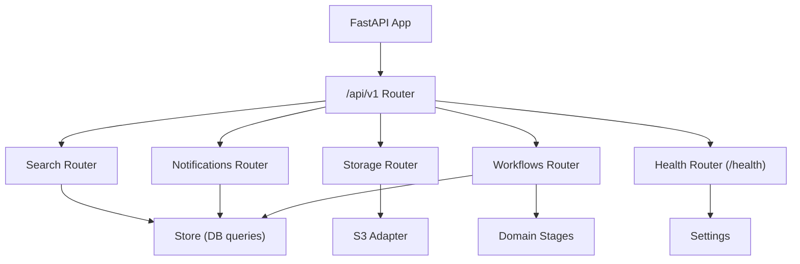
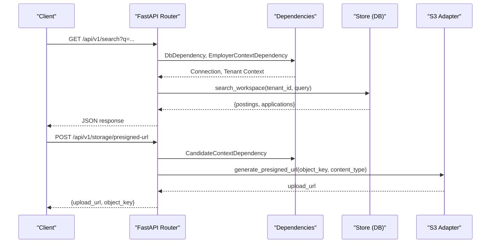
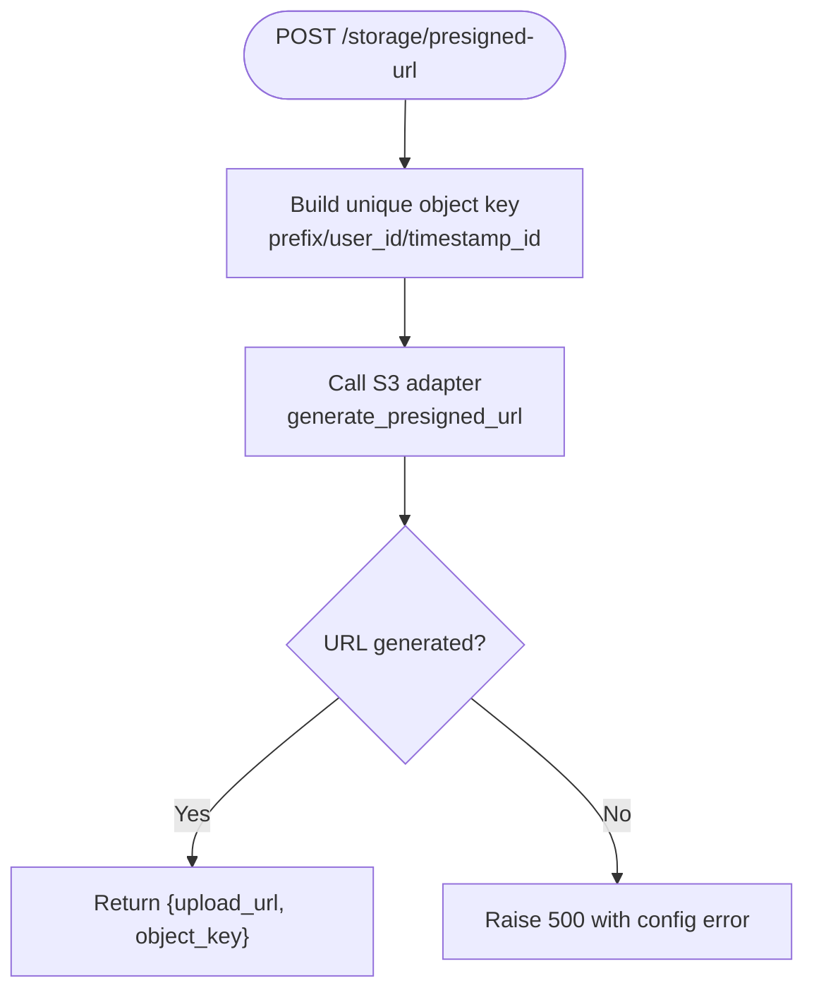
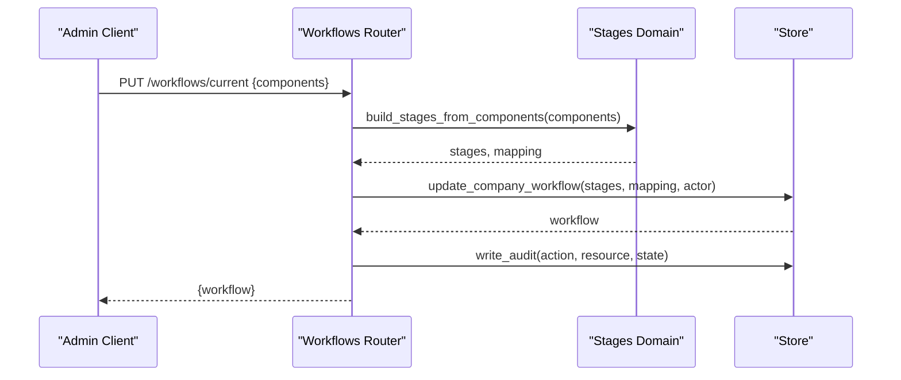
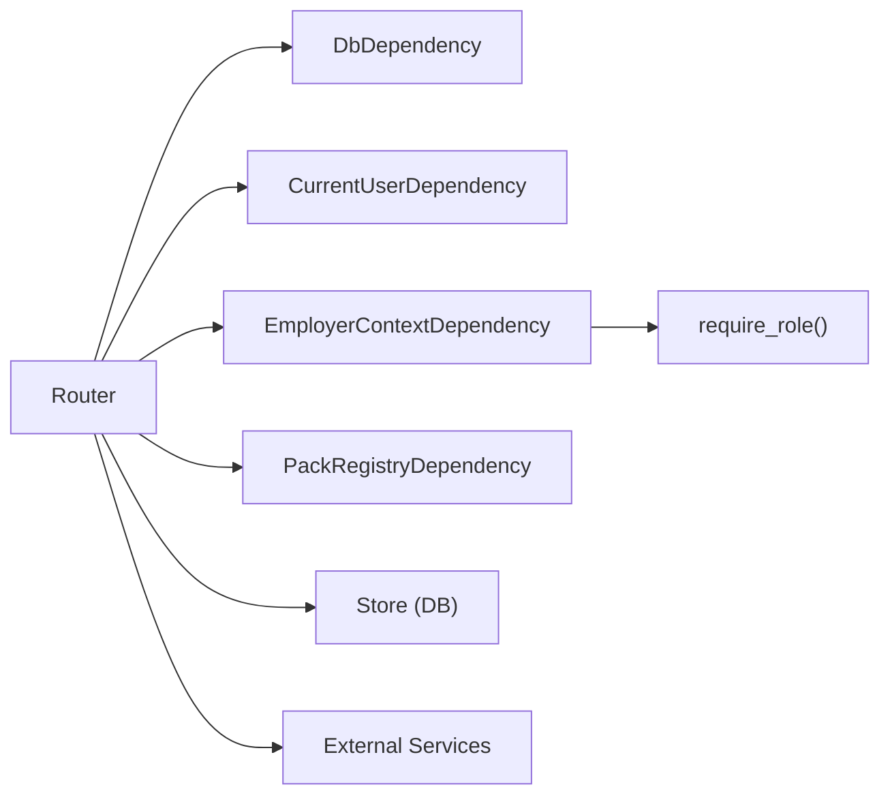

# Utility & Support Services API

<cite>
**Referenced Files in This Document**
- [router.py](file://Backend/app/api/v1/router.py)
- [search.py](file://Backend/app/api/v1/search.py)
- [storage.py](file://Backend/app/api/v1/storage.py)
- [notifications.py](file://Backend/app/api/v1/notifications.py)
- [workflows.py](file://Backend/app/api/v1/workflows.py)
- [health.py](file://Backend/app/api/health.py)
- [dependencies.py](file://Backend/app/api/dependencies.py)
- [store.py](file://Backend/app/db/store.py)
- [stages.py](file://Backend/app/domain/stages.py)
- [packs.py](file://Backend/app/services/packs.py)
- [mail.py](file://Backend/app/services/mail.py)
- [storage_service.py](file://Backend/app/services/storage.py)
</cite>

## Table of Contents
1. Introduction
2. Project Structure
3. Core Components
4. Architecture Overview
5. Detailed Component Analysis
6. Dependency Analysis
7. Performance Considerations
8. Troubleshooting Guide
9. Conclusion

## Introduction
This document provides API documentation for utility and support service endpoints exposed by the backend. It covers:
- Search functionality with filtering, sorting, and faceted search capabilities
- File storage operations including upload via presigned URLs
- Notification system APIs for in-app notifications
- Workflow automation endpoints and process orchestration
- Health check endpoints and system monitoring
- Common integration patterns and examples

The API is versioned under /api/v1 and includes several feature routers that are mounted into a central router.

## Project Structure
The relevant endpoints are organized as FastAPI routers and included into a single v1 router. The main components covered here are:
- Search: workspace-wide search and talent discovery
- Storage: presigned URL generation for uploads
- Notifications: list and mark-read
- Workflows: component-based hiring workflow management
- Health: liveness and readiness probes

**Diagram sources**
- [router.py:26-40](file://Backend/app/api/v1/router.py#L26-L40)
- [search.py:13-72](file://Backend/app/api/v1/search.py#L13-L72)
- [storage.py:8-39](file://Backend/app/api/v1/storage.py#L8-L39)
- [notifications.py:8-27](file://Backend/app/api/v1/notifications.py#L8-L27)
- [workflows.py:16-156](file://Backend/app/api/v1/workflows.py#L16-L156)
- [health.py:6-22](file://Backend/app/api/health.py#L6-L22)

**Section sources**
- [router.py:26-40](file://Backend/app/api/v1/router.py#L26-L40)

## Core Components
- Search
  - GET /api/v1/search?q=... — tenant-scoped workspace search returning postings and applications
  - GET /api/v1/talent?q=...&pack_id=...&min_score=... — consent-aware talent discovery with pack and score filters
  - GET /api/v1/packs/catalog — lists installed domain packs for filtering
- Storage
  - POST /api/v1/storage/presigned-url — returns a time-limited upload URL to an S3-compatible store
- Notifications
  - GET /api/v1/notifications — list recent notifications for current user
  - POST /api/v1/notifications/mark-read — mark all notifications read for current user
- Workflows
  - GET /api/v1/workflows/components — catalog of allowed workflow components
  - GET /api/v1/workflows — list workflows for tenant
  - GET /api/v1/workflows/current or /api/v1/workflows/active — get current workflow
  - PUT /api/v1/workflows/current — upsert company workflow from components (admin-only)
  - POST /api/v1/workflows — create default workflow if none exists (admin-only)
- Health
  - GET /health/live — liveness probe
  - GET /health/ready — readiness probe

Authentication and context:
- Many endpoints require authentication and organization context via dependencies
- Admin-only endpoints enforce role checks

**Section sources**
- [search.py:16-72](file://Backend/app/api/v1/search.py#L16-L72)
- [storage.py:18-39](file://Backend/app/api/v1/storage.py#L18-L39)
- [notifications.py:11-27](file://Backend/app/api/v1/notifications.py#L11-L27)
- [workflows.py:60-156](file://Backend/app/api/v1/workflows.py#L60-L156)
- [health.py:14-22](file://Backend/app/api/health.py#L14-L22)
- [dependencies.py:93-162](file://Backend/app/api/dependencies.py#L93-L162)

## Architecture Overview
The API follows a layered design:
- HTTP layer: FastAPI routers define endpoints and request/response models
- Dependencies: shared concerns like DB connections, user identity, and organization context
- Domain logic: validation and composition of workflows and stages
- Persistence: tenant-scoped database helpers
- External services: S3 storage adapter and mail adapter

**Diagram sources**
- [search.py:16-26](file://Backend/app/api/v1/search.py#L16-L26)
- [storage.py:18-39](file://Backend/app/api/v1/storage.py#L18-L39)
- [dependencies.py:29-37](file://Backend/app/api/dependencies.py#L29-L37)
- [dependencies.py:125-162](file://Backend/app/api/dependencies.py#L125-L162)
- [storage_service.py:23-45](file://Backend/app/services/storage.py#L23-L45)

## Detailed Component Analysis

### Search API
Endpoints:
- GET /api/v1/search?q=string
  - Filters: q (max length 200)
  - Behavior: Returns postings and applications for the authenticated tenant; short queries return empty results
- GET /api/v1/talent?q=string&pack_id=string&min_score=float
  - Filters: q, pack_id (optional), min_score (0..100)
  - Behavior: Consent-aware talent discovery scoped to tenant; returns candidates with scores and explanations
- GET /api/v1/packs/catalog
  - Behavior: Lists installed domain packs for use as filters

Integration notes:
- Requires employer context for tenant scoping
- Results are computed in Python for portability across databases

Example usage patterns:
- Workspace search: GET /api/v1/search?q=mathematics
- Talent discovery with filters: GET /api/v1/talent?q=engineer&pack_id=software-engineering&min_score=70

**Section sources**
- [search.py:16-72](file://Backend/app/api/v1/search.py#L16-L72)
- [store.py:1013-1049](file://Backend/app/db/store.py#L1013-L1049)

### Storage API
Endpoint:
- POST /api/v1/storage/presigned-url
  - Request body: content_type (default video/webm), prefix (default quiz_recordings)
  - Response: upload_url (time-limited), object_key (unique per upload)
  - Behavior: Generates a presigned URL for direct client upload to S3-compatible storage

Error handling:
- If S3 is not configured or unavailable, returns a server error indicating configuration issues

Integration pattern:
- Client requests presigned URL, then uploads file directly to S3 using the returned URL

**Diagram sources**
- [storage.py:18-39](file://Backend/app/api/v1/storage.py#L18-L39)
- [storage_service.py:23-45](file://Backend/app/services/storage.py#L23-L45)

**Section sources**
- [storage.py:18-39](file://Backend/app/api/v1/storage.py#L18-L39)
- [storage_service.py:23-45](file://Backend/app/services/storage.py#L23-L45)

### Notifications API
Endpoints:
- GET /api/v1/notifications
  - Behavior: Returns recent notifications for the current user with unread count
- POST /api/v1/notifications/mark-read
  - Behavior: Marks all notifications for the current user as read

Notes:
- Uses tenant-scoped notification records stored in the database
- Simple update operation committed within the request transaction

**Section sources**
- [notifications.py:11-27](file://Backend/app/api/v1/notifications.py#L11-L27)
- [store.py:300-323](file://Backend/app/db/store.py#L300-L323)

### Workflows API
Endpoints:
- GET /api/v1/workflows/components
  - Behavior: Lists available workflow components and fixed stages
- GET /api/v1/workflows
  - Behavior: Lists workflows for the tenant
- GET /api/v1/workflows/current or /api/v1/workflows/active
  - Behavior: Retrieves the current workflow for the tenant
- PUT /api/v1/workflows/current
  - Behavior: Upserts the company’s single hiring workflow from a list of component IDs (admin-only)
- POST /api/v1/workflows
  - Behavior: Creates a default workflow if none exists (admin-only)

Validation and orchestration:
- Components are validated against a fixed catalog
- Stage sequences are built deterministically and validated
- Changes are audited and committed atomically

**Diagram sources**
- [workflows.py:91-122](file://Backend/app/api/v1/workflows.py#L91-L122)
- [stages.py:138-161](file://Backend/app/domain/stages.py#L138-L161)
- [store.py:216-245](file://Backend/app/db/store.py#L216-L245)

**Section sources**
- [workflows.py:60-156](file://Backend/app/api/v1/workflows.py#L60-L156)
- [stages.py:138-161](file://Backend/app/domain/stages.py#L138-L161)
- [dependencies.py:165-171](file://Backend/app/api/dependencies.py#L165-L171)

### Health Check Endpoints
Endpoints:
- GET /health/live
  - Behavior: Returns status "live" and application version
- GET /health/ready
  - Behavior: Returns status "ready" and application version

Use cases:
- Kubernetes liveness/readiness probes
- Load balancer health checks

**Section sources**
- [health.py:14-22](file://Backend/app/api/health.py#L14-L22)

### Email and In-App Notifications
While there is no dedicated email endpoint, the system supports sending emails through a mail adapter:
- SMTPMailAdapter sends emails via SMTP when configured
- ConsoleMailAdapter logs emails during development/testing
- Helper functions send staff credentials, interview links, and decision updates

In-app notifications are managed via the Notifications API above.

**Section sources**
- [mail.py:28-88](file://Backend/app/services/mail.py#L28-L88)
- [mail.py:91-166](file://Backend/app/services/mail.py#L91-L166)
- [notifications.py:11-27](file://Backend/app/api/v1/notifications.py#L11-L27)

## Dependency Analysis
Shared dependencies ensure consistent behavior across endpoints:
- Database connection lifecycle managed via DbDependency
- User identity resolved via IdentityDependency or CurrentUserDependency
- Organization context enforced via EmployerContextDependency
- Role checks via require_role for admin-only operations
- Pack registry used for domain pack listing and resolution

**Diagram sources**
- [dependencies.py:29-37](file://Backend/app/api/dependencies.py#L29-L37)
- [dependencies.py:93-162](file://Backend/app/api/dependencies.py#L93-L162)
- [dependencies.py:165-171](file://Backend/app/api/dependencies.py#L165-L171)
- [dependencies.py:204-208](file://Backend/app/api/dependencies.py#L204-L208)

**Section sources**
- [dependencies.py:29-171](file://Backend/app/api/dependencies.py#L29-L171)
- [dependencies.py:204-208](file://Backend/app/api/dependencies.py#L204-L208)

## Performance Considerations
- Search queries limit results and avoid heavy SQL joins where possible
- Talent discovery computes scoring in Python for cross-database compatibility
- Presigned URL generation avoids server-side file transfer overhead
- Database connections are short-lived and closed promptly
- Audit and event writes are batched within transactions to reduce round-trips

[No sources needed since this section provides general guidance]

## Troubleshooting Guide
Common issues and resolutions:
- Authentication failures: Ensure valid bearer token or development identity header is provided
- Organization access errors: Verify X-Organization-Id header and membership roles
- S3 configuration errors: Confirm S3 endpoint, access keys, bucket name, and region settings
- Invalid workflow components: Use only components from the catalog; custom stages are not allowed
- Domain pack validation errors: Ensure manifest contains required keys and valid semver versions

Operational tips:
- Use /health/live and /health/ready to verify service status
- Inspect audit records for change history
- Review outbox events for asynchronous processing

**Section sources**
- [dependencies.py:49-87](file://Backend/app/api/dependencies.py#L49-L87)
- [dependencies.py:125-171](file://Backend/app/api/dependencies.py#L125-L171)
- [storage_service.py:23-45](file://Backend/app/services/storage.py#L23-L45)
- [stages.py:245-286](file://Backend/app/domain/stages.py#L245-L286)
- [packs.py:34-62](file://Backend/app/services/packs.py#L34-L62)

## Conclusion
The utility and support services provide essential capabilities for searching, storing files, managing notifications, orchestrating workflows, and monitoring system health. They are designed with strong tenant isolation, clear validation, and robust dependency injection. Integration patterns emphasize presigned uploads, component-driven workflows, and consent-aware searches.

[No sources needed since this section summarizes without analyzing specific files]