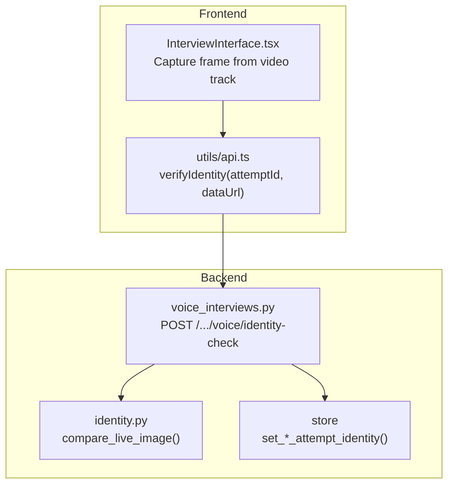
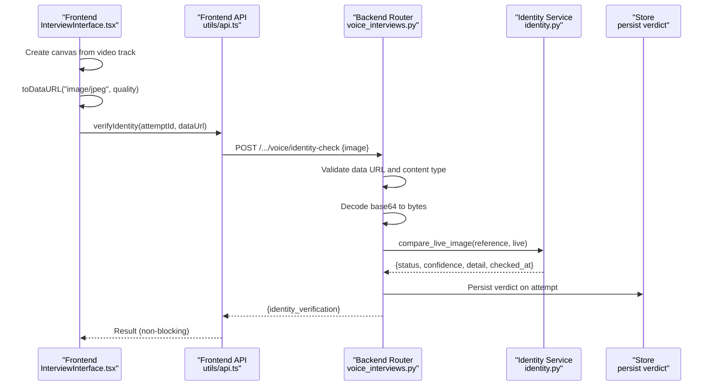
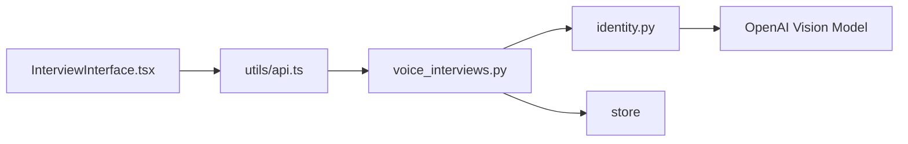

# Identity Verification System

<cite>
**Referenced Files in This Document**
- [voice_interviews.py](file://Backend/app/api/v1/voice_interviews.py)
- [identity.py](file://Backend/app/services/identity.py)
- [InterviewInterface.tsx](file://Frontend/components/interviews/voice/InterviewInterface.tsx)
- [api.ts](file://Frontend/utils/api.ts)
- [errors.py](file://Backend/app/core/errors.py)
- [test_identity_and_emails.py](file://Backend/tests/test_identity_and_emails.py)
</cite>

## Table of Contents
1. [Introduction](#introduction)
2. [Project Structure](#project-structure)
3. [Core Components](#core-components)
4. [Architecture Overview](#architecture-overview)
5. [Detailed Component Analysis](#detailed-component-analysis)
6. [Dependency Analysis](#dependency-analysis)
7. [Performance Considerations](#performance-considerations)
8. [Troubleshooting Guide](#troubleshooting-guide)
9. [Conclusion](#conclusion)
10. [Appendices](#appendices)

## Introduction
This document describes the identity verification system used during voice interviews. It covers how a live webcam frame is captured on the client, validated and processed on the server, compared against the candidate’s reference profile photo using an AI vision model, and how the resulting verdict is recorded and surfaced. It also documents supported image formats, data URL requirements, error handling, security considerations, and integration points for client-side capture and verification workflows.

## Project Structure
The identity verification feature spans both frontend and backend:
- Frontend captures a single frame from the live camera stream and sends it to the backend via a dedicated endpoint.
- Backend validates the image payload, retrieves the user’s reference photo, performs comparison with an AI vision model (when configured), and persists the verdict on the interview attempt.

**Diagram sources**
- [InterviewInterface.tsx:340-378](file://Frontend/components/interviews/voice/InterviewInterface.tsx#L340-L378)
- [api.ts:99-108](file://Frontend/utils/api.ts#L99-L108)
- [voice_interviews.py:60-173](file://Backend/app/api/v1/voice_interviews.py#L60-L173)
- [identity.py:60-120](file://Backend/app/services/identity.py#L60-L120)

**Section sources**
- [InterviewInterface.tsx:340-378](file://Frontend/components/interviews/voice/InterviewInterface.tsx#L340-L378)
- [api.ts:99-108](file://Frontend/utils/api.ts#L99-L108)
- [voice_interviews.py:60-173](file://Backend/app/api/v1/voice_interviews.py#L60-L173)
- [identity.py:60-120](file://Backend/app/services/identity.py#L60-L120)

## Core Components
- Client capture and submission:
  - Captures a JPEG frame from the active video track using a canvas element and converts it to a data URL.
  - Sends the data URL to the backend identity check endpoint once per interview session.
- Server validation and processing:
  - Validates that the payload is a data URL with an allowed content type (JPEG, PNG, WebP).
  - Decodes base64 into raw bytes and ensures the image is non-empty.
  - Resolves the candidate’s reference profile photo; if none exists, records a “no reference” verdict.
  - Compares the live frame to the reference photo using an AI vision model when configured; otherwise marks as unavailable.
  - Persists the verdict on the interview attempt and returns it to the client.

Key responsibilities and behaviors are implemented in:
- Frontend capture and API call: [InterviewInterface.tsx](file://Frontend/components/interviews/voice/InterviewInterface.tsx), [api.ts](file://Frontend/utils/api.ts)
- Backend endpoints and logic: [voice_interviews.py](file://Backend/app/api/v1/voice_interviews.py)
- Comparison service: [identity.py](file://Backend/app/services/identity.py)

**Section sources**
- [InterviewInterface.tsx:340-378](file://Frontend/components/interviews/voice/InterviewInterface.tsx#L340-L378)
- [api.ts:99-108](file://Frontend/utils/api.ts#L99-L108)
- [voice_interviews.py:60-173](file://Backend/app/api/v1/voice_interviews.py#L60-L173)
- [identity.py:60-120](file://Backend/app/services/identity.py#L60-L120)

## Architecture Overview
The identity verification flow is designed to be non-blocking for the interview experience. The client captures one frame after the camera becomes available and sends it to the server. The server validates input, resolves the reference photo, runs comparison (if possible), and persists the result. Verdicts include match, ambiguous, mismatch, no reference, and unavailable. Ambiguous or unavailable results do not stop the interview; they are surfaced in reports.

**Diagram sources**
- [InterviewInterface.tsx:340-378](file://Frontend/components/interviews/voice/InterviewInterface.tsx#L340-L378)
- [api.ts:99-108](file://Frontend/utils/api.ts#L99-L108)
- [voice_interviews.py:60-173](file://Backend/app/api/v1/voice_interviews.py#L60-L173)
- [identity.py:60-120](file://Backend/app/services/identity.py#L60-L120)

## Detailed Component Analysis

### Client-Side Image Capture and Submission
- A single frame is captured from the local video track by drawing onto a canvas and exporting as a JPEG data URL.
- The capture is attempted up to a few times with short delays to ensure the video track is ready.
- The data URL is sent to the backend via a public API helper method that posts to the identity-check endpoint.

Implementation references:
- Frame capture and conversion to data URL: [InterviewInterface.tsx:340-378](file://Frontend/components/interviews/voice/InterviewInterface.tsx#L340-L378)
- API helper for identity verification: [api.ts:99-108](file://Frontend/utils/api.ts#L99-L108)

Supported image types and format:
- The client exports JPEG images via canvas.toDataURL with a quality setting.
- The server accepts JPEG, PNG, and WebP data URLs.

Data URL requirements:
- Must start with a proper data URL header including a supported MIME type.
- Must contain a valid base64-encoded image payload.
- Empty payloads are rejected.

Error handling on the client:
- Failures to capture or send are logged but do not block the interview.

**Section sources**
- [InterviewInterface.tsx:340-378](file://Frontend/components/interviews/voice/InterviewInterface.tsx#L340-L378)
- [api.ts:99-108](file://Frontend/utils/api.ts#L99-L108)

### Server-Side Validation and Processing
- Input validation:
  - Ensures the request body contains a data URL string within size limits.
  - Validates the MIME type is one of JPEG, PNG, or WebP.
  - Decodes base64 safely and rejects empty decoded data.
- Reference resolution:
  - Retrieves the candidate’s reference profile photo path and content type.
  - If no reference photo exists, records a “no reference” verdict immediately.
- Comparison:
  - Calls the identity service to compare the live frame with the reference photo using an AI vision model when configured.
  - Normalizes the model’s response into a standardized verdict structure.
- Persistence:
  - Persists the verdict on the interview attempt and commits the transaction.

Endpoints:
- Profile interview: [voice_interviews.py:140-155](file://Backend/app/api/v1/voice_interviews.py#L140-L155)
- Applied interview: [voice_interviews.py:158-173](file://Backend/app/api/v1/voice_interviews.py#L158-L173)

Validation helpers:
- Data URL parsing and decoding: [voice_interviews.py:60-92](file://Backend/app/api/v1/voice_interviews.py#L60-L92)
- Orchestration and persistence: [voice_interviews.py:95-137](file://Backend/app/api/v1/voice_interviews.py#L95-L137)

**Section sources**
- [voice_interviews.py:60-173](file://Backend/app/api/v1/voice_interviews.py#L60-L173)

### Comparison Algorithm and Verdicts
- The comparison uses an OpenAI vision model configured in settings.
- The prompt instructs the model to return a JSON object with fields:
  - verdict: one of match, ambiguous, mismatch
  - confidence: number between 0.0 and 1.0
  - detail: short explanation
- Policy:
  - If the model returns a low-confidence match (below threshold), the verdict is downgraded to ambiguous.
  - Any unexpected verdict values are normalized to ambiguous.
  - If AI is not configured or any exception occurs, the status is set to unavailable without blocking the interview.

Verdict states:
- match: Live frame appears to be the same person as the profile photo.
- ambiguous: Could not determine with confidence due to lighting, angle, quality, or occlusion; explicitly stated in reports.
- mismatch: Live frame appears to be a different person.
- no_reference_photo: No profile photo on file; nothing to compare against.
- unavailable: AI comparison not configured or failed.

Implementation references:
- Verdict constants and building function: [identity.py:21-57](file://Backend/app/services/identity.py#L21-L57)
- Comparison workflow and normalization: [identity.py:60-120](file://Backend/app/services/identity.py#L60-L120)

**Section sources**
- [identity.py:21-120](file://Backend/app/services/identity.py#L21-L120)

### Error Handling for Invalid Images and Processing Failures
- Invalid image errors:
  - Missing or malformed data URL header: returns 422 with code invalid_image.
  - Unsupported MIME type: returns 422 with code invalid_image.
  - Base64 decode failure: returns 422 with code invalid_image.
  - Empty decoded image: returns 422 with code invalid_image.
- Processing failures:
  - When AI is not configured or network/model errors occur, the service returns an unavailable verdict and logs the error.
- Global error handling:
  - Centralized exception handlers convert exceptions into structured error responses with codes and messages.

References:
- Image validation and decoding: [voice_interviews.py:60-92](file://Backend/app/api/v1/voice_interviews.py#L60-L92)
- Unavailable verdict on AI failure: [identity.py:69-120](file://Backend/app/services/identity.py#L69-L120)
- Error response schema and handlers: [errors.py:9-112](file://Backend/app/core/errors.py#L9-L112)
- Test coverage for invalid image and unavailable scenarios: [test_identity_and_emails.py:198-227](file://Backend/tests/test_identity_and_emails.py#L198-L227)

**Section sources**
- [voice_interviews.py:60-92](file://Backend/app/api/v1/voice_interviews.py#L60-L92)
- [identity.py:69-120](file://Backend/app/services/identity.py#L69-L120)
- [errors.py:9-112](file://Backend/app/core/errors.py#L9-L112)
- [test_identity_and_emails.py:198-227](file://Backend/tests/test_identity_and_emails.py#L198-L227)

### Security Considerations
- Input validation:
  - Strict data URL format and MIME type checks prevent injection of unsupported formats.
  - Base64 decoding is performed with validation enabled to avoid malformed inputs.
  - Size limit enforced on the image field to mitigate large payloads.
- Non-blocking design:
  - Identity verification never blocks the interview; failures default to unavailable to maintain user experience.
- Logging:
  - Errors are logged with context to aid debugging while avoiding sensitive data exposure.
- Storage:
  - Verdicts are persisted on the interview attempt; ensure access controls and retention policies are applied at the storage layer.

References:
- Payload size limit and validation: [voice_interviews.py:27-35](file://Backend/app/api/v1/voice_interviews.py#L27-L35), [voice_interviews.py:60-92](file://Backend/app/api/v1/voice_interviews.py#L60-L92)
- Non-blocking behavior and logging: [identity.py:69-120](file://Backend/app/services/identity.py#L69-L120)

**Section sources**
- [voice_interviews.py:27-35](file://Backend/app/api/v1/voice_interviews.py#L27-L35)
- [voice_interviews.py:60-92](file://Backend/app/api/v1/voice_interviews.py#L60-L92)
- [identity.py:69-120](file://Backend/app/services/identity.py#L69-L120)

### Integration Examples

#### Client-Side Capture Implementation
- Capture a frame from the live video track using a canvas element and export as a JPEG data URL.
- Send the data URL to the backend identity-check endpoint once per interview session.

References:
- Canvas capture and data URL creation: [InterviewInterface.tsx:340-378](file://Frontend/components/interviews/voice/InterviewInterface.tsx#L340-L378)
- API helper usage: [api.ts:99-108](file://Frontend/utils/api.ts#L99-L108)

#### Verification Workflow Integration
- After the room connects and the local video track is published, schedule a one-shot capture with retries.
- On success, the backend persists the verdict; on failure, the interview continues unaffected.
- Reports surface ambiguous or unavailable outcomes explicitly.

References:
- Scheduling capture and retry logic: [InterviewInterface.tsx:340-378](file://Frontend/components/interviews/voice/InterviewInterface.tsx#L340-L378)
- Backend orchestration and persistence: [voice_interviews.py:95-173](file://Backend/app/api/v1/voice_interviews.py#L95-L173)
- Report surfacing of ambiguous outcomes (tests): [test_identity_and_emails.py:229-244](file://Backend/tests/test_identity_and_emails.py#L229-L244)

**Section sources**
- [InterviewInterface.tsx:340-378](file://Frontend/components/interviews/voice/InterviewInterface.tsx#L340-L378)
- [api.ts:99-108](file://Frontend/utils/api.ts#L99-L108)
- [voice_interviews.py:95-173](file://Backend/app/api/v1/voice_interviews.py#L95-L173)
- [test_identity_and_emails.py:229-244](file://Backend/tests/test_identity_and_emails.py#L229-L244)

## Dependency Analysis
The identity verification pipeline depends on:
- Frontend components for media capture and HTTP requests.
- Backend router for endpoint definitions and request validation.
- Identity service for AI-based comparison and verdict construction.
- Store for persisting verdicts on interview attempts.

**Diagram sources**
- [InterviewInterface.tsx:340-378](file://Frontend/components/interviews/voice/InterviewInterface.tsx#L340-L378)
- [api.ts:99-108](file://Frontend/utils/api.ts#L99-L108)
- [voice_interviews.py:60-173](file://Backend/app/api/v1/voice_interviews.py#L60-L173)
- [identity.py:60-120](file://Backend/app/services/identity.py#L60-L120)

**Section sources**
- [InterviewInterface.tsx:340-378](file://Frontend/components/interviews/voice/InterviewInterface.tsx#L340-L378)
- [api.ts:99-108](file://Frontend/utils/api.ts#L99-L108)
- [voice_interviews.py:60-173](file://Backend/app/api/v1/voice_interviews.py#L60-L173)
- [identity.py:60-120](file://Backend/app/services/identity.py#L60-L120)

## Performance Considerations
- Single-frame capture minimizes bandwidth and processing overhead.
- JPEG export with moderate quality balances fidelity and payload size.
- Server-side validation prevents unnecessary processing of invalid or oversized payloads.
- AI comparison is asynchronous and non-blocking; failures default to unavailable to preserve interview flow.

[No sources needed since this section provides general guidance]

## Troubleshooting Guide
Common issues and resolutions:
- Invalid image payload:
  - Ensure the data URL starts with a supported MIME type (JPEG, PNG, WebP).
  - Verify base64 encoding is correct and the decoded image is non-empty.
  - Check server response for code invalid_image and message details.
- AI unavailable:
  - If AI is not configured, the service returns unavailable; verify configuration keys and connectivity.
  - Network or quota errors will log and return unavailable without blocking the interview.
- Camera not ready:
  - The client retries capture a few times; ensure the video track is published before attempting capture.

References:
- Validation and decoding errors: [voice_interviews.py:60-92](file://Backend/app/api/v1/voice_interviews.py#L60-L92)
- Unavailable verdict on AI failure: [identity.py:69-120](file://Backend/app/services/identity.py#L69-L120)
- Global error handling: [errors.py:9-112](file://Backend/app/core/errors.py#L9-L112)
- Tests covering invalid image and unavailable scenarios: [test_identity_and_emails.py:198-227](file://Backend/tests/test_identity_and_emails.py#L198-L227)

**Section sources**
- [voice_interviews.py:60-92](file://Backend/app/api/v1/voice_interviews.py#L60-L92)
- [identity.py:69-120](file://Backend/app/services/identity.py#L69-L120)
- [errors.py:9-112](file://Backend/app/core/errors.py#L9-L112)
- [test_identity_and_emails.py:198-227](file://Backend/tests/test_identity_and_emails.py#L198-L227)

## Conclusion
The identity verification system integrates seamlessly into the voice interview flow, capturing a single live frame and comparing it against the candidate’s profile photo using an AI vision model when available. It enforces strict input validation, supports multiple image formats, and handles errors gracefully without interrupting the interview. Verdicts are clearly defined and surfaced in reports, ensuring transparency for ambiguous or unavailable outcomes.

[No sources needed since this section summarizes without analyzing specific files]

## Appendices

### Supported Image Types and Data URL Format
- Supported MIME types: image/jpeg, image/png, image/webp.
- Data URL format: "data:<mime>;base64,<encoded>".
- Client exports JPEG frames via canvas.toDataURL with a quality parameter.

References:
- Allowed MIME types and decoding: [voice_interviews.py:60-92](file://Backend/app/api/v1/voice_interviews.py#L60-L92)
- Client export format: [InterviewInterface.tsx:340-378](file://Frontend/components/interviews/voice/InterviewInterface.tsx#L340-L378)

**Section sources**
- [voice_interviews.py:60-92](file://Backend/app/api/v1/voice_interviews.py#L60-L92)
- [InterviewInterface.tsx:340-378](file://Frontend/components/interviews/voice/InterviewInterface.tsx#L340-L378)

### Verdict States Summary
- match: Same person as profile photo.
- ambiguous: Cannot determine confidently; explicitly noted in reports.
- mismatch: Different person detected.
- no_reference_photo: No profile photo available for comparison.
- unavailable: AI not configured or comparison failed.

References:
- Verdict constants and policy: [identity.py:21-120](file://Backend/app/services/identity.py#L21-L120)

**Section sources**
- [identity.py:21-120](file://Backend/app/services/identity.py#L21-L120)