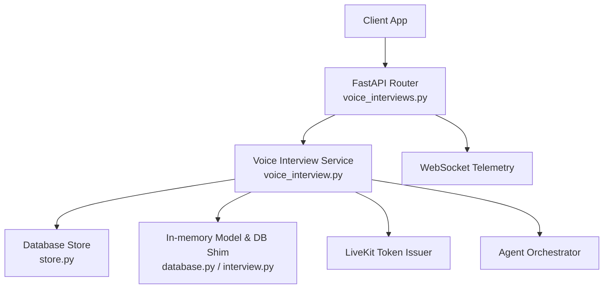
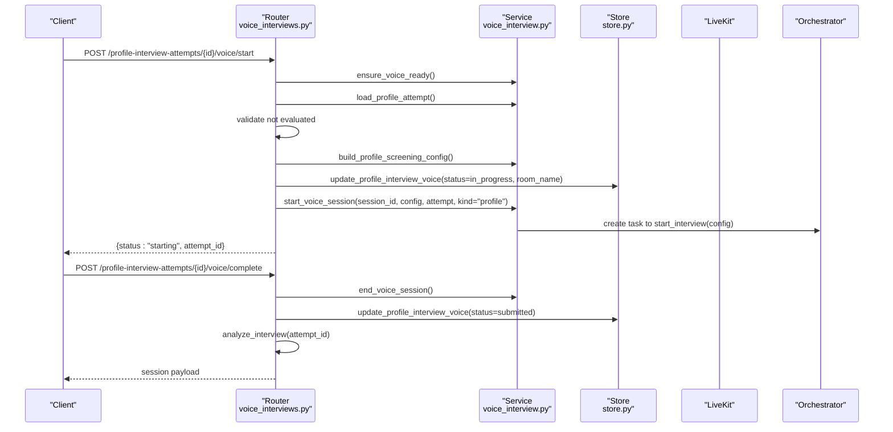
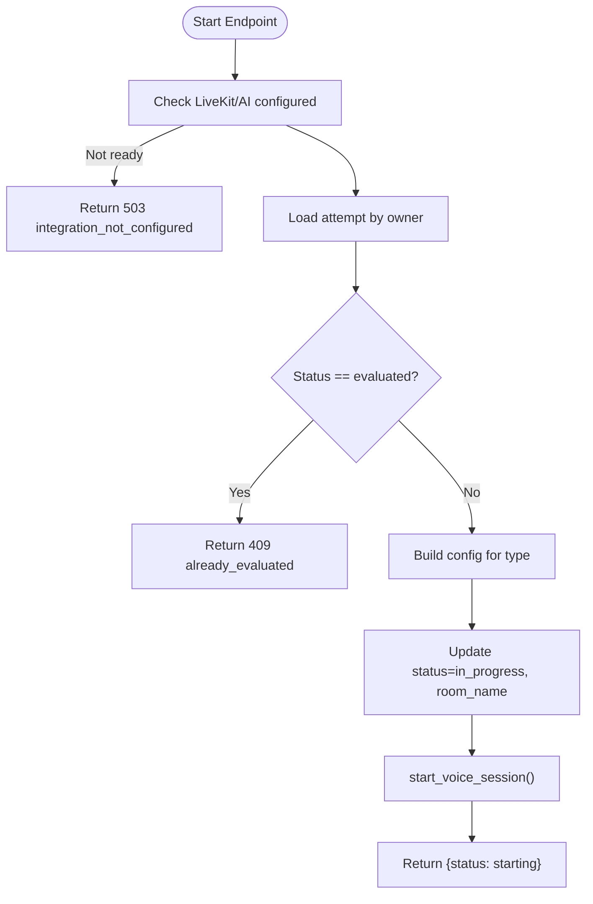
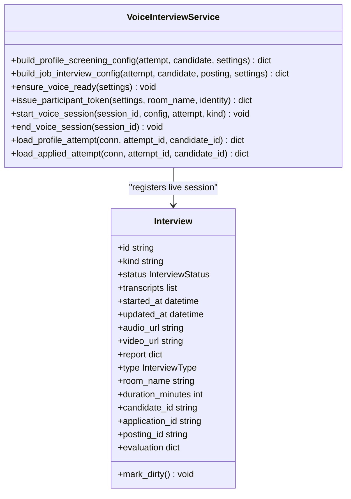
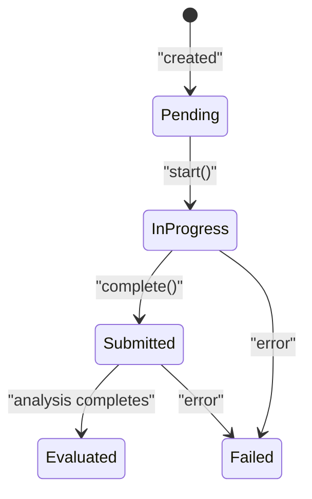
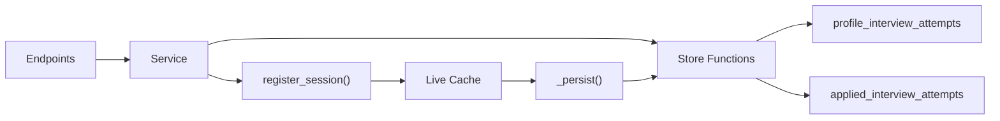
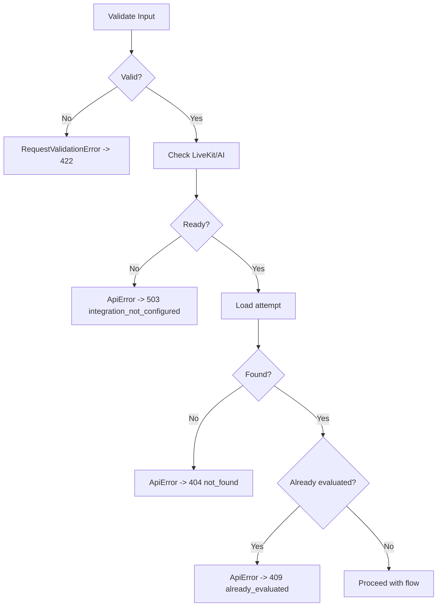
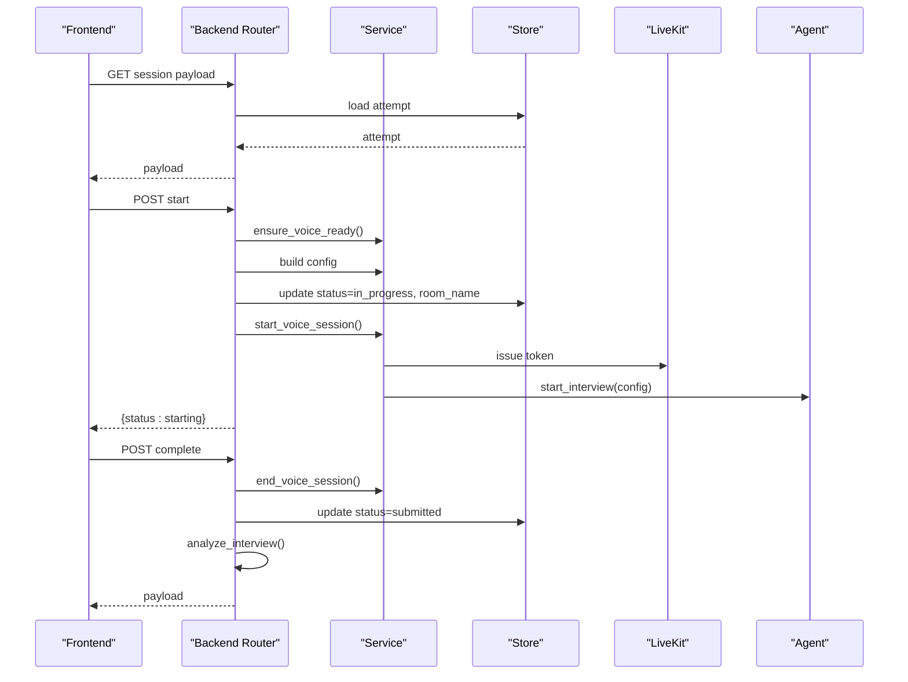
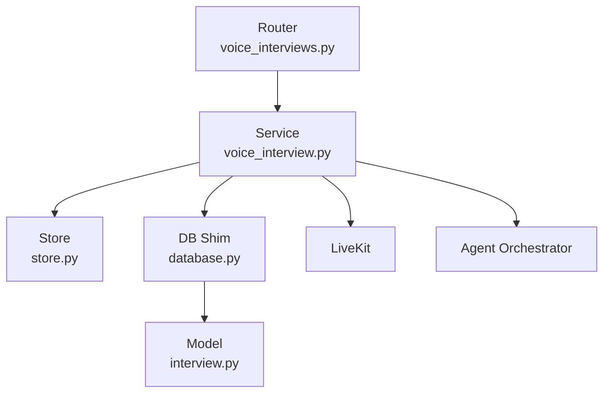

# Interview Session Management

<cite>
**Referenced Files in This Document**
- [voice_interviews.py](file://Backend/app/api/v1/voice_interviews.py)
- [voice_interview.py](file://Backend/app/services/voice_interview.py)
- [database.py](file://Backend/app/api/models/database.py)
- [interview.py](file://Backend/app/api/models/interview.py)
- [tracking.py](file://Backend/app/api/models/choices/tracking.py)
- [store.py](file://Backend/app/db/store.py)
- [errors.py](file://Backend/app/core/errors.py)
</cite>

## Table of Contents
1. [Introduction](#introduction)
2. [Project Structure](#project-structure)
3. [Core Components](#core-components)
4. [Architecture Overview](#architecture-overview)
5. [Detailed Component Analysis](#detailed-component-analysis)
6. [Dependency Analysis](#dependency-analysis)
7. [Performance Considerations](#performance-considerations)
8. [Troubleshooting Guide](#troubleshooting-guide)
9. [Conclusion](#conclusion)

## Introduction
This document explains the complete lifecycle of voice interview sessions for two session types:
- Profile Screening (candidate self-service)
- Applied Job Interview (candidate responding to a job posting)

It covers creation, initialization, configuration building, room name generation, LiveKit token issuance, start and completion flows, status transitions from pending to in_progress to submitted and evaluated, error handling for already evaluated sessions and validation errors, telemetry via WebSocket, and integration with the database layer.

## Project Structure
The voice interview feature is implemented as a FastAPI router that delegates to a service layer for orchestration and persists state through a store module. An in-memory ORM-like model bridges the agent stack with the database.

**Diagram sources**
- [voice_interviews.py:177-236](file://Backend/app/api/v1/voice_interviews.py#L177-L236)
- [voice_interviews.py:290-361](file://Backend/app/api/v1/voice_interviews.py#L290-L361)
- [voice_interview.py:154-251](file://Backend/app/services/voice_interview.py#L154-L251)
- [database.py:22-24](file://Backend/app/api/models/database.py#L22-L24)
- [interview.py:30-75](file://Backend/app/api/models/interview.py#L30-L75)
- [store.py:1333-1363](file://Backend/app/db/store.py#L1333-L1363)
- [store.py:1839-1869](file://Backend/app/db/store.py#L1839-L1869)

**Section sources**
- [voice_interviews.py:1-416](file://Backend/app/api/v1/voice_interviews.py#L1-L416)
- [voice_interview.py:1-272](file://Backend/app/services/voice_interview.py#L1-L272)
- [database.py:1-223](file://Backend/app/api/models/database.py#L1-L223)
- [interview.py:1-75](file://Backend/app/api/models/interview.py#L1-L75)
- [tracking.py:1-17](file://Backend/app/api/models/choices/tracking.py#L1-L17)
- [store.py:1313-1363](file://Backend/app/db/store.py#L1313-L1363)
- [store.py:1819-1869](file://Backend/app/db/store.py#L1819-L1869)

## Core Components
- Voice interview endpoints: Provide REST and WebSocket interfaces for profile screening and applied interviews. They handle identity checks, session retrieval, LiveKit token issuance, starting and completing sessions, and telemetry forwarding.
- Voice interview service: Builds session configurations per type, validates environment readiness, issues LiveKit tokens, starts/stops agents, and registers live sessions.
- Database models and shim: Define an in-memory Interview object and persist changes back to attempt tables; map between internal statuses and stored statuses.
- Store: Data access layer for reading/writing profile and applied interview attempts, including status updates and evaluation persistence.
- Error handling: Centralized exception handlers normalize API errors and validation failures.

**Section sources**
- [voice_interviews.py:140-255](file://Backend/app/api/v1/voice_interviews.py#L140-L255)
- [voice_interviews.py:290-384](file://Backend/app/api/v1/voice_interviews.py#L290-L384)
- [voice_interview.py:53-151](file://Backend/app/services/voice_interview.py#L53-L151)
- [voice_interview.py:169-251](file://Backend/app/services/voice_interview.py#L169-L251)
- [database.py:22-24](file://Backend/app/api/models/database.py#L22-L24)
- [database.py:101-202](file://Backend/app/api/models/database.py#L101-L202)
- [interview.py:30-75](file://Backend/app/api/models/interview.py#L30-L75)
- [store.py:1333-1363](file://Backend/app/db/store.py#L1333-L1363)
- [store.py:1839-1869](file://Backend/app/db/store.py#L1839-L1869)
- [errors.py:20-112](file://Backend/app/core/errors.py#L20-L112)

## Architecture Overview
The system exposes candidate-scoped endpoints for both session types. Each endpoint loads the attempt, validates ownership, builds or retrieves configuration, manages LiveKit rooms and tokens, and transitions states in the database. The agent orchestrator runs asynchronously to conduct the interview and update transcripts and evaluations.

**Diagram sources**
- [voice_interviews.py:204-236](file://Backend/app/api/v1/voice_interviews.py#L204-L236)
- [voice_interviews.py:239-255](file://Backend/app/api/v1/voice_interviews.py#L239-L255)
- [voice_interview.py:154-186](file://Backend/app/services/voice_interview.py#L154-L186)
- [voice_interview.py:189-227](file://Backend/app/services/voice_interview.py#L189-L227)
- [store.py:1333-1363](file://Backend/app/db/store.py#L1333-L1363)

## Detailed Component Analysis

### Endpoints and Lifecycle
- Identity verification:
  - Profile Screening: POST /candidates/me/profile-interview-attempts/{attempt_id}/voice/identity-check
  - Applied Interview: POST /candidates/me/applied-interviews/{attempt_id}/voice/identity-check
  - Validates image format and decodes data URL; compares against user avatar; persists verdict; returns final verdict if already computed.
- Session retrieval:
  - GET /candidates/me/profile-interview-attempts/{attempt_id}/voice
  - GET /candidates/me/applied-interviews/{attempt_id}/voice
  - Returns session payload including id, kind, title, status, room_name, duration_minutes, transcripts, evaluation, identity_verification, started_via, questions, and derived title for applied interviews.
- LiveKit token issuance:
  - POST /candidates/me/profile-interview-attempts/{attempt_id}/voice/livekit
  - POST /candidates/me/applied-interviews/{attempt_id}/voice/livekit
  - Uses room_name from attempt or generates default; issues token with grants for joining the room.
- Start session:
  - POST /candidates/me/profile-interview-attempts/{attempt_id}/voice/start
  - POST /candidates/me/applied-interviews/{attempt_id}/voice/start
  - Validates environment readiness, loads attempt, rejects if already evaluated, builds configuration, updates status to in_progress with room_name, starts agent task, returns starting status.
- Complete session:
  - POST /candidates/me/profile-interview-attempts/{attempt_id}/voice/complete
  - POST /candidates/me/applied-interviews/{attempt_id}/voice/complete
  - Ends agent session, updates status to submitted, triggers analysis, returns refreshed session payload.
- Telemetry:
  - WebSocket /candidates/me/{type}-interview-attempts/{attempt_id}/voice/telemetry
  - Accepts client messages and forwards signals like user_requested_end and user_audio_activity to the active conversation agent.

**Diagram sources**
- [voice_interviews.py:204-236](file://Backend/app/api/v1/voice_interviews.py#L204-L236)
- [voice_interviews.py:321-361](file://Backend/app/api/v1/voice_interviews.py#L321-L361)
- [voice_interview.py:154-186](file://Backend/app/services/voice_interview.py#L154-L186)

**Section sources**
- [voice_interviews.py:140-173](file://Backend/app/api/v1/voice_interviews.py#L140-L173)
- [voice_interviews.py:177-236](file://Backend/app/api/v1/voice_interviews.py#L177-L236)
- [voice_interviews.py:239-255](file://Backend/app/api/v1/voice_interviews.py#L239-L255)
- [voice_interviews.py:258-287](file://Backend/app/api/v1/voice_interviews.py#L258-L287)
- [voice_interviews.py:290-384](file://Backend/app/api/v1/voice_interviews.py#L290-L384)
- [voice_interviews.py:387-415](file://Backend/app/api/v1/voice_interviews.py#L387-L415)

### Configuration Building and Room Name Generation
- Profile Screening configuration:
  - Derives subject name from candidate profile/display name.
  - Selects strategy for PROFILE_SCREENING.
  - Sets interviewer persona, difficulty, language, length, pronouns, KPI themes, CV summary, evaluation titles/descriptions, and transcripts.
  - Room name defaults to profile-screening-{attempt_id} if not present.
- Applied Interview configuration:
  - Derives subject name similarly.
  - Loads posting details to set title and job description.
  - Selects strategy for JOB_INTERVIEW.
  - Populates KPI question plan from attempt questions.
  - Room name defaults to job-interview-{attempt_id} if not present.

**Diagram sources**
- [voice_interview.py:53-151](file://Backend/app/services/voice_interview.py#L53-L151)
- [voice_interview.py:169-251](file://Backend/app/services/voice_interview.py#L169-L251)
- [interview.py:30-75](file://Backend/app/api/models/interview.py#L30-L75)

**Section sources**
- [voice_interview.py:53-151](file://Backend/app/services/voice_interview.py#L53-L151)

### Status Management and Transitions
- Internal statuses are defined as enums and mapped to stored values:
  - PENDING -> pending
  - IN_PROGRESS -> in_progress
  - COMPLETED -> submitted
  - ANALYZED -> evaluated
  - FAILED -> failed
- Persistence mapping:
  - When saving, internal statuses are converted to stored strings.
  - When loading, stored strings are converted back to internal statuses.
- Transitions enforced by endpoints:
  - Start: sets status to in_progress and records room_name.
  - Complete: sets status to submitted and triggers analysis.
  - Evaluation: when analysis completes, status becomes evaluated.

**Diagram sources**
- [tracking.py:11-16](file://Backend/app/api/models/choices/tracking.py#L11-L16)
- [database.py:101-202](file://Backend/app/api/models/database.py#L101-L202)
- [voice_interviews.py:204-236](file://Backend/app/api/v1/voice_interviews.py#L204-L236)
- [voice_interviews.py:239-255](file://Backend/app/api/v1/voice_interviews.py#L239-L255)
- [voice_interviews.py:321-361](file://Backend/app/api/v1/voice_interviews.py#L321-L361)
- [voice_interviews.py:364-384](file://Backend/app/api/v1/voice_interviews.py#L364-L384)

**Section sources**
- [tracking.py:1-17](file://Backend/app/api/models/choices/tracking.py#L1-L17)
- [database.py:101-202](file://Backend/app/api/models/database.py#L101-L202)

### Integration Points with Database Layer
- Reading attempts:
  - get_profile_attempt(conn, attempt_id, candidate_id)
  - get_applied_attempt_for_candidate(conn, attempt_id, candidate_id)
- Updating voice sessions:
  - update_profile_interview_voice(conn, attempt_id, status, transcripts, started_at, evaluation, room_name, submitted_at)
  - update_applied_interview_voice(conn, attempt_id, status, transcripts, started_at, evaluation, room_name, submitted_at)
- Persisting evaluations:
  - submit_profile_attempt(conn, attempt_id, evaluation) sets status=evaluated and recorded timestamp.
- In-memory registration:
  - register_session(interview) adds to live cache for agent interactions.
  - _persist(interview) writes back to store using appropriate update function based on kind.

**Diagram sources**
- [store.py:1313-1363](file://Backend/app/db/store.py#L1313-L1363)
- [store.py:1819-1869](file://Backend/app/db/store.py#L1819-L1869)
- [database.py:22-24](file://Backend/app/api/models/database.py#L22-L24)
- [database.py:155-188](file://Backend/app/api/models/database.py#L155-L188)

**Section sources**
- [store.py:1313-1363](file://Backend/app/db/store.py#L1313-L1363)
- [store.py:1819-1869](file://Backend/app/db/store.py#L1819-L1869)
- [database.py:155-188](file://Backend/app/api/models/database.py#L155-L188)

### Error Handling and Validation
- Already evaluated sessions:
  - Start endpoints check current status and raise ApiError with code already_evaluated and 409 status.
- Environment configuration:
  - ensure_voice_ready raises ApiError with code integration_not_configured and 503 status if LiveKit or AI services are not configured.
- Request validation:
  - Pydantic models enforce constraints (e.g., image field size/format).
  - Global exception handlers convert validation errors into standardized JSON responses with request_id and details.
- Not found:
  - Attempt loading functions raise ApiError with code not_found and 404 status when attempts do not exist or belong to another candidate.

**Diagram sources**
- [voice_interviews.py:204-236](file://Backend/app/api/v1/voice_interviews.py#L204-L236)
- [voice_interviews.py:321-361](file://Backend/app/api/v1/voice_interviews.py#L321-L361)
- [voice_interview.py:154-166](file://Backend/app/services/voice_interview.py#L154-L166)
- [voice_interview.py:254-271](file://Backend/app/services/voice_interview.py#L254-L271)
- [errors.py:20-112](file://Backend/app/core/errors.py#L20-L112)

**Section sources**
- [voice_interviews.py:204-236](file://Backend/app/api/v1/voice_interviews.py#L204-L236)
- [voice_interviews.py:321-361](file://Backend/app/api/v1/voice_interviews.py#L321-L361)
- [voice_interview.py:154-166](file://Backend/app/services/voice_interview.py#L154-L166)
- [voice_interview.py:254-271](file://Backend/app/services/voice_interview.py#L254-L271)
- [errors.py:20-112](file://Backend/app/core/errors.py#L20-L112)

### Session Flow Patterns and Examples
- Profile Screening flow:
  - Create or resume attempt (handled elsewhere), then call start to transition to in_progress, connect via LiveKit, run interview, call complete to transition to submitted, and await analysis to reach evaluated.
- Applied Interview flow:
  - Similar to profile screening but includes posting lookup and uses job-interview room naming; also supports identity verification and telemetry.

**Diagram sources**
- [voice_interviews.py:177-236](file://Backend/app/api/v1/voice_interviews.py#L177-L236)
- [voice_interviews.py:239-255](file://Backend/app/api/v1/voice_interviews.py#L239-L255)
- [voice_interviews.py:290-361](file://Backend/app/api/v1/voice_interviews.py#L290-L361)
- [voice_interviews.py:364-384](file://Backend/app/api/v1/voice_interviews.py#L364-L384)
- [voice_interview.py:189-251](file://Backend/app/services/voice_interview.py#L189-L251)

## Dependency Analysis
- Coupling:
  - Endpoints depend on service functions for business logic and store for persistence.
  - Service depends on configuration, strategies, and orchestrator for agent lifecycle.
  - Database shim depends on store to read/write attempt rows and maps statuses.
- External integrations:
  - LiveKit for real-time audio/video rooms and token issuance.
  - AI services for agent orchestration and synthesis/analysis.
- Cohesion:
  - Each module has clear responsibilities: routing, orchestration, persistence, modeling, and error handling.

**Diagram sources**
- [voice_interviews.py:1-416](file://Backend/app/api/v1/voice_interviews.py#L1-L416)
- [voice_interview.py:1-272](file://Backend/app/services/voice_interview.py#L1-L272)
- [database.py:1-223](file://Backend/app/api/models/database.py#L1-L223)
- [interview.py:1-75](file://Backend/app/api/models/interview.py#L1-L75)
- [store.py:1313-1363](file://Backend/app/db/store.py#L1313-L1363)
- [store.py:1819-1869](file://Backend/app/db/store.py#L1819-L1869)

**Section sources**
- [voice_interviews.py:1-416](file://Backend/app/api/v1/voice_interviews.py#L1-L416)
- [voice_interview.py:1-272](file://Backend/app/services/voice_interview.py#L1-L272)
- [database.py:1-223](file://Backend/app/api/models/database.py#L1-L223)
- [interview.py:1-75](file://Backend/app/api/models/interview.py#L1-L75)
- [store.py:1313-1363](file://Backend/app/db/store.py#L1313-L1363)
- [store.py:1819-1869](file://Backend/app/db/store.py#L1819-L1869)

## Performance Considerations
- Concurrency control:
  - start_voice_session uses a lock to prevent duplicate start tasks and avoids re-starting active conversations.
- Task management:
  - Active tasks are tracked per session_id; cancellation is handled during end_voice_session.
- I/O efficiency:
  - Minimal database writes occur at key points: start (in_progress), complete (submitted), and periodic transcript/evaluation updates via the DB shim.
- Token TTL:
  - LiveKit tokens have configurable TTL to balance security and usability.

[No sources needed since this section provides general guidance]

## Troubleshooting Guide
- Already evaluated:
  - If attempting to start an interview that is already evaluated, expect a 409 conflict with code already_evaluated.
- Integration not configured:
  - Missing LiveKit or AI configuration results in a 503 with code integration_not_configured.
- Not found:
  - Invalid or unauthorized attempt IDs result in a 404 with code not_found.
- Validation errors:
  - Malformed identity check images or invalid payloads return 422 with detailed validation errors.
- WebSocket telemetry:
  - Ensure the client connects to the correct telemetry endpoint and sends recognized message types; unrecognized messages are ignored.

**Section sources**
- [voice_interviews.py:204-236](file://Backend/app/api/v1/voice_interviews.py#L204-L236)
- [voice_interviews.py:321-361](file://Backend/app/api/v1/voice_interviews.py#L321-L361)
- [voice_interview.py:154-166](file://Backend/app/services/voice_interview.py#L154-L166)
- [voice_interview.py:254-271](file://Backend/app/services/voice_interview.py#L254-L271)
- [errors.py:20-112](file://Backend/app/core/errors.py#L20-L112)

## Conclusion
The voice interview session management system provides a robust, well-structured pipeline for managing both profile screening and applied interview sessions. It enforces clear state transitions, handles errors consistently, integrates with LiveKit and AI services, and persists state reliably through a dedicated store layer. The design separates concerns across routing, service, models, and storage, enabling maintainability and extensibility.

[No sources needed since this section summarizes without analyzing specific files]