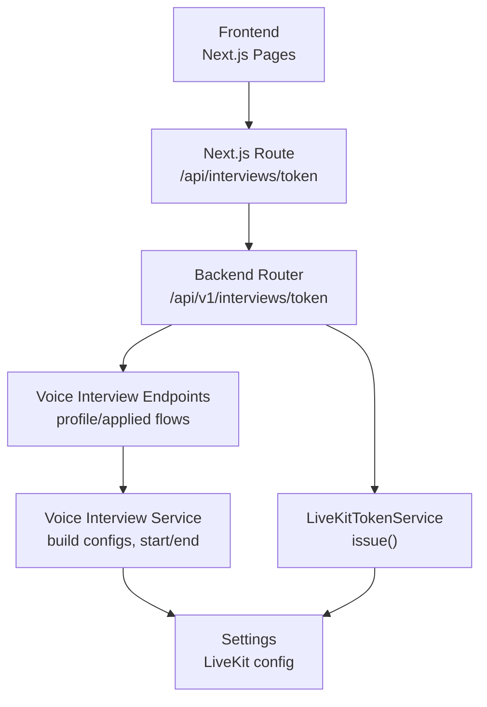
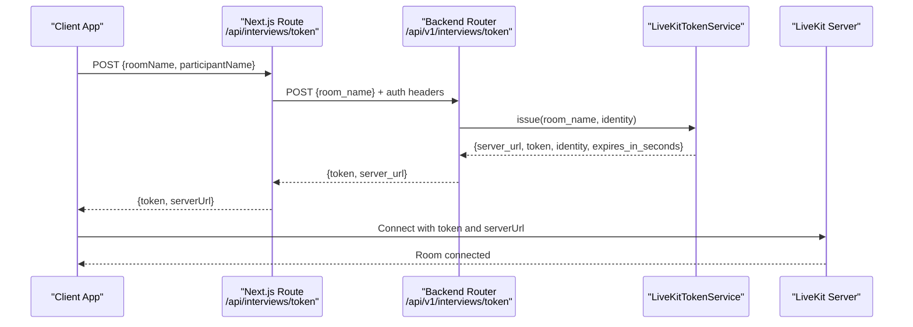
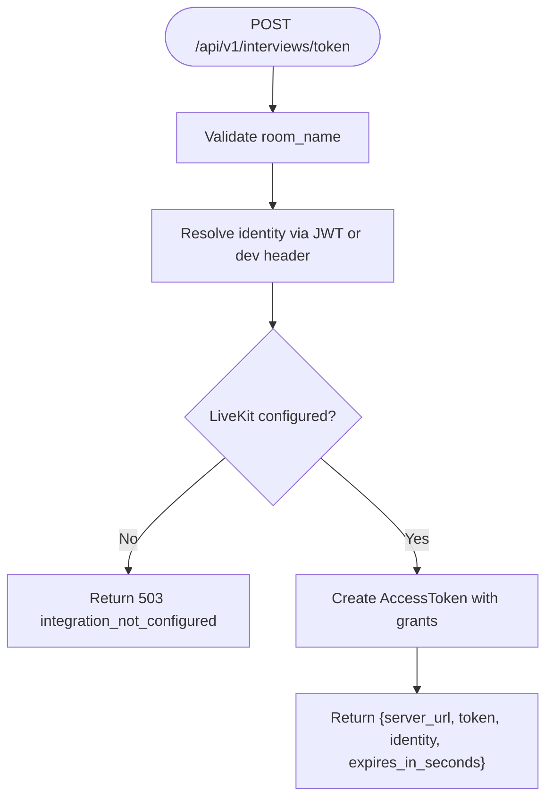
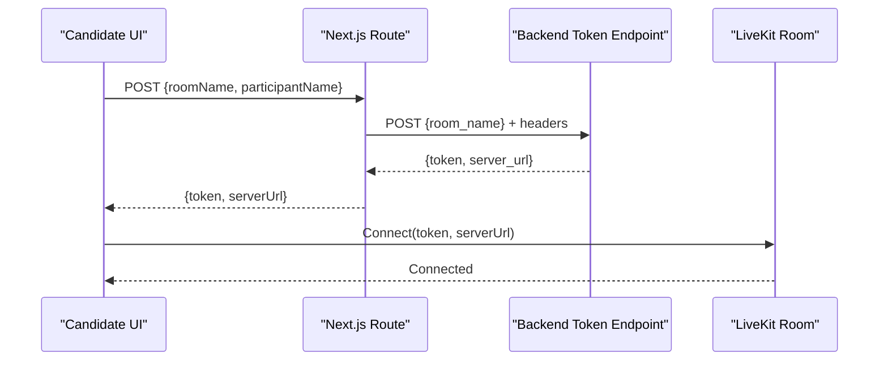
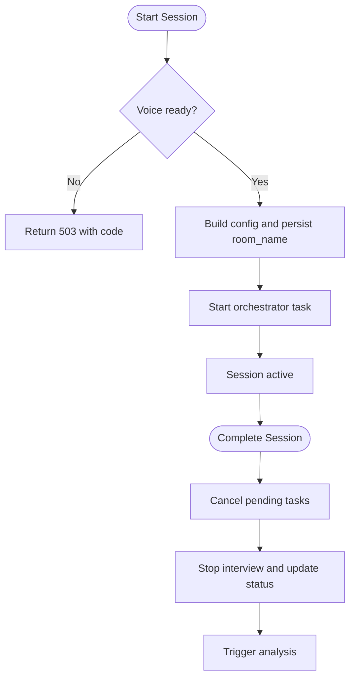
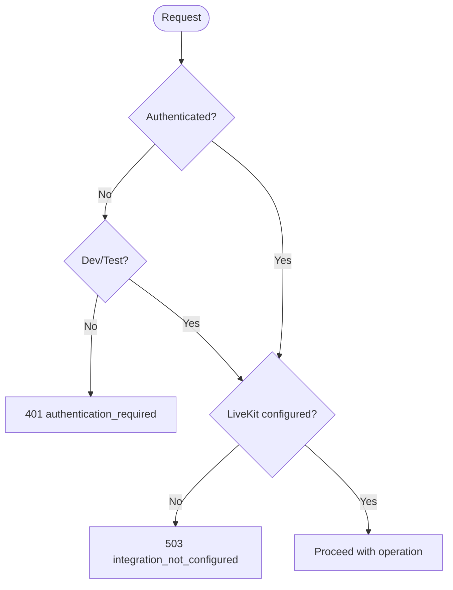
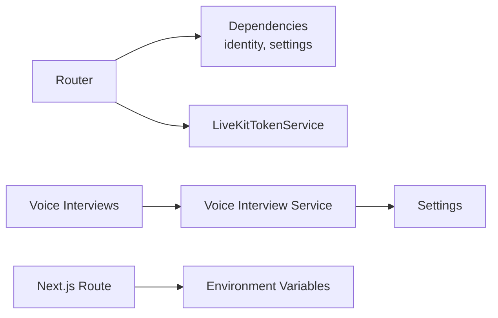

# LiveKit Room Integration

<cite>
**Referenced Files in This Document**
- [router.py](file://Backend/app/api/v1/router.py)
- [livekit.py](file://Backend/app/services/livekit.py)
- [voice_interviews.py](file://Backend/app/api/v1/voice_interviews.py)
- [voice_interview.py](file://Backend/app/services/voice_interview.py)
- [config.py](file://Backend/app/core/config.py)
- [errors.py](file://Backend/app/core/errors.py)
- [dependencies.py](file://Backend/app/api/dependencies.py)
- [interview.py](file://Backend/app/schemas/interview.py)
- [route.ts](file://Frontend/app/api/interviews/token/route.ts)
- [livekit-interview-room.tsx](file://Frontend/components/interviews/livekit-interview-room.tsx)
- [LiveKitRoomWrapper.tsx](file://Frontend/components/interviews/voice/LiveKitRoomWrapper.tsx)
- [InterviewInterface.tsx](file://Frontend/components/interviews/voice/InterviewInterface.tsx)
- [test_livekit.py](file://Backend/tests/test_livekit.py)
</cite>

## Table of Contents
1. [Introduction](#introduction)
2. [Project Structure](#project-structure)
3. [Core Components](#core-components)
4. [Architecture Overview](#architecture-overview)
5. [Detailed Component Analysis](#detailed-component-analysis)
6. [Dependency Analysis](#dependency-analysis)
7. [Performance Considerations](#performance-considerations)
8. [Troubleshooting Guide](#troubleshooting-guide)
9. [Conclusion](#conclusion)

## Introduction
This document explains how the application integrates with LiveKit to power real-time voice and video interview rooms. It covers:
- Participant token generation for both profile screening and job interview flows
- Room creation conventions and identity management
- Client-side connection establishment using Next.js and LiveKit components
- Session lifecycle, cleanup, and resource management
- Error handling for configuration issues, authentication, and room operations
- Practical client integration patterns and troubleshooting steps

## Project Structure
The LiveKit integration spans backend endpoints, services, configuration, and frontend components:
- Backend API routes expose token issuance and voice interview session control
- Services build configurations, issue tokens, and orchestrate agent sessions
- Configuration centralizes LiveKit credentials and validation rules
- Frontend proxies token requests and renders LiveKit rooms with UI controls

**Diagram sources**
- [router.py:43-56](file://Backend/app/api/v1/router.py#L43-L56)
- [livekit.py:10-38](file://Backend/app/services/livekit.py#L10-L38)
- [voice_interviews.py:177-318](file://Backend/app/api/v1/voice_interviews.py#L177-L318)
- [voice_interview.py:53-151](file://Backend/app/services/voice_interview.py#L53-L151)
- [config.py:72-76](file://Backend/app/core/config.py#L72-L76)

**Section sources**
- [router.py:43-56](file://Backend/app/api/v1/router.py#L43-L56)
- [voice_interviews.py:177-318](file://Backend/app/api/v1/voice_interviews.py#L177-L318)
- [config.py:72-76](file://Backend/app/core/config.py#L72-L76)

## Core Components
- Token issuance endpoint: POST /api/v1/interviews/token returns a signed LiveKit token scoped to a specific room and identity.
- Voice interview endpoints: Separate flows for Profile Screening and Job Interviews that manage room names, identities, and session lifecycle.
- Settings and validation: Centralized configuration for LiveKit URL, keys, TTL, and environment checks.
- Frontend proxy: Next.js route forwards token requests to the backend with proper headers and error mapping.
- Client components: LiveKitRoom and wrappers connect to the room and render the interview interface.

Key responsibilities:
- Validate inputs and environment configuration before issuing tokens or starting sessions
- Enforce naming conventions for rooms and identities
- Manage session state transitions (starting, in progress, completed)
- Provide consistent error responses with codes and messages

**Section sources**
- [router.py:43-56](file://Backend/app/api/v1/router.py#L43-L56)
- [voice_interviews.py:177-318](file://Backend/app/api/v1/voice_interviews.py#L177-L318)
- [voice_interview.py:154-166](file://Backend/app/services/voice_interview.py#L154-L166)
- [config.py:167-177](file://Backend/app/core/config.py#L167-L177)
- [route.ts:5-75](file://Frontend/app/api/interviews/token/route.ts#L5-L75)

## Architecture Overview
End-to-end flow from client to LiveKit:

**Diagram sources**
- [route.ts:5-75](file://Frontend/app/api/interviews/token/route.ts#L5-L75)
- [router.py:43-56](file://Backend/app/api/v1/router.py#L43-L56)
- [livekit.py:10-38](file://Backend/app/services/livekit.py#L10-L38)

## Detailed Component Analysis

### Token Issuance Endpoint
- Endpoint: POST /api/v1/interviews/token
- Input: room_name (validated pattern and length)
- Identity resolution: Bearer JWT or development header depending on environment
- Output: server_url, token, identity, expires_in_seconds
- Errors: Missing configuration (503), invalid identity (422), authentication required (401)

**Diagram sources**
- [router.py:43-56](file://Backend/app/api/v1/router.py#L43-L56)
- [livekit.py:10-38](file://Backend/app/services/livekit.py#L10-L38)
- [dependencies.py:49-87](file://Backend/app/api/dependencies.py#L49-L87)
- [config.py:167-177](file://Backend/app/core/config.py#L167-L177)

**Section sources**
- [router.py:43-56](file://Backend/app/api/v1/router.py#L43-L56)
- [livekit.py:10-38](file://Backend/app/services/livekit.py#L10-L38)
- [dependencies.py:49-87](file://Backend/app/api/dependencies.py#L49-L87)
- [interview.py:4-12](file://Backend/app/schemas/interview.py#L4-L12)
- [errors.py:28-34](file://Backend/app/core/errors.py#L28-L34)

### Voice Interview Endpoints: Profile Screening
- Get session: GET /candidates/me/profile-interview-attempts/{attempt_id}/voice
- Start session: POST .../voice/start
  - Validates not already evaluated
  - Builds profile screening config with room name fallback
  - Persists status and room_name
  - Starts agent session asynchronously
- Complete session: POST .../voice/complete
  - Ends agent session and marks submitted
  - Triggers analysis
- Telemetry WebSocket: WS .../voice/telemetry
  - Accepts telemetry events and forwards signals to orchestrator

Room naming convention:
- Uses attempt.room_name if present; otherwise defaults to "profile-screening-{attempt_id}"

Identity management:
- Uses candidate identity derived from context ("candidate-{id}")

**Section sources**
- [voice_interviews.py:177-255](file://Backend/app/api/v1/voice_interviews.py#L177-L255)
- [voice_interview.py:53-99](file://Backend/app/services/voice_interview.py#L53-L99)

### Voice Interview Endpoints: Job Interview
- Get session: GET /candidates/me/applied-interviews/{attempt_id}/voice
- Start session: POST .../voice/start
  - Validates not already evaluated
  - Loads posting details and builds job interview config
  - Persists status and room_name
  - Starts agent session asynchronously
- Complete session: POST .../voice/complete
  - Ends agent session and marks submitted
  - Triggers analysis
- Telemetry WebSocket: WS .../voice/telemetry
  - Accepts telemetry events and forwards signals to orchestrator

Room naming convention:
- Uses attempt.room_name if present; otherwise defaults to "job-interview-{attempt_id}"

Identity management:
- Uses candidate identity derived from context ("candidate-{id}")

**Section sources**
- [voice_interviews.py:290-384](file://Backend/app/api/v1/voice_interviews.py#L290-L384)
- [voice_interview.py:102-151](file://Backend/app/services/voice_interview.py#L102-L151)

### Frontend Token Proxy and Room Connection
- Next.js route: POST /api/interviews/token
  - Validates room name and participant name
  - Forwards request to backend with authorization and cookie headers
  - Adds development identity header when available
  - Maps backend errors to user-friendly messages
  - Returns {token, serverUrl}
- Client component: LiveKitInterviewRoom
  - Prompts for participant name
  - Calls Next.js route to obtain token
  - Renders LiveKitRoom with token and serverUrl
  - Handles disconnect and error states
- Wrapper component: LiveKitRoomWrapper
  - Fetches token via publicApi.getLiveKitToken
  - Connects to LiveKit with audio/video disabled by default
  - Renders InterviewInterface and manages completion callbacks

**Diagram sources**
- [route.ts:5-75](file://Frontend/app/api/interviews/token/route.ts#L5-L75)
- [livekit-interview-room.tsx:21-68](file://Frontend/components/interviews/livekit-interview-room.tsx#L21-L68)
- [LiveKitRoomWrapper.tsx:35-101](file://Frontend/components/interviews/voice/LiveKitRoomWrapper.tsx#L35-L101)

**Section sources**
- [route.ts:5-75](file://Frontend/app/api/interviews/token/route.ts#L5-L75)
- [livekit-interview-room.tsx:21-68](file://Frontend/components/interviews/livekit-interview-room.tsx#L21-L68)
- [LiveKitRoomWrapper.tsx:35-101](file://Frontend/components/interviews/voice/LiveKitRoomWrapper.tsx#L35-L101)

### Session Lifecycle and Cleanup
- Start: Ensures voice readiness (LiveKit and AI configured), builds config, persists state, starts orchestrator task
- End: Cancels pending tasks, signals wrap-up, stops interview, updates DB status, triggers analysis
- Telemetry: Accepts signals like user_requested_end and user_audio_activity and forwards to orchestrator

**Diagram sources**
- [voice_interview.py:154-166](file://Backend/app/services/voice_interview.py#L154-L166)
- [voice_interview.py:189-227](file://Backend/app/services/voice_interview.py#L189-L227)
- [voice_interviews.py:204-255](file://Backend/app/api/v1/voice_interviews.py#L204-L255)
- [voice_interviews.py:321-384](file://Backend/app/api/v1/voice_interviews.py#L321-L384)

**Section sources**
- [voice_interview.py:154-227](file://Backend/app/services/voice_interview.py#L154-L227)
- [voice_interviews.py:204-255](file://Backend/app/api/v1/voice_interviews.py#L204-L255)
- [voice_interviews.py:321-384](file://Backend/app/api/v1/voice_interviews.py#L321-L384)

### Error Handling
- Missing configuration: 503 with code "integration_not_configured"
- Authentication required: 401 when no valid JWT and not in dev/test
- Validation errors: 422 with structured details
- Not found: 404 for missing attempts
- Already evaluated: 409 for re-starting completed interviews

**Diagram sources**
- [dependencies.py:49-87](file://Backend/app/api/dependencies.py#L49-L87)
- [errors.py:28-34](file://Backend/app/core/errors.py#L28-L34)
- [voice_interviews.py:215-220](file://Backend/app/api/v1/voice_interviews.py#L215-L220)
- [voice_interviews.py:332-337](file://Backend/app/api/v1/voice_interviews.py#L332-L337)

**Section sources**
- [dependencies.py:49-87](file://Backend/app/api/dependencies.py#L49-L87)
- [errors.py:28-34](file://Backend/app/core/errors.py#L28-L34)
- [voice_interviews.py:215-220](file://Backend/app/api/v1/voice_interviews.py#L215-L220)
- [voice_interviews.py:332-337](file://Backend/app/api/v1/voice_interviews.py#L332-L337)

## Dependency Analysis
- Router depends on dependencies for identity and settings, and on LiveKitTokenService for token issuance
- Voice interview endpoints depend on voice_interview service for config building and session management
- Frontend route depends on environment variables for backend URL and token path
- Settings provide validated configuration and helper properties for LiveKit readiness

**Diagram sources**
- [router.py:43-56](file://Backend/app/api/v1/router.py#L43-L56)
- [dependencies.py:22-37](file://Backend/app/api/dependencies.py#L22-L37)
- [voice_interviews.py:177-318](file://Backend/app/api/v1/voice_interviews.py#L177-L318)
- [route.ts:5-14](file://Frontend/app/api/interviews/token/route.ts#L5-L14)

**Section sources**
- [router.py:43-56](file://Backend/app/api/v1/router.py#L43-L56)
- [dependencies.py:22-37](file://Backend/app/api/dependencies.py#L22-L37)
- [voice_interviews.py:177-318](file://Backend/app/api/v1/voice_interviews.py#L177-L318)
- [route.ts:5-14](file://Frontend/app/api/interviews/token/route.ts#L5-L14)

## Performance Considerations
- Token TTL is bounded by configuration validation (60–3600 seconds) to balance security and usability
- Frontend route enforces timeouts (10 seconds) to avoid hanging connections
- Agent session start uses async tasks with locks to prevent duplicate starts
- Telemetry WebSocket handles malformed JSON gracefully and ignores non-actionable messages

[No sources needed since this section provides general guidance]

## Troubleshooting Guide
Common issues and resolutions:
- LiveKit not configured: Ensure THOS_LIVEKIT_URL, THOS_LIVEKIT_API_KEY, and THOS_LIVEKIT_API_SECRET are set; expect 503 with code "integration_not_configured"
- Authentication required: Provide a valid Bearer token or use development identity in dev/test; expect 401 with code "authentication_required"
- Invalid room name: Use alphanumeric, hyphens, underscores within allowed length; expect 422 with validation details
- Candidate cannot be employer account: Employer accounts must use separate personal accounts to apply; expect 403 with appropriate code
- Frontend timeout: If backend does not respond within 10 seconds, retry after checking BACKEND_API_URL; expect 502 with user-friendly message

Verification steps:
- Confirm environment variables are loaded and validated
- Test token endpoint directly with minimal payload
- Inspect frontend network tab for request/response payloads and status codes
- Check telemetry WebSocket connectivity for signal forwarding

**Section sources**
- [config.py:132-137](file://Backend/app/core/config.py#L132-L137)
- [dependencies.py:49-87](file://Backend/app/api/dependencies.py#L49-L87)
- [interview.py:4-12](file://Backend/app/schemas/interview.py#L4-L12)
- [route.ts:5-75](file://Frontend/app/api/interviews/token/route.ts#L5-L75)
- [test_livekit.py:7-18](file://Backend/tests/test_livekit.py#L7-L18)

## Conclusion
The LiveKit integration provides secure, configurable, and robust real-time communication for both profile screening and job interview scenarios. Tokens are issued with strict validation and environment-aware identity resolution. Room naming conventions ensure clear separation between interview types. The frontend proxies and components streamline connection setup while providing resilient error handling. Proper configuration, authentication, and adherence to naming and identity rules are essential for reliable operation.