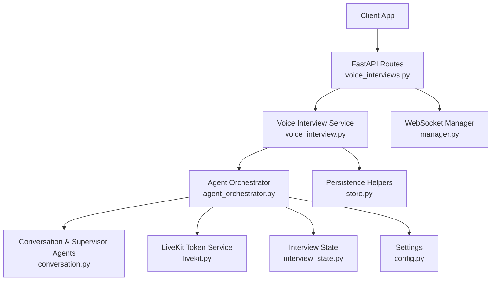
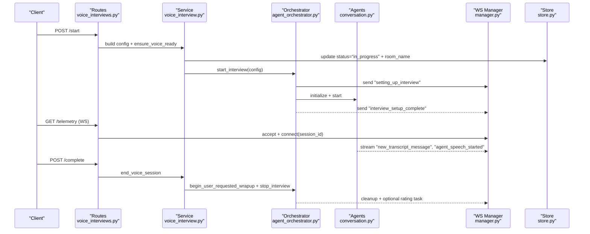
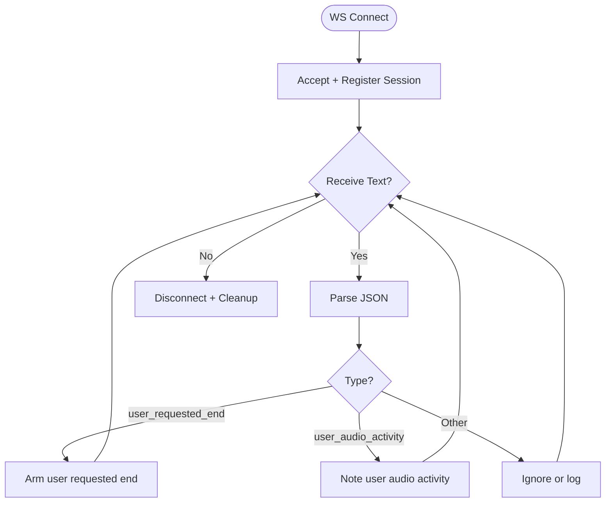
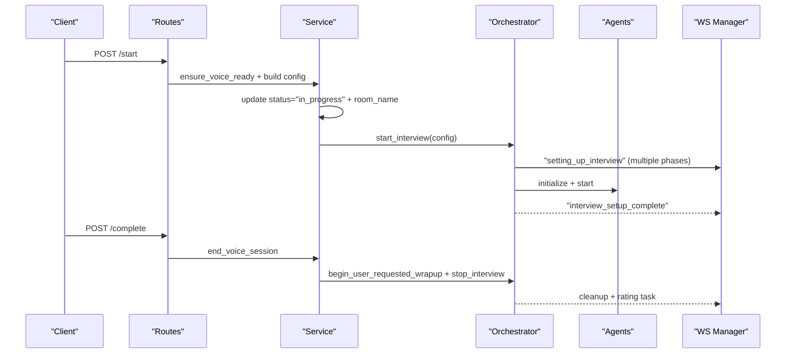
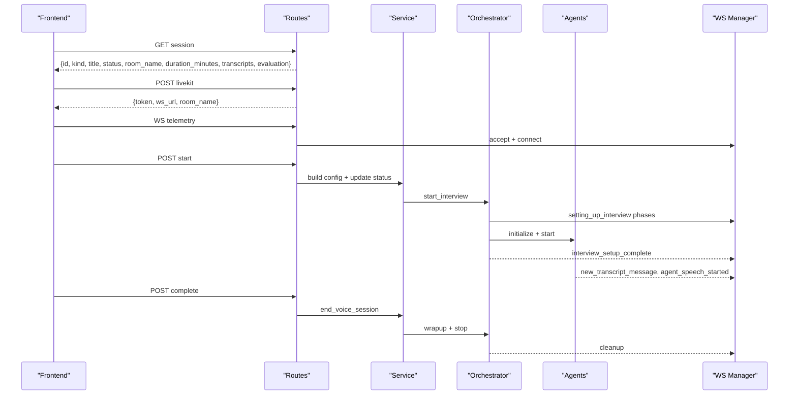
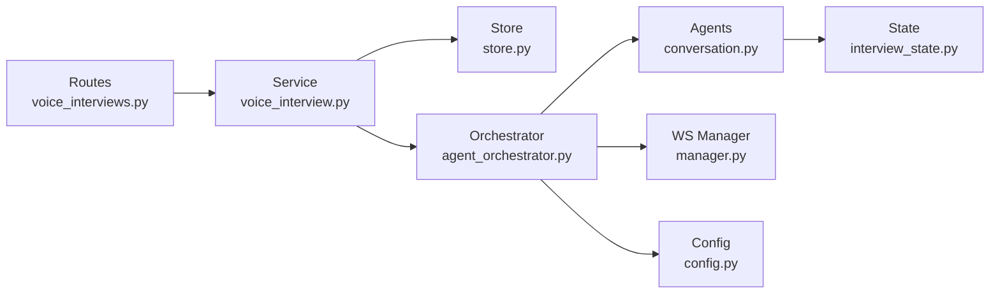

# Voice Interview Orchestration API

<cite>
**Referenced Files in This Document**
- [voice_interviews.py](file://Backend/app/api/v1/voice_interviews.py)
- [voice_interview.py](file://Backend/app/services/voice_interview.py)
- [livekit.py](file://Backend/app/services/livekit.py)
- [agent_orchestrator.py](file://Backend/app/ai/services/agent_orchestrator.py)
- [conversation.py](file://Backend/app/ai/agents/conversation.py)
- [interview_state.py](file://Backend/app/ai/utils/interview_state.py)
- [manager.py](file://Backend/app/websocket/manager.py)
- [config.py](file://Backend/app/core/config.py)
- [store.py](file://Backend/app/db/store.py)
- [interview.py](file://Backend/app/api/models/interview.py)
- [interview.py (schema)](file://Backend/app/schemas/interview.py)
</cite>

## Table of Contents
1. Introduction
2. Project Structure
3. Core Components
4. Architecture Overview
5. Detailed Component Analysis
6. Dependency Analysis
7. Performance Considerations
8. Troubleshooting Guide
9. Conclusion
10. Appendices

## Introduction
This document provides detailed API documentation for voice interview orchestration endpoints that manage end-to-end voice interviews with AI agents, LiveKit room lifecycle, real-time communication via WebSocket telemetry, and post-interview analysis. It covers:
- Interview session creation and configuration
- LiveKit room management and participant tokens
- Real-time communication setup and event handling
- Interview lifecycle operations: start, pause/resume behavior, and completion
- Telemetry streaming and recording management
- Integration with AI agents for automated interviewing and transcription
- Example flows and error handling strategies

## Project Structure
The voice interview feature spans FastAPI routes, service orchestration, LiveKit integration, AI agent coordination, WebSocket telemetry, and persistence helpers.

**Diagram sources**
- [voice_interviews.py:177-384](file://Backend/app/api/v1/voice_interviews.py#L177-L384)
- [voice_interview.py:189-251](file://Backend/app/services/voice_interview.py#L189-L251)
- [agent_orchestrator.py:42-192](file://Backend/app/ai/services/agent_orchestrator.py#L42-L192)
- [conversation.py:184-234](file://Backend/app/ai/agents/conversation.py#L184-L234)
- [livekit.py:10-38](file://Backend/app/services/livekit.py#L10-L38)
- [manager.py:14-95](file://Backend/app/websocket/manager.py#L14-L95)
- [config.py:72-118](file://Backend/app/core/config.py#L72-L118)
- [store.py:1313-1392](file://Backend/app/db/store.py#L1313-L1392)

**Section sources**
- [voice_interviews.py:1-416](file://Backend/app/api/v1/voice_interviews.py#L1-L416)
- [voice_interview.py:1-272](file://Backend/app/services/voice_interview.py#L1-L272)
- [agent_orchestrator.py:1-370](file://Backend/app/ai/services/agent_orchestrator.py#L1-L370)
- [conversation.py:1-800](file://Backend/app/ai/agents/conversation.py#L1-L800)
- [manager.py:1-96](file://Backend/app/websocket/manager.py#L1-L96)
- [config.py:1-215](file://Backend/app/core/config.py#L1-L215)
- [store.py:1300-1499](file://Backend/app/db/store.py#L1300-L1499)

## Core Components
- FastAPI voice interview routes: Provide endpoints to get session info, request LiveKit tokens, start sessions, complete sessions, and connect telemetry WebSockets.
- Voice interview service: Builds interview configurations, ensures prerequisites, starts/stops background orchestrator tasks, and issues participant tokens.
- Agent orchestrator: Manages the full lifecycle of AI agents, connects to LiveKit rooms, initializes conversation and supervisor agents, and coordinates cleanup and rating generation.
- Conversation agent: Handles real-time speech processing, transcript capture, turn management, time-based controls, and end-interview confirmation flow.
- WebSocket manager: Tracks active connections per session, sends messages, and buffers pending messages when no clients are connected.
- Persistence helpers: Update attempt status, transcripts, evaluation, identity verification, and room names; load attempts by candidate ownership.
- Configuration: Centralized settings for LiveKit, AI providers, timing, VAD, and voice interview toggles.

**Section sources**
- [voice_interviews.py:177-416](file://Backend/app/api/v1/voice_interviews.py#L177-L416)
- [voice_interview.py:53-251](file://Backend/app/services/voice_interview.py#L53-L251)
- [agent_orchestrator.py:29-192](file://Backend/app/ai/services/agent_orchestrator.py#L29-L192)
- [conversation.py:184-800](file://Backend/app/ai/agents/conversation.py#L184-L800)
- [manager.py:14-95](file://Backend/app/websocket/manager.py#L14-L95)
- [store.py:1313-1392](file://Backend/app/db/store.py#L1313-L1392)
- [config.py:72-118](file://Backend/app/core/config.py#L72-L118)

## Architecture Overview
The system uses a layered architecture:
- API layer exposes REST endpoints and WebSocket endpoints for telemetry.
- Service layer builds configs, validates environment readiness, and manages background tasks.
- Orchestrator layer coordinates AI agents and LiveKit room lifecycle.
- Agent layer implements conversation logic, speech handling, and state transitions.
- WebSocket layer streams telemetry events to clients.
- Storage layer persists attempts, transcripts, evaluations, and identity verification results.

**Diagram sources**
- [voice_interviews.py:204-255](file://Backend/app/api/v1/voice_interviews.py#L204-L255)
- [voice_interview.py:189-227](file://Backend/app/services/voice_interview.py#L189-L227)
- [agent_orchestrator.py:42-192](file://Backend/app/ai/services/agent_orchestrator.py#L42-L192)
- [conversation.py:204-234](file://Backend/app/ai/agents/conversation.py#L204-L234)
- [manager.py:22-38](file://Backend/app/websocket/manager.py#L22-L38)
- [store.py:1333-1363](file://Backend/app/db/store.py#L1333-L1363)

## Detailed Component Analysis

### Voice Interview Endpoints
- Get session info:
  - Profile screening: GET /candidates/me/profile-interview-attempts/{attempt_id}/voice
  - Job interview: GET /candidates/me/applied-interviews/{attempt_id}/voice
- Request LiveKit token:
  - Profile screening: POST /candidates/me/profile-interview-attempts/{attempt_id}/voice/livekit
  - Job interview: POST /candidates/me/applied-interviews/{attempt_id}/voice/livekit
- Start interview:
  - Profile screening: POST /candidates/me/profile-interview-attempts/{attempt_id}/voice/start
  - Job interview: POST /candidates/me/applied-interviews/{attempt_id}/voice/start
- Complete interview:
  - Profile screening: POST /candidates/me/profile-interview-attempts/{attempt_id}/voice/complete
  - Job interview: POST /candidates/me/applied-interviews/{attempt_id}/voice/complete
- Identity check:
  - Profile screening: POST /candidates/me/profile-interview-attempts/{attempt_id}/voice/identity-check
  - Job interview: POST /candidates/me/applied-interviews/{attempt_id}/voice/identity-check
- Telemetry WebSocket:
  - Profile screening: WS /candidates/me/profile-interview-attempts/{attempt_id}/voice/telemetry
  - Job interview: WS /candidates/me/applied-interviews/{attempt_id}/voice/telemetry

Key behaviors:
- Start validates environment readiness, loads attempt, updates status to “in_progress”, sets room name, and launches background orchestrator.
- Complete ends the session, updates status to “submitted”, triggers synthesis analysis, and returns refreshed session payload.
- Identity check decodes live image, compares against stored avatar, and persists verdict.

**Section sources**
- [voice_interviews.py:140-173](file://Backend/app/api/v1/voice_interviews.py#L140-L173)
- [voice_interviews.py:177-255](file://Backend/app/api/v1/voice_interviews.py#L177-L255)
- [voice_interviews.py:290-384](file://Backend/app/api/v1/voice_interviews.py#L290-L384)
- [voice_interviews.py:258-287](file://Backend/app/api/v1/voice_interviews.py#L258-L287)
- [voice_interviews.py:387-416](file://Backend/app/api/v1/voice_interviews.py#L387-L416)

### LiveKit Room Management
- Participant token issuance:
  - Route delegates to service which checks configuration and generates JWT with grants for joining the room.
- Agent token issuance:
  - Orchestrator generates an agent token with agent grant to join the same room.

Configuration requirements:
- LiveKit URL, API key, and secret must be set.
- Token TTL is enforced by settings validation.

**Section sources**
- [voice_interviews.py:189-201](file://Backend/app/api/v1/voice_interviews.py#L189-L201)
- [voice_interviews.py:306-318](file://Backend/app/api/v1/voice_interviews.py#L306-L318)
- [voice_interview.py:230-251](file://Backend/app/services/voice_interview.py#L230-L251)
- [livekit.py:10-38](file://Backend/app/services/livekit.py#L10-L38)
- [agent_orchestrator.py:349-361](file://Backend/app/ai/services/agent_orchestrator.py#L349-L361)
- [config.py:72-76](file://Backend/app/core/config.py#L72-L76)

### Real-Time Communication Setup and WebSocket Events
- WebSocket connection:
  - Accepts connection and registers it under the session ID.
  - Flushes any pending messages if the client reconnects late.
- Event types:
  - Setting up phases: "setting_up_interview" with statuses like "starting", "generating_persona", "connecting_to_room", "initializing_agents".
  - Completion: "interview_setup_complete".
  - Transcript events: "new_transcript_message" for user and agent speech.
  - Agent activity: "agent_speech_started".
  - Error: "interview_setup_failed" with error details.
- Client signals:
  - "user_requested_end": triggers preparation and arming of user-requested end on the conversation agent.
  - "user_audio_activity": notifies agent of audio activity.

**Diagram sources**
- [manager.py:22-46](file://Backend/app/websocket/manager.py#L22-L46)
- [manager.py:48-88](file://Backend/app/websocket/manager.py#L48-L88)
- [voice_interviews.py:258-287](file://Backend/app/api/v1/voice_interviews.py#L258-L287)
- [voice_interviews.py:387-416](file://Backend/app/api/v1/voice_interviews.py#L387-L416)
- [agent_orchestrator.py:61-66](file://Backend/app/ai/services/agent_orchestrator.py#L61-L66)
- [agent_orchestrator.py:87-91](file://Backend/app/ai/services/agent_orchestrator.py#L87-L91)
- [agent_orchestrator.py:114-118](file://Backend/app/ai/services/agent_orchestrator.py#L114-L118)
- [agent_orchestrator.py:134-138](file://Backend/app/ai/services/agent_orchestrator.py#L134-L138)
- [agent_orchestrator.py:175-180](file://Backend/app/ai/services/agent_orchestrator.py#L175-L180)
- [agent_orchestrator.py:184-192](file://Backend/app/ai/services/agent_orchestrator.py#L184-L192)
- [conversation.py:759-800](file://Backend/app/ai/agents/conversation.py#L759-L800)

**Section sources**
- [manager.py:14-95](file://Backend/app/websocket/manager.py#L14-L95)
- [voice_interviews.py:258-287](file://Backend/app/api/v1/voice_interviews.py#L258-L287)
- [voice_interviews.py:387-416](file://Backend/app/api/v1/voice_interviews.py#L387-L416)
- [agent_orchestrator.py:61-192](file://Backend/app/ai/services/agent_orchestrator.py#L61-L192)
- [conversation.py:759-800](file://Backend/app/ai/agents/conversation.py#L759-L800)

### Interview Lifecycle Management
- Start:
  - Validates environment readiness.
  - Loads attempt and ensures not already evaluated.
  - Updates status to “in_progress” and sets room name.
  - Launches background orchestrator to generate prompts, connect to LiveKit, initialize agents, and signal readiness.
- Pause/Resume:
  - No explicit pause endpoint; resume is supported by reloading persisted transcripts before agent setup.
  - The orchestrator refreshes transcripts from the database to continue context.
- Complete:
  - Ends the session, triggers wrap-up, updates status to “submitted”, and schedules analysis.

**Diagram sources**
- [voice_interviews.py:204-255](file://Backend/app/api/v1/voice_interviews.py#L204-L255)
- [voice_interviews.py:321-384](file://Backend/app/api/v1/voice_interviews.py#L321-L384)
- [voice_interview.py:154-166](file://Backend/app/services/voice_interview.py#L154-L166)
- [voice_interview.py:189-227](file://Backend/app/services/voice_interview.py#L189-L227)
- [agent_orchestrator.py:42-192](file://Backend/app/ai/services/agent_orchestrator.py#L42-L192)
- [agent_orchestrator.py:203-243](file://Backend/app/ai/services/agent_orchestrator.py#L203-L243)
- [agent_orchestrator.py:244-277](file://Backend/app/ai/services/agent_orchestrator.py#L244-L277)

**Section sources**
- [voice_interviews.py:204-255](file://Backend/app/api/v1/voice_interviews.py#L204-L255)
- [voice_interviews.py:321-384](file://Backend/app/api/v1/voice_interviews.py#L321-L384)
- [voice_interview.py:154-227](file://Backend/app/services/voice_interview.py#L154-L227)
- [agent_orchestrator.py:42-277](file://Backend/app/ai/services/agent_orchestrator.py#L42-L277)

### Telemetry Data Streaming
- Transcript streaming:
  - User and agent speech are streamed via WebSocket with timestamps and speaker labels.
- Agent activity:
  - Signals when the agent begins speaking.
- Setup progress:
  - Phases indicate prompt generation, room connection, and agent initialization.
- Error reporting:
  - Setup failures are reported with error details.

**Section sources**
- [conversation.py:204-234](file://Backend/app/ai/agents/conversation.py#L204-L234)
- [conversation.py:607-635](file://Backend/app/ai/agents/conversation.py#L607-L635)
- [conversation.py:759-800](file://Backend/app/ai/agents/conversation.py#L759-L800)
- [agent_orchestrator.py:61-192](file://Backend/app/ai/services/agent_orchestrator.py#L61-L192)
- [manager.py:48-88](file://Backend/app/websocket/manager.py#L48-L88)

### Recording Management
- Backend recording note:
  - The orchestrator comments that backend recording is handled by the frontend via a separate recording API endpoint.
- Audio/video path updates:
  - Methods exist to update interview records with recorded media paths if provided by external processes.

**Section sources**
- [agent_orchestrator.py:244-277](file://Backend/app/ai/services/agent_orchestrator.py#L244-L277)
- [agent_orchestrator.py:282-306](file://Backend/app/ai/services/agent_orchestrator.py#L282-L306)

### Integration with AI Agents and Transcription Services
- Prompt generation:
  - Orchestrator generates both conversation and supervisor prompts using configured models.
- Real-time transcription:
  - Conversation agent integrates with OpenAI Realtime model for input transcription and response generation.
- Turn detection and silence handling:
  - Settings control VAD type, eagerness, thresholds, and silence durations.
- Time-based controls:
  - Interview state tracks elapsed time, remaining time, warnings, grace periods, and hard stops after end announcements.

**Section sources**
- [agent_orchestrator.py:77-192](file://Backend/app/ai/services/agent_orchestrator.py#L77-L192)
- [conversation.py:184-234](file://Backend/app/ai/agents/conversation.py#L184-L234)
- [config.py:83-118](file://Backend/app/core/config.py#L83-L118)
- [interview_state.py:22-101](file://Backend/app/ai/utils/interview_state.py#L22-L101)
- [interview_state.py:124-170](file://Backend/app/ai/utils/interview_state.py#L124-L170)
- [interview_state.py:171-230](file://Backend/app/ai/utils/interview_state.py#L171-L230)

### Example Interview Session Flows
- Profile Screening Flow:
  - Client calls GET session info, requests LiveKit token, connects telemetry WebSocket, starts interview, receives setup events, streams transcripts, completes interview, and receives final payload.
- Job Interview Flow:
  - Similar to profile screening but includes job posting context and different configuration builder.

**Diagram sources**
- [voice_interviews.py:177-255](file://Backend/app/api/v1/voice_interviews.py#L177-L255)
- [voice_interviews.py:290-384](file://Backend/app/api/v1/voice_interviews.py#L290-L384)
- [voice_interview.py:189-227](file://Backend/app/services/voice_interview.py#L189-L227)
- [agent_orchestrator.py:42-192](file://Backend/app/ai/services/agent_orchestrator.py#L42-L192)
- [manager.py:22-46](file://Backend/app/websocket/manager.py#L22-L46)

**Section sources**
- [voice_interviews.py:177-384](file://Backend/app/api/v1/voice_interviews.py#L177-L384)
- [voice_interview.py:189-227](file://Backend/app/services/voice_interview.py#L189-L227)
- [agent_orchestrator.py:42-192](file://Backend/app/ai/services/agent_orchestrator.py#L42-L192)
- [manager.py:22-46](file://Backend/app/websocket/manager.py#L22-L46)

### Error Handling Strategies
- Missing configuration:
  - If LiveKit or AI is not configured, start returns a 503 with specific codes.
- Already evaluated:
  - Attempting to start an already completed interview returns 409 conflict.
- Not found:
  - Invalid or foreign attempt IDs return 404.
- WebSocket errors:
  - Failed message sends are logged and failed connections are removed; pending messages are buffered and retried on reconnect.
- Setup failures:
  - Orchestrator catches exceptions during setup and emits failure events with error details.

**Section sources**
- [voice_interview.py:154-166](file://Backend/app/services/voice_interview.py#L154-L166)
- [voice_interviews.py:215-220](file://Backend/app/api/v1/voice_interviews.py#L215-L220)
- [voice_interviews.py:332-342](file://Backend/app/api/v1/voice_interviews.py#L332-L342)
- [manager.py:60-88](file://Backend/app/websocket/manager.py#L60-L88)
- [agent_orchestrator.py:184-192](file://Backend/app/ai/services/agent_orchestrator.py#L184-L192)

## Dependency Analysis
- Routes depend on service functions for building configs and managing session lifecycle.
- Service depends on store for persistence and orchestrator for background tasks.
- Orchestrator depends on agents, websocket manager, and configuration.
- Agents depend on interview state for time-based controls and conversation flow.
- WebSocket manager maintains per-session connections and message buffering.

**Diagram sources**
- [voice_interviews.py:177-384](file://Backend/app/api/v1/voice_interviews.py#L177-L384)
- [voice_interview.py:189-251](file://Backend/app/services/voice_interview.py#L189-L251)
- [agent_orchestrator.py:42-192](file://Backend/app/ai/services/agent_orchestrator.py#L42-L192)
- [conversation.py:184-234](file://Backend/app/ai/agents/conversation.py#L184-L234)
- [manager.py:14-95](file://Backend/app/websocket/manager.py#L14-L95)
- [config.py:72-118](file://Backend/app/core/config.py#L72-L118)
- [interview_state.py:22-101](file://Backend/app/ai/utils/interview_state.py#L22-L101)

**Section sources**
- [voice_interviews.py:177-384](file://Backend/app/api/v1/voice_interviews.py#L177-L384)
- [voice_interview.py:189-251](file://Backend/app/services/voice_interview.py#L189-L251)
- [agent_orchestrator.py:42-192](file://Backend/app/ai/services/agent_orchestrator.py#L42-L192)
- [conversation.py:184-234](file://Backend/app/ai/agents/conversation.py#L184-L234)
- [manager.py:14-95](file://Backend/app/websocket/manager.py#L14-L95)
- [config.py:72-118](file://Backend/app/core/config.py#L72-L118)
- [interview_state.py:22-101](file://Backend/app/ai/utils/interview_state.py#L22-L101)

## Performance Considerations
- Background tasks:
  - Orchestrator runs heavy setup in background tasks to avoid blocking HTTP responses.
- Message buffering:
  - WebSocket manager buffers pending messages when no clients are connected and flushes them upon reconnect.
- Deduplication:
  - Conversation agent deduplicates repeated user and agent transcripts to reduce noise.
- Time-based controls:
  - Grace periods and no-new-questions phases prevent abrupt interruptions and allow finishing current turns.
- Token TTL:
  - LiveKit token TTL is validated to balance security and usability.

[No sources needed since this section provides general guidance]

## Troubleshooting Guide
- LiveKit not configured:
  - Ensure THOS_LIVEKIT_URL, THOS_LIVEKIT_API_KEY, and THOS_LIVEKIT_API_SECRET are set.
- AI not configured:
  - Ensure THOS_AI_API_KEY is set for voice interviews.
- Already evaluated:
  - Do not start an interview that has status “evaluated”.
- Not found:
  - Verify attempt_id belongs to the authenticated candidate.
- WebSocket disconnects:
  - Check logs for send failures; reconnect will flush pending messages.
- Setup failures:
  - Inspect “interview_setup_failed” events for error details.

**Section sources**
- [voice_interview.py:154-166](file://Backend/app/services/voice_interview.py#L154-L166)
- [voice_interviews.py:215-220](file://Backend/app/api/v1/voice_interviews.py#L215-L220)
- [voice_interviews.py:332-342](file://Backend/app/api/v1/voice_interviews.py#L332-L342)
- [manager.py:60-88](file://Backend/app/websocket/manager.py#L60-L88)
- [agent_orchestrator.py:184-192](file://Backend/app/ai/services/agent_orchestrator.py#L184-L192)

## Conclusion
The voice interview orchestration system provides a robust, real-time interview experience powered by AI agents and LiveKit. It supports secure token issuance, background orchestration, telemetry streaming, and post-interview analysis. Proper configuration, error handling, and performance optimizations ensure reliable operation across diverse environments.

[No sources needed since this section summarizes without analyzing specific files]

## Appendices

### API Reference Summary
- Endpoints:
  - GET /candidates/me/profile-interview-attempts/{attempt_id}/voice
  - POST /candidates/me/profile-interview-attempts/{attempt_id}/voice/livekit
  - POST /candidates/me/profile-interview-attempts/{attempt_id}/voice/start
  - POST /candidates/me/profile-interview-attempts/{attempt_id}/voice/complete
  - POST /candidates/me/profile-interview-attempts/{attempt_id}/voice/identity-check
  - WS /candidates/me/profile-interview-attempts/{attempt_id}/voice/telemetry
  - GET /candidates/me/applied-interviews/{attempt_id}/voice
  - POST /candidates/me/applied-interviews/{attempt_id}/voice/livekit
  - POST /candidates/me/applied-interviews/{attempt_id}/voice/start
  - POST /candidates/me/applied-interviews/{attempt_id}/voice/complete
  - POST /candidates/me/applied-interviews/{attempt_id}/voice/identity-check
  - WS /candidates/me/applied-interviews/{attempt_id}/voice/telemetry

- Key responses:
  - Session payload includes id, kind, title, status, room_name, duration_minutes, transcripts, evaluation, identity_verification, started_via, questions.
  - LiveKit token response includes server_url, token, identity, expires_in_seconds.

**Section sources**
- [voice_interviews.py:177-255](file://Backend/app/api/v1/voice_interviews.py#L177-L255)
- [voice_interviews.py:290-384](file://Backend/app/api/v1/voice_interviews.py#L290-L384)
- [interview.py (schema):4-12](file://Backend/app/schemas/interview.py#L4-L12)