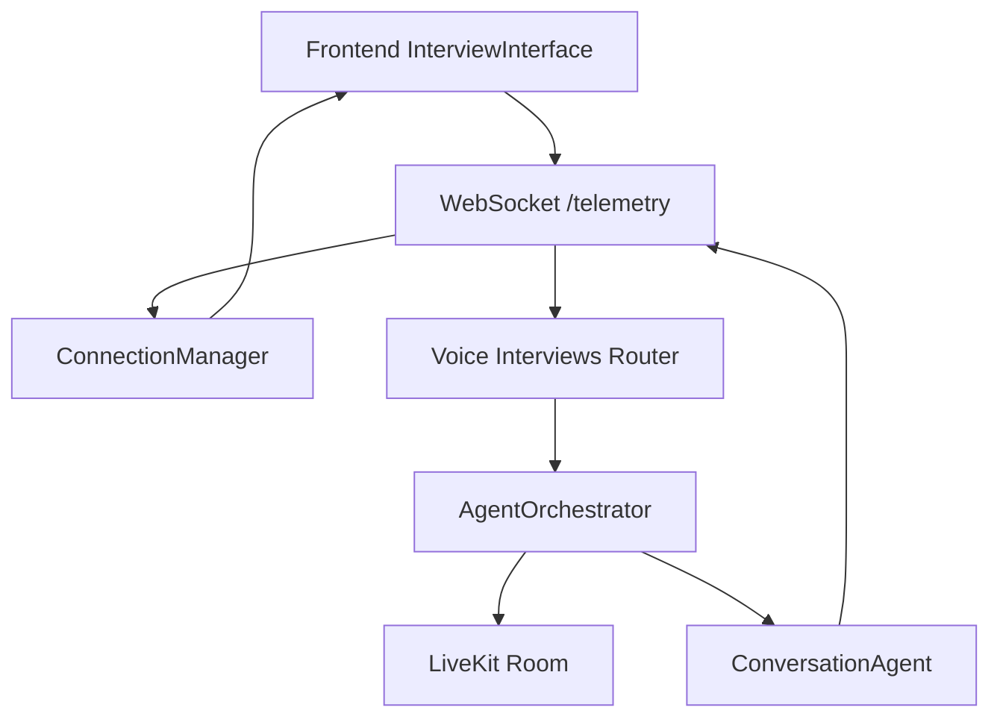
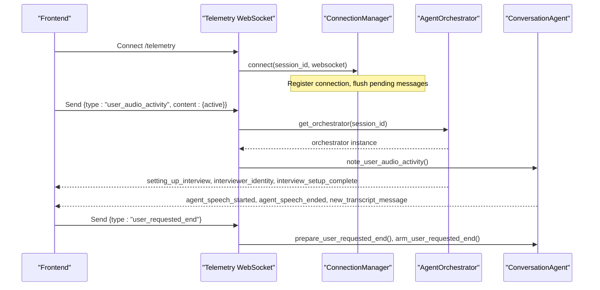
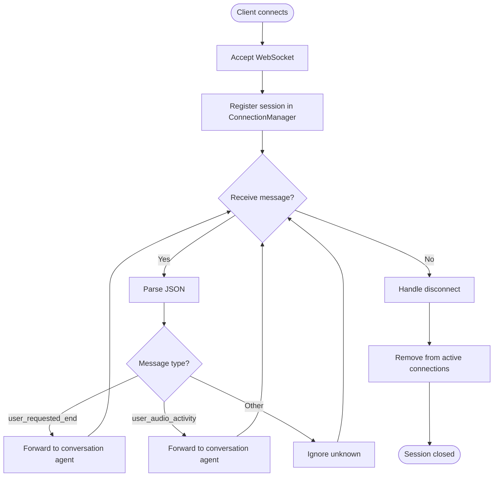
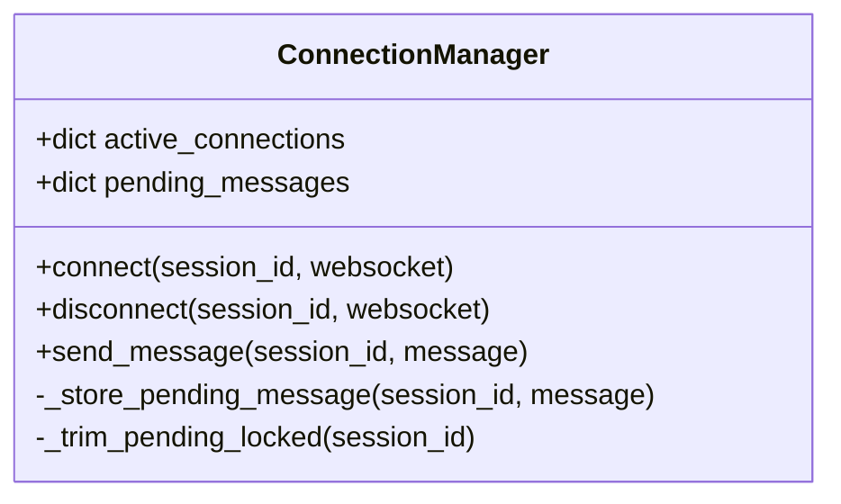
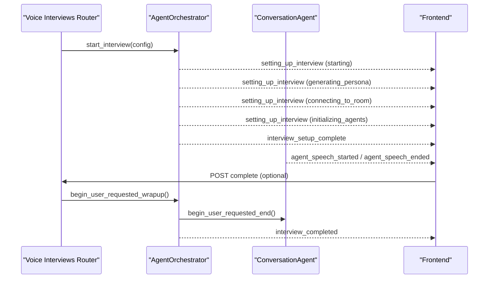
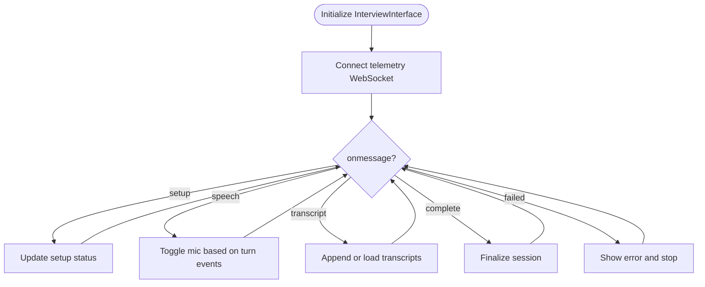
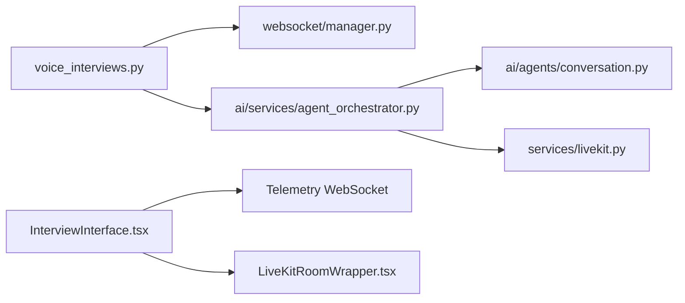

# WebSocket Telemetry & Real-time Events

<cite>
**Referenced Files in This Document**
- [manager.py](file://Backend/app/websocket/manager.py)
- [voice_interviews.py](file://Backend/app/api/v1/voice_interviews.py)
- [agent_orchestrator.py](file://Backend/app/ai/services/agent_orchestrator.py)
- [conversation.py](file://Backend/app/ai/agents/conversation.py)
- [voice_interview.py](file://Backend/app/services/voice_interview.py)
- [livekit.py](file://Backend/app/services/livekit.py)
- [InterviewInterface.tsx](file://Frontend/components/interviews/voice/InterviewInterface.tsx)
- [LiveKitRoomWrapper.tsx](file://Frontend/components/interviews/voice/LiveKitRoomWrapper.tsx)
</cite>

## Table of Contents
1. [Introduction](#introduction)
2. [Project Structure](#project-structure)
3. [Core Components](#core-components)
4. [Architecture Overview](#architecture-overview)
5. [Detailed Component Analysis](#detailed-component-analysis)
6. [Dependency Analysis](#dependency-analysis)
7. [Performance Considerations](#performance-considerations)
8. [Troubleshooting Guide](#troubleshooting-guide)
9. [Conclusion](#conclusion)
10. [Appendices](#appendices)

## Introduction
This document explains the real-time telemetry system used during voice interviews. It covers how clients connect to a WebSocket endpoint, how messages flow between the frontend and backend, and how the backend coordinates with AI agents through an orchestrator. It also documents supported event types (including user_requested_end and user_audio_activity), message formats, error handling strategies, and provides client-side implementation patterns for connecting, sending events, and reacting to telemetry updates.

## Project Structure
The telemetry system spans both backend and frontend:
- Backend FastAPI endpoints expose WebSocket routes per interview attempt for telemetry.
- A connection manager tracks active WebSocket connections per session and buffers messages when no clients are connected.
- An agent orchestrator initializes and manages AI agents, connects to LiveKit rooms, and emits setup and conversation events over telemetry.
- Frontend components establish the LiveKit room and telemetry WebSocket, send audio activity signals, and react to agent state changes.

**Diagram sources**
- [voice_interviews.py:258-288](file://Backend/app/api/v1/voice_interviews.py#L258-L288)
- [manager.py:14-96](file://Backend/app/websocket/manager.py#L14-L96)
- [agent_orchestrator.py:29-182](file://Backend/app/ai/services/agent_orchestrator.py#L29-L182)
- [conversation.py:759-847](file://Backend/app/ai/agents/conversation.py#L759-L847)
- [InterviewInterface.tsx:474-724](file://Frontend/components/interviews/voice/InterviewInterface.tsx#L474-L724)

**Section sources**
- [voice_interviews.py:258-288](file://Backend/app/api/v1/voice_interviews.py#L258-L288)
- [manager.py:14-96](file://Backend/app/websocket/manager.py#L14-L96)
- [agent_orchestrator.py:29-182](file://Backend/app/ai/services/agent_orchestrator.py#L29-L182)
- [InterviewInterface.tsx:474-724](file://Frontend/components/interviews/voice/InterviewInterface.tsx#L474-L724)

## Core Components
- WebSocket Connection Manager: Tracks active connections per session, sends messages, and stores pending messages if no clients are present.
- Voice Interviews Router: Exposes telemetry WebSocket endpoints for profile and applied interviews; forwards specific client signals to the active conversation agent.
- Agent Orchestrator: Initializes agents, connects to LiveKit, emits setup progress and completion events, and coordinates wrap-up flows.
- Conversation Agent: Emits turn-taking and transcript events over telemetry and integrates with supervisor logic.
- Frontend Interview Interface: Connects telemetry WebSocket, sends user audio activity, handles setup and conversation events, and manages microphone permissions.

**Section sources**
- [manager.py:14-96](file://Backend/app/websocket/manager.py#L14-L96)
- [voice_interviews.py:258-288](file://Backend/app/api/v1/voice_interviews.py#L258-L288)
- [agent_orchestrator.py:42-182](file://Backend/app/ai/services/agent_orchestrator.py#L42-L182)
- [conversation.py:759-847](file://Backend/app/ai/agents/conversation.py#L759-L847)
- [InterviewInterface.tsx:474-724](file://Frontend/components/interviews/voice/InterviewInterface.tsx#L474-L724)

## Architecture Overview
The telemetry architecture ensures reliable real-time coordination between the candidate’s browser and the backend AI agents:
- The frontend establishes a WebSocket connection to the appropriate telemetry endpoint using the interview token.
- On connection, the manager registers the WebSocket under the session ID.
- The orchestrator performs background setup steps and publishes status updates via telemetry.
- During the interview, the conversation agent emits speech and transcript events; the frontend reacts by updating UI and managing microphone access.
- Client signals like user_requested_end or user_audio_activity are forwarded to the active conversation agent to influence behavior.

**Diagram sources**
- [voice_interviews.py:258-288](file://Backend/app/api/v1/voice_interviews.py#L258-L288)
- [manager.py:22-46](file://Backend/app/websocket/manager.py#L22-L46)
- [agent_orchestrator.py:42-182](file://Backend/app/ai/services/agent_orchestrator.py#L42-L182)
- [conversation.py:759-847](file://Backend/app/ai/agents/conversation.py#L759-L847)

## Detailed Component Analysis

### WebSocket Connection Lifecycle
- Establishment:
  - Frontend creates a WebSocket to the telemetry endpoint derived from the interview token.
  - Backend accepts the connection and registers it with the connection manager under the session ID.
  - If there were pending messages before connection, they are flushed immediately.
- Message Handling:
  - The router parses incoming JSON messages and forwards known event types to the active conversation agent.
  - Unknown or malformed messages are ignored without breaking the connection.
- Disconnection:
  - On disconnect, the manager removes the WebSocket from the active set and cleans up empty sessions.

**Diagram sources**
- [voice_interviews.py:258-288](file://Backend/app/api/v1/voice_interviews.py#L258-L288)
- [manager.py:22-46](file://Backend/app/websocket/manager.py#L22-L46)

**Section sources**
- [voice_interviews.py:258-288](file://Backend/app/api/v1/voice_interviews.py#L258-L288)
- [manager.py:22-46](file://Backend/app/websocket/manager.py#L22-L46)

### Event Types and Message Formats
- Client-to-server events:
  - user_requested_end: Signals that the candidate requested to end the interview.
  - user_audio_activity: Indicates whether the candidate is currently speaking (active boolean).
- Server-to-client events:
  - setting_up_interview: Setup progress with status values such as starting, generating_persona, connecting_to_room, initializing_agents, reconnecting_realtime, realtime_recovered.
  - interviewer_identity: Provides the generated interviewer name.
  - interview_setup_complete: Indicates the interview is ready.
  - interview_failed: Reports setup failure details.
  - agent_turn_pending: Candidate should pause speaking while agent prepares.
  - agent_turn_cleared: Candidate may resume speaking.
  - agent_speech_started: Agent begins speaking.
  - agent_speech_ended: Agent finished speaking; includes optional reason and text.
  - user_turn_granted: Authoritative signal to unlock the candidate’s microphone.
  - answer_time_cap: Hard-mute at the answer time cap until agent finishes.
  - user_speech_started/user_speech_ended: Transcript boundaries for user speech.
  - new_transcript_message: Append a transcript entry.
  - transcript_history: Load persisted transcripts on resume.
  - interview_completed: Finalize the interview session.

```mermaid
classDiagram
class TelemetryEvent {
+string type
+object content
}
class UserRequestedEnd {
+string type = "user_requested_end"
}
class UserAudioActivity {
+string type = "user_audio_activity"
+boolean content.active
}
class SetupStatus {
+string type = "setting_up_interview"
+string content.status
}
class InterviewerIdentity {
+string type = "interviewer_identity"
+string content.name
}
class SpeechEvents {
+string type = "agent_speech_started|agent_speech_ended"
+object content
}
class TurnEvents {
+string type = "user_turn_granted|answer_time_cap"
+object content
}
class TranscriptEvents {
+string type = "new_transcript_message|transcript_history"
+object content
}
class CompletionEvents {
+string type = "interview_setup_complete|interview_completed|interview_failed"
+object content
}
TelemetryEvent <|-- UserRequestedEnd
TelemetryEvent <|-- UserAudioActivity
TelemetryEvent <|-- SetupStatus
TelemetryEvent <|-- InterviewerIdentity
TelemetryEvent <|-- SpeechEvents
TelemetryEvent <|-- TurnEvents
TelemetryEvent <|-- TranscriptEvents
TelemetryEvent <|-- CompletionEvents
```

**Diagram sources**
- [agent_orchestrator.py:61-182](file://Backend/app/ai/services/agent_orchestrator.py#L61-L182)
- [conversation.py:759-847](file://Backend/app/ai/agents/conversation.py#L759-L847)
- [InterviewInterface.tsx:505-674](file://Frontend/components/interviews/voice/InterviewInterface.tsx#L505-L674)

**Section sources**
- [agent_orchestrator.py:61-182](file://Backend/app/ai/services/agent_orchestrator.py#L61-L182)
- [conversation.py:759-847](file://Backend/app/ai/agents/conversation.py#L759-L847)
- [InterviewInterface.tsx:505-674](file://Frontend/components/interviews/voice/InterviewInterface.tsx#L505-L674)

### WebSocket Manager Role
- Maintains active connections per session and safely broadcasts messages.
- Stores messages when no clients are connected and flushes them upon reconnection.
- Trims pending message queues to prevent unbounded growth.
- Removes failed connections automatically and cleans up empty sessions.

**Diagram sources**
- [manager.py:14-96](file://Backend/app/websocket/manager.py#L14-L96)

**Section sources**
- [manager.py:14-96](file://Backend/app/websocket/manager.py#L14-L96)

### Integration with AI Agent Orchestrator
- The orchestrator starts a background setup sequence, emitting telemetry events for each phase.
- It generates prompts, connects to LiveKit, initializes agents, and signals readiness.
- On user-requested end, it triggers the conversation agent’s wrap-up flow and eventually stops the interview.
- It persists and refreshes transcripts to support resuming sessions.

**Diagram sources**
- [voice_interviews.py:204-255](file://Backend/app/api/v1/voice_interviews.py#L204-L255)
- [agent_orchestrator.py:42-182](file://Backend/app/ai/services/agent_orchestrator.py#L42-L182)
- [agent_orchestrator.py:203-243](file://Backend/app/ai/services/agent_orchestrator.py#L203-L243)

**Section sources**
- [voice_interviews.py:204-255](file://Backend/app/api/v1/voice_interviews.py#L204-L255)
- [agent_orchestrator.py:42-182](file://Backend/app/ai/services/agent_orchestrator.py#L42-L182)
- [agent_orchestrator.py:203-243](file://Backend/app/ai/services/agent_orchestrator.py#L203-L243)

### Client-Side Implementation Patterns
- Establishing the telemetry WebSocket:
  - Create a WebSocket using the URL derived from the interview token.
  - Track connection state and update UI accordingly.
  - Implement exponential backoff retries with a maximum retry count.
- Sending events:
  - Emit user_audio_activity whenever local speaking state changes, respecting mute and agent states.
  - Emit user_requested_end when the candidate chooses to end the interview.
- Handling server events:
  - Update setup status based on setting_up_interview phases.
  - Manage microphone permissions on user_turn_granted and answer_time_cap.
  - Render transcripts on new_transcript_message and load history on transcript_history.
  - Finalize the session on interview_completed and handle failures on interview_failed.

**Diagram sources**
- [InterviewInterface.tsx:474-724](file://Frontend/components/interviews/voice/InterviewInterface.tsx#L474-L724)
- [InterviewInterface.tsx:265-315](file://Frontend/components/interviews/voice/InterviewInterface.tsx#L265-L315)

**Section sources**
- [InterviewInterface.tsx:474-724](file://Frontend/components/interviews/voice/InterviewInterface.tsx#L474-L724)
- [InterviewInterface.tsx:265-315](file://Frontend/components/interviews/voice/InterviewInterface.tsx#L265-L315)

## Dependency Analysis
- The voice interviews router depends on the WebSocket manager and the agent orchestrator to coordinate real-time behavior.
- The orchestrator depends on the conversation agent and LiveKit integration to manage media and AI interactions.
- The frontend depends on the LiveKit room wrapper to obtain tokens and on the telemetry WebSocket for control and feedback.

**Diagram sources**
- [voice_interviews.py:258-288](file://Backend/app/api/v1/voice_interviews.py#L258-L288)
- [agent_orchestrator.py:29-182](file://Backend/app/ai/services/agent_orchestrator.py#L29-L182)
- [conversation.py:759-847](file://Backend/app/ai/agents/conversation.py#L759-L847)
- [livekit.py:10-39](file://Backend/app/services/livekit.py#L10-L39)
- [InterviewInterface.tsx:474-724](file://Frontend/components/interviews/voice/InterviewInterface.tsx#L474-L724)
- [LiveKitRoomWrapper.tsx:21-104](file://Frontend/components/interviews/voice/LiveKitRoomWrapper.tsx#L21-L104)

**Section sources**
- [voice_interviews.py:258-288](file://Backend/app/api/v1/voice_interviews.py#L258-L288)
- [agent_orchestrator.py:29-182](file://Backend/app/ai/services/agent_orchestrator.py#L29-L182)
- [conversation.py:759-847](file://Backend/app/ai/agents/conversation.py#L759-L847)
- [livekit.py:10-39](file://Backend/app/services/livekit.py#L10-L39)
- [InterviewInterface.tsx:474-724](file://Frontend/components/interviews/voice/InterviewInterface.tsx#L474-L724)
- [LiveKitRoomWrapper.tsx:21-104](file://Frontend/components/interviews/voice/LiveKitRoomWrapper.tsx#L21-L104)

## Performance Considerations
- Pending message buffering: The manager caps queued messages to avoid memory growth and flushes them on reconnection.
- Background orchestration: Setup tasks run asynchronously to keep the API responsive and provide progressive UI updates.
- Microphone management: The frontend avoids unnecessary toggles and respects agent turn states to reduce latency and conflicts.
- Retry strategy: The frontend uses exponential backoff for telemetry reconnection to improve resilience under transient network issues.

[No sources needed since this section provides general guidance]

## Troubleshooting Guide
- Connection errors:
  - If the WebSocket closes with code 1008, treat it as invalid/expired link and do not auto-retry.
  - For other close events, implement retry with backoff and limit retries to avoid infinite loops.
- Setup failures:
  - Handle interview_setup_failed by resetting UI state and notifying users.
  - Check configuration for LiveKit and AI services; ensure required settings are present.
- Audio activity mismatches:
  - Ensure user_audio_activity is only sent when the mic is enabled and not blocked by agent turn states.
  - Use authoritative signals like user_turn_granted and answer_time_cap to synchronize mic state.
- Orchestration timeouts:
  - If user-requested wrap-up times out, fallback to sending interview_completed to finalize the session.

**Section sources**
- [InterviewInterface.tsx:677-707](file://Frontend/components/interviews/voice/InterviewInterface.tsx#L677-L707)
- [agent_orchestrator.py:203-243](file://Backend/app/ai/services/agent_orchestrator.py#L203-L243)
- [voice_interviews.py:258-288](file://Backend/app/api/v1/voice_interviews.py#L258-L288)

## Conclusion
The telemetry system provides robust real-time communication for voice interviews by combining a resilient WebSocket layer, an orchestrator-driven AI workflow, and a responsive frontend. It supports key events for controlling interview flow, managing audio activity, and delivering transcripts and setup progress. Proper error handling and performance optimizations ensure a smooth experience even under network variability and complex agent interactions.

[No sources needed since this section summarizes without analyzing specific files]

## Appendices

### Example Client-Side WebSocket Implementation
- Connect to telemetry:
  - Derive the WebSocket URL from the interview token.
  - Create a WebSocket instance and track open/close states.
  - Implement retry logic with exponential backoff.
- Send events:
  - Emit user_audio_activity with active true/false based on local speaking state.
  - Emit user_requested_end when the candidate requests to end.
- Handle events:
  - Update setup status on setting_up_interview.
  - Manage microphone permissions on user_turn_granted and answer_time_cap.
  - Render transcripts on new_transcript_message and load history on transcript_history.
  - Finalize on interview_completed and show errors on interview_failed.

**Section sources**
- [InterviewInterface.tsx:474-724](file://Frontend/components/interviews/voice/InterviewInterface.tsx#L474-L724)
- [InterviewInterface.tsx:265-315](file://Frontend/components/interviews/voice/InterviewInterface.tsx#L265-L315)