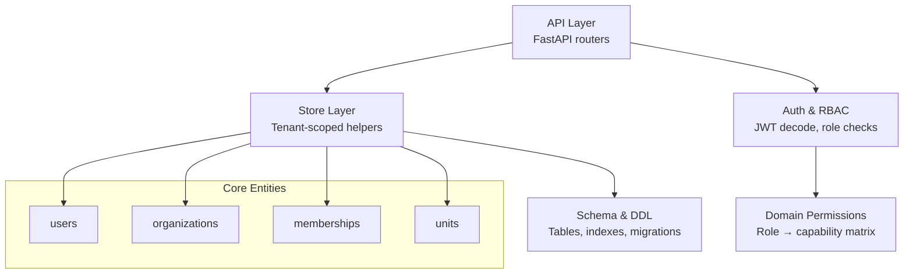
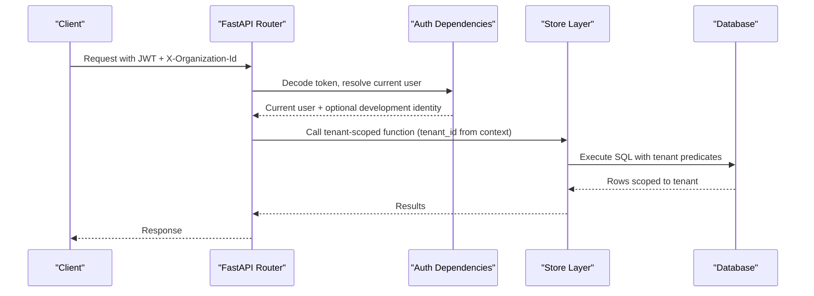
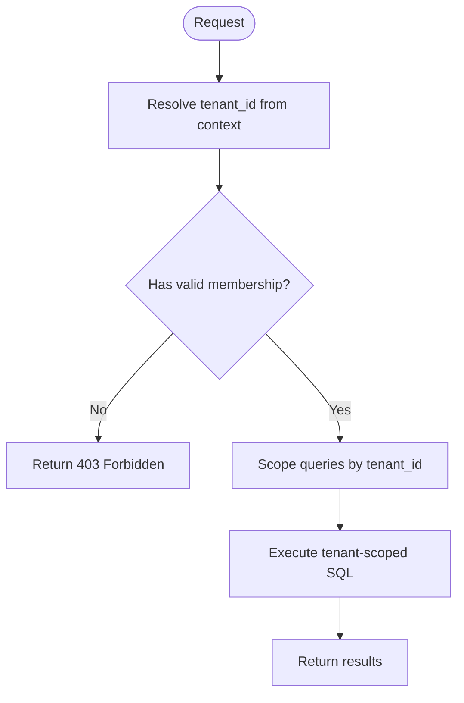
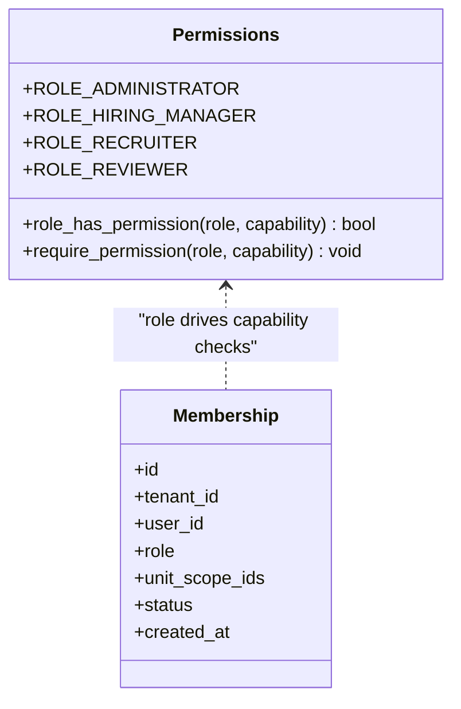
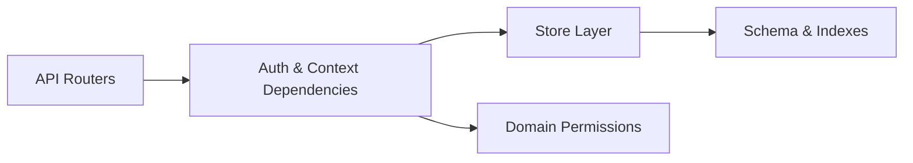

# Core Entities

<cite>
**Referenced Files in This Document**
- [database.py](file://Backend/app/db/database.py)
- [store.py](file://Backend/app/db/store.py)
- [organizations.py](file://Backend/app/api/v1/organizations.py)
- [auth.py](file://Backend/app/api/v1/auth.py)
- [permissions.py](file://Backend/app/domain/permissions.py)
- [dependencies.py](file://Backend/app/api/dependencies.py)
- [test_tenancy.py](file://Backend/tests/test_tenancy.py)
</cite>

## Table of Contents
1. Introduction
2. Project Structure
3. Core Components
4. Architecture Overview
5. Detailed Component Analysis
6. Dependency Analysis
7. Performance Considerations
8. Troubleshooting Guide
9. Conclusion

## Introduction
This document describes the core database entities that underpin multi-tenant isolation and role-based access control in the ATS system: users, organizations, memberships, and units. It explains field definitions, constraints, indexes, and how tenant_id is used to isolate data across tenants. It also outlines the role-based access model and provides example queries for user management, organization administration, and membership operations.

## Project Structure
The schema is defined in a single module and enforced at runtime via connection adapters. The store layer provides tenant-scoped helpers that all API endpoints use. Authorization and RBAC are enforced in API dependencies and domain permissions.

**Diagram sources**
- [database.py:19-120](file://Backend/app/db/database.py#L19-L120)
- [store.py:1-121](file://Backend/app/db/store.py#L1-L121)
- [organizations.py:1-60](file://Backend/app/api/v1/organizations.py#L1-L60)
- [permissions.py:1-63](file://Backend/app/domain/permissions.py#L1-L63)
- [dependencies.py:93-126](file://Backend/app/api/dependencies.py#L93-L126)

**Section sources**
- [database.py:19-120](file://Backend/app/db/database.py#L19-L120)
- [store.py:1-121](file://Backend/app/db/store.py#L1-L121)
- [organizations.py:1-60](file://Backend/app/api/v1/organizations.py#L1-L60)
- [permissions.py:1-63](file://Backend/app/domain/permissions.py#L1-L63)
- [dependencies.py:93-126](file://Backend/app/api/dependencies.py#L93-L126)

## Core Components
- Users: Global identity records with authentication and profile fields.
- Organizations: Tenant boundaries; each organization acts as a tenant.
- Memberships: Per-user roles within an organization (tenant).
- Units: Hierarchical subdivisions scoped to a tenant.

Key isolation pattern:
- All tenant-scoped tables include a tenant_id column.
- Organization.id serves as tenant_id for memberships, units, invitations, and other tenant-owned resources.
- API endpoints enforce tenant context via middleware/dependencies and require capabilities based on role.

Indexes and constraints:
- Primary keys on id columns.
- Unique constraints where needed (e.g., memberships per tenant+user).
- Indexes on tenant_id and frequently filtered columns for performance.

**Section sources**
- [database.py:20-96](file://Backend/app/db/database.py#L20-L96)
- [store.py:325-635](file://Backend/app/db/store.py#L325-L635)
- [organizations.py:323-383](file://Backend/app/api/v1/organizations.py#L323-L383)

## Architecture Overview
The system enforces multi-tenancy by scoping all tenant-owned reads/writes through tenant-aware store functions. Role-based access control maps database roles to capabilities checked in API dependencies.

**Diagram sources**
- [auth.py:104-127](file://Backend/app/api/v1/auth.py#L104-L127)
- [dependencies.py:93-126](file://Backend/app/api/dependencies.py#L93-L126)
- [store.py:325-635](file://Backend/app/db/store.py#L325-L635)
- [database.py:19-120](file://Backend/app/db/database.py#L19-L120)

## Detailed Component Analysis

### Users
- Purpose: Represents a person account across the platform.
- Key fields:
  - id: TEXT PRIMARY KEY
  - identity: TEXT NOT NULL UNIQUE
  - display_name: TEXT NOT NULL
  - email: TEXT NOT NULL UNIQUE
  - password_hash: TEXT (nullable)
  - status: TEXT NOT NULL DEFAULT 'active'
  - email_verified_at: TEXT (nullable)
  - is_superadmin: INTEGER NOT NULL DEFAULT 0
  - created_at: TEXT NOT NULL
- Constraints:
  - Unique identity and email.
  - Status defaults to active.
- Typical usage:
  - Authentication flows create or retrieve users.
  - Superadmin flag grants elevated privileges.

Example queries
- Create a user:
  - See path: [store.py:64-108](file://Backend/app/db/store.py#L64-L108)
- Get user by email:
  - See path: [store.py:121-125](file://Backend/app/db/store.py#L121-L125)
- Get user by id:
  - See path: [store.py:111-113](file://Backend/app/db/store.py#L111-L113)

**Section sources**
- [database.py:20-30](file://Backend/app/db/database.py#L20-L30)
- [store.py:23-125](file://Backend/app/db/store.py#L23-L125)
- [auth.py:74-127](file://Backend/app/api/v1/auth.py#L74-L127)

### Organizations
- Purpose: Defines a tenant boundary and contains org metadata.
- Key fields:
  - id: TEXT PRIMARY KEY (acts as tenant_id for related tables)
  - name: TEXT NOT NULL
  - org_type: TEXT NOT NULL
  - verification_status: TEXT NOT NULL DEFAULT 'pending'
  - legal_name: TEXT NOT NULL DEFAULT ''
  - trading_name: TEXT NOT NULL DEFAULT ''
  - domain: TEXT NOT NULL DEFAULT ''
  - contact_email: TEXT NOT NULL DEFAULT ''
  - contact_phone: TEXT NOT NULL DEFAULT ''
  - address: TEXT NOT NULL DEFAULT ''
  - registration_number: TEXT NOT NULL DEFAULT ''
  - pending_owner_user_id: TEXT (nullable)
  - verified_at: TEXT (nullable)
  - verified_by_user_id: TEXT (nullable)
  - rejection_reason: TEXT NOT NULL DEFAULT ''
  - created_at: TEXT NOT NULL
- Notes:
  - Domain uniqueness is enforced at application level before insert.
  - Verification workflow transitions statuses.

Example queries
- Create organization (verified):
  - See path: [store.py:328-366](file://Backend/app/db/store.py#L328-L366)
- Apply for organization (pending):
  - See path: [organizations.py:130-218](file://Backend/app/api/v1/organizations.py#L130-L218)
- Verify organization:
  - See path: [organizations.py:236-289](file://Backend/app/api/v1/organizations.py#L236-L289)
- Reject organization:
  - See path: [organizations.py:292-320](file://Backend/app/api/v1/organizations.py#L292-L320)

**Section sources**
- [database.py:43-60](file://Backend/app/db/database.py#L43-L60)
- [store.py:328-366](file://Backend/app/db/store.py#L328-L366)
- [organizations.py:77-218](file://Backend/app/api/v1/organizations.py#L77-L218)

### Memberships
- Purpose: Links a user to an organization with a role and scope.
- Key fields:
  - id: TEXT PRIMARY KEY
  - tenant_id: TEXT NOT NULL (references organizations.id)
  - user_id: TEXT NOT NULL (references users.id)
  - role: TEXT NOT NULL
  - unit_scope_ids: TEXT NOT NULL DEFAULT '[]'
  - status: TEXT NOT NULL DEFAULT 'active'
  - created_at: TEXT NOT NULL
  - UNIQUE(tenant_id, user_id)
- Indexes:
  - idx_memberships_user ON memberships(user_id)
- Notes:
  - One membership per user per organization.
  - Role determines capabilities via RBAC.

Example queries
- Add member:
  - See path: [store.py:509-527](file://Backend/app/db/store.py#L509-L527)
- Update member role:
  - See path: [store.py:530-541](file://Backend/app/db/store.py#L530-L541)
- List members in organization:
  - See path: [store.py:498-506](file://Backend/app/db/store.py#L498-L506)
- Get membership:
  - See path: [store.py:488-495](file://Backend/app/db/store.py#L488-L495)

**Section sources**
- [database.py:86-96](file://Backend/app/db/database.py#L86-L96)
- [store.py:488-541](file://Backend/app/db/store.py#L488-L541)
- [organizations.py:378-510](file://Backend/app/api/v1/organizations.py#L378-L510)

### Units
- Purpose: Organizational subdivisions scoped to a tenant.
- Key fields:
  - id: TEXT PRIMARY KEY
  - tenant_id: TEXT NOT NULL (references organizations.id)
  - parent_unit_id: TEXT (nullable, self-referencing hierarchy)
  - name: TEXT NOT NULL
  - created_at: TEXT NOT NULL
- Indexes:
  - idx_units_tenant ON units(tenant_id)

Example queries
- Create unit:
  - See path: [store.py:601-615](file://Backend/app/db/store.py#L601-L615)
- List units in organization:
  - See path: [store.py:618-622](file://Backend/app/db/store.py#L618-L622)
- Get unit:
  - See path: [store.py:625-629](file://Backend/app/db/store.py#L625-L629)

**Section sources**
- [database.py:77-84](file://Backend/app/db/database.py#L77-L84)
- [store.py:601-629](file://Backend/app/db/store.py#L601-L629)
- [organizations.py:337-375](file://Backend/app/api/v1/organizations.py#L337-L375)

### Multi-Tenant Isolation Pattern
- Every tenant-owned table includes tenant_id.
- Organization.id is used as tenant_id for memberships, units, invitations, and other tenant-scoped resources.
- API endpoints derive tenant_id from authenticated context and enforce it in every query.
- Cross-tenant access is denied unless explicitly authorized.

**Diagram sources**
- [dependencies.py:117-126](file://Backend/app/api/dependencies.py#L117-L126)
- [store.py:325-635](file://Backend/app/db/store.py#L325-L635)
- [test_tenancy.py:19-39](file://Backend/tests/test_tenancy.py#L19-L39)

**Section sources**
- [test_tenancy.py:19-39](file://Backend/tests/test_tenancy.py#L19-L39)
- [store.py:325-635](file://Backend/app/db/store.py#L325-L635)

### Role-Based Access Control Model
- Roles: administrator, hiring_manager, recruiter, reviewer.
- Capabilities: manage_org, manage_packs, manage_jobs, pipeline, invite_interview, scorecard, view_audit.
- Mapping: Each role has a set of permitted capabilities.
- Enforcement: API dependencies check capabilities against the current user’s role in the current tenant context.

**Diagram sources**
- [permissions.py:1-63](file://Backend/app/domain/permissions.py#L1-L63)
- [database.py:86-96](file://Backend/app/db/database.py#L86-L96)

**Section sources**
- [permissions.py:1-63](file://Backend/app/domain/permissions.py#L1-L63)
- [organizations.py:342-375](file://Backend/app/api/v1/organizations.py#L342-L375)

## Dependency Analysis
- API routers depend on store functions for all tenant-scoped operations.
- Store functions depend on schema definitions and indexes for correctness and performance.
- Auth dependencies resolve current user and tenant context; RBAC depends on stored roles.

**Diagram sources**
- [organizations.py:1-60](file://Backend/app/api/v1/organizations.py#L1-L60)
- [dependencies.py:93-126](file://Backend/app/api/dependencies.py#L93-L126)
- [store.py:1-121](file://Backend/app/db/store.py#L1-L121)
- [database.py:19-120](file://Backend/app/db/database.py#L19-L120)
- [permissions.py:1-63](file://Backend/app/domain/permissions.py#L1-L63)

**Section sources**
- [organizations.py:1-60](file://Backend/app/api/v1/organizations.py#L1-L60)
- [dependencies.py:93-126](file://Backend/app/api/dependencies.py#L93-L126)
- [store.py:1-121](file://Backend/app/db/store.py#L1-L121)
- [database.py:19-120](file://Backend/app/db/database.py#L19-L120)
- [permissions.py:1-63](file://Backend/app/domain/permissions.py#L1-L63)

## Performance Considerations
- Use tenant_id filters on all queries to leverage indexes.
- Leverage existing indexes:
  - idx_memberships_user ON memberships(user_id)
  - idx_units_tenant ON units(tenant_id)
  - idx_invitations_tenant ON organization_invitations(tenant_id)
  - idx_refresh_user ON refresh_tokens(user_id)
- Prefer lookups by unique keys (email, identity) and tenant-prefixed joins.
- Keep JSON fields (unit_scope_ids, profiles) small; avoid heavy scans.
- Batch writes where possible and commit once per transaction.

[No sources needed since this section provides general guidance]

## Troubleshooting Guide
Common issues and resolutions:
- Cross-tenant access denied:
  - Ensure the request includes a valid X-Organization-Id header and the user has an active membership in that organization.
  - See paths: [test_tenancy.py:19-39](file://Backend/tests/test_tenancy.py#L19-L39), [dependencies.py:117-126](file://Backend/app/api/dependencies.py#L117-L126)
- Email domain mismatch when adding staff:
  - Staff emails must match the organization’s domain.
  - See path: [organizations.py:396-403](file://Backend/app/api/v1/organizations.py#L396-L403)
- Duplicate membership:
  - Enforced by UNIQUE(tenant_id, user_id); handle 409 responses.
  - See path: [database.py:86-96](file://Backend/app/db/database.py#L86-L96)
- Invalid role or missing capability:
  - Capability checks raise 403 if not granted.
  - See path: [permissions.py:53-63](file://Backend/app/domain/permissions.py#L53-L63)

**Section sources**
- [test_tenancy.py:19-39](file://Backend/tests/test_tenancy.py#L19-L39)
- [dependencies.py:117-126](file://Backend/app/api/dependencies.py#L117-L126)
- [organizations.py:396-403](file://Backend/app/api/v1/organizations.py#L396-L403)
- [database.py:86-96](file://Backend/app/db/database.py#L86-L96)
- [permissions.py:53-63](file://Backend/app/domain/permissions.py#L53-L63)

## Conclusion
The ATS core entities—users, organizations, memberships, and units—form a robust multi-tenant foundation. tenant_id isolates data per organization, while roles and capabilities enforce fine-grained access. Proper indexing and tenant-scoped queries ensure performance and security. Use the provided query paths and patterns to implement user management, organization administration, and membership operations safely and efficiently.

[No sources needed since this section summarizes without analyzing specific files]