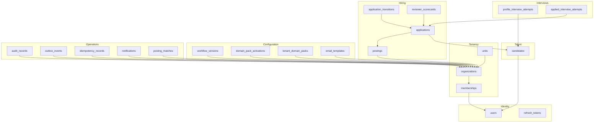
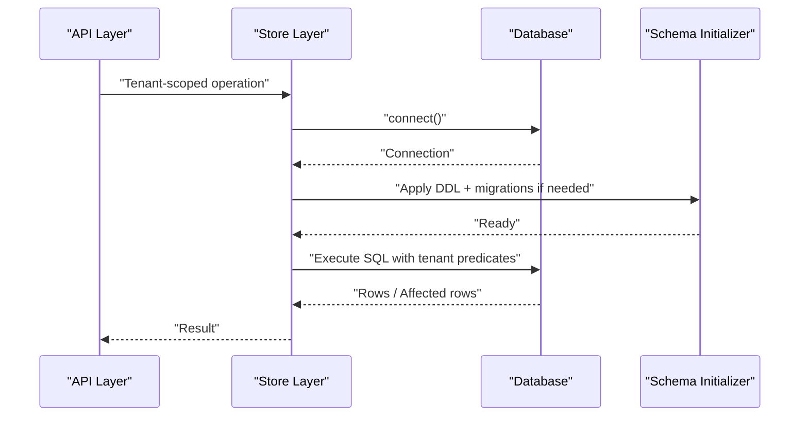
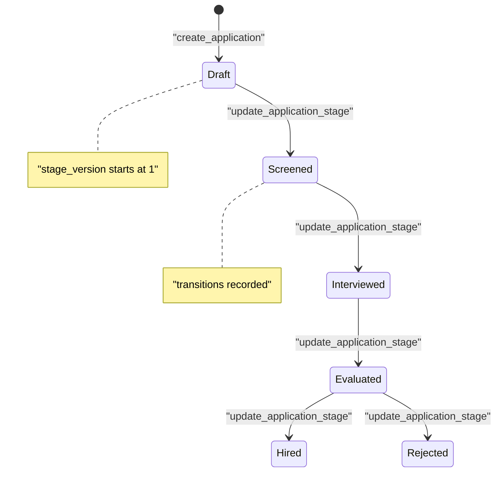
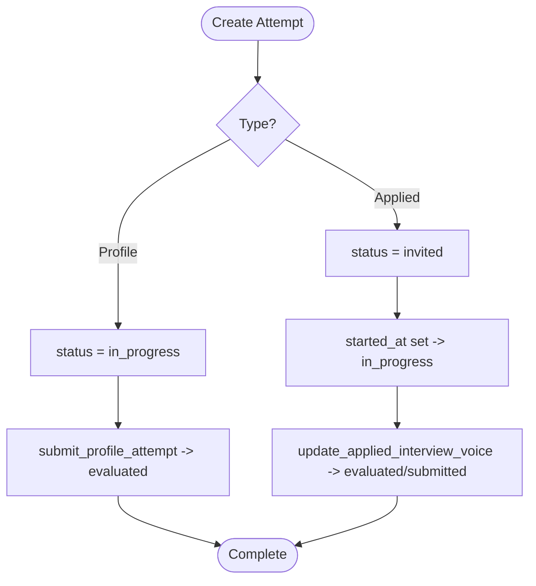
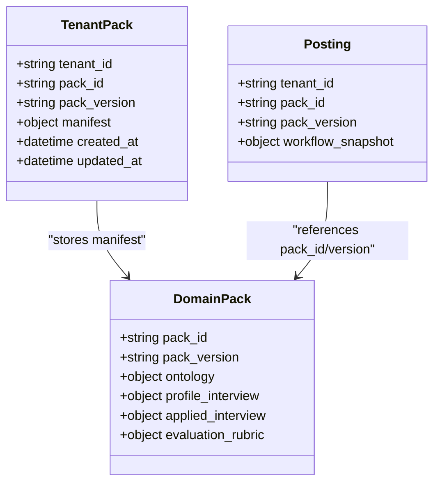
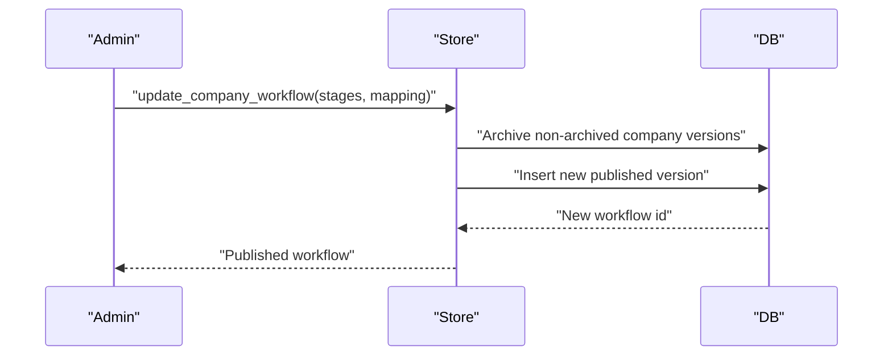
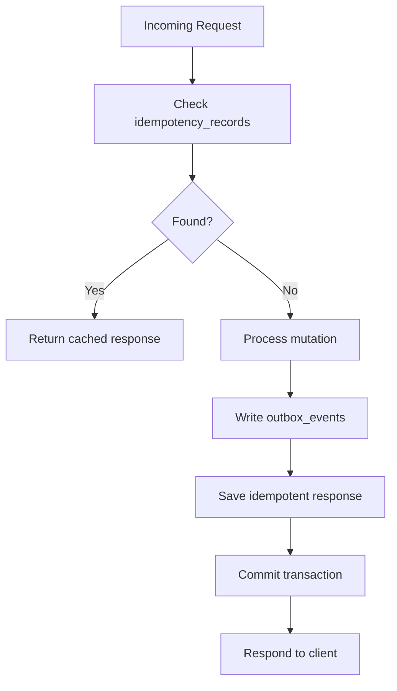
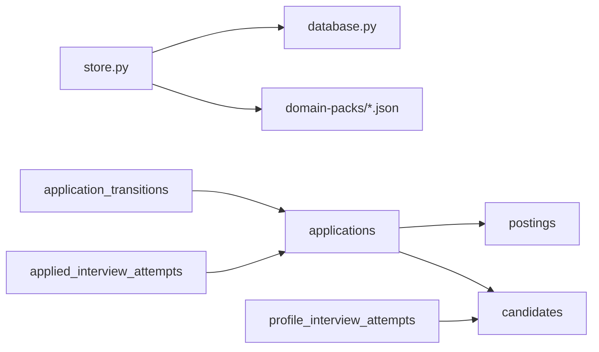

# Database Schema Design

<cite>
**Referenced Files in This Document**
- [database.py](file://Backend/app/db/database.py)
- [store.py](file://Backend/app/db/store.py)
- [manifest.json (Education)](file://domain-packs/education/manifest.json)
- [manifest.json (Software Engineering)](file://domain-packs/software-engineering/manifest.json)
</cite>

## Table of Contents
1. Introduction
2. Project Structure
3. Core Components
4. Architecture Overview
5. Detailed Component Analysis
6. Dependency Analysis
7. Performance Considerations
8. Troubleshooting Guide
9. Conclusion
10. Appendices

## Introduction
This document describes the ATS database schema, data relationships, and operational patterns. It focuses on multi-tenant isolation, state machines for applications and interviews, domain packs, and the migration strategy embedded in the persistence layer. It also provides guidance for reporting queries, caching strategies, and backup/recovery considerations based on the implemented storage layer.

## Project Structure
The database is defined as DDL within the persistence module and accessed through a tenant-scoped store layer. The schema supports:
- Users and authentication tokens
- Organizations and memberships (tenants)
- Units (organizational hierarchy)
- Candidates and their profiles
- Postings (jobs) with workflow snapshots
- Applications with stage transitions
- Interview attempts (profile and applied)
- Reviewer scorecards
- Audit records, outbox events, idempotency records, notifications
- Domain pack activations and tenant-specific packs
- Workflow versions and templates
- Email templates per tenant

**Diagram sources**
- [database.py:19-331](file://Backend/app/db/database.py#L19-L331)

**Section sources**
- [database.py:19-331](file://Backend/app/db/database.py#L19-L331)

## Core Components
- Tenancy model: organizations are tenants; memberships bind users to tenants; units provide hierarchical scoping.
- Identity: users and refresh tokens support authentication flows.
- Talent: candidates represent applicants with profile JSON and consent flags.
- Hiring: postings define jobs; applications capture candidate submissions and current stage; transitions record lifecycle changes.
- Interviews: two attempt types—profile screening and job interview—store questions, responses, transcripts, evaluations, and metadata.
- Configuration: workflow versions define hiring stages and mappings; domain packs define evaluation rubrics and question sets; email templates are tenant-scoped.
- Operations: audit logs, outbox events for async processing, idempotency keys, notifications, and posting matches for talent discovery.

Key constraints and indexes:
- Unique constraints enforce business rules such as one application per candidate per posting, unique tenant-pack activation, and unique template key per tenant.
- Indexes optimize common queries by tenant_id, user_id, candidate_id, posting_id, and notification recipient.

**Section sources**
- [database.py:19-331](file://Backend/app/db/database.py#L19-L331)
- [store.py:16-113](file://Backend/app/db/store.py#L16-L113)
- [store.py:328-404](file://Backend/app/db/store.py#L328-L404)
- [store.py:649-783](file://Backend/app/db/store.py#L649-L783)
- [store.py:796-986](file://Backend/app/db/store.py#L796-L986)
- [store.py:1648-1771](file://Backend/app/db/store.py#L1648-L1771)
- [store.py:1787-1893](file://Backend/app/db/store.py#L1787-L1893)

## Architecture Overview
The persistence layer abstracts PostgreSQL and SQLite behind a unified connection/cursor protocol. DDL is applied at first connection via an in-process schema initializer that runs statements one by one and applies column migrations. Tenant isolation is enforced by requiring tenant_id on all employer-side operations and by candidate ownership checks for self-service endpoints.

**Diagram sources**
- [database.py:462-516](file://Backend/app/db/database.py#L462-L516)
- [store.py:1-7](file://Backend/app/db/store.py#L1-L7)

**Section sources**
- [database.py:462-516](file://Backend/app/db/database.py#L462-L516)

## Detailed Component Analysis

### Multi-Tenant Data Isolation Pattern
- All employer-facing tables include tenant_id and are queried with tenant_id predicates.
- Candidate-owned resources (e.g., candidates, profile attempts) are scoped by candidate_id or user_id.
- Membership and organization verification gates access to tenant-scoped features.

Examples of enforcement:
- Organization membership lookup filters by active status and verified organization.
- Application and transition writes require tenant_id.
- Notifications and audit records are tenant-scoped.

**Section sources**
- [store.py:135-143](file://Backend/app/db/store.py#L135-L143)
- [store.py:1689-1701](file://Backend/app/db/store.py#L1689-L1701)
- [store.py:216-245](file://Backend/app/db/store.py#L216-L245)
- [store.py:248-276](file://Backend/app/db/store.py#L248-L276)
- [store.py:300-322](file://Backend/app/db/store.py#L300-L322)

### Application Lifecycle State Machine
Applications move through stages defined by workflow versions. Each update increments stage_version and records a transition.

Constraints and auditing:
- Stage updates use optimistic concurrency via expected_version.
- Transitions are persisted with actor_user_id and timestamps.

**Diagram sources**
- [store.py:1714-1771](file://Backend/app/db/store.py#L1714-L1771)

**Section sources**
- [store.py:1648-1771](file://Backend/app/db/store.py#L1648-L1771)

### Interview Progression State Machines
Two interview types exist:
- Profile interview attempts: start in_progress, can be evaluated/submitted.
- Applied interview attempts: start invited, progress to in_progress, then submitted/evaluated.

**Diagram sources**
- [store.py:1273-1402](file://Backend/app/db/store.py#L1273-L1402)
- [store.py:1787-1893](file://Backend/app/db/store.py#L1787-L1893)

**Section sources**
- [store.py:1273-1402](file://Backend/app/db/store.py#L1273-L1402)
- [store.py:1787-1893](file://Backend/app/db/store.py#L1787-L1893)

### Domain Packs and Evaluation Rubrics
Domain packs define skills, concepts, interview questions, and evaluation rubrics. They are activated per tenant and stored as manifests. Postings may reference a pack and version to align interview content and scoring.

**Diagram sources**
- [database.py:98-119](file://Backend/app/db/database.py#L98-L119)
- [database.py:165-185](file://Backend/app/db/database.py#L165-L185)
- [manifest.json (Education):1-143](file://domain-packs/education/manifest.json#L1-L143)
- [manifest.json (Software Engineering):1-140](file://domain-packs/software-engineering/manifest.json#L1-L140)

**Section sources**
- [database.py:98-119](file://Backend/app/db/database.py#L98-L119)
- [database.py:165-185](file://Backend/app/db/database.py#L165-L185)
- [store.py:649-783](file://Backend/app/db/store.py#L649-L783)
- [manifest.json (Education):1-143](file://domain-packs/education/manifest.json#L1-L143)
- [manifest.json (Software Engineering):1-140](file://domain-packs/software-engineering/manifest.json#L1-L140)

### Workflow Versions and Company Templates
Workflow versions store stages and candidate status mappings. The system maintains a “company” template per tenant with versioning and archiving semantics.

**Diagram sources**
- [store.py:917-950](file://Backend/app/db/store.py#L917-L950)
- [store.py:796-831](file://Backend/app/db/store.py#L796-L831)

**Section sources**
- [store.py:796-986](file://Backend/app/db/store.py#L796-L986)

### Idempotency and Outbox
Idempotency records prevent duplicate side effects using composite keys. Outbox events enable reliable asynchronous processing while keeping event creation atomic with business transactions.

**Diagram sources**
- [store.py:279-297](file://Backend/app/db/store.py#L279-L297)
- [store.py:248-276](file://Backend/app/db/store.py#L248-L276)

**Section sources**
- [store.py:248-297](file://Backend/app/db/store.py#L248-L297)

## Dependency Analysis
- The store layer depends on the database module for connection management and schema initialization.
- Domain packs are external JSON manifests referenced by tenant packs and postings.
- Applications depend on postings and candidates; transitions depend on applications.
- Interviews depend on candidates (profile) or applications (applied).

**Diagram sources**
- [store.py:1-13](file://Backend/app/db/store.py#L1-L13)
- [database.py:462-516](file://Backend/app/db/database.py#L462-L516)
- [database.py:136-240](file://Backend/app/db/database.py#L136-L240)

**Section sources**
- [store.py:1-13](file://Backend/app/db/store.py#L1-L13)
- [database.py:136-240](file://Backend/app/db/database.py#L136-L240)

## Performance Considerations
- Use tenant_id indexes heavily present across tables to ensure efficient scoping.
- Prefer JSON fields for flexible payloads (profiles, answers, evaluations) to avoid schema churn.
- Leverage unique constraints to prevent duplicates (e.g., one application per posting per candidate).
- For search-heavy workloads, consider adding functional or full-text indexes where supported by the chosen engine.
- Keep large JSON blobs (transcripts, evaluations) separate if they grow excessively; currently stored inline for simplicity.

[No sources needed since this section provides general guidance]

## Troubleshooting Guide
Common issues and diagnostics:
- Duplicate application errors: check unique constraint on (posting_id, candidate_id).
- Stale stage updates: ensure expected_version matches current stage_version when updating.
- Missing tenant context: verify tenant_id is passed to all store calls.
- Migration failures: confirm schema initializer ran and columns were added via migrations.
- Idempotency conflicts: inspect idempotency_records for overlapping keys.

Operational helpers:
- Audit records and transitions provide an immutable trail for state changes.
- Outbox events help diagnose failed async processing.

**Section sources**
- [database.py:188-206](file://Backend/app/db/database.py#L188-L206)
- [store.py:1714-1771](file://Backend/app/db/store.py#L1714-L1771)
- [store.py:216-245](file://Backend/app/db/store.py#L216-L245)
- [store.py:279-297](file://Backend/app/db/store.py#L279-L297)

## Conclusion
The ATS schema enforces strong multi-tenant isolation, models hiring workflows with versioned templates, and captures rich interview and evaluation data. The embedded migration strategy and tenant-scoped store layer simplify deployment and reduce coupling. With careful indexing and JSON usage, the system balances flexibility and performance.

[No sources needed since this section summarizes without analyzing specific files]

## Appendices

### Entity Relationship Summary
- users: identity, email, status, timestamps
- refresh_tokens: token hashes, expiration, revocation
- organizations: verification lifecycle, legal/trading names, contact info
- memberships: role, scope, status per tenant
- units: hierarchical org structure per tenant
- candidates: profile JSON, consents, target domains
- postings: tenant-scoped job details, workflow snapshot, pack references
- applications: stage tracking, scores, profile snapshot, answers
- application_transitions: from/to stages, reason, actor, timestamp
- profile_interview_attempts: pack context, questions, responses, transcripts, evaluation
- applied_interview_attempts: linked to application, similar fields
- reviewer_scorecards: per-reviewer scores and recommendations
- workflow_versions: stages and candidate status mapping per tenant
- domain_pack_activations: active pack per tenant
- tenant_domain_packs: custom pack definitions per tenant
- email_templates: tenant-scoped templates
- audit_records, outbox_events, idempotency_records, notifications, posting_matches: operational concerns

**Section sources**
- [database.py:19-331](file://Backend/app/db/database.py#L19-L331)

### Field Definitions, Types, Constraints, and Indexes
- IDs: TEXT primary keys throughout
- Timestamps: TEXT ISO strings
- JSON fields: TEXT storing serialized JSON (profiles, answers, evaluations, transcripts)
- Boolean-like: INTEGER 0/1 (e.g., notified, read)
- Enums: TEXT with constrained values (statuses like draft/published, in_progress, evaluated, etc.)
- Key indexes: tenant_id, user_id, candidate_id, posting_id, recipient_user_id, application_id

**Section sources**
- [database.py:19-331](file://Backend/app/db/database.py#L19-L331)

### Sample Reporting Queries
- Applications by tenant and posting:
  - Select applications filtered by tenant_id and posting_id, ordered by created_at.
- Best profile interview score per candidate:
  - Aggregate evaluated attempts and compute max overall_score.
- Posting matches ranked:
  - Join posting_matches with candidates and users, filter by tenant_id and posting_id, order by score.
- Search workspace:
  - Full-text style LIKE queries across postings and applications joined with users.

Note: These queries mirror patterns used in the store layer functions.

**Section sources**
- [store.py:1030-1135](file://Backend/app/db/store.py#L1030-L1135)
- [store.py:1492-1554](file://Backend/app/db/store.py#L1492-L1554)
- [store.py:1689-1701](file://Backend/app/db/store.py#L1689-L1701)

### Caching Strategies
- Cache domain pack manifests per tenant to reduce repeated reads.
- Cache published workflows per tenant for fast pipeline rendering.
- Cache posting matches and top candidates for dashboards.
- Cache email templates per tenant for frequent rendering.

[No sources needed since this section provides general guidance]

### Backup and Recovery Procedures
- PostgreSQL:
  - Use pg_dump/pg_restore for logical backups; schedule regular dumps.
  - Enable WAL archiving for point-in-time recovery.
  - Back up extensions (e.g., vector) and configuration.
- SQLite:
  - Use WAL mode (already enabled) and copy the database file safely.
  - Ensure consistent snapshots during low traffic or after checkpoints.
- Validate backups with restore drills and checksums.

[No sources needed since this section provides general guidance]