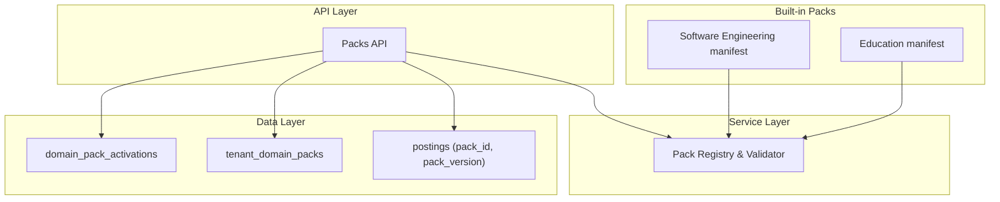
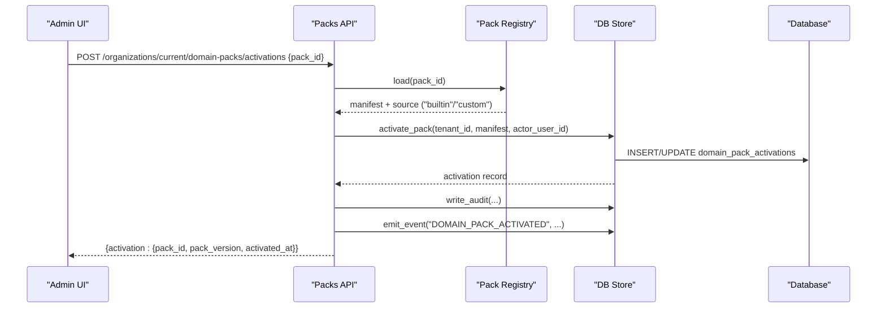
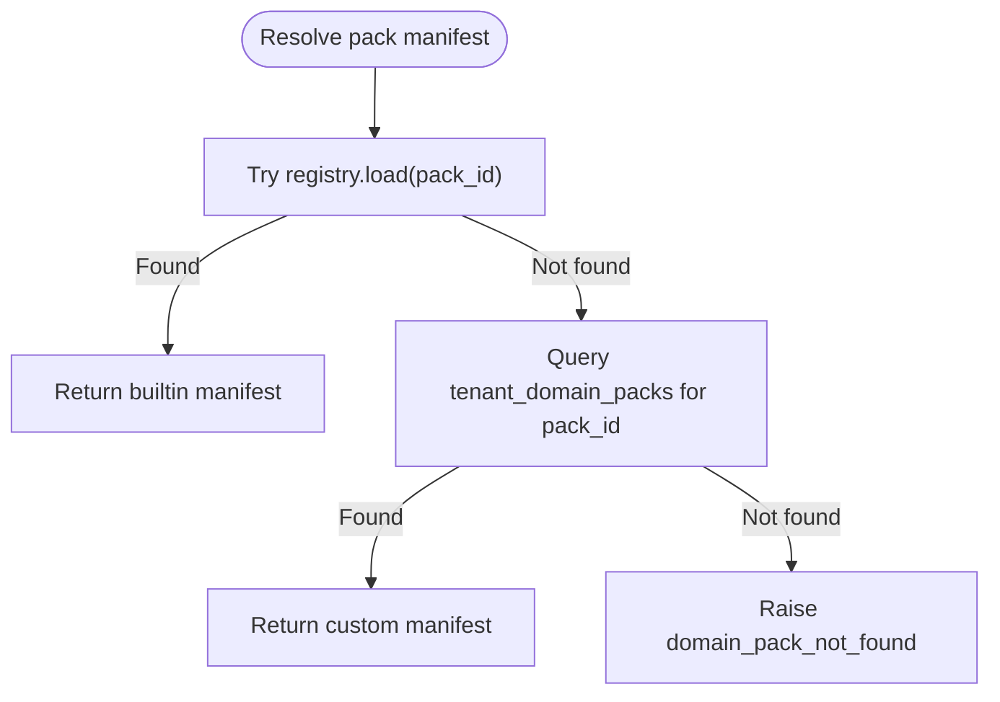
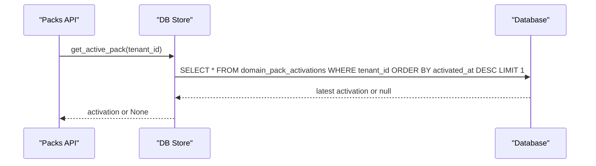
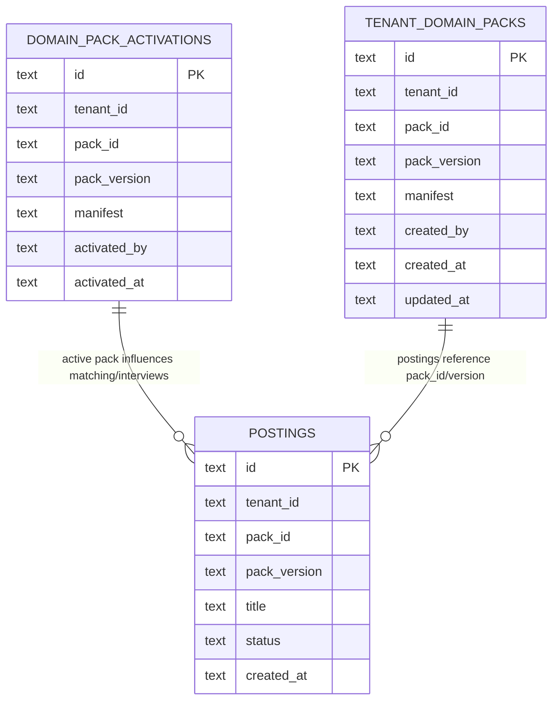
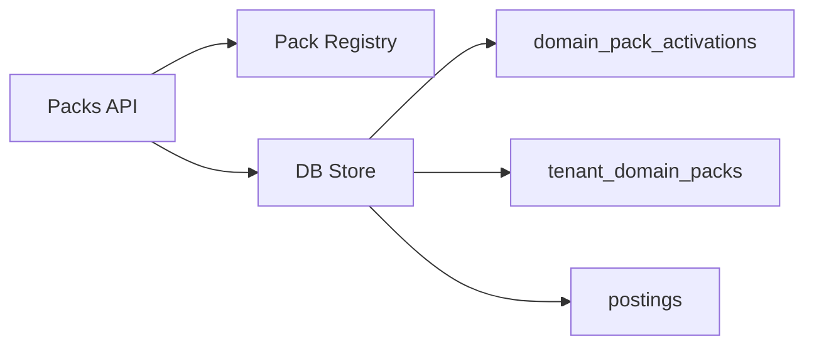

# Domain Pack Entities

<cite>
**Referenced Files in This Document**
- [manifest.json (Education)](file://domain-packs/education/manifest.json)
- [manifest.json (Software Engineering)](file://domain-packs/software-engineering/manifest.json)
- [packs.py (API endpoints)](file://Backend/app/api/v1/packs.py)
- [packs.py (Pack registry and validation)](file://Backend/app/services/packs.py)
- [store.py (Domain pack operations)](file://Backend/app/db/store.py)
- [database.py (Schema definitions)](file://Backend/app/db/database.py)
</cite>

## Table of Contents
1. [Introduction](#introduction)
2. [Project Structure](#project-structure)
3. [Core Components](#core-components)
4. [Architecture Overview](#architecture-overview)
5. [Detailed Component Analysis](#detailed-component-analysis)
6. [Dependency Analysis](#dependency-analysis)
7. [Performance Considerations](#performance-considerations)
8. [Troubleshooting Guide](#troubleshooting-guide)
9. [Conclusion](#conclusion)
10. [Appendices](#appendices)

## Introduction
This document explains the domain pack system that enables pluggable, industry-specific configurations without modifying core application code. It focuses on the domain_pack_activations and tenant_domain_packs tables, the manifest structure and versioning strategy, the activation process scoped to tenants, and how job postings are linked via pack_id and pack_version. It also provides practical examples for installing packs, querying configuration, and managing versions.

## Project Structure
The domain pack system is implemented across:
- Manifest files under domain-packs/<domain>/manifest.json define built-in packs.
- API endpoints under Backend/app/api/v1/packs.py expose CRUD and activation operations.
- A registry and validator under Backend/app/services/packs.py load and validate manifests.
- Database schema under Backend/app/db/database.py defines tables including domain_pack_activations, tenant_domain_packs, and postings with pack_id and pack_version fields.
- Data access helpers under Backend/app/db/store.py implement activation, listing, updates, and relationships.

**Diagram sources**
- [packs.py (API endpoints):1-490](file://Backend/app/api/v1/packs.py#L1-L490)
- [packs.py (registry):1-97](file://Backend/app/services/packs.py#L1-L97)
- [store.py (operations):649-790](file://Backend/app/db/store.py#L649-L790)
- [database.py (schema):98-185](file://Backend/app/db/database.py#L98-L185)

**Section sources**
- [database.py:98-185](file://Backend/app/db/database.py#L98-L185)
- [store.py:649-790](file://Backend/app/db/store.py#L649-L790)
- [packs.py (API):1-490](file://Backend/app/api/v1/packs.py#L1-L490)
- [packs.py (registry):1-97](file://Backend/app/services/packs.py#L1-L97)

## Core Components
- Built-in pack manifests: JSON files describing ontology, interview questions, evaluation rubrics, matching weights, and compliance rules per domain.
- Pack registry: Loads available built-in packs from the domain-packs directory and validates them against a strict contract.
- Tenant packs: Custom packs created per tenant, stored in tenant_domain_packs with full manifest snapshots.
- Active pack: The currently activated pack per tenant stored in domain_pack_activations; used by downstream processes to apply domain-specific logic.
- Postings linkage: Job postings store pack_id and pack_version to bind each posting to a specific pack version at creation time.

Key responsibilities:
- Validation ensures required keys, semantic versioning, question structures, and rubric dimensions.
- Activation records the latest active pack per tenant and emits events for downstream consumers.
- Listing merges built-in and custom packs while avoiding duplicates by pack_id.

**Section sources**
- [packs.py (registry):14-97](file://Backend/app/services/packs.py#L14-L97)
- [store.py:649-790](file://Backend/app/db/store.py#L649-L790)
- [database.py:98-185](file://Backend/app/db/database.py#L98-L185)

## Architecture Overview
The system separates concerns between configuration (manifests), runtime selection (activation), and persistence (activations and tenant packs). APIs orchestrate resolution of manifests from either built-in or custom sources, enforce validation, persist changes, and emit events.

**Diagram sources**
- [packs.py (API):421-472](file://Backend/app/api/v1/packs.py#L421-L472)
- [store.py:649-687](file://Backend/app/db/store.py#L649-L687)
- [database.py:98-107](file://Backend/app/db/database.py#L98-L107)

## Detailed Component Analysis

### Manifest Structure and Versioning Strategy
- Required top-level keys include identifiers, display metadata, ontology, matching weights, interview sections, and evaluation rubric.
- Each manifest includes pack_id and pack_version using semantic versioning (major.minor.patch).
- Interview sections define task_style, question_count, and questions with id, prompt, competency, and expected_concepts.
- Evaluation rubric defines dimensions with id, label, description.
- Optional fields include resume_extraction_rules, compliance_rules, and domain descriptions.

Versioning behavior:
- Creation accepts an explicit pack_version; updates auto-bump patch version if not provided.
- Validation enforces semver format and presence of required fields.

Examples of installed built-in packs:
- Education pack manifest contains academic skills, certifications, concepts, interview questions, and rubric dimensions.
- Software engineering pack manifest contains engineering skills, certifications, concepts, interview questions, and rubric dimensions.

**Section sources**
- [packs.py (registry):14-62](file://Backend/app/services/packs.py#L14-L62)
- [packs.py (API):120-219](file://Backend/app/api/v1/packs.py#L120-L219)
- [manifest.json (Education):1-143](file://domain-packs/education/manifest.json#L1-L143)
- [manifest.json (Software Engineering):1-140](file://domain-packs/software-engineering/manifest.json#L1-L140)

### Pluggable Architecture
- Built-in packs are discovered and validated from the domain-packs directory.
- Custom packs can be created per tenant and override or extend capabilities without changing core code.
- Resolution order prefers built-in packs first; falls back to tenant-specific custom packs when not found.
- This design allows industry-specific configurations to be added by shipping new manifests or creating tenant packs.

**Diagram sources**
- [packs.py (API):41-60](file://Backend/app/api/v1/packs.py#L41-L60)
- [store.py:742-754](file://Backend/app/db/store.py#L742-L754)

**Section sources**
- [packs.py (API):41-83](file://Backend/app/api/v1/packs.py#L41-L83)
- [packs.py (registry):64-97](file://Backend/app/services/packs.py#L64-L97)

### Activation Process and Tenant Scoping
- Activation is tenant-scoped: domain_pack_activations stores one active pack per tenant identified by tenant_id and pack_id.
- Activating a pack persists the manifest snapshot and timestamps, enabling auditability and reproducibility.
- The active pack is retrieved per tenant for use by downstream services (e.g., interviews, matching).

**Diagram sources**
- [store.py:677-687](file://Backend/app/db/store.py#L677-L687)
- [database.py:98-107](file://Backend/app/db/database.py#L98-L107)

**Section sources**
- [store.py:649-687](file://Backend/app/db/store.py#L649-L687)
- [packs.py (API):475-489](file://Backend/app/api/v1/packs.py#L475-L489)

### Relationship Between Domain Packs and Job Postings
- Postings store pack_id and pack_version to bind each posting to a specific pack version at creation time.
- Matching and interview generation resolve the manifest for the posting’s pack_id and apply domain-specific logic.
- Counting postings per pack helps prevent deletion of packs still in use.

**Diagram sources**
- [database.py:98-185](file://Backend/app/db/database.py#L98-L185)
- [store.py:785-790](file://Backend/app/db/store.py#L785-L790)

**Section sources**
- [database.py:165-185](file://Backend/app/db/database.py#L165-L185)
- [store.py:785-790](file://Backend/app/db/store.py#L785-L790)

### Pack Installation, Configuration Queries, and Version Management Operations
- List available packs (built-in and custom) with linked job counts per tenant.
- Get detailed manifest for a specific pack (resolved from built-in or custom).
- Create a custom pack for a tenant with validation and audit logging.
- Update a custom pack with optional field patches; patch version auto-incremented if not specified.
- Delete a custom pack only if no jobs are linked to it.
- Activate a pack for a tenant; returns activation details and emits events.
- Retrieve the current active pack for a tenant.

Example operations (described conceptually):
- Install a custom pack: POST /api/v1/domain-packs with pack_id, display_name, skills, profile/applied questions, rubric dimensions, and optional matching_weights.
- Query available packs: GET /api/v1/domain-packs to list all packs with linked_jobs counts.
- View a pack manifest: GET /api/v1/domain-packs/{pack_id}.
- Update a pack: PATCH /api/v1/domain-packs/{pack_id} with partial fields; pack_version auto-bumped if omitted.
- Delete a pack: DELETE /api/v1/domain-packs/{pack_id} (only if linked_jobs == 0).
- Activate a pack: POST /api/v1/organizations/current/domain-packs/activations with pack_id.
- Check active pack: GET /api/v1/organizations/current/domain-packs/active.

**Section sources**
- [packs.py (API):63-104](file://Backend/app/api/v1/packs.py#L63-L104)
- [packs.py (API):222-283](file://Backend/app/api/v1/packs.py#L222-L283)
- [packs.py (API):286-367](file://Backend/app/api/v1/packs.py#L286-L367)
- [packs.py (API):370-414](file://Backend/app/api/v1/packs.py#L370-L414)
- [packs.py (API):421-489](file://Backend/app/api/v1/packs.py#L421-L489)

## Dependency Analysis
- API depends on the registry to load built-in manifests and on store to manage tenant packs and activations.
- Store encapsulates database interactions for both activation and custom pack management, plus counting postings per pack.
- Schema enforces uniqueness constraints to ensure one active pack per tenant and one custom pack per tenant per pack_id.

**Diagram sources**
- [packs.py (API):1-490](file://Backend/app/api/v1/packs.py#L1-L490)
- [store.py:649-790](file://Backend/app/db/store.py#L649-L790)
- [database.py:98-185](file://Backend/app/db/database.py#L98-L185)

**Section sources**
- [packs.py (API):1-490](file://Backend/app/api/v1/packs.py#L1-L490)
- [store.py:649-790](file://Backend/app/db/store.py#L649-L790)
- [database.py:98-185](file://Backend/app/db/database.py#L98-L185)

## Performance Considerations
- Listing packs queries both registry and tenant packs; consider caching available packs where appropriate.
- Activation uses upsert semantics to avoid duplicate rows per tenant and pack_id, minimizing contention.
- Counting postings per pack uses indexed tenant_id and pack_id lookups; ensure indexes exist for high-volume environments.
- Manifest validation occurs on load/update; keep manifests concise to reduce parsing overhead.

[No sources needed since this section provides general guidance]

## Troubleshooting Guide
Common issues and resolutions:
- Pack not found: Ensure pack_id exists in built-in manifests or has been created as a custom pack for the tenant.
- Invalid manifest: Validate required keys, semver format, non-empty questions, and allowed task_style values.
- Cannot delete pack: Check linked_jobs count; remove or reassign postings before deletion.
- Duplicate activation: Activations are upserted per tenant and pack_id; subsequent activations update the latest record.

Operational checks:
- Verify active pack per tenant: GET /api/v1/organizations/current/domain-packs/active.
- Inspect available packs and linked jobs: GET /api/v1/domain-packs.
- Review audit logs for pack lifecycle events through the audit subsystem.

**Section sources**
- [packs.py (API):41-60](file://Backend/app/api/v1/packs.py#L41-L60)
- [packs.py (API):370-414](file://Backend/app/api/v1/packs.py#L370-L414)
- [store.py:677-687](file://Backend/app/db/store.py#L677-L687)

## Conclusion
The domain pack system provides a robust, pluggable architecture for industry-specific configurations. Through manifest-driven definitions, strict validation, and tenant-scoped activation, organizations can tailor hiring workflows without altering core code. The relationship between packs and job postings via pack_id and pack_version ensures traceability and reproducibility across the candidate lifecycle.

[No sources needed since this section summarizes without analyzing specific files]

## Appendices

### Example Queries and Operations (Conceptual)
- Install a custom pack:
  - POST /api/v1/domain-packs with fields: pack_id, display_name, skills, profile_questions, applied_questions, rubric_dimensions, optional matching_weights.
- List available packs:
  - GET /api/v1/domain-packs to see built-in and custom packs with linked_jobs counts.
- Activate a pack for a tenant:
  - POST /api/v1/organizations/current/domain-packs/activations with pack_id.
- Retrieve active pack:
  - GET /api/v1/organizations/current/domain-packs/active.
- Update a custom pack:
  - PATCH /api/v1/domain-packs/{pack_id} with partial fields; pack_version auto-incremented if omitted.
- Delete a custom pack:
  - DELETE /api/v1/domain-packs/{pack_id} (only if linked_jobs == 0).

**Section sources**
- [packs.py (API):222-283](file://Backend/app/api/v1/packs.py#L222-L283)
- [packs.py (API):286-367](file://Backend/app/api/v1/packs.py#L286-L367)
- [packs.py (API):370-414](file://Backend/app/api/v1/packs.py#L370-L414)
- [packs.py (API):421-489](file://Backend/app/api/v1/packs.py#L421-L489)