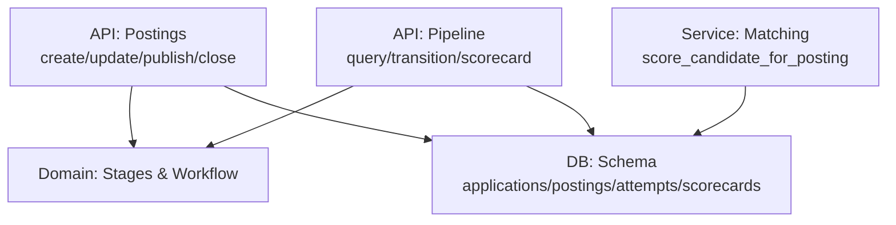
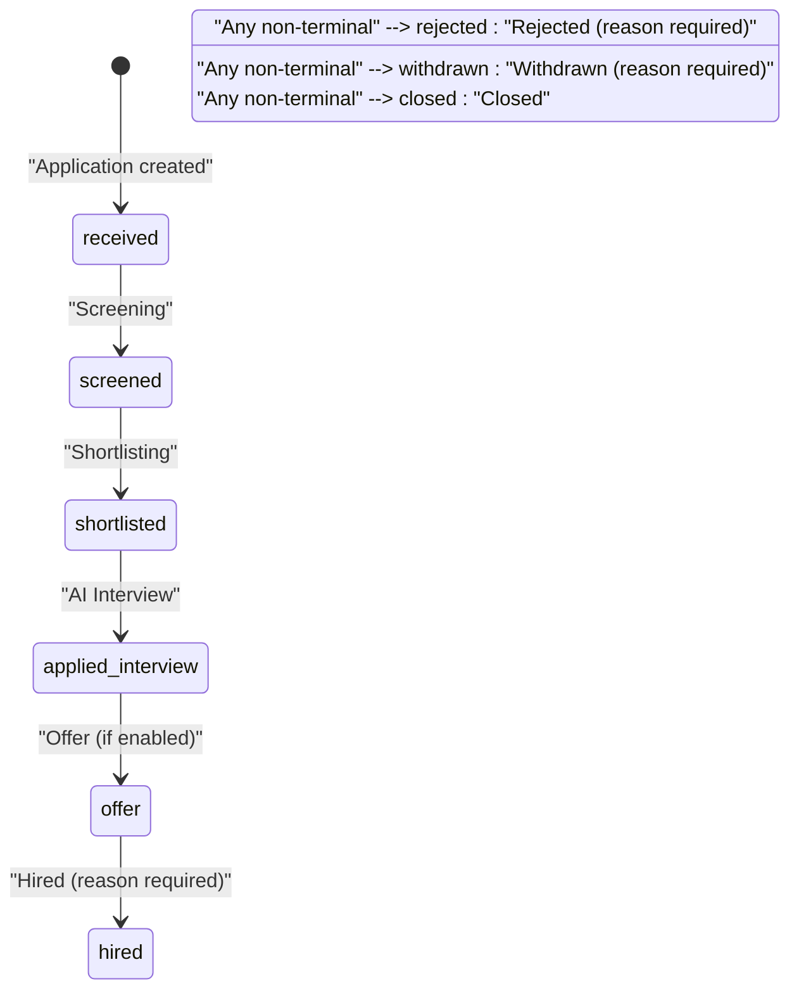
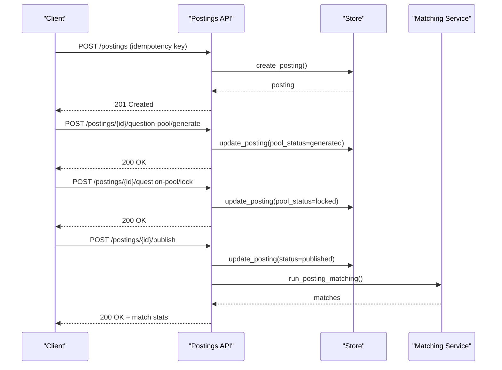
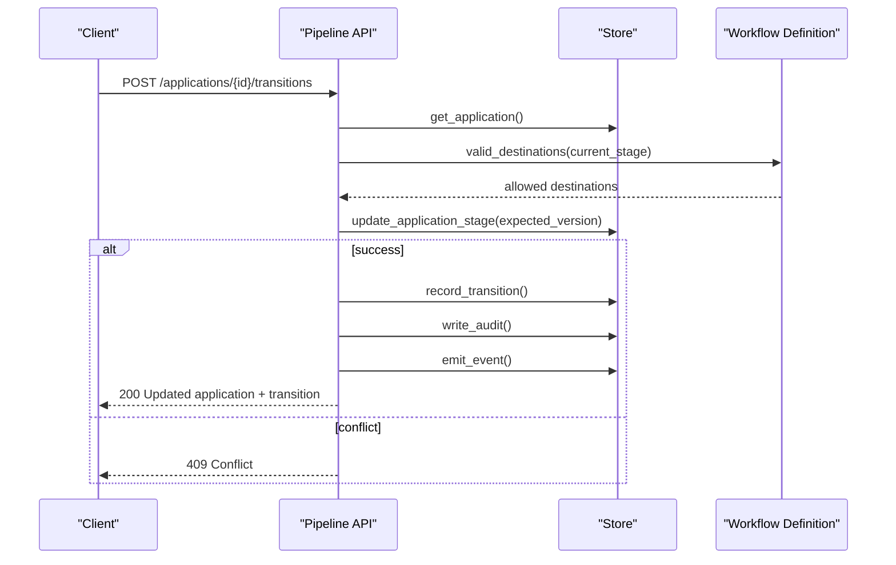
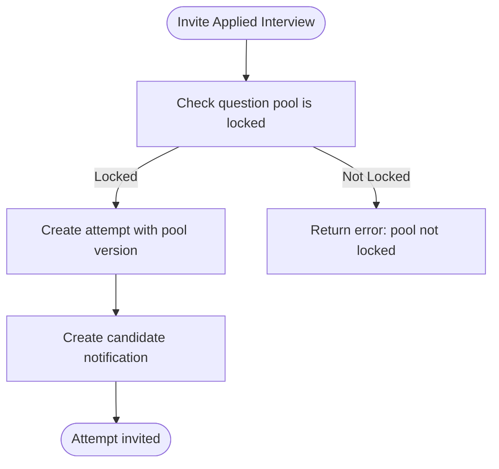
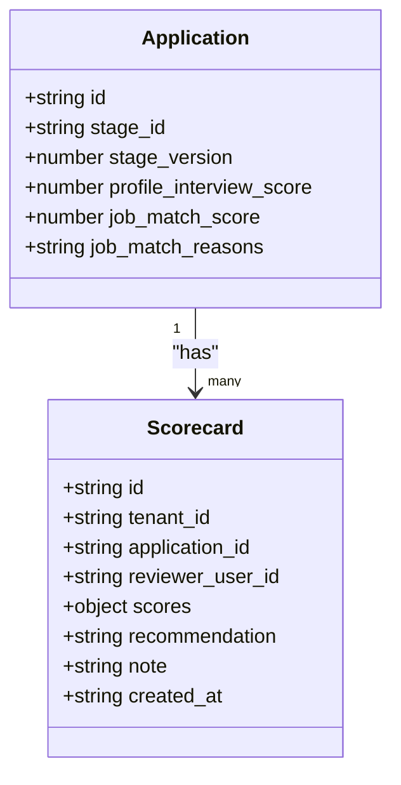
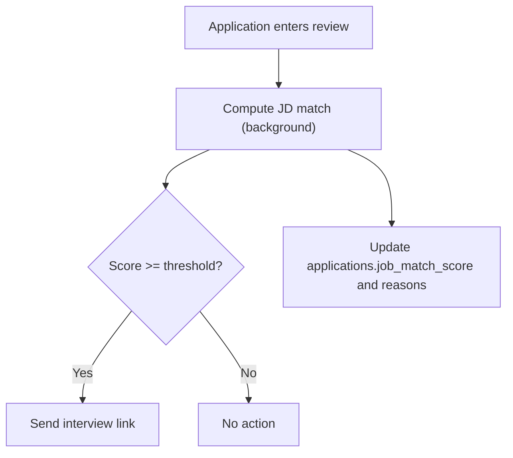
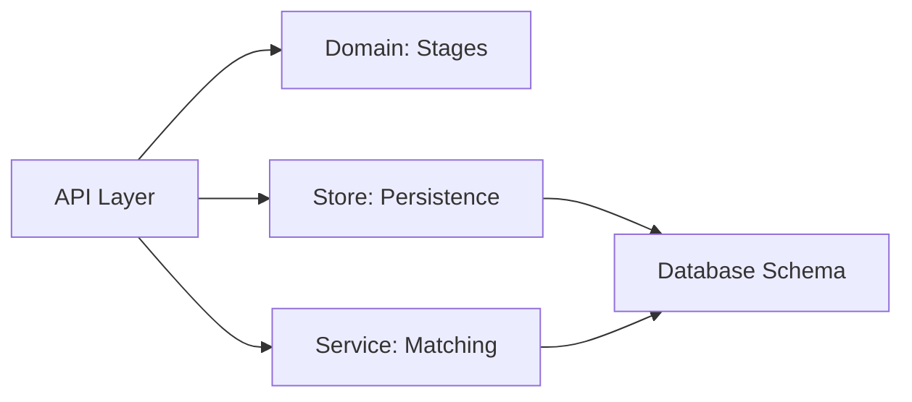

# Hiring Workflow Entities

<cite>
**Referenced Files in This Document**
- [postings.py](file://Backend/app/api/v1/postings.py)
- [pipeline.py](file://Backend/app/api/v1/pipeline.py)
- [stages.py](file://Backend/app/domain/stages.py)
- [database.py](file://Backend/app/db/database.py)
- [store.py](file://Backend/app/db/store.py)
- [matching.py](file://Backend/app/services/matching.py)
- [jobs.py](file://Backend/app/api/v1/jobs.py)
- [test_hiring_loop.py](file://Backend/tests/test_hiring_loop.py)
</cite>

## Table of Contents
1. Introduction
2. Project Structure
3. Core Components
4. Architecture Overview
5. Detailed Component Analysis
6. Dependency Analysis
7. Performance Considerations
8. Troubleshooting Guide
9. Conclusion

## Introduction
This document explains the hiring workflow entities and processes that manage job postings, candidate applications, interview attempts, reviewer scorecards, and application lifecycle transitions. It focuses on:
- The state machine governing application stages from draft to hire/reject/withdrawn/closed
- How job postings relate to applications and interview attempts
- The scoring system including profile_interview_score, job_match_score, and skill_score
- Pipeline queries, stage transition tracking, and evaluation workflows
- The audit trail via application_transitions for compliance and reporting

## Project Structure
The hiring workflow spans API endpoints, domain rules, database schema, and services:
- API layer exposes posting management, pipeline operations, transitions, scorecards, and analytics
- Domain layer defines canonical stages, categories, and workflow validation
- Database schema defines core tables for postings, applications, transitions, applied interviews, and scorecards
- Services provide proactive matching and scoring logic



**Diagram sources**
- [postings.py:81-180](file://Backend/app/api/v1/postings.py#L81-L180)
- [pipeline.py:277-514](file://Backend/app/api/v1/pipeline.py#L277-L514)
- [stages.py:47-161](file://Backend/app/domain/stages.py#L47-L161)
- [database.py:165-315](file://Backend/app/db/database.py#L165-L315)
- [matching.py:115-187](file://Backend/app/services/matching.py#L115-L187)

**Section sources**
- [postings.py:81-180](file://Backend/app/api/v1/postings.py#L81-L180)
- [pipeline.py:277-514](file://Backend/app/api/v1/pipeline.py#L277-L514)
- [stages.py:47-161](file://Backend/app/domain/stages.py#L47-L161)
- [database.py:165-315](file://Backend/app/db/database.py#L165-L315)
- [matching.py:115-187](file://Backend/app/services/matching.py#L115-L187)

## Core Components
- Job Postings: Represent open roles with status (draft/published/closed), question pool lifecycle, and workflow snapshots pinned at creation or publish time.
- Applications: One per candidate per posting; store immutable profile snapshot, current stage, stage version, and scores.
- Application Transitions: Immutable audit log of stage changes with reason codes, notes, actor, and timestamps.
- Applied Interview Attempts: Per-application interview sessions with questions, responses, evaluation, and identity verification.
- Reviewer Scorecards: Per-reviewer evaluations with dimension scores, recommendation, and notes.

Key fields and relationships:
- applications.profile_interview_score: best profile interview score for the candidate’s pack
- applications.job_match_score and job_match_reasons: AI-driven job description match computed asynchronously
- posting_matches.skill_score and interview_score: proactive matching outputs used when generating matches for published postings

**Section sources**
- [database.py:165-315](file://Backend/app/db/database.py#L165-L315)
- [jobs.py:117-143](file://Backend/app/api/v1/jobs.py#L117-L143)
- [pipeline.py:68-110](file://Backend/app/api/v1/pipeline.py#L68-L110)
- [matching.py:115-187](file://Backend/app/services/matching.py#L115-L187)

## Architecture Overview
The hiring workflow is driven by a validated state machine. Applications move through non-terminal stages (new → review → assessment) and can be terminated into hired, rejected, withdrawn, or closed. Human approval categories require reason codes. Transitions are idempotent, optimistic-concurrency protected, audited, and emit events.



Notes:
- Terminal categories have no outbound transitions
- Hired requires human approval and a reason code
- Offer is optional depending on workflow configuration

**Diagram sources**
- [stages.py:10-30](file://Backend/app/domain/stages.py#L10-L30)
- [stages.py:56-61](file://Backend/app/domain/stages.py#L56-L61)
- [stages.py:212-242](file://Backend/app/domain/stages.py#L212-L242)

**Section sources**
- [stages.py:10-30](file://Backend/app/domain/stages.py#L10-L30)
- [stages.py:56-61](file://Backend/app/domain/stages.py#L56-L61)
- [stages.py:212-242](file://Backend/app/domain/stages.py#L212-L242)

## Detailed Component Analysis

### Job Postings
Responsibilities:
- Create postings with a pinned domain pack and workflow snapshot
- Manage question pool lifecycle: generate → curate → lock
- Publish only when workflow snapshot exists and question pool is locked
- Close postings and emit audit records and events

Key behaviors:
- Publishing triggers proactive matching against consenting candidates
- Question pool locking ensures consistent interview experience across candidates



**Diagram sources**
- [postings.py:81-180](file://Backend/app/api/v1/postings.py#L81-L180)
- [postings.py:394-452](file://Backend/app/api/v1/postings.py#L394-L452)
- [postings.py:513-566](file://Backend/app/api/v1/postings.py#L513-L566)
- [postings.py:231-328](file://Backend/app/api/v1/postings.py#L231-L328)
- [matching.py:190-249](file://Backend/app/services/matching.py#L190-L249)

**Section sources**
- [postings.py:81-180](file://Backend/app/api/v1/postings.py#L81-L180)
- [postings.py:231-328](file://Backend/app/api/v1/postings.py#L231-L328)
- [postings.py:394-452](file://Backend/app/api/v1/postings.py#L394-L452)
- [postings.py:513-566](file://Backend/app/api/v1/postings.py#L513-L566)

### Applications and Stage Lifecycle
Responsibilities:
- Create one application per candidate per posting with initial stage set by workflow
- Maintain stage_version for optimistic concurrency control
- Provide valid destinations based on workflow definition
- Enforce human approval requirements for certain categories

Transition flow:
- Validate destination against workflow
- Update application stage atomically with expected version
- Record transition with reason_code and note
- Emit audit record and outbox event
- Send candidate notification and optional email template



**Diagram sources**
- [pipeline.py:277-514](file://Backend/app/api/v1/pipeline.py#L277-L514)
- [stages.py:212-242](file://Backend/app/domain/stages.py#L212-L242)

**Section sources**
- [pipeline.py:277-514](file://Backend/app/api/v1/pipeline.py#L277-L514)
- [stages.py:212-242](file://Backend/app/domain/stages.py#L212-L242)

### Applied Interview Attempts
Responsibilities:
- Invite candidates to complete an interview using the locked question pool
- Capture responses and evaluation results
- Support identity verification and transcripts
- Prevent duplicate invitations per application



**Diagram sources**
- [pipeline.py:521-614](file://Backend/app/api/v1/pipeline.py#L521-L614)

**Section sources**
- [pipeline.py:521-614](file://Backend/app/api/v1/pipeline.py#L521-L614)

### Reviewer Scorecards
Responsibilities:
- Allow reviewers to submit dimensioned scores and recommendations
- Enforce 0–100 range per dimension
- Prevent duplicate submissions per reviewer per application
- Audit each submission



**Diagram sources**
- [database.py:242-252](file://Backend/app/db/database.py#L242-L252)
- [pipeline.py:617-673](file://Backend/app/api/v1/pipeline.py#L617-L673)
- [store.py:1900-1925](file://Backend/app/db/store.py#L1900-L1925)

**Section sources**
- [pipeline.py:617-673](file://Backend/app/api/v1/pipeline.py#L617-L673)
- [store.py:1900-1925](file://Backend/app/db/store.py#L1900-L1925)
- [database.py:242-252](file://Backend/app/db/database.py#L242-L252)

### Scoring System
Components:
- profile_interview_score: Best profile interview score for the candidate’s pack; stored on application at creation time
- job_match_score and job_match_reasons: Asynchronous AI-driven match between candidate transcripts/profile and job description
- skill_score: Proactive matching output derived from skill overlap and embeddings; stored in posting_matches

Scoring flow highlights:
- When moving into review stage, background tasks compute JD match and may send interview links if threshold met
- Proactive matching runs on publish and uses embedding similarity and skill overlap



**Diagram sources**
- [pipeline.py:392-467](file://Backend/app/api/v1/pipeline.py#L392-L467)
- [matching.py:115-187](file://Backend/app/services/matching.py#L115-L187)

**Section sources**
- [pipeline.py:392-467](file://Backend/app/api/v1/pipeline.py#L392-L467)
- [matching.py:115-187](file://Backend/app/services/matching.py#L115-L187)

### Data Model Relationships
Core tables and relationships:
- postings: job role metadata, status, workflow snapshot, question pool
- applications: candidate’s application to a posting, current stage, scores
- application_transitions: audit trail of stage changes
- applied_interview_attempts: interview session tied to application
- reviewer_scorecards: per-reviewer evaluations tied to application

```mermaid
erDiagram
POSTINGS {
text id PK
text tenant_id
text title
text status
text workflow_snapshot
text question_pool
text pool_status
}
APPLICATIONS {
text id PK
text tenant_id
text posting_id FK
text candidate_id
text stage_id
text stage_category
int stage_version
real profile_interview_score
real job_match_score
text job_match_reasons
}
APPLICATION_TRANSITIONS {
text id PK
text tenant_id
text application_id FK
text from_stage_id
text to_stage_id
text reason_code
text note
text actor_user_id
text occurred_at
}
APPLIED_INTERVIEW_ATTEMPTS {
text id PK
text tenant_id
text application_id FK UNIQUE
text candidate_id
text posting_id
int pool_version
text status
text questions
text responses
text evaluation
text invited_at
text submitted_at
text transcripts
}
REVIEWER_SCORECARDS {
text id PK
text tenant_id
text application_id FK
text reviewer_user_id
text scores
text recommendation
text note
text created_at
}
POSTINGS ||--o{ APPLICATIONS : "has"
APPLICATIONS ||--o{ APPLICATION_TRANSITIONS : "has"
APPLICATIONS ||--|| APPLIED_INTERVIEW_ATTEMPTS : "has"
APPLICATIONS ||--o{ REVIEWER_SCORECARDS : "has"
```

**Diagram sources**
- [database.py:165-315](file://Backend/app/db/database.py#L165-L315)

**Section sources**
- [database.py:165-315](file://Backend/app/db/database.py#L165-L315)

## Dependency Analysis
- API endpoints depend on domain workflow definitions to validate transitions
- Store layer centralizes persistence and emits audit/outbox events within transactions
- Matching service integrates with postings and applications to compute proactive matches and JD alignment
- Frontend consumes pipeline cards, transitions, and scorecards to drive UI interactions



**Diagram sources**
- [pipeline.py:277-514](file://Backend/app/api/v1/pipeline.py#L277-L514)
- [stages.py:212-242](file://Backend/app/domain/stages.py#L212-L242)
- [matching.py:190-249](file://Backend/app/services/matching.py#L190-L249)
- [database.py:165-315](file://Backend/app/db/database.py#L165-L315)

**Section sources**
- [pipeline.py:277-514](file://Backend/app/api/v1/pipeline.py#L277-L514)
- [stages.py:212-242](file://Backend/app/domain/stages.py#L212-L242)
- [matching.py:190-249](file://Backend/app/services/matching.py#L190-L249)
- [database.py:165-315](file://Backend/app/db/database.py#L165-L315)

## Performance Considerations
- Use idempotency keys for transitions, invitations, and posting creation to avoid duplicates and retries
- Background tasks for JD match updates prevent blocking request latency
- Optimistic concurrency via stage_version reduces race conditions during concurrent edits
- Proactive matching thresholds and limits reduce noise and load

[No sources needed since this section provides general guidance]

## Troubleshooting Guide
Common issues and resolutions:
- Invalid transition: Ensure destination is allowed by workflow and category rules
- Reason required: Moving to offer/hired/rejected requires a reason_code
- Stage conflict: Refresh application card to get latest stage_version before transitioning
- Question pool not locked: Generate and curate then lock before publishing or inviting interviews
- Duplicate scorecard: Each reviewer can submit once per application

Relevant checks:
- Transition validation and reason enforcement
- Idempotency caching for transitions and invitations
- Email sending failures should not break committed transitions

**Section sources**
- [pipeline.py:317-333](file://Backend/app/api/v1/pipeline.py#L317-L333)
- [pipeline.py:547-555](file://Backend/app/api/v1/pipeline.py#L547-L555)
- [pipeline.py:635-651](file://Backend/app/api/v1/pipeline.py#L635-L651)
- [test_hiring_loop.py:108-132](file://Backend/tests/test_hiring_loop.py#L108-L132)

## Conclusion
The hiring workflow enforces a robust, auditable state machine with clear separation of concerns:
- Postings define roles and interview pools
- Applications track lifecycle and scores
- Transitions provide compliance-ready audit trails
- Scorecards capture multi-dimensional evaluations
- Matching services enhance candidate discovery and JD alignment

This design supports scalable, compliant hiring processes with strong guarantees around data integrity, user notifications, and reporting.

[No sources needed since this section summarizes without analyzing specific files]