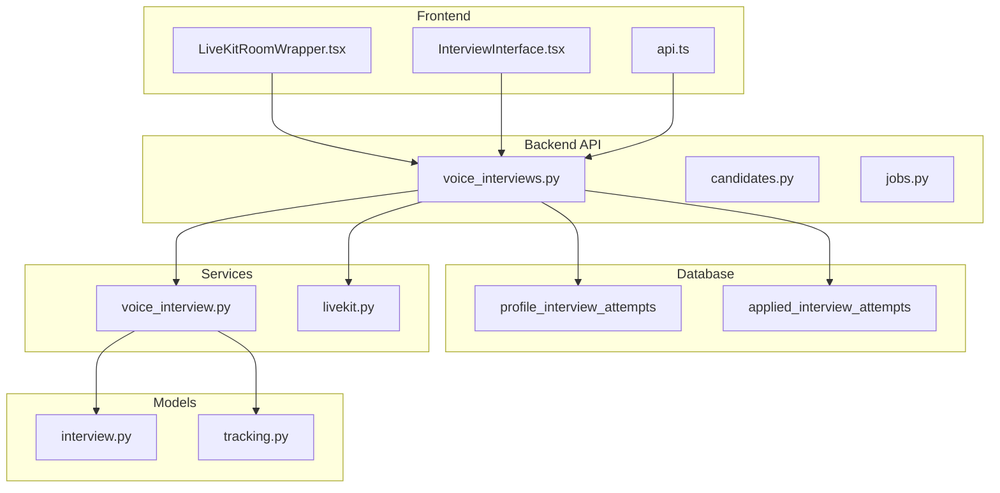
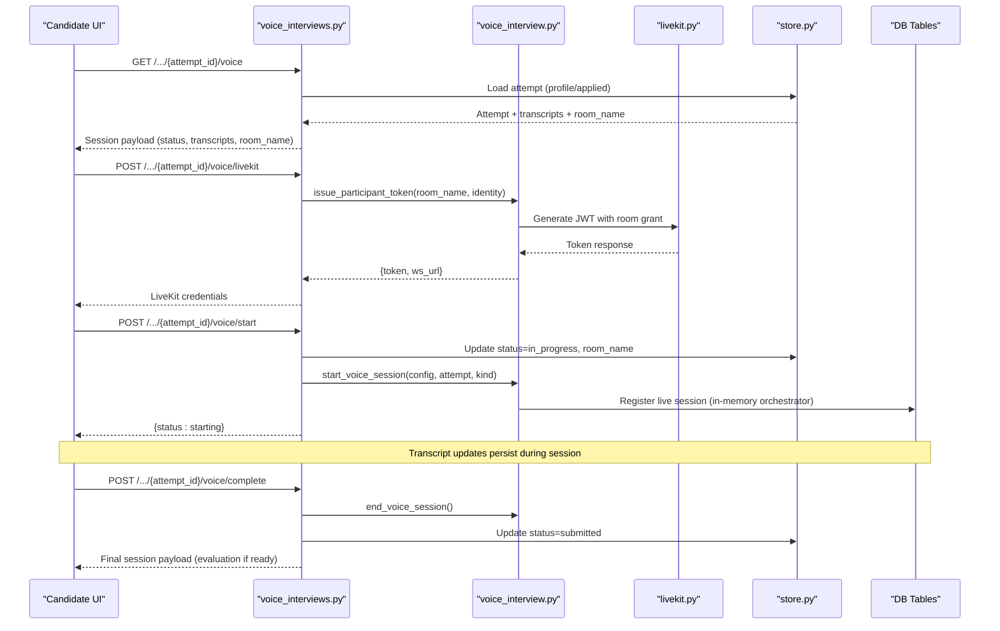
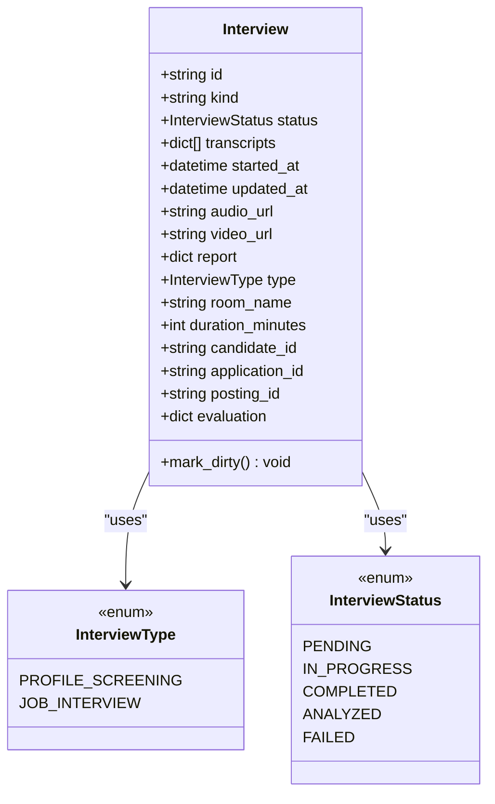
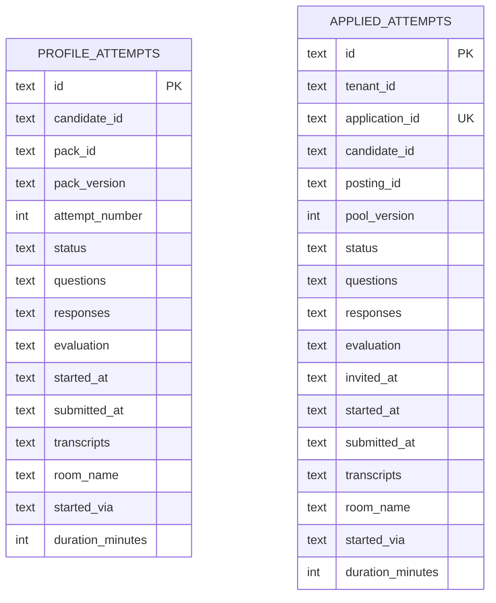
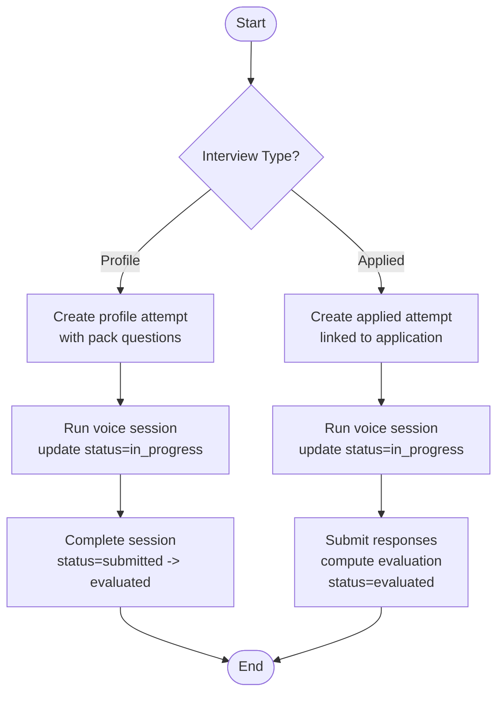
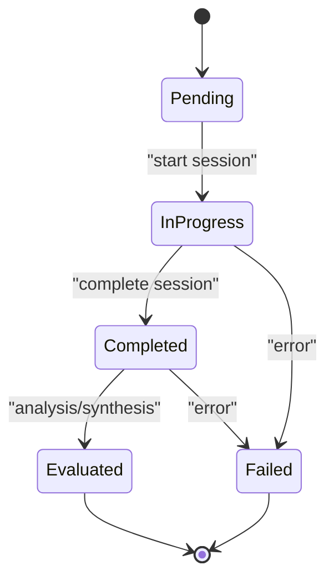
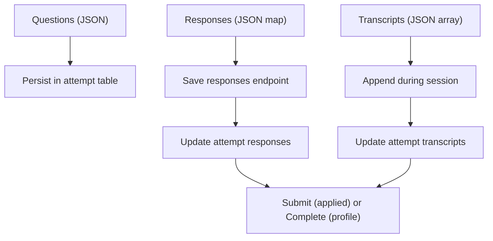
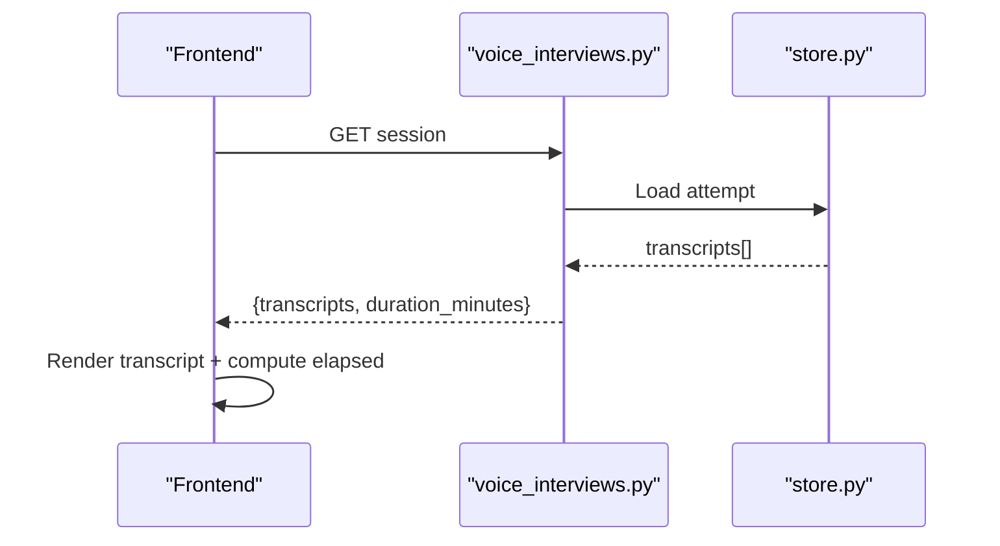
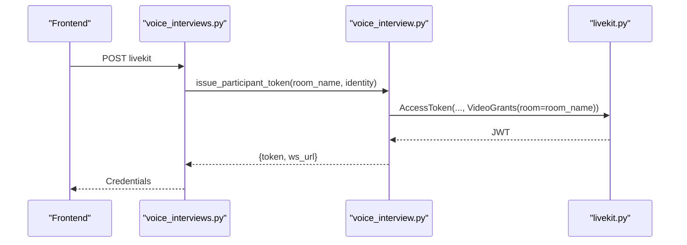
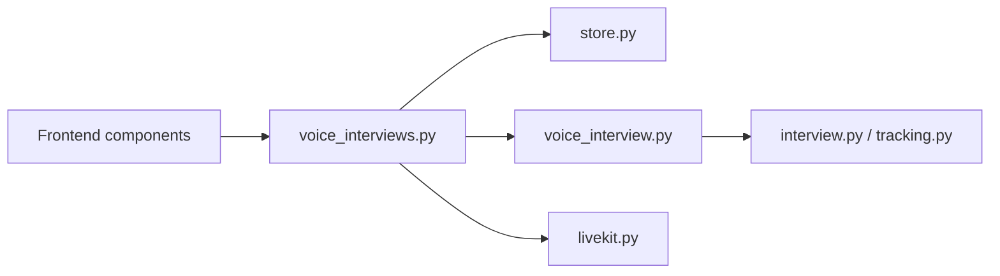

# Interview System Entities

<cite>
**Referenced Files in This Document**
- [database.py](file://Backend/app/db/database.py)
- [store.py](file://Backend/app/db/store.py)
- [voice_interviews.py](file://Backend/app/api/v1/voice_interviews.py)
- [voice_interview.py](file://Backend/app/services/voice_interview.py)
- [livekit.py](file://Backend/app/services/livekit.py)
- [interview.py](file://Backend/app/api/models/interview.py)
- [tracking.py](file://Backend/app/api/models/choices/tracking.py)
- [candidates.py](file://Backend/app/api/v1/candidates.py)
- [jobs.py](file://Backend/app/api/v1/jobs.py)
- [api.ts](file://Frontend/utils/api.ts)
- [LiveKitRoomWrapper.tsx](file://Frontend/components/interviews/voice/LiveKitRoomWrapper.tsx)
- [InterviewInterface.tsx](file://pts/frontend/src/components/interview/InterviewInterface.tsx)
</cite>

## Table of Contents
1. Introduction
2. Project Structure
3. Core Components
4. Architecture Overview
5. Detailed Component Analysis
6. Dependency Analysis
7. Performance Considerations
8. Troubleshooting Guide
9. Conclusion

## Introduction
This document explains the interview system entities and workflows for two distinct interview types:
- Profile interviews (profile_interview_attempts): self-assessment sessions where candidates practice or complete a screening interview against a curated question set.
- Applied interviews (applied_interview_attempts): employer-initiated evaluations tied to a job application, with a locked question pool and evaluation rubric.

The system supports voice and video interviews via LiveKit rooms, tracks session progress through status fields, persists transcripts and evaluations, and exposes APIs for querying sessions, saving responses, and retrieving results.

## Project Structure
The interview system spans database schema definitions, store functions for persistence, API endpoints for candidate flows, services for orchestration and LiveKit integration, and frontend components that connect to LiveKit rooms and render transcripts.

**Diagram sources**
- [database.py:146-162](file://Backend/app/db/database.py#L146-L162)
- [database.py:222-240](file://Backend/app/db/database.py#L222-L240)
- [voice_interviews.py:177-384](file://Backend/app/api/v1/voice_interviews.py#L177-L384)
- [voice_interview.py:53-151](file://Backend/app/services/voice_interview.py#L53-L151)
- [livekit.py:10-38](file://Backend/app/services/livekit.py#L10-L38)
- [interview.py:30-75](file://Backend/app/api/models/interview.py#L30-L75)
- [tracking.py:6-16](file://Backend/app/api/models/choices/tracking.py#L6-L16)
- [LiveKitRoomWrapper.tsx:1-91](file://Frontend/components/interviews/voice/LiveKitRoomWrapper.tsx#L1-L91)
- [InterviewInterface.tsx:132-143](file://pts/frontend/src/components/interview/InterviewInterface.tsx#L132-L143)
- [api.ts:54-84](file://Frontend/utils/api.ts#L54-L84)

**Section sources**
- [database.py:146-162](file://Backend/app/db/database.py#L146-L162)
- [database.py:222-240](file://Backend/app/db/database.py#L222-L240)
- [voice_interviews.py:177-384](file://Backend/app/api/v1/voice_interviews.py#L177-L384)
- [voice_interview.py:53-151](file://Backend/app/services/voice_interview.py#L53-L151)
- [livekit.py:10-38](file://Backend/app/services/livekit.py#L10-L38)
- [interview.py:30-75](file://Backend/app/api/models/interview.py#L30-L75)
- [tracking.py:6-16](file://Backend/app/api/models/choices/tracking.py#L6-L16)
- [LiveKitRoomWrapper.tsx:1-91](file://Frontend/components/interviews/voice/LiveKitRoomWrapper.tsx#L1-L91)
- [InterviewInterface.tsx:132-143](file://pts/frontend/src/components/interview/InterviewInterface.tsx#L132-L143)
- [api.ts:54-84](file://Frontend/utils/api.ts#L54-L84)

## Core Components
- profile_interview_attempts: Self-assessment sessions per candidate, with questions from a pack, optional identity verification, transcript storage, and evaluation upon completion.
- applied_interview_attempts: Employer-driven sessions tied to an application, with a locked question pool, rubric-based evaluation, and submission workflow.

Key shared attributes:
- room_name: LiveKit room identifier used to join the media session.
- started_via: Indicates how the interview was initiated; default is voice.
- duration_minutes: Expected or configured length of the session.
- transcripts: JSON array of message objects persisted throughout the session.
- evaluation: JSON object produced by analysis or scoring after completion.

**Section sources**
- [database.py:146-162](file://Backend/app/db/database.py#L146-L162)
- [database.py:222-240](file://Backend/app/db/database.py#L222-L240)
- [store.py:1294-1310](file://Backend/app/db/store.py#L1294-L1310)
- [store.py:1787-1807](file://Backend/app/db/store.py#L1787-L1807)
- [voice_interviews.py:37-57](file://Backend/app/api/v1/voice_interviews.py#L37-L57)

## Architecture Overview
The interview flow integrates candidate-facing APIs, AI agent orchestration, LiveKit token issuance, and persistent storage.

**Diagram sources**
- [voice_interviews.py:177-255](file://Backend/app/api/v1/voice_interviews.py#L177-L255)
- [voice_interviews.py:290-384](file://Backend/app/api/v1/voice_interviews.py#L290-L384)
- [voice_interview.py:169-216](file://Backend/app/services/voice_interview.py#L169-L216)
- [livekit.py:10-38](file://Backend/app/services/livekit.py#L10-L38)
- [store.py:1333-1363](file://Backend/app/db/store.py#L1333-L1363)
- [store.py:1839-1869](file://Backend/app/db/store.py#L1839-L1869)

## Detailed Component Analysis

### Data Model: Interview Entity and Statuses
The in-memory Interview model bridges database attempts with agent orchestration, carrying type, status, transcripts, room_name, duration_minutes, and evaluation data.

**Diagram sources**
- [interview.py:30-75](file://Backend/app/api/models/interview.py#L30-L75)
- [tracking.py:6-16](file://Backend/app/api/models/choices/tracking.py#L6-L16)

**Section sources**
- [interview.py:30-75](file://Backend/app/api/models/interview.py#L30-L75)
- [tracking.py:6-16](file://Backend/app/api/models/choices/tracking.py#L6-L16)

### Database Schema: profile_interview_attempts and applied_interview_attempts
Both tables store core interview metadata, JSON-encoded questions/responses/transcripts/evaluations, timestamps, room_name, started_via, and duration_minutes.

- profile_interview_attempts: candidate-centric, pack-backed, supports identity_verification and best score retrieval.
- applied_interview_attempts: application-centric, unique per application, includes invited_at and rubric-driven evaluation on submit.

**Diagram sources**
- [database.py:146-162](file://Backend/app/db/database.py#L146-L162)
- [database.py:222-240](file://Backend/app/db/database.py#L222-L240)

**Section sources**
- [database.py:146-162](file://Backend/app/db/database.py#L146-L162)
- [database.py:222-240](file://Backend/app/db/database.py#L222-L240)

### Two-Stage Interview Model
- Profile interviews:
  - Purpose: Candidate self-assessment and practice using a pack’s question set.
  - Creation: Candidates create attempts with randomized questions; cooldown and attempt caps apply.
  - Completion: Marked evaluated with stored evaluation and submitted_at timestamp.
- Applied interviews:
  - Purpose: Employer-conducted evaluation tied to a specific job posting.
  - Creation: Invited per application; questions are locked from the posting’s question pool.
  - Submission: Rubric-based evaluation computed and stored; event emitted for downstream processing.

**Diagram sources**
- [candidates.py:298-363](file://Backend/app/api/v1/candidates.py#L298-L363)
- [jobs.py:410-451](file://Backend/app/api/v1/jobs.py#L410-L451)
- [voice_interviews.py:204-255](file://Backend/app/api/v1/voice_interviews.py#L204-L255)
- [voice_interviews.py:321-384](file://Backend/app/api/v1/voice_interviews.py#L321-L384)

**Section sources**
- [candidates.py:298-363](file://Backend/app/api/v1/candidates.py#L298-L363)
- [jobs.py:410-451](file://Backend/app/api/v1/jobs.py#L410-L451)
- [voice_interviews.py:204-255](file://Backend/app/api/v1/voice_interviews.py#L204-L255)
- [voice_interviews.py:321-384](file://Backend/app/api/v1/voice_interviews.py#L321-L384)

### Interview Lifecycle States
Common states across both attempt types:
- pending: Not yet started.
- in_progress: Active session underway.
- completed: Session finished but not yet analyzed.
- evaluated: Analysis complete; evaluation stored.
- failed: Error or interruption state.

For applied interviews, initial state may be invited before starting.

**Diagram sources**
- [tracking.py:11-16](file://Backend/app/api/models/choices/tracking.py#L11-L16)
- [voice_interviews.py:204-255](file://Backend/app/api/v1/voice_interviews.py#L204-L255)
- [voice_interviews.py:321-384](file://Backend/app/api/v1/voice_interviews.py#L321-L384)

**Section sources**
- [tracking.py:11-16](file://Backend/app/api/models/choices/tracking.py#L11-L16)
- [voice_interviews.py:204-255](file://Backend/app/api/v1/voice_interviews.py#L204-L255)
- [voice_interviews.py:321-384](file://Backend/app/api/v1/voice_interviews.py#L321-L384)

### Question and Response Storage Patterns
- Questions: Stored as JSON arrays in both attempt tables; public endpoints expose sanitized versions (id, prompt, competency).
- Responses:
  - Profile: Saved incrementally via dedicated endpoint; stored as JSON map keyed by question id.
  - Applied: Saved incrementally; final submission triggers evaluation computation and stores evaluation JSON.
- Transcripts: JSON arrays appended during voice sessions; loaded into UI to resume display and compute elapsed time.

**Diagram sources**
- [store.py:1366-1372](file://Backend/app/db/store.py#L1366-L1372)
- [store.py:1882-1893](file://Backend/app/db/store.py#L1882-L1893)
- [InterviewInterface.tsx:132-143](file://pts/frontend/src/components/interview/InterviewInterface.tsx#L132-L143)

**Section sources**
- [store.py:1366-1372](file://Backend/app/db/store.py#L1366-L1372)
- [store.py:1882-1893](file://Backend/app/db/store.py#L1882-L1893)
- [InterviewInterface.tsx:132-143](file://pts/frontend/src/components/interview/InterviewInterface.tsx#L132-L143)

### Transcript Handling
- Frontend loads stored transcripts to resume display and compute elapsed time based on transcript timestamps.
- Backend appends transcript entries during voice sessions; these are returned in session payloads and visible to clients.

**Diagram sources**
- [InterviewInterface.tsx:132-143](file://pts/frontend/src/components/interview/InterviewInterface.tsx#L132-L143)
- [voice_interviews.py:37-57](file://Backend/app/api/v1/voice_interviews.py#L37-L57)

**Section sources**
- [InterviewInterface.tsx:132-143](file://pts/frontend/src/components/interview/InterviewInterface.tsx#L132-L143)
- [voice_interviews.py:37-57](file://Backend/app/api/v1/voice_interviews.py#L37-L57)

### LiveKit Integration and Duration Tracking
- room_name: Identifies the LiveKit room; defaults to profile-screening-{id} or job-interview-{id}.
- Token issuance: Backend generates JWTs granting access to the specified room for a candidate identity.
- Duration: duration_minutes is stored per attempt and surfaced in session payloads; UI uses it to inform session behavior.

**Diagram sources**
- [voice_interviews.py:189-201](file://Backend/app/api/v1/voice_interviews.py#L189-L201)
- [voice_interviews.py:306-318](file://Backend/app/api/v1/voice_interviews.py#L306-L318)
- [voice_interview.py:230-251](file://Backend/app/services/voice_interview.py#L230-L251)
- [livekit.py:10-38](file://Backend/app/services/livekit.py#L10-L38)

**Section sources**
- [voice_interviews.py:189-201](file://Backend/app/api/v1/voice_interviews.py#L189-L201)
- [voice_interviews.py:306-318](file://Backend/app/api/v1/voice_interviews.py#L306-L318)
- [voice_interview.py:230-251](file://Backend/app/services/voice_interview.py#L230-L251)
- [livekit.py:10-38](file://Backend/app/services/livekit.py#L10-L38)

### Voice vs Video Differentiation via started_via
- Both attempt tables include started_via, defaulting to voice.
- The session payload surfaces started_via to indicate how the interview was initiated.
- While the current endpoints focus on voice sessions, the field allows differentiation for future video flows or mixed modalities.

**Section sources**
- [database.py:146-162](file://Backend/app/db/database.py#L146-L162)
- [database.py:222-240](file://Backend/app/db/database.py#L222-L240)
- [voice_interviews.py:37-57](file://Backend/app/api/v1/voice_interviews.py#L37-L57)

### Example Queries and Workflows

- Retrieve a profile interview session:
  - Endpoint: GET /candidates/me/profile-interview-attempts/{attempt_id}/voice
  - Returns: id, kind, title, status, room_name, duration_minutes, transcripts, evaluation, identity_verification, started_via, and public questions.

- Retrieve an applied interview session:
  - Endpoint: GET /candidates/me/applied-interviews/{attempt_id}/voice
  - Returns: Similar payload with title derived from posting.

- Save profile responses:
  - Endpoint: PATCH /candidates/me/profile-interview-attempts/{attempt_id}/responses
  - Stores responses JSON map for incremental progress.

- Submit applied responses:
  - Endpoint: PATCH /candidates/me/applied-interviews/{attempt_id}/responses
  - Computes evaluation based on rubric dimensions and marks status evaluated.

- Start a voice session:
  - Endpoint: POST /.../{attempt_id}/voice/start
  - Updates status to in_progress and starts agent orchestration.

- Complete a voice session:
  - Endpoint: POST /.../{attempt_id}/voice/complete
  - Ends orchestration, marks status submitted, triggers synthesis/analysis.

- Get LiveKit token:
  - Endpoint: POST /.../{attempt_id}/voice/livekit
  - Issues JWT for joining the room identified by room_name.

**Section sources**
- [voice_interviews.py:177-255](file://Backend/app/api/v1/voice_interviews.py#L177-L255)
- [voice_interviews.py:290-384](file://Backend/app/api/v1/voice_interviews.py#L290-L384)
- [candidates.py:365-399](file://Backend/app/api/v1/candidates.py#L365-L399)
- [jobs.py:319-347](file://Backend/app/api/v1/jobs.py#L319-L347)
- [jobs.py:410-451](file://Backend/app/api/v1/jobs.py#L410-L451)
- [api.ts:54-84](file://Frontend/utils/api.ts#L54-L84)

### Progress Tracking and Evaluation Retrieval
- Progress:
  - Check status field to determine stage (pending, in_progress, completed, evaluated, failed).
  - Use transcripts to infer activity and elapsed time.
- Evaluation:
  - Profile: Stored upon completion and analysis; accessible in session payload.
  - Applied: Computed on submission using rubric dimensions; stored and returned in session payload.

**Section sources**
- [voice_interviews.py:37-57](file://Backend/app/api/v1/voice_interviews.py#L37-L57)
- [jobs.py:410-451](file://Backend/app/api/v1/jobs.py#L410-L451)
- [store.py:1395-1402](file://Backend/app/db/store.py#L1395-L1402)

## Dependency Analysis
- API endpoints depend on store functions for reading/writing attempts and on voice_interview service for orchestration and token issuance.
- voice_interview service depends on models (Interview, InterviewType, InterviewStatus) and settings for configuration.
- Frontend components depend on backend APIs to fetch sessions, request LiveKit tokens, and manage UI state.

**Diagram sources**
- [voice_interviews.py:177-384](file://Backend/app/api/v1/voice_interviews.py#L177-L384)
- [voice_interview.py:53-216](file://Backend/app/services/voice_interview.py#L53-L216)
- [interview.py:30-75](file://Backend/app/api/models/interview.py#L30-L75)
- [tracking.py:6-16](file://Backend/app/api/models/choices/tracking.py#L6-L16)
- [livekit.py:10-38](file://Backend/app/services/livekit.py#L10-L38)
- [LiveKitRoomWrapper.tsx:1-91](file://Frontend/components/interviews/voice/LiveKitRoomWrapper.tsx#L1-L91)

**Section sources**
- [voice_interviews.py:177-384](file://Backend/app/api/v1/voice_interviews.py#L177-L384)
- [voice_interview.py:53-216](file://Backend/app/services/voice_interview.py#L53-L216)
- [interview.py:30-75](file://Backend/app/api/models/interview.py#L30-L75)
- [tracking.py:6-16](file://Backend/app/api/models/choices/tracking.py#L6-L16)
- [livekit.py:10-38](file://Backend/app/services/livekit.py#L10-L38)
- [LiveKitRoomWrapper.tsx:1-91](file://Frontend/components/interviews/voice/LiveKitRoomWrapper.tsx#L1-L91)

## Performance Considerations
- Minimize repeated reads by caching session payloads client-side until changes occur.
- Use transcripts to avoid re-fetching full history; append only new entries.
- Ensure LiveKit token TTL aligns with expected session durations to reduce re-auth overhead.
- Avoid redundant start calls; guard against already_in_progress states.

[No sources needed since this section provides general guidance]

## Troubleshooting Guide
- Not found errors when loading attempts:
  - Verify attempt_id ownership and candidate context.
  - Check status transitions and ensure the attempt exists in the correct table.
- Already evaluated or already submitted:
  - Prevent re-starting completed sessions; handle 409 responses gracefully.
- LiveKit connection issues:
  - Validate room_name format and token configuration.
  - Confirm backend LiveKit settings are present and valid.
- Identity verification failures:
  - Ensure reference avatar exists; otherwise, verdict records no-reference state.

**Section sources**
- [voice_interviews.py:204-255](file://Backend/app/api/v1/voice_interviews.py#L204-L255)
- [voice_interviews.py:321-384](file://Backend/app/api/v1/voice_interviews.py#L321-L384)
- [livekit.py:10-38](file://Backend/app/services/livekit.py#L10-L38)
- [voice_interviews.py:95-137](file://Backend/app/api/v1/voice_interviews.py#L95-L137)

## Conclusion
The interview system provides a robust foundation for both candidate self-assessment (profile) and employer-led evaluations (applied), with clear lifecycle states, persistent transcripts and evaluations, and seamless LiveKit integration. The design separates concerns across API, services, models, and storage, enabling scalable extension to additional modalities and richer analytics while maintaining clarity and reliability.

[No sources needed since this section summarizes without analyzing specific files]