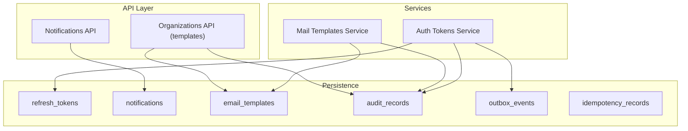
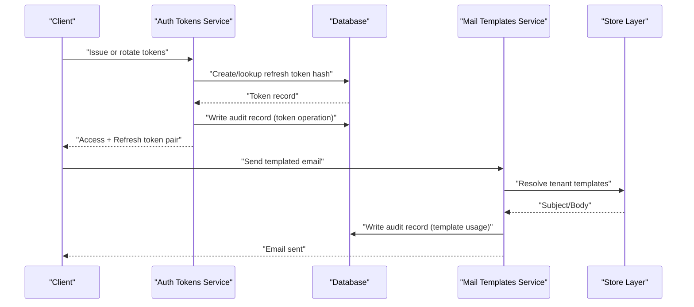
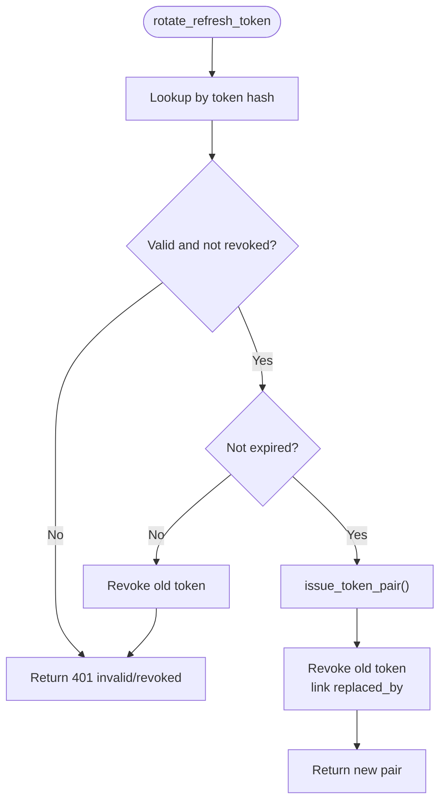
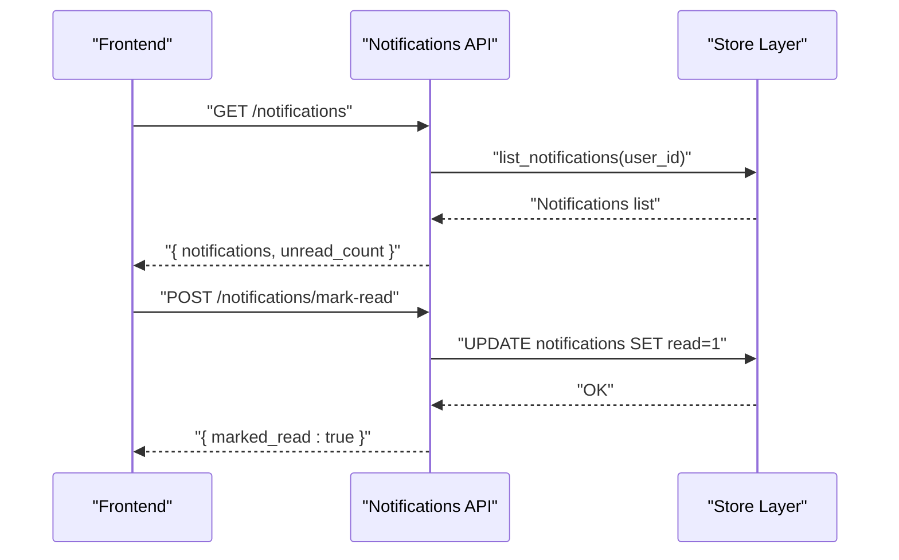
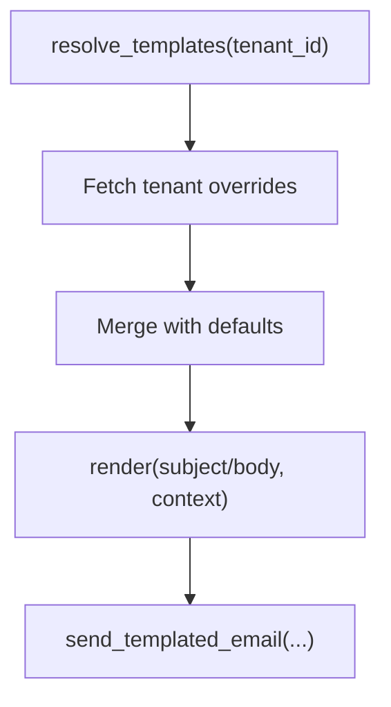
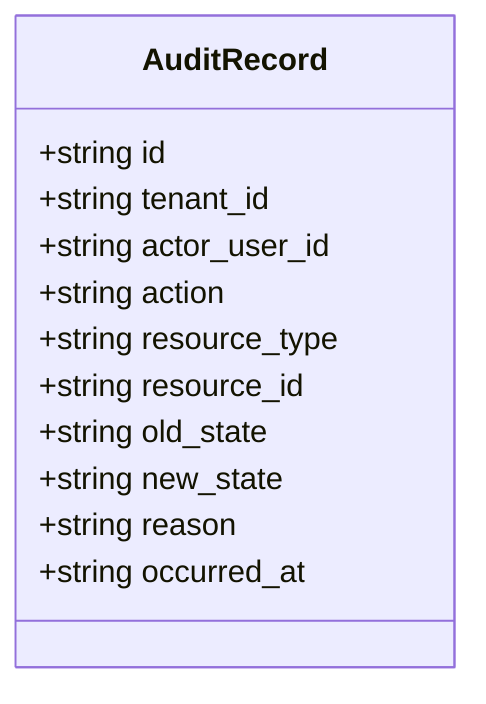
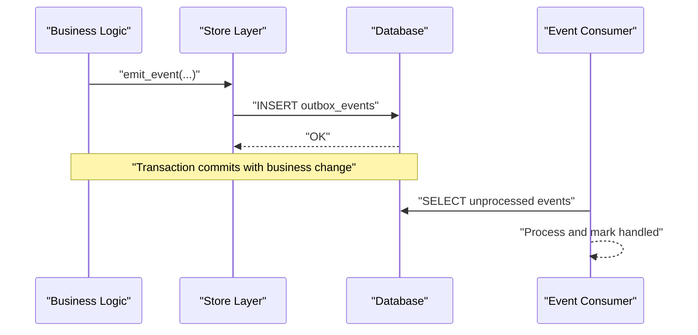
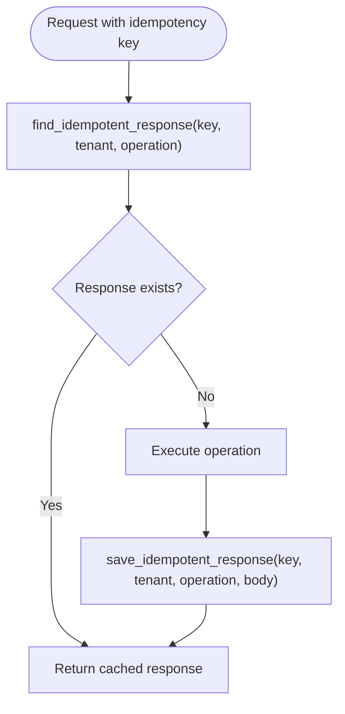
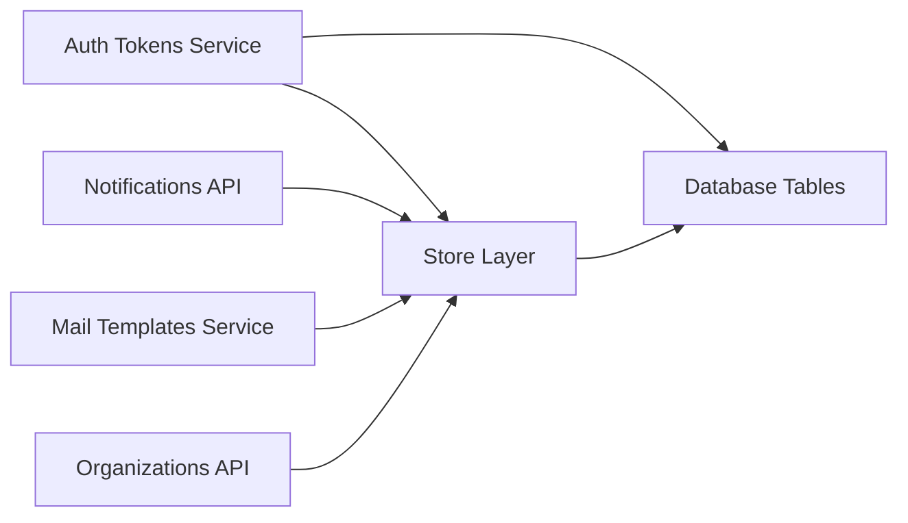

# Supporting Entities

<cite>
**Referenced Files in This Document**
- [auth_tokens.py](file://Backend/app/services/auth_tokens.py)
- [store.py](file://Backend/app/db/store.py)
- [database.py](file://Backend/app/db/database.py)
- [notifications.py](file://Backend/app/api/v1/notifications.py)
- [mail_templates.py](file://Backend/app/services/mail_templates.py)
- [organizations.py](file://Backend/app/api/v1/organizations.py)
- [admin-page.tsx](file://Frontend/components/admin/admin-page.tsx)
</cite>

## Table of Contents
1. Introduction
2. Project Structure
3. Core Components
4. Architecture Overview
5. Detailed Component Analysis
6. Dependency Analysis
7. Performance Considerations
8. Troubleshooting Guide
9. Conclusion

## Introduction
This document explains the supporting entities that underpin security, notifications, email templates, audit trails, event-driven delivery, and idempotency across the system:
- refresh_tokens: secure token lifecycle with rotation and revocation
- notifications: in-app user notifications
- email_templates: tenant-customizable email content with safe rendering
- audit_records: tamper-evident logs for compliance and debugging
- outbox_events: reliable asynchronous event delivery via an outbox pattern
- idempotency_records: request deduplication to ensure safety on retries

The goal is to help you understand how these pieces work together, how to query and manage them, and how to implement robust processing patterns.

## Project Structure
The supporting entities span services, database schema, API endpoints, and frontend panels:
- Security tokens are issued and rotated by the auth service and persisted in a dedicated table
- Notifications are created and listed through a small API surface
- Email templates are resolved per tenant and rendered safely before sending
- Audit records capture state changes for governance
- Outbox events persist events atomically with business operations for reliable delivery
- Idempotency records prevent duplicate side effects on retries

**Diagram sources**
- [auth_tokens.py:67-120](file://Backend/app/services/auth_tokens.py#L67-L120)
- [store.py:248-296](file://Backend/app/db/store.py#L248-L296)
- [store.py:300-322](file://Backend/app/db/store.py#L300-L322)
- [mail_templates.py:86-136](file://Backend/app/services/mail_templates.py#L86-L136)
- [organizations.py:580-623](file://Backend/app/api/v1/organizations.py#L580-L623)
- [database.py:254-330](file://Backend/app/db/database.py#L254-L330)

**Section sources**
- [auth_tokens.py:67-120](file://Backend/app/services/auth_tokens.py#L67-L120)
- [store.py:248-296](file://Backend/app/db/store.py#L248-L296)
- [store.py:300-322](file://Backend/app/db/store.py#L300-L322)
- [mail_templates.py:86-136](file://Backend/app/services/mail_templates.py#L86-L136)
- [organizations.py:580-623](file://Backend/app/api/v1/organizations.py#L580-L623)
- [database.py:254-330](file://Backend/app/db/database.py#L254-L330)

## Core Components
- Refresh tokens: opaque tokens hashed and stored; rotation issues new pairs and revokes old ones
- Notifications: create/list/mark-read for in-app alerts
- Email templates: default templates per key with tenant overrides; safe placeholder rendering
- Audit records: append-only log of actions with actor, resource, and optional state snapshots
- Outbox events: durable event entries written within the same transaction as business logic
- Idempotency records: keyed responses to deduplicate repeated requests

**Section sources**
- [auth_tokens.py:18-126](file://Backend/app/services/auth_tokens.py#L18-L126)
- [store.py:158-205](file://Backend/app/db/store.py#L158-L205)
- [store.py:300-322](file://Backend/app/db/store.py#L300-L322)
- [mail_templates.py:33-136](file://Backend/app/services/mail_templates.py#L33-L136)
- [store.py:248-296](file://Backend/app/db/store.py#L248-L296)
- [database.py:254-330](file://Backend/app/db/database.py#L254-L330)

## Architecture Overview
The system combines synchronous APIs with durable persistence to guarantee reliability:
- Token issuance and rotation use hashed refresh tokens stored in the database
- Email template resolution merges defaults with tenant overrides
- Audit logging captures configuration changes and sensitive operations
- Outbox events enable eventual consistency without sacrificing atomicity
- Idempotency records protect against duplicate writes during retries

**Diagram sources**
- [auth_tokens.py:67-120](file://Backend/app/services/auth_tokens.py#L67-L120)
- [store.py:248-296](file://Backend/app/db/store.py#L248-L296)
- [mail_templates.py:118-136](file://Backend/app/services/mail_templates.py#L118-L136)

## Detailed Component Analysis

### Refresh Tokens and Rotation
Security mechanism:
- Access tokens are signed JWTs with short TTL
- Refresh tokens are opaque strings hashed before storage
- Rotation issues a new access/refresh pair and revokes the previous refresh token
- Revocation supports linking replaced tokens for traceability

**Diagram sources**
- [auth_tokens.py:89-120](file://Backend/app/services/auth_tokens.py#L89-L120)
- [store.py:158-205](file://Backend/app/db/store.py#L158-L205)

**Section sources**
- [auth_tokens.py:18-126](file://Backend/app/services/auth_tokens.py#L18-L126)
- [store.py:158-205](file://Backend/app/db/store.py#L158-L205)

### Notifications System
Capabilities:
- Create in-app notifications for users
- List recent notifications per user
- Mark all notifications read

**Diagram sources**
- [notifications.py:11-26](file://Backend/app/api/v1/notifications.py#L11-L26)
- [store.py:300-322](file://Backend/app/db/store.py#L300-L322)

**Section sources**
- [notifications.py:11-26](file://Backend/app/api/v1/notifications.py#L11-L26)
- [store.py:300-322](file://Backend/app/db/store.py#L300-L322)

### Email Templates Management
Features:
- Default templates per key (stage update, acceptance, rejection)
- Tenant-specific overrides stored per organization
- Safe rendering preserves unknown placeholders and tolerates malformed templates
- Admin UI allows editing and resetting templates

**Diagram sources**
- [mail_templates.py:86-136](file://Backend/app/services/mail_templates.py#L86-L136)

**Section sources**
- [mail_templates.py:33-136](file://Backend/app/services/mail_templates.py#L33-L136)
- [organizations.py:580-623](file://Backend/app/api/v1/organizations.py#L580-L623)
- [admin-page.tsx:751-845](file://Frontend/components/admin/admin-page.tsx#L751-L845)

### Audit Trail Capabilities
Purpose:
- Record who did what, when, and why
- Capture resource type, ID, and optional old/new states
- Index by tenant for efficient queries

**Diagram sources**
- [database.py:254-266](file://Backend/app/db/database.py#L254-L266)

Usage examples:
- Query recent audit records for a tenant
- View in admin panel to inspect recent changes

**Section sources**
- [database.py:254-266](file://Backend/app/db/database.py#L254-L266)
- [store.py:632-643](file://Backend/app/db/store.py#L632-L643)
- [admin-page.tsx:928-961](file://Frontend/components/admin/admin-page.tsx#L928-L961)

### Event-Driven Delivery with Outbox Events
Pattern:
- Write events to outbox_events within the same transaction as business updates
- Consumers poll and process events reliably, ensuring at-least-once delivery semantics

**Diagram sources**
- [store.py:248-276](file://Backend/app/db/store.py#L248-L276)
- [database.py:277-288](file://Backend/app/db/database.py#L277-L288)

**Section sources**
- [store.py:248-276](file://Backend/app/db/store.py#L248-L276)
- [database.py:277-288](file://Backend/app/db/database.py#L277-L288)

### Idempotency Patterns for API Safety
Mechanism:
- Clients supply a unique idempotency key per operation
- Server checks for existing response; if found, returns cached result
- If not present, executes operation and stores response keyed by (key, tenant, operation)

**Diagram sources**
- [store.py:279-296](file://Backend/app/db/store.py#L279-L296)
- [database.py:268-275](file://Backend/app/db/database.py#L268-L275)

**Section sources**
- [store.py:279-296](file://Backend/app/db/store.py#L279-L296)
- [database.py:268-275](file://Backend/app/db/database.py#L268-L275)

## Dependency Analysis
Key relationships:
- Auth tokens depend on store functions for refresh token CRUD and audit logging
- Notifications API depends on store for listing and marking read
- Email templates depend on store for resolving tenant overrides and on mail adapter for sending
- Audit records are written by multiple services to track changes
- Outbox events and idempotency records provide durability and safety guarantees

**Diagram sources**
- [auth_tokens.py:67-120](file://Backend/app/services/auth_tokens.py#L67-L120)
- [notifications.py:11-26](file://Backend/app/api/v1/notifications.py#L11-L26)
- [mail_templates.py:86-136](file://Backend/app/services/mail_templates.py#L86-L136)
- [organizations.py:580-623](file://Backend/app/api/v1/organizations.py#L580-L623)
- [store.py:248-296](file://Backend/app/db/store.py#L248-L296)

**Section sources**
- [auth_tokens.py:67-120](file://Backend/app/services/auth_tokens.py#L67-L120)
- [notifications.py:11-26](file://Backend/app/api/v1/notifications.py#L11-L26)
- [mail_templates.py:86-136](file://Backend/app/services/mail_templates.py#L86-L136)
- [organizations.py:580-623](file://Backend/app/api/v1/organizations.py#L580-L623)
- [store.py:248-296](file://Backend/app/db/store.py#L248-L296)

## Performance Considerations
- Use indexes on tenant-scoped tables (audit_records, notifications, email_templates) to optimize queries
- Limit notification lists and audit log views to recent items to reduce payload size
- Keep refresh token rotation fast by hashing lookups and avoiding unnecessary joins
- Batch outbox event processing to minimize overhead
- Cache idempotency responses only as needed; rely on primary keys for uniqueness

[No sources needed since this section provides general guidance]

## Troubleshooting Guide
Common issues and resolutions:
- Invalid or expired refresh token: ensure rotation is called before expiry and handle revocation flows
- Notification not visible: verify recipient_user_id scoping and read status updates
- Email template not applied: confirm tenant override exists and template key is valid
- Audit log missing: check that write_audit is invoked around critical operations
- Duplicate processing: validate idempotency key usage and consumer handling of duplicates
- Outbox backlog: monitor outbox_events and ensure consumers process and acknowledge events

**Section sources**
- [auth_tokens.py:89-126](file://Backend/app/services/auth_tokens.py#L89-L126)
- [notifications.py:11-26](file://Backend/app/api/v1/notifications.py#L11-L26)
- [mail_templates.py:86-136](file://Backend/app/services/mail_templates.py#L86-L136)
- [store.py:248-296](file://Backend/app/db/store.py#L248-L296)

## Conclusion
These supporting entities form a robust foundation for secure authentication, reliable messaging, tenant customization, compliance auditing, and resilient operations. By combining hashed refresh tokens, tenant-aware email templates, comprehensive audit trails, outbox-based events, and idempotency safeguards, the system ensures both security and operational reliability.

[No sources needed since this section summarizes without analyzing specific files]