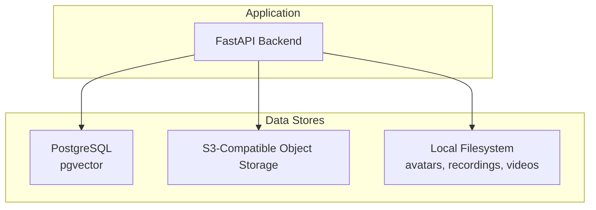
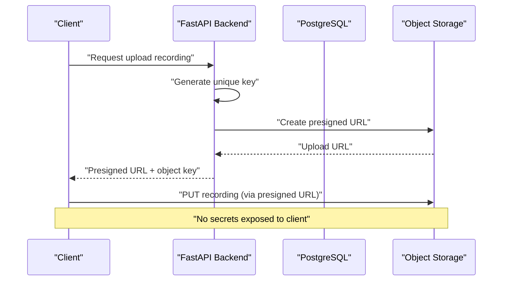
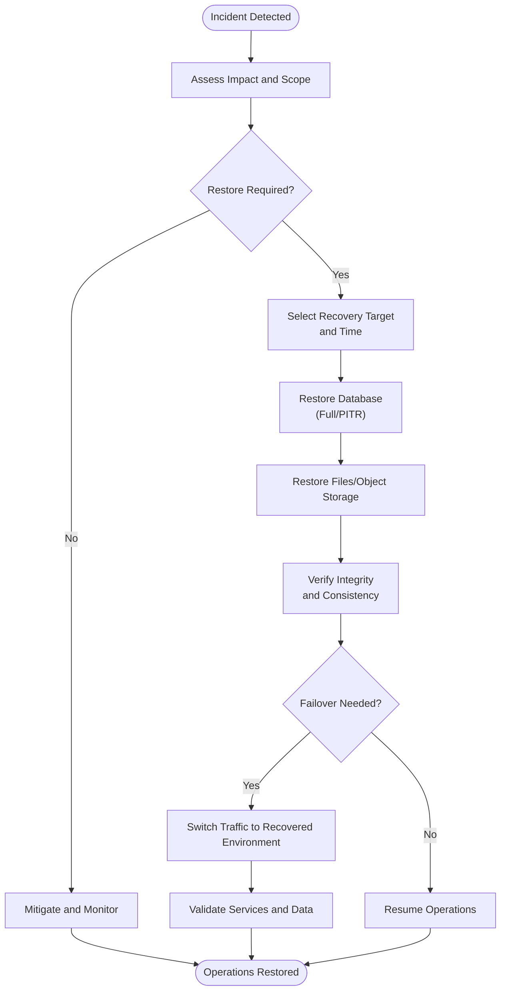
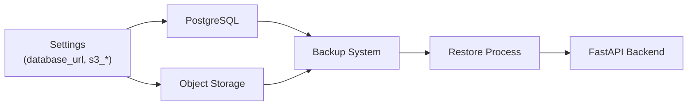

# Backup & Disaster Recovery

<cite>
**Referenced Files in This Document**
- [database.py](file://Backend/app/db/database.py)
- [config.py](file://Backend/app/core/config.py)
- [storage.py](file://Backend/app/services/storage.py)
- [storage API](file://Backend/app/api/v1/storage.py)
- [docker-compose.yml](file://infrastructure/local/docker-compose.yml)
- [architecture.md](file://architecture.md)
- [phases.md](file://phases.md)
- [rules.md](file://rules.md)
- [health endpoints](file://Backend/app/api/health.py)
</cite>

## Table of Contents
1. Introduction
2. Project Structure
3. Core Components
4. Architecture Overview
5. Detailed Component Analysis
6. Dependency Analysis
7. Performance Considerations
8. Troubleshooting Guide
9. Conclusion
10. Appendices

## Introduction
This document defines the backup and disaster recovery strategy for the ATS system, covering database backups, file/object storage backups, data consistency checks, disaster recovery procedures, failover mechanisms, service restoration, verification and testing, RTO/RPO targets, and security controls for backup data. It is grounded in the current codebase and infrastructure artifacts and provides actionable guidance for operators and platform teams.

## Project Structure
The ATS system persists transactional data to PostgreSQL (or SQLite in development), stores large objects (recordings, transcripts, resumes) in S3-compatible object storage via signed URLs, and uses local directories for auxiliary files. The local Docker Compose configuration provisions a pgvector-enabled PostgreSQL instance with a persistent volume.

**Diagram sources**
- [docker-compose.yml:4-23](file://infrastructure/local/docker-compose.yml#L4-L23)
- [storage.py:10-60](file://Backend/app/services/storage.py#L10-L60)
- [config.py:54-59](file://Backend/app/core/config.py#L54-L59)

**Section sources**
- [docker-compose.yml:4-23](file://infrastructure/local/docker-compose.yml#L4-L23)
- [architecture.md:64-73](file://architecture.md#L64-L73)

## Core Components
- Database layer: Supports PostgreSQL or SQLite; schema and migrations are applied at connection time. PostgreSQL is recommended for production.
- Object storage: S3-compatible client configured via settings; uploads use presigned URLs for secure, short-lived access.
- Local filesystem: Used for avatars, recordings, and videos; backed by application config paths.
- Health endpoints: Liveness/readiness probes to support orchestration and monitoring.

Key responsibilities for backup and DR:
- Ensure PostgreSQL backups capture consistent snapshots and WALs for point-in-time recovery.
- Back up S3 buckets with versioning and cross-region replication.
- Back up local filesystem directories referenced by configuration.
- Validate integrity of backups and test restore procedures regularly.
- Define and enforce RTO/RPO targets aligned with business needs.

**Section sources**
- [database.py:1-9](file://Backend/app/db/database.py#L1-L9)
- [config.py:35-39](file://Backend/app/core/config.py#L35-L39)
- [config.py:54-59](file://Backend/app/core/config.py#L54-L59)
- [config.py:118-120](file://Backend/app/core/config.py#L118-L120)
- [health endpoints:14-21](file://Backend/app/api/health.py#L14-L21)

## Architecture Overview
The ATS system relies on three primary data planes:
- Transactional data in PostgreSQL (recommended) with optional pgvector extension.
- Large binary assets in S3-compatible object storage using presigned URLs for secure uploads/downloads.
- Local files for intermediate artifacts such as recordings and avatars.

**Diagram sources**
- [storage API:18-38](file://Backend/app/api/v1/storage.py#L18-L38)
- [storage.py:23-45](file://Backend/app/services/storage.py#L23-L45)

**Section sources**
- [architecture.md:64-73](file://architecture.md#L64-L73)
- [rules.md:50-68](file://rules.md#L50-L68)

## Detailed Component Analysis

### Database Backup Strategy (PostgreSQL)
- Use native PostgreSQL tools (e.g., pg_basebackup, logical dumps, or managed service snapshots) to perform regular full backups.
- Enable continuous archiving of WAL segments to support point-in-time recovery (PITR).
- Store backups in a separate, secure location with encryption at rest and in transit.
- Retain backups according to compliance and retention policies; archive older backups to cold storage.
- For development/testing, SQLite mode exists but is not recommended for production due to limited durability and backup tooling.

Operational notes from code:
- The application connects to PostgreSQL when a database URL is provided; otherwise falls back to SQLite.
- Schema initialization and migrations run on first connection.

Recommended practices:
- Schedule daily full backups and frequent WAL archiving (e.g., every 5–15 minutes).
- Test PITR restores to a non-production environment regularly.
- Monitor backup success/failure and alert on anomalies.

**Section sources**
- [config.py:35-39](file://Backend/app/core/config.py#L35-L39)
- [database.py:476-516](file://Backend/app/db/database.py#L476-L516)

### Database Point-in-Time Recovery (PITR)
- Configure WAL archiving to a durable, encrypted store.
- Maintain a base backup and all subsequent WAL segments.
- To recover to a specific timestamp:
  - Restore the latest base backup.
  - Replay WAL segments up to the target time.
  - Verify data integrity and application connectivity.
- Validate restored databases with checksums and sample queries.

**Section sources**
- [database.py:476-516](file://Backend/app/db/database.py#L476-L516)

### Data Archival Policies
- Define retention windows for active vs. archived data based on legal and business requirements.
- Move older records to archival storage (e.g., cold S3 tier or offline media) while preserving referential integrity.
- Keep audit records and outbox events per policy; ensure they remain queryable for compliance.
- Implement automated jobs to transition data to archival tiers and purge expired data.

Note: The codebase includes tables for audit records and outbox events that should be included in backup scope.

**Section sources**
- [database.py:254-288](file://Backend/app/db/database.py#L254-L288)
- [phases.md:158-176](file://phases.md#L158-L176)

### File Storage Backup Procedures
- Back up local directories used by the application:
  - Avatars directory
  - Recordings directory
  - Videos directory
- Use incremental backups to minimize storage and bandwidth.
- Encrypt backups and store them offsite.
- If possible, migrate these files to object storage for centralized management and replication.

Configuration references:
- Paths are defined in application settings and should be included in backup manifests.

**Section sources**
- [config.py:51-52](file://Backend/app/core/config.py#L51-L52)
- [config.py:118-120](file://Backend/app/core/config.py#L118-L120)

### Object Storage Replication and Consistency
- Enable bucket versioning to protect against accidental deletions and corruption.
- Configure cross-region replication to meet geographic resilience goals.
- Use server-side encryption for objects at rest and enforce TLS in transit.
- Periodically run integrity checks (e.g., checksum validation, metadata audits) to detect drift.
- Enforce content-type and size limits on uploads; scan for malware before accepting objects.

Integration points:
- Presigned URLs provide secure, short-lived upload access without exposing credentials.
- Settings define endpoint, region, and bucket name.

**Section sources**
- [storage.py:10-60](file://Backend/app/services/storage.py#L10-L60)
- [storage API:18-38](file://Backend/app/api/v1/storage.py#L18-L38)
- [config.py:54-59](file://Backend/app/core/config.py#L54-L59)
- [rules.md:50-68](file://rules.md#L50-L68)

### Disaster Recovery Procedures
- Define roles and responsibilities for incident response and recovery.
- Maintain an up-to-date runbook with step-by-step instructions for restoring each component:
  - Database restore (full and PITR)
  - Object storage restoration (bucket-level or selective)
  - Local file restoration
  - Service restart and health verification
- Practice failover drills regularly and update procedures based on lessons learned.

Recovery workflow overview:

[No sources needed since this diagram shows conceptual workflow, not actual code structure]

### Failover Mechanisms
- Use load balancers and multi-AZ deployments to route traffic to healthy instances.
- Configure database read replicas and automatic failover where supported by the managed service.
- Ensure DNS/TTL strategies allow quick re-routing during failover.
- Validate that object storage is accessible across regions if replicated.

[No sources needed since this section provides general guidance]

### Service Restoration Processes
- After restoring data, start services and verify health endpoints respond correctly.
- Run smoke tests to confirm critical flows (authentication, storage uploads, database reads/writes).
- Monitor logs and metrics for errors post-restoration.

Health endpoints:
- Liveness and readiness probes are available for orchestration integration.

**Section sources**
- [health endpoints:14-21](file://Backend/app/api/health.py#L14-L21)

### Backup Verification and Recovery Testing
- Perform periodic restore tests to a staging environment.
- Validate data integrity using checksums and sample queries.
- Measure recovery times and compare against RTO/RPO targets.
- Document results and remediate any gaps.

**Section sources**
- [phases.md:158-176](file://phases.md#L158-L176)

### RTO and RPO Definitions and Implementation
- RTO (Recovery Time Objective): Maximum acceptable downtime. Achieved by minimizing restore time through efficient backups, parallel restores, and pre-provisioned environments.
- RPO (Recovery Point Objective): Maximum acceptable data loss measured in time. Achieved by frequent backups and WAL archiving intervals.

Implementation strategies:
- Tune backup frequency and retention to meet RPO.
- Optimize restore processes and infrastructure to meet RTO.
- Automate recovery workflows and validate with drills.

**Section sources**
- [phases.md:158-176](file://phases.md#L158-L176)

### Backup Encryption, Secure Storage, and Access Controls
- Encrypt backups at rest using strong algorithms and manage keys securely.
- Store backups in isolated, access-controlled repositories with least privilege.
- Restrict access to backup data to authorized personnel and systems only.
- Audit access to backup repositories and log all operations.
- Enforce secure transfer (TLS) for backup ingestion and retrieval.

Security rules alignment:
- Secrets must never be committed or embedded in client code.
- Object storage access must use signed, short-lived URLs.

**Section sources**
- [rules.md:50-68](file://rules.md#L50-L68)

## Dependency Analysis
The backup and recovery strategy depends on:
- PostgreSQL configuration and WAL archiving capabilities.
- S3-compatible object storage features (versioning, replication, encryption).
- Application configuration for storage paths and endpoints.
- Health endpoints for orchestration and monitoring.

**Diagram sources**
- [config.py:35-39](file://Backend/app/core/config.py#L35-L39)
- [config.py:54-59](file://Backend/app/core/config.py#L54-L59)
- [docker-compose.yml:4-23](file://infrastructure/local/docker-compose.yml#L4-L23)

**Section sources**
- [config.py:35-39](file://Backend/app/core/config.py#L35-L39)
- [config.py:54-59](file://Backend/app/core/config.py#L54-L59)
- [docker-compose.yml:4-23](file://infrastructure/local/docker-compose.yml#L4-L23)

## Performance Considerations
- Schedule backups during low-traffic windows to reduce impact.
- Use incremental backups and compression to minimize storage and network usage.
- Parallelize restore operations where supported.
- Monitor database and storage performance during backups and restores; adjust resources accordingly.
- Avoid running heavy backup jobs on the same host as production workloads unless properly isolated.

[No sources needed since this section provides general guidance]

## Troubleshooting Guide
Common issues and mitigations:
- S3 client not configured: Ensure endpoint, access key, secret key, and bucket name are set; verify network access and permissions.
- Presigned URL generation failures: Check S3 client configuration and bucket policies; review error logs.
- Database connectivity issues: Validate database URL, credentials, and network; use readiness probes to detect unavailability.
- Backup failures: Inspect backup logs, disk space, and network connectivity; retry with exponential backoff.

Verification steps:
- Confirm health endpoints return expected responses.
- Validate object storage uploads via presigned URLs.
- Run sample queries against restored databases to ensure integrity.

**Section sources**
- [storage.py:10-60](file://Backend/app/services/storage.py#L10-L60)
- [storage API:18-38](file://Backend/app/api/v1/storage.py#L18-L38)
- [health endpoints:14-21](file://Backend/app/api/health.py#L14-L21)

## Conclusion
A robust backup and disaster recovery strategy for the ATS system combines reliable database backups with WAL-based PITR, secure object storage with versioning and replication, and disciplined local file backups. Regular verification, recovery testing, and clear RTO/RPO targets ensure operational resilience. Security controls—encryption, access restrictions, and signed URLs—protect backup data and sensitive assets throughout their lifecycle.

## Appendices

### Configuration Reference for Backup Scope
- Database URL and path: Determines whether PostgreSQL or SQLite is used.
- Object storage settings: Endpoint, region, bucket name, and credentials.
- Local directories: Avatars, recordings, and videos paths.

**Section sources**
- [config.py:35-39](file://Backend/app/core/config.py#L35-L39)
- [config.py:54-59](file://Backend/app/core/config.py#L54-L59)
- [config.py:118-120](file://Backend/app/core/config.py#L118-L120)

### Infrastructure Notes
- PostgreSQL is provisioned with pgvector for embedding similarity search.
- Persistent volumes are used to retain database state across container restarts.

**Section sources**
- [docker-compose.yml:4-23](file://infrastructure/local/docker-compose.yml#L4-L23)