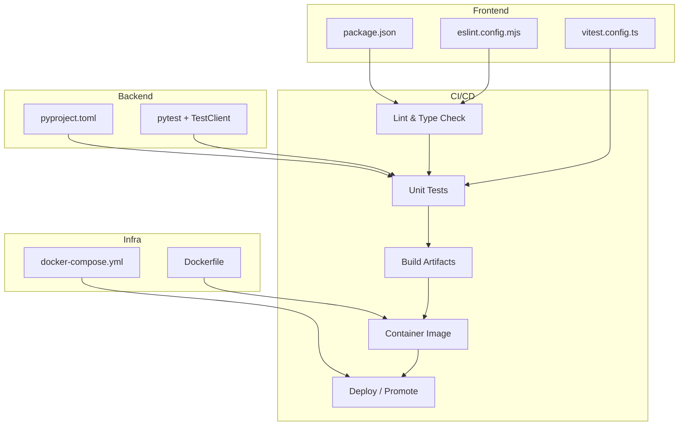
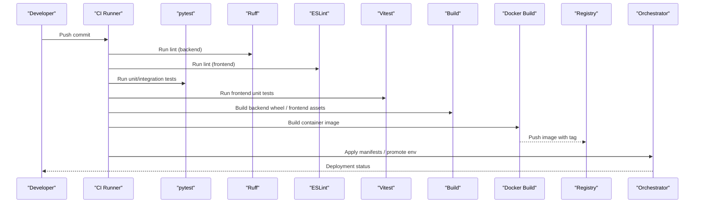
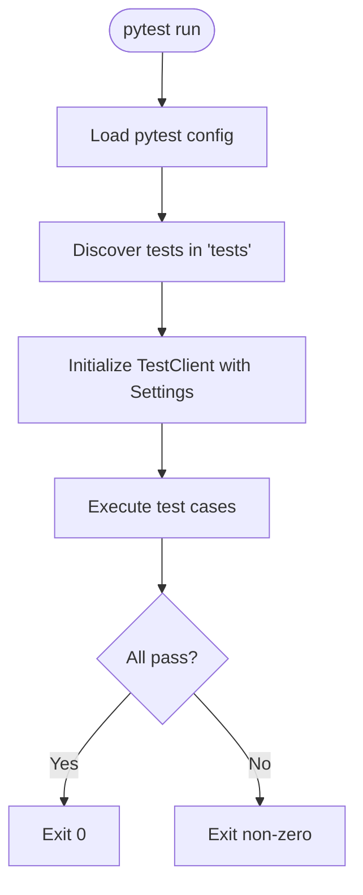
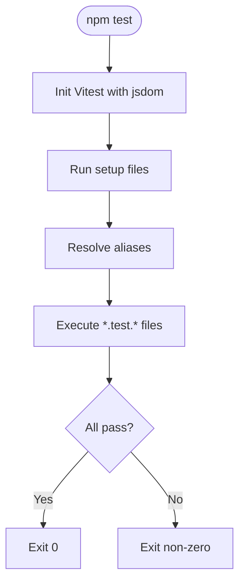
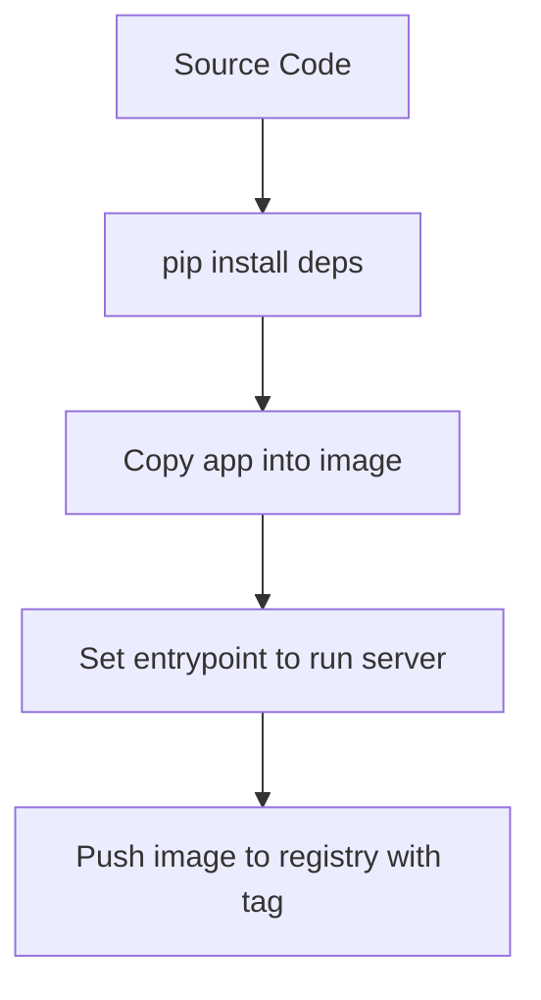
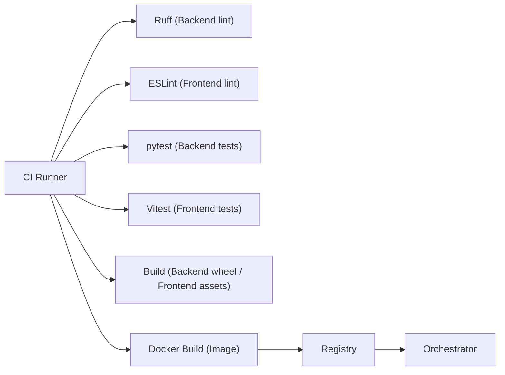

# CI/CD Pipeline

<cite>
**Referenced Files in This Document**
- [Backend/pyproject.toml](file://Backend/pyproject.toml)
- [Backend/tests/conftest.py](file://Backend/tests/conftest.py)
- [Frontend/package.json](file://Frontend/package.json)
- [Frontend/vitest.config.ts](file://Frontend/vitest.config.ts)
- [Frontend/eslint.config.mjs](file://Frontend/eslint.config.mjs)
- [pts/backend/Dockerfile](file://pts/backend/Dockerfile)
- [infrastructure/local/docker-compose.yml](file://infrastructure/local/docker-compose.yml)
</cite>

## Table of Contents
1. Introduction
2. Project Structure
3. Core Components
4. Architecture Overview
5. Detailed Component Analysis
6. Dependency Analysis
7. Performance Considerations
8. Troubleshooting Guide
9. Conclusion

## Introduction
This document defines the CI/CD pipeline for the ATS system, covering automated testing (unit and integration), code quality checks, build processes for backend and frontend, artifact generation, version management, deployment automation strategies, container image building, registry management, orchestration, environment promotion, rollback procedures, caching, parallel execution optimization, and troubleshooting guidance. It is based on the repository’s configuration and scripts to ensure accuracy and reproducibility.

## Project Structure
The ATS system comprises:
- Backend (Python/FastAPI) with tests and linting configured via pyproject.toml
- Frontend (Next.js) with unit tests, type checking, and linting configured via package.json and related configs
- A sample backend Dockerfile for containerization
- Local infrastructure using Docker Compose for Postgres

**Diagram sources**
- [Backend/pyproject.toml:1-56](file://Backend/pyproject.toml#L1-L56)
- [Frontend/package.json:1-36](file://Frontend/package.json#L1-L36)
- [Frontend/eslint.config.mjs:1-15](file://Frontend/eslint.config.mjs#L1-L15)
- [Frontend/vitest.config.ts:1-17](file://Frontend/vitest.config.ts#L1-L17)
- [pts/backend/Dockerfile:1-21](file://pts/backend/Dockerfile#L1-L21)
- [infrastructure/local/docker-compose.yml:1-24](file://infrastructure/local/docker-compose.yml#L1-L24)

**Section sources**
- [Backend/pyproject.toml:1-56](file://Backend/pyproject.toml#L1-L56)
- [Frontend/package.json:1-36](file://Frontend/package.json#L1-L36)
- [Frontend/eslint.config.mjs:1-15](file://Frontend/eslint.config.mjs#L1-L15)
- [Frontend/vitest.config.ts:1-17](file://Frontend/vitest.config.ts#L1-L17)
- [pts/backend/Dockerfile:1-21](file://pts/backend/Dockerfile#L1-L21)
- [infrastructure/local/docker-compose.yml:1-24](file://infrastructure/local/docker-compose.yml#L1-L24)

## Core Components
- Backend test harness and configuration:
  - pytest discovery and options are defined in the project configuration file
  - Ruff linter rules and target Python version are set in the same file
- Frontend toolchain:
  - Scripts for development, build, lint, typecheck, and tests are defined in the package manifest
  - ESLint configuration extends Next.js recommended rules and ignores generated artifacts
  - Vitest is configured for jsdom environment with a setup file and alias resolution
- Containerization:
  - A minimal Python runtime image installs dependencies from requirements and runs the server
- Local infrastructure:
  - Docker Compose defines a Postgres service with health checks and persistent volume

**Section sources**
- [Backend/pyproject.toml:35-56](file://Backend/pyproject.toml#L35-L56)
- [Backend/pyproject.toml:45-48](file://Backend/pyproject.toml#L45-L48)
- [Frontend/package.json:5-12](file://Frontend/package.json#L5-L12)
- [Frontend/eslint.config.mjs:9-12](file://Frontend/eslint.config.mjs#L9-L12)
- [Frontend/vitest.config.ts:4-15](file://Frontend/vitest.config.ts#L4-L15)
- [pts/backend/Dockerfile:1-21](file://pts/backend/Dockerfile#L1-L21)
- [infrastructure/local/docker-compose.yml:3-20](file://infrastructure/local/docker-compose.yml#L3-L20)

## Architecture Overview
The CI/CD pipeline stages map directly to the repository’s tooling:

**Diagram sources**
- [Backend/pyproject.toml:35-56](file://Backend/pyproject.toml#L35-L56)
- [Frontend/package.json:5-12](file://Frontend/package.json#L5-L12)
- [Frontend/eslint.config.mjs:9-12](file://Frontend/eslint.config.mjs#L9-L12)
- [Frontend/vitest.config.ts:4-15](file://Frontend/vitest.config.ts#L4-L15)
- [pts/backend/Dockerfile:1-21](file://pts/backend/Dockerfile#L1-L21)

## Detailed Component Analysis

### Backend Testing and Quality
- Unit and integration tests:
  - pytest discovers tests under the tests directory and uses quiet output mode
  - The test client initializes the FastAPI app with isolated settings, including SQLite for DB isolation and disabled external services
- Linting:
  - Ruff enforces style and safety rules targeting Python 3.13 with a line length of 100

**Diagram sources**
- [Backend/pyproject.toml:45-48](file://Backend/pyproject.toml#L45-L48)
- [Backend/tests/conftest.py:14-45](file://Backend/tests/conftest.py#L14-L45)

**Section sources**
- [Backend/pyproject.toml:45-56](file://Backend/pyproject.toml#L45-L56)
- [Backend/tests/conftest.py:14-45](file://Backend/tests/conftest.py#L14-L45)

### Frontend Testing and Quality
- Linting and type checking:
  - ESLint extends Next.js recommended configurations and ignores build artifacts
  - TypeScript type checking is available via a dedicated script
- Unit tests:
  - Vitest runs in a jsdom environment with a setup file and path aliases configured

**Diagram sources**
- [Frontend/vitest.config.ts:4-15](file://Frontend/vitest.config.ts#L4-L15)
- [Frontend/package.json:5-12](file://Frontend/package.json#L5-L12)

**Section sources**
- [Frontend/package.json:5-12](file://Frontend/package.json#L5-L12)
- [Frontend/eslint.config.mjs:9-12](file://Frontend/eslint.config.mjs#L9-L12)
- [Frontend/vitest.config.ts:4-15](file://Frontend/vitest.config.ts#L4-L15)

### Build Processes and Artifact Generation
- Backend:
  - Packaging is configured to produce a wheel containing the application package
  - Dependencies are declared in the project manifest; dev dependencies include test and lint tools
- Frontend:
  - Build script invokes the framework’s production build to generate optimized static assets
  - Lint and typecheck scripts can be executed independently or as part of CI gates

**Section sources**
- [Backend/pyproject.toml:1-10](file://Backend/pyproject.toml#L1-L10)
- [Backend/pyproject.toml:35-43](file://Backend/pyproject.toml#L35-L43)
- [Frontend/package.json:5-12](file://Frontend/package.json#L5-L12)

### Container Image Building and Registry Management
- Image definition:
  - Uses a slim Python base image, creates a virtual environment, installs dependencies from requirements, copies source, and runs the server on a fixed host/port
- Registry strategy:
  - Tag images with semantic versions or branch names; push to a secure registry and reference tags in deployment manifests

**Diagram sources**
- [pts/backend/Dockerfile:1-21](file://pts/backend/Dockerfile#L1-L21)

**Section sources**
- [pts/backend/Dockerfile:1-21](file://pts/backend/Dockerfile#L1-L21)

### Deployment Orchestration and Environment Promotion
- Local environment:
  - Docker Compose provisions Postgres with health checks and persistent data volumes for local development and CI database-backed tests
- Promotion workflow:
  - Promote images by updating environment-specific manifests or values and applying them via your orchestrator
  - Use immutable tags per environment to ensure traceability

**Section sources**
- [infrastructure/local/docker-compose.yml:3-20](file://infrastructure/local/docker-compose.yml#L3-L20)

### Version Management
- Backend version:
  - Defined in the project manifest; increment according to your release policy
- Frontend version:
  - Defined in the package manifest; increment alongside backend releases when needed
- Tags:
  - Align container image tags with backend/frontend versions for consistent rollouts

**Section sources**
- [Backend/pyproject.toml:5-8](file://Backend/pyproject.toml#L5-L8)
- [Frontend/package.json:1-4](file://Frontend/package.json#L1-L4)

## Dependency Analysis
The CI/CD pipeline depends on the following components and their relationships:

**Diagram sources**
- [Backend/pyproject.toml:35-56](file://Backend/pyproject.toml#L35-L56)
- [Frontend/package.json:5-12](file://Frontend/package.json#L5-L12)
- [Frontend/eslint.config.mjs:9-12](file://Frontend/eslint.config.mjs#L9-L12)
- [Frontend/vitest.config.ts:4-15](file://Frontend/vitest.config.ts#L4-L15)
- [pts/backend/Dockerfile:1-21](file://pts/backend/Dockerfile#L1-L21)

**Section sources**
- [Backend/pyproject.toml:35-56](file://Backend/pyproject.toml#L35-L56)
- [Frontend/package.json:5-12](file://Frontend/package.json#L5-L12)
- [Frontend/eslint.config.mjs:9-12](file://Frontend/eslint.config.mjs#L9-L12)
- [Frontend/vitest.config.ts:4-15](file://Frontend/vitest.config.ts#L4-L15)
- [pts/backend/Dockerfile:1-21](file://pts/backend/Dockerfile#L1-L21)

## Performance Considerations
- Parallel execution:
  - Run backend and frontend lint/test jobs concurrently
  - Within each job, leverage parallel test runners where supported
- Caching:
  - Cache Python dependency wheels and Node modules between runs
  - Cache build outputs (e.g., .next) to speed up subsequent builds
- Image builds:
  - Layer dependencies before copying source to maximize cache hits
  - Use multi-stage builds if applicable to reduce final image size
- Database-backed tests:
  - Reuse a shared Postgres instance in CI and reset state between suites
  - Prefer in-memory or temporary databases where possible to reduce startup time

[No sources needed since this section provides general guidance]

## Troubleshooting Guide
Common issues and resolutions:
- Lint failures:
  - Backend: Ensure Ruff rules align with team standards; fix reported violations
  - Frontend: Update ESLint config or ignore patterns if necessary
- Test failures:
  - Backend: Verify test client initialization and that external services are mocked/disabled in tests
  - Frontend: Confirm jsdom environment and setup files load correctly
- Build errors:
  - Backend: Validate dependency versions and Python version constraints
  - Frontend: Ensure all required scripts exist and dependencies are installed
- Container build:
  - Confirm base image compatibility and that requirements are present and resolvable
  - Validate entrypoint command and exposed ports
- Local environment:
  - Ensure Postgres service is healthy and reachable; check volume permissions

**Section sources**
- [Backend/pyproject.toml:35-56](file://Backend/pyproject.toml#L35-L56)
- [Backend/tests/conftest.py:14-45](file://Backend/tests/conftest.py#L14-L45)
- [Frontend/package.json:5-12](file://Frontend/package.json#L5-L12)
- [Frontend/eslint.config.mjs:9-12](file://Frontend/eslint.config.mjs#L9-L12)
- [Frontend/vitest.config.ts:4-15](file://Frontend/vitest.config.ts#L4-L15)
- [pts/backend/Dockerfile:1-21](file://pts/backend/Dockerfile#L1-L21)
- [infrastructure/local/docker-compose.yml:3-20](file://infrastructure/local/docker-compose.yml#L3-L20)

## Conclusion
The ATS CI/CD pipeline integrates backend and frontend tooling to enforce quality, validate functionality through tests, and produce reproducible artifacts. By leveraging caching, parallelism, and immutable container images tagged with versions, teams can achieve fast, reliable builds and safe deployments across environments. Use the provided configurations as the single source of truth for pipeline behavior and extend them with your platform’s orchestration and registry integrations.