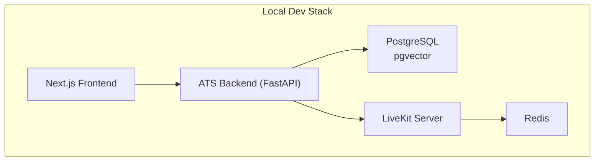
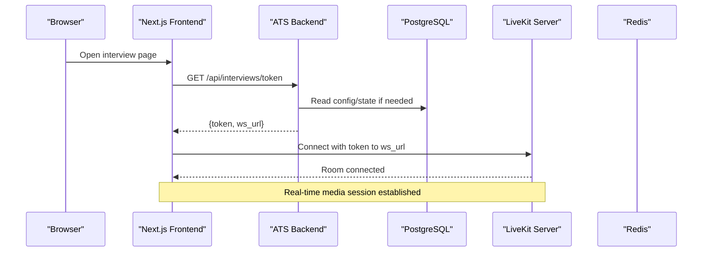
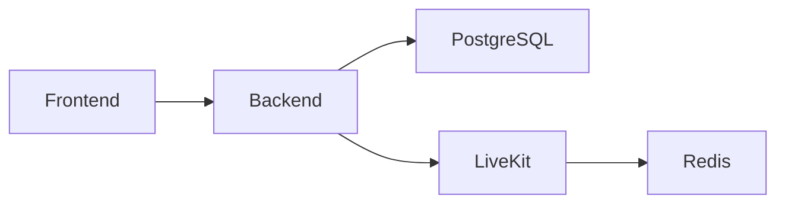

# Containerization & Docker

<cite>
**Referenced Files in This Document**
- [docker-compose.yml](file://infrastructure/local/docker-compose.yml)
- [livekit-docker-compose.yml](file://livekit-docker-compose.yml)
- [Dockerfile](file://pts/backend/Dockerfile)
- [config.py](file://Backend/app/core/config.py)
- [health.py](file://Backend/app/api/health.py)
- [main.py](file://Backend/app/main.py)
- [database.py](file://Backend/app/db/database.py)
- [livekit.py](file://Backend/app/services/livekit.py)
- [LiveKitRoomWrapper.tsx](file://Frontend/components/interviews/voice/LiveKitRoomWrapper.tsx)
- [package.json](file://Frontend/package.json)
- [README.md](file://infrastructure/local/README.md)
</cite>

## Table of Contents
1. Introduction
2. Project Structure
3. Core Components
4. Architecture Overview
5. Detailed Component Analysis
6. Dependency Analysis
7. Performance Considerations
8. Troubleshooting Guide
9. Conclusion
10. Appendices

## Introduction
This document provides comprehensive containerization guidance for the ATS system, focusing on local development with Docker Compose and production-oriented build practices. It covers:
- Local stack orchestration using PostgreSQL (with pgvector), LiveKit, and application services
- Multi-stage builds and environment configuration for optimized images
- Service dependencies, networking, volumes, and health checks
- Debugging techniques, resource strategies, and scaling considerations

## Project Structure
The repository includes:
- A local Postgres service definition for development
- A separate LiveKit + Redis compose file for voice interview capabilities
- A backend Python application with a Dockerfile suitable for containerized runs
- Frontend Next.js application that connects to LiveKit via tokens issued by the backend

**Diagram sources**
- [docker-compose.yml:3-20](file://infrastructure/local/docker-compose.yml#L3-L20)
- [livekit-docker-compose.yml:3-26](file://livekit-docker-compose.yml#L3-L26)
- [Dockerfile:1-21](file://pts/backend/Dockerfile#L1-L21)
- [package.json:5-11](file://Frontend/package.json#L5-L11)

**Section sources**
- [docker-compose.yml:1-24](file://infrastructure/local/docker-compose.yml#L1-L24)
- [livekit-docker-compose.yml:1-27](file://livekit-docker-compose.yml#L1-L27)
- [Dockerfile:1-21](file://pts/backend/Dockerfile#L1-L21)
- [package.json:1-36](file://Frontend/package.json#L1-L36)

## Core Components
- PostgreSQL service with pgvector extension for embeddings and similarity search
- LiveKit server for real-time audio/video interviews backed by Redis
- Backend FastAPI service exposing REST APIs and health endpoints
- Frontend Next.js app that obtains LiveKit tokens from the backend and joins rooms

Key responsibilities:
- Orchestrate services and expose necessary ports
- Persist database data across runs
- Provide health endpoints for liveness/readiness probes
- Configure environment variables for DB, LiveKit, and integrations

**Section sources**
- [docker-compose.yml:3-20](file://infrastructure/local/docker-compose.yml#L3-L20)
- [livekit-docker-compose.yml:3-26](file://livekit-docker-compose.yml#L3-L26)
- [health.py:1-21](file://Backend/app/api/health.py#L1-L21)
- [config.py:16-178](file://Backend/app/core/config.py#L16-L178)

## Architecture Overview
The runtime architecture connects the frontend to the backend, which interacts with PostgreSQL and LiveKit. The frontend requests a LiveKit token from the backend before joining a room.

**Diagram sources**
- [LiveKitRoomWrapper.tsx:38-91](file://Frontend/components/interviews/voice/LiveKitRoomWrapper.tsx#L38-L91)
- [livekit.py:10-38](file://Backend/app/services/livekit.py#L10-L38)
- [livekit-docker-compose.yml:10-26](file://livekit-docker-compose.yml#L10-L26)

## Detailed Component Analysis

### PostgreSQL Service (Local Development)
- Image: pgvector-enabled Postgres 17
- Environment: user, password, database name
- Ports: 5432 exposed to host
- Volumes: named volume for persistence
- Healthcheck: uses pg_isready to detect readiness

Operational notes:
- Use the provided connection string pattern when configuring the backend
- Ensure the named volume is retained across restarts to persist data

**Section sources**
- [docker-compose.yml:3-20](file://infrastructure/local/docker-compose.yml#L3-L20)
- [README.md:1-10](file://infrastructure/local/README.md#L1-L10)

### LiveKit and Redis Services
- Redis image used as message bus for LiveKit
- LiveKit server configured with keys and Redis host
- Ports: HTTP/WebSocket and UDP/TCP media ports exposed
- Dependencies: LiveKit depends on Redis

Operational notes:
- Keys must be at least 32 characters; ensure they are set securely
- Media ports (UDP/TCP) must be reachable for real-time sessions

**Section sources**
- [livekit-docker-compose.yml:3-26](file://livekit-docker-compose.yml#L3-L26)

### Backend Application Container
- Base image: slim Python runtime
- Virtual environment setup and dependency installation
- Working directory and logs directory creation
- Command: Uvicorn serving FastAPI on 0.0.0.0:8000

Build recommendations:
- Use multi-stage builds to separate dependency resolution and runtime layers
- Cache pip install steps between stages to speed up rebuilds
- Copy only required files into the final stage

Runtime configuration:
- Settings loaded from environment variables with optional .env file
- Supports both SQLite and PostgreSQL backends; prefer PostgreSQL in containers
- Validates sensitive settings in non-development modes

Health endpoints:
- /health/live returns liveness status
- /health/ready returns readiness status

**Section sources**
- [Dockerfile:1-21](file://pts/backend/Dockerfile#L1-L21)
- [config.py:16-178](file://Backend/app/core/config.py#L16-L178)
- [health.py:1-21](file://Backend/app/api/health.py#L1-L21)
- [main.py:38-61](file://Backend/app/main.py#L38-L61)

### Database Layer and pgvector
- Detects PostgreSQL vs SQLite based on configuration
- Applies schema and migrations on first connect
- Enables pgvector extension for vector operations when using PostgreSQL

Container implications:
- Ensure the database URL points to the Postgres service in the same network
- Allow sufficient startup time for schema initialization

**Section sources**
- [database.py:369-516](file://Backend/app/db/database.py#L369-L516)

### LiveKit Token Issuance and Frontend Integration
- Backend issues short-lived tokens with grants to join specific rooms
- Frontend fetches token and WebSocket URL, then connects to LiveKit

Security considerations:
- Validate identity and room access on the backend before issuing tokens
- Keep LiveKit credentials out of client-side code

**Section sources**
- [livekit.py:10-38](file://Backend/app/services/livekit.py#L10-L38)
- [LiveKitRoomWrapper.tsx:38-91](file://Frontend/components/interviews/voice/LiveKitRoomWrapper.tsx#L38-L91)

## Dependency Analysis
Service-level dependencies:
- Backend depends on PostgreSQL and optionally LiveKit
- LiveKit depends on Redis
- Frontend depends on Backend (for tokens) and LiveKit (for media)

**Diagram sources**
- [docker-compose.yml:3-20](file://infrastructure/local/docker-compose.yml#L3-L20)
- [livekit-docker-compose.yml:3-26](file://livekit-docker-compose.yml#L3-L26)
- [config.py:16-178](file://Backend/app/core/config.py#L16-L178)

**Section sources**
- [docker-compose.yml:3-20](file://infrastructure/local/docker-compose.yml#L3-L20)
- [livekit-docker-compose.yml:3-26](file://livekit-docker-compose.yml#L3-L26)
- [config.py:16-178](file://Backend/app/core/config.py#L16-L178)

## Performance Considerations
- Use a dedicated PostgreSQL instance in production; avoid shared databases
- Enable connection pooling for the database driver where applicable
- Tune LiveKit resources (CPU/memory) based on concurrent media sessions
- Set appropriate timeouts for AI providers and LiveKit token TTL
- Prefer stateless backend instances behind a reverse proxy or load balancer
- Use persistent volumes for PostgreSQL and any recorded media storage

[No sources needed since this section provides general guidance]

## Troubleshooting Guide
Common issues and resolutions:
- PostgreSQL not ready:
  - Verify health endpoint and port mapping
  - Check that the database URL matches the service name and credentials
  - Confirm pgvector extension availability
- LiveKit connection failures:
  - Ensure Redis is running and reachable
  - Validate LiveKit keys and CORS/network policies
  - Confirm media ports (UDP/TCP) are open
- Backend startup errors:
  - Inspect environment variables for missing secrets
  - Review validation errors for JWT, LiveKit, and database settings
  - Check logs for dependency connectivity failures
- Frontend cannot join room:
  - Confirm token issuance succeeds and ws_url is correct
  - Validate browser permissions and firewall rules for WebRTC

Debugging tips:
- Use health endpoints (/health/live, /health/ready) to verify service states
- Inspect container logs for each service
- Test connectivity from within the container network using curl or ping
- Reduce concurrency temporarily to isolate resource contention

**Section sources**
- [health.py:1-21](file://Backend/app/api/health.py#L1-L21)
- [database.py:369-516](file://Backend/app/db/database.py#L369-L516)
- [livekit-docker-compose.yml:10-26](file://livekit-docker-compose.yml#L10-L26)
- [config.py:16-178](file://Backend/app/core/config.py#L16-L178)

## Conclusion
The ATS system’s containerization leverages Docker Compose for local development with PostgreSQL (pgvector) and LiveKit, while the backend is packaged for containerized execution. Proper environment configuration, health checks, and persistent volumes ensure reliable operation. For production, adopt multi-stage builds, secure secret management, and scalable infrastructure patterns.

[No sources needed since this section summarizes without analyzing specific files]

## Appendices

### Environment Variables Reference
- PostgreSQL:
  - POSTGRES_USER, POSTGRES_PASSWORD, POSTGRES_DB (service-level)
  - THOS_DATABASE_URL (backend)
- LiveKit:
  - LIVEKIT_API_KEY, LIVEKIT_API_SECRET, LIVEKIT_URL (backend)
  - LiveKit server keys and Redis host (compose-level)
- Backend:
  - APP_NAME, APP_VERSION, ENVIRONMENT, DEBUG, CORS_ORIGINS
  - SMTP settings, S3 settings, JWT secrets, AI provider keys
  - Voice interview toggles and model parameters

Configuration behavior:
- Settings class loads values from environment and optional .env file
- Non-development mode enforces secure defaults and validates secrets
- Empty strings are treated as None for certain fields

**Section sources**
- [config.py:16-178](file://Backend/app/core/config.py#L16-L178)
- [docker-compose.yml:8-11](file://infrastructure/local/docker-compose.yml#L8-L11)
- [livekit-docker-compose.yml:12-18](file://livekit-docker-compose.yml#L12-L18)

### Volume Management
- PostgreSQL data stored in a named volume for persistence
- Optional directories for recordings/videos can be mounted as volumes
- Ensure backups and rotation policies for persistent data

**Section sources**
- [docker-compose.yml:14-20](file://infrastructure/local/docker-compose.yml#L14-L20)

### Health Checks and Probes
- PostgreSQL health check uses pg_isready
- Backend exposes /health/live and /health/ready
- Integrate these endpoints with orchestrators for liveness/readiness probes

**Section sources**
- [docker-compose.yml:16-20](file://infrastructure/local/docker-compose.yml#L16-L20)
- [health.py:14-21](file://Backend/app/api/health.py#L14-L21)

### Networking Notes
- Services communicate via Docker networks; use service names as hostnames
- Expose only necessary ports to the host
- For production, place a reverse proxy in front of the backend and configure TLS termination

[No sources needed since this section provides general guidance]

### Scaling Considerations
- Horizontal scaling: run multiple backend replicas behind a load balancer
- Statelessness: store session and media artifacts externally (e.g., object storage)
- Database scaling: consider read replicas and connection pooling
- LiveKit scaling: deploy multiple nodes with shared Redis and media routing

[No sources needed since this section provides general guidance]