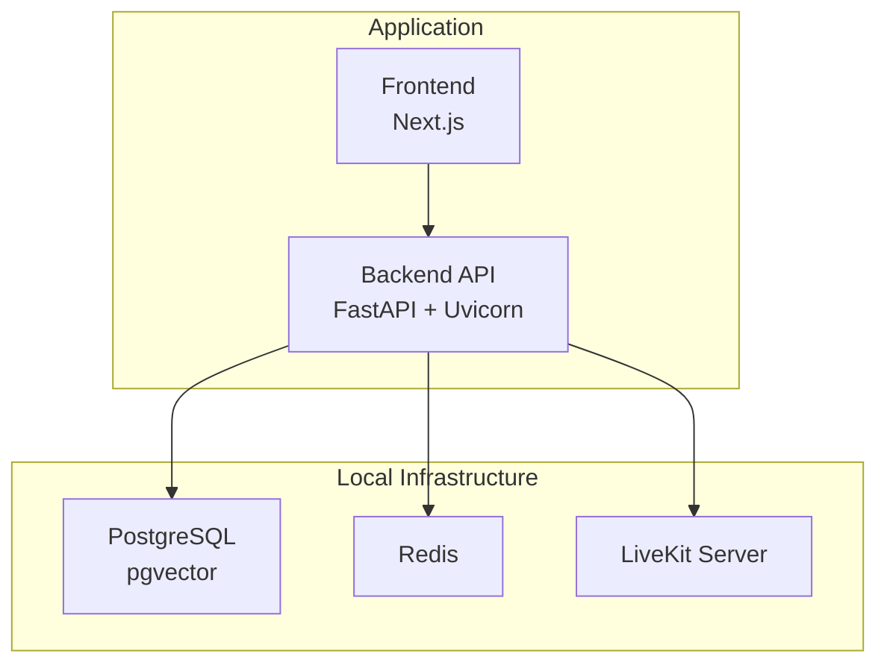
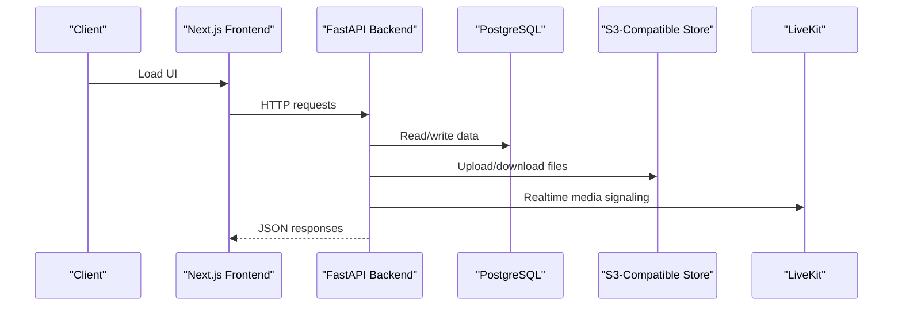
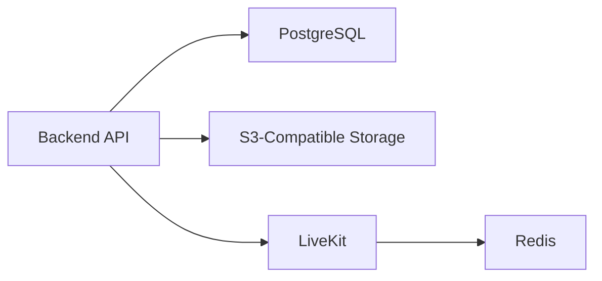

# Deployment & Operations

<cite>
**Referenced Files in This Document**
- [docker-compose.yml](file://infrastructure/local/docker-compose.yml)
- [livekit-docker-compose.yml](file://livekit-docker-compose.yml)
- [main.py](file://Backend/app/main.py)
- [config.py](file://Backend/app/core/config.py)
- [logging.py](file://Backend/app/logging.py)
- [database.py](file://Backend/app/db/database.py)
- [health.py](file://Backend/app/api/health.py)
- [request_id.py](file://Backend/app/middleware/request_id.py)
- [errors.py](file://Backend/app/core/errors.py)
- [storage.py](file://Backend/app/services/storage.py)
- [Dockerfile](file://pts/backend/Dockerfile)
- [package.json](file://Frontend/package.json)
- [next.config.ts](file://Frontend/next.config.ts)
- [pyproject.toml](file://Backend/pyproject.toml)
</cite>

## Table of Contents
1. Introduction
2. Project Structure
3. Core Components
4. Architecture Overview
5. Detailed Component Analysis
6. Dependency Analysis
7. Performance Considerations
8. Troubleshooting Guide
9. Conclusion
10. Appendices

## Introduction
This document provides deployment and operations guidance for the ATS system, focusing on containerization with Docker Compose, environment configuration and secrets management, service discovery patterns, monitoring and logging, scaling considerations, backup and disaster recovery, security hardening, CI/CD setup, and troubleshooting. It is grounded in the repository’s current configuration and code to ensure accuracy and actionability.

## Project Structure
The system comprises:
- Backend API (FastAPI) with configuration, database abstraction, middleware, health endpoints, and storage integration
- Frontend (Next.js) build and start scripts
- Local infrastructure definitions for Postgres and LiveKit
- A backend Dockerfile for containerized deployments

**Diagram sources**
- [docker-compose.yml:4-23](file://infrastructure/local/docker-compose.yml#L4-L23)
- [livekit-docker-compose.yml:3-26](file://livekit-docker-compose.yml#L3-L26)
- [Dockerfile:1-21](file://pts/backend/Dockerfile#L1-L21)
- [package.json:5-12](file://Frontend/package.json#L5-L12)

**Section sources**
- [docker-compose.yml:1-24](file://infrastructure/local/docker-compose.yml#L1-L24)
- [livekit-docker-compose.yml:1-27](file://livekit-docker-compose.yml#L1-L27)
- [Dockerfile:1-21](file://pts/backend/Dockerfile#L1-L21)
- [package.json:1-36](file://Frontend/package.json#L1-L36)

## Core Components
- Configuration and secrets: Centralized via Pydantic settings with environment variable prefixing and validation. Secrets are typed as SecretStr and validated at startup.
- Database layer: Supports PostgreSQL (with pgvector) or SQLite; schema applied on first connect; tenant-scoped design.
- Middleware: CORS and request correlation context propagation (X-Request-ID, X-Correlation-ID).
- Health endpoints: Liveness and readiness probes for orchestration.
- Storage adapter: S3-compatible object storage with presigned URLs.
- Logging: Standard library logger configured for console output; structured fields can be added by callers.

Key operational implications:
- Environment-driven behavior (development vs production) controls features like demo seeding and CORS policies.
- Service discovery is file-based via Docker Compose hostnames within the same network.
- Health endpoints enable Kubernetes or orchestrator health checks.

**Section sources**
- [config.py:16-215](file://Backend/app/core/config.py#L16-L215)
- [database.py:1-526](file://Backend/app/db/database.py#L1-L526)
- [request_id.py:16-55](file://Backend/app/middleware/request_id.py#L16-L55)
- [health.py:1-22](file://Backend/app/api/health.py#L1-L22)
- [storage.py:1-61](file://Backend/app/services/storage.py#L1-L61)
- [logging.py:1-37](file://Backend/app/logging.py#L1-L37)

## Architecture Overview
The runtime consists of a FastAPI application served by Uvicorn, backed by PostgreSQL (pgvector-enabled), optional Redis for LiveKit signaling, and an external S3-compatible store. The Next.js frontend builds statically and serves assets while calling the backend API.

**Diagram sources**
- [main.py:15-58](file://Backend/app/main.py#L15-L58)
- [database.py:476-516](file://Backend/app/db/database.py#L476-L516)
- [storage.py:10-61](file://Backend/app/services/storage.py#L10-L61)
- [livekit-docker-compose.yml:10-26](file://livekit-docker-compose.yml#L10-L26)

## Detailed Component Analysis

### Containerization Strategy
- Backend image: Python slim base, virtual environment, dependency install, app copy, and Uvicorn entrypoint.
- Local services: PostgreSQL with pgvector and persistent volume; LiveKit with Redis dependency.
- Frontend: Build and start scripts defined in package.json; Next.js static build suitable for containerization.

Operational notes:
- Use Docker Compose to co-locate services during development and staging.
- For production, consider separate images per service and a platform-native orchestrator (e.g., Kubernetes).

**Section sources**
- [Dockerfile:1-21](file://pts/backend/Dockerfile#L1-L21)
- [docker-compose.yml:4-23](file://infrastructure/local/docker-compose.yml#L4-L23)
- [livekit-docker-compose.yml:3-26](file://livekit-docker-compose.yml#L3-L26)
- [package.json:5-12](file://Frontend/package.json#L5-L12)

### Environment Configuration Management and Secrets
- Settings are loaded from environment variables prefixed with THOS_ and optionally from .env files.
- Secrets use SecretStr types and are validated at startup.
- Environment-specific behavior includes CORS restrictions and feature toggles.

Recommended practices:
- Provide all secrets via environment variables or a secrets manager; never commit secrets.
- Validate required secrets at startup using existing validators.

**Section sources**
- [config.py:16-215](file://Backend/app/core/config.py#L16-L215)

### Service Discovery Patterns
- Within Docker networks, services discover each other by service name (e.g., postgres, redis, livekit).
- The backend connects to Postgres and LiveKit using these hostnames.

Operational tip:
- Ensure all dependent services are started before the backend and that ports are correctly exposed within the compose network.

**Section sources**
- [docker-compose.yml:4-23](file://infrastructure/local/docker-compose.yml#L4-L23)
- [livekit-docker-compose.yml:3-26](file://livekit-docker-compose.yml#L3-L26)
- [database.py:476-516](file://Backend/app/db/database.py#L476-L516)

### Monitoring and Logging
- Health endpoints: /health/live and /health/ready for liveness/readiness checks.
- Request correlation: X-Request-ID and X-Correlation-ID propagated across requests and responses.
- Logging: Console-based logger configured; extend with structured fields and integrate with log aggregation in production.

Best practices:
- Configure orchestrators to probe /health/live and /health/ready.
- Add structured logging (JSON) and correlate logs with request IDs for tracing.

**Section sources**
- [health.py:1-22](file://Backend/app/api/health.py#L1-L22)
- [request_id.py:16-55](file://Backend/app/middleware/request_id.py#L16-L55)
- [logging.py:1-37](file://Backend/app/logging.py#L1-L37)

### Error Handling and Observability
- Centralized exception handlers produce consistent error responses including request_id.
- Validation errors return detailed messages for client feedback.

Operational impact:
- Use error codes and request_id to correlate issues in logs and metrics.

**Section sources**
- [errors.py:1-112](file://Backend/app/core/errors.py#L1-L112)

### Data Persistence and Optimization
- Database selection: PostgreSQL URL enables relational storage with pgvector; otherwise falls back to SQLite for local/dev.
- Schema initialization runs once per connection type; indexes created for performance-critical queries.

Optimization recommendations:
- Use PostgreSQL for production; tune connection pools and query plans.
- Enable pgvector for similarity search where applicable.
- Back up databases regularly and test restore procedures.

**Section sources**
- [database.py:1-526](file://Backend/app/db/database.py#L1-L526)

### Object Storage Integration
- S3-compatible storage used for uploads and presigned URLs.
- Client-side uploads reduce backend load and improve scalability.

Operational tips:
- Configure bucket policies and CORS appropriately.
- Monitor upload failures and set retries/backoff.

**Section sources**
- [storage.py:1-61](file://Backend/app/services/storage.py#L1-L61)

### Realtime Media Signaling
- LiveKit server runs with Redis for signaling state.
- Backend integrates via configuration; ensure tokens and keys are set securely.

Scaling note:
- Scale LiveKit nodes horizontally behind a load balancer; keep Redis shared for session consistency.

**Section sources**
- [livekit-docker-compose.yml:3-26](file://livekit-docker-compose.yml#L3-L26)
- [config.py:72-76](file://Backend/app/core/config.py#L72-L76)

## Dependency Analysis
The backend depends on:
- PostgreSQL (or SQLite) for persistence
- Redis (via LiveKit) for realtime signaling
- S3-compatible storage for objects
- External AI providers (configured via environment)

**Diagram sources**
- [database.py:476-516](file://Backend/app/db/database.py#L476-L516)
- [storage.py:10-61](file://Backend/app/services/storage.py#L10-L61)
- [livekit-docker-compose.yml:3-26](file://livekit-docker-compose.yml#L3-L26)

**Section sources**
- [pyproject.toml:11-33](file://Backend/pyproject.toml#L11-L33)
- [database.py:476-516](file://Backend/app/db/database.py#L476-L516)
- [storage.py:10-61](file://Backend/app/services/storage.py#L10-L61)
- [livekit-docker-compose.yml:3-26](file://livekit-docker-compose.yml#L3-L26)

## Performance Considerations
- Connection pooling: Use a pooler (e.g., PgBouncer) in front of PostgreSQL under high concurrency.
- Caching: Introduce application-level caching (e.g., Redis) for hot reads and rate-limited integrations.
- Static assets: Serve frontend assets via CDN or reverse proxy cache.
- Concurrency: Tune Uvicorn workers and threads based on CPU and I/O characteristics.
- Database tuning: Indexes already present; monitor slow queries and adjust as needed.

[No sources needed since this section provides general guidance]

## Troubleshooting Guide
Common issues and resolutions:
- Health check failures: Verify /health/live and /health/ready respond; check dependencies (DB, S3, LiveKit).
- CORS errors: Ensure allowed origins match frontend domains; avoid wildcard in non-development environments.
- Request correlation missing: Confirm headers X-Request-ID and X-Correlation-ID are passed through proxies/load balancers.
- Database connectivity: Validate connection strings and permissions; confirm schema initialization completed.
- S3 upload failures: Check credentials, bucket policy, and network egress; inspect error logs.

Operational steps:
- Inspect logs for request_id to trace issues end-to-end.
- Use health endpoints to automate restarts on failure.

**Section sources**
- [health.py:1-22](file://Backend/app/api/health.py#L1-L22)
- [config.py:201-205](file://Backend/app/core/config.py#L201-L205)
- [request_id.py:16-55](file://Backend/app/middleware/request_id.py#L16-L55)
- [database.py:476-516](file://Backend/app/db/database.py#L476-L516)
- [storage.py:10-61](file://Backend/app/services/storage.py#L10-L61)

## Conclusion
The ATS system is designed for containerized deployment with clear separation of concerns: configuration via environment variables, robust database abstraction, standardized health checks, and extensible logging. Production readiness hinges on securing secrets, enabling observability, and planning for scale with proper caching, connection pooling, and horizontal scaling strategies.

[No sources needed since this section summarizes without analyzing specific files]

## Appendices

### Backup and Disaster Recovery
- Database backups: Schedule regular logical backups of PostgreSQL; retain according to retention policy; test restores periodically.
- Object storage: Enable versioning and lifecycle rules for S3-compatible buckets; maintain offsite replication.
- Configuration backups: Version control environment templates and secrets references; do not store actual secrets in repos.

[No sources needed since this section provides general guidance]

### Security Hardening Guidelines
- Enforce strong secrets and rotate regularly; validate at startup.
- Restrict CORS to known origins; disable debug in production.
- Use HTTPS/TLS at the edge; enforce secure headers.
- Apply least privilege to service accounts and IAM roles.
- Scan containers and dependencies; patch vulnerabilities promptly.

**Section sources**
- [config.py:201-205](file://Backend/app/core/config.py#L201-L205)
- [rules.md:50-68](file://rules.md#L50-L68)

### Compliance Considerations
- Respect privacy and consent rules for candidate data and recordings.
- Honor data export and deletion requests within SLAs; ensure derived stores are cleaned.
- Implement legal holds where required.

**Section sources**
- [rules.md:60-68](file://rules.md#L60-L68)

### CI/CD Pipeline Setup
- Build stages:
  - Backend: Install dependencies, run tests, lint, build artifacts.
  - Frontend: Install dependencies, run tests, build Next.js app.
- Test stages: Unit and integration tests; include DB-backed tests against ephemeral databases.
- Deploy stages:
  - Push images to registry; deploy via orchestrator or platform.
  - Run migrations and seed data if needed.
- Quality gates: Linting, type checks, security scans, and artifact signing.

[No sources needed since this section provides general guidance]

### Scaling Considerations for High Traffic
- Horizontal scaling:
  - Backend: Multiple replicas behind a load balancer; stateless design.
  - LiveKit: Scale nodes; share Redis for signaling.
- Database:
  - Use managed PostgreSQL with read replicas if needed.
  - Tune connection limits and query performance.
- Caching:
  - Cache frequent reads and expensive computations.
  - Invalidate caches on writes.

[No sources needed since this section provides general guidance]

### Frontend Build and Serve
- Scripts available for development, build, and production start.
- Next.js configuration is minimal; add CDN or reverse proxy caching as needed.

**Section sources**
- [package.json:5-12](file://Frontend/package.json#L5-L12)
- [next.config.ts:1-8](file://Frontend/next.config.ts#L1-L8)