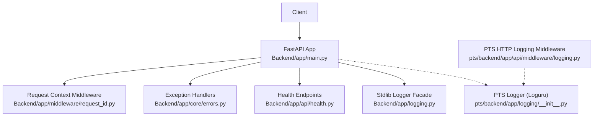
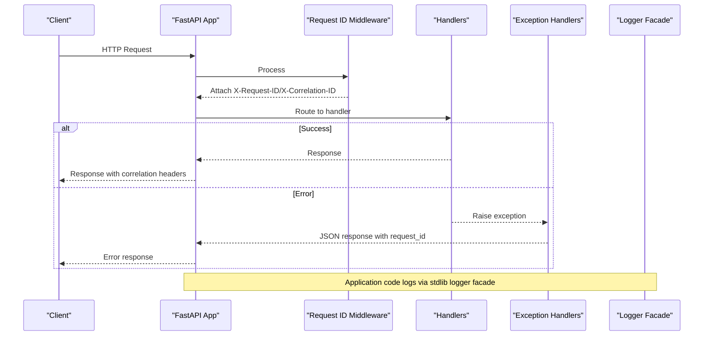
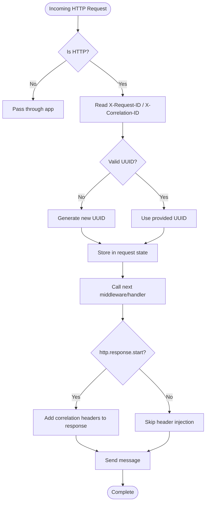
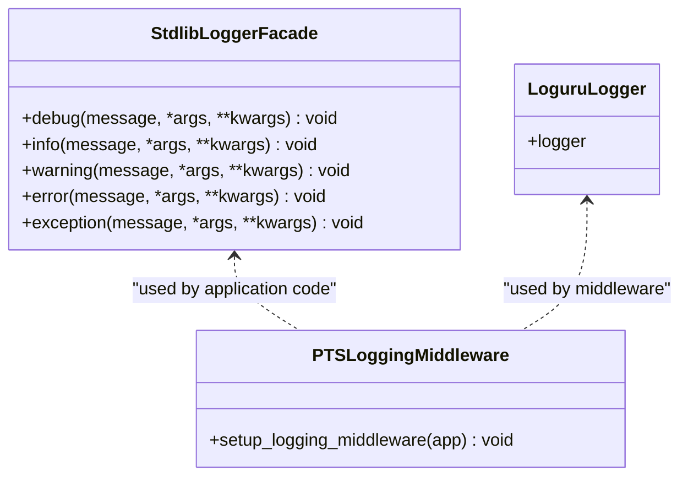
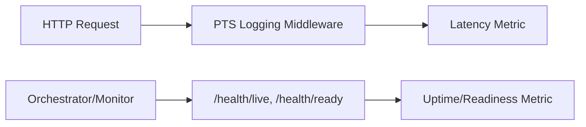
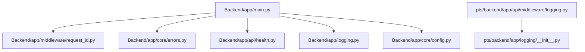

# Monitoring & Logging

<cite>
**Referenced Files in This Document**
- [Backend/app/logging.py](file://Backend/app/logging.py)
- [Backend/app/middleware/request_id.py](file://Backend/app/middleware/request_id.py)
- [Backend/app/core/config.py](file://Backend/app/core/config.py)
- [Backend/app/main.py](file://Backend/app/main.py)
- [Backend/app/core/errors.py](file://Backend/app/core/errors.py)
- [Backend/app/api/health.py](file://Backend/app/api/health.py)
- [Backend/tests/test_request_id.py](file://Backend/tests/test_request_id.py)
- [pts/backend/app/logging/__init__.py](file://pts/backend/app/logging/__init__.py)
- [pts/backend/app/api/middleware/logging.py](file://pts/backend/app/api/middleware/logging.py)
</cite>

## Table of Contents
1. Introduction
2. Project Structure
3. Core Components
4. Architecture Overview
5. Detailed Component Analysis
6. Dependency Analysis
7. Performance Considerations
8. Troubleshooting Guide
9. Conclusion
10. Appendices

## Introduction
This document explains how the ATS system implements monitoring and logging, focusing on structured logging with request ID tracking for distributed tracing, metrics collection strategies, performance monitoring setup, alerting configuration, log aggregation patterns, rotation and retention policies, dashboards, error tracking, profiling tools, and integration with external services. It covers both the main Backend (FastAPI-based) and the PTS backend components that provide complementary logging capabilities.

## Project Structure
The monitoring and logging features are primarily implemented in:
- A FastAPI application that configures middleware for request correlation IDs and standardized error responses including request IDs.
- A logging facade using Python’s stdlib logging module to emit structured logs.
- A health endpoint for liveness/readiness probes used by orchestrators and monitoring systems.
- A PTS backend component that uses Loguru and an HTTP logging middleware for request/response timing.

**Diagram sources**
- [Backend/app/main.py:15-58](file://Backend/app/main.py#L15-L58)
- [Backend/app/middleware/request_id.py:16-54](file://Backend/app/middleware/request_id.py#L16-L54)
- [Backend/app/core/errors.py:60-111](file://Backend/app/core/errors.py#L60-L111)
- [Backend/app/api/health.py:6-21](file://Backend/app/api/health.py#L6-L21)
- [Backend/app/logging.py:9-36](file://Backend/app/logging.py#L9-L36)
- [pts/backend/app/logging/__init__.py:1-8](file://pts/backend/app/logging/__init__.py#L1-L8)
- [pts/backend/app/api/middleware/logging.py:12-22](file://pts/backend/app/api/middleware/logging.py#L12-L22)

**Section sources**
- [Backend/app/main.py:15-58](file://Backend/app/main.py#L15-L58)
- [Backend/app/middleware/request_id.py:16-54](file://Backend/app/middleware/request_id.py#L16-L54)
- [Backend/app/core/errors.py:60-111](file://Backend/app/core/errors.py#L60-L111)
- [Backend/app/api/health.py:6-21](file://Backend/app/api/health.py#L6-L21)
- [Backend/app/logging.py:9-36](file://Backend/app/logging.py#L9-L36)
- [pts/backend/app/logging/__init__.py:1-8](file://pts/backend/app/logging/__init__.py#L1-L8)
- [pts/backend/app/api/middleware/logging.py:12-22](file://pts/backend/app/api/middleware/logging.py#L12-L22)

## Core Components
- Structured logging facade: Provides a consistent logger instance backed by Python’s stdlib logging with a simple formatter.
- Request ID middleware: Injects and propagates X-Request-ID and X-Correlation-ID across requests and responses, ensuring traceability.
- Exception handlers: Normalize errors into JSON responses that include the request ID for correlation.
- Health endpoints: Provide /health/live and /health/ready for orchestration and monitoring.
- Configuration: Centralized settings define environment, headers, and feature toggles relevant to monitoring and logging behavior.
- PTS logging: Optional Loguru-based logger and HTTP middleware for request/response timing in the PTS backend.

**Section sources**
- [Backend/app/logging.py:9-36](file://Backend/app/logging.py#L9-L36)
- [Backend/app/middleware/request_id.py:16-54](file://Backend/app/middleware/request_id.py#L16-L54)
- [Backend/app/core/errors.py:60-111](file://Backend/app/core/errors.py#L60-L111)
- [Backend/app/api/health.py:6-21](file://Backend/app/api/health.py#L6-L21)
- [Backend/app/core/config.py:16-31](file://Backend/app/core/config.py#L16-L31)
- [pts/backend/app/logging/__init__.py:1-8](file://pts/backend/app/logging/__init__.py#L1-L8)
- [pts/backend/app/api/middleware/logging.py:12-22](file://pts/backend/app/api/middleware/logging.py#L12-L22)

## Architecture Overview
The request lifecycle includes middleware injection of correlation identifiers, handler execution, optional PTS logging middleware, and standardized error handling that embeds the request ID in responses. Health endpoints expose status for monitoring systems.

**Diagram sources**
- [Backend/app/main.py:35-53](file://Backend/app/main.py#L35-L53)
- [Backend/app/middleware/request_id.py:29-54](file://Backend/app/middleware/request_id.py#L29-L54)
- [Backend/app/core/errors.py:60-111](file://Backend/app/core/errors.py#L60-L111)
- [Backend/app/logging.py:9-36](file://Backend/app/logging.py#L9-L36)

## Detailed Component Analysis

### Request ID Tracking and Distributed Tracing
- The middleware validates or generates UUIDs for X-Request-ID and X-Correlation-ID, stores them in the request scope, and injects them into response headers.
- Tests verify propagation and sanitization of free-text values into opaque UUIDs.
- Configuration exposes header names so they can be customized per environment.

**Diagram sources**
- [Backend/app/middleware/request_id.py:29-54](file://Backend/app/middleware/request_id.py#L29-L54)

**Section sources**
- [Backend/app/middleware/request_id.py:16-54](file://Backend/app/middleware/request_id.py#L16-L54)
- [Backend/tests/test_request_id.py:6-24](file://Backend/tests/test_request_id.py#L6-L24)
- [Backend/app/core/config.py:25-31](file://Backend/app/core/config.py#L25-L31)

### Structured Logging Implementation
- The Backend provides a stdlib logging facade that sets up a named logger with a stream handler and a simple formatter.
- The PTS backend exposes a Loguru-based logger for use within its own components.
- An HTTP logging middleware in the PTS backend logs method, URL, status code, and processing time for each request.

**Diagram sources**
- [Backend/app/logging.py:9-36](file://Backend/app/logging.py#L9-L36)
- [pts/backend/app/logging/__init__.py:1-8](file://pts/backend/app/logging/__init__.py#L1-L8)
- [pts/backend/app/api/middleware/logging.py:12-22](file://pts/backend/app/api/middleware/logging.py#L12-L22)

**Section sources**
- [Backend/app/logging.py:9-36](file://Backend/app/logging.py#L9-L36)
- [pts/backend/app/logging/__init__.py:1-8](file://pts/backend/app/logging/__init__.py#L1-L8)
- [pts/backend/app/api/middleware/logging.py:12-22](file://pts/backend/app/api/middleware/logging.py#L12-L22)

### Metrics Collection Strategies
- Request timing: The PTS HTTP logging middleware records response status and processing time per request, enabling basic latency metrics.
- Health checks: The Backend exposes /health/live and /health/ready for uptime and readiness metrics from orchestrators and monitoring systems.
- Custom metrics: Integrate a metrics library (e.g., Prometheus client) to expose counters, histograms, and gauges for business KPIs and service-level objectives.

**Diagram sources**
- [pts/backend/app/api/middleware/logging.py:12-22](file://pts/backend/app/api/middleware/logging.py#L12-L22)
- [Backend/app/api/health.py:6-21](file://Backend/app/api/health.py#L6-L21)

**Section sources**
- [pts/backend/app/api/middleware/logging.py:12-22](file://pts/backend/app/api/middleware/logging.py#L12-L22)
- [Backend/app/api/health.py:6-21](file://Backend/app/api/health.py#L6-L21)

### Performance Monitoring Setup
- Enable request timing logs in the PTS middleware to capture latency per endpoint.
- Configure health endpoints for liveness/readiness probes in container orchestration platforms.
- Optionally add structured metrics endpoints (e.g., /metrics) for Prometheus scraping.

**Section sources**
- [pts/backend/app/api/middleware/logging.py:12-22](file://pts/backend/app/api/middleware/logging.py#L12-L22)
- [Backend/app/api/health.py:6-21](file://Backend/app/api/health.py#L6-L21)

### Alerting Configuration
- Use health endpoints to trigger alerts for liveness/readiness failures.
- Correlate error responses (which include request IDs) with log entries to detect spikes in specific error codes or validation failures.
- Define thresholds for latency based on request timing logs to alert on degraded performance.

**Section sources**
- [Backend/app/core/errors.py:60-111](file://Backend/app/core/errors.py#L60-L111)
- [Backend/app/api/health.py:6-21](file://Backend/app/api/health.py#L6-L21)
- [pts/backend/app/api/middleware/logging.py:12-22](file://pts/backend/app/api/middleware/logging.py#L12-L22)

### Log Aggregation Patterns
- Centralize logs emitted by the stdlib logger facade and PTS Loguru logger into a log aggregator (e.g., Fluent Bit, Filebeat, Vector).
- Ensure correlation IDs are present in all log lines to enable distributed tracing across services.
- Parse structured fields where possible to support efficient querying and dashboarding.

[No sources needed since this section provides general guidance]

### Log Rotation Policies and Retention Strategies
- Configure log rotation at the aggregator level to manage disk usage and ensure long-term retention aligned with compliance needs.
- Use index lifecycle management or equivalent mechanisms to archive or delete older logs according to policy.
- Separate logs by severity and service to optimize storage costs and query performance.

[No sources needed since this section provides general guidance]

### Monitoring Dashboards
- Build dashboards around:
  - Request volume and latency percentiles derived from request timing logs.
  - Error rates and top error codes from normalized error responses.
  - Health status trends from liveness/readiness probes.
- Include panels for correlation ID distribution and tail latencies to identify outliers.

[No sources needed since this section provides general guidance]

### Error Tracking
- All error responses include a request ID, enabling correlation between API errors and log entries.
- Validation errors return structured details to aid debugging.
- Integrate with an error tracking tool to group and prioritize issues by code and message.

**Section sources**
- [Backend/app/core/errors.py:60-111](file://Backend/app/core/errors.py#L60-L111)

### Performance Profiling Tools
- Use request timing logs to identify slow endpoints.
- Integrate APM or profiling libraries to collect CPU/memory profiles and flame graphs for hot paths.
- Correlate profile data with request IDs to isolate problematic traces.

[No sources needed since this section provides general guidance]

### Integration with External Monitoring Services
- Expose health endpoints for Kubernetes liveness/readiness probes or cloud platform monitors.
- Forward logs to centralized logging services (e.g., Elasticsearch, Cloud Logging, Splunk) with correlation IDs preserved.
- Export metrics to time-series databases (e.g., Prometheus, InfluxDB) for alerting and visualization.

**Section sources**
- [Backend/app/api/health.py:6-21](file://Backend/app/api/health.py#L6-L21)

## Dependency Analysis
The following diagram shows key dependencies among monitoring and logging components in the Backend and PTS backends.

**Diagram sources**
- [Backend/app/main.py:15-58](file://Backend/app/main.py#L15-L58)
- [Backend/app/middleware/request_id.py:16-54](file://Backend/app/middleware/request_id.py#L16-L54)
- [Backend/app/core/errors.py:60-111](file://Backend/app/core/errors.py#L60-L111)
- [Backend/app/api/health.py:6-21](file://Backend/app/api/health.py#L6-L21)
- [Backend/app/logging.py:9-36](file://Backend/app/logging.py#L9-L36)
- [Backend/app/core/config.py:16-31](file://Backend/app/core/config.py#L16-L31)
- [pts/backend/app/logging/__init__.py:1-8](file://pts/backend/app/logging/__init__.py#L1-L8)
- [pts/backend/app/api/middleware/logging.py:12-22](file://pts/backend/app/api/middleware/logging.py#L12-L22)

**Section sources**
- [Backend/app/main.py:15-58](file://Backend/app/main.py#L15-L58)
- [Backend/app/middleware/request_id.py:16-54](file://Backend/app/middleware/request_id.py#L16-L54)
- [Backend/app/core/errors.py:60-111](file://Backend/app/core/errors.py#L60-L111)
- [Backend/app/api/health.py:6-21](file://Backend/app/api/health.py#L6-L21)
- [Backend/app/logging.py:9-36](file://Backend/app/logging.py#L9-L36)
- [Backend/app/core/config.py:16-31](file://Backend/app/core/config.py#L16-L31)
- [pts/backend/app/logging/__init__.py:1-8](file://pts/backend/app/logging/__init__.py#L1-L8)
- [pts/backend/app/api/middleware/logging.py:12-22](file://pts/backend/app/api/middleware/logging.py#L12-L22)

## Performance Considerations
- Prefer structured logs with fixed schemas to reduce parsing overhead in aggregators.
- Avoid excessive logging in hot paths; use sampling for high-volume debug logs.
- Use correlation IDs to limit log volume during incident investigation by filtering to specific traces.
- Monitor memory and CPU usage when enabling additional instrumentation.

[No sources needed since this section provides general guidance]

## Troubleshooting Guide
- Use the request ID from error responses to locate related log entries across services.
- Validate that X-Request-ID and X-Correlation-ID are propagated correctly using tests and production traces.
- Inspect health endpoints to confirm service liveness and readiness.
- For slow requests, correlate timestamps from request timing logs with detailed logs to pinpoint bottlenecks.

**Section sources**
- [Backend/app/core/errors.py:60-111](file://Backend/app/core/errors.py#L60-L111)
- [Backend/tests/test_request_id.py:6-24](file://Backend/tests/test_request_id.py#L6-L24)
- [Backend/app/api/health.py:6-21](file://Backend/app/api/health.py#L6-L21)
- [pts/backend/app/api/middleware/logging.py:12-22](file://pts/backend/app/api/middleware/logging.py#L12-L22)

## Conclusion
The ATS system provides a solid foundation for monitoring and logging:
- Structured logging via a stdlib facade and optional Loguru-based logging in PTS.
- Robust request ID tracking for distributed tracing across services.
- Standardized error responses with correlation IDs.
- Health endpoints for orchestration and monitoring.
To enhance observability further, integrate metrics collection, centralize logs with rotation and retention policies, build dashboards, and set up alerting based on latency and error rates.

[No sources needed since this section summarizes without analyzing specific files]

## Appendices

### Example: Custom Metrics
- Define counters for request counts by endpoint and status code.
- Record histograms for request latency to compute p50/p95/p99.
- Emit gauges for resource utilization (CPU, memory, queue lengths).

[No sources needed since this section provides general guidance]

### Example: Log Formatting Standards
- Include timestamp, level, service name, request_id, correlation_id, endpoint, and status_code in every log line.
- Keep messages concise; attach structured fields for complex data.

[No sources needed since this section provides general guidance]

### Example: Debugging Workflow for Production Issues
- Capture the request ID from the failing response.
- Search logs for that request ID to reconstruct the full trace.
- Identify slow steps using request timing logs and correlate with detailed logs.
- Reproduce locally with the same request ID and inputs if necessary.

[No sources needed since this section provides general guidance]