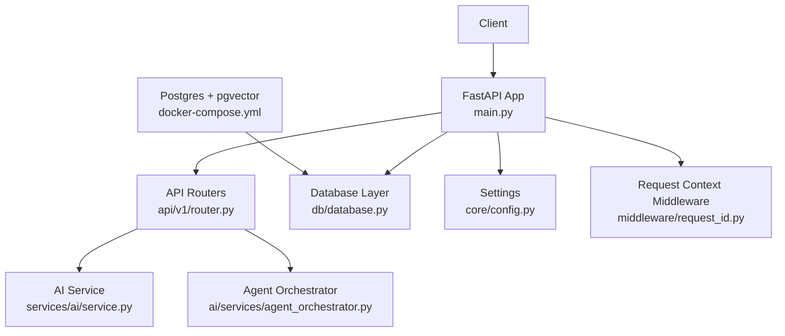
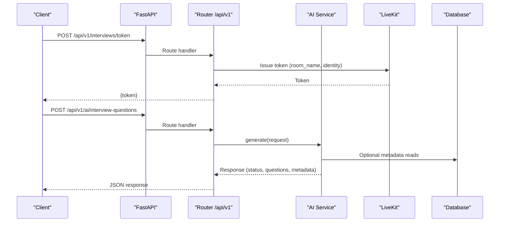
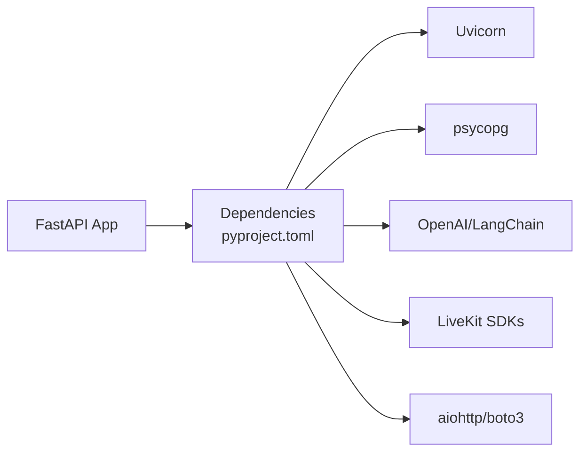

# Scaling & Performance

<cite>
**Referenced Files in This Document**
- [Backend/app/main.py](file://Backend/app/main.py)
- [Backend/app/core/config.py](file://Backend/app/core/config.py)
- [Backend/app/db/database.py](file://Backend/app/db/database.py)
- [Backend/app/api/v1/router.py](file://Backend/app/api/v1/router.py)
- [Backend/app/services/ai/service.py](file://Backend/app/services/ai/service.py)
- [Backend/app/ai/services/agent_orchestrator.py](file://Backend/app/ai/services/agent_orchestrator.py)
- [Backend/app/middleware/request_id.py](file://Backend/app/middleware/request_id.py)
- [Backend/app/logging.py](file://Backend/app/logging.py)
- [Backend/pyproject.toml](file://Backend/pyproject.toml)
- [infrastructure/local/docker-compose.yml](file://infrastructure/local/docker-compose.yml)
- [pts/backend/app/api/models/database.py](file://pts/backend/app/api/models/database.py)
</cite>

## Table of Contents
1. Introduction
2. Project Structure
3. Core Components
4. Architecture Overview
5. Detailed Component Analysis
6. Dependency Analysis
7. Performance Considerations
8. Troubleshooting Guide
9. Conclusion
10. Appendices

## Introduction
This document provides comprehensive scaling and performance guidance for the ATS system, focusing on horizontal and vertical scaling strategies for database connections, API endpoints, and AI services. It covers caching approaches, database query optimization, connection pooling, load balancing considerations, auto-scaling policies, resource monitoring, profiling techniques, bottleneck identification, memory management, garbage collection tuning, container resource limits, capacity planning, stress testing, and performance regression detection.

## Project Structure
The backend is a FastAPI application with modular routers, an AI service layer, and a flexible persistence layer that supports both PostgreSQL (with pgvector) and SQLite. The local infrastructure includes a Postgres container configured for vector similarity search.

**Diagram sources**
- [Backend/app/main.py:15-58](file://Backend/app/main.py#L15-L58)
- [Backend/app/api/v1/router.py:26-71](file://Backend/app/api/v1/router.py#L26-L71)
- [Backend/app/services/ai/service.py:13-86](file://Backend/app/services/ai/service.py#L13-L86)
- [Backend/app/ai/services/agent_orchestrator.py:29-182](file://Backend/app/ai/services/agent_orchestrator.py#L29-L182)
- [Backend/app/db/database.py:476-516](file://Backend/app/db/database.py#L476-L516)
- [Backend/app/core/config.py:16-130](file://Backend/app/core/config.py#L16-L130)
- [Backend/app/middleware/request_id.py:16-55](file://Backend/app/middleware/request_id.py#L16-L55)
- [infrastructure/local/docker-compose.yml:3-20](file://infrastructure/local/docker-compose.yml#L3-L20)

**Section sources**
- [Backend/app/main.py:15-58](file://Backend/app/main.py#L15-L58)
- [Backend/app/core/config.py:16-130](file://Backend/app/core/config.py#L16-L130)
- [Backend/app/db/database.py:476-516](file://Backend/app/db/database.py#L476-L516)
- [Backend/app/api/v1/router.py:26-71](file://Backend/app/api/v1/router.py#L26-L71)
- [Backend/app/ai/services/agent_orchestrator.py:29-182](file://Backend/app/ai/services/agent_orchestrator.py#L29-L182)
- [Backend/app/middleware/request_id.py:16-55](file://Backend/app/middleware/request_id.py#L16-L55)
- [Backend/pyproject.toml:11-33](file://Backend/pyproject.toml#L11-L33)
- [infrastructure/local/docker-compose.yml:3-20](file://infrastructure/local/docker-compose.yml#L3-L20)

## Core Components
- Application entrypoint and middleware:
  - FastAPI app creation, CORS, request context middleware, exception handlers, and router inclusion.
- Configuration:
  - Centralized settings for database, AI providers, timeouts, LiveKit, and feature flags.
- Database layer:
  - Engine-neutral abstraction over SQLite and PostgreSQL; schema initialization; optional pgvector enablement; per-request connections for SQLite; safe migration guards.
- API routing:
  - Versioned routers including interview token generation and AI question generation endpoints.
- AI services:
  - Interview question generation via LangChain/OpenAI adapter with graceful fallback when disabled or unavailable.
- Agent orchestrator:
  - Background setup of LiveKit rooms and agents, WebSocket status updates, cleanup, and post-interview AI rating tasks.
- Request tracing:
  - Middleware injects request and correlation IDs into scope and response headers for observability.
- Logging:
  - Structured logger facade used across components.

**Section sources**
- [Backend/app/main.py:15-58](file://Backend/app/main.py#L15-L58)
- [Backend/app/core/config.py:16-130](file://Backend/app/core/config.py#L16-L130)
- [Backend/app/db/database.py:373-516](file://Backend/app/db/database.py#L373-L516)
- [Backend/app/api/v1/router.py:26-71](file://Backend/app/api/v1/router.py#L26-L71)
- [Backend/app/services/ai/service.py:13-86](file://Backend/app/services/ai/service.py#L13-L86)
- [Backend/app/ai/services/agent_orchestrator.py:29-182](file://Backend/app/ai/services/agent_orchestrator.py#L29-L182)
- [Backend/app/middleware/request_id.py:16-55](file://Backend/app/middleware/request_id.py#L16-L55)
- [Backend/app/logging.py:9-37](file://Backend/app/logging.py#L9-L37)

## Architecture Overview
The system follows a layered architecture:
- HTTP layer (FastAPI) with middleware for CORS and request context.
- Routing layer dispatches to domain-specific routers.
- Services layer encapsulates business logic and external integrations (AI, LiveKit).
- Persistence layer abstracts SQL engines and manages schema migrations.
- Infrastructure provides Postgres with pgvector for vector similarity search.

**Diagram sources**
- [Backend/app/api/v1/router.py:43-71](file://Backend/app/api/v1/router.py#L43-L71)
- [Backend/app/services/ai/service.py:43-86](file://Backend/app/services/ai/service.py#L43-L86)
- [Backend/app/db/database.py:476-516](file://Backend/app/db/database.py#L476-L516)

## Detailed Component Analysis

### Database Connections and Scaling
- PostgreSQL path:
  - Uses psycopg with dict rows and a thin adapter to translate placeholders.
  - Schema applied once per process with thread-safe guard; pgvector extension enabled best-effort.
- SQLite path:
  - Per-request connections with WAL mode and foreign keys enabled; suitable for development/testing but not production-scale concurrency.
- Connection pooling:
  - No explicit pool in the core backend’s db module; consider adding a connection pool for PostgreSQL under load.
  - PTS backend demonstrates SQLAlchemy engine with pool_size, max_overflow, pool_pre_ping, and pool_recycle—useful reference for production tuning.

Recommendations:
- For production PostgreSQL, introduce a connection pool (e.g., SQLAlchemy or asyncpg) with tuned pool_size and recycle intervals aligned with your workload and DB limits.
- Keep SQLite only for dev/test; route production traffic to managed Postgres with read replicas if needed.
- Use indexes already defined in schema for tenant-scoped queries and frequently filtered columns.

**Section sources**
- [Backend/app/db/database.py:373-516](file://Backend/app/db/database.py#L373-L516)
- [pts/backend/app/api/models/database.py:24-39](file://pts/backend/app/api/models/database.py#L24-L39)

### API Endpoints and Horizontal Scaling
- FastAPI app registers CORS and request context middleware, then mounts v1 routers.
- Key endpoints:
  - Interview token issuance delegates to LiveKit token service.
  - AI question generation calls AI service with provider configuration and timeout.
- Horizontal scaling:
  - Stateless app instances can be scaled horizontally behind a reverse proxy/load balancer.
  - Ensure shared state is avoided; use external stores (DB, object storage) and ephemeral sessions where necessary.

Best practices:
- Keep request handling non-blocking; offload long-running work (e.g., agent orchestration) to background tasks.
- Use correlation IDs for distributed tracing across services.

**Section sources**
- [Backend/app/main.py:15-58](file://Backend/app/main.py#L15-L58)
- [Backend/app/api/v1/router.py:26-71](file://Backend/app/api/v1/router.py#L26-L71)
- [Backend/app/middleware/request_id.py:16-55](file://Backend/app/middleware/request_id.py#L16-L55)

### AI Services Scaling and Resilience
- InterviewQuestionService:
  - Instantiates OpenAI adapter when configured; otherwise returns a disabled response requiring human review.
  - Validates provider output count and competencies; falls back to “unavailable” status on errors.
- Orchestration:
  - AgentOrchestrator runs heavy setup in background tasks, sends WebSocket progress updates, connects to LiveKit, initializes agents, and performs cleanup.
  - Post-interview AI rating is scheduled asynchronously.

Scaling considerations:
- Rate-limit or queue AI requests to avoid provider throttling.
- Use timeouts and retries with exponential backoff for external AI calls.
- Cache prompt templates and model metadata to reduce cold-start overhead.

**Section sources**
- [Backend/app/services/ai/service.py:13-86](file://Backend/app/services/ai/service.py#L13-L86)
- [Backend/app/ai/services/agent_orchestrator.py:29-182](file://Backend/app/ai/services/agent_orchestrator.py#L29-L182)

### Caching Strategies
- Current state:
  - No Redis or in-memory cache is present in the analyzed files.
- Recommended approach:
  - Introduce Redis for:
    - Session/state for live interviews (e.g., active room state, transcript buffers).
    - API rate limiting and idempotency keys.
    - Short-lived caches for expensive computations (e.g., embedding vectors, match scores).
  - In-memory caches (e.g., lru_cache) for small, static data like prompt versions and policy versions within a process.

Operational notes:
- Ensure cache invalidation on data mutations.
- Monitor cache hit rates and eviction policies.

[No sources needed since this section proposes general improvements without analyzing specific files]

### Database Query Optimization
- Existing schema includes multiple indexes on tenant_id, candidate_id, posting_id, and other high-cardinality fields.
- Recommendations:
  - Prefer selective filters and indexed joins.
  - Avoid SELECT * in hot paths; fetch only required columns.
  - Use pagination for large result sets.
  - Leverage pgvector for ANN similarity searches when available.

**Section sources**
- [Backend/app/db/database.py:19-331](file://Backend/app/db/database.py#L19-L331)

### Connection Pooling and Resource Limits
- Backend db module does not implement pooling; consider adopting a pooled client for PostgreSQL.
- PTS backend shows a reference configuration with pool_size, max_overflow, pre-ping, and recycle—apply similar tuning in production.
- Container resource limits:
  - Set CPU and memory limits appropriate for expected concurrency and AI call bursts.
  - Tune Python GC thresholds if you observe frequent allocations during peak loads.

**Section sources**
- [pts/backend/app/api/models/database.py:24-39](file://pts/backend/app/api/models/database.py#L24-L39)

### Load Balancing and Auto-Scaling Policies
- Load balancing:
  - Place FastAPI behind a reverse proxy (e.g., Nginx, Traefik) or cloud load balancer.
  - Configure health checks using the app’s health endpoint.
- Auto-scaling:
  - Scale out based on CPU utilization, request latency, or queue depth.
  - Use rolling updates to maintain availability during deployments.

[No sources needed since this section provides general guidance]

### Monitoring and Observability
- Request context middleware adds request and correlation IDs to responses for traceability.
- Logging facade centralizes structured logs; integrate with centralized logging and metrics collectors.
- Add metrics for:
  - Request latency, error rates, AI provider latency, DB query times, and WebSocket events.

**Section sources**
- [Backend/app/middleware/request_id.py:16-55](file://Backend/app/middleware/request_id.py#L16-L55)
- [Backend/app/logging.py:9-37](file://Backend/app/logging.py#L9-L37)

### Memory Management and Garbage Collection Tuning
- Python GC:
  - Adjust GC thresholds via environment variables if you see frequent pauses under load.
- Memory usage:
  - Profile long-running processes to detect leaks in background tasks or persistent objects.
  - Limit payload sizes and enforce timeouts for AI and media operations.

[No sources needed since this section provides general guidance]

### Capacity Planning and Stress Testing
- Capacity planning:
  - Estimate concurrent users, AI request rates, and DB throughput requirements.
  - Size containers and DB instances accordingly; provision headroom for spikes.
- Stress testing:
  - Use tools like k6 or Locust to simulate realistic loads.
  - Measure p95/p99 latencies and error rates; validate autoscaling triggers.

[No sources needed since this section provides general guidance]

### Performance Regression Detection
- Baseline key SLOs (latency, error rate, throughput).
- Integrate performance tests into CI to catch regressions early.
- Track trends in metrics dashboards and alert on deviations.

[No sources needed since this section provides general guidance]

## Dependency Analysis
Key runtime dependencies include FastAPI, Uvicorn, Pydantic Settings, psycopg, OpenAI/LangChain, LiveKit SDKs, aiohttp, boto3, and email libraries. These define the scaling surface area for network I/O and external service interactions.

**Diagram sources**
- [Backend/pyproject.toml:11-33](file://Backend/pyproject.toml#L11-L33)

**Section sources**
- [Backend/pyproject.toml:11-33](file://Backend/pyproject.toml#L11-L33)

## Performance Considerations
- Network-bound operations:
  - AI calls and LiveKit signaling are latency-sensitive; configure timeouts and retries carefully.
- Database-bound operations:
  - Use indexed queries and avoid N+1 patterns; paginate results.
- Concurrency:
  - Offload long-running tasks to background workers; keep request handlers fast.
- Caching:
  - Implement Redis-backed caches for repeated reads and idempotent operations.
- Observability:
  - Correlation IDs and structured logs enable end-to-end tracing.

[No sources needed since this section provides general guidance]

## Troubleshooting Guide
- Missing or misconfigured AI provider:
  - AI service returns a disabled/unavailable status; verify configuration and credentials.
- LiveKit issues:
  - Orchestrator sends setup failure messages via WebSocket; check tokens and room connectivity.
- Database errors:
  - Ensure schema migrations run once per process; verify connection URLs and permissions.
- Request tracing:
  - Use correlation IDs from middleware to correlate logs across services.

**Section sources**
- [Backend/app/services/ai/service.py:43-86](file://Backend/app/services/ai/service.py#L43-L86)
- [Backend/app/ai/services/agent_orchestrator.py:77-192](file://Backend/app/ai/services/agent_orchestrator.py#L77-L192)
- [Backend/app/db/database.py:476-516](file://Backend/app/db/database.py#L476-L516)
- [Backend/app/middleware/request_id.py:16-55](file://Backend/app/middleware/request_id.py#L16-L55)

## Conclusion
The ATS backend is designed for extensibility and modularity, with clear separation between API, services, and persistence layers. To scale effectively:
- Move to a pooled PostgreSQL setup for production.
- Introduce Redis for caching and session/state management.
- Apply robust timeouts, retries, and circuit breakers for AI and media services.
- Instrument with metrics and tracing using correlation IDs.
- Plan capacity and validate with stress tests; monitor for regressions.

[No sources needed since this section summarizes without analyzing specific files]

## Appendices

### Appendix A: Environment Variables and Configuration
- Database:
  - database_url or database_path determines target engine.
- AI:
  - ai_api_key, ai_model, ai_timeout_seconds control provider behavior.
- LiveKit:
  - livekit_url, livekit_api_key, livekit_api_secret, livekit_token_ttl_seconds.
- CORS and request context:
  - cors_origins, request_id_header, correlation_id_header.

**Section sources**
- [Backend/app/core/config.py:16-130](file://Backend/app/core/config.py#L16-L130)

### Appendix B: Local Infrastructure
- Postgres with pgvector is provided locally for vector similarity search.

**Section sources**
- [infrastructure/local/docker-compose.yml:3-20](file://infrastructure/local/docker-compose.yml#L3-L20)