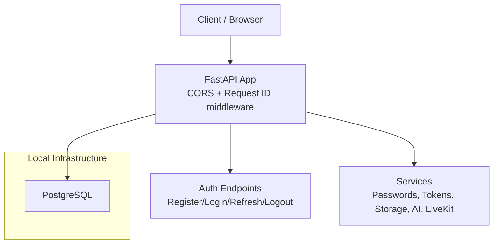
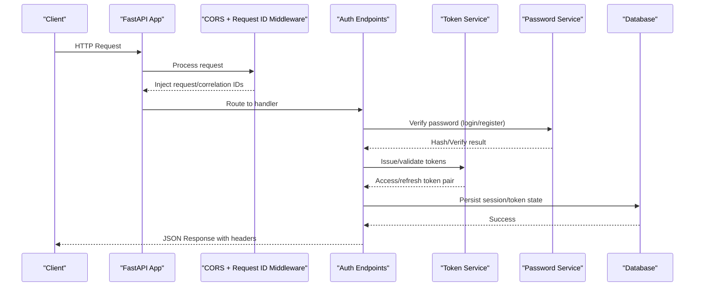
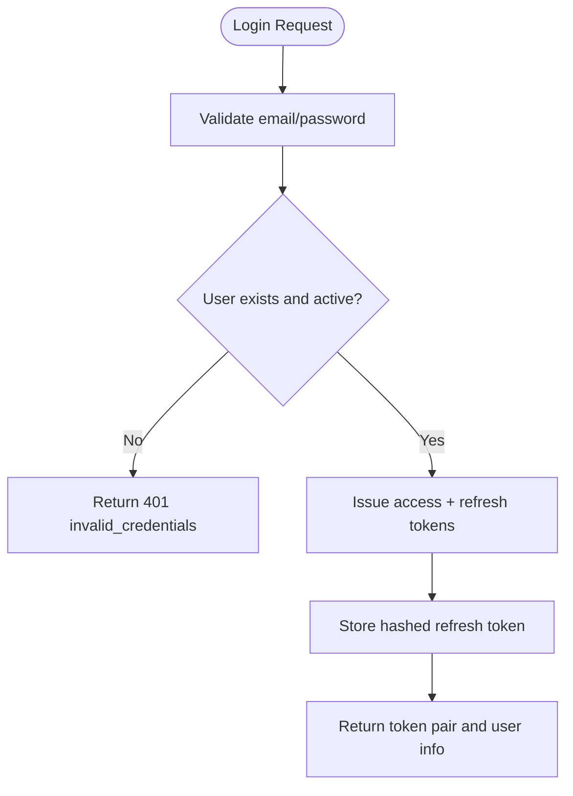
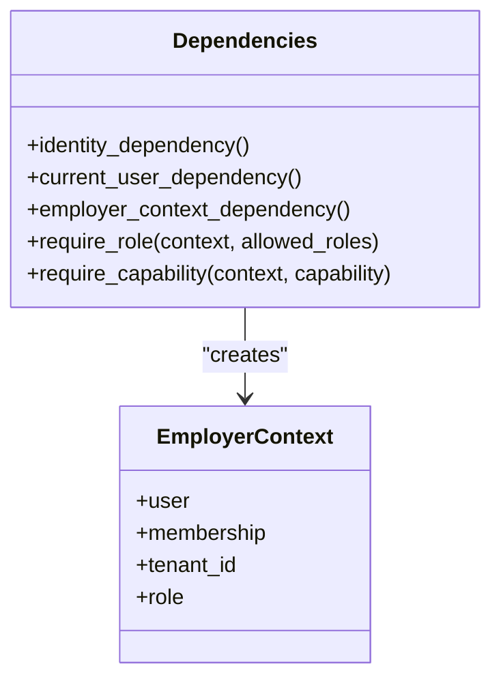
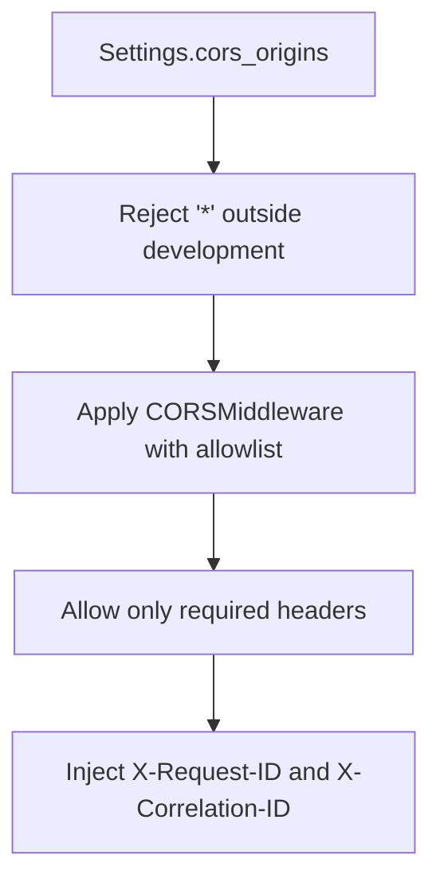
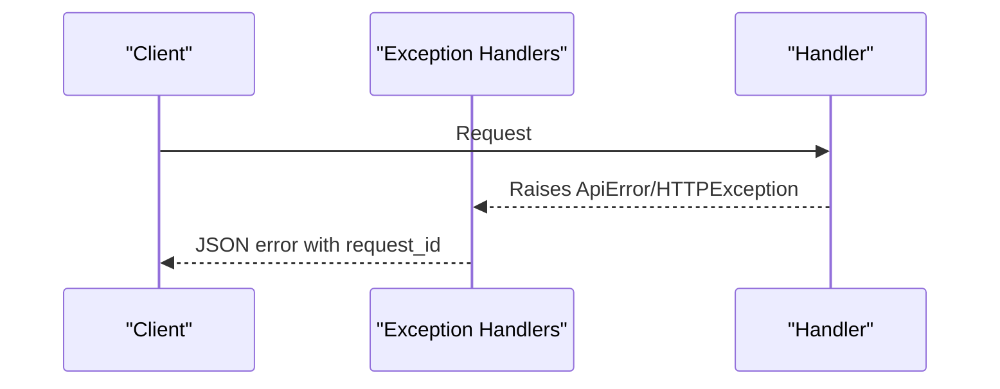

# Security Hardening

<cite>
**Referenced Files in This Document**
- [Backend/app/core/config.py](file://Backend/app/core/config.py)
- [Backend/app/main.py](file://Backend/app/main.py)
- [Backend/app/middleware/request_id.py](file://Backend/app/middleware/request_id.py)
- [Backend/app/api/v1/auth.py](file://Backend/app/api/v1/auth.py)
- [Backend/app/services/auth_tokens.py](file://Backend/app/services/auth_tokens.py)
- [Backend/app/services/passwords.py](file://Backend/app/services/passwords.py)
- [Backend/app/api/dependencies.py](file://Backend/app/api/dependencies.py)
- [Backend/app/core/errors.py](file://Backend/app/core/errors.py)
- [Backend/app/logging.py](file://Backend/app/logging.py)
- [infrastructure/local/docker-compose.yml](file://infrastructure/local/docker-compose.yml)
- [Backend/README.md](file://Backend/README.md)
- [Backend/pyproject.toml](file://Backend/pyproject.toml)
</cite>

## Table of Contents
1. Introduction
2. Project Structure
3. Core Components
4. Architecture Overview
5. Detailed Component Analysis
6. Dependency Analysis
7. Performance Considerations
8. Troubleshooting Guide
9. Conclusion
10. Appendices

## Introduction
This document provides security hardening guidance for the ATS system with a focus on container deployment, network security, access control, secrets management, SSL/TLS configuration, vulnerability scanning, dependency updates, compliance considerations, secure configuration management, security headers, input validation, incident response, and security monitoring. It synthesizes findings from the codebase to provide actionable recommendations aligned with current best practices.

## Project Structure
The ATS system is composed of:
- Backend API (FastAPI) providing authentication, authorization, data operations, and integrations.
- Local infrastructure using Docker Compose to run PostgreSQL.
- Configuration via environment variables with typed settings and secret handling.
- Middleware for CORS and request correlation IDs.
- Centralized error handling and logging.

**Diagram sources**
- [Backend/app/main.py:15-58](file://Backend/app/main.py#L15-L58)
- [Backend/app/api/v1/auth.py:74-148](file://Backend/app/api/v1/auth.py#L74-L148)
- [Backend/app/services/auth_tokens.py:22-86](file://Backend/app/services/auth_tokens.py#L22-L86)
- [Backend/app/services/passwords.py:6-16](file://Backend/app/services/passwords.py#L6-L16)
- [infrastructure/local/docker-compose.yml:4-20](file://infrastructure/local/docker-compose.yml#L4-L20)

**Section sources**
- [Backend/app/main.py:15-58](file://Backend/app/main.py#L15-L58)
- [Backend/app/core/config.py:16-31](file://Backend/app/core/config.py#L16-L31)
- [infrastructure/local/docker-compose.yml:4-20](file://infrastructure/local/docker-compose.yml#L4-L20)

## Core Components
- Settings and Secrets: Centralized configuration with typed fields and SecretStr for sensitive values; environment-based overrides and validators.
- Authentication: JWT access tokens and opaque refresh tokens stored as hashes; password hashing with bcrypt.
- Authorization: Role-based checks and organization-scoped context enforcement.
- Network Security: CORS allowlist and strict header controls; request correlation IDs for tracing.
- Error Handling: Standardized error responses including request IDs for traceability.
- Logging: Structured logger facade for consistent log output.

**Section sources**
- [Backend/app/core/config.py:16-100](file://Backend/app/core/config.py#L16-L100)
- [Backend/app/api/v1/auth.py:74-148](file://Backend/app/api/v1/auth.py#L74-L148)
- [Backend/app/services/auth_tokens.py:22-127](file://Backend/app/services/auth_tokens.py#L22-L127)
- [Backend/app/services/passwords.py:6-16](file://Backend/app/services/passwords.py#L6-L16)
- [Backend/app/api/dependencies.py:49-114](file://Backend/app/api/dependencies.py#L49-L114)
- [Backend/app/core/errors.py:60-111](file://Backend/app/core/errors.py#L60-L111)
- [Backend/app/logging.py:9-36](file://Backend/app/logging.py#L9-L36)

## Architecture Overview
The application enforces security at multiple layers:
- Transport: TLS termination at the reverse proxy or ingress; backend uses HTTPS-aware CORS and secure defaults.
- Application: Strict CORS policy, validated inputs, authenticated and authorized endpoints, and standardized errors.
- Data: Encrypted storage for secrets, hashed passwords, and database credentials managed via environment variables.
- Observability: Request IDs propagated across requests and included in error responses for audit and incident response.

**Diagram sources**
- [Backend/app/main.py:35-53](file://Backend/app/main.py#L35-L53)
- [Backend/app/middleware/request_id.py:29-54](file://Backend/app/middleware/request_id.py#L29-L54)
- [Backend/app/api/v1/auth.py:104-148](file://Backend/app/api/v1/auth.py#L104-L148)
- [Backend/app/services/auth_tokens.py:22-86](file://Backend/app/services/auth_tokens.py#L22-L86)
- [Backend/app/services/passwords.py:6-16](file://Backend/app/services/passwords.py#L6-L16)

## Detailed Component Analysis

### Secrets Management and Configuration
- All secrets are loaded via environment variables prefixed by THOS_ and wrapped in SecretStr to avoid accidental logging.
- Sensitive fields include database URL, SMTP credentials, S3 keys, JWT secret, LiveKit keys, and AI provider keys.
- Validators enforce safe defaults and reject insecure configurations (e.g., wildcard CORS outside development).
- Recommended practices:
  - Use a vault system (e.g., HashiCorp Vault, AWS Secrets Manager, GCP Secret Manager) to inject secrets at runtime.
  - Rotate JWT secrets regularly and ensure minimum length and entropy.
  - Restrict environment-specific values per deployment stage.

**Section sources**
- [Backend/app/core/config.py:16-100](file://Backend/app/core/config.py#L16-L100)
- [Backend/app/core/config.py:187-205](file://Backend/app/core/config.py#L187-L205)
- [Backend/README.md:42-54](file://Backend/README.md#L42-L54)

### Authentication and Token Lifecycle
- Passwords are hashed with bcrypt before storage and verified securely.
- Access tokens are short-lived JWTs signed with HS256 using the configured secret.
- Refresh tokens are opaque, stored as SHA-256 hashes, rotated on use, and revoked on logout.
- Login flow validates credentials, issues token pairs, and returns minimal user metadata.

**Diagram sources**
- [Backend/app/api/v1/auth.py:104-127](file://Backend/app/api/v1/auth.py#L104-L127)
- [Backend/app/services/auth_tokens.py:67-86](file://Backend/app/services/auth_tokens.py#L67-L86)
- [Backend/app/services/passwords.py:6-16](file://Backend/app/services/passwords.py#L6-L16)

**Section sources**
- [Backend/app/api/v1/auth.py:74-148](file://Backend/app/api/v1/auth.py#L74-L148)
- [Backend/app/services/auth_tokens.py:22-127](file://Backend/app/services/auth_tokens.py#L22-L127)
- [Backend/app/services/passwords.py:6-16](file://Backend/app/services/passwords.py#L6-L16)

### Authorization and Access Control
- Identity resolution supports Bearer JWT or development identity header in dev/test environments.
- Organization-scoped access requires explicit X-Organization-Id header and verified membership with appropriate roles.
- Role checks enforce capabilities based on predefined role sets.

**Diagram sources**
- [Backend/app/api/dependencies.py:49-114](file://Backend/app/api/dependencies.py#L49-L114)
- [Backend/app/api/dependencies.py:125-162](file://Backend/app/api/dependencies.py#L125-L162)
- [Backend/app/api/dependencies.py:165-176](file://Backend/app/api/dependencies.py#L165-L176)

**Section sources**
- [Backend/app/api/dependencies.py:49-114](file://Backend/app/api/dependencies.py#L49-L114)
- [Backend/app/api/dependencies.py:125-162](file://Backend/app/api/dependencies.py#L125-L162)
- [Backend/app/api/dependencies.py:165-176](file://Backend/app/api/dependencies.py#L165-L176)

### Network Security and CORS
- CORS is configured with an explicit allowlist of origins and restricted methods/headers.
- Wildcard CORS is rejected outside development via model validators.
- Request correlation IDs are injected into responses for tracing and auditing.

**Diagram sources**
- [Backend/app/core/config.py:147-205](file://Backend/app/core/config.py#L147-L205)
- [Backend/app/main.py:35-53](file://Backend/app/main.py#L35-L53)
- [Backend/app/middleware/request_id.py:29-54](file://Backend/app/middleware/request_id.py#L29-L54)

**Section sources**
- [Backend/app/core/config.py:147-205](file://Backend/app/core/config.py#L147-L205)
- [Backend/app/main.py:35-53](file://Backend/app/main.py#L35-L53)
- [Backend/app/middleware/request_id.py:29-54](file://Backend/app/middleware/request_id.py#L29-L54)

### SSL/TLS and Secure Communication
- The application itself does not terminate TLS; deploy behind a reverse proxy or ingress that terminates TLS with strong cipher suites and modern protocols.
- Ensure all external integrations (AI providers, LiveKit, storage) use HTTPS and validate certificates.
- Configure environment variables to point to secure endpoints and rotate keys regularly.

[No sources needed since this section provides general guidance]

### Input Validation and Error Handling
- Pydantic models enforce field constraints and patterns for auth endpoints.
- Global exception handlers return standardized error bodies including request IDs for traceability.
- Integration misconfiguration yields clear 503 responses with actionable messages.

**Diagram sources**
- [Backend/app/api/v1/auth.py:19-36](file://Backend/app/api/v1/auth.py#L19-L36)
- [Backend/app/core/errors.py:60-111](file://Backend/app/core/errors.py#L60-L111)

**Section sources**
- [Backend/app/api/v1/auth.py:19-36](file://Backend/app/api/v1/auth.py#L19-L36)
- [Backend/app/core/errors.py:60-111](file://Backend/app/core/errors.py#L60-L111)

### Container and Database Security
- Local Postgres service exposes default credentials in compose; production must use strong secrets and restrict ports/networking.
- Use volumes for persistent data and configure health checks.
- Avoid exposing internal services directly; route through a gateway with TLS and access controls.

**Section sources**
- [infrastructure/local/docker-compose.yml:4-20](file://infrastructure/local/docker-compose.yml#L4-L20)

### Logging and Auditability
- Centralized logger outputs structured logs with timestamps and levels.
- Errors include request IDs to correlate logs across components.
- Implement log rotation and centralized collection for analysis and alerting.

**Section sources**
- [Backend/app/logging.py:9-36](file://Backend/app/logging.py#L9-L36)
- [Backend/app/core/errors.py:37-57](file://Backend/app/core/errors.py#L37-L57)

## Dependency Analysis
External dependencies relevant to security:
- PyJWT for token signing and verification.
- bcrypt for password hashing.
- FastAPI and Starlette for ASGI server and middleware.
- Uvicorn for serving.
- Optional integrations: OpenAI, LiveKit, boto3 for storage.

Recommendations:
- Pin versions and monitor for vulnerabilities.
- Use automated scanning in CI/CD pipelines.
- Regularly update dependencies and review advisories.

**Section sources**
- [Backend/pyproject.toml:11-33](file://Backend/pyproject.toml#L11-L33)

## Performance Considerations
- Keep JWT access TTL short to limit exposure window.
- Use refresh token rotation to reduce reuse risk.
- Minimize sensitive data in logs and responses.
- Offload TLS termination to optimized proxies.

[No sources needed since this section provides general guidance]

## Troubleshooting Guide
Common issues and mitigations:
- Invalid or expired tokens: Ensure correct secret and TTL configuration; handle token expiration flows gracefully.
- CORS errors: Verify origin allowlist matches frontend domains; avoid wildcards in non-development environments.
- Missing request IDs: Confirm middleware is registered and headers are passed through proxies.
- Integration failures: Check environment variables for required keys and endpoints; expect 503 with descriptive codes when unconfigured.

**Section sources**
- [Backend/app/services/auth_tokens.py:39-64](file://Backend/app/services/auth_tokens.py#L39-L64)
- [Backend/app/core/config.py:187-205](file://Backend/app/core/config.py#L187-L205)
- [Backend/app/middleware/request_id.py:29-54](file://Backend/app/middleware/request_id.py#L29-L54)
- [Backend/app/core/errors.py:28-34](file://Backend/app/core/errors.py#L28-L34)

## Conclusion
The ATS system implements solid foundational security measures including typed configuration with secrets, robust authentication and authorization, strict CORS policies, standardized error handling with request IDs, and structured logging. To harden further, adopt TLS termination at the edge, integrate a secrets manager, implement comprehensive vulnerability scanning, enforce least privilege in deployments, and establish incident response and monitoring procedures aligned with compliance requirements.

[No sources needed since this section summarizes without analyzing specific files]

## Appendices

### Compliance Considerations
- Data protection: Encrypt secrets at rest and in transit; minimize retention of sensitive data; enforce access controls and audit trails.
- Privacy regulations: Limit personal data exposure in logs and responses; honor data subject rights via processes for deletion and export.
- Industry standards: Follow OWASP guidelines for API security, secure coding practices, and continuous security testing.

[No sources needed since this section provides general guidance]

### Secure Configuration Management Checklist
- Use environment variables with THOS_ prefix; never commit .env files.
- Enforce strong JWT secrets and rotate periodically.
- Restrict CORS to known origins; disable wildcard in non-development.
- Configure secure SMTP, storage, and third-party integrations via secrets managers.
- Validate all inputs with Pydantic models and reject unsafe values early.

**Section sources**
- [Backend/README.md:42-54](file://Backend/README.md#L42-L54)
- [Backend/app/core/config.py:16-100](file://Backend/app/core/config.py#L16-L100)

### Incident Response and Monitoring Setup
- Enable centralized logging with correlation IDs to trace incidents end-to-end.
- Set up alerts for authentication failures, authorization denials, and integration errors.
- Maintain runbooks for common incidents (token leaks, CORS misconfigurations, service outages).
- Conduct regular audits of access logs and configuration drift.

**Section sources**
- [Backend/app/logging.py:9-36](file://Backend/app/logging.py#L9-L36)
- [Backend/app/core/errors.py:60-111](file://Backend/app/core/errors.py#L60-L111)