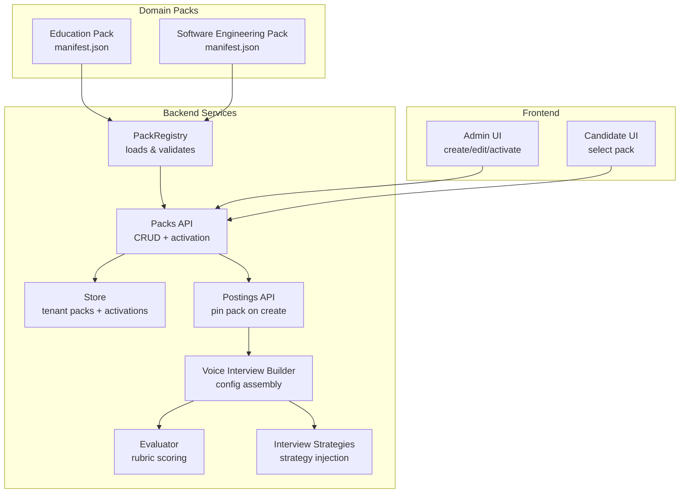
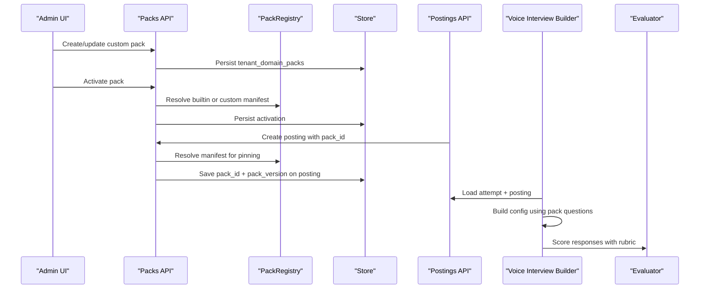
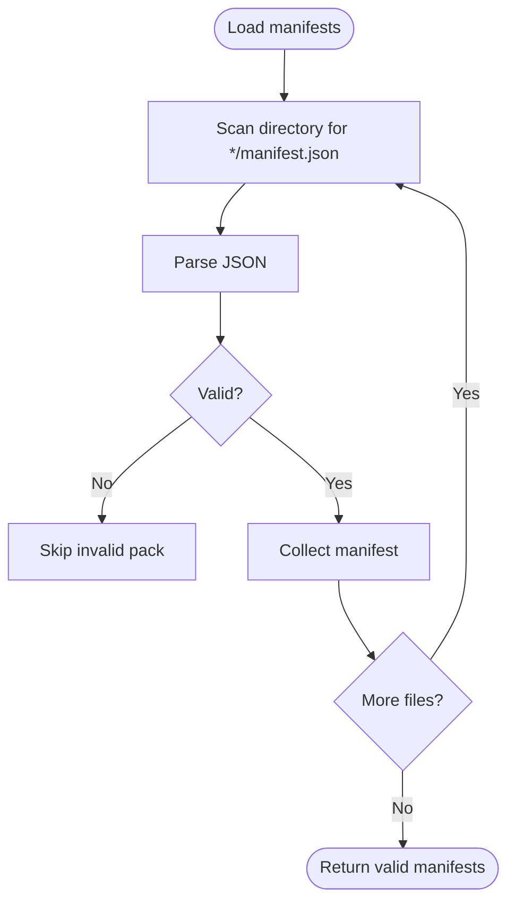
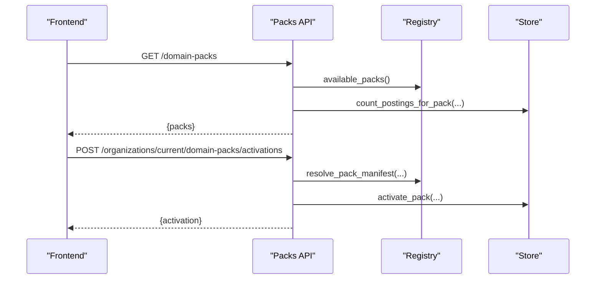
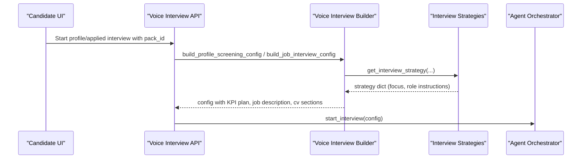
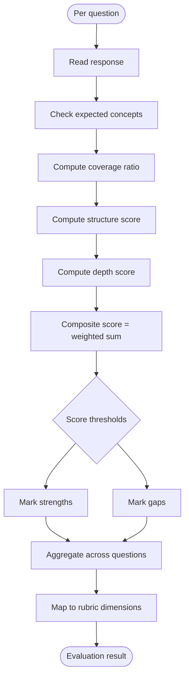
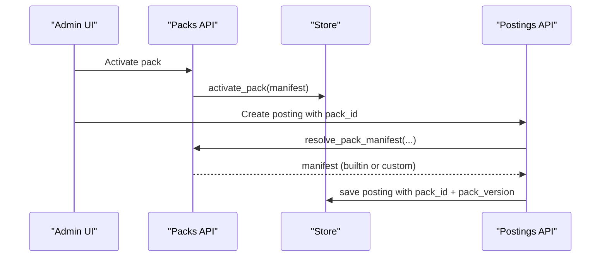
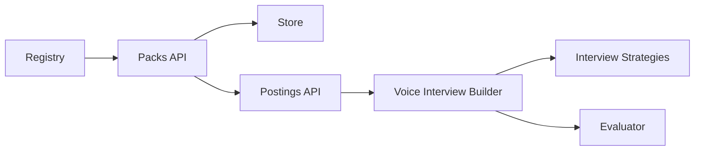

# Domain Packs System

<cite>
**Referenced Files in This Document**
- [manifest.json](file://domain-packs/education/manifest.json)
- [manifest.json](file://domain-packs/software-engineering/manifest.json)
- [packs.py](file://Backend/app/services/packs.py)
- [packs.py](file://Backend/app/api/v1/packs.py)
- [store.py](file://Backend/app/db/store.py)
- [database.py](file://Backend/app/db/database.py)
- [evaluation.py](file://Backend/app/domain/evaluation.py)
- [interview_strategies.py](file://Backend/app/ai/prompts/interview_strategies.py)
- [voice_interview.py](file://Backend/app/services/voice_interview.py)
- [postings.py](file://Backend/app/api/v1/postings.py)
- [search.py](file://Backend/app/api/v1/search.py)
- [admin-page.tsx](file://Frontend/components/admin/admin-page.tsx)
- [interview-session.tsx](file://Frontend/components/candidate/interview-session.tsx)
</cite>

## Table of Contents
1. Introduction
2. Project Structure
3. Core Components
4. Architecture Overview
5. Detailed Component Analysis
6. Dependency Analysis
7. Performance Considerations
8. Troubleshooting Guide
9. Conclusion
10. Appendices

## Introduction
This document explains the domain packs system that enables industry-specific configurations for interviews and evaluations. It covers:
- The manifest file structure that defines pack metadata, question templates, evaluation criteria, and domain knowledge
- How domain packs are loaded at runtime and integrated with the AI agent system
- The question generation process using domain context to create relevant interview questions
- The evaluation rubric system that applies domain-specific scoring criteria
- Examples from education and software engineering domain packs
- The pack registry, versioning, activation/deactivation workflows
- Guidelines for creating custom domain packs

## Project Structure
Domain packs live under a dedicated directory as JSON manifests. The backend provides a registry to load and validate these manifests, APIs to manage tenant-scoped custom packs, and integration points to pin packs to job postings and activate them per organization.

**Diagram sources**
- [packs.py:64-96](file://Backend/app/services/packs.py#L64-L96)
- [packs.py:63-104](file://Backend/app/api/v1/packs.py#L63-L104)
- [store.py:649-687](file://Backend/app/db/store.py#L649-L687)
- [postings.py:103-151](file://Backend/app/api/v1/postings.py#L103-L151)
- [voice_interview.py:53-151](file://Backend/app/services/voice_interview.py#L53-L151)
- [interview_strategies.py:18-118](file://Backend/app/ai/prompts/interview_strategies.py#L18-L118)
- [evaluation.py:28-132](file://Backend/app/domain/evaluation.py#L28-L132)

**Section sources**
- [packs.py:64-96](file://Backend/app/services/packs.py#L64-L96)
- [packs.py:63-104](file://Backend/app/api/v1/packs.py#L63-L104)
- [store.py:649-687](file://Backend/app/db/store.py#L649-L687)
- [postings.py:103-151](file://Backend/app/api/v1/postings.py#L103-L151)
- [voice_interview.py:53-151](file://Backend/app/services/voice_interview.py#L53-L151)
- [interview_strategies.py:18-118](file://Backend/app/ai/prompts/interview_strategies.py#L18-L118)
- [evaluation.py:28-132](file://Backend/app/domain/evaluation.py#L28-L132)

## Core Components
- Manifest schema: Defines identity, ontology (skills, certifications, concepts), resume extraction signals, matching weights, profile/applied interview question pools, evaluation rubric dimensions, and optional compliance rules.
- Registry: Scans the domain-packs directory, validates manifests against required keys and constraints, and exposes available packs.
- API layer: Lists built-in and tenant custom packs, resolves pack manifests, creates/updates/deletes custom packs, and activates one pack per tenant.
- Store: Persists tenant custom packs and active activations; tracks linked jobs to prevent unsafe deletions.
- Evaluator: Scores candidate responses deterministically using expected concepts and rubric dimensions.
- Strategy injection: Builds interview strategy content that references locked question pools and evidence sources.
- Voice interview builder: Assembles configuration for voice sessions using selected pack’s questions and strategies.

**Section sources**
- [manifest.json:1-143](file://domain-packs/education/manifest.json#L1-L143)
- [manifest.json:1-140](file://domain-packs/software-engineering/manifest.json#L1-L140)
- [packs.py:15-61](file://Backend/app/services/packs.py#L15-L61)
- [packs.py:64-96](file://Backend/app/services/packs.py#L64-L96)
- [packs.py:222-414](file://Backend/app/api/v1/packs.py#L222-L414)
- [packs.py:421-489](file://Backend/app/api/v1/packs.py#L421-L489)
- [store.py:649-790](file://Backend/app/db/store.py#L649-L790)
- [evaluation.py:28-132](file://Backend/app/domain/evaluation.py#L28-L132)
- [interview_strategies.py:18-118](file://Backend/app/ai/prompts/interview_strategies.py#L18-L118)
- [voice_interview.py:53-151](file://Backend/app/services/voice_interview.py#L53-L151)

## Architecture Overview
The system separates concerns between static domain knowledge (manifests), runtime loading/validation (registry), tenant customization (API + store), and usage in interviews and evaluations (strategies, voice builder, evaluator).

**Diagram sources**
- [packs.py:222-414](file://Backend/app/api/v1/packs.py#L222-L414)
- [packs.py:421-489](file://Backend/app/api/v1/packs.py#L421-L489)
- [postings.py:103-151](file://Backend/app/api/v1/postings.py#L103-L151)
- [voice_interview.py:53-151](file://Backend/app/services/voice_interview.py#L53-L151)
- [evaluation.py:28-132](file://Backend/app/domain/evaluation.py#L28-L132)

## Detailed Component Analysis

### Manifest File Structure
A domain pack manifest defines:
- Identity and version: pack_id, pack_version, display_name, domain
- Ontology: skills, certifications, concepts
- Resume extraction signals: signals used to parse resumes for this domain
- Matching weights: relative importance of CV match vs profile interview score
- Profile interview: task_style, question_count, and a list of questions with id, prompt, competency, and expected_concepts
- Applied interview: same shape as profile interview
- Evaluation rubric: dimensions with id, label, description
- Compliance rules: optional list of policy tags

Examples:
- Education pack includes academic competencies, HEC-related concepts, and rubric dimensions tailored to academic practice.
- Software engineering pack includes engineering competencies, technical concepts, and rubric dimensions aligned with engineering practice.

**Section sources**
- [manifest.json:1-143](file://domain-packs/education/manifest.json#L1-L143)
- [manifest.json:1-140](file://domain-packs/software-engineering/manifest.json#L1-L140)

### Pack Registry and Validation
The registry:
- Scans the domain-packs directory for manifest files
- Validates each manifest against required keys and semantic versioning
- Ensures interview sections contain non-empty question lists with required fields
- Enforces allowed task styles and rubric dimension presence

**Diagram sources**
- [packs.py:68-79](file://Backend/app/services/packs.py#L68-L79)
- [packs.py:34-61](file://Backend/app/services/packs.py#L34-L61)

**Section sources**
- [packs.py:34-61](file://Backend/app/services/packs.py#L34-L61)
- [packs.py:68-79](file://Backend/app/services/packs.py#L68-L79)

### Pack Management APIs
Key operations:
- List domain packs: returns built-in and tenant custom packs with summary info and linked job counts
- Get domain pack detail: returns full manifest and source
- Create custom pack: builds manifest, validates, persists, audits
- Update custom pack: merges updates, bumps patch version if not provided, validates, persists, audits
- Delete custom pack: prevents deletion if linked to jobs, audits
- Activate pack: resolves builtin/custom, persists activation, emits event, audits
- Get active pack: returns current activation for the tenant

**Diagram sources**
- [packs.py:63-104](file://Backend/app/api/v1/packs.py#L63-L104)
- [packs.py:222-414](file://Backend/app/api/v1/packs.py#L222-L414)
- [packs.py:421-489](file://Backend/app/api/v1/packs.py#L421-L489)
- [store.py:649-687](file://Backend/app/db/store.py#L649-L687)

**Section sources**
- [packs.py:63-104](file://Backend/app/api/v1/packs.py#L63-L104)
- [packs.py:222-414](file://Backend/app/api/v1/packs.py#L222-L414)
- [packs.py:421-489](file://Backend/app/api/v1/packs.py#L421-L489)
- [store.py:649-687](file://Backend/app/db/store.py#L649-L687)

### Question Generation Process Using Domain Context
- The selected pack’s profile and applied interview question pools define the locked themes and prompts used during interviews.
- The voice interview builder constructs session configurations by assembling:
  - Candidate profile summaries
  - Job descriptions (for applied interviews)
  - KPI/question plans derived from the pack’s questions
  - Strategy instructions that reference the locked pool and evidence sources
- For profile screening, strategies emphasize candidate CV/profile facts and pack competency themes.
- For job interviews, strategies enforce use of the locked question pool and JD requirements.

**Diagram sources**
- [voice_interview.py:53-151](file://Backend/app/services/voice_interview.py#L53-L151)
- [interview_strategies.py:18-118](file://Backend/app/ai/prompts/interview_strategies.py#L18-L118)

**Section sources**
- [voice_interview.py:53-151](file://Backend/app/services/voice_interview.py#L53-L151)
- [interview_strategies.py:18-118](file://Backend/app/ai/prompts/interview_strategies.py#L18-L118)

### Evaluation Rubric System
- The evaluator scores responses deterministically without external AI dependencies.
- For each question, it checks coverage of expected concepts and computes:
  - Coverage ratio based on matched concepts
  - Structure heuristic based on sentence count and word length
  - Depth heuristic based on word count
  - Composite score per question
- Overall score aggregates per-question scores.
- Dimension scores map to rubric dimensions:
  - domain_correctness maps to concept coverage average
  - structure maps to structural heuristics
  - other dimensions inherit overall score
- Output includes strengths/gaps, answered/total questions, and a human-decision flag.

**Diagram sources**
- [evaluation.py:28-132](file://Backend/app/domain/evaluation.py#L28-L132)

**Section sources**
- [evaluation.py:28-132](file://Backend/app/domain/evaluation.py#L28-L132)

### Pack Activation and Pinning Workflows
- Activation: An admin activates one pack per tenant. The activation stores the manifest snapshot and timestamp. Events are emitted for downstream consumers.
- Pinning: When creating a posting, the system pins the chosen pack or falls back to the tenant’s active pack. The stored posting includes pack_id and pack_version to ensure consistency over time.
- Deletion protection: Custom packs cannot be deleted if linked to any postings.

**Diagram sources**
- [packs.py:421-489](file://Backend/app/api/v1/packs.py#L421-L489)
- [postings.py:103-151](file://Backend/app/api/v1/postings.py#L103-L151)
- [store.py:649-687](file://Backend/app/db/store.py#L649-L687)

**Section sources**
- [packs.py:421-489](file://Backend/app/api/v1/packs.py#L421-L489)
- [postings.py:103-151](file://Backend/app/api/v1/postings.py#L103-L151)
- [store.py:649-687](file://Backend/app/db/store.py#L649-L687)

### Frontend Integration
- Admin panel: Create, edit, delete custom packs; view active pack; activate packs via API.
- Candidate flow: Select a domain pack from catalog; start interview; submit responses; receive evaluation.

**Section sources**
- [admin-page.tsx:336-481](file://Frontend/components/admin/admin-page.tsx#L336-L481)
- [interview-session.tsx:184-249](file://Frontend/components/candidate/interview-session.tsx#L184-L249)

## Dependency Analysis
- Registry depends on filesystem layout and manifest schema validation.
- API depends on registry for resolution and store for persistence.
- Postings depend on pack resolution to pin pack_id and pack_version at creation time.
- Voice interview builder depends on strategies and pack question pools to assemble configs.
- Evaluator depends on rubric dimensions and expected concepts defined in manifests.

**Diagram sources**
- [packs.py:64-96](file://Backend/app/services/packs.py#L64-L96)
- [packs.py:63-104](file://Backend/app/api/v1/packs.py#L63-L104)
- [postings.py:103-151](file://Backend/app/api/v1/postings.py#L103-L151)
- [voice_interview.py:53-151](file://Backend/app/services/voice_interview.py#L53-L151)
- [interview_strategies.py:18-118](file://Backend/app/ai/prompts/interview_strategies.py#L18-L118)
- [evaluation.py:28-132](file://Backend/app/domain/evaluation.py#L28-L132)

**Section sources**
- [packs.py:64-96](file://Backend/app/services/packs.py#L64-L96)
- [packs.py:63-104](file://Backend/app/api/v1/packs.py#L63-L104)
- [postings.py:103-151](file://Backend/app/api/v1/postings.py#L103-L151)
- [voice_interview.py:53-151](file://Backend/app/services/voice_interview.py#L53-L151)
- [interview_strategies.py:18-118](file://Backend/app/ai/prompts/interview_strategies.py#L18-L118)
- [evaluation.py:28-132](file://Backend/app/domain/evaluation.py#L28-L132)

## Performance Considerations
- Manifest scanning is lightweight and skips invalid files gracefully.
- Evaluator runs offline and deterministically, avoiding external service latency.
- Pack resolution prefers builtin first, then custom, minimizing lookups.
- Activations persist snapshots to avoid repeated reads of manifests.
- Question plans are precomputed from pack questions to reduce runtime overhead.

[No sources needed since this section provides general guidance]

## Troubleshooting Guide
Common issues and resolutions:
- Invalid manifest: Ensure all required keys exist, pack_version follows semver, interview sections have non-empty questions with required fields, and task_style is allowed.
- Pack not found: Verify pack_id exists in builtin registry or tenant custom packs; activation requires a valid pack.
- Cannot delete pack: If linked to postings, remove links or reassign before deletion.
- Missing domain pack when creating posting: Provide pack_id or activate a default pack for the tenant.
- Voice interview not starting: Ensure LiveKit and AI services are configured; check error codes returned by the voice service.

**Section sources**
- [packs.py:34-61](file://Backend/app/services/packs.py#L34-L61)
- [packs.py:222-414](file://Backend/app/api/v1/packs.py#L222-L414)
- [postings.py:103-151](file://Backend/app/api/v1/postings.py#L103-L151)
- [voice_interview.py:154-166](file://Backend/app/services/voice_interview.py#L154-L166)

## Conclusion
The domain packs system provides a robust, extensible mechanism to specialize interviews and evaluations by industry. Through validated manifests, a clear registry, tenant-scoped customization, and deterministic evaluation, organizations can tailor hiring processes while maintaining consistency and auditability.

[No sources needed since this section summarizes without analyzing specific files]

## Appendices

### Example Packs: Best Practices
- Education pack:
  - Use academic competencies and concepts like outcome-based education and assessment methods
  - Define rubric dimensions that capture structure, reasoning, and domain correctness
  - Include expected concepts per question to guide evaluation
- Software engineering pack:
  - Focus on practical competencies such as incident response, API design, observability
  - Align expected concepts with engineering practices like idempotency and SLOs
  - Keep rubric dimensions consistent with engineering standards

**Section sources**
- [manifest.json:1-143](file://domain-packs/education/manifest.json#L1-L143)
- [manifest.json:1-140](file://domain-packs/software-engineering/manifest.json#L1-L140)

### Creating Custom Domain Packs
Steps:
- Define manifest fields: pack_id, pack_version, display_name, domain, ontology, matching_weights, profile_interview, applied_interview, evaluation_rubric
- Add resume extraction signals relevant to your domain
- Craft scenario-based questions with clear competencies and expected concepts
- Choose rubric dimensions that reflect your evaluation priorities
- Create via API; update as needed; activate for your tenant
- Pin to postings at creation time to lock question pools

**Section sources**
- [packs.py:151-219](file://Backend/app/api/v1/packs.py#L151-L219)
- [packs.py:222-414](file://Backend/app/api/v1/packs.py#L222-L414)
- [postings.py:103-151](file://Backend/app/api/v1/postings.py#L103-L151)

### Database Schema for Packs
- domain_pack_activations: Stores activated pack_id, pack_version, manifest snapshot, actor, timestamp
- tenant_domain_packs: Stores custom pack manifests per tenant with versioning and timestamps

**Section sources**
- [database.py:98-120](file://Backend/app/db/database.py#L98-L120)
- [store.py:649-790](file://Backend/app/db/store.py#L649-L790)