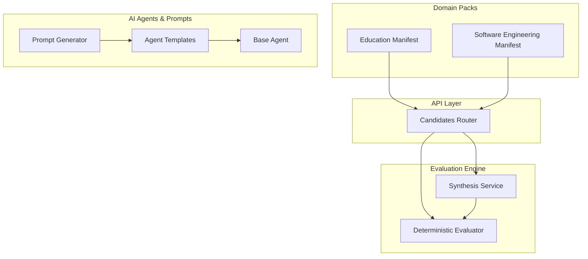
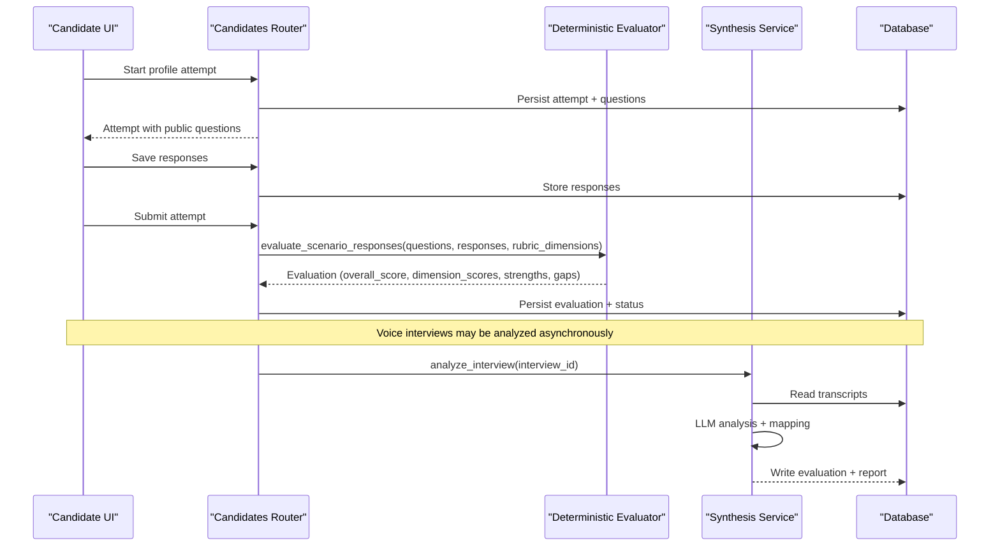
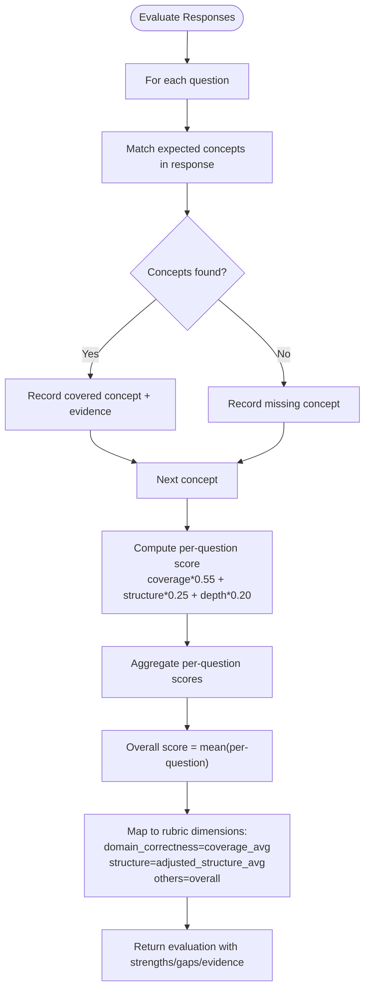
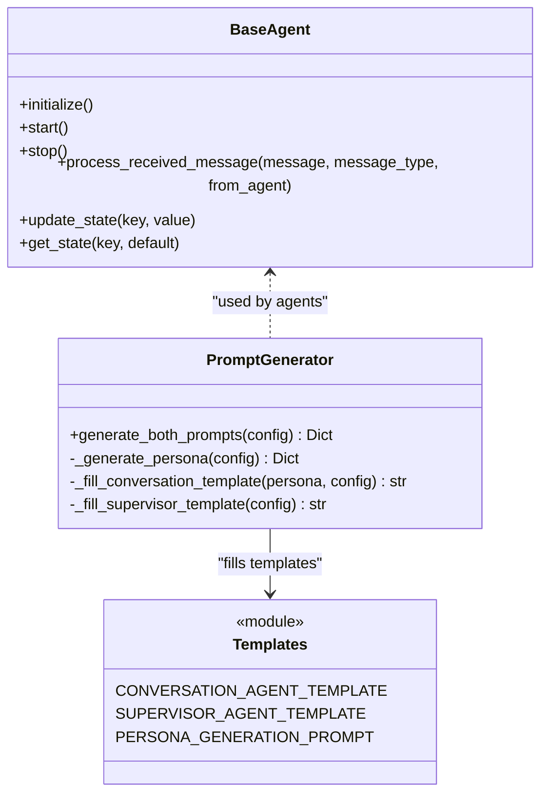
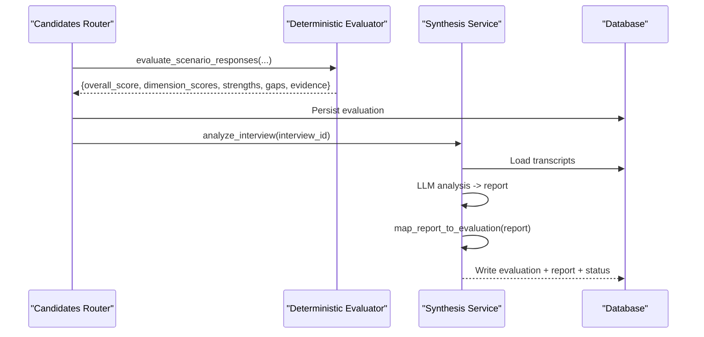
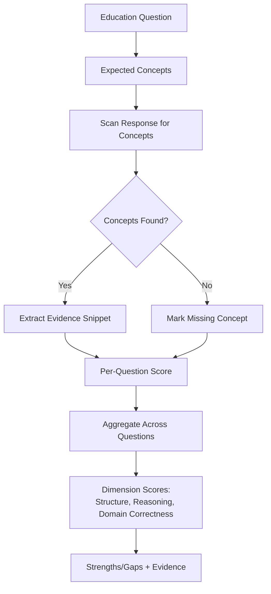
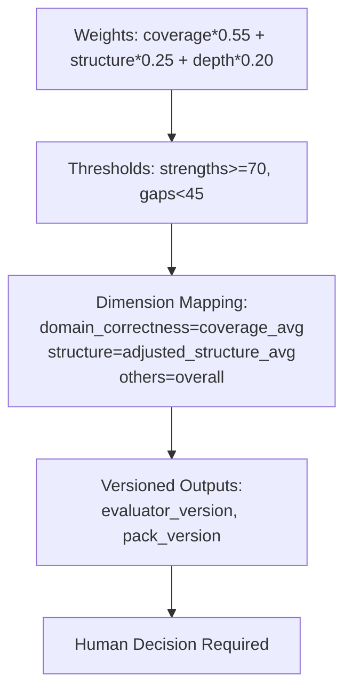
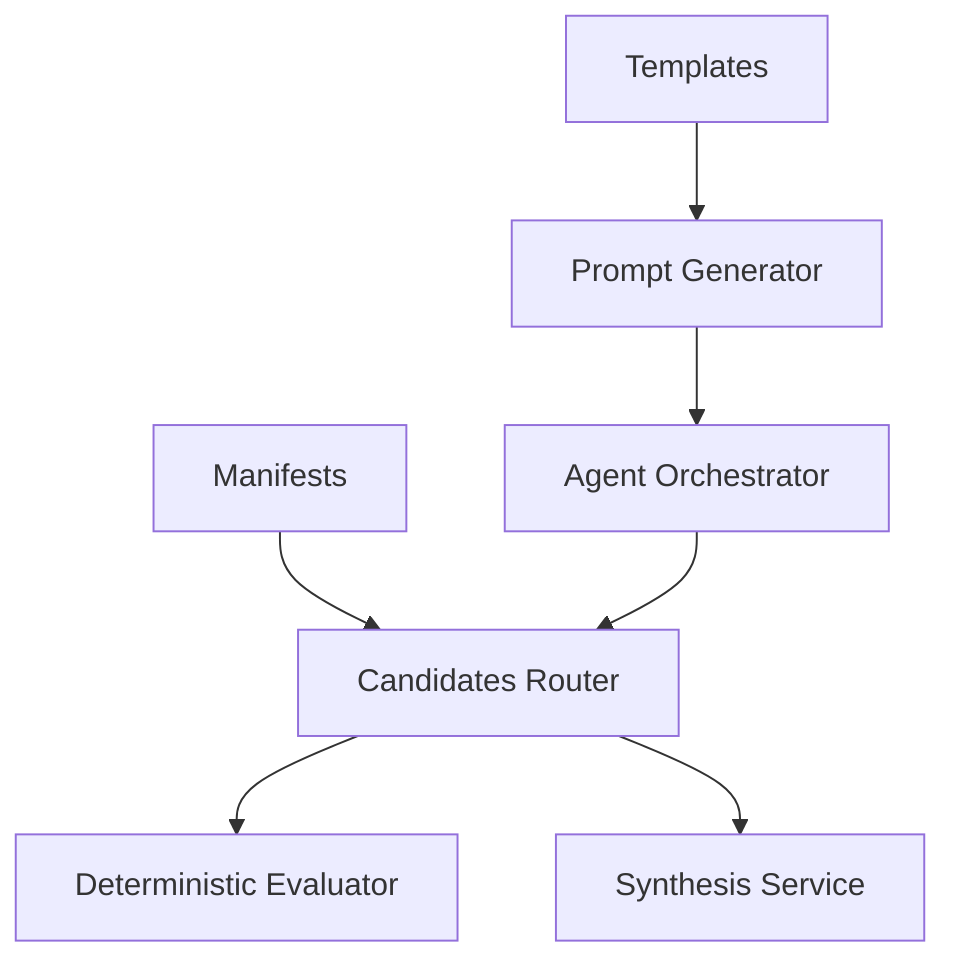

# Evaluation Rubric System

<cite>
**Referenced Files in This Document**
- [evaluation.py](file://Backend/app/domain/evaluation.py)
- [manifest.json (education)](file://domain-packs/education/manifest.json)
- [manifest.json (software-engineering)](file://domain-packs/software-engineering/manifest.json)
- [candidates.py](file://Backend/app/api/v1/candidates.py)
- [analysis_templates.py](file://Backend/app/ai/prompts/analysis_templates.py)
- [synthesis_service.py](file://Backend/app/services/synthesis_service.py)
- [agent_orchestrator.py](file://Backend/app/ai/services/agent_orchestrator.py)
- [generator.py](file://Backend/app/ai/prompts/generator.py)
- [templates.py](file://Backend/app/ai/prompts/templates.py)
- [base.py](file://Backend/app/ai/agents/base.py)
- [rules.md](file://rules.md)
</cite>

## Table of Contents
1. [Introduction](#introduction)
2. [Project Structure](#project-structure)
3. [Core Components](#core-components)
4. [Architecture Overview](#architecture-overview)
5. [Detailed Component Analysis](#detailed-component-analysis)
6. [Dependency Analysis](#dependency-analysis)
7. [Performance Considerations](#performance-considerations)
8. [Troubleshooting Guide](#troubleshooting-guide)
9. [Conclusion](#conclusion)
10. [Appendices](#appendices)

## Introduction
This document explains the domain-specific evaluation rubric system that scores candidate responses against industry standards. It covers how rubric dimensions are defined in domain manifests, how AI agents and deterministic evaluators use these rubrics to evaluate responses, and how scoring algorithms combine multiple criteria into final assessments. It also documents dimension definitions, scoring scales, weighting mechanisms, calibration processes, education-domain examples, and the feedback generation process that provides candidates with actionable insights.

The system is designed so that:
- Domain knowledge lives in manifests, not engine code.
- Evaluations are versioned and reproducible.
- AI outputs are advisory; human decisions remain required for consequential outcomes.
- Evidence is grounded in actual candidate responses or transcripts.

**Section sources**
- [rules.md:16-19](file://rules.md#L16-L19)
- [rules.md:36-47](file://rules.md#L36-L47)

## Project Structure
The evaluation rubric system spans several layers:
- Domain packs define competencies, questions, expected concepts, and rubric dimensions.
- The API layer orchestrates attempts, persists responses, and triggers evaluations.
- Deterministic evaluation computes per-question and overall scores using rubric dimensions.
- AI synthesis analyzes voice interviews and maps results to a unified evaluation format.
- Agents and prompts guide interview flow and ensure coverage of evaluation themes.

**Diagram sources**
- [manifest.json (education):134-140](file://domain-packs/education/manifest.json#L134-L140)
- [manifest.json (software-engineering):131-136](file://domain-packs/software-engineering/manifest.json#L131-L136)
- [candidates.py:429-467](file://Backend/app/api/v1/candidates.py#L429-L467)
- [evaluation.py:28-131](file://Backend/app/domain/evaluation.py#L28-L131)
- [synthesis_service.py:115-151](file://Backend/app/services/synthesis_service.py#L115-L151)
- [generator.py:25-59](file://Backend/app/ai/prompts/generator.py#L25-L59)
- [templates.py:7-252](file://Backend/app/ai/prompts/templates.py#L7-L252)
- [base.py:14-85](file://Backend/app/ai/agents/base.py#L14-L85)

**Section sources**
- [manifest.json (education):1-143](file://domain-packs/education/manifest.json#L1-L143)
- [manifest.json (software-engineering):1-140](file://domain-packs/software-engineering/manifest.json#L1-L140)
- [candidates.py:290-482](file://Backend/app/api/v1/candidates.py#L290-L482)
- [evaluation.py:1-132](file://Backend/app/domain/evaluation.py#L1-L132)
- [synthesis_service.py:1-297](file://Backend/app/services/synthesis_service.py#L1-L297)
- [generator.py:1-290](file://Backend/app/ai/prompts/generator.py#L1-L290)
- [templates.py:1-453](file://Backend/app/ai/prompts/templates.py#L1-L453)
- [base.py:1-85](file://Backend/app/ai/agents/base.py#L1-L85)

## Core Components
- Domain Pack manifests: Define skills, concepts, questions, expected concepts, and rubric dimensions for each industry domain.
- Deterministic evaluator: Scores scenario-based responses using concept coverage, structure, and depth heuristics; derives dimension scores from rubric dimensions.
- Synthesis service: Analyzes voice interview transcripts via LLM prompts, maps results to ATS evaluation format, and integrates identity verification notes.
- Prompt generator and templates: Create agent personas and instructions to ensure consistent interview execution and coverage of evaluation themes.
- Candidate API: Manages attempt lifecycle, persists responses, triggers deterministic evaluation on submission, and returns structured results.

Key responsibilities:
- Manifests provide domain-specific content and rubric dimensions without changing engine code.
- Deterministic evaluation ensures offline, reproducible scoring with evidence citations.
- Synthesis service adds qualitative analysis and maps to standardized evaluation output.
- Agents maintain interview quality and coverage aligned with evaluation goals.

**Section sources**
- [manifest.json (education):134-140](file://domain-packs/education/manifest.json#L134-L140)
- [evaluation.py:28-131](file://Backend/app/domain/evaluation.py#L28-L131)
- [synthesis_service.py:115-151](file://Backend/app/services/synthesis_service.py#L115-L151)
- [generator.py:25-59](file://Backend/app/ai/prompts/generator.py#L25-L59)
- [candidates.py:429-467](file://Backend/app/api/v1/candidates.py#L429-L467)

## Architecture Overview
The evaluation pipeline combines deterministic scoring with optional AI synthesis:

**Diagram sources**
- [candidates.py:294-482](file://Backend/app/api/v1/candidates.py#L294-L482)
- [evaluation.py:28-131](file://Backend/app/domain/evaluation.py#L28-L131)
- [synthesis_service.py:182-259](file://Backend/app/services/synthesis_service.py#L182-L259)

## Detailed Component Analysis

### Rubric Dimensions and Scoring Scales
Rubric dimensions are declared in domain manifests and used by the deterministic evaluator to produce dimension-level scores.

- Education manifest defines three dimensions:
  - Structure: response organization and completeness.
  - Reasoning: cause-and-effect justification.
  - Domain correctness: accurate academic practice and terminology.
- Software engineering manifest mirrors similar dimensions tailored to engineering practice.

Scoring mechanics:
- Per-question score combines:
  - Concept coverage weight (dominant).
  - Structure heuristic based on sentence count and length thresholds.
  - Depth heuristic based on word count.
- Overall score averages per-question scores.
- Dimension scores derive from:
  - Domain correctness mapped to average concept coverage.
  - Structure mapped to an adjusted average derived from per-question scores.
  - Other dimensions default to overall score.

Evidence and transparency:
- Each covered concept includes a short evidence snippet from the candidate’s response.
- Strengths and gaps are aggregated at competency level based on score thresholds.

**Diagram sources**
- [evaluation.py:28-131](file://Backend/app/domain/evaluation.py#L28-L131)

**Section sources**
- [manifest.json (education):134-140](file://domain-packs/education/manifest.json#L134-L140)
- [manifest.json (software-engineering):131-136](file://domain-packs/software-engineering/manifest.json#L131-L136)
- [evaluation.py:28-131](file://Backend/app/domain/evaluation.py#L28-L131)

### How AI Agents Use Rubrics
Agents do not directly compute rubric scores but are guided to elicit responses that align with evaluation themes and KPIs. The prompt generator creates persona-driven conversation and supervisor instructions that enforce dual-axis coverage:
- Axis A: Evaluation description themes.
- Axis B: KPIs and role requirements.

Templates instruct the interviewer to:
- Focus on competencies tied to the job or academic role.
- Probe evidence using STAR method.
- Maintain difficulty and language constraints.
- Avoid off-domain topics and ensure time-bound completion.

Supervisor guidance ensures coverage of both axes and redirects when needed.

**Diagram sources**
- [base.py:14-85](file://Backend/app/ai/agents/base.py#L14-L85)
- [generator.py:25-59](file://Backend/app/ai/prompts/generator.py#L25-L59)
- [templates.py:7-252](file://Backend/app/ai/prompts/templates.py#L7-L252)

**Section sources**
- [generator.py:25-59](file://Backend/app/ai/prompts/generator.py#L25-L59)
- [templates.py:7-252](file://Backend/app/ai/prompts/templates.py#L7-L252)
- [base.py:14-85](file://Backend/app/ai/agents/base.py#L14-L85)

### Feedback Generation Process
Feedback is generated through two complementary paths:

1. Deterministic evaluation feedback:
   - Produces strengths and gaps per competency based on score thresholds.
   - Includes covered concepts with evidence snippets and missing concepts.
   - Provides overall score and dimension scores for transparency.

2. AI synthesis feedback:
   - Analyzes voice interview transcripts using a structured prompt.
   - Returns data quality labels, evidence density, executive summary, sentiment, competency scores, highlights, concerns, STAR analysis, and recommendations.
   - Maps LLM output to ATS evaluation format with scaled scores and rationale.
   - Integrates identity verification verdicts into concerns and summaries.

**Diagram sources**
- [candidates.py:429-467](file://Backend/app/api/v1/candidates.py#L429-L467)
- [evaluation.py:28-131](file://Backend/app/domain/evaluation.py#L28-L131)
- [synthesis_service.py:182-259](file://Backend/app/services/synthesis_service.py#L182-L259)

**Section sources**
- [evaluation.py:28-131](file://Backend/app/domain/evaluation.py#L28-L131)
- [analysis_templates.py:1-76](file://Backend/app/ai/prompts/analysis_templates.py#L1-L76)
- [synthesis_service.py:115-151](file://Backend/app/services/synthesis_service.py#L115-L151)
- [synthesis_service.py:182-259](file://Backend/app/services/synthesis_service.py#L182-L259)

### Education Domain Example: Academic Competency Evaluation
The education pack demonstrates how academic competencies are evaluated:
- Ontology includes skills like curriculum design, lesson planning, student assessment, classroom management, research supervision, academic writing, grant writing, learning outcomes, pedagogy, educational technology, course development, student mentoring, quality assurance, accreditation, data science, computer science, machine learning, cybersecurity, statistics.
- Profile and applied interview questions target competencies such as instructional design, curriculum design, academic integrity, student engagement, inclusive teaching, continuous improvement, course planning, student assessment, subject mastery, research supervision, industry linkage, and student success.
- Expected concepts anchor scoring to concrete academic practices (e.g., formative assessment, learning outcomes, policy, fairness, active learning, accommodations).

Rubric dimensions apply uniformly:
- Structure: organized, sequenced, complete.
- Reasoning: justified decisions with cause-and-effect.
- Domain correctness: correct academic practice and terminology.

**Diagram sources**
- [manifest.json (education):50-132](file://domain-packs/education/manifest.json#L50-L132)
- [manifest.json (education):134-140](file://domain-packs/education/manifest.json#L134-L140)
- [evaluation.py:28-131](file://Backend/app/domain/evaluation.py#L28-L131)

**Section sources**
- [manifest.json (education):1-143](file://domain-packs/education/manifest.json#L1-L143)
- [evaluation.py:28-131](file://Backend/app/domain/evaluation.py#L28-L131)

### Weighting Mechanisms and Calibration Processes
Weighting:
- Per-question score weights:
  - Concept coverage: 0.55
  - Structure: 0.25
  - Depth: 0.20
- Dimension mapping:
  - Domain correctness: average concept coverage across questions.
  - Structure: adjusted average derived from per-question scores.
  - Others: overall score.

Calibration:
- Thresholds classify strengths (score >= 70) and gaps (score < 45).
- Word count thresholds influence structure and depth heuristics.
- Versioning ensures reproducibility and auditability of evaluations.
- Human-in-the-loop requirement ensures AI remains advisory.

**Diagram sources**
- [evaluation.py:57-116](file://Backend/app/domain/evaluation.py#L57-L116)
- [rules.md:36-47](file://rules.md#L36-L47)

**Section sources**
- [evaluation.py:57-116](file://Backend/app/domain/evaluation.py#L57-L116)
- [rules.md:36-47](file://rules.md#L36-L47)

## Dependency Analysis
The evaluation system depends on:
- Domain manifests for questions, expected concepts, and rubric dimensions.
- API endpoints for attempt lifecycle and evaluation triggering.
- Deterministic evaluator for scoring and evidence extraction.
- Synthesis service for transcript analysis and mapping to evaluation format.
- Agent orchestration for interview setup and background tasks.

**Diagram sources**
- [candidates.py:294-482](file://Backend/app/api/v1/candidates.py#L294-L482)
- [evaluation.py:28-131](file://Backend/app/domain/evaluation.py#L28-L131)
- [synthesis_service.py:182-259](file://Backend/app/services/synthesis_service.py#L182-L259)
- [agent_orchestrator.py:42-182](file://Backend/app/ai/services/agent_orchestrator.py#L42-L182)
- [generator.py:25-59](file://Backend/app/ai/prompts/generator.py#L25-L59)
- [templates.py:7-252](file://Backend/app/ai/prompts/templates.py#L7-L252)

**Section sources**
- [candidates.py:294-482](file://Backend/app/api/v1/candidates.py#L294-L482)
- [evaluation.py:28-131](file://Backend/app/domain/evaluation.py#L28-L131)
- [synthesis_service.py:182-259](file://Backend/app/services/synthesis_service.py#L182-L259)
- [agent_orchestrator.py:42-182](file://Backend/app/ai/services/agent_orchestrator.py#L42-L182)
- [generator.py:25-59](file://Backend/app/ai/prompts/generator.py#L25-L59)
- [templates.py:7-252](file://Backend/app/ai/prompts/templates.py#L7-L252)

## Performance Considerations
- Deterministic evaluation runs offline and avoids blocking on AI providers.
- Concept matching uses sentence splitting and substring checks; performance scales linearly with response length and number of expected concepts.
- Structure and depth heuristics are constant-time operations relative to response size.
- Synthesis service uses asynchronous LLM calls with timeouts and JSON parsing; fallbacks exist for insufficient data or failed calls.
- Agent orchestration uses background tasks to avoid blocking user interactions during setup.

[No sources needed since this section provides general guidance]

## Troubleshooting Guide
Common issues and resolutions:
- Insufficient transcript data: Synthesis service returns minimal evaluation with “Insufficient Data” label and recommendations to reschedule.
- LLM analysis failures: Falls back to insufficient report and logs errors; ensure AI configuration is set.
- Identity verification discrepancies: Verdicts are appended to concerns and executive summary; review identity metadata.
- Duplicate submissions: Idempotency keys prevent duplicate evaluations; reuse cached responses.
- Off-domain requests: Agents are instructed to flag and redirect; ensure supervisor guidance is active.

**Section sources**
- [synthesis_service.py:81-112](file://Backend/app/services/synthesis_service.py#L81-L112)
- [synthesis_service.py:268-293](file://Backend/app/services/synthesis_service.py#L268-L293)
- [candidates.py:429-482](file://Backend/app/api/v1/candidates.py#L429-L482)
- [templates.py:58-67](file://Backend/app/ai/prompts/templates.py#L58-L67)

## Conclusion
The evaluation rubric system combines domain-specific manifests, deterministic scoring, and AI synthesis to deliver transparent, evidence-based assessments. Rubric dimensions are clearly defined in manifests and consistently applied across domains. Weighting mechanisms and thresholds produce actionable strengths and gaps. Versioning and human-in-the-loop requirements ensure governance and fairness. The feedback generation process provides candidates with clear insights grounded in their actual responses or transcripts.

[No sources needed since this section summarizes without analyzing specific files]

## Appendices

### Rubric Dimension Definitions
- Structure: Organized, sequenced, complete responses.
- Reasoning: Decisions justified with cause-and-effect thinking.
- Domain correctness: Accurate practice and terminology for the domain.

**Section sources**
- [manifest.json (education):134-140](file://domain-packs/education/manifest.json#L134-L140)
- [manifest.json (software-engineering):131-136](file://domain-packs/software-engineering/manifest.json#L131-L136)

### Scoring Algorithm Summary
- Per-question score = coverage*0.55 + structure*0.25 + depth*0.20.
- Overall score = mean(per-question scores).
- Dimension scores:
  - Domain correctness = average concept coverage.
  - Structure = adjusted average from per-question scores.
  - Others = overall score.

**Section sources**
- [evaluation.py:57-116](file://Backend/app/domain/evaluation.py#L57-L116)

### Governance and Compliance
- AI must never be the final actor on reject/hire/offer decisions.
- All AI artifacts store versions for reproducibility.
- Evidence must cite real segments only.
- Structured AI output must be schema-validated.
- Recalculations create new versions; originals preserved.

**Section sources**
- [rules.md:36-47](file://rules.md#L36-L47)