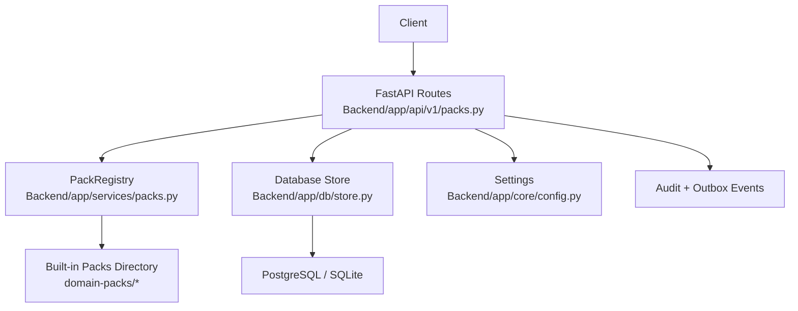
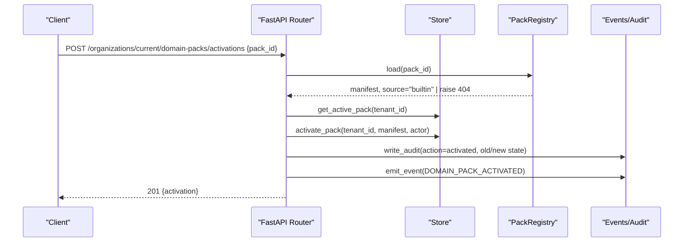
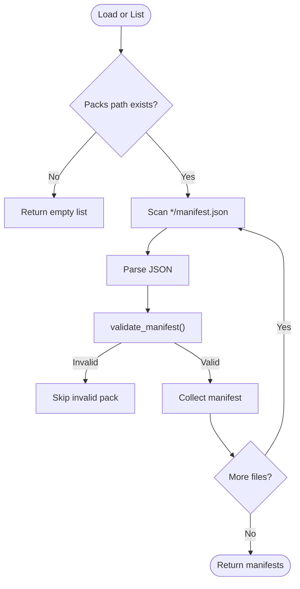
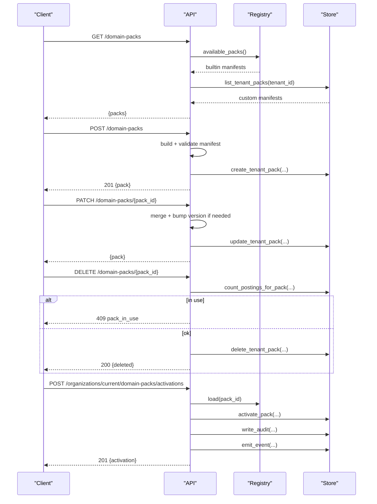
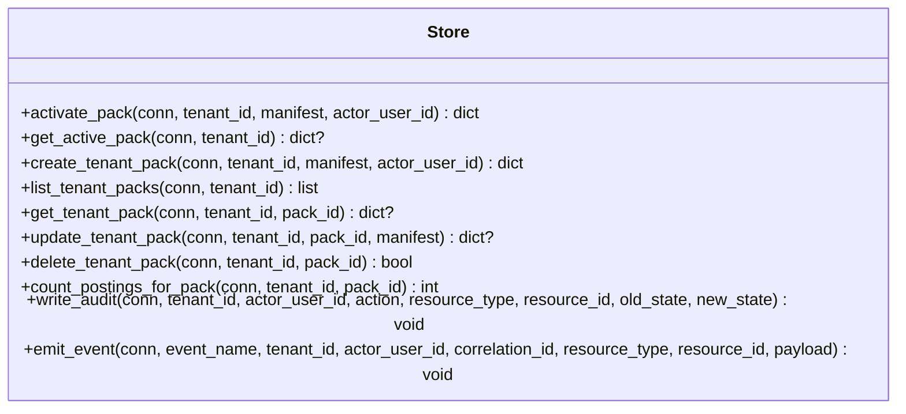
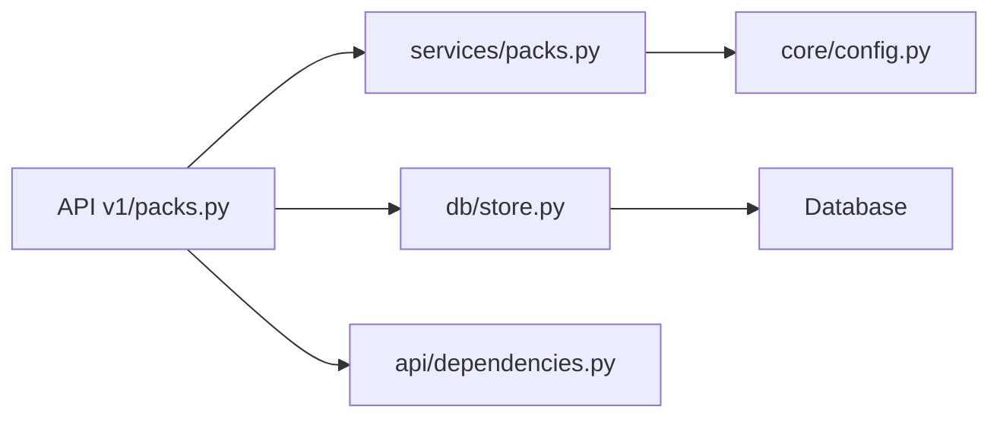

# Pack Management System

<cite>
**Referenced Files in This Document**
- [packs.py](file://Backend/app/api/v1/packs.py)
- [packs_service.py](file://Backend/app/services/packs.py)
- [store.py](file://Backend/app/db/store.py)
- [config.py](file://Backend/app/core/config.py)
- [dependencies.py](file://Backend/app/api/dependencies.py)
- [education_manifest.json](file://domain-packs/education/manifest.json)
- [software_engineering_manifest.json](file://domain-packs/software-engineering/manifest.json)
- [architecture.md](file://architecture.md)
</cite>

## Table of Contents
1. [Introduction](#introduction)
2. [Project Structure](#project-structure)
3. [Core Components](#core-components)
4. [Architecture Overview](#architecture-overview)
5. [Detailed Component Analysis](#detailed-component-analysis)
6. [Dependency Analysis](#dependency-analysis)
7. [Performance Considerations](#performance-considerations)
8. [Troubleshooting Guide](#troubleshooting-guide)
9. [Conclusion](#conclusion)
10. [Appendices](#appendices)

## Introduction
This document describes the pack management system that loads, validates, activates, and manages the lifecycle of domain packs. Domain packs are JSON manifests that define interview questions, evaluation rubrics, matching weights, and other domain-specific behavior. The system exposes APIs to list, create, update, delete, and activate packs, while enforcing tenant isolation, versioning, and auditability. It also documents how built-in packs are discovered from a configured directory and how custom tenant-scoped packs are persisted and activated.

## Project Structure
The pack management system spans several layers:
- API layer: FastAPI routes for listing, creating, updating, deleting, and activating packs.
- Service layer: Pack registry that discovers and validates built-in pack manifests.
- Storage layer: Database operations for tenant packs and active activations, plus event emission and auditing.
- Configuration: Settings that point to the built-in packs directory.
- Manifests: Example built-in packs under domain-packs.

**Diagram sources**
- [packs.py:63-104](file://Backend/app/api/v1/packs.py#L63-L104)
- [packs_service.py:64-96](file://Backend/app/services/packs.py#L64-L96)
- [store.py:649-790](file://Backend/app/db/store.py#L649-L790)
- [config.py:35-41](file://Backend/app/core/config.py#L35-L41)

**Section sources**
- [packs.py:63-104](file://Backend/app/api/v1/packs.py#L63-L104)
- [packs_service.py:64-96](file://Backend/app/services/packs.py#L64-L96)
- [store.py:649-790](file://Backend/app/db/store.py#L649-L790)
- [config.py:35-41](file://Backend/app/core/config.py#L35-L41)

## Core Components
- PackRegistry: Scans a configured directory for built-in packs, validates each manifest, and serves them by pack_id.
- Manifest validation: Enforces required fields, semantic versioning, question structure, task style, and rubric dimensions.
- Tenant pack persistence: Create, update, list, and delete custom tenant-scoped packs; persist active activation per tenant.
- Activation workflow: Atomically activate a pack (built-in or custom), record audit events, and emit an outbox event.
- Dependency injection: PackRegistry is provided via FastAPI dependencies using settings.

Key responsibilities:
- Discovery: List available built-in packs.
- Validation: Ensure manifests conform to the engine contract before activation or use.
- Versioning: Require semantic versions; bump patch versions on updates when not explicitly provided.
- Isolation: Separate built-in vs custom packs; prevent conflicts with reserved IDs.
- Auditability: Record creation, updates, deletions, and activations with old/new state.

**Section sources**
- [packs_service.py:15-62](file://Backend/app/services/packs.py#L15-L62)
- [packs_service.py:64-96](file://Backend/app/services/packs.py#L64-L96)
- [packs.py:151-219](file://Backend/app/api/v1/packs.py#L151-L219)
- [store.py:649-790](file://Backend/app/db/store.py#L649-L790)
- [dependencies.py:204-208](file://Backend/app/api/dependencies.py#L204-L208)

## Architecture Overview
The pack system follows a layered architecture:
- API endpoints accept requests scoped to the current organization context.
- Endpoints resolve pack manifests either from the built-in registry or tenant storage.
- Activations are stored per tenant with the full manifest snapshot at activation time.
- Auditing and events provide observability and enable downstream consumers to react to activations.

**Diagram sources**
- [packs.py:421-472](file://Backend/app/api/v1/packs.py#L421-L472)
- [packs_service.py:81-96](file://Backend/app/services/packs.py#L81-L96)
- [store.py:649-687](file://Backend/app/db/store.py#L649-L687)

## Detailed Component Analysis

### Pack Registry and Manifest Validation
- Discovery: Scans the configured directory for subdirectories containing manifest.json files and returns validated manifests.
- Loading: Loads a specific pack by pack_id and validates its manifest.
- Validation rules:
  - Required keys include identifiers, ontology, matching weights, interview sections, and rubric.
  - Semantic version format enforced.
  - Interview sections must have non-empty questions with required fields and valid task_style.
  - Rubric dimensions must be present and non-empty.

**Diagram sources**
- [packs_service.py:64-79](file://Backend/app/services/packs.py#L64-L79)
- [packs_service.py:34-62](file://Backend/app/services/packs.py#L34-L62)

**Section sources**
- [packs_service.py:34-62](file://Backend/app/services/packs.py#L34-L62)
- [packs_service.py:64-96](file://Backend/app/services/packs.py#L64-L96)

### API Layer: Pack CRUD and Activation
- List packs: Combines built-in packs from the registry with custom tenant packs, including linked job counts.
- Get pack: Resolves a pack manifest from built-in or custom sources and returns summary plus full manifest.
- Create pack: Builds a manifest from request data, validates it, persists as a custom tenant pack, and audits.
- Update pack: Merges partial updates, auto-bumps patch version if omitted, validates, persists, and audits.
- Delete pack: Prevents deletion if built-in or in use by postings; otherwise deletes and audits.
- Activate pack: Resolves manifest, atomically activates, records audit, emits DOMAIN_PACK_ACTIVATED event.
- Get active pack: Returns current activation details for the tenant.

**Diagram sources**
- [packs.py:63-104](file://Backend/app/api/v1/packs.py#L63-L104)
- [packs.py:222-283](file://Backend/app/api/v1/packs.py#L222-L283)
- [packs.py:286-367](file://Backend/app/api/v1/packs.py#L286-L367)
- [packs.py:370-414](file://Backend/app/api/v1/packs.py#L370-L414)
- [packs.py:421-472](file://Backend/app/api/v1/packs.py#L421-L472)

**Section sources**
- [packs.py:63-104](file://Backend/app/api/v1/packs.py#L63-L104)
- [packs.py:222-283](file://Backend/app/api/v1/packs.py#L222-L283)
- [packs.py:286-367](file://Backend/app/api/v1/packs.py#L286-L367)
- [packs.py:370-414](file://Backend/app/api/v1/packs.py#L370-L414)
- [packs.py:421-472](file://Backend/app/api/v1/packs.py#L421-L472)

### Storage Layer: Persistence and Events
- Active activation: Upserts per tenant with pack_id, pack_version, and full manifest snapshot.
- Custom packs: Create, list, get, update, delete tenant_domain_packs.
- Linkage checks: Count postings linked to a pack to enforce deletion constraints.
- Auditing: Write audit records for created, updated, deleted, and activated actions with old/new states.
- Events: Emit DOMAIN_PACK_ACTIVATED with correlation id and payload.

**Diagram sources**
- [store.py:649-790](file://Backend/app/db/store.py#L649-L790)

**Section sources**
- [store.py:649-790](file://Backend/app/db/store.py#L649-L790)

### Configuration and Dependency Injection
- Settings expose domain_packs_path pointing to the built-in packs directory.
- FastAPI dependency provides PackRegistry per request using settings.
- Tests override domain_packs_path to point to repository fixtures.

**Section sources**
- [config.py:35-41](file://Backend/app/core/config.py#L35-L41)
- [dependencies.py:204-208](file://Backend/app/api/dependencies.py#L204-L208)

### Built-in Pack Examples
- Education pack: Defines skills, certifications, concepts, resume extraction signals, matching weights, profile/applied interview questions, and rubric dimensions.
- Software engineering pack: Similar structure tailored to software engineering competencies and practices.

These manifests serve as examples of valid pack content and demonstrate the expected schema used by the registry and validation logic.

**Section sources**
- [education_manifest.json:1-143](file://domain-packs/education/manifest.json#L1-L143)
- [software_engineering_manifest.json:1-140](file://domain-packs/software-engineering/manifest.json#L1-L140)

## Dependency Analysis
- API depends on:
  - PackRegistry for built-in discovery and loading.
  - Store for tenant pack persistence, activation, linkage checks, auditing, and events.
  - Dependencies module for role checks, tenant context, and dependency injection.
- Registry depends on:
  - Filesystem access to the configured packs directory.
  - Validation function for manifest schema enforcement.
- Store depends on:
  - Database connection for persistence.
  - Utility functions for JSON serialization/deserialization and timestamps.

**Diagram sources**
- [packs.py:6-17](file://Backend/app/api/v1/packs.py#L6-L17)
- [packs_service.py:9-13](file://Backend/app/services/packs.py#L9-L13)
- [store.py:649-790](file://Backend/app/db/store.py#L649-L790)
- [dependencies.py:204-208](file://Backend/app/api/dependencies.py#L204-L208)
- [config.py:35-41](file://Backend/app/core/config.py#L35-L41)

**Section sources**
- [packs.py:6-17](file://Backend/app/api/v1/packs.py#L6-L17)
- [packs_service.py:9-13](file://Backend/app/services/packs.py#L9-L13)
- [store.py:649-790](file://Backend/app/db/store.py#L649-L790)
- [dependencies.py:204-208](file://Backend/app/api/dependencies.py#L204-L208)
- [config.py:35-41](file://Backend/app/core/config.py#L35-L41)

## Performance Considerations
- Registry scanning: Iterates over all built-in pack directories on each call to available_packs(). For large numbers of packs, consider caching results between requests or on process startup.
- Manifest parsing and validation: Per-request load() parses JSON and validates; ensure packs remain small and well-formed to avoid latency spikes.
- Database queries: Activation and listing involve simple indexed lookups; ensure tenant_id and pack_id columns are indexed appropriately.
- Event emission: Outbox writes should be lightweight; batch or queue heavy downstream processing off the critical path.

[No sources needed since this section provides general guidance]

## Troubleshooting Guide
Common errors and resolutions:
- Invalid domain pack manifest: Occurs when required keys are missing, version is not semver, interview sections lack questions, or task_style is invalid. Fix the manifest according to validation rules.
- Pack ID reserved: Attempting to create a custom pack with an ID already used by a built-in pack. Choose a different pack_id.
- Pack already exists: Creating a custom pack with an ID already present in the tenant’s store. Update the existing pack instead.
- Pack immutable: Editing or deleting built-in packs is not allowed. Use a custom pack or upgrade to a newer built-in version if supported.
- Pack in use: Deleting a custom pack fails if any postings reference it. Unlink or reassign postings first.
- Domain pack not found: Requested pack_id does not exist in built-in registry or tenant store. Verify pack_id and availability.

Operational tips:
- Always check linked job counts before deletion.
- Use audit logs to trace activation changes and identify who changed the active pack.
- Monitor emitted DOMAIN_PACK_ACTIVATED events to ensure downstream systems receive updates.

**Section sources**
- [packs_service.py:29-62](file://Backend/app/services/packs.py#L29-L62)
- [packs.py:222-283](file://Backend/app/api/v1/packs.py#L222-L283)
- [packs.py:286-367](file://Backend/app/api/v1/packs.py#L286-L367)
- [packs.py:370-414](file://Backend/app/api/v1/packs.py#L370-L414)
- [packs.py:421-472](file://Backend/app/api/v1/packs.py#L421-L472)

## Conclusion
The pack management system provides a robust mechanism to manage domain packs through a clear separation of concerns: discovery and validation via the registry, tenant-scoped persistence and activation via the store, and a clean API surface for administrators. It enforces schema compliance, semantic versioning, tenant isolation, and comprehensive auditing. While hot-reloading of built-in packs is not implemented, the design supports runtime activation of both built-in and custom packs with immediate effect after commit.

[No sources needed since this section summarizes without analyzing specific files]

## Appendices

### API Reference Summary
- List packs: GET /domain-packs
- Get pack: GET /domain-packs/{pack_id}
- Create pack: POST /domain-packs
- Update pack: PATCH /domain-packs/{pack_id}
- Delete pack: DELETE /domain-packs/{pack_id}
- Activate pack: POST /organizations/current/domain-packs/activations
- Get active pack: GET /organizations/current/domain-packs/active

**Section sources**
- [packs.py:63-104](file://Backend/app/api/v1/packs.py#L63-L104)
- [packs.py:222-283](file://Backend/app/api/v1/packs.py#L222-L283)
- [packs.py:286-367](file://Backend/app/api/v1/packs.py#L286-L367)
- [packs.py:370-414](file://Backend/app/api/v1/packs.py#L370-L414)
- [packs.py:421-472](file://Backend/app/api/v1/packs.py#L421-L472)

### Deployment Considerations
- Configure domain_packs_path to point to a read-only directory containing validated built-in packs.
- Ensure database has indexes on tenant_id and pack_id for fast lookups.
- Protect pack management endpoints with appropriate roles (administrator).
- Enable auditing and monitor DOMAIN_PACK_ACTIVATED events for operational visibility.
- Back up tenant_domain_packs and domain_pack_activations tables regularly.

**Section sources**
- [config.py:35-41](file://Backend/app/core/config.py#L35-L41)
- [dependencies.py:165-171](file://Backend/app/api/dependencies.py#L165-L171)
- [store.py:649-790](file://Backend/app/db/store.py#L649-L790)

### Security Validation of Pack Contents
- Manifest validation ensures only safe, schema-compliant packs can be activated.
- Built-in packs are loaded from a controlled filesystem path; custom packs are validated before persistence.
- Role-based access control prevents unauthorized modifications or activations.
- Audit trails capture who activated or changed packs and what changed.

**Section sources**
- [packs_service.py:34-62](file://Backend/app/services/packs.py#L34-L62)
- [dependencies.py:165-171](file://Backend/app/api/dependencies.py#L165-L171)
- [store.py:649-790](file://Backend/app/db/store.py#L649-L790)

### Monitoring Pack Performance
- Track latency of pack listing and activation endpoints.
- Monitor event throughput for DOMAIN_PACK_ACTIVATED.
- Observe database query performance for pack lookups and linkage checks.
- Alert on repeated validation failures indicating malformed manifests.

[No sources needed since this section provides general guidance]

### Version Compatibility and Rollback Strategy
- Versions are semantic; activation stores the exact manifest snapshot at activation time.
- To roll back, activate a previous version by calling the activation endpoint again with the desired pack_id and version.
- Postings created against a pack version should continue to use the pinned version to avoid mid-flight changes.

**Section sources**
- [packs_service.py:34-62](file://Backend/app/services/packs.py#L34-L62)
- [store.py:649-687](file://Backend/app/db/store.py#L649-L687)
- [architecture.md:113-139](file://architecture.md#L113-L139)