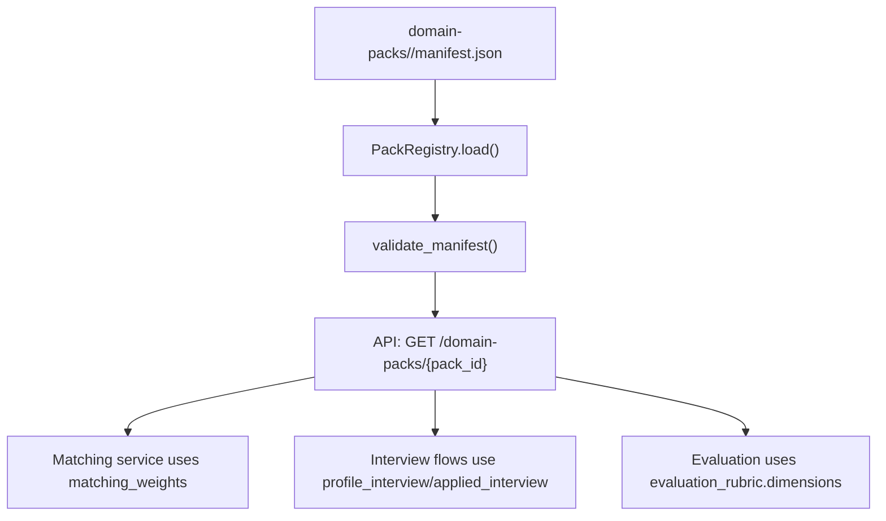
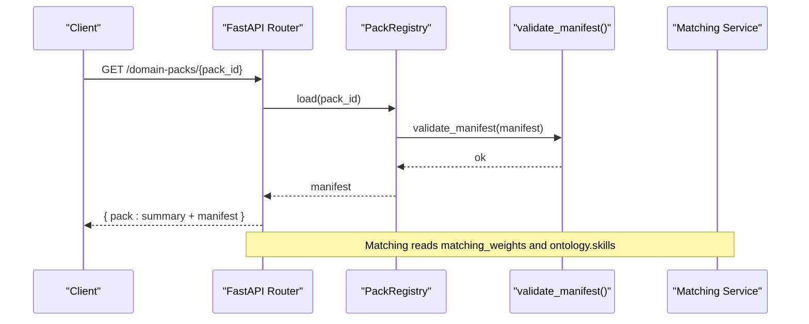
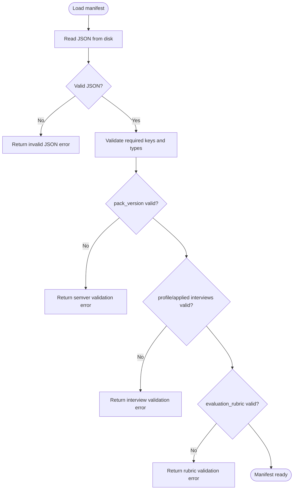
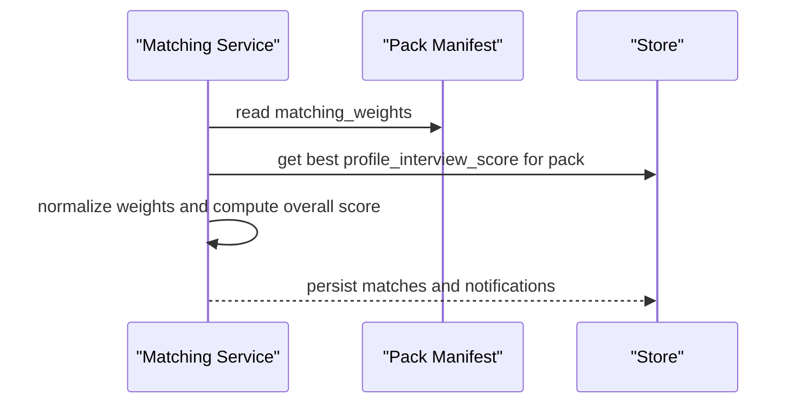
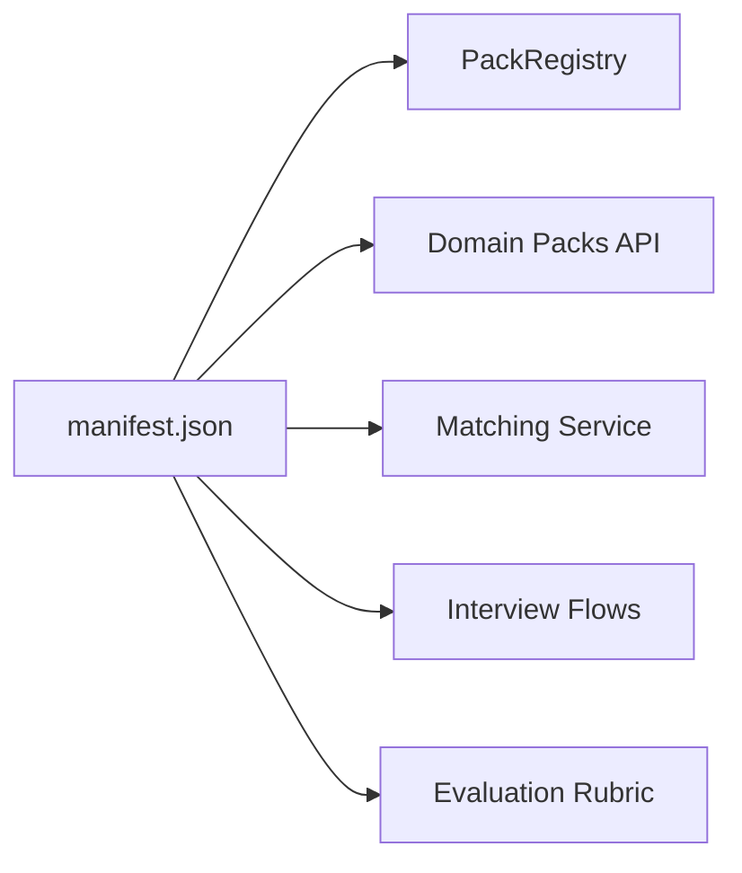

# Pack Manifest Structure

<cite>
**Referenced Files in This Document**
- [manifest.json (Education)](file://domain-packs/education/manifest.json)
- [manifest.json (Software Engineering)](file://domain-packs/software-engineering/manifest.json)
- [packs.py (Pack Registry and Validation)](file://Backend/app/services/packs.py)
- [packs.py (API Endpoints and Schema Builders)](file://Backend/app/api/v1/packs.py)
- [matching.py (Matching Weights Usage)](file://Backend/app/services/matching.py)
</cite>

## Table of Contents
1. [Introduction](#introduction)
2. [Project Structure](#project-structure)
3. [Core Components](#core-components)
4. [Architecture Overview](#architecture-overview)
5. [Detailed Component Analysis](#detailed-component-analysis)
6. [Dependency Analysis](#dependency-analysis)
7. [Performance Considerations](#performance-considerations)
8. [Troubleshooting Guide](#troubleshooting-guide)
9. [Conclusion](#conclusion)
10. [Appendices](#appendices)

## Introduction
This document explains the domain pack manifest file structure used by the system to define domain-specific hiring intelligence. It covers required and optional fields, validation rules, data types, and constraints. It also shows how each section contributes to resume extraction, matching, interview generation, evaluation rubrics, and compliance. Examples are drawn from the Education and Software Engineering packs included in the repository.

## Project Structure
Domain packs are stored as JSON manifests under a per-domain directory. The backend loads these manifests, validates them against an engine contract, and exposes them via API endpoints for listing, retrieval, creation, update, deletion, and activation. Matching logic consumes selected fields to compute candidate scores.

**Diagram sources**
- [packs.py (Pack Registry and Validation):34-62](file://Backend/app/services/packs.py#L34-L62)
- [packs.py (API Endpoints and Schema Builders):86-104](file://Backend/app/api/v1/packs.py#L86-L104)
- [matching.py (Matching Weights Usage):146-156](file://Backend/app/services/matching.py#L146-L156)

**Section sources**
- [packs.py (Pack Registry and Validation):64-97](file://Backend/app/services/packs.py#L64-L97)
- [packs.py (API Endpoints and Schema Builders):63-104](file://Backend/app/api/v1/packs.py#L63-L104)

## Core Components
The manifest defines the domain’s ontology, interview content, evaluation criteria, and scoring weights. The following sections are validated and consumed by the system:

- Identity and versioning
  - pack_id: string identifier for the domain pack
  - pack_version: semantic version string (major.minor.patch)
  - display_name: human-readable name
  - domain: optional description of the domain

- Ontology definitions
  - ontology.skills: list of skill strings
  - ontology.certifications: list of certification strings
  - ontology.concepts: list of concept strings

- Resume extraction rules
  - resume_extraction_rules.signals: list of signal names used by extraction logic

- Matching configuration
  - matching_weights: object with cv_match and profile_interview_score keys

- Interview question sets
  - profile_interview.task_style: scenario or code
  - profile_interview.question_count: integer
  - profile_interview.questions: array of question objects with id, prompt, competency, and optional expected_concepts
  - applied_interview: same structure as profile_interview

- Evaluation rubric
  - evaluation_rubric.dimensions: non-empty list of dimension objects with id, label, and description

- Compliance rules
  - compliance_rules: list of rule identifiers

Examples in this repository:
- Education pack demonstrates academic-focused skills, certifications, concepts, signals, and HEC alignment.
- Software Engineering pack demonstrates engineering-focused skills, certifications, concepts, and signals.

**Section sources**
- [manifest.json (Education):1-143](file://domain-packs/education/manifest.json#L1-L143)
- [manifest.json (Software Engineering):1-140](file://domain-packs/software-engineering/manifest.json#L1-L140)
- [packs.py (Pack Registry and Validation):15-62](file://Backend/app/services/packs.py#L15-L62)

## Architecture Overview
The manifest is loaded from disk, validated, and served through REST endpoints. Matching and interviews consume specific fields to drive scoring and question selection.

**Diagram sources**
- [packs.py (API Endpoints and Schema Builders):86-104](file://Backend/app/api/v1/packs.py#L86-L104)
- [packs.py (Pack Registry and Validation):81-96](file://Backend/app/services/packs.py#L81-L96)
- [matching.py (Matching Weights Usage):146-156](file://Backend/app/services/matching.py#L146-L156)

## Detailed Component Analysis

### Field Reference and Constraints
- pack_id
  - Type: string
  - Required: yes
  - Constraints: unique within scope; reserved if built-in
  - Used by: all endpoints and matching reasons

- pack_version
  - Type: string
  - Required: yes
  - Format: semantic version major.minor.patch (digits only)
  - Used by: activation tracking and audit logs

- display_name
  - Type: string
  - Required: yes
  - Used by: UI summaries and activation responses

- domain
  - Type: string
  - Required: no
  - Used by: pack summaries

- ontology
  - Type: object
  - Required: yes
  - Subfields:
    - skills: array of strings
    - certifications: array of strings
    - concepts: array of strings
  - Used by: skill overlap and matching heuristics

- resume_extraction_rules
  - Type: object
  - Required: no
  - Subfields:
    - signals: array of strings
  - Used by: extraction pipeline to focus on relevant resume sections

- matching_weights
  - Type: object
  - Required: yes
  - Keys:
    - cv_match: number (weight for CV/skill signal)
    - profile_interview_score: number (weight for interview score)
  - Used by: final score computation and normalization

- profile_interview and applied_interview
  - Type: objects
  - Required: yes
  - Fields:
    - task_style: enum ["scenario", "code"]
    - question_count: integer
    - questions: non-empty array of question objects
      - id: string
      - prompt: string
      - competency: string
      - expected_concepts: array of strings (optional)
  - Used by: interview orchestration and evaluation prompts

- evaluation_rubric
  - Type: object
  - Required: yes
  - Subfields:
    - dimensions: non-empty array of dimension objects
      - id: string
      - label: string
      - description: string
  - Used by: scoring rubrics and AI evaluation templates

- compliance_rules
  - Type: array of strings
  - Required: no
  - Used by: policy checks and reporting

Validation rules enforced at runtime:
- All required top-level keys must be present
- pack_version must be valid semver
- Each interview block must have a non-empty questions array
- Each question must include id, prompt, and competency
- task_style must be scenario or code
- evaluation_rubric.dimensions must be a non-empty list

**Section sources**
- [packs.py (Pack Registry and Validation):15-62](file://Backend/app/services/packs.py#L15-L62)
- [packs.py (API Endpoints and Schema Builders):107-149](file://Backend/app/api/v1/packs.py#L107-L149)
- [manifest.json (Education):1-143](file://domain-packs/education/manifest.json#L1-L143)
- [manifest.json (Software Engineering):1-140](file://domain-packs/software-engineering/manifest.json#L1-L140)

### Data Flow: Loading and Validating a Pack

**Diagram sources**
- [packs.py (Pack Registry and Validation):34-62](file://Backend/app/services/packs.py#L34-L62)
- [packs.py (Pack Registry and Validation):81-96](file://Backend/app/services/packs.py#L81-L96)

### How Matching Uses the Manifest
The matching service reads matching_weights to blend CV-based similarity with interview performance. It also uses ontology.skills to compute skill overlap and may boost scores when embeddings align with skills.

**Diagram sources**
- [matching.py (Matching Weights Usage):146-156](file://Backend/app/services/matching.py#L146-L156)
- [matching.py (Matching Weights Usage):223-233](file://Backend/app/services/matching.py#L223-L233)

**Section sources**
- [matching.py (Matching Weights Usage):115-187](file://Backend/app/services/matching.py#L115-L187)

### Example Packs

#### Education Pack
- Highlights academic skills, certifications, and concepts aligned with higher education standards.
- Signals focus on publications, rankings, teaching experience, and research supervision.
- Profile and applied interviews emphasize instructional design, assessment, curriculum planning, and student success.
- Evaluation rubric includes structure, reasoning, and domain correctness.
- Compliance references HEC alignment.

**Section sources**
- [manifest.json (Education):1-143](file://domain-packs/education/manifest.json#L1-L143)

#### Software Engineering Pack
- Emphasizes system design, API design, testing, observability, and security basics.
- Signals include languages, frameworks, system design artifacts, open source contributions, and production incidents.
- Profile and applied interviews target incident response, API design, scalability, and delivery judgment.
- Evaluation rubric mirrors structure, reasoning, and domain correctness tailored to engineering practice.

**Section sources**
- [manifest.json (Software Engineering):1-140](file://domain-packs/software-engineering/manifest.json#L1-L140)

## Dependency Analysis
The manifest is central to multiple subsystems:

- Pack Registry: loads and validates manifests
- API layer: lists, retrieves, creates, updates, deletes, and activates packs
- Matching service: reads matching_weights and ontology.skills
- Interview flows: consume profile_interview and applied_interview
- Evaluation: consumes evaluation_rubric.dimensions

**Diagram sources**
- [packs.py (Pack Registry and Validation):64-97](file://Backend/app/services/packs.py#L64-L97)
- [packs.py (API Endpoints and Schema Builders):63-104](file://Backend/app/api/v1/packs.py#L63-L104)
- [matching.py (Matching Weights Usage):146-156](file://Backend/app/services/matching.py#L146-L156)

**Section sources**
- [packs.py (Pack Registry and Validation):64-97](file://Backend/app/services/packs.py#L64-L97)
- [packs.py (API Endpoints and Schema Builders):63-104](file://Backend/app/api/v1/packs.py#L63-L104)
- [matching.py (Matching Weights Usage):115-187](file://Backend/app/services/matching.py#L115-L187)

## Performance Considerations
- Keep question arrays concise to reduce payload size and processing time.
- Use matching_weights to balance CV and interview signals appropriately for your domain.
- Prefer embedding-based similarity when available; otherwise rely on skill overlap heuristics.
- Avoid excessively large resumes; extraction enforces limits and truncation.

[No sources needed since this section provides general guidance]

## Troubleshooting Guide
Common validation errors and their causes:
- Missing required key: one of pack_id, pack_version, display_name, ontology, matching_weights, profile_interview, applied_interview, evaluation_rubric is absent
- Invalid pack_version: not a semantic version like major.minor.patch
- Invalid interview questions: missing id, prompt, or competency; empty questions array
- Invalid task_style: not scenario or code
- Invalid rubric: dimensions missing or empty

Resolution steps:
- Ensure all required keys are present and correctly typed
- Fix pack_version to digits-only segments separated by dots
- Add required fields to each question and ensure at least one question per interview
- Set task_style to scenario or code
- Provide at least one evaluation dimension

Error handling paths:
- JSON decode failures return a validation error
- Missing pack returns a not found error
- Custom pack creation/update validates the built manifest before persistence

**Section sources**
- [packs.py (Pack Registry and Validation):29-62](file://Backend/app/services/packs.py#L29-L62)
- [packs.py (Pack Registry and Validation):81-96](file://Backend/app/services/packs.py#L81-L96)
- [packs.py (API Endpoints and Schema Builders):222-283](file://Backend/app/api/v1/packs.py#L222-L283)

## Conclusion
The domain pack manifest is the single source of truth for domain-specific hiring intelligence. It defines the vocabulary (ontology), interview content, evaluation criteria, and scoring weights that power matching, interviews, and assessments. By adhering to the validation rules and using the examples from Education and Software Engineering packs, you can create robust, maintainable domain packs that integrate seamlessly with the system.

[No sources needed since this section summarizes without analyzing specific files]

## Appendices

### Appendix A: Minimal Valid Manifest Skeleton
A minimal valid manifest must include identity fields, ontology, matching_weights, both interview blocks with questions, and evaluation_rubric.dimensions. Optional fields include domain, resume_extraction_rules.signals, and compliance_rules.

**Section sources**
- [packs.py (Pack Registry and Validation):15-62](file://Backend/app/services/packs.py#L15-L62)
- [manifest.json (Education):1-143](file://domain-packs/education/manifest.json#L1-L143)
- [manifest.json (Software Engineering):1-140](file://domain-packs/software-engineering/manifest.json#L1-L140)

### Appendix B: Best Practices
- Use clear, domain-specific skills and concepts to improve matching accuracy.
- Align interview questions with competencies and expected concepts to guide evaluation.
- Tune matching_weights to reflect the relative importance of CV vs interview performance.
- Maintain compliance_rules to enforce organizational policies.
- Version packs with semantic versions to track changes and enable rollbacks.

**Section sources**
- [matching.py (Matching Weights Usage):146-156](file://Backend/app/services/matching.py#L146-L156)
- [packs.py (API Endpoints and Schema Builders):214-219](file://Backend/app/api/v1/packs.py#L214-L219)